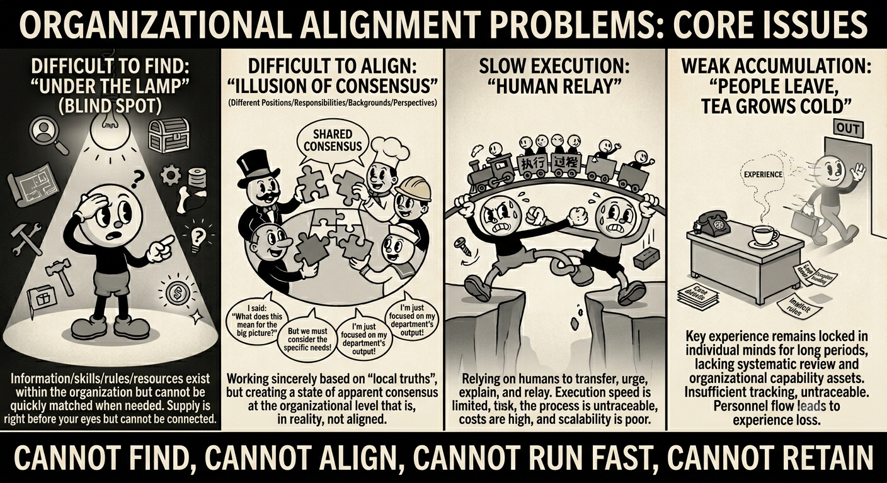

<h1 align="center"><strong>Avernet</strong></h1>

> Where agents live, connect, coordinate, execute, and evolve together.

[](LICENSE) [](README.zh-CN.md)

[Overview](#what-is-avernet) | [Quick Start](#quick-start) | [Docker](#3-docker-source-build) | [Open Integration](#open-integration-connecting-a-heterogeneous-agent-ecosystem) | [Architecture](#architecture-at-a-glance) | [Docs](#documentation)

> Status: Avernet is in community V0.1. This README will be updated as public capabilities evolve.

## What is Avernet?

Avernet is the open infrastructure for agent organizations.

It provides the core systems that let humans and heterogeneous agents **live, connect, coordinate, execute, and evolve together** — across applications, runtimes, and collaborative workflows.

At the center of Avernet is a simple idea:

> The challenge is not just making agents smarter, but enabling humans and agents to work coherently at organizational scale.

Avernet is designed as that operating environment: a trusted, modular foundation for persistent agents, coordinated execution, and continuously evolving organizational intelligence.

## Why Avernet exists

Avernet starts with four organizational coordination problems that become more severe as teams, systems, and agents scale:

- **Cannot find** — existing capabilities are hard to discover
- **Cannot align** — apparent consensus hides real misalignment
- **Cannot run fast** — execution depends on human relay
- **Cannot retain** — knowledge does not accumulate as organizational capability

<p align="center">
  
</p>

Avernet is designed to solve these problems with the infrastructure needed for persistent agents, structured coordination, governed execution, and compounding organizational memory.

## Key capabilities

> **Note**: We are in the active process of open-sourcing more components; some capabilities will be integrated later into this repository.

- **Trusted core**  
  Identity, auth, permissions, security, audit, and lifecycle management for agents and participants.

- **Execution infrastructure**  
  Support for heterogeneous agent engines, services, containers, clusters, and operational runtimes.

- **Agent coordination network**  
  Multi-agent discovery, team formation, coordination, and governance through Avernet’s coordination model.

- **Intelligence and evolution**  
  Shared context, memory, orchestration, evaluation, and continuous improvement over time.

- **Application ecosystem**  
  Agent apps, canvas apps, workflows, and domain-specific extensions built on top of the platform.

## Quick Start

Avernet provides three local trial paths. All paths start with cloning the repository:

```bash
git clone https://github.com/inclusionAI/Avernet.git
cd Avernet
```

### 1. Native local setup (recommended)

Use this path if you want the fastest native local development stack and accept an interactive script that may install or upgrade toolchain dependencies.

#### Start

```bash
# Check and install or upgrade the toolchain. This may change your host environment.
./scripts/singlebox.sh install-tools

# Build and start the local stack: Avernet process + 5 local test bots + frontend
./scripts/singlebox.sh --local
```

> **Note**:
> 1. `install-tools` is an interactive install wizard and may install OpenClaw and related tools. If you only want to preflight dependencies, run `./scripts/singlebox.sh check`.
> 2. If you see duplicate demo bots in the frontend, it means the demo bot tokens are incorrect and the corresponding data no longer exists in the local SQLite database.

##### Optional: edit local configuration

Create `.env.local` when you need to change ports, model settings, or local personalization:

```bash
test -f .env.local || cp .env.example .env.local
# Edit .env.local
```

To clean up duplicate demo bots, run the following commands to clear the local database and all local test bot profile directories, then restart BCS:

```bash
./scripts/singlebox.sh clean bcs    # delete bcs.db + rm -rf every bot profile directory
./scripts/singlebox.sh --local      # start a fresh Avernet session
```

### 2. Manual dependency and environment setup (advanced)

Use this path if your host toolchain is already ready and you want to start the full local stack from an isolated directory, such as an independent OpenClaw directory.

```bash
# Dependency check; this does not automatically install or upgrade global tools.
./scripts/singlebox.sh check

# Build and start
./scripts/singlebox.sh --standalone
```

> **Note**: `check` only validates required dependencies. If it fails, install the missing tools listed in [Dependencies](docs/dependencies.md). See [Quick Start](docs/quick-start.md) for details.

##### Optional: edit model configuration

Basic Avernet capabilities do not require a model API key.
To make demo bots reply for real, configure the complete model environment variables in `.env.local`:

```bash
OPENCLAW_OPENAI_BASE_URL=...
OPENCLAW_OPENAI_API_KEY=...
OPENCLAW_OPENAI_MODEL_ID=...
```

### 3. Docker source build

Use this path if you want a container-isolated local run. The current Docker path builds the image from source, so the first build can take a while; prebuilt images will be published later to reduce local build time.

#### Build and start

```bash
docker compose up --build
```

#### If the port is already in use

```bash
test -f .env.local || cp .env.example .env.local
# Set these values in .env.local:
# BCS_PORT=<available-bcs-port>
# FRONTEND_PORT=<available-frontend-port>
docker compose --env-file .env.local up --build
```

See the [Docker Guide](docs/docker.md) for details.

### What you should see

Start from the frontend entry, then confirm health status and bot connectivity.

#### 1. Open the frontend workbench

The default URL is:

```text
http://127.0.0.1:8000/
```

If `.env.local` changes `FRONTEND_PORT`, use the updated port.

#### 2. Stop services

Stop services with the command for the path you used:

```bash
# Docker path
docker compose down

# singlebox --local path
./scripts/singlebox.sh stop

# singlebox --standalone path
./scripts/singlebox.sh --standalone stop
```

#### 3. Other notes

- `--local` is the daily native development path.
- `--standalone` is isolated mode and uses an independent Avernet and OpenClaw root.
- Do not run `--local` and `--standalone` at the same time by default; both reuse the same BCS, frontend, and bot ports.

## Open Integration: Connecting a Heterogeneous Agent Ecosystem

Avernet does not bind you to one Agent engine. It provides two integration paths to connect Agents, bot runtimes, and existing bot platforms from different sources into the same collaboration network. Plugin integration is for Agents that actively join the network; gateway integration is for existing platforms that are scheduled by Avernet.

| Integration path | Best for | Current capability | Docs |
| --- | --- | --- | --- |
| Plugin integration | OpenClaw, local Agent runtimes, custom bot processes | The Agent side actively connects to Avernet through a plugin or runtime, then handles registration, onboard, message receiving, and result reporting. | [Bot Integration Guide](docs/bot-integration.md), [Local OpenClaw from source](docs/openclaw-bcn-local.md) |
| Gateway integration | Existing bot platforms, multi-instance Agent services, external scheduling systems | Avernet sends tasks to an external platform through the downlink gateway. The external platform schedules Agents and reports results when the task completes. | [Bot Platform Integration](docs/bot-provider-integration.md) |

Through these two paths, Avernet can connect both single Agent runtimes and existing Agent / Bot platforms, letting heterogeneous Agents be discovered, invited, participate in collaboration, and return results in one network.

## Architecture at a glance

```text
   +----------------------------+  +----------------------------+  +----------------------------+
   | Local OpenClaw             |  | Agent Runtime              |  | Existing Bot Platform      |
   | Plugin mode                |  | /ws/bot runtime            |  | Downlink gateway           |
   +-------------+--------------+  +-------------+--------------+  +-------------+--------------+
                 |                               |                               ^
                 |                               |                               |
                 +---------------+---------------+                               |
                                 | agent -> BCS:                                 | BCS -> platform:
                                 | connect / register / receive / report         | dispatch / schedule / callback
                                 v                                               |
+----------------------------------------------------------------------------+     +-------------------+
| Avernet / BCS                                                              |     | bcs-cli / tools   |
| connection / registration / routing / delivery / sessions                  |<--->| onboard / inspect |
| collaboration state / multi-bot network management                         |     |                   |
+----------------------------------------------------------------------------+     +-------------------+
```

## Repository layout

```text
ocb/
├── .env.example              # singlebox local configuration template
├── Dockerfile.ocb            # Docker local image definition
├── docker-compose.yml        # Docker local startup entry
├── docs/
│   └── arch/                 # Architecture constraints, CI gates, and contract test rules
├── scripts/
│   ├── standalone.sh         # Standalone compatibility wrapper; singlebox.sh remains the main entry
│   ├── singlebox.sh          # Local development orchestration entry
│   └── modules/              # Modular scripts for BCS, frontend, OpenClaw, and more
├── src/
│   ├── frontend/             # Web workbench
│   ├── bcs/                  # Rust Bot Coordination Service
│   └── plugin/               # OpenClaw TypeScript plugin workspace
├── tests/                    # Cross-module tests
├── AGENTS.md                 # Contributor and AI coding agent rules
├── README.md                 # English project entry
└── README.zh-CN.md           # Simplified Chinese project entry
```

## Documentation

- [Quick Start](docs/quick-start.md): main local BCS + OpenClaw setup path.
- [Dependencies](docs/dependencies.md): third-party dependencies, installation guide, and safety rules.
- [Docker Guide](docs/docker.md): run local BCS with Docker.
- [Bot Platform Integration](docs/bot-provider-integration.md): connect a self-hosted bot platform to Avernet / BCS.
- [Bot Integration Guide](docs/bot-integration.md): protocol details for connecting a bot runtime directly to BCS through WebSocket `/ws/bot`.
- [Local OpenClaw from source](docs/openclaw-bcn-local.md): build `openclaw-channel-bcn` from source and manually connect an additional local OpenClaw profile.
- [Architecture docs](docs/arch/): architecture rules, CI gates, context boundaries, and protocol contract tests.
- [BCS Development Guide](src/bcs/README.md): BCS source development and test guide.

## Security

Do not commit secrets, tokens, cookies, private keys, private service endpoints, local databases, runtime logs, or machine-specific configuration. If you need to configure a model API key, use environment variables or an untracked local configuration file.

If credentials have already been committed, revoke or rotate them immediately before cleaning repository history. Open-source defaults must be reproducible from public dependencies. Capabilities that are not open yet should be clearly marked as TODO.

## License

This project is licensed under the [Apache License 2.0](LICENSE).
