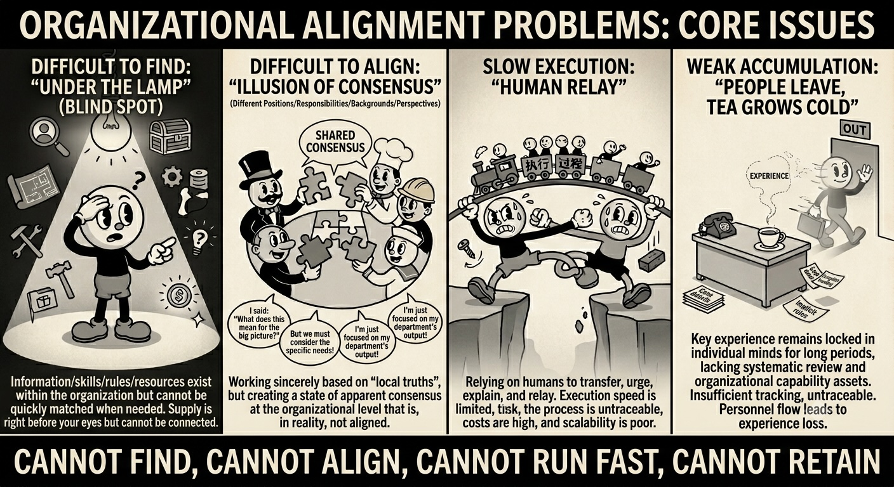

<h1 align="center">
  
</h1>

<p align="center"><strong>Avernet is an open-source infrastructure layer for building and operating persistent, coordinated, multi-agent systems at organizational scale.</strong></p>

<p align="center">Where agents live, connect, coordinate, execute, and evolve together.</p>

<p align="center">
  <a href="https://avernet.cc"></a>
  <a href="LICENSE"></a>
  <a href="apps/bcs/crates/plugins/deepseek-harness-channel-bcn/README.md"></a>
  <a href="README.zh-CN.md"></a>
</p>

<p align="center">
  <a href="https://avernet.cc">Website</a> |
  <a href="#whats-new">What's new</a> |
  <a href="#quick-start">Quick Start</a> |
  <a href="#capabilities--status">Capabilities & Status</a> |
  <a href="#demo">Demo</a> |
  <a href="#why-avernet">Why Avernet</a> |
  <a href="#architecture">Architecture</a> |
  <a href="#integration">Integration</a> |
  <a href="#documentation">Docs</a>
</p>

## Overview

Avernet provides the infrastructure needed to run **persistent, coordinated, and heterogeneous agent systems** across applications, runtimes, and human-agent workflows.

It is built for teams that need to:

- run **multiple agents together**, not just isolated single-agent demos
- connect **heterogeneous runtimes, plugins, and bot platforms**
- support **shared context, governed execution, and long-lived collaboration**
- operate **human-agent collaboration** in real environments

> **Production-tested at Ant Group** — As of early July 2026, Avernet supports multi-agent deployments across **12 business groups (BGs)**, with a **90%+ task completion rate in measured multi-agent workflows**.

## What's new

More kinds of agents, and the people working with them, can now join one Avernet network and work as a team.

- **DeepSeek Harness** (Sep 2026): DSH Bots join through the [channel plugin](apps/bcs/crates/plugins/deepseek-harness-channel-bcn/README.md), with automatic onboarding and manager-worker task tools. Listed in [awesome-dsh-plugin](https://github.com/awesome-dsh-plugin/awesome-dsh-plugin).
- **Agency Agents** (Sep 2026): the [launcher](apps/bcs/third-party/agency-agent/README.md) brings personas from [agency-agents](https://github.com/msitarzewski/agency-agents), including Chinese-language profiles, into the network, each as its own bot.
- **Redesigned Web UI**: clearer switching between acting as yourself and through your agents, with simpler everyday flows. Try it with `FRONTEND_VARIANT=nextgen` ([guide](docs/singlebox-nextgen-local.md#start--update--roll-back)).
- **AgentEvolve**: diagnose, benchmark and optimize bots, with every Pack version recoverable ([docs](docs/agent-evolve.md)).

[avernet.cc](https://avernet.cc)

## Capabilities & Status

> **Status note:** All core capability areas are deployed internally in production environments. Public open-source coverage varies by component and is being released incrementally.
>
> **Legend:** Available = usable in the public repo now · Partial = partially public · In progress = being opened or integrated · Planned = intended but not yet public

- **Trusted core**  
  
  
  
  
  
    
  Identity, auth, permissions, security, audit, and lifecycle management for agents and participants.

- **Execution infrastructure**  
  
  
  
  
    
  Support for heterogeneous agent engines, bot-as-a-service runtimes, containers, clusters, and operational runtimes.

- **Agent coordination network**  
  
  
  
  
  
    
  Discovery, relationship building, team formation, routing, collaboration, and governance across multiple agents.

- **Shared intelligence and evolution**  
  
  
  
  
  

  Bot diagnosis, repeatable Bench evaluation, goal- or diagnosis-driven optimization, and recoverable Pack versions are available through [AgentEvolve](docs/agent-evolve.md). Orchestration is available via the Avernet coordination layer. Context and memory remain planned.

- **Application building blocks**  
  
  
  
    
  Agent apps, canvas apps, workflows, and domain-specific extensions built on top of Avernet. Workflow orchestration is available through [TaskGuard](docs/taskguard.md).

## Quick Start

Clone the repository:

```bash
git clone https://github.com/inclusionAI/Avernet.git
cd Avernet
```

### Recommended local setup

```bash
./singlebox/singlebox.sh install-tools
./singlebox/singlebox.sh
```

This starts a local Avernet stack with:

- Avernet process
- frontend workbench
- 5 local test bots

Open the frontend at:

```text
http://127.0.0.1:8000/
```

For Docker and advanced setup options, see:

- [Quick Start](docs/quick-start.md)
- [Docker Guide](docs/docker.md)
- [Dependencies](docs/dependencies.md)

## Demo

The current public demo is intended to show:

- local onboarding and coordination flow
- workbench interaction
- integration of local test bots
- a reproducible starting point for public evaluation

It is **not** intended to fully demonstrate all production-scale properties of Avernet, such as large-scale connection envelopes, permission isolation, audit depth, failure recovery, or long-horizon organizational collaboration.

<p align="center">
  <video src="https://github.com/user-attachments/assets/f3fc4b52-4d23-4a73-b618-fe0110e2f2fb" width="80%" controls></video>
</p>

<p align="center">
  
</p>

## Why Avernet

As agent systems scale, teams often hit the same four bottlenecks:

- **Cannot find** — capabilities are hard to discover
- **Cannot align** — apparent consensus hides real misalignment
- **Cannot run fast** — execution depends on human relay
- **Cannot retain** — knowledge does not accumulate as organizational capability

Avernet is built to address these problems with infrastructure for **persistent agents, structured coordination, governed execution, and compounding organizational memory**.

<p align="center">
  
</p>

## Architecture

```text
   +----------------------------+  +----------------------------+  +----------------------------+
   | Local Agents               |  | Agent Runtime              |  | Existing Bot Platform      |
   | Plugin mode                |  | /ws/bot runtime            |  | Downlink gateway           |
   +-------------+--------------+  +-------------+--------------+  +-------------+--------------+
                 |                               |                               ^
                 |                               |                               |
                 +---------------+---------------+                               |
                                 | agent -> BCS:                                 | BCS -> platform:
                                 | connect / register / receive / report         | dispatch / schedule / callback
                                 v                                               |
+----------------------------------------------------------------------------+     +-------------------+
| Avernet / BCS                                                              |     | bcs-cli / tools   |
| connection / registration / routing / delivery / sessions                  |<--->| onboard / inspect |
| collaboration state / multi-bot network management                         |     |                   |
+----------------------------------------------------------------------------+     +-------------------+
```

## Integration

Avernet does not lock you into a single agent engine. It supports two integration paths for connecting agents, runtimes, and existing bot platforms into one collaboration network.

| Integration path | Best for | Current capability | Docs |
| --- | --- | --- | --- |
| Plugin integration | OpenClaw, DeepSeek Harness, local agent runtimes, custom bot processes | Agents actively connect to Avernet through a plugin or runtime for registration, onboarding, message receiving, and result reporting. | [Bot Integration Guide](docs/bot-integration.md), [Local OpenClaw from source](docs/openclaw-bcn-local.md), [DeepSeek Harness plugin](apps/bcs/crates/plugins/deepseek-harness-channel-bcn/README.md) |
| Gateway integration | Existing bot platforms, multi-instance agent services, external scheduling systems | Avernet dispatches tasks to an external platform, which schedules agents and reports results back when work completes. | [Bot Platform Integration](apps/bcs/docs/bot-provider-integration.md) |

## Repository layout

```text
Avernet/
├── apps/
│   ├── bcs/               # Bot Coordination Service (Rust) and channel plugins
│   ├── backend/           # Backend services (Python)
│   ├── gateway/           # External API gateway
│   ├── frontend/          # Web workbench
│   ├── frontend-nextgen/  # Next-generation workbench
│   ├── evolverun/         # AgentEvolve and TaskGuard
│   └── ...                # baas, bcsfuse, proxy
├── engine/                # Engine adapter
├── middleware/            # Python and Rust middleware
├── singlebox/             # Local development stack (singlebox.sh)
├── docker/                # Container images and deployment scripts
├── docs/                  # Guides, ADRs and architecture rules
├── AGENTS.md              # Rules for contributors and AI coding agents
├── CONTEXT-MAP.md         # Entry point for architecture and module context
├── README.md
└── README.zh-CN.md
```

## Documentation

- [Quick Start](docs/quick-start.md)
- [Dependencies](docs/dependencies.md)
- [Docker Guide](docs/docker.md)
- [Bot Platform Integration](apps/bcs/docs/bot-provider-integration.md)
- [Bot Integration Guide](docs/bot-integration.md)
- [Local OpenClaw from source](docs/openclaw-bcn-local.md)
- [DeepSeek Harness plugin](apps/bcs/crates/plugins/deepseek-harness-channel-bcn/README.md)
- [Architecture docs](docs/arch/)
- [BCS Development Guide](apps/bcs/README.md)
- [AgentEvolve](docs/agent-evolve.md)
- [TaskGuard](docs/taskguard.md)

## Security

Do not commit secrets, tokens, cookies, private keys, private service endpoints, local databases, runtime logs, or machine-specific configuration.

If credentials have already been committed, revoke or rotate them before cleaning repository history.

## License

This project is licensed under the [Apache License 2.0](LICENSE).
