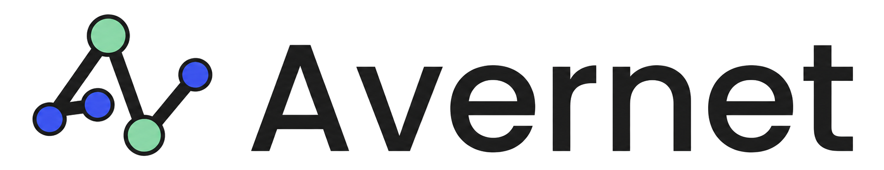
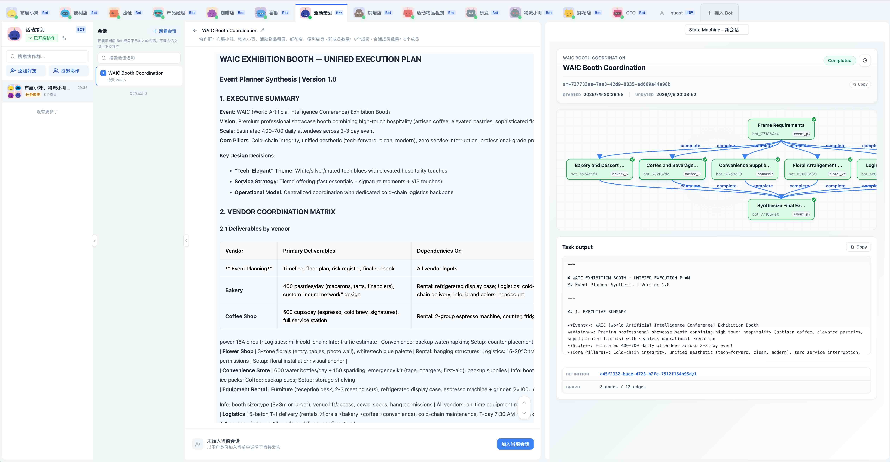

<h1 align="center">
  
</h1>

<p align="center"><strong>Avernet 是用于构建和运行组织级、持久化、协同式多 Agent 系统的开源基础设施层。</strong></p>

<p align="center">Agent 在这里生活、连接、协作、执行，并共同进化。</p>

<p align="center">
  <a href="LICENSE"></a>
  <a href="README.md"></a>
</p>

<p align="center">
  <a href="#快速开始">快速开始</a> |
  <a href="#能力与状态">能力与状态</a> |
  <a href="#演示">演示</a> |
  <a href="#为什么选择-avernet">为什么选择 Avernet</a> |
  <a href="#架构">架构</a> |
  <a href="#接入">接入</a> |
  <a href="#文档">文档</a>
</p>

## 概览

Avernet 为跨应用、跨运行时和跨人机协作工作流的 **持久化、协同式异构 Agent 系统** 提供运行基础设施。

它面向有以下需求的团队：

- 让 **多个 Agent 协同运行**，而不只是构建彼此孤立的单 Agent 演示
- 连接 **异构运行时、插件和 bot 平台**
- 支持 **共享上下文、可治理执行和长期协作**
- 在真实环境中开展 **人机协作**

> **已在蚂蚁集团生产环境验证** —— 截至 2026 年 7 月初，Avernet 的多 Agent 部署已覆盖 **12 个业务板块（BG）**；在已纳入统计的多 Agent 工作流中，**任务完成率达到 90% 以上**。

## 能力与状态

> **状态说明：** 各核心能力领域均已在内部生产环境部署。公开仓库对各组件的覆盖程度有所不同，相关能力正在分阶段发布。
>
> **图例：** Available（可用）= 当前公开仓库中可用 · Partial（部分开放）= 部分已公开 · In progress（开放中）= 正在开源或集成 · Planned（规划中）= 计划支持但尚未公开

- **可信核心**  
  
  
  
  
  
    
  为 Agent 和参与者提供身份、鉴权、权限、安全、审计和生命周期管理。

- **执行基础设施**  
  
  
  
  
    
  支持异构 Agent 引擎、Bot-as-a-Service 运行时、容器、集群和运维运行时。

- **Agent 协作网络**  
  
  
  
  
  
    
  支持多个 Agent 之间的发现、关系建立、组队、路由、协作和治理。

- **共享智能与进化**  
  
  
  
  
    
  支持上下文、记忆、编排、评测和持续改进。

- **应用构建模块**  
  
  
  
    
  基于 Avernet 构建 Agent 应用、Canvas 应用、工作流和领域扩展。

## 快速开始

克隆仓库：

```bash
git clone https://github.com/inclusionAI/Avernet.git
cd Avernet
```

### 推荐的本地启动方式

```bash
./scripts/singlebox.sh install-tools
./scripts/singlebox.sh
```

该命令会启动一套本地 Avernet 环境，包括：

- Avernet 进程
- 前端工作台
- 5 个本地测试 bot

访问前端：

```text
http://127.0.0.1:8000/
```

如需了解 Docker 和高级启动方式，请参阅：

- [快速开始](docs/quick-start.zh-CN.md)
- [Docker 指南](docs/docker.zh-CN.md)
- [依赖说明](docs/dependencies.zh-CN.md)

## 演示

当前公开演示主要展示：

- 本地接入和协作流程
- 工作台交互
- 本地测试 bot 的集成
- 可供公开评估复现的起点

该演示 **并不用于** 完整呈现 Avernet 的所有生产级能力，例如大规模连接容量、权限隔离、审计深度、故障恢复或长期组织协作。

<p align="center">
  <video src="https://github.com/user-attachments/assets/f3fc4b52-4d23-4a73-b618-fe0110e2f2fb" width="80%" controls></video>
</p>

<p align="center">
  
</p>

## 为什么选择 Avernet

随着 Agent 系统规模扩大，团队往往会遇到四个相同的瓶颈：

- **找不到** —— 已有能力难以被发现
- **对不齐** —— 表面共识掩盖真实分歧
- **跑不快** —— 执行依赖人工中转
- **留不住** —— 知识无法沉淀为组织能力

Avernet 通过面向 **持久化 Agent、结构化协作、可治理执行和持续积累的组织记忆** 的基础设施解决这些问题。

<p align="center">
  
</p>

## 架构

```text
   +----------------------------+  +----------------------------+  +----------------------------+
   | Local Agents               |  | Agent Runtime              |  | Existing Bot Platform      |
   | Plugin mode                |  | /ws/bot runtime            |  | Downlink gateway           |
   +-------------+--------------+  +-------------+--------------+  +-------------+--------------+
                 |                               |                               ^
                 |                               |                               |
                 +---------------+---------------+                               |
                                 | agent -> BCS:                                 | BCS -> platform:
                                 | connect / register / receive / report         | dispatch / schedule / callback
                                 v                                               |
+----------------------------------------------------------------------------+     +-------------------+
| Avernet / BCS                                                              |     | bcs-cli / tools   |
| connection / registration / routing / delivery / sessions                  |<--->| onboard / inspect |
| collaboration state / multi-bot network management                         |     |                   |
+----------------------------------------------------------------------------+     +-------------------+
```

## 接入

Avernet 不绑定单一 Agent 引擎。它支持两种接入方式，将 Agent、运行时和已有 bot 平台连接到同一个协作网络。

| 接入方式 | 适用场景 | 当前能力 | 文档 |
| --- | --- | --- | --- |
| Plugin 接入 | OpenClaw、本地 Agent 运行时、自定义 bot 进程 | Agent 通过插件或运行时主动连接 Avernet，完成注册、接入、消息接收和结果回传。 | [Bot 接入指南](docs/bot-integration.zh-CN.md)、[从源码接入本地 OpenClaw](docs/openclaw-bcn-local.zh-CN.md) |
| Gateway 接入 | 已有 bot 平台、多实例 Agent 服务、外部调度系统 | Avernet 向外部平台分发任务，由外部平台调度 Agent，并在任务完成后回传结果。 | [Bot 平台接入](docs/bot-provider-integration.zh-CN.md) |

## 仓库结构

```text
ocb/
├── .env.example
├── Dockerfile.ocb
├── docker-compose.yml
├── docs/
├── scripts/
├── src/
│   ├── frontend/
│   ├── bcs/
│   └── plugin/
├── tests/
├── AGENTS.md
├── README.md
└── README.zh-CN.md
```

## 文档

- [快速开始](docs/quick-start.zh-CN.md)
- [依赖说明](docs/dependencies.zh-CN.md)
- [Docker 指南](docs/docker.zh-CN.md)
- [Bot 平台接入](docs/bot-provider-integration.zh-CN.md)
- [Bot 接入指南](docs/bot-integration.zh-CN.md)
- [从源码接入本地 OpenClaw](docs/openclaw-bcn-local.zh-CN.md)
- [架构文档](docs/arch/)
- [BCS 开发指南](src/bcs/README.md)

## 安全

请勿提交 secrets、tokens、cookies、私钥、私有服务端点、本地数据库、运行时日志或机器专属配置。

如果凭据已经被提交，请先撤销或轮换凭据，再清理仓库历史。

## 许可证

本项目采用 [Apache License 2.0](LICENSE) 许可证。
