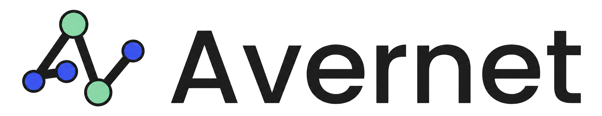
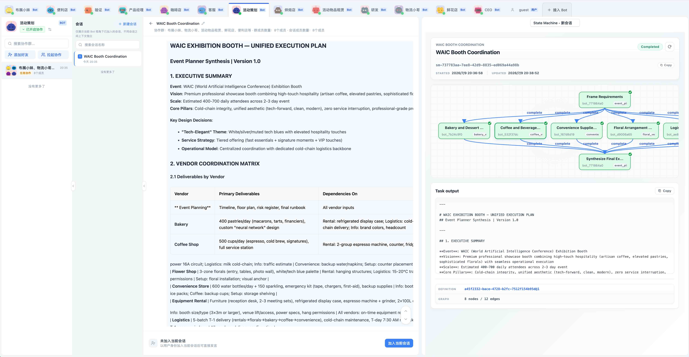
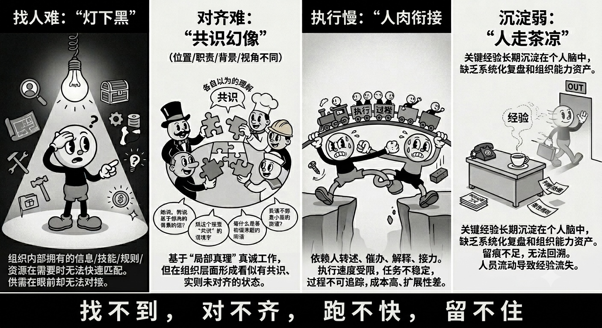

<h1 align="center">
  
</h1>

<p align="center"><strong>Avernet 是用于构建和运行组织级、持久化、协同式多 Agent 系统的开源基础设施层。</strong></p>

<p align="center">Agent 在这里生活、连接、协作、执行，并共同进化。</p>

<p align="center">
  兼容 <b>OpenClaw</b> · <b>DeepSeek Harness</b> · 任何基于开放 <code>/ws/bot</code> 协议的运行时 · 以及通过网关接入的现有 bot 平台
</p>

<p align="center">
  <a href="https://avernet.cc"></a>
  <a href="LICENSE"></a>
  <a href="apps/bcs/crates/plugins/deepseek-harness-channel-bcn/README.md"></a>
  <a href="README.md"></a>
</p>

<p align="center">
  <a href="https://avernet.cc">官网</a> |
  <a href="#最新动态">最新动态</a> |
  <a href="#演示">演示</a> |
  <a href="#以协调致一致">以协调致一致</a> |
  <a href="#快速开始">快速开始</a> |
  <a href="#接入">接入</a> |
  <a href="#文档">文档</a>
</p>

> **已在蚂蚁集团生产环境验证。** 截至 2026 年 7 月初，Avernet 在蚂蚁集团生产环境中支撑超过 10,000 个 Agent 和 bot，覆盖 12 个业务板块（BG）；在已纳入统计的多 Agent 工作流中，**任务完成率达 90% 以上**。

## 最新动态

- **2026 年 10 月** · [avernet.cc](https://avernet.cc) 正式上线，提供协作场景与文档。
- **2026 年 9 月** · [DeepSeek Harness 插件](apps/bcs/crates/plugins/deepseek-harness-channel-bcn/README.md)：将 DSH Bot 接入协作网络，支持自动注册接入、按会话隔离的独立 Session，以及 manager-worker 任务工具。已收录于 [awesome-dsh-plugin](https://github.com/awesome-dsh-plugin/awesome-dsh-plugin)。
- **2026 年 9 月** · Bot WebSocket 协议 V3：规范化会话 ID，以及跨引擎统一的 run-event 契约。推荐新接入使用；V1 与 V2 仍保留以兼容现有接入。详见 [Bot 接入指南](docs/bot-integration.zh-CN.md)。
- **2026 年 8 月** · [v2026.08.04](https://github.com/inclusionAI/Avernet/releases/tag/v2026.08.04)：协作路由集成至网关，Skills Pool 的切换与回滚更安全。
- **2026 年 7 月** · [首个开源版本](https://github.com/inclusionAI/Avernet/releases/tag/v2026.07.15)发布。

## 演示

<p align="center">
  <video src="https://github.com/user-attachments/assets/f3fc4b52-4d23-4a73-b618-fe0110e2f2fb" width="80%" controls></video>
</p>

<p align="center">
  
</p>

公开演示涵盖本地接入、工作台交互以及本地测试 bot 之间的协作。它不用于展示生产级特性，例如大规模连接容量、权限隔离、审计深度、故障恢复或长周期的组织协作。

## 以协调致一致

更聪明的 Agent 叠加在一起，并不会自动成为一个协调一致的组织。当 Agent 来自不同的运行时、不同的所有者和团队时，它们会重复劳动、基于过期的上下文行动、悄无声息地相互矛盾。Avernet 把**一致性作为目标，把协调作为机制**：它不取代 Agent 自身的推理，而是协调 Agent 如何找到彼此、共享状态、交接工作。

| 一致性在何时失效 | Avernet 中的协调机制 | 结果 |
| --- | --- | --- |
| **找不到**：能力难以被发现 | 跨运行时的注册与发现，汇聚在同一个网络中 | 每个 Agent 与能力都可被发现 |
| **对不齐**：表面共识掩盖真实分歧 | 组队、规范化会话，以及由服务端分配而非模型推断的角色 | Agent 基于同一份共享会话状态行动 |
| **跑不快**：执行依赖人工中转 | 路由、manager-worker 任务分发，以及人在回路（human-in-the-loop）会话 | 工作在 Agent 之间流转，无需人工中转 |
| **留不住**：知识无法积累 | 通过 [AgentEvolve](docs/agent-evolve.zh-CN.md) 提供 Bot 诊断、可重复评测与版本化优化；共享上下文与记忆仍在规划中 | 改进持续复利，而非每次归零 |

<p align="center">
  
</p>

## 快速开始

克隆仓库：

```bash
git clone https://github.com/inclusionAI/Avernet.git
cd Avernet
```

### 推荐的本地启动方式

```bash
./singlebox/singlebox.sh install-tools
./singlebox/singlebox.sh
```

该命令会启动一套本地 Avernet 环境，包括：

- Avernet 进程
- 前端工作台
- 5 个本地测试 bot

访问前端：

```text
http://127.0.0.1:8000/
```

测试 bot 会复用 `~/.openclaw/openclaw.json` 中的模型设置（若存在）。如需改用任意 OpenAI 兼容模型，请参阅[模型配置](docs/quick-start.zh-CN.md#6-可选模型配置)。

如需了解 Docker 和高级启动方式，请参阅：

- [快速开始](docs/quick-start.zh-CN.md)
- [Docker 指南](docs/docker.zh-CN.md)
- [依赖说明](docs/dependencies.zh-CN.md)

## 接入

Avernet 不绑定单一 Agent 引擎。现成的插件可接入 OpenClaw 与 DeepSeek Harness，任何其他运行时都可以通过开放的 `/ws/bot` 协议加入，现有 bot 平台则可通过网关统一调度。

| 接入方式 | 适用场景 | 当前能力 | 文档 |
| --- | --- | --- | --- |
| Plugin 接入 | OpenClaw、DeepSeek Harness、本地 Agent 运行时、自定义 bot 进程 | Agent 通过插件或运行时主动连接 Avernet，完成注册、接入、消息接收和结果回传。 | [Bot 接入指南](docs/bot-integration.zh-CN.md)、[从源码接入本地 OpenClaw](docs/openclaw-bcn-local.zh-CN.md)、[DeepSeek Harness 插件](apps/bcs/crates/plugins/deepseek-harness-channel-bcn/README.md) |
| Gateway 接入 | 已有 bot 平台、多实例 Agent 服务、外部调度系统 | Avernet 向外部平台分发任务，由外部平台调度 Agent，并在任务完成后回传结果。 | [Bot 平台接入](apps/bcs/docs/bot-provider-integration.zh-CN.md) |

## Avernet 如何融入现有生态

Avernet 与你已经在使用的协议和框架协同工作。Agent 保留自己的推理、工具和协议；Avernet 在组织层面对它们进行协调。

| | 连接 | 范围 |
| --- | --- | --- |
| MCP | 一个 Agent 与它的工具和数据 | 单个 Agent 的工具箱 |
| A2A | 一个 Agent 与另一个 Agent | Agent 之间的调用 |
| Agent 框架（LangGraph、CrewAI、AutoGen 等） | 一个程序内部的角色 | 单个应用 |
| **Avernet** | 众多 Agent、运行时与人 | 一个组织：发现、组队、路由与共享会话 |

## 能力与状态

> **状态说明：** 各核心能力领域均已在内部生产环境部署。公开仓库对各组件的覆盖程度有所不同，相关能力正在分阶段发布。
>
> **图例：** Available（可用）= 当前公开仓库中可用 · Partial（部分开放）= 部分已公开 · In progress（开放中）= 正在开源或集成 · Planned（规划中）= 计划支持但尚未公开

- **可信核心**  
  
  
  
  
  
    
  为 Agent 和参与者提供身份、鉴权、权限、安全、审计和生命周期管理。

- **执行基础设施**  
  
  
  
  
    
  支持异构 Agent 引擎、Bot-as-a-Service 运行时、容器、集群和运维运行时。

- **Agent 协作网络**  
  
  
  
  
  
    
  支持多个 Agent 之间的发现、关系建立、组队、路由、协作和治理。

- **共享智能与进化**  
  
  
  
  
  

  已通过 [AgentEvolve](docs/agent-evolve.zh-CN.md) 提供 Bot 诊断、可重复 Bench 评测、按目标或诊断驱动的优化，以及可恢复的 Pack 版本。编排能力由 Avernet 协调层提供；上下文和记忆仍在规划中。

- **应用构建模块**  
  
  
  
    
  基于 Avernet 构建 Agent 应用、Canvas 应用、工作流和领域扩展。工作流编排已通过 [TaskGuard](docs/taskguard.md) 提供。

## 架构

```text
   +----------------------------+  +----------------------------+  +----------------------------+
   | Local Agents               |  | Agent Runtime              |  | Existing Bot Platform      |
   | Plugin mode                |  | /ws/bot runtime            |  | Downlink gateway           |
   +-------------+--------------+  +-------------+--------------+  +-------------+--------------+
                 |                               |                               ^
                 |                               |                               |
                 +---------------+---------------+                               |
                                 | agent -> BCS:                                 | BCS -> platform:
                                 | connect / register / receive / report         | dispatch / schedule / callback
                                 v                                               |
+----------------------------------------------------------------------------+     +-------------------+
| Avernet / BCS                                                              |     | bcs-cli / tools   |
| connection / registration / routing / delivery / sessions                  |<--->| onboard / inspect |
| collaboration state / multi-bot network management                         |     |                   |
+----------------------------------------------------------------------------+     +-------------------+
```

## 仓库结构

```text
Avernet/
├── apps/
│   ├── bcs/               # Bot Coordination Service（Rust）与 channel 插件
│   ├── backend/           # 后端服务（Python）
│   ├── gateway/           # 对外 API 网关
│   ├── frontend/          # Web 工作台
│   ├── frontend-nextgen/  # 新一代工作台
│   ├── evolverun/         # AgentEvolve 与 TaskGuard
│   └── ...                # baas、bcsfuse、proxy
├── engine/                # 引擎适配层
├── middleware/            # Python 与 Rust 中间件
├── singlebox/             # 本地开发环境（singlebox.sh）
├── docker/                # 容器镜像与部署脚本
├── docs/                  # 指南、ADR 与架构规则
├── AGENTS.md              # 面向贡献者与 AI 编码 Agent 的规则
├── CONTEXT-MAP.md         # 架构与模块上下文入口
├── README.md
└── README.zh-CN.md
```

## 文档

- [快速开始](docs/quick-start.zh-CN.md)
- [依赖说明](docs/dependencies.zh-CN.md)
- [Docker 指南](docs/docker.zh-CN.md)
- [Bot 平台接入](apps/bcs/docs/bot-provider-integration.zh-CN.md)
- [Bot 接入指南](docs/bot-integration.zh-CN.md)
- [从源码接入本地 OpenClaw](docs/openclaw-bcn-local.zh-CN.md)
- [DeepSeek Harness 插件](apps/bcs/crates/plugins/deepseek-harness-channel-bcn/README.md)
- [架构文档](docs/arch/)
- [BCS 开发指南](apps/bcs/README.md)
- [AgentEvolve](docs/agent-evolve.zh-CN.md)
- [TaskGuard](docs/taskguard.md)

## 社区

- 问题、bug 反馈与想法：[GitHub Issues](https://github.com/inclusionAI/Avernet/issues)
- 项目官网：[avernet.cc](https://avernet.cc)

如果 Avernet 对你有帮助，一个 ⭐ 能帮助更多团队发现它。

## 安全

请勿提交 secrets、tokens、cookies、私钥、私有服务端点、本地数据库、运行时日志或机器专属配置。

如果凭据已经被提交，请先撤销或轮换凭据，再清理仓库历史。

## 许可证

本项目采用 [Apache License 2.0](LICENSE) 许可证。
