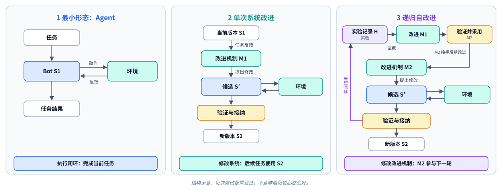
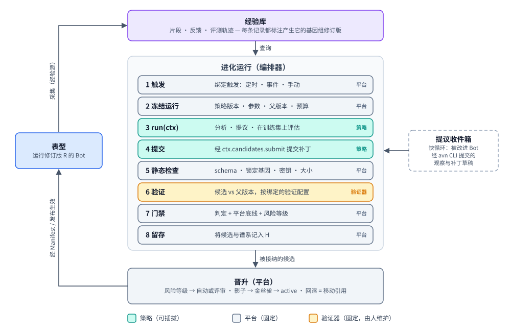
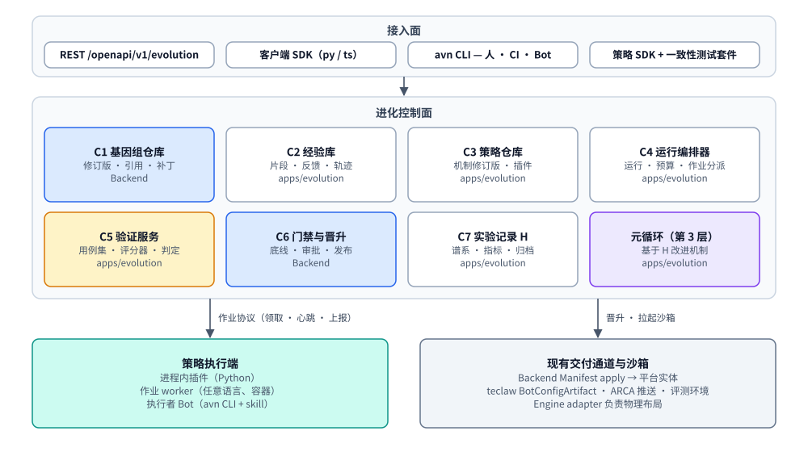

# Bot 进化平台 —— 架构

> English version: [01-design.md](01-design.md)

> 状态：DRAFT。术语表见 [README.zh-CN.md](README.zh-CN.md)。

## 1. 问题

代码库中的三个事实界定了问题（证据见
[09-research.zh-CN.md §2](09-research.zh-CN.md#2-代码库证据)）：

1. **已经存在一个可用的自改进循环，但它是一个产品，而不是平台。** ClawEvolve
   （`apps/evolverun/`）执行 diagnose → plan → tune/review → bench → accept →
   pack。它与 OpenClaw 路径耦合（`/home/admin/.openclaw/workspace`、
   `openclaw agent --local`），**直接编辑线上工作区**，硬编码了接纳规则
   （候选的测试分 > 基线的测试分），并且有一个封闭的 flow 注册表（三个 flow
   key）。其他团队若想接入一种不同的进化方法，只能 fork 它。
2. **已经存在一个声明式的 bot 制品，但它没有历史。** Bot Config Manifest
   （`core/bot_config_manifest/`）可以表达人设文件、skill、资源、MCP、CLI 工具
   和启动脚本，并能把它们收敛到包括 teclaw 在内的任意引擎上。但它是每个 bot
   一条可变记录，没有修订版、没有内容哈希、没有父指针、没有乐观并发控制，
   apply 报告也不记录应用的是哪份文档。记忆（`MEMORY.md`）被明确排除在外。
3. **bot 无法就其自身调用平台。** OpenAPI v1 按设计拒绝 `bot` 主体，因此
   「bot 自我改进」目前没有任何被认可的接口面。

业界证据（见 [09-research.zh-CN.md §1](09-research.zh-CN.md#1-业界调研)）补充了三条
设计从第一天起就必须遵守的约束：

- 没有**独立的、封存的、归平台所有的评估**的自改进，要么会奖励投机
  （reward hacking）（Darwin Gödel Machine 禁用了自己的幻觉检查器），要么无法
  泛化（2026 年对 harness 进化的重新评估发现，与预算匹配的基线相比，收益往往
  消失）。
- **整文件重新生成会侵蚀上下文**（ACE 的「context collapse」）；编辑应当是
  逐项的增量。
- **贪心的「保留最新最优」**会停滞；能让开放式搜索持续改进的是**带谱系的
  归档**。

## 2. 目标

| ID | 目标 |
| --- | --- |
| G1 | 一份不可变、有版本的「这个 bot 是什么」的表示（Bot 基因组），每个进化策略都读写它，平台可以把它应用到任意引擎。 |
| G2 | 进化方法是插件：其他团队可以编写、测试、版本化和注册进化策略，而无需修改平台代码。 |
| G3 | 一份契约，三种接口面：REST API、SDK（客户端 + 策略编写）以及一个可供人、CI 和 bot 使用的 CLI。 |
| G4 | 现有管线（ClawEvolve、workflow-run 自愈、Insight 改进）成为平台上的进化策略，而不是平行的系统。 |
| G5 | 构造即安全：平台所有的门禁、按风险分级的审批、谱系、回滚、沙箱化评估、预算。 |
| G6 | 引擎中立：同一个进化策略可以进化 OpenClaw、Claude Code、Hermes 或 teclaw bot，前提是满足其声明的能力要求。 |

非目标列在 [README](README.zh-CN.md#本设计集的非目标) 中。

## 3. 三个层次与改进循环

平台围绕三个嵌套的层次构建：

1. **Agent** —— bot（S1）针对其环境执行任务。它产生经验，但 bot 本身没有任何
   变化。
2. **单次系统改进** —— 一个改进机制（M1）利用任务反馈提出一个候选 S′。S′
   运行、被**验证**，只有被接纳后才成为 S2，供后续任务使用。这就是本节其余
   部分所描述的进化策略运行。
3. **递归自改进** —— 所有改进实验的记录（H）被用来改进**改进机制本身**。一个
   候选 M2 在接管后续轮次之前，要被**验证**能比 M1 产生更好的、经过验证的
   改进。见 [04-recursion.zh-CN.md](04-recursion.zh-CN.md)。

验证是这三个层次的不动点：每一次变更都会被验证，拒绝是正常结果，验证器永远
不会被任何循环修改（[03-verification.zh-CN.md](03-verification.zh-CN.md)）。

### 第 2 层循环

所调研的每一种方法——DSPy/GEPA、ACE、Voyager、DGM、AlphaEvolve、Anthropic
Dreams、Hermes Curator，以及 ClawEvolve 本身——都可以归结为在一个有版本的制品
之上运行的同一个**变异 → 选择 → 保留**循环。平台拥有循环骨架和保留这一侧；
进化策略拥有变异，并参与选择。

两种速度共享这个循环（模式来自 Letta sleep-time agents 和 Anthropic Dreams）：

- **慢循环 / 离线循环** —— 一次进化策略运行。批量、有预算、经过评估。例如
  ClawEvolve 的优化轮次、GEPA 风格的 prompt 优化器、每晚的记忆整合
  （「dream」）作业。
- **快循环 / 循环内捕获** *（随 DR-3 已推迟）* —— 被改进 Bot 在会话中途注意到
  某件事（「这种工具调用模式已经失败了三次」），并记录一条**观察**或一份
  **补丁草稿**。这些内容将进入按 bot 划分的*提议收件箱*；它们是慢循环的输入，
  不经过步骤 5–8 永远不会到达线上 bot。bot 如何与平台通信尚未确定，因此这条
  路径不在第一轮迭代范围内。

## 4. 组件

### C1 基因组注册表

拥有 Bot 基因组修订版、具名引用（ref）（`active`、`previous`、`canary`、
`candidate/<run>/<n>`）、补丁以及按内容寻址的 blob。它是**长大了的
Manifest**：一个修订版*编译成*一份钉住的 Manifest 文档加上一份记忆投影，晋升
通过现有的 apply 管线应用该文档。完整模型见 [02-genome.zh-CN.md](02-genome.zh-CN.md)。

放置位置：**Backend**（`core/bot_genome/`），与 `core/bot_config_manifest/`
相邻，因为 Backend 拥有期望状态，而 Manifest 已经在那里。blob 复用 Manifest
内容存储（`ManifestContentService` 背后的按内容寻址 blob 目录，来源记录在
`ac_manifest_content` 中）；见 [02-genome.zh-CN.md §7](02-genome.zh-CN.md#7-存储)。

### C2 经验库

一份规范化的、引擎中立的记录，描述 bot 做了什么以及结果如何：

- **片段（Episode）** —— 一次会话或一条任务轨迹：消息、工具调用、工具结果、
  耗时、模型、成本、结果。由引擎的会话导出从引擎专属格式规范化而来（即
  `experience.sessions` 能力背后的提供方；`clawevolve-diagnose/acquisition/`
  中的 OpenClaw 读取器是起点）。
- **反馈（Feedback）** —— 用户评分、纠正、任务结果、BCS 协作结果、
  run-evidence 事件（TaskGuard）。
- **评估轨迹（Eval trace）** —— 每一次评估 rollout，带有评分器分数和文字
  点评。

每条记录都带有产生它的**基因组修订版 id**。这正是当前各处都缺失的那个字段，
也是它把日志变成可归因的适应度信号、进而变成训练数据。

归属：AGENTS.md 把聊天历史划归面向引擎的服务。因此**原始会话的真相来源仍在
引擎中**；引擎暴露一份有版本的导出契约（`session-export/v1` 已存在于
ClawEvolve 中，是起点），C2 保存规范化、带索引、有保留期限的副本供进化使用。
隐私 / 保留规则挂在 C2 上（见 [08-governance.zh-CN.md §7](08-governance.zh-CN.md#7-数据处理)）。

### C3 进化策略注册表

存储**策略注册记录**（id、版本、运行时，以及策略 `needs` 的目录能力）、它们的
一致性状态，以及**能力目录**本身。按 bot 的**绑定**（一个 bot 使用哪些策略、
何时运行、可以改什么、预算、参数）存放在该 bot 的进化策略配置（evolution
policy）中。一次运行会记录它所使用的确切进化策略版本。它泛化了 ClawEvolve 的
`official-stage-catalog.json` + `ce_stage_skill_implementations`。详见
[05-strategy-sdk.zh-CN.md](05-strategy-sdk.zh-CN.md)。

### C4 运行编排器

一个持久化的运行状态机（`queued → running → completed | failed |
cancelled | budget_exhausted`）。提交运行是幂等的，并返回一个运行 id；状态
通过该 id 查询。它在绑定的触发条件满足时启动绑定，冻结进化
策略版本、参数、父版本和预算，以恰好被授予的能力构建 `StrategyContext`，然后
在进程内或通过作业协议（Job Protocol）调用策略唯一的 `run(ctx)` 方法。
每次运行都是一个带租约的作业：如果进程崩溃，租约到期后该运行会以相同的运行
id 重新派发。策略自行持久化并恢复自己的进度；平台不提供检查点 API
（[05-strategy-sdk.zh-CN.md §7](05-strategy-sdk.zh-CN.md#7-运行生命周期)）。它强制
执行预算和租约，并保证任何隐藏内容都不会到达策略（例如封存用例）。它泛化了
ClawEvolve 的 `ce_tasks` / `ce_steps` / claim-report 端点。

### C5 验证服务

归平台所有，**对进化策略和 bot 只读**：

- **用例集（Suites）**，带强制划分：`train`（策略可以看到失败用例）、
  `validation`（门禁使用；策略只能看到汇总结果）、`holdout`（仅供门禁和定期
  审计使用）、`regression`（从生产失败和以往已修复的用例自动增长）、`safety`。
- **评分器（Graders）**：确定性检查、基于评分细则的 LLM 评审模型（最好与策略
  属于不同的模型家族）、混合式。每个评分器都返回 `score + critique`，因为反思式
  策略（GEPA、ClawEvolve tune）需要点评。
- **沙箱执行**：候选通过现有的 `plugin_api/eval_env/` 接缝
  （`EvalEnvLifecycle`、`VersionSync`）被物化为一个临时的**评测 Bot**，因此
  评估走的是真实的 apply / 交付路径，而不是模拟。
- **基线（Baselines）**：每一次对候选的评估都与父版本在相同用例上配对进行，
  并可选地加入一个**预算匹配基线**（父版本 + 额外采样），使进化策略必须胜过
  「只是多试几次」。

ClawBench（`clawbench-base`）成为默认的评分器；backend 评测环境
（`eval_publish`）成为部署式沙箱执行器。完整协议、现有评测代码的清单及其缺口见
[03-verification.zh-CN.md](03-verification.zh-CN.md)。

### C6 门禁与晋升

唯一能移动 bot `active` 引用的组件。见 [08-governance.zh-CN.md](08-governance.zh-CN.md)。
简而言之：

1. **平台底线**（进化策略不可覆盖）：schema 有效、锁定基因未被改动、无密钥、
   无权限提升、在 `regression`/`safety` 用例集上的回退不超出容差、未超出预算。
2. 在绑定的验证配置下得出的**验证判定**。所有者可以选择更严格的配置；进化策略
   不能放宽它。ClawEvolve 自己的 `test > baseline` 规则成为它决定提交什么的
   内部过滤条件。
3. 补丁的**风险等级**决定自动晋升还是人工评审。
4. **发布（Rollout）**：可选的影子阶段（verify 阶段）、面向多实例 bot 的金丝雀，
   然后才是 active。**回退（go back）**就是再次晋升一个更早的修订版：
   `active` 移回该修订版，并像其他任何晋升一样 apply 该修订版（对服务型 bot
   而言，作为下一个发布版本）。它对个人 bot 和服务型 bot 都适用，并且不触及
   现有的服务型 bot 回滚功能。

### C7 实验记录 H 与归档

每一次改进实验（改进机制、父版本、候选、证据、判定、成本、后续线上结果），
包括被拒绝的实验——schema 见 [04-recursion.zh-CN.md §3](04-recursion.zh-CN.md#3-实验记录h)。
它是 C1 + C5 之上的一个读模型：某个 bot 的基因组树、每个候选在各划分上的分数、
由哪个进化策略和模型产生、基于哪些证据、由谁批准。`active` 之外的父版本选择
（latest-best、按用例的 Pareto 前沿、MAP-Elites 生态位、Huxley-Gödel Machine
式的考虑后代的「clade」分数）是绑定 `parent` 字段的后续选项，它们会查询它。
人在 UI 中浏览它。进化策略可以拿到它的文件系统导出（Meta-Harness 发现原始历史
优于摘要）。它也是第 3 层的证据基础。

### 元循环（第 3 层）

以**改进机制**（进化策略版本）为目标、以**机制验证**为验证器，运行同一个
循环：元策略读取 H，提出一个改进机制补丁，候选改进机制在被采用之前，要在
封存的改进问题上与当前 active 的改进机制进行比较（默认需人工批准）。改进机制
在 C3 中以与基因组相同的修订版 / 引用模型进行版本管理。见
[04-recursion.zh-CN.md](04-recursion.zh-CN.md)。

## 5. 归属与模块放置

宪章要求清晰的归属和与传输无关的核心。建议的划分：

| 关注点 | 负责方 | 原因 |
| --- | --- | --- |
| 基因组注册表（C1）、门禁与晋升（C6） | **Backend** | 拥有期望状态、Manifest、发布链路、租户隔离、审批。晋升必须与 apply 放在一起。 |
| 基因组到工作区的物理投影、记忆导入 / 导出、会话导出 | **Engine adapter** | 引擎拥有布局（ADR 0014/0017）和聊天历史。新增引擎侧契约，不引入 Backend 路径。 |
| 运行编排器（C4）、进化策略注册表（C3）、经验库（C2）、验证服务（C5）、实验记录（C7）、元循环 | **新模块 `apps/evolution`**（推荐） | 长时间运行、重度依赖 LLM、突发性的工作，应当独立于 Backend 的请求服务进行扩缩容和故障隔离。 |
| 进化策略实现 | **策略作者**（包括负责默认策略的 `apps/evolverun`） | 按定义即可插拔。 |
| 沙箱评测 Bot | **Backend `eval_publish` + eval_env 插件 + BaaS** | 评测环境部署已存在（Quality Task）；插件接缝目前是 Noop 桩。 |
| UI | `apps/frontend-nextgen`（后续）；AgentEvolve UI 作为过渡 | |

**待决事项 D-1（控制面的模块放置）。** 选项：

| 选项 | 优点 | 缺点 |
| --- | --- | --- |
| A. 新的 Python 服务 `apps/evolution`，采用 Backend 的 DI / 插件模式（**推荐**） | 边界清晰；使用相同的宪章工具链（DI、`plugin_api`、一致性测试）；可独立扩缩容 | 新的可部署单元；需要接入 singlebox |
| B. 放在 Backend 内，作为 `core/evolution/` | 无需新服务；可直接访问基因组 / Manifest 服务 | 长时间运行的 LLM 作业放进了处理请求的 backend；Backend 已经非常庞大 |
| C. 将 ClawWeb 的 TS 控制面升格 | 复用已可用的代码 | 不在宪章的 DI / 插件 / 一致性工具链之内；仅限 Node；与 UI 混在一起 |

建议：**A**，C1/C6 放在 Backend（它们属于期望状态），ClawWeb 在迁移期间继续
作为 UI 以及默认进化策略执行器的宿主。

## 6. 关键契约（由工作项具体规定）

| 契约 | 类型（R3） | 生产者 → 消费者 |
| --- | --- | --- |
| 基因组 schema + 补丁格式 | 数据契约，有版本 | 所有人 |
| 基因组注册表 API | Service API | Evolution、UI、CLI → Backend |
| Evolution API（`/openapi/v1/evolution/*`） | Service API | SDK/CLI/UI → Evolution |
| 策略端口（`run(ctx)`）、`StrategyContext`、候选 / 判定、注册记录 | Plugin API | 编排器 → 进化策略实现 |
| 能力目录（每个条目一份契约，带按引擎的提供方） | Plugin API | 进化策略 → 平台 / 引擎提供方 |
| 作业协议（每个 `ctx` 调用对应一个 HTTP 端点） | Plugin API（线协议） | 编排器 ↔ 作业 worker 策略 |
| 进化策略配置（evolution policy，按 bot 的绑定） | 数据契约 | 所有者、UI、CLI → Evolution |
| 引擎记忆投影契约 | Plugin API | Backend apply → Engine |
| 引擎会话导出契约（`session-export/v1` → v2） | Plugin API | Evolution → Engine |
| 验证服务 API + Executor/Grader 插件协议 | Service API + Plugin API | 编排器、发布流程、Quality Task → Verification |
| 实验记录 schema + 改进机制指标 | 数据契约 | Evolution → 选择器、元循环、UI |
| 面向 bot 主体的 bot 进化作用域 *（随 DR-3 已推迟）* | 准入契约 | Gateway/Backend |

每一份契约都需要在同一次变更中提供文档 + 一致性测试（R1、R25）。

## 7. 一次运行的生命周期（完整示例）

进化策略 `clawevolve/bot-evolution@2`，bot `support-agent`，触发原因：失败率
信号越过阈值，因此在每晚定时触发。

1. 该 bot 针对 `clawevolve/bot-evolution@2.0.0` 的绑定按其定时计划触发。编排器
   创建 Run，并冻结进化策略版本、参数（`max_rounds: 3`）、预算
   （`max_usd: 20`）和父版本（`active` = 修订版 `r41`）。
2. 它构建一个授予 `experience.sessions`、`agents`（OpenClaw）和
   `evaluate.train` 的 `StrategyContext`，然后调用 `run(ctx)`。
3. 在策略内部，ClawEvolve 的诊断逻辑读取 `r41` 最近 7 天的片段，聚类根因，并
   添加可重放的训练用例（平台分配划分；封存集和回归集保持隐藏）。
4. 它的 tune 智能体编辑一个从 `r41` 物化出来的**沙箱工作区**；
   `ctx.evaluate.train` 为结果打分；策略提交一个基因组补丁（逐项列出：
   `persona/SOUL.md: replace section "Escalation"`、
   `skills/refund-policy: update SKILL.md`）以及理由。
5. 平台静态检查通过；C1 记录候选修订版 `r42`（父版本 `r41`）。
6. **验证**（C5，`platform/clawbench` 评分器）在绑定的验证配置下，于评测 Bot
   中以重复种子配对运行父版本和候选，覆盖 validation，外加隐藏的回归集和安全集。
   判定和证据写入 H；策略看到的判定只带汇总值。
7. **门禁**：判定为 `accept`，且平台底线通过；风险等级 = T2（人设 + skill），
   因此候选进入评审队列。
8. 策略按候选 id 查询到判定后，可以从被接受的修订版开始下一轮。
9. 所有者在 UI 中（或通过 `avn evolve review`）评审 diff + 验证报告，并批准。
10. 晋升：`active → r42`，`previous → r41`；通过 Manifest 应用；对于服务型
    bot，通过 draft → verify → publish 作为下一个版本发布。
11. 从此以后的片段都带有 `r42`。下一次运行可以比较 `r41` 与 `r42` 的线上结果
    （在线验证；自动回滚规则可选）。

## 8. 分期

| 阶段 | 产出 | 能否单独使用？ |
| --- | --- | --- |
| P0 契约 | DR-1 和 DR-2 被接受（DR-3 已推迟）；基因组 schema、策略端口与能力目录、作业协议、API 草图完成评审 | — |
| P1 基因组注册表 | Manifest 获得修订版、引用、比较并交换（CAS）、钉住解析、apply 记录修订版、回退到任意更早的修订版 | **能**——版本化的 bot，独立于 RSI |
| P2 进化核心 | `apps/evolution` 骨架、运行编排器、作业协议、进化策略注册表、API + SDK + CLI 骨架、一个通过一致性测试的简单参考进化策略（手工补丁 + 确定性评估器） | 能，用于脚本化改进 |
| P3 默认策略 | ClawEvolve 作为黑盒策略接入：会话导出提供方、产出补丁的沙箱化 tune、验证服务中的 ClawBench 评分器 | 能——在平台上对任意 OpenClaw bot 提供今天的 AgentEvolve 能力 |
| P4 验证与治理 | 验证服务（配对统计、密封的封存集、必过用例集、评审模型集成）、发布流程的 verify 门禁、评审队列、风险等级、影子 / 金丝雀、基于 H 对验证配置与提交过滤进行离线重放 | 加固；verify 门禁本身就对服务型 bot 有用 |
| P5 bot 驱动 + 机制验证 | bot 驱动部分随 DR-3 已推迟（bot 主体作用域、作为 bot 工具的 `avn` + SKILL.md、提议收件箱）。范围内：记忆投影契约、整合（「dream」）进化策略；用于验证改进机制变更的改进问题基准 | 快循环；进化策略的回归测试 |
| P6 开放式 | 自动化的元策略（第 3 层）、归档选择器（Pareto/MAP-Elites/clade）、通过 Skill Center 的跨 bot skill 迁移、训练数据导出、更多引擎 | 研究级 |

**第一轮迭代范围。** 第一轮迭代聚焦于第 2 层：改进 bot，并由平台负责验证
（P0–P4，加上默认进化策略所需的 P5 部分）。第 3 层，即改进改进机制本身
（[04-recursion.zh-CN.md](04-recursion.zh-CN.md)），在这里完成设计，以免第 2 层
的契约阻碍它，但它是之后才处理的事项。第一轮迭代中唯一的第 3 层准备工作是
在实验记录 H 中记录实验，而第 2 层为了归档和审计本就需要这一点。

带依赖关系的工作项：[10-work-items.zh-CN.md](10-work-items.zh-CN.md)。

## 9. 通往权重训练的桥梁

不在范围内，但本设计以零额外成本为其保留了可能：

- 每条 C2 记录都有 `(input, genome_revision, output, grader scores,
  critiques, cost)`，这正是 SFT/RL/DPO 管线需要的元组。
- 同一用例上被接纳与被拒绝的候选对就是偏好数据。
- 带脱敏的 `export` 端点是 P6 事项，不是 P1 的依赖。

## 10. 风险

| 风险 | 缓解措施 |
| --- | --- |
| 收益是虚假的（过拟合到进化策略自己的用例） | 由 C5 拥有的封存集 + 回归集；带置信区间的配对统计；预算匹配基线；在新用例上定期重新审计已晋升的修订版 |
| 第 3 层优化的是噪声，或削弱了评审模型 | 验证器固定且由人负责；在封存的改进问题上进行机制验证；深度上限为 2；改进机制的采用需人工批准 |
| 奖励投机 / 篡改评估器 | 评估器和用例集位于基因组之外；锁定基因；对涉及护栏的编辑进行 diff 审计；见治理文档 |
| 人设漂移 / 上下文坍缩 | 只允许逐项补丁；大小变化阈值；逐条目的来源记录 |
| 通过轨迹进行的记忆 / skill 投毒 | 经验对策略而言是不可信输入；对补丁进行密钥 / PII 扫描；风险等级 |
| 成本失控 | 按运行、按 bot、按租户的预算由编排器强制执行，而不是由进化策略执行 |
| 平台先于需求建成 | P1 可独立使用；P3 在 P5/P6 之前先在现有需求上验证该抽象 |
| 与宪章的摩擦（新模块、新主体） | 预先起草决策；从 P2 起每个协议都有一致性测试 |
