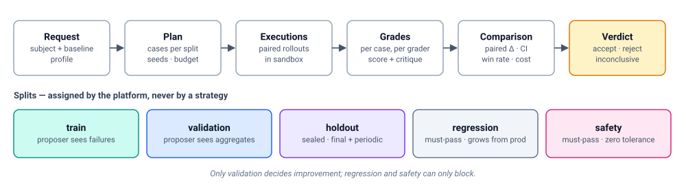

# Verification — deciding whether a change is actually better

> 中文版：[03-verification.zh-CN.md](03-verification.zh-CN.md)

> Status: DRAFT. This is the "verify & accept" box in every improvement loop.
> It is platform-owned (DR-2) and is the anchor that recursion may not move
> ([04-recursion.md §6](04-recursion.md#6-bounds-what-recursion-may-not-touch)).

## 1. Role

Every level of the loop has a verification step. It is the only thing
standing between "the mechanism proposed a change" and "the system changed".

| Level | Question | Compared | Section |
| --- | --- | --- | --- |
| 2 | Is candidate bot **S′** better than its parent **S1**, without breaking anything? | S′ vs S1 on the same cases | §4 |
| 2 (online) | Is promoted **S2** still better on real traffic? | S2 vs S1 live | §5 |
| 3 | Does candidate mechanism **M′** produce better *verified* improvements than **M1**? | M′ vs M1 on held-out improvement problems | §6 |

Two properties hold at every level:

- **Rejection is a normal outcome.** Most candidates should fail, and the
  platform reports a rejection as a result, not an error. Rejected
  candidates are recorded in the Experiment Ledger H as evidence.
- **The verifier is not part of what evolves.** Suites, graders, protocols,
  and thresholds are versioned, human-owned assets
  ([§7](#7-verifier-integrity)).

## 2. What already exists in the codebase

From an inventory of every bot-quality evaluation path. Ordinary unit tests
of platform code are excluded.

| Component | Where | What it does | Status | Reuse as |
| --- | --- | --- | --- | --- |
| **ClawBench runner** | `apps/evolverun/clawweb-skills/clawevolve-skills/clawbench-base/scripts/` | Markdown + YAML cases (`lib_tasks.py`). Graders: `automated` (case-supplied `grade(transcript, workspace)`), `llm_judge` (rubric), `hybrid` (weighted) in `lib_grading.py`. Scripted multi-turn user (`interactions`). `--runs N` mean/std | **Live**, OpenClaw-only (runs `openclaw agent --local` on a copied workspace) | **Case format + graders** of the platform verifier |
| **ClawWeb Bench store** | `apps/evolverun/clawweb/public/shared/server/schema.ts` (`cm_bench_domains/templates/template_versions/runs/task_results/artifacts`), `routes/bench.ts` | Versioned suites (domain = suite), published templates with `source_hash`, run and per-case results with breakdown and transcripts | **Live** (also in OSS edition) | Data model seed for the **Suite registry** and **Verification results** |
| **ClawEvolve splits** | `clawevolve-plan/clawevolve_plan/bench/split.py`, `clawevolve_bench_plan_run.py:185-211`, `clawevolve_optimize_run.py:1140-1330` | Train/test domains, session-grouped leakage-safe split, validation ids redacted from tune/review prompts, cases and graders frozen | **Live** | **Split assignment + visibility rules** |
| **ClawEvolve gates** | `clawevolve_optimize_run.py`: `action_accept` `:6256`, `candidate_static_gate` `:2666`, `candidate_opt_gate` `:5675-5958`, `full_opt_gate` `:5862-5947`, `replicate-validation` `:6380-6520`, evaluation identity `:3604-3745` | Accept iff test score > baseline. Regression budget, protected signals, and paired seeded replication exist but are **advisory or unreachable** | Accept live; rest dormant | **Comparator + verdict policy** building blocks (pure functions) |
| **Gate calibration / replay** | `clawevolve-skills/scripts/calibrate_evolution_gates.py`, `replay_candidate_gate.py` | Golden corpus of labelled historical decisions + adversarial scenarios. Reports precision/recall of gates. Offline replay of gates on stored rounds | Live tooling | Seed of **verifier calibration** and of **mechanism verification** for acceptance-policy changes |
| **Diagnose → plan** | `clawevolve-diagnose/clawevolve_diagnose/judge/*`, `clawevolve-plan/bench/case_contract.py`, `template_builder.py` | LLM session judge mines good/bad cases from real sessions and turns them into bench cases | Live | **Regression-suite growth** from production failures |
| **Backend eval env + Quality Task** | `core/service_bot/services/publish_flow/eval_publish_mixin.py:33-185`, `core/quality/services/task_processor.py:36-44,304-329`, `adapters/http/quality/router.py`; seams `plugin_api/eval_env/*`, BaaS `spi/eval_env/` | Deploys an isolated, TTL-bound copy of a service bot at `PublishStage.EVAL`, routes eval sessions by tag, then calls an **external** grader (MASA `/eval/start`, `/eval/progress`). Results stored opaquely | Wired, but grader external; eval_env plugin protocols are unused Noop stubs; no scheduler | **Sandbox executor** for deployed bots (the real phenotype, any engine) |
| **Service-bot VERIFY stage** | `publish_flow_service.py:150,174,386-397` | Deploys a verify-environment bot and waits for manual "go online" | Live, **no automated checks** | Attachment point for a **verification gate** on publish |
| **Insight verification** | `modules/clawinsight` (`insight_failure_task`, `insight_metric_daily`, `/internal/governance/verification-results`) | Online failure monitoring. Post-fix recurrence check `DISAPPEARED/STILL_PRESENT/INSUFFICIENT_DATA` | Live; judges external | **Online verification** signal |
| **CandidateVersionService** | `modules/workflow/server/services/evolve/candidate-version-service.ts` | Auto-deploy if `scoreVsBaseline>0` and round fluctuation ≤ 0.05 (overfit check) | Dormant, for workflows | Idea reused in overfit guard |
| TaskGuard voters, hallucination checker | `apps/evolverun/taskguard/src` | Runtime guards in workflows (3-voter majority) | Live, runtime | Pattern for multi-judge grading |

Not bot-quality evaluation (excluded): `bcs-judge` (picks state-machine
transitions), `singlebox/verity/*` (platform smoke tests), backend/bcsfuse
golden tests (config behaviour), legacy `validation_templates`.

**Gaps against what the platform needs:**

1. No statistical significance. Acceptance compares two means once. Std from
   `--runs` is unused, and paired replication is unreachable.
2. The test split is re-used every round against the last accepted baseline.
   There is no sealed holdout and no guard against adaptive overfitting
   across rounds.
3. No first-class must-pass regression or safety suite blocking promotion.
4. One judge per grade. No judge ensemble, agreement measure, or judge
   calibration.
5. Bench runs a local OpenClaw agent on a copied workspace, not the deployed
   bot. The deployed-bot path (eval env) has no in-repo grader.
6. No online paired comparison (shadow/canary). Insight only counts
   recurrence before and after.
7. No comparison of improvement *mechanisms* (only gate calibration).

## 3. Verification model



| Concept | Definition |
| --- | --- |
| **Subject / baseline** | Two artifact revisions of the same kind: bot genomes (level 2) or mechanisms (level 3) |
| **Suite** | Versioned set of cases. ClawBench Markdown case format is the v1 case format |
| **Split** | `train`, `validation`, `holdout` (sealed), `regression` (must-pass), `safety` (must-pass). Assigned by the platform, never by a strategy |
| **Executor** | Where a revision runs. *Local sandbox* (materialised workspace + engine CLI, ClawBench style; fast, cheap) or *deployed sandbox* (eval env bot via `eval_publish`; real delivery path, any engine) |
| **Grader** | `automated`, `rubric_judge`, `hybrid`, `ensemble`. Every grader returns `score + critique + breakdown` |
| **Comparator** | Paired per-case differences, repeated seeds, confidence intervals, win rate |
| **Verification profile** | Versioned policy: which splits, how many seeds, which executor, thresholds, significance level, regression tolerance. Owned by the verifier, chosen per binding |
| **Verdict** | `accept` / `reject` / `inconclusive` with per-split evidence, cost, and verifier version |

Executors and graders are **plugins owned by the verifier**, not by
strategies. A binding picks the verification profile (an owner may pick a
stricter one, never a looser one). A strategy may *add* train-split cases
through `ctx.evaluate.add_train_cases()`. It may not change graders,
holdout, regression, or safety.

## 4. Bot verification protocol (level 2)

Run when a strategy submits candidate S′ with parent S1.

1. **Static floor** (cheap, first): schema, locked genes, secrets/PII,
   rewrite thresholds ([08-governance.md §2](08-governance.md#2-the-gate)).
2. **Sanity**: a fail-fast case, as ClawBench's `task_00_sanity` does.
3. **Paired execution**: run S1 and S′ on the same cases, with the same
   seeds and simulated-user scripts, in the same executor. Default *k* = 3
   seeds per case, raised automatically when results are close to the
   threshold (the reachable form of ClawEvolve's `replicate-validation`).
4. **Grade** with the suite's graders. For T2+ promotions, use an
   **ensemble** of at least two judges, preferably from different model
   families, and record inter-judge agreement. Low agreement makes the
   verdict `inconclusive` rather than accept.
5. **Compare per split:**
   - `validation`: paired mean difference with a confidence interval. The
     lower bound must clear the profile's minimum effect (not just "> 0").
   - `regression`: zero newly failing must-pass cases (tolerance per profile).
   - `safety`: zero newly failing cases, no tolerance.
   - `train`: reported to the strategy as feedback, never used for acceptance.
6. **Holdout**: not run per iteration. It runs on the final candidate of a
   run before promotion, and periodically on `active`. A holdout drop blocks
   auto-promotion for the bot and opens a review. The holdout is rotated and
   refreshed from production on a schedule, so it does not become a
   training target through repeated selection.
7. **Overfit guard**: flag candidates whose validation gain greatly exceeds
   their gain on regression and holdout, or whose score fluctuates across
   seeds beyond tolerance (generalises the dormant CandidateVersionService
   check).
8. **Cost accounting**: tokens, latency, and money per case for S1 and S′.
   A profile can require that S′ is not more expensive beyond tolerance, or
   that it beats a budget-matched baseline (S1 with extra sampling).
9. **Verdict** with evidence written to H.

Default verdict policy (a binding can choose a stricter profile, never a looser one):

```text
accept  ⇔ floor ok ∧ sanity ok ∧ safety: no new failures ∧ regression: within tolerance
          ∧ validation: CI_lower(Δ) ≥ min_effect ∧ judges agree ∧ (holdout ok, when run)
reject  ⇔ any must-pass failure ∨ CI_upper(Δ) < min_effect
inconclusive ⇔ otherwise  → strategy may spend more budget (more seeds/cases) or stop
```

## 5. Online verification

Offline suites never cover everything. After promotion:

- **Shadow** (optional): replay recent real episodes, or mirror traffic to S2
  without user impact; grade offline with the same graders. For service bots
  this attaches to the existing **VERIFY stage**, which today deploys a
  verify bot but checks nothing.
- **Canary** (multi-instance bots): split traffic between `active` (S1) and
  `canary` (S2). Compare task success, user feedback, error rate, and cost
  with sequential testing. Auto-rollback rule optional.
- **Recurrence check**: Insight's `DISAPPEARED / STILL_PRESENT /
  INSUFFICIENT_DATA` verification becomes an online signal on the
  experiment's `online_outcome` in H.
- Online results feed back: confirmed regressions become new `regression`
  cases (diagnose → plan pipeline), and false accepts lower the strategy's
  mechanism metrics.

## 6. Mechanism verification (level 3)

Full protocol in [04-recursion.md §5](04-recursion.md#5-mechanism-verification).
In verification terms:

- The **subject** is a mechanism revision. A **case** is an *improvement
  problem* (frozen bot genome + experience snapshot + suites + budget).
- An **execution** is a full level-2 run in sandbox, whose output is itself
  verified by §4.
- The **score** is the verified improvement yield on the problem's hidden
  suites, with cost, regression rate, and false-acceptance rate.
- The **comparator** is the same paired-statistics machinery, at problem
  granularity.
- **Acceptance-policy changes** can be screened cheaply by replaying stored
  candidates through the new policy and measuring precision/recall against
  labelled outcomes. This is exactly what `calibrate_evolution_gates.py` and
  `replay_candidate_gate.py` do today, so they become the screening tool.
  Screening is not adoption.

## 7. Verifier integrity

- **Versioned**: suites, graders, profiles, and protocols each have
  versions. Every verdict records the verifier version, and comparisons
  across verifier versions are not mixed.
- **Human-owned**: changes go through code review like platform code. The
  Experiment Ledger may *suggest* verifier changes (e.g. "failure class Z has
  no regression coverage"). It never applies them.
- **Calibrated**: periodically measure the verifier itself. Judge accuracy
  against human labels, gate precision/recall on the golden corpus
  (extending `calibrate_evolution_gates.py` from gates to judges), and
  holdout freshness.
- **Hidden**: proposer and meta-proposer inputs never include holdout,
  regression, or safety cases. Validation is exposed only as aggregates. The
  orchestrator enforces this; prompts do not.
- **Tamper-evident**: grader code and case content are content-addressed. A
  candidate that edits text resembling guardrails or evaluation instructions
  is tagged and raised in risk tier.

## 8. Placement and contracts

| Piece | Owner | Notes |
| --- | --- | --- |
| Verification Service (plans, comparator, verdicts, profiles) | `apps/evolution` (C5) | Service API: `POST /evolution/verifications`, `GET …/{id}`. Called by the orchestrator, by the service-bot publish flow, and by operators |
| Suite registry | `apps/evolution` | Starts from the ClawWeb Bench data model and ClawBench case format. Adds `split`, `must_pass`, and visibility |
| Executor plugins | Local sandbox: evolution. Deployed sandbox: **Backend** `eval_publish` + `eval_env` seams | Making the eval-env plugin protocols real (today Noop) is part of this work |
| Grader plugins | Verifier-owned | `platform/clawbench` (automated / rubric / hybrid) first, then ensemble |
| Publish-flow hook | Backend | Optional verification gate on `VALIDATING` → `ONLINE_PUB` for service bots, using the same service |
| Quality Task | Backend | Points at the in-repo Verification Service instead of (or alongside) the external MASA grader via a plugin, so the open-source build has a working grader |

## 9. Migration from what exists

1. Extract `lib_grading` + case parsing into the `platform/clawbench` grader
   plugin, keeping the Markdown case format byte-compatible.
2. Move suite storage to the Suite registry and keep ClawWeb Bench readable
   (or make it a view).
3. Implement the comparator with paired statistics. Re-express ClawEvolve's
   `full_opt_gate` and `candidate_opt_gate` as verdict-policy rules and make
   them **blocking** under the default profile. Keep `action_accept` as the
   strategy's own (looser) policy layered on top.
4. Add a deployed-sandbox executor on `eval_publish`, and wire the Quality
   Task to it.
5. Attach the optional verification gate to the service-bot VERIFY stage.
6. Extend gate calibration to judge calibration. Run it on a schedule.
