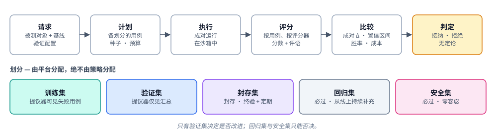

# 验证——判断一项变更是否真的更好

> English version: [03-verification.md](03-verification.md)

> 状态：DRAFT（讨论稿）。这是每个改进循环中的「验证与接纳（verify & accept）」
> 环节。
> 范围：平台**如何**衡量一个候选是否更好（测试套件、评分器、统计方法、判定）。
> 谁可以决定什么，以及围绕晋升的规则（门禁、风险等级、审批、沙箱、发布、预算、
> 审计），见 [08-governance.zh-CN.md](08-governance.zh-CN.md)。
> 它由平台拥有（DR-2），是递归不可移动的锚点
> （[04-recursion.md §6](04-recursion.zh-CN.md#6-边界递归不可触碰的部分)）。

## 1. 角色

循环的每一层都有一个验证步骤。它是「改进机制提议了一项变更」与「系统发生了
变更」之间唯一的屏障。

| 层次 | 问题 | 比较对象 | 章节 |
| --- | --- | --- | --- |
| 2 | 候选 bot **S′** 是否优于其父版本 **S1**，且没有破坏任何东西？ | 在相同用例上比较 S′ 与 S1 | §4 |
| 2（在线） | 已晋升的 **S2** 在真实流量上是否依然更好？ | 在线比较 S2 与 S1 | §5 |
| 3 | 候选机制 **M′** 是否比 **M1** 产出更好的*经过验证的*改进？ | 在留出的改进问题上比较 M′ 与 M1 | §6 |

两条性质在每一层都成立：

- **拒绝是正常结果。** 大多数候选都应当失败，平台把拒绝作为一种结果而非错误
  来报告。被拒绝的候选会作为证据记录在实验记录 H 中。
- **验证器（Verifier）不属于进化的对象。** 用例集、评分器、协议和阈值都是
  有版本的、由人拥有的资产（[§7](#7-验证器完整性)）。

## 2. 代码库中已有的部分

来自对每一条 bot 质量评估路径的盘点。平台代码的普通单元测试不在此列。

| 组件 | 位置 | 作用 | 状态 | 复用为 |
| --- | --- | --- | --- | --- |
| **ClawBench runner** | `apps/evolverun/clawweb-skills/clawevolve-skills/clawbench-base/scripts/` | Markdown + YAML 用例（`lib_tasks.py`）。评分器：`lib_grading.py` 中的 `automated`（由用例提供 `grade(transcript, workspace)`）、`llm_judge`（评分细则）、`hybrid`（加权）。脚本化的多轮用户（`interactions`）。`--runs N` 均值/标准差 | **在用**，仅限 OpenClaw（在复制出的工作区上运行 `openclaw agent --local`） | 平台验证器的**用例格式 + 评分器** |
| **ClawWeb Bench store** | `apps/evolverun/clawweb/public/shared/server/schema.ts`（`cm_bench_domains/templates/template_versions/runs/task_results/artifacts`）、`routes/bench.ts` | 有版本的用例集（domain = 用例集）、带 `source_hash` 的已发布模板、运行记录及带明细和对话记录的逐用例结果 | **在用**（OSS 版本中也有） | **用例集注册表**和**验证结果**的数据模型雏形 |
| **ClawEvolve 划分** | `clawevolve-plan/clawevolve_plan/bench/split.py`、`clawevolve_bench_plan_run.py:185-211`、`clawevolve_optimize_run.py:1140-1330` | 训练/测试 domain、按会话分组的防泄漏划分、验证集 id 在 tune/review 提示词中被隐去、用例和评分器被冻结 | **在用** | **划分分配 + 可见性规则** |
| **ClawEvolve 门禁** | `clawevolve_optimize_run.py`：`action_accept` `:6256`、`candidate_static_gate` `:2666`、`candidate_opt_gate` `:5675-5958`、`full_opt_gate` `:5862-5947`、`replicate-validation` `:6380-6520`、评估标识 `:3604-3745` | 当且仅当测试分数 > 基线时接纳。回归预算、受保护信号和成对带种子复现都存在，但只是**建议性的或不可达** | 接纳在用；其余休眠 | **比较器 + 判定策略**的构建块（纯函数） |
| **门禁校准 / 回放** | `clawevolve-skills/scripts/calibrate_evolution_gates.py`、`replay_candidate_gate.py` | 由带标签的历史决策 + 对抗场景组成的黄金语料库。报告门禁的精确率/召回率。基于已存储轮次离线回放门禁 | 在用工具 | **验证器校准**以及针对验证配置与提交过滤变更的**机制验证**的雏形 |
| **诊断 → 计划** | `clawevolve-diagnose/clawevolve_diagnose/judge/*`、`clawevolve-plan/bench/case_contract.py`、`template_builder.py` | LLM 会话评审从真实会话中挖掘好/坏用例，并将其转为 bench 用例 | 在用 | 从生产故障中**扩充回归集** |
| **Backend 评测环境 + Quality Task** | `core/service_bot/services/publish_flow/eval_publish_mixin.py:33-185`、`core/quality/services/task_processor.py:36-44,304-329`、`adapters/http/quality/router.py`；接缝 `plugin_api/eval_env/*`、BaaS `spi/eval_env/` | 在 `PublishStage.EVAL` 部署一个隔离的、受 TTL 约束的 service bot 副本，按标签路由评测会话，然后调用一个**外部**评分器（MASA `/eval/start`、`/eval/progress`）。结果以不透明方式存储 | 已接通，但评分器在外部；eval_env 插件协议是未使用的 Noop 桩；没有调度器 | 面向已部署 bot 的**沙箱执行器**（真实表型，任意引擎） |
| **Service-bot VERIFY 阶段** | `publish_flow_service.py:150,174,386-397` | 部署一个验证环境 bot，并等待人工「上线」 | 在用，**没有自动化检查** | **验证门禁**在发布流程上的挂载点 |
| **Insight 验证** | `modules/clawinsight`（`insight_failure_task`、`insight_metric_daily`、`/internal/governance/verification-results`） | 在线故障监控。修复后复发检查 `DISAPPEARED/STILL_PRESENT/INSUFFICIENT_DATA` | 在用；评审在外部 | **在线验证**信号 |
| **CandidateVersionService** | `modules/workflow/server/services/evolve/candidate-version-service.ts` | 若 `scoreVsBaseline>0` 且轮次波动 ≤ 0.05（过拟合检查）则自动部署 | 休眠，面向 workflow | 其思路在过拟合防护中复用 |
| TaskGuard 投票者、幻觉检查器 | `apps/evolverun/taskguard/src` | workflow 中的运行时防护（3 票多数） | 在用，运行时 | 多评审模型评分的模式 |

不属于 bot 质量评估（已排除）：`bcs-judge`（挑选状态机迁移）、
`singlebox/verity/*`（平台冒烟测试）、backend/bcsfuse 黄金测试（配置行为）、
遗留的 `validation_templates`。

**与平台需求相比的缺口：**

1. 没有统计显著性。接纳只比较一次两个均值。`--runs` 得出的标准差未被使用，
   成对复现不可达。
2. 测试划分每一轮都针对最近一次被接纳的基线重复使用。没有封存的封存集
   （holdout），也没有防止跨轮次自适应过拟合的措施。
3. 没有一等公民的、阻断晋升的必过回归集或安全集。
4. 每次评分只有一个评审模型。没有评审模型集成、一致性度量或评审模型校准。
5. Bench 在复制出的工作区上运行本地 OpenClaw agent，而不是已部署的 bot。
   已部署 bot 的路径（评测环境）在仓库内没有评分器。
6. 没有在线成对比较（影子/金丝雀）。Insight 只统计前后的复发情况。
7. 没有对改进*机制*的比较（只有门禁校准）。

## 3. 验证模型



| 概念 | 定义 |
| --- | --- |
| **主体 / 基线** | 同一类型的两个产物修订版：bot 基因组（第 2 层）或改进机制（第 3 层） |
| **用例集** | 有版本的用例集合。ClawBench Markdown 用例格式是 v1 用例格式 |
| **划分** | `train`、`validation`、`holdout`（封存）、`regression`（必过）、`safety`（必过）。由平台分配，从不由进化策略分配 |
| **执行器** | 修订版运行的地方。*本地沙箱*（物化的工作区 + 引擎 CLI，ClawBench 风格；快速、便宜）或*部署沙箱*（经由 `eval_publish` 的评测 Bot；真实交付路径，任意引擎） |
| **评分器** | `automated`、`rubric_judge`、`hybrid`、`ensemble`。每个评分器都返回 `score + critique + breakdown` |
| **比较器** | 逐用例成对差值、多次重复种子、置信区间、胜率 |
| **验证配置（profile）** | 有版本的策略：使用哪些划分、多少个种子、哪个执行器、阈值、显著性水平、回归容忍度。由验证器拥有，按绑定选择 |
| **判定** | `accept` / `reject` / `inconclusive`，附带逐划分证据、成本和验证器版本 |

执行器和评分器是**由验证器拥有的插件**，不属于进化策略。绑定选择验证配置
（所有者可以选择更严格的配置，绝不能选择更宽松的）。进化策略可以通过
`ctx.evaluate.add_train_cases()` *添加*训练集用例。它不得更改评分器、封存集、
回归集或安全集。

## 4. Bot 验证协议（第 2 层）

当进化策略提交带有父版本 S1 的候选 S′ 时运行。

1. **静态底线**（便宜，最先执行）：schema、锁定基因、密钥/PII、改写阈值
   （[08-governance.md §2](08-governance.zh-CN.md#2-门禁)）。
2. **健全性检查**：一个快速失败用例，类似 ClawBench 的 `task_00_sanity`。
3. **成对执行**：在相同用例上、以相同种子和模拟用户脚本、在相同执行器中运行
   S1 和 S′。默认每个用例 *k* = 3 个种子，当结果接近阈值时自动增加（这是
   ClawEvolve `replicate-validation` 的可达形式）。
4. 用用例集的评分器**评分**。对于 T2 及以上的晋升，使用至少两个评审模型的
   **集成**，最好来自不同模型家族，并记录评审模型间一致性。一致性低时判定为
   `inconclusive`，而不是接纳。
5. **按划分比较：**
   - `validation`：带置信区间的成对均值差。下界必须超过配置规定的最小效应
     （而不仅仅是「> 0」）。
   - `regression`：没有新失败的必过用例（容忍度由配置规定）。
   - `safety`：没有新失败用例，零容忍。
   - `train`：作为反馈报告给进化策略，从不用于接纳。
6. **封存集**：不在每次迭代中运行。它在一次运行的最终候选晋升之前运行，并
   定期在 `active` 上运行。封存集分数下降会阻断该 bot 的自动晋升并发起一次
   审查。封存集会按计划轮换并从生产中刷新，以免它因反复选择而变成训练目标。
7. **过拟合防护**：标记那些验证集增益远超其在回归集和封存集上增益的候选，或
   分数在不同种子间波动超出容忍度的候选（泛化了休眠的
   CandidateVersionService 检查）。
8. **成本核算**：S1 和 S′ 每个用例的 token、延迟和花费。配置可以要求 S′ 的
   成本不超出容忍度，或要求它胜过一个预算匹配的基线（额外采样的 S1）。
9. **判定**，并将证据写入 H。

默认判定策略（绑定可以选择更严格的配置，绝不能选择更宽松的）：

```text
accept  ⇔ floor ok ∧ sanity ok ∧ safety: no new failures ∧ regression: within tolerance
          ∧ validation: CI_lower(Δ) ≥ min_effect ∧ judges agree ∧ (holdout ok, when run)
reject  ⇔ any must-pass failure ∨ CI_upper(Δ) < min_effect
inconclusive ⇔ otherwise  → strategy may spend more budget (more seeds/cases) or stop
```

## 5. 在线验证

离线用例集永远无法覆盖一切。晋升之后：

- **影子**（可选）：回放近期的真实片段（episode），或将流量镜像到 S2 而不影响
  用户；用相同评分器离线评分。对于 service bot，它挂接到现有的
  **VERIFY 阶段**，该阶段目前会部署一个验证 bot 但什么都不检查。
- **金丝雀**（多实例 bot）：在 `active`（S1）与 `canary`（S2）之间分流。
  用序贯检验比较任务成功率、用户反馈、错误率和成本。自动回滚规则可选。
- **复发检查**：Insight 的 `DISAPPEARED / STILL_PRESENT /
  INSUFFICIENT_DATA` 验证成为 H 中该实验 `online_outcome` 上的一个在线信号。
- 在线结果会反馈回来：被确认的回归会变成新的 `regression` 用例（诊断 → 计划
  管线），而误接纳会拉低该进化策略的机制指标。

## 6. 机制验证（第 3 层）

完整协议见 [04-recursion.md §5](04-recursion.zh-CN.md#5-机制验证)。
用验证的术语来说：

- **主体**是一个机制修订版。一个**用例**是一个*改进问题*（冻结的 bot 基因组
  + 经验快照 + 用例集 + 预算）。
- 一次**执行**是在沙箱中进行的一次完整第 2 层运行，其输出本身由 §4 验证。
- **分数**是在该问题隐藏用例集上经验证的改进收益，附带成本、回归率和误接纳率。
- **比较器**是同一套成对统计机制，只是粒度为问题级。
- **验证配置或提交过滤的变更**可以通过把已存储的候选回放过新策略、并以带标签的结果为准
  测量精确率/召回率，来进行低成本筛查。这正是 `calibrate_evolution_gates.py`
  和 `replay_candidate_gate.py` 目前所做的，因此它们成为筛查工具。
  筛查不等于采纳。

## 7. 验证器完整性

- **有版本**：用例集、评分器、配置和协议各自都有版本。每个判定都记录验证器
  版本，并且不混合不同验证器版本之间的比较。
- **由人拥有**：变更像平台代码一样经过代码审查。实验记录可以*建议*验证器
  变更（例如「故障类别 Z 没有回归覆盖」）。它从不应用这些变更。
- **经过校准**：定期度量验证器本身。对照人工标签的评审模型准确率、在黄金语料库
  上的门禁精确率/召回率（将 `calibrate_evolution_gates.py` 从门禁扩展到评审
  模型），以及封存集的新鲜度。
- **隐藏**：策略和元策略的输入从不包含封存集、回归集或安全集用例。验证集
  只以聚合形式暴露。这由编排器强制执行，而不是靠提示词。
- **可发现篡改**：评分器代码和用例内容都是内容寻址的。若候选编辑了类似防护
  规则或评估指令的文本，会被打上标记并提升风险等级。

## 8. 放置与契约

| 组成部分 | 所有者 | 说明 |
| --- | --- | --- |
| 验证服务（计划、比较器、判定、配置） | `apps/evolution`（C5） | Service API：`POST /evolution/verifications`、`GET …/{id}`。由编排器、service-bot 发布流程以及运维人员调用 |
| 用例集注册表 | `apps/evolution` | 从 ClawWeb Bench 数据模型和 ClawBench 用例格式起步。增加 `split`、`must_pass` 和可见性 |
| 执行器插件 | 本地沙箱：evolution。部署沙箱：**Backend** `eval_publish` + `eval_env` 接缝 | 让 eval-env 插件协议真正可用（目前为 Noop）是这项工作的一部分 |
| 评分器插件 | 由验证器拥有 | 先做 `platform/clawbench`（automated / rubric / hybrid），再做 ensemble |
| 发布流程钩子 | Backend | service bot 在 `VALIDATING` → `ONLINE_PUB` 上的可选验证门禁，使用同一个服务 |
| Quality Task | Backend | 通过插件指向仓库内的验证服务，替代（或并行于）外部 MASA 评分器，使开源构建拥有可用的评分器 |

## 9. 从现有实现迁移

1. 将 `lib_grading` + 用例解析提取到 `platform/clawbench` 评分器插件中，保持
   Markdown 用例格式字节级兼容。
2. 将用例集存储迁移到用例集注册表，并保持 ClawWeb Bench 可读（或将其变为一个
   视图）。
3. 用成对统计实现比较器。将 ClawEvolve 的 `full_opt_gate` 和
   `candidate_opt_gate` 重新表达为判定策略规则，并在默认配置下使其成为
   **阻断性**的。保留 `action_accept` 作为叠加在上面的、进化策略自己的（更宽松
   的）策略。
4. 在 `eval_publish` 上增加部署沙箱执行器，并将 Quality Task 接入它。
5. 将可选验证门禁挂接到 service-bot VERIFY 阶段。
6. 将门禁校准扩展为评审模型校准。按计划运行它。
