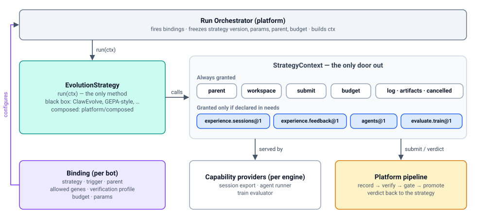

# Strategy SDK — making evolution pluggable

> 中文版：[05-strategy-sdk.zh-CN.md](05-strategy-sdk.zh-CN.md)

> Status: DRAFT. How a team plugs an evolution approach (ClawEvolve today,
> others later) into the platform without changing platform code.

## 1. Principles

1. **One port.** The platform knows a single strategy interface with a
   single method, `run(ctx)`. ClawEvolve, another team's optimizer, and the
   platform's own composed strategy all implement the same port.
2. **One door out.** A strategy reaches the platform only through the
   context it is given. It cannot promote, read held-out tests, touch the
   live bot, or read platform storage. Isolation and budgets are therefore
   enforced in one place, whatever the strategy is.
3. **Strategies propose; the platform decides.** A strategy submits
   candidates. Recording, verification, the gate, and promotion stay
   platform-owned (DR-2).
4. **Facts about code are registered; choices about bots are configured.**
   What a strategy version needs is fixed and registered with it. Which
   strategies a bot uses, and how, is per-bot configuration that changes at
   any time.
5. **Few concepts, defined once.** Every term below has one definition; no
   field restates another (for example, engine compatibility is derived from
   `needs`, not declared separately).



## 2. Domain model

| Concept | What it is | Owned by | Changes when |
| --- | --- | --- | --- |
| **Strategy** | Code implementing `run(ctx)`, plus its registration record (§3) | Strategy author | New strategy version |
| **Capability** | A named, versioned part of the context a strategy may use, from a platform-owned catalog (§4) | Platform | Platform contract change |
| **Binding** | One entry in a bot's evolution policy: which strategy, when, what it may change, how it is verified, budget, params (§5) | Bot owner / tenant admin | Any time |
| **Run** | One execution of a binding, with strategy version, params, parent, and budget frozen at start (§7) | Platform | — |
| **StrategyContext** | The run's only door to the platform: always-granted parts plus the capabilities the strategy needs (§6) | Platform | — |
| **Candidate → Verdict** | A Genome Patch the strategy submits, and the platform's verification result for it (§6) | Strategy → platform | — |

## 3. Strategy: code plus a registration record

The interface is one method:

```python
class EvolutionStrategy(Protocol):
    async def run(self, ctx: StrategyContext) -> RunSummary: ...
```

The registration record is stored in the Strategy Registry (C3) when a
version is registered. It is data, not a method, because the platform needs
it without running the strategy's code (for example, before a job-worker
container exists):

```jsonc
// Illustrative. Comments explain the example only; the canonical form is plain JSON (RFC 8785).
{
  "id": "clawevolve/bot-evolution",
  "version": "2.0.0",
  "runtime": {"kind": "job_worker", "image": "registry.example/clawevolve@sha256:…"},
  "needs": {                                       // capabilities from the catalog (§4), with arguments
    "experience.sessions@1": {},
    "agents@1": {"engines": ["openclaw"]},         // also implies which bots it can run on
    "evaluate.train@1": {}
  }
}
```

There is no separate `supports_engines`: a binding check derives engine
compatibility from `needs` (§5).

## 4. Capability catalog

The platform owns a small, closed, versioned catalog. Each entry names a
part of `StrategyContext` and is a contract: method signatures, data schema,
semantics, and a conformance test (R25). Strategies can only declare names
from the catalog. Each entry has **providers per engine** (for example, the
engine adapter's session export provides `experience.sessions` for
OpenClaw), which is how a binding check knows what a bot can supply.

| Capability | Context part | What it gives | Notes |
| --- | --- | --- | --- |
| *(always granted)* | `parent`, `workspace`, `submit`, `budget`, `log`, `artifacts`, `cancelled` | Read the parent revision; materialise revisions to a sandbox and diff back to a patch; submit candidates; budget, logs, artifacts, cancellation | Nothing to declare |
| `experience.sessions@1` | `ctx.experience.sessions()` | The bot's past conversations as normalized episodes, filtered | Reads conversation history; shown to owners |
| `experience.feedback@1` | `ctx.experience.feedback()` | Ratings, corrections, outcomes, and subject-bot observations from the inbox | |
| `agents@1` `{engines}` | `ctx.agents.run(engine, …)` | Run an engine agent inside a sandbox workspace | The engine list must include the bot's engine |
| `evaluate.train@1` | `ctx.evaluate.train(…)`, `ctx.evaluate.add_train_cases(…)` | Platform evaluation on the **train split only**, with scores and critiques; adding train cases | Validation, holdout, regression, and safety stay hidden |

Adding an entry is a reviewed platform change. A breaking change publishes a
new version (`@2`) so registered strategies keep working.

## 5. Binding: which strategies a bot uses

A bot's evolution policy is a list of bindings. Different bots use different
strategies, and a bot may use several:

```jsonc
// Illustrative. Comments explain the example only; the canonical form is plain JSON (RFC 8785).
// Evolution policy of bot_123 (OpenClaw support bot)
{
  "bindings": [
    {
      "strategy": "clawevolve/bot-evolution@2.0.0",
      "trigger": {"schedule": "0 2 * * *"},           // or {"manual": true}, {"event": "failure_rate_alert"}
      "parent": "active",                             // which revision runs start from
      "allowed_genes": ["persona", "skills"],         // what this strategy may change on THIS bot
      "verification_profile": "default@1",            // owners may pick a stricter one, never a looser one
      "budget": {"max_usd": 20, "max_wall_clock_s": 7200},
      "params": {"window_days": 7, "max_rounds": 3}   // validated by the strategy
    },
    {
      "strategy": "platform/consolidate-memory@1.0.0",
      "trigger": {"schedule": "0 4 * * 0"},
      "parent": "active",
      "allowed_genes": ["memory"],
      "verification_profile": "default@1",
      "budget": {"max_usd": 5, "max_wall_clock_s": 1800},
      "params": {}
    }
  ]
}
```

When a binding is created or changed, the platform checks it against the
bot. Every capability in `needs` must have a provider for the bot's engine;
`agents@1` must list the bot's engine; `allowed_genes` must stay within the
bot's `policy` (locked genes stay locked). A mismatch is rejected at
configuration time, not partway through a paid run.

Triggers, parent choice, allowed genes, and verification strictness are
binding fields, owned by the bot owner. They are not strategy code.

## 6. StrategyContext, candidates, and verdicts

```python
class StrategyContext(Protocol):
    run_id: str; params: dict                       # frozen at run start
    parent: GenomeRevisionView                      # read-only: spec, files by digest, lineage
    workspace: WorkspaceFactory                     # materialise(revision) → sandbox dir; ws.to_patch()
    budget: BudgetMeter                             # remaining(); charge(); raises BudgetExhausted
    log: RunLog; artifacts: ArtifactSink; cancelled: CancellationToken
    async def submit(self, c: Candidate) -> Submission: ...

    # present only if declared in `needs`; otherwise access raises CapabilityNotGranted
    experience: ExperienceQuery                     # experience.sessions@1 / experience.feedback@1
    agents: AgentRunner                             # agents@1
    evaluate: TrainEvaluator                        # evaluate.train@1
```

- **Candidate** = a Genome Patch against a base revision, a rationale,
  evidence ids, and optional self-reported metrics (shown to reviewers,
  never used for acceptance).
- **Submission** = the recorded candidate revision id, plus
  `await verdict()`. The verdict is `accept`, `reject`, or `inconclusive`,
  with validation **aggregates** only, never per-case hidden data.
- `submit` is idempotent: the candidate id is the content hash of the
  patch, so a retried submission does not create a duplicate.
- A strategy **may wait for a verdict inside a run**. Multi-round
  strategies such as ClawEvolve build the next round on the last accepted
  candidate. Waiting is bounded by the binding's `max_wall_clock_s`.
- What a strategy submits is its own choice (its heuristics decide what is
  worth submitting). Whether a candidate is accepted is the platform's
  choice: verification under the binding's profile, then the gate and risk
  tier ([08-governance.md §2](08-governance.md#2-the-gate)).

## 7. Run lifecycle

```text
queued → running → completed | failed | cancelled | budget_exhausted
```

- **Start:** the orchestrator freezes the strategy version, params, parent,
  and budget; builds the context with exactly the granted capabilities; and
  reserves the budget.
- **During:** every model call and evaluation is charged to the budget. A
  job-worker run holds a lease with a fencing token; a lost lease ends the
  run as `failed`.
- **End:** submissions made before a failure, cancellation, or budget stop
  are kept and still verified. Every submission, accepted or rejected, is
  recorded in the Experiment Ledger H with the strategy version.

## 8. Two tiers on the same port

| Tier | What a team writes | When to use |
| --- | --- | --- |
| **Black box** | A whole strategy: `run(ctx)` plus a registration record | An existing engine with its own inner loop (ClawEvolve, a GEPA-style optimizer, a coding-agent loop). This is the default way to plug in |
| **Composed** | One step for `platform/composed`, a built-in strategy whose params are a flow of small steps (for example: analyze → propose) | Reusing most of an existing strategy and swapping one piece (for example, only a better failure analyzer) |

Both tiers look identical to the orchestrator. The composed tier's step
types (analyzer, proposer, and so on) are defined only when a second team
actually needs to swap a piece (R19: abstract after two examples). Until
then, ClawEvolve and other strategies plug in as black boxes.

## 9. Runtimes

| `runtime.kind` | How it runs | How `ctx` reaches it |
| --- | --- | --- |
| `in_process` | Python package loaded by the `apps/evolution` composition root, selected by configuration (R5/R14) | Direct Python objects |
| `job_worker` | Container image (any language), or a runner bot using the `avn` CLI | The Job Protocol below: each `ctx` call maps to one HTTP endpoint |

### Job Protocol

```text
POST /evolution/v1/jobs:claim                       {worker_id, strategy_ids[]} → job {run_id, params, parent, budget, granted}
POST /evolution/v1/jobs/{id}/heartbeat              (lease extension; fencing token)
GET  /evolution/v1/runs/{run}/parent                ctx.parent
GET  /evolution/v1/runs/{run}/content/{digest}      file bytes of the parent / workspace
GET  /evolution/v1/runs/{run}/experience/sessions   ctx.experience.sessions   (if granted)
GET  /evolution/v1/runs/{run}/experience/feedback   ctx.experience.feedback   (if granted)
POST /evolution/v1/runs/{run}/agents:run            ctx.agents.run            (if granted)
POST /evolution/v1/runs/{run}/evaluations:train     ctx.evaluate.train        (if granted)
POST /evolution/v1/runs/{run}/candidates            ctx.submit → {revision_id}
GET  /evolution/v1/runs/{run}/candidates/{id}/verdict
POST /evolution/v1/runs/{run}/budget:charge         ctx.budget.charge
POST /evolution/v1/jobs/{id}/complete | /fail       RunSummary | {reason, retryable}
```

All payloads are JSON with JSON Schemas. A worker gets no credentials to
the bot; endpoints for capabilities that were not granted return `403`.

## 10. Examples

**ClawEvolve as a black-box strategy.** Its internals stay: diagnose logic,
tune prompt, mutation operator library, round loop. Only the edges move to
the context.

```python
class ClawEvolveStrategy(EvolutionStrategy):
    async def run(self, ctx):
        findings = diagnose(await ctx.experience.sessions(days=ctx.params["window_days"]))
        await ctx.evaluate.add_train_cases(plan_bench(findings))          # platform assigns splits
        base = ctx.parent
        for round_no in range(ctx.params["max_rounds"]):
            ws = await ctx.workspace.materialise(base)                   # sandbox, not the live bot
            await ctx.agents.run("openclaw", agent="clawevolve-tune", workspace=ws,
                                 prompt=build_tune_prompt(findings, history))
            train = await ctx.evaluate.train(ws)                         # replaces its own bench step
            if train.score <= history.best_train:
                continue                                                 # its own heuristic
            sub = await ctx.submit(Candidate(patch=ws.to_patch(), rationale=..., evidence=findings.ids))
            verdict = await sub.verdict()                                # the platform decides
            history.record(round_no, train, verdict)
            if verdict.accepted:
                base = verdict.revision                                  # next round builds on it
        return RunSummary(rounds=round_no + 1)
```

**Another team's optimizer in another language.** A TypeScript, GEPA-style
prompt optimizer registers with `runtime.kind: "job_worker"` and
`needs: {"evaluate.train@1": {}, "experience.feedback@1": {}}`. It claims
jobs and calls the Job Protocol. It never learns how revisions are stored,
how verification works, or how service bots are published. A candidate it
submits:

```jsonc
// Illustrative. Comments explain the example only; the canonical form is plain JSON (RFC 8785).
{
  "patch": {"patch_schema": 1, "base": "sha256:a90b…",
            "ops": [{"op": "file.edit", "target": "skills/refund-policy/SKILL.md",
                     "edits": [{"kind": "replace_section", "heading": "## When to use", "content": "…"}]}]},
  "rationale": "Best on 14/20 train cases; fixes trigger misses on partial refunds",
  "evidence": ["episode:ep_91", "eval:train_77"],
  "self_metrics": {"train_score_pct": 82}
}
```

## 11. SDK and conformance

| Package | For | Contents |
| --- | --- | --- |
| `avernet-evolution` (Python), `@avernet/evolution` (TS) | Callers: pipelines, CI, UI backends | Generated client for the Evolution API (bindings, runs, verdicts) |
| `avernet-evolution-strategy` (Python first, TS second) | Strategy authors | `EvolutionStrategy` base, typed models, an in-process and a Job-Protocol `StrategyContext`, `WorkspaceFactory` (materialise / `to_patch`), `AgentRunner` (OpenClaw first), a local harness with a fake platform (`avn strategy dev`), and the conformance kit |

Conformance runs on both sides of the port:

- **Strategy kit** (run by authors, and by C3 before a version can be bound
  outside development): candidates validate against the patch schema and
  the run's `allowed_genes`; the strategy uses only granted capabilities;
  it stops on cancellation and on `BudgetExhausted`; resubmitting the same
  candidate is idempotent.
- **Capability providers** (run by the platform and engine adapters): each
  catalog entry has a contract test per engine provider, following
  `docs/arch/protocol-contract-tests.md`.

## 12. Evidence that the port is general enough

| Strategy | Shape | Fits the port by |
| --- | --- | --- |
| ClawEvolve (`apps/evolverun`) | Multi-round tune → bench → review | Black box; `agents`, `experience.sessions`, `evaluate.train`; waits on verdicts between rounds |
| `platform/consolidate-memory` ([07-default-strategy.md §5](07-default-strategy.md#5-a-second-non-clawevolve-default-memory-consolidation)) | Scheduled consolidation of observations into memory items | Black box; `experience.feedback` only; one submission per run |
| GEPA / OPRO-style optimizers | Population search with reflective mutation | Black box; `evaluate.train` for fitness; submits the best candidates |
| Coding-agent strategy (Meta-Harness style) | Agent edits files with full history | Black box; `workspace` + `agents` |
