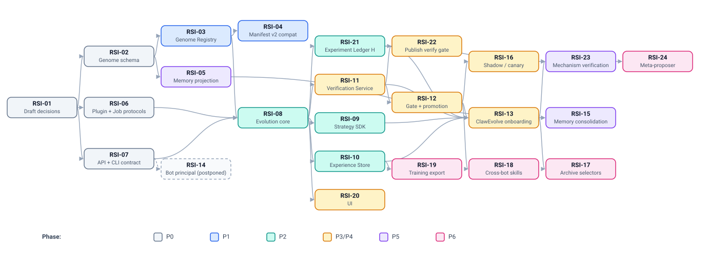

# Work items

> 中文版：[10-work-items.zh-CN.md](10-work-items.zh-CN.md)

> Status: DRAFT. Each item is sized for one follow-up session to take through
> SDD (spec → plan → tasks → implement) or, for design-only items, to a
> reviewed contract document. Start each with the documents listed under
> *Read first*. Implementation specs go in the owning module's specs
> directory (`apps/backend/specs/YYYY-MM-DD-<topic>/`,
> `engine/adapter/specs/…`); design-level additions extend this directory.

## Dependency graph

Critical path to a first useful outcome: **RSI-01 → RSI-02 → RSI-03 → RSI-04**
(versioned bots that can go back to any earlier revision). Critical path to "ClawEvolve on the
platform": add RSI-06 → RSI-08 → RSI-09/10/11/12 → RSI-13. Level 3
(RSI-23 → RSI-24) is out of the first iteration, which focuses on level 2;
RSI-21 still records experiments from the start.
RSI-11 → RSI-22 gives service bots an automated verify gate independently of
the rest.

---

## P0 — Contracts and decisions

### RSI-01 Accept or revise the three draft decisions
- **Module**: arch
- **Goal**: Owners decide DR-1 (genome = unit of evolution, built on
  Manifest), DR-2 (promotion is platform-owned), DR-3 (bot principal for the
  evolution surface). Also decide open decision D-1 (control-plane module
  placement) from [01-design.md §5](01-design.md#5-ownership-and-module-placement).
- **Read first**: [01-design.md](01-design.md), [02-genome.md](02-genome.md),
  [08-governance.md](08-governance.md), [06-interfaces.md §6](06-interfaces.md#6-authentication-and-authorization).
- **Deliverable**: DR-1..DR-3 accepted (promoted to `docs/adr/` with the next
  free numbers) or revised; D-1 recorded.
- **Done when**: each ADR has an owner, and the engine owners have
  explicitly signed off on the memory consequence in DR-1.

### RSI-02 Genome schema and patch format
- **Module**: backend (contract), engine (review)
- **Goal**: Normative JSON Schema for Genome Revision (`spec`, `policy`,
  `revision` metadata) and Genome Patch (ops, risk-tier mapping, rewrite
  threshold), canonicalisation rules for the content hash (RFC 8785 canonical JSON, see
  [02-genome.md §7.3](02-genome.md#73-serialization-canonical-json)), and the mapping to
  and from Manifest schema v1.
- **Read first**: [02-genome.md](02-genome.md); `manifest-schema.zh-CN.md`;
  `schema/validator.py`.
- **Deliverable**: `apps/backend/specs/<date>-bot-genome-schema/` with schema files,
  examples, and a compatibility table against Manifest v1.
- **Done when**: every Manifest v1 example round-trips into a revision;
  every patch op has a defined risk tier; reviewers agree on locked-gene
  defaults.

### RSI-06 Plugin protocols and Job Protocol
- **Module**: evolution (new), arch
- **Goal**: Define each plugin kind's Protocol and JSON Schema I/O
  (ExperienceSource, Trigger, Selector, Analyzer, SuiteBuilder, Proposer,
  Evaluator, AcceptancePolicy, Curator, MetaProposer), lifecycle and failure semantics (R11),
  isolation/capability declarations (R13), and the Job Protocol wire contract
  (claim/lease/fencing/heartbeat/complete/fail, artifact upload).
- **Read first**: [05-strategy-sdk.md](05-strategy-sdk.md); ClawEvolve
  `official-stage-catalog.json`, `routes/internal/evolve.ts`;
  `docs/arch/protocol-contract-tests.md`.
- **Deliverable**: contract docs + schema files; strategy manifest schema.
- **Done when**: ClawEvolve's diagnose/plan/tune/bench/accept I/O can each
  be expressed in the schemas without loss (checked by mapping table).

### RSI-07 Evolution API and CLI contract
- **Module**: evolution, backend, gateway
- **Goal**: OpenAPI for Genome and Evolution resources (async pattern,
  idempotency, ETags, error envelope consistent with OpenAPI v1), and the
  `avn` command tree with JSON output schema and exit codes.
- **Read first**: [06-interfaces.md](06-interfaces.md);
  `apps/backend/docs/openapi-v1/README.md`; `apps/bcs/crates/tools/bcs-cli/CONTEXT.md`.
- **Deliverable**: OpenAPI draft + CLI reference doc; decision on Q1 (new
  `avn` binary vs other).
- **Done when**: every actor flow in interfaces §2 is executable on paper with
  the listed endpoints and scopes.

## P1 — Versioned bots (useful independently of RSI)

### RSI-03 Genome Registry in Backend
- **Module**: backend
- **Goal**: Revisions table, refs with CAS, patch apply/validate, diff,
  pinned source resolution into the content store, lineage queries.
  Promotion API that moves `active` and invokes Manifest apply.
- **Depends on**: RSI-02.
- **Read first**: [02-genome.md §2–§4](02-genome.md#2-shape); `core/bot_config_manifest/`.
- **Done when**: create revision from manifest, from patch; diff any two;
  move refs with conflict detection; conformance + unit tests; singlebox
  acceptance story "edit → revision → apply → go back two revisions by
  promoting an earlier one".

### RSI-04 Manifest v2 compatibility layer
- **Module**: backend
- **Goal**: Existing `/config-manifest` endpoints become views over the
  registry; apply reports record `revision_id`; content-store source so apply
  can read pinned content by digest; promoting any earlier revision works for
  personal bots (via apply) and service bots (as the next published version,
  with `revision_id` on the publish record). The existing service-bot
  rollback feature is not changed.
- **Depends on**: RSI-03.
- **Done when**: all existing manifest tests pass unchanged; new tests for
  revision attribution and going back by promoting an earlier revision.

## P2 — Evolution core

### RSI-08 Evolution service skeleton
- **Module**: evolution (new `apps/evolution`, per D-1)
- **Goal**: Service scaffold following Backend DI/plugin conventions; Run
  Orchestrator state machine with budgets; Strategy Registry; Job Protocol
  endpoints; local profile (SQLite, in-process workers) for singlebox; a
  reference strategy `platform/manual-patch` (Proposer = supplied patch,
  Evaluator = deterministic checks) to exercise the loop end-to-end.
- **Depends on**: RSI-06, RSI-07, RSI-03.
- **Done when**: singlebox story: start run with reference strategy →
  candidate recorded → gate → promoted → bot updated → rollback.

### RSI-09 Strategy SDK and conformance kit
- **Module**: evolution
- **Goal**: Python plugin SDK (models, base classes, JobWorker,
  `GenomeWorkspace` materialise/diff-to-patch, AgentRunner abstraction with
  OpenClaw implementation), local harness, pytest conformance kit, `avn
  strategy dev|test|publish`.
- **Depends on**: RSI-06, RSI-08.
- **Done when**: an example third-party strategy (e.g. OPRO-style persona
  optimizer) is written by someone outside the platform team using only the
  SDK docs, and passes conformance.

### RSI-10 Experience Store and session export v2
- **Module**: evolution + engine adapter
- **Goal**: Episode/feedback/eval-trace model tagged with revision id;
  ingest pipeline; engine `session-export/v2` contract (generalising
  ClawEvolve `session-export/v1`) with OpenClaw implementation first;
  retention and redaction.
- **Depends on**: RSI-08; engine owners.
- **Done when**: episodes from an OpenClaw bot are queryable by revision;
  ClawEvolve diagnose can read from the store.

## P3/P4 — Evaluation, governance, default strategy

### RSI-11 Verification Service (bot verification)
- **Module**: evolution, backend (`eval_publish`, `eval_env`)
- **Goal**: Implement [03-verification.md §3–§4](03-verification.md#3-verification-model):
  suite registry seeded from the ClawWeb Bench model and ClawBench case
  format; platform-assigned splits incl. sealed holdout and must-pass
  regression/safety; `platform/clawbench` grader extracted from
  `lib_grading`; local-sandbox and deployed-sandbox (eval env) executors;
  paired comparator with repeated seeds and confidence intervals; judge
  ensembles; verdict policy with ClawEvolve's `full_opt_gate` /
  `candidate_opt_gate` made blocking; verification profiles.
- **Read first**: [03-verification.md](03-verification.md) (§2 lists the existing
  code to reuse); [08-governance.md §2, §4](08-governance.md#2-the-gate).
- **Done when**: a candidate is verified in a sandbox with paired baseline and
  per-split verdict; proposer job inputs provably exclude holdout,
  regression, and safety; the same case files run unchanged under ClawBench
  and the platform grader.

### RSI-12 Gate, review queue, promotion
- **Module**: backend (gate floor, promotion), evolution (policy plugins)
- **Goal**: Platform floor checks, risk-tier assignment, AcceptancePolicy
  plugin execution, review queue with diff + eval report, approvals,
  owner policy (enabled strategies, auto-promote ceiling, budgets, schedules),
  audit events, kill switches.
- **Done when**: T1 auto-promotes under policy; T2 waits for approval; T3
  rejected while locked; all decisions audited.

### RSI-13 Onboard ClawEvolve as default strategy
- **Module**: evolverun, evolution
- **Goal**: Strangler steps 1–3 from
  [07-default-strategy.md §4](07-default-strategy.md#4-migration-plan-strangler-no-big-bang):
  shadow-record revisions → adapter strategy → native strategy. Tune works on
  a sandbox `GenomeWorkspace`; accept rule becomes `clawevolve/acceptance`
  policy; pack/restore removed from the flow; decide D-2, D-3.
- **Depends on**: RSI-09, RSI-10, RSI-11, RSI-12.
- **Done when**: `clawevolve/bot-evolution` produces the same or better
  results as legacy AgentEvolve on its own bench, through the platform, without
  touching the live workspace.

### RSI-16 Rollout: shadow, canary, auto-rollback
- **Module**: backend, baas
- **Goal**: `canary` ref for multi-instance bots; online metric comparison;
  optional auto-rollback; mapping to service-bot verify stage.
- **Depends on**: RSI-12.

### RSI-21 Experiment Ledger (H)
- **Module**: evolution
- **Goal**: Record every level-2 experiment with the schema in
  [04-recursion.md §3](04-recursion.md#3-experiment-ledger-h) (including rejected
  candidates and later online outcomes); derived mechanism metrics; filesystem
  export for proposers; verifier-version tagging.
- **Depends on**: RSI-08. In the first iteration this is the level-2
  archive and audit trail; deriving mechanism metrics for level 3 can wait,
  but recording should start early because level 3 is only as good as the
  history it learns from.

### RSI-22 Verification gate on service-bot publish and Quality Task
- **Module**: backend
- **Goal**: Optional automated verification gate on the service-bot
  `VALIDATING → ONLINE_PUB` transition, using the Verification Service; point
  the Quality Task at an in-repo grader plugin (alongside the external MASA
  one) so the open-source build has a working bot-quality check.
- **Depends on**: RSI-11.
- **Done when**: a service bot whose verify-stage candidate fails a must-pass
  case cannot be published without an explicit override, and the override is
  audited.

### RSI-23 Mechanism verification and offline replay (later, level 3)
- **Module**: evolution
- **Goal**: (a) Offline replay tool over H for acceptance-policy changes,
  generalising `calibrate_evolution_gates.py` / `replay_candidate_gate.py`;
  (b) improvement-problem benchmark frozen from H and the mechanism
  verification protocol of [04-recursion.md §5](04-recursion.md#5-mechanism-verification),
  used first for **human-authored** strategy changes.
- **Depends on**: RSI-11, RSI-13, RSI-21.
- **Done when**: a change to the ClawEvolve tune prompt is accepted or
  rejected by comparing verified improvement yield against the current
  mechanism on held-out problems.

### RSI-24 Automated meta-proposer (later, level 3)
- **Module**: evolution
- **Goal**: A meta-strategy that reads H and proposes mechanism patches
  (thresholds, prompts, operators, step order), adopted only through RSI-23
  and human approval; bounds of [04-recursion.md §6](04-recursion.md#6-bounds-what-recursion-may-not-touch)
  enforced by static checks.
- **Depends on**: RSI-23.

### RSI-20 UI for runs, review queue, lineage
- **Module**: frontend-nextgen (or AgentEvolve interim)
- **Goal**: Run list/detail, candidate report (diff + per-split eval), review
  actions, genome lineage tree, rollback.
- **Depends on**: RSI-08, RSI-12.

## P5 — Bot-driven evolution

### RSI-14 Bot principal scopes and `avn` bot skill
- **Module**: gateway, backend, evolution, (bcs-cli conventions)
- **Goal**: Implement DR-3: bot principal admission for evolution
  endpoints only, scopes from interfaces §6 enforced via authorization hook;
  `avn` binary delivered via Manifest `cli_tools`; subject-bot and runner-bot
  `SKILL.md`; inbox and observation endpoints with rate limits.
- **Done when**: a singlebox bot records an observation and submits an inbox
  patch through the CLI; attempts to promote or touch another bot are denied
  and audited; leaf-command coverage gate like `bcs-cli`.

### RSI-05 Engine memory projection contract
- **Module**: engine adapter (owner), backend (consumer)
- **Goal**: `export_memory` / `project_memory(mode)` contract, capability
  matrix entries, OpenClaw implementation, teclaw artifact field proposal;
  amend reserved-file rule accordingly.
- **Depends on**: RSI-02, DR-1 accepted.
- **Interim**: until done, memory evolution uses a platform-managed persona
  file (e.g. `LESSONS.md`).

### RSI-15 Memory consolidation strategy
- **Module**: evolution
- **Goal**: `platform/consolidate-memory` per
  [07-default-strategy.md §5](07-default-strategy.md#5-a-second-non-clawevolve-default-memory-consolidation)
  — second, non-ClawEvolve default proving pluggability (R19).
- **Depends on**: RSI-05 (or interim), RSI-13, RSI-14.

## P6 — Open-ended

### RSI-17 Archive selectors
- Pareto-per-case (GEPA), MAP-Elites niches, clade metaproductivity (HGM)
  as Selector plugins; Archive read model exports for proposers.

### RSI-18 Cross-bot skill transfer
- Promoted skills offered to Skill Center under existing governance (ADR
  0010); re-evaluated per consuming bot before adoption.

### RSI-19 Training-data export
- Redacted export of `(input, revision, output, scores, critiques)` and
  accepted/rejected pairs, tenant opt-in only.

## Cross-cutting open decisions (tracked here)

| ID | Decision | Where |
| --- | --- | --- |
| D-1 | Control-plane module placement | 01-design.md §5 → RSI-01 |
| D-2 | Long-term host of default strategy runners (TS vs Python) | 07-default-strategy.md §6 → RSI-13 |
| D-3 | ClawBench as platform default grader | 07-default-strategy.md §6 → RSI-11 |
| D-4 | Workflow YAML as gene or separate artifact | 07-default-strategy.md §6 |
| D-5 | ClawMind analyzer contract; dormant analyzers wire-or-remove | 07-default-strategy.md §6 |
| D-6 | Genome storage: DB + content store (recommended) vs git repo per bot | 02-genome.md; RSI-03 |
| Q1–Q3 | CLI binary, default bot run requests, event delivery | 06-interfaces.md §8 |
