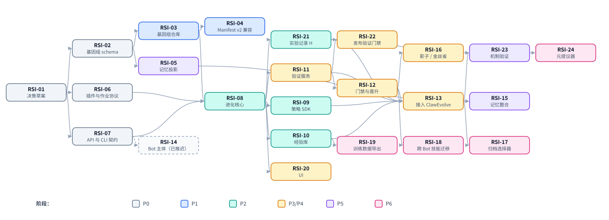

# 工作项

> English version: [10-work-items.md](10-work-items.md)

> 状态：DRAFT（讨论稿）。每个工作项的规模按一次后续会话来划定：该会话可将其按
> SDD（spec → plan → tasks → implement）推进完成；对于仅涉及设计的工作项，则
> 推进到一份经过评审的契约文档。每项开始时先阅读*先读*下列出的文档。实现
> spec 放在所属模块的 specs 目录下（`apps/backend/specs/YYYY-MM-DD-<topic>/`、
> `engine/adapter/specs/…`）；设计层面的补充则扩展本目录。

## 依赖关系图

通往第一个有用成果的关键路径：**RSI-01 → RSI-02 → RSI-03 → RSI-04**
（可以回退到任意更早修订版的版本化 Bot）。通往「ClawEvolve 运行在平台上」的关键路径：
再加上 RSI-06 → RSI-08 → RSI-09/10/11/12 → RSI-13。第 3 层
（RSI-23 → RSI-24）不在第一轮迭代范围内，第一轮迭代聚焦于第 2 层；
RSI-21 仍从一开始就记录实验。
RSI-11 → RSI-22 可独立于其余部分，为服务型 Bot 提供自动化的验证门禁。

---

## P0 — 契约与决策

### RSI-01 接受或修订三项决策草案
- **模块**：arch
- **目标**：由所有者决定 DR-1（基因组 = 进化单位，构建于 Manifest 之上）和
  DR-2（晋升由平台所有）。DR-3（进化接口面使用 Bot 主体）已推迟，直到 Bot 与
  平台的通信方式确定为止。同时决定
  [01-design.zh-CN.md §5](01-design.zh-CN.md#5-归属与模块放置) 中的待决事项 D-1
  （控制面模块放置）。
- **先读**：[01-design.zh-CN.md](01-design.zh-CN.md)、[02-genome.zh-CN.md](02-genome.zh-CN.md)、
  [08-governance.zh-CN.md](08-governance.zh-CN.md)、[06-interfaces.zh-CN.md §6](06-interfaces.zh-CN.md#6-认证与授权)。
- **交付物**：DR-1 和 DR-2 被接受（以下一个可用编号晋升到 `docs/adr/`）或被修订；
  记录 D-1。
- **完成标准**：每份 ADR 都有所有者，且引擎所有者已明确签字认可 DR-1 中关于
  记忆的后果。

### RSI-02 基因组 schema 与补丁格式
- **模块**：backend（契约）、engine（评审）
- **目标**：为基因组修订版（Genome Revision）（`spec`、`policy`、`revision`
  元数据）和基因组补丁（Genome Patch）（操作、风险等级映射、重写阈值）制定
  规范性 JSON Schema，制定内容哈希的规范化规则（RFC 8785 规范 JSON，见
  [02-genome.zh-CN.md §7.3](02-genome.zh-CN.md#73-序列化规范-json)），以及与 Manifest schema v1 之间
  的双向映射。
- **先读**：[02-genome.zh-CN.md](02-genome.zh-CN.md)；`manifest-schema.zh-CN.md`；
  `schema/validator.py`。
- **交付物**：`apps/backend/specs/<date>-bot-genome-schema/`，包含 schema 文件、
  示例，以及与 Manifest v1 的兼容性对照表。
- **完成标准**：每个 Manifest v1 示例都能往返转换为修订版；每种补丁操作都有
  明确的风险等级；评审者就锁定基因的默认值达成一致。

### RSI-06 策略端口、能力目录与作业协议
- **模块**：evolution（新增）、arch
- **目标**：定义策略端口（`run(ctx)`）、`StrategyContext`、
  候选 / 判定（提交返回候选 id；判定按 id 查询）、注册记录 schema、首个能力
  目录（始终授予：`candidates@1`、`models@1`；需声明：`experience.sessions@1`、
  `experience.feedback@1`、`agents@1`、`evaluate.train@1`）及其按引擎的提供方契约（对 `agents@1` 而言，包括按引擎的
  智能体定义契约以及定义的上传与加载，05 §4.2）、进化策略配置（evolution policy，
  即绑定）schema 与绑定检查、运行生命周期与失败语义（R11）：幂等的运行提交并
  返回运行 id、崩溃后以相同运行 id 重新派发的带租约作业、由策略自行负责的进度
  持久化（平台不提供检查点 API）；智能体会话和训练评估的长时操作（启动返回操作
  id，按键幂等；状态按 id 查询；工作运行期间不挂起任何请求）；隔离（R13）；以及
  每个 `ctx` 调用在作业协议（Job Protocol）中的映射。
- **先读**：[05-strategy-sdk.zh-CN.md](05-strategy-sdk.zh-CN.md)；ClawEvolve
  `official-stage-catalog.json`、`routes/internal/evolve.ts`；
  `docs/arch/protocol-contract-tests.md`。
- **交付物**：契约文档 + JSON Schema 文件。
- **完成标准**：ClawEvolve 的轮次循环可以完全基于上下文编写，而无需绕过它
  （用 05-strategy-sdk 中 §10 的草图核对），并且一个非 ClawEvolve 的进化策略
  （记忆整合）能以一组不同的能力适配。

### RSI-07 进化 API 与 CLI 契约
- **模块**：evolution、backend、gateway
- **目标**：Genome 与 Evolution 资源的 OpenAPI（异步模式、幂等性、ETag、与
  OpenAPI v1 一致的错误信封），以及带 JSON 输出 schema 与退出码的 `avn` 命令树。
- **先读**：[06-interfaces.zh-CN.md](06-interfaces.zh-CN.md)；
  `apps/backend/docs/openapi-v1/README.md`；`apps/bcs/crates/tools/bcs-cli/CONTEXT.md`。
- **交付物**：OpenAPI 草案 + CLI 参考文档；对 Q1（新的 `avn` 二进制或其他方案）
  做出决定。
- **完成标准**：interfaces §2 中的每个参与者流程都能在纸面上用所列端点与
  scope 走通。

## P1 — 版本化 Bot（独立于 RSI 也有价值）

### RSI-03 后端中的基因组注册表
- **模块**：backend
- **目标**：修订版表、带 CAS 的引用（ref）、补丁应用/校验、diff、将钉住的源
  解析进内容存储、谱系查询。提供晋升 API：移动 `active` 并调用 Manifest apply。
- **依赖**：RSI-02。
- **先读**：[02-genome.zh-CN.md §2–§4](02-genome.zh-CN.md#2-结构)；`core/bot_config_manifest/`。
- **完成标准**：可从 manifest、从补丁创建修订版；可对任意两个修订版做 diff；
  移动引用时能检测冲突；一致性测试 + 单元测试；singlebox 验收故事「编辑 →
  修订版 → apply → 通过晋升一个更早的修订版回退两个修订版」。

### RSI-04 Manifest v2 兼容层
- **模块**：backend
- **目标**：现有 `/config-manifest` 端点成为注册表之上的视图；apply 报告记录
  `revision_id`；提供内容存储源，使 apply 可以按摘要读取钉住的内容；晋升任意
  更早的修订版对个人 Bot（通过 apply）和服务型 Bot（作为下一个发布版本，并在
  发布记录上带有 `revision_id`）都可用。现有的服务型 Bot 回滚功能不做改变。
- **依赖**：RSI-03。
- **完成标准**：所有现有 manifest 测试无需修改即通过；新增修订版归属与通过晋升
  更早修订版进行回退的测试。

## P2 — 进化核心

### RSI-08 进化服务骨架
- **模块**：evolution（新的 `apps/evolution`，依据 D-1）
- **目标**：遵循后端 DI/插件约定的服务脚手架；带预算、幂等运行提交（幂等键 →
  运行 id）以及租约到期后重新派发的作业租约的进化运行编排器状态机；
  进化策略注册表；作业协议端点；带绑定检查与触发的进化策略配置（绑定）；面向
  singlebox 的本地 profile（SQLite、进程内进化策略）；一个参考进化策略
  `platform/manual-patch`（提交一个提供的补丁；用确定性检查验证），用于端到端
  演练整个循环。
- **依赖**：RSI-06、RSI-07、RSI-03。
- **完成标准**：singlebox 故事：用参考进化策略启动运行 → 记录候选 → 门禁 →
  晋升 → Bot 更新 → 回滚；用相同幂等键重复启动会返回相同的运行 id；在运行中途
  杀掉 worker 会导致以相同运行 id 重新派发，重新派发的运行会重新接上正在运行的
  操作，而不是再次启动它们。

### RSI-09 进化策略 SDK 与一致性测试套件
- **模块**：evolution
- **目标**：Python 策略 SDK：`EvolutionStrategy` 基类、类型化模型、进程内与
  作业协议两种 `StrategyContext` 实现、`WorkspaceFactory`（物化 / `to_patch`）、
  带 OpenClaw 提供方的 `AgentRunner`、带模拟平台的本地 harness（能够杀掉并
  重新派发一次运行，以测试策略自身的恢复）、策略一致性测试
  套件、`avn strategy dev|test|publish`。
- **依赖**：RSI-06、RSI-08。
- **完成标准**：由平台团队之外的人仅凭 SDK 文档编写一个示例第三方进化策略
  （例如 OPRO 风格的人设优化器），并通过一致性测试。

### RSI-10 经验库与会话导出 v2
- **模块**：evolution + engine adapter
- **目标**：带修订版 id 标签的片段（episode）/反馈/评估 trace 模型；摄入管线；
  引擎 `session-export/v2` 契约（泛化 ClawEvolve 的 `session-export/v1`），先做
  OpenClaw 实现；保留期与脱敏。
- **依赖**：RSI-08；引擎所有者。
- **完成标准**：可按修订版查询来自 OpenClaw Bot 的片段；ClawEvolve diagnose
  可以从经验库读取。

## P3/P4 — 评估、治理与默认进化策略

### RSI-11 验证服务（Bot 验证）
- **模块**：evolution、backend（`eval_publish`、`eval_env`）
- **目标**：实现 [03-verification.zh-CN.md §3–§4](03-verification.zh-CN.md#3-验证模型)：
  以 ClawWeb Bench 模型和 ClawBench 用例格式为种子的用例集注册表；由平台分配的
  划分，包括密封的封存集与必过的回归集/安全集；从 `lib_grading` 中抽取的
  `platform/clawbench` 评分器；本地沙箱与已部署沙箱（eval env）执行器；带重复
  种子与置信区间的配对比较器；评审模型集成；将 ClawEvolve 的 `full_opt_gate` /
  `candidate_opt_gate` 变为阻断式的判定策略；验证 profile。
- **先读**：[03-verification.zh-CN.md](03-verification.zh-CN.md)（§2 列出了可复用的
  现有代码）；[08-governance.zh-CN.md §2、§4](08-governance.zh-CN.md#2-门禁)。
- **完成标准**：候选在沙箱中完成验证，带配对基线与按划分的判定；可证明策略
  作业输入不包含封存集、回归集和安全集；同一批用例文件无需修改即可在 ClawBench
  和平台评分器下运行。

### RSI-12 门禁、评审队列与晋升
- **模块**：backend（门禁底线、晋升）、evolution（绑定）
- **目标**：平台底线检查、风险等级分配、基于绑定验证配置下验证判定的门禁、带
  diff + 验证报告的评审队列、审批、所有者策略（绑定、自动晋升上限）、审计事件、
  熔断开关。
- **完成标准**：T1 在策略允许下自动晋升；T2 等待审批；T3 在锁定时被拒绝；所有
  决定均有审计。

### RSI-13 将 ClawEvolve 接入为默认进化策略
- **模块**：evolverun、evolution
- **目标**：执行
  [07-default-strategy.zh-CN.md §4](07-default-strategy.zh-CN.md#4-迁移计划绞杀者模式不做一次性切换)
  中的绞杀者步骤 1–3：影子记录修订版 → 黑盒适配器进化策略 → 原生进化策略。
  Tune 在由 `ctx.workspace` 得到的沙箱上工作；它的接纳规则变为内部提交过滤，
  而接受与否转由平台验证决定；从流程中移除 pack/restore；ClawEvolve 将其轮次
  状态持久化到自己的存储中，以运行 id 为键（今天的 `ce_tasks` / `ce_steps` 即可
  承担），使重新派发的运行能够继续；决定 D-2、D-3。
- **依赖**：RSI-09、RSI-10、RSI-11、RSI-12。
- **完成标准**：`clawevolve/bot-evolution` 通过平台、在不触碰线上工作区的
  情况下，在其自身 bench 上取得与旧版 AgentEvolve 相同或更好的结果。

### RSI-16 发布：影子、金丝雀与自动回滚
- **模块**：backend、baas
- **目标**：为多实例 Bot 提供 `canary` 引用；在线指标对比；可选的自动回滚；
  映射到服务型 Bot 的 verify 阶段。
- **依赖**：RSI-12。

### RSI-21 实验记录 H
- **模块**：evolution
- **目标**：按 [04-recursion.zh-CN.md §3](04-recursion.zh-CN.md#3-实验记录h) 中的
  schema 记录每一次第 2 层实验（包括被拒绝的候选及其后续的线上结果）；派生的
  机制指标；面向策略的文件系统导出；验证器版本标记。
- **依赖**：RSI-08。在第一轮迭代中，它是第 2 层的归档与审计轨迹；为第 3 层
  派生改进机制指标可以推迟，但记录应尽早开始，因为第 3 层的效果取决于它所学习
  的历史。

### RSI-22 服务型 Bot 发布与 Quality Task 上的验证门禁
- **模块**：backend
- **目标**：在服务型 Bot 的 `VALIDATING → ONLINE_PUB` 状态转换上，使用验证服务
  提供可选的自动化验证门禁；让 Quality Task 指向一个仓库内的评分器插件（与外部
  MASA 评分器并存），使开源构建拥有可用的 Bot 质量检查。
- **依赖**：RSI-11。
- **完成标准**：若服务型 Bot 的 verify 阶段候选未通过某个必过用例，则在没有
  显式覆盖的情况下无法发布，且该覆盖操作会被审计。

### RSI-23 机制验证与离线重放（之后，第 3 层）
- **模块**：evolution
- **目标**：(a) 基于 H 的离线重放工具，用于验证配置与提交过滤的变更，泛化
  `calibrate_evolution_gates.py` / `replay_candidate_gate.py`；
  (b) 从 H 冻结得到的改进问题基准，以及
  [04-recursion.zh-CN.md §5](04-recursion.zh-CN.md#5-机制验证) 中的机制验证协议，
  首先用于**人工编写**的进化策略变更。
- **依赖**：RSI-11、RSI-13、RSI-21。
- **完成标准**：对 ClawEvolve tune prompt 的一次修改，通过在留出问题上将已验证
  的改进收益与当前机制对比，被接受或拒绝。

### RSI-24 自动化元策略（之后，第 3 层）
- **模块**：evolution
- **目标**：一个读取 H 并提议机制补丁（阈值、prompt、算子、步骤顺序）的元进化
  策略，只能经由 RSI-23 与人工批准才被采纳；由静态检查强制执行
  [04-recursion.zh-CN.md §6](04-recursion.zh-CN.md#6-边界递归不可触碰的部分) 中的边界。
- **依赖**：RSI-23。

### RSI-20 运行、评审队列与谱系的 UI
- **模块**：frontend-nextgen（或过渡期使用 AgentEvolve）
- **目标**：运行列表/详情、候选报告（diff + 按划分的评估）、评审操作、基因组
  谱系树、回滚。
- **依赖**：RSI-08、RSI-12。

## P5 — Bot 驱动的进化

### RSI-14 Bot 主体 scope 与 `avn` Bot skill *（已推迟）*
- **状态**：随 DR-3 已推迟，直到 Bot 与平台的通信方式确定为止。不要领取。
- **模块**：gateway、backend、evolution（遵循 bcs-cli 约定）
- **目标**：实现 DR-3：Bot 主体仅能访问进化端点，interfaces §6 中的 scope 通过
  授权 hook 强制执行；`avn` 二进制通过 Manifest `cli_tools` 交付；被改进 Bot 与
  执行者 Bot 的 `SKILL.md`；带速率限制的收件箱与观察端点。
- **完成标准**：singlebox 中的 Bot 通过 CLI 记录一条观察并提交一个收件箱补丁；
  试图晋升或触碰其他 Bot 的操作被拒绝并审计；像 `bcs-cli` 一样设置叶子命令覆盖率
  门禁。

### RSI-05 引擎记忆投影契约
- **模块**：engine adapter（所有者）、backend（使用方）
- **目标**：`export_memory` / `project_memory(mode)` 契约、能力矩阵条目、
  OpenClaw 实现、teclaw artifact 字段提案；相应修订保留文件规则。
- **依赖**：RSI-02、DR-1 已被接受。
- **过渡方案**：完成之前，记忆进化使用一个由平台管理的人设文件（例如
  `LESSONS.md`）。

### RSI-15 记忆整合进化策略
- **模块**：evolution
- **目标**：按
  [07-default-strategy.zh-CN.md §5](07-default-strategy.zh-CN.md#5-第二个非-clawevolve-默认策略记忆整合)
  实现 `platform/consolidate-memory` —— 第二个非 ClawEvolve 的默认进化策略，
  用以证明可插拔性（R19）。
- **依赖**：RSI-05（或过渡方案）、RSI-13。由 Bot 记录的观察需等待 RSI-14
  （已推迟）；在此之前，该进化策略使用反馈和片段。

## P6 — 开放式探索

### RSI-17 归档选择器
- 将逐用例 Pareto（GEPA）、MAP-Elites 生态位、分支元生产力（HGM）实现为绑定
  `parent` 字段的选项；为进化策略导出归档读模型。

### RSI-18 跨 Bot skill 迁移
- 已晋升的 skill 在现有治理（ADR 0010）下提供给 Skill Center；在采纳前针对每个
  使用方 Bot 重新评估。

### RSI-19 训练数据导出
- 对 `(input, revision, output, scores, critiques)` 以及被接受/被拒绝的配对做
  脱敏导出，仅限租户主动选择加入。

## 横切的待决事项（在此跟踪）

| ID | 决策 | 位置 |
| --- | --- | --- |
| D-1 | 控制面模块放置 | 01-design.md §5 → RSI-01 |
| D-2 | 默认进化策略执行器的长期宿主（TS 还是 Python） | 07-default-strategy.md §6 → RSI-13 |
| D-3 | 将 ClawBench 作为平台默认评分器 | 07-default-strategy.md §6 → RSI-11 |
| D-4 | Workflow YAML 作为基因还是独立 artifact | 07-default-strategy.md §6 |
| D-5 | ClawMind 分析器契约；休眠的分析器要么接入要么移除 | 07-default-strategy.md §6 |
| D-6 | 基因组存储：DB + 内容存储（推荐）还是每个 Bot 一个 git 仓库 | 02-genome.md；RSI-03 |
| Q1–Q3 | CLI 二进制、默认 Bot 运行请求、事件投递 | 06-interfaces.md §8 |
