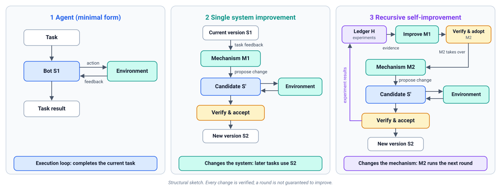
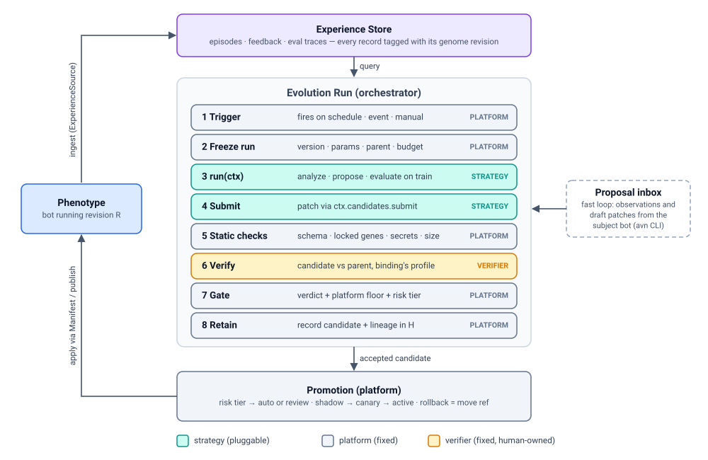
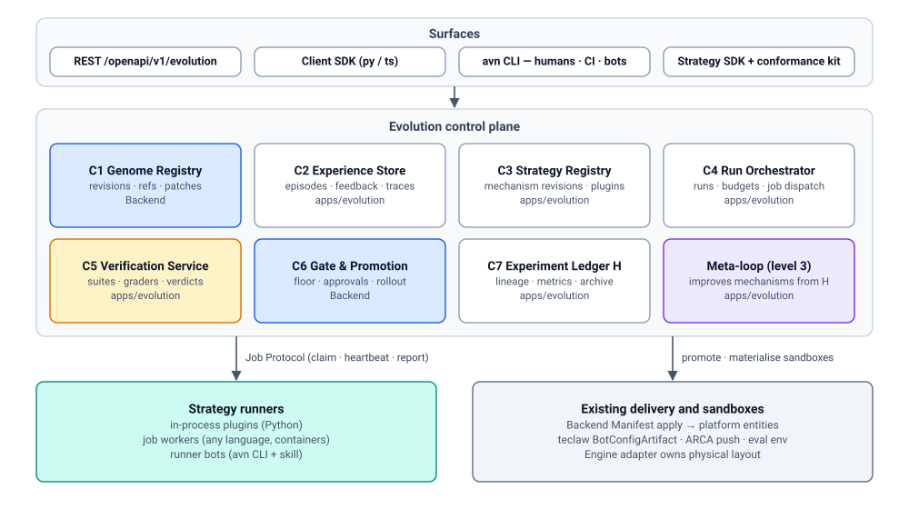

# Bot Evolution Platform — architecture

> Status: DRAFT. Read [README.md](README.md) for the glossary.

## 1. Problem

Three facts from the codebase frame the problem (evidence in
[research.md §2](research.md#2-codebase-evidence)):

1. **There is already a working self-improvement loop, but it is a product,
   not a platform.** ClawEvolve (`apps/evolverun/`) runs diagnose → plan →
   tune/review → bench → accept → pack. It is coupled to OpenClaw paths
   (`/home/admin/.openclaw/workspace`, `openclaw agent --local`), edits the
   **live workspace directly**, hard-codes the acceptance rule
   (candidate test score > baseline test score), and has a closed flow
   registry (three flow keys). Another team cannot plug a different evolution
   approach in without forking it.
2. **There is already a declarative bot artifact, but it has no history.** The
   Bot Config Manifest (`core/bot_config_manifest/`) can express persona files,
   skills, resources, MCP, CLI tools, and a startup script, and converges them
   onto any engine including teclaw. But it is one mutable row per bot, with no
   revision, no content hash, no parent pointer, no optimistic concurrency, and
   apply reports do not record which document was applied. Memory
   (`MEMORY.md`) is explicitly outside it.
3. **Bots cannot call the platform about themselves.** OpenAPI v1 refuses
   `bot` principals by design, so "the bot improves itself" has no sanctioned
   surface today.

Industry evidence (see [research.md §1](research.md#1-industry-survey)) adds
three constraints that the design has to respect from day one:

- Self-improvement without an **independent, held-out, platform-owned
  evaluation** reward-hacks (Darwin Gödel Machine disabled its own
  hallucination checker) or does not generalize (2026 harness-evolution
  re-evaluation found gains often vanish against a budget-matched baseline).
- **Whole-file regeneration erodes context** (ACE "context collapse"); edits
  should be itemized deltas.
- **Greedy "keep the latest best"** stalls; an **archive with lineage** is what
  lets open-ended search keep improving.

## 2. Goals

| ID | Goal |
| --- | --- |
| G1 | One immutable, versioned representation of "what this bot is" (Bot Genome) that every strategy reads and writes, and that the platform can apply to any engine. |
| G2 | Evolution approach is a plug-in: other teams can author, test, version, and register strategies without changing platform code. |
| G3 | One contract, three surfaces: REST API, SDKs (client + strategy authoring), and a CLI usable by humans, CI, and bots. |
| G4 | Existing pipelines (ClawEvolve, workflow-run healing, Insight improvements) become strategies on the platform, not parallel systems. |
| G5 | Safe by construction: platform-owned gate, risk-tiered approvals, lineage, rollback, sandboxed evaluation, budgets. |
| G6 | Engine-neutral: the same strategy can evolve an OpenClaw, Claude Code, Hermes, or teclaw bot, subject to declared capabilities. |

Non-goals are listed in the [README](README.md#non-goals-for-this-design-set).

## 3. Three levels and the loop

The platform is built around three nested levels:

1. **Agent** — the bot (S1) executes tasks against its environment. It
   produces experience, but nothing about the bot changes.
2. **Single system improvement** — an improvement mechanism (M1) uses task
   feedback to propose a candidate S′. S′ runs, is **verified**, and only if
   accepted becomes S2, which later tasks use. This is the strategy run
   described in the rest of this section.
3. **Recursive self-improvement** — the record of all improvement
   experiments (H) is used to improve the **mechanism itself**. A candidate
   M2 is **verified** to produce better verified improvements than M1 before
   it takes over later rounds. See [recursion.md](recursion.md).

Verification is the fixed point of all three levels: every change is
verified, rejection is a normal outcome, and the verifier is never modified
by any loop ([verification.md](verification.md)).

### The level-2 loop

Every approach surveyed — DSPy/GEPA, ACE, Voyager, DGM, AlphaEvolve,
Anthropic Dreams, Hermes Curator, and ClawEvolve itself — reduces to one
**variation → selection → retention** loop over a versioned artifact. The
platform owns the loop skeleton and the retention side; strategies own
variation and contribute to selection.

Two speeds share this loop (pattern from Letta sleep-time agents and
Anthropic Dreams):

- **Slow / offline loop** — a strategy run. Batch, budgeted, evaluated.
  ClawEvolve's optimize rounds, a GEPA-style prompt optimizer, a nightly
  memory consolidation ("dream") job.
- **Fast / in-loop capture** — the subject bot notices something mid-session
  ("this tool call pattern failed three times") and records an
  **observation** or a **draft patch** through the CLI. These land in a
  per-bot *proposal inbox*; they are inputs to the slow loop and never reach
  the live bot without going through steps 5–8.

## 4. Components

### C1 Genome Registry

Owns Bot Genome revisions, named refs (`active`, `previous`, `canary`,
`candidate/<run>/<n>`), patches, and content-addressed blobs. It is the
**Manifest grown up**: a revision *compiles to* a pinned Manifest document
plus a memory projection, and promotion applies that document through the
existing apply pipeline. Full model in [genome.md](genome.md).

Placement: **Backend** (`core/bot_genome/`), next to
`core/bot_config_manifest/`, because Backend owns desired state and the
Manifest already lives there. Blobs reuse the content-addressed
`ac_manifest_content` store.

### C2 Experience Store

A normalized, engine-neutral record of what bots did and how it went:

- **Episode** — one session or task trajectory: messages, tool calls, tool
  results, timings, model, cost, outcome. Normalized from engine-specific
  formats by an **ExperienceSource** plugin (default: the OpenClaw session
  JSONL reader in `clawevolve-diagnose/acquisition/`).
- **Feedback** — user ratings, corrections, task outcomes, BCS coordination
  outcomes, run-evidence events (TaskGuard).
- **Eval trace** — every evaluation rollout, with grader scores and textual
  critiques.

Every record carries the **genome revision id** that produced it. That is the
one field missing everywhere today, and it is what turns logs into
attributable fitness signal and later into training data.

Ownership: AGENTS.md assigns chat history to engine-facing services. So the
**source of truth for raw sessions stays in the engine**; the engine exposes
a versioned export contract (`session-export/v1` already exists in
ClawEvolve and is the starting point), and C2 holds the normalized, indexed,
retention-bounded copy used for evolution. Privacy/retention rules attach to
C2 (see [governance.md §7](governance.md#7-data-handling)).

### C3 Strategy Registry

Stores **strategy manifests** (which plugins, in what flow, with what
parameters and budgets) and **plugin implementations** (versioned, with
declared capabilities, isolation tier, and conformance status). A run
records the exact strategy version it used. Generalizes ClawEvolve's
`official-stage-catalog.json` + `ce_stage_skill_implementations`. Details in
[strategy-sdk.md](strategy-sdk.md).

### C4 Run Orchestrator

A durable state machine: `Run → Iteration → Step`. It resolves the
strategy, enforces budgets (tokens, money, wall clock, rollouts, iterations),
dispatches steps to plugins over the Job Protocol, persists every input and
output by digest, and enforces that steps only see what their contract
allows (e.g. a Proposer never receives the held-out split). Generalizes
ClawEvolve's `ce_tasks` / `ce_steps` / claim-report endpoints.

### C5 Verification Service

Platform-owned and **read-only to strategies and bots**:

- **Suites** with mandatory splits: `train` (proposer may see failures),
  `validation` (gate uses it; proposer sees only aggregates), `holdout`
  (gate and periodic audit only), `regression` (grows automatically from
  production failures and previously fixed cases), `safety`.
- **Graders**: deterministic checks, rubric LLM judges (preferably a
  different model family from the proposer), hybrid. Every grader returns
  `score + critique` because reflective proposers (GEPA, ClawEvolve tune)
  need the critique.
- **Sandbox execution**: a candidate is materialised into an ephemeral
  **eval bot** via the existing `plugin_api/eval_env/` seam
  (`EvalEnvLifecycle`, `VersionSync`), so evaluation exercises the real
  apply/delivery path, not a simulation.
- **Baselines**: every evaluation of a candidate is paired with the parent
  on the same cases, and optionally a **budget-matched baseline** (parent +
  extra sampling) so a strategy has to beat "just try harder".

ClawBench (`clawbench-base`) and ClawEvolve's plan stage become the default
grader and SuiteBuilder implementations; the backend eval env
(`eval_publish`) becomes the deployed-sandbox executor. The full protocol,
the inventory of existing eval code, and its gaps are in
[verification.md](verification.md).

### C6 Gate & Promotion

The only component that can move a bot's `active` ref. See
[governance.md](governance.md). In short:

1. **Platform floor** (not overridable by strategies): schema valid, locked
   genes untouched, no secrets, no permission escalation, no regression on
   `regression`/`safety` suites beyond tolerance, budget not exceeded.
2. **Strategy acceptance policy** (pluggable): e.g. ClawEvolve's
   `test > baseline`, Pareto dominance, paired win-rate.
3. **Risk tier** of the patch decides auto-promote vs human review.
4. **Rollout**: optional shadow (verify stage), canary for multi-instance
   bots, then active. **Rollback** is moving `active` back to any earlier
   revision and re-applying — no more one-step-only rollback.

### C7 Experiment Ledger (H) and Archive

Every improvement experiment (mechanism, parent, candidate, evidence,
verdict, cost, later online outcome), including rejected ones — schema in
[recursion.md §3](recursion.md#3-experiment-ledger-h). It is a read model over
C1 + C5: the genome tree for a bot, every candidate's
scores per split, which strategy and model produced it, what evidence it was
based on, and who approved it. Selectors query it (latest-best, Pareto front
per case, MAP-Elites niches, descendant-aware "clade" scores à la
Huxley-Gödel Machine). Humans browse it in the UI. Proposers can be given a
filesystem export of it (Meta-Harness found raw history beats summaries).
It is also the evidence base for level 3.

### Meta-loop (level 3)

Runs the same loop with a **mechanism** (strategy version) as the target and
**mechanism verification** as the verifier: a meta-proposer reads H, proposes
a mechanism patch, and the candidate mechanism is compared against the active
one on held-out improvement problems before adoption (human-approved by
default). Mechanisms are versioned in C3 with the same revision/ref model as
genomes. See [recursion.md](recursion.md).

## 5. Ownership and module placement

The constitution wants clear ownership and transport-agnostic core. Proposed
split:

| Concern | Owner | Why |
| --- | --- | --- |
| Genome Registry (C1), Gate & Promotion (C6) | **Backend** | Owns desired state, Manifest, publish chain, tenancy, approvals. Promotion must sit beside apply. |
| Physical projection of genome onto a workspace, memory import/export, session export | **Engine adapter** | Engine owns layout (ADR 0014/0017) and chat history. New engine-side contracts, no Backend paths. |
| Run Orchestrator (C4), Strategy Registry (C3), Experience Store (C2), Verification Service (C5), Experiment Ledger (C7), meta-loop | **New module `apps/evolution`** (recommended) | Long-running, LLM-heavy, bursty work that should scale and fail independently of Backend request serving. |
| Strategy implementations | **Strategy authors** (incl. `apps/evolverun` for defaults) | Pluggable by definition. |
| Sandbox eval bots | **Backend `eval_publish` + eval_env plugins + BaaS** | Eval-env deployment exists (Quality Task); plugin seams are Noop stubs today. |
| UI | `apps/frontend-nextgen` (later); AgentEvolve UI as interim | |

**Open decision D-1 (module placement of the control plane).** Options:

| Option | For | Against |
| --- | --- | --- |
| A. New Python service `apps/evolution` with the Backend DI/plugin pattern (**recommended**) | Clean boundary; same constitution tooling (DI, `plugin_api`, conformance tests); scales independently | New deployable; needs singlebox wiring |
| B. Inside Backend as `core/evolution/` | No new service; direct access to Genome/Manifest services | Long-running LLM jobs inside the request-serving backend; Backend already very large |
| C. Promote ClawWeb's TS control plane | Reuses working code | Outside the constitution's DI/plugin/conformance tooling; Node-only; mixed with UI |

Recommendation: **A**, with C1/C6 in Backend (they are part of desired state)
and ClawWeb kept as the UI and as the host of the default strategy runner
during migration.

## 6. Key contracts (to be specified by work items)

| Contract | Kind (R3) | Producer → consumer |
| --- | --- | --- |
| Genome schema + patch format | Data contract, versioned | Everyone |
| Genome Registry API | Service API | Evolution, UI, CLI → Backend |
| Evolution API (`/openapi/v1/evolution/*`) | Service API | SDK/CLI/UI → Evolution |
| Job Protocol (claim / heartbeat / input / output / report) | Plugin API (wire) | Orchestrator ↔ out-of-process plugins |
| Plugin protocols (Analyzer, Proposer, Evaluator, Gate, Selector, Trigger, ExperienceSource, SuiteBuilder) | Plugin API | Orchestrator → strategy implementations |
| Engine memory projection contract | Plugin API | Backend apply → Engine |
| Engine session export contract (`session-export/v1` → v2) | Plugin API | Evolution → Engine |
| Verification Service API + Executor/Grader plugin protocols | Service API + Plugin API | Orchestrator, publish flow, Quality Task → Verification |
| Experiment Ledger schema + mechanism metrics | Data contract | Evolution → selectors, meta-loop, UI |
| Bot evolution scopes for the bot principal | Admission contract | Gateway/Backend |

Each one needs docs + conformance tests in the same change (R1, R25).

## 7. Lifecycle of a run (worked example)

Strategy `clawevolve/bot-evolution@2`, bot `support-agent`, trigger: nightly
schedule because the failure-rate signal crossed a threshold.

1. Orchestrator creates Run, freezes strategy version and budget
   (`max_iterations: 3, max_usd: 20`).
2. **Selector** (`latest-active`) picks parent = `active` revision `r41`.
3. **Analyzer** (`clawevolve-diagnose`) queries C2 for episodes of `r41` in
   the last 7 days, judges them, clusters root causes, emits `plan-source/v2`
   findings with replayable cases.
4. **SuiteBuilder** (`clawevolve-plan`) turns findings into suite cases;
   C5 assigns splits (train/validation; holdout and regression are
   pre-existing and not visible to the strategy).
5. **Proposer** (`clawevolve-tune` + `clawevolve-review`) works in a
   **sandbox workspace** materialised from `r41` and returns a Genome
   Patch (itemized: `identity/SOUL.md: replace section "Escalation"`,
   `skills/refund-policy: update SKILL.md`), plus rationale.
6. Platform static checks pass; C1 records candidate `r41.c1` (parent `r41`).
7. **Verification** (C5, `platform/clawbench` graders) runs parent and
   candidate paired, with repeated seeds, on train + validation in eval bots,
   plus the hidden regression + safety suites; the verdict and evidence go to
   H.
8. **Gate**: strategy policy (`validation > parent` and paired win-rate ≥
   0.6) passes; platform floor passes; risk tier = T2 (persona + skill) →
   review queue.
9. Owner reviews diff + eval report in UI (or `avn evolve review`), approves.
10. Promotion: `active → r42`, `previous → r41`; apply via Manifest; for a
    service bot, via draft → verify → publish.
11. Episodes from now on carry `r42`. Next run can compare live outcomes of
    `r41` vs `r42` (online validation; auto-rollback rule optional).

## 8. Phasing

| Phase | Outcome | Usable on its own? |
| --- | --- | --- |
| P0 Contracts | DR-1–DR-3 accepted; genome schema, job protocol, plugin protocols, API sketch reviewed | — |
| P1 Genome Registry | Manifest gains revisions, refs, If-Match, pinned resolution, apply-records-revision, any-depth rollback | **Yes** — versioned bots and real rollback, independent of RSI |
| P2 Evolution core | `apps/evolution` skeleton, run orchestrator, job protocol, strategy registry, API + SDK + CLI skeleton, a trivial reference strategy (manual patch + deterministic evaluator) passing conformance | Yes, for scripted improvement |
| P3 Default strategy | ClawEvolve onboarded: ExperienceSource, sandboxed tune emitting patches, ClawBench evaluator, its acceptance rule as a Gate plugin | Yes — today's AgentEvolve on any OpenClaw bot through the platform |
| P4 Verification & governance | Verification Service (paired stats, sealed holdout, must-pass suites, judge ensembles), publish-flow verify gate, review queue, risk tiers, shadow/canary, offline replay of acceptance policies over H | Hardening; the verify gate is useful for service bots on its own |
| P5 Bot-driven + mechanism verification | Bot principal scopes, `avn` as bot tool + SKILL.md, proposal inbox, memory projection contract, consolidation ("dream") strategy; improvement-problem benchmark for verifying mechanism changes | Fast loop; regression tests for strategies |
| P6 Open-ended | Automated meta-proposer (level 3), archive selectors (Pareto/MAP-Elites/clade), cross-bot skill transfer via Skill Center, training-data export, additional engines | Research-grade |

Work items with dependencies: [work-items.md](work-items.md).

## 9. Bridge to weight training

Out of scope, but the design keeps the door open at zero extra cost:

- Every C2 record has `(input, genome_revision, output, grader scores,
  critiques, cost)`, which is the tuple SFT/RL/DPO pipelines want.
- Accepted vs rejected candidate pairs on the same case are preference data.
- An `export` endpoint with redaction is a P6 item, not a P1 dependency.

## 10. Risks

| Risk | Mitigation |
| --- | --- |
| Gains are illusory (overfit to the strategy's own cases) | Holdout + regression suites owned by C5; paired statistics with confidence intervals; budget-matched baseline; periodic re-audit of promoted revisions on fresh cases |
| Level 3 optimises noise or weakens the judge | Verifier is fixed and human-owned; mechanism verification on held-out improvement problems; depth bounded at 2; mechanism adoption human-approved |
| Reward hacking / evaluator tampering | Evaluators and suites outside the genome; locked genes; diff audit for guardrail-touching edits; see governance |
| Persona drift / context collapse | Itemized patches only; size-change thresholds; per-item provenance |
| Memory/skill poisoning via trajectories | Experience is untrusted input to proposers; secret/PII scan on patches; risk tiers |
| Cost blow-up | Per-run, per-bot, per-tenant budgets enforced by orchestrator, not strategy |
| Platform built before demand | P1 is independently useful; P3 proves the abstraction on existing demand before P5/P6 |
| Constitution friction (new module, new principal) | Draft decisions up front; conformance tests per protocol from P2 |
