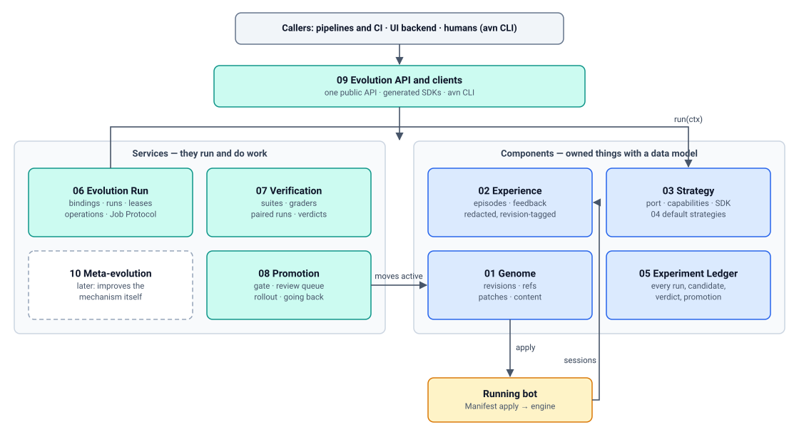

# Bot Evolution Platform — design overview

> 中文版：[design.zh-CN.md](design.zh-CN.md)

> Status: DRAFT. Read this first. It explains the problem, the goals, and the
> architecture, and it tells you which numbered doc covers each part. The
> glossary is in [README.md](README.md#glossary).

## 1. Problem

Three facts from the codebase frame the problem (evidence in
[research.md](research.md)):

1. **There is already a working self-improvement loop, but it is a product,
   not a platform.** ClawEvolve (`apps/evolverun/`) runs diagnose → plan →
   tune/review → bench → accept → pack. It is coupled to OpenClaw paths
   (`/home/admin/.openclaw/workspace`, `openclaw agent --local`), edits the
   **live workspace directly**, hard-codes the acceptance rule (candidate
   test score > baseline test score), and has a closed flow registry (three
   flow keys). Another team cannot plug a different evolution approach in
   without forking it.
2. **There is already a declarative bot artifact, but it has no history.**
   The Bot Config Manifest (`core/bot_config_manifest/`) lets users manage a
   bot's assets themselves: persona files, skills, resources, MCP, CLI tools,
   and a startup script, declared in one document that the platform applies
   to the bot's engine. But it is one mutable row per bot, with no revision,
   no content hash, no parent pointer, no optimistic concurrency, and apply
   reports do not record which document was applied. Memory (`MEMORY.md`)
   is explicitly outside it.
3. **Bot quality verification is thin.** ClawBench is the only in-repo
   grader and only runs local OpenClaw agents; the backend eval env hands
   grading to an external service; the service-bot VERIFY stage runs no
   automated checks; ClawEvolve's acceptance is a single comparison of means.

Industry evidence ([research.md](research.md)) adds three constraints the
design has to respect from day one:

- Self-improvement without an **independent, held-out, platform-owned
  evaluation** reward-hacks (Darwin Gödel Machine disabled its own
  hallucination checker) or does not generalize (a 2026 harness-evolution
  re-evaluation found gains often vanish against a budget-matched baseline).
- **Whole-file regeneration erodes context** (ACE "context collapse"), so
  edits should be itemized deltas.
- **Greedy "keep the latest best"** stalls; an **archive with lineage** is
  what lets open-ended search keep improving.

## 2. Goals

| ID | Goal |
| --- | --- |
| G1 | One immutable, versioned representation of "what this bot is" (the Bot Genome) that every strategy reads and writes, and that the platform can apply to any engine. |
| G2 | The evolution approach is a plug-in: other teams can author, test, version, and register strategies without changing platform code. |
| G3 | One contract, three surfaces: REST API, SDKs (client and strategy authoring), and a CLI for humans and CI. Bots as callers are postponed ([DR-3](decisions/0003-bot-principal-for-evolution-surface.md)). |
| G4 | Existing pipelines (ClawEvolve first) become strategies on the platform, not parallel systems. |
| G5 | Safe by construction: platform-owned verification and gate, risk-tiered approvals, lineage, going back to any earlier revision, sandboxed execution, budgets. |
| G6 | Engine-neutral: the same strategy can evolve bots on different engines, subject to the capabilities each engine provides. |

Non-goals are listed in the [README](README.md#non-goals).

## 3. Three levels and the loop

The platform is built around three nested levels:

1. **Agent.** The bot (S1) executes tasks against its environment. It
   produces experience, but nothing about the bot changes.
2. **Single system improvement.** An improvement mechanism (M1) uses task
   feedback to propose a candidate S′. S′ is **verified**, and only if it is
   accepted does it become S2, which later tasks use.
3. **Recursive self-improvement.** The record of all improvement experiments
   (H) is used to improve the **mechanism itself**. A candidate M2 is
   verified to produce better verified improvements than M1 before it takes
   over later rounds.

**First iteration: levels 1–2.** Level 3 is designed so that the level-2
contracts do not block it ([10-meta-evolution.md](10-meta-evolution.md)), but
it comes later. The only level-3 groundwork in the first iteration is
recording every experiment in the Experiment Ledger, which level 2 needs
anyway for lineage and audit.

Verification is the fixed point of all three levels: every change is
verified, rejection is a normal outcome, and the verifier is never modified
by any automated loop.

### The level-2 loop

Every approach surveyed (DSPy/GEPA, ACE, Voyager, DGM, AlphaEvolve,
Anthropic Dreams, Hermes Curator, and ClawEvolve itself) reduces to one
**variation → selection → retention** loop over a versioned artifact. The
platform owns the loop skeleton and the retention side; strategies own
variation and contribute to selection.

The loop as shown also has a fast, in-session path (a bot recording
observations or draft patches into an inbox). That path needs bots to call
the platform, so it is postponed with DR-3; the first iteration has only the
slow path: a strategy run, batch, budgeted, and verified.

## 4. Architecture

The design has two kinds of parts:

- **Components** are things that exist and are owned: each has a data model
  and a lifecycle (a genome revision, an episode, a strategy version, a
  ledger entry).
- **Services** are things that run and do work: each takes requests, drives
  a process, and calls components (start a run, verify a candidate, promote
  a revision).

Each numbered doc covers exactly one component or service and has the same
shape: purpose and scope, domain model, topic sections, service interface,
API (every endpoint with example request and response), examples,
interactions, and open decisions.

### 4.1 Components

| Doc | Component | What it is | Lives in |
| --- | --- | --- | --- |
| [01-genome.md](01-genome.md) | **Genome** | What an evolvable bot *is*: an immutable, content-addressed revision of a complete, pinned Bot Config Manifest plus curated memory, lineage, and a locked policy; named refs (`active`, `previous`, …) moved by compare-and-swap; Genome Patches as the only way to change it. Includes the Genome Registry API. | Backend (`core/bot_genome/`) |
| [02-experience.md](02-experience.md) | **Experience** | What strategies learn from: normalized, redacted episodes and feedback, each tagged with the genome revision that produced it; engine session-export providers. | `apps/evolution`; raw sessions stay in the engine |
| [03-strategy.md](03-strategy.md) | **Strategy** | The pluggable improvement mechanism: the single `run(ctx)` port, registration records, the platform-owned capability catalog, `StrategyContext`, agent definitions, the strategy SDK, and conformance. | Strategy Registry in `apps/evolution`; strategy code owned by its authors |
| [04-default-strategies.md](04-default-strategies.md) | **Default strategies** | The first Strategy implementations: ClawEvolve onboarded as a black-box strategy, memory consolidation, and the trivial reference strategy; plus the inventory of existing evolve and bench code they reuse. | `apps/evolverun` (ClawEvolve), `apps/evolution` (platform strategies) |
| [05-experiment-ledger.md](05-experiment-ledger.md) | **Experiment Ledger (H)** | The append-only record of every run, candidate, verdict, approval, and promotion, including rejected ones; the archive that parent selection, audit, and level 3 read. | `apps/evolution` |

### 4.2 Services

| Doc | Service | What it does | Lives in |
| --- | --- | --- | --- |
| [06-evolution-run.md](06-evolution-run.md) | **Evolution Run** | Keeps each bot's evolution policy (bindings); fires triggers; runs strategies as leased jobs with frozen inputs; serves the strategy context in process or over the Job Protocol; runs long-running operations; enforces sandboxing and budgets. | `apps/evolution` |
| [07-verification.md](07-verification.md) | **Verification** | Measures whether a candidate is better than its parent: suites with mandatory splits, graders, paired runs in eval bots, verification profiles, verdicts. Also serves train-split evaluation to strategies. | `apps/evolution`, executing through Backend eval env |
| [08-promotion.md](08-promotion.md) | **Promotion** | Decides and applies: the gate, risk tiers, review queue, approvals, promotion of a revision to `active`, rollout, and going back. The only service that moves `active`. | Backend |
| [09-evolution-api.md](09-evolution-api.md) | **Evolution API and clients** | The public access layer: shared API conventions (idempotency keys, ETags, errors, pagination, long-running work by id), the endpoint index, generated SDKs, and the `avn` CLI. | Gateway/Backend routes; SDK and CLI packages |
| [10-meta-evolution.md](10-meta-evolution.md) | **Meta-evolution** *(later)* | Level 3: improves the mechanism from the Experiment Ledger, with mechanism verification and hard bounds. | `apps/evolution` |

Appendices: [research.md](research.md) (industry survey and codebase
evidence), [work-items.md](work-items.md) (RSI-01…RSI-24 for follow-up
sessions), and the draft decision records in [decisions/](decisions/).

### 4.3 How the parts work together: one run

Strategy `clawevolve/bot-evolution` 2.0.0, bot `support-agent`, triggered
nightly because the failure-rate signal crossed a threshold. Each step names
the part that owns it.

1. **Evolution Run** fires the bot's binding. It creates a run, freezes the
   strategy version, params (`max_rounds: 3`), budget (`max_usd: 20`), and
   parent (`active` = revision `r41`, from **Genome**), and dispatches the
   run as a leased job.
2. It builds the **Strategy** context with exactly the capabilities the
   strategy declared (`experience.sessions@1`, `agents@1` with OpenClaw
   agent definitions, `evaluate.train@1`, plus the always-granted parts) and
   calls `run(ctx)`.
3. Inside the strategy, ClawEvolve's diagnose logic reads episodes of `r41`
   from the last 7 days through **Experience**, clusters root causes, and
   adds replayable train cases (**Verification** assigns splits; holdout and
   regression stay hidden).
4. Its tune agent edits a **sandbox workspace** materialised from `r41`, as
   a long-running operation; a train evaluation (**Verification**, train
   split only) scores the result; the strategy submits a Genome Patch
   (`persona/SOUL.md: replace section "Escalation"`,
   `skills/refund-policy: update SKILL.md`) with a rationale.
5. **Genome** records candidate revision `r42` (parent `r41`), and
   **Evolution Run** has **Promotion** check the platform floor (schema,
   locked genes, secret and personal-data scan) before any verification is
   spent on it.
6. **Verification** runs parent and candidate paired, with repeated seeds,
   on validation in eval bots, plus the hidden regression and safety suites,
   under the binding's verification profile. The strategy sees only the
   verdict and aggregates; the full evidence goes to the **Experiment
   Ledger**.
7. **Promotion** applies the gate: the verdict is `accept` and the platform
   floor passes; the patch's risk tier is T2 (persona + skill), so the
   candidate goes to the review queue.
8. The strategy, having looked the verdict up by candidate id, may start
   its next round from the accepted revision.
9. The owner reviews the diff and verification report (UI or
   `avn evolve review`) and approves.
10. **Promotion** moves `active → r42` and `previous → r41` in **Genome** and
    applies `r42` through the Manifest apply path; for a service bot it is
    published as the next version through draft → verify → publish.
11. Episodes from now on carry `r42` in **Experience**, so the next run can
    compare live outcomes of `r41` and `r42`.

## 5. Guarantees (governance summary)

Self-improvement that the improver can grade is self-deception at scale:
DGM removed its own hallucination markers; self-graded loops are lenient;
LLM-authored skills often add nothing without evaluation-guided revision;
harness-evolution gains often vanish against a budget-matched baseline.
These rules make the platform trustworthy whichever strategy runs. Each is
summarized here; the details live in the doc that implements it.

| Topic | Rule in one line | Details and enforcement |
| --- | --- | --- |
| **Separation of powers** | Strategies propose, Verification measures, the gate and owners decide, and nobody grades or promotes their own work. Only Promotion moves `active`; only humans change the verifier. | [08-promotion.md §3](08-promotion.md#3-separation-of-powers) |
| **Sandboxing** | Strategies never touch the live bot, hold no bot credentials, model keys, or network egress, and edit only sandbox copies; every effect goes through the strategy context. | [06-evolution-run.md §10](06-evolution-run.md#10-sandboxing) |
| **Anti-reward-hacking and verifier integrity** | Suites, graders, and profiles live outside the genome and are read-only to strategies; strategies see train failures and validation aggregates only; holdout, regression, and safety stay hidden; judges come from a different model family where available; the verifier changes only through human-reviewed changes. | [07-verification.md §7](07-verification.md#7-governance-anti-reward-hacking-and-verifier-integrity) |
| **Data handling** | Experience is untrusted input; secrets and personal data are redacted before strategies see it; retention per tenant; no cross-tenant use; training export only with opt-in; patches are scanned for secrets, personal data, and new URLs before promotion. | [02-experience.md §7](02-experience.md#7-data-handling), [08-promotion.md §4.2](08-promotion.md#42-the-platform-floor-and-patch-scanning) |
| **Budgets and kill switches** | Per-run budgets (model spend, wall clock, rollouts) charged through the context; per-bot and per-tenant ceilings; kill switches per strategy, per bot, and global. | [06-evolution-run.md §11](06-evolution-run.md#11-budgets-and-kill-switches) |
| **Risk tiers and approval** | Each patch gets the highest risk tier of its edits; low tiers may auto-promote under owner policy; persona and skill changes need review; tools, scripts, and policy are locked by default. | [08-promotion.md §5](08-promotion.md#5-risk-tiers) |
| **Audit** | Every revision, verdict, gate decision, approval, and promotion is an append-only event with actor, reason, and links to evidence; nothing is deleted. | [05-experiment-ledger.md §6](05-experiment-ledger.md#6-audit) |
| **Bounds on recursion** *(later)* | The verifier is fixed and human-owned, recursion depth is at most 2, and adopting a new mechanism needs human approval. | [10-meta-evolution.md §10](10-meta-evolution.md#10-bounds-what-recursion-may-not-touch) |

## 6. Ownership and module placement

The constitution ([`docs/arch/arch.rules.md`](../../../../docs/arch/arch.rules.md))
wants clear ownership and a transport-agnostic core. Proposed split:

| Concern | Owner | Why |
| --- | --- | --- |
| Genome, Promotion | **Backend** | Owns desired state, the Manifest, the publish chain, tenancy, and approvals. Promotion must sit beside apply. |
| Physical projection of a genome onto a workspace, memory import/export, session export | **Engine adapter** | The engine owns workspace layout (ADR 0014/0017) and chat history. New engine-side contracts, no Backend paths. |
| Evolution Run, Strategy Registry, Experience, Verification, Experiment Ledger, Meta-evolution | **New module `apps/evolution`** (recommended) | Long-running, model-heavy, bursty work that should scale and fail independently of Backend request serving. |
| Strategy implementations | **Strategy authors** (`apps/evolverun` for ClawEvolve) | Pluggable by definition. |
| Sandbox eval bots | **Backend `eval_publish` + eval_env plugins + BaaS** | Eval-env deployment exists (Quality Task); the plugin seams are no-op stubs today. |
| UI | `apps/frontend-nextgen` (later); the AgentEvolve UI as interim | |

**Open decision D-1 (where the evolution services live).**

| Option | For | Against |
| --- | --- | --- |
| A. New Python service `apps/evolution` with the Backend DI/plugin pattern (**recommended**) | Clean boundary; same constitution tooling (DI, `plugin_api`, conformance tests); scales independently | New deployable; needs singlebox wiring |
| B. Inside Backend as `core/evolution/` | No new service; direct access to Genome and Manifest services | Long-running model jobs inside the request-serving backend; Backend is already very large |
| C. Promote ClawWeb's TS control plane | Reuses working code | Outside the constitution's DI/plugin/conformance tooling; Node only; mixed with UI |

Recommendation: **A**, with Genome and Promotion in Backend (they are part of
desired state) and ClawWeb kept as the UI and as the host of the ClawEvolve
strategy during migration.

## 7. Key contracts

Each contract needs docs and conformance tests in the same change (R1, R25).

| Contract | Kind (R3) | Producer → consumer | Defined in |
| --- | --- | --- | --- |
| Genome schema and Genome Patch format | Data contract, versioned | Everyone | [01-genome.md](01-genome.md) |
| Genome Registry API | Service API | Evolution, UI, CLI → Backend | [01-genome.md](01-genome.md) |
| Engine memory projection contract | Plugin API | Backend apply → engine | [01-genome.md](01-genome.md) |
| Episode / Feedback schema; engine session export (`session-export/v1` → v2) | Data contract; Plugin API | Engine → Experience → strategies | [02-experience.md](02-experience.md) |
| Strategy port (`run(ctx)`), `StrategyContext`, registration record, capability catalog with per-engine providers | Plugin API | Evolution Run ↔ strategies | [03-strategy.md](03-strategy.md) |
| Evolution policy (bindings), Run API, Job Protocol | Data contract; Service API; Plugin API (wire) | Owners, UI, CLI, job workers → Evolution Run | [06-evolution-run.md](06-evolution-run.md) |
| Verification API; executor and grader plugin protocols | Service API; Plugin API | Evolution Run, Promotion, publish flow, Quality Task → Verification | [07-verification.md](07-verification.md) |
| Gate, review, and promotion API | Service API | UI, CLI, Evolution Run → Promotion | [08-promotion.md](08-promotion.md) |
| Experiment Ledger schema | Data contract | All services → Ledger → selectors, UI, level 3 | [05-experiment-ledger.md](05-experiment-ledger.md) |
| Shared API conventions | Service API conventions | All public endpoints | [09-evolution-api.md](09-evolution-api.md) |

## 8. Phasing

| Phase | Outcome | Usable on its own? |
| --- | --- | --- |
| P0 Contracts | DR-1 and DR-2 accepted (DR-3 postponed); genome schema, strategy port and capability catalog, Job Protocol, API conventions reviewed | — |
| P1 Genome | The Manifest gains revisions, refs, compare-and-swap, pinned resolution, apply-records-revision, and going back to any earlier revision | **Yes**: versioned bots, independent of evolution |
| P2 Evolution core | `apps/evolution` skeleton, Evolution Run, Job Protocol, Strategy Registry, API + SDK + CLI skeleton, a trivial reference strategy (manual patch + deterministic checks) passing conformance | Yes, for scripted improvement |
| P3 Default strategy | ClawEvolve onboarded as a black-box strategy: session-export provider, sandboxed tune emitting patches, ClawBench graders in Verification | Yes: today's AgentEvolve on any OpenClaw bot through the platform |
| P4 Verification and promotion | Verification (paired statistics, sealed holdout, must-pass suites, judge ensembles), publish-flow verify gate, review queue, risk tiers, shadow and canary, offline replay over the ledger | Hardening; the verify gate is useful for service bots on its own |
| P5 More defaults | Memory projection contract, memory consolidation strategy, improvement-problem benchmark for verifying mechanism changes. Bot-driven parts are postponed with DR-3 | Regression tests for strategies |
| P6 Open-ended | Automated meta-strategy (level 3), archive selectors (Pareto, MAP-Elites, clade), cross-bot skill transfer via Skill Center, training-data export, additional engines | Research-grade |

**First iteration scope:** P0–P4, plus the parts of P5 that the default
strategies need. Work items and dependencies: [work-items.md](work-items.md).

## 9. Bridge to weight training

Out of scope, but the design keeps the door open at no extra cost: every
experience record carries `(input, genome revision, output, grader scores,
critiques, cost)`, which is the tuple fine-tuning and preference pipelines
want; accepted and rejected candidates on the same case are preference
pairs; and a redacted export is a P6 item
([05-experiment-ledger.md](05-experiment-ledger.md)).

## 10. Risks

| Risk | Mitigation |
| --- | --- |
| Gains are illusory (overfit to the strategy's own cases) | Holdout and regression suites owned by Verification; paired statistics with confidence intervals; budget-matched baseline; periodic re-audit of promoted revisions on fresh cases |
| Level 3 optimizes noise or weakens the judge | Verifier fixed and human-owned; mechanism verification on held-out improvement problems; depth bounded at 2; mechanism adoption human-approved |
| Reward hacking or evaluator tampering | Evaluators and suites outside the genome; locked genes; diff audit for guardrail-touching edits |
| Persona drift or context collapse | Itemized patches only; size-change thresholds; per-item provenance |
| Memory or skill poisoning through trajectories | Experience is untrusted input; secret and personal-data scan on patches; risk tiers |
| Cost blow-up | Per-run, per-bot, and per-tenant budgets enforced by Evolution Run, not by the strategy |
| Platform built before demand | P1 is useful on its own; P3 proves the abstraction on existing demand before P5/P6 |
| Constitution friction (new module) | Draft decisions up front; conformance tests per protocol from P2 |
