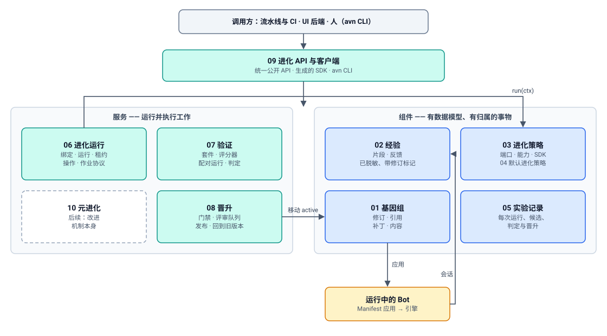

# Bot 进化平台 —— 设计概览

> English version: [design.md](design.md)

> 状态：草案（DRAFT）。请先阅读本文。它解释问题、目标和架构，并告诉你每个
> 部分由哪份编号文档覆盖。术语表见 [README.zh-CN.md](README.zh-CN.md#术语表)。

## 1. 问题

代码库中的三个事实界定了问题（证据见
[research.zh-CN.md](research.zh-CN.md)）：

1. **已经存在一个可用的自改进循环，但它是一个产品，而不是一个平台。**
   ClawEvolve（`apps/evolverun/`）执行 diagnose → plan → tune/review →
   bench → accept → pack。它与 OpenClaw 路径耦合
   （`/home/admin/.openclaw/workspace`、`openclaw agent --local`），**直接编辑
   线上工作区**，把接受规则写死（候选测试分 > 基线测试分），并且有一个封闭的
   flow 注册表（三个 flow key）。其他团队若想接入不同的进化方法，只能 fork
   它。
2. **已经存在一个声明式的 bot 制品，但它没有历史。**
   Bot Config Manifest（`core/bot_config_manifest/`）让用户自己管理 bot 的
   资产：人设文件、skill、资源、MCP、CLI 工具和启动脚本，都声明在一份文档中，
   由平台应用到 bot 的引擎上。但它是每个 bot 一行可变记录，没有修订版、没有
   内容哈希、没有父指针、没有乐观并发控制，而且应用报告不会记录应用的是哪份
   文档。记忆（`MEMORY.md`）被明确排除在外。
3. **bot 质量验证很薄弱。** ClawBench 是仓库内唯一的评分器，并且只运行本地
   OpenClaw 智能体；后端评测环境把评分交给外部服务；服务型 bot 的 VERIFY 阶段
   不运行任何自动化检查；ClawEvolve 的接受判断只是一次均值比较。

业界证据（[research.zh-CN.md](research.zh-CN.md)）又增加了三条设计从第一天起
就必须遵守的约束：

- 没有**独立的、留出的、归平台所有的评估**的自改进会出现奖励投机（Darwin
  Gödel Machine 禁用了自己的幻觉检查器），或者无法泛化（2026 年一项对
  harness 进化的重新评估发现，与预算匹配的基线相比，收益往往消失）。
- **整文件重新生成会侵蚀上下文**（ACE 的“上下文坍塌”），因此编辑应当是
  逐项列出的增量。
- **贪心式的“保留最新最优”**会停滞；**带谱系的归档**才能让开放式搜索持续
  改进。

## 2. 目标

| ID | 目标 |
| --- | --- |
| G1 | 对“这个 bot 是什么”有一个不可变、有版本的统一表示（Bot 基因组），每个进化策略都读写它，平台也能把它应用到任意引擎上。 |
| G2 | 进化方法是一个插件：其他团队可以编写、测试、版本化并注册进化策略，而无需修改平台代码。 |
| G3 | 一份契约，三个接入面：REST API、SDK（客户端与进化策略编写），以及面向人和 CI 的 CLI。bot 作为调用方的场景已推迟（[DR-3](decisions/0003-bot-principal-for-evolution-surface.zh-CN.md)）。 |
| G4 | 现有管线（首先是 ClawEvolve）成为平台上的进化策略，而不是并行的系统。 |
| G5 | 构造即安全：归平台所有的验证与门禁、按风险等级审批、谱系、可以回到任意更早的修订版、沙箱化执行、预算。 |
| G6 | 引擎中立：同一个进化策略可以进化不同引擎上的 bot，受限于各引擎提供的能力。 |

非目标列在 [README](README.zh-CN.md#非目标) 中。

## 3. 三个层级与循环

平台围绕三个嵌套的层级构建：

1. **智能体。** bot（S1）在其环境中执行任务。它产生经验，但 bot 本身没有任何
   变化。
2. **单系统改进。** 一个改进机制（M1）利用任务反馈提议一个候选 S′。S′ 会被
   **验证**，只有在被接受后才会成为 S2，供后续任务使用。
3. **递归自改进。** 所有改进实验的记录（H）被用来改进**改进机制本身**。
   候选 M2 需经验证能比 M1 产生更好的、经过验证的改进，才会接管后续轮次。

**第一轮迭代：第 1–2 层。** 第 3 层的设计确保第 2 层的契约不会阻碍它
（[10-meta-evolution.zh-CN.md](10-meta-evolution.zh-CN.md)），但它会在之后
进行。第一轮迭代中唯一的第 3 层铺垫工作，是在实验记录中记录每一次实验，而
第 2 层本来就需要它来做谱系和审计。

验证是三个层级共同的不动点：每一次变更都要经过验证，被拒绝是正常结果，并且
验证器永远不会被任何自动化循环修改。

### 第 2 层循环

调研过的每一种方法（DSPy/GEPA、ACE、Voyager、DGM、AlphaEvolve、Anthropic
Dreams、Hermes Curator，以及 ClawEvolve 本身）都可以归结为在一个有版本的制品
上进行的同一个**变异 → 选择 → 保留**循环。平台拥有循环骨架和保留一侧；进化
策略负责变异，并参与选择。

图中的循环还包含一条快速的会话内路径（bot 把观察或补丁草稿记录到收件箱中）。
这条路径需要 bot 调用平台，因此随 DR-3 一并推迟；第一轮迭代只有慢速路径：
批量、受预算约束、经过验证的进化策略运行。

## 4. 架构

本设计包含两类部分：

- **组件**是存在且有归属的东西：每个组件都有数据模型和生命周期（一个基因组
  修订版、一个片段、一个进化策略版本、一条实验记录条目）。
- **服务**是运行并完成工作的东西：每个服务接收请求、驱动一个流程并调用组件
  （启动一次运行、验证一个候选、晋升一个修订版）。

每份编号文档恰好覆盖一个组件或服务，并且结构相同：目的与范围、领域模型、主题
章节、服务接口、API（每个端点都带示例请求和响应）、示例、交互，以及待定决策。

### 4.1 组件

| 文档 | 组件 | 它是什么 | 所在位置 |
| --- | --- | --- | --- |
| [01-genome.zh-CN.md](01-genome.zh-CN.md) | **基因组** | 一个可进化的 bot *是*什么：一个完整、已固定版本的 Bot Config Manifest 加上整理过的记忆、谱系和锁定策略所构成的不可变、内容寻址的修订版；通过比较并交换（compare-and-swap）移动的具名引用（`active`、`previous`……）；基因组补丁是改变它的唯一方式。包含 Genome Registry API。 | Backend（`core/bot_genome/`） |
| [02-experience.zh-CN.md](02-experience.zh-CN.md) | **经验** | 进化策略从什么中学习：规范化、已脱敏的片段和反馈，每条都标注了产生它的基因组修订版；引擎会话导出提供方。 | `apps/evolution`；原始会话保留在引擎中 |
| [03-strategy.zh-CN.md](03-strategy.zh-CN.md) | **进化策略** | 可插拔的改进机制：唯一的 `run(ctx)` 端口、注册记录、归平台所有的能力目录、`StrategyContext`、智能体定义、策略 SDK，以及一致性测试。 | `apps/evolution` 中的 Strategy Registry；策略代码归其作者所有 |
| [04-default-strategies.zh-CN.md](04-default-strategies.zh-CN.md) | **默认进化策略** | 首批进化策略实现：作为黑盒策略接入的 ClawEvolve、记忆整合，以及简单的参考策略；外加它们复用的现有 evolve 与 bench 代码清单。 | `apps/evolverun`（ClawEvolve）、`apps/evolution`（平台策略） |
| [05-experiment-ledger.zh-CN.md](05-experiment-ledger.zh-CN.md) | **实验记录 H** | 每次运行、候选、判定、审批和晋升（包括被拒绝的）的只追加记录；父版本选择、审计和第 3 层所读取的归档。 | `apps/evolution` |

### 4.2 服务

| 文档 | 服务 | 它做什么 | 所在位置 |
| --- | --- | --- | --- |
| [06-evolution-run.zh-CN.md](06-evolution-run.zh-CN.md) | **进化运行** | 保存每个 bot 的进化策略配置（绑定）；触发 trigger；以带租约、输入冻结的作业方式运行进化策略；在进程内或通过作业协议提供策略上下文；运行长时操作；强制执行沙箱和预算。 | `apps/evolution` |
| [07-verification.zh-CN.md](07-verification.zh-CN.md) | **验证** | 衡量候选是否优于其父版本：带强制划分的套件、评分器、在评测 bot 中的配对运行、验证配置、判定。也为进化策略提供训练划分上的评估。 | `apps/evolution`，通过 Backend 评测环境执行 |
| [08-promotion.zh-CN.md](08-promotion.zh-CN.md) | **晋升** | 决定并应用：门禁、风险等级、评审队列、审批、将修订版晋升为 `active`、发布，以及回到旧版本。唯一可以移动 `active` 的服务。 | Backend |
| [09-evolution-api.zh-CN.md](09-evolution-api.zh-CN.md) | **进化 API 与客户端** | 公共访问层：共享的 API 约定（幂等键、ETag、错误、分页、按 id 查询的长时工作）、端点索引、生成的 SDK，以及 `avn` CLI。 | Gateway/Backend 路由；SDK 与 CLI 包 |
| [10-meta-evolution.zh-CN.md](10-meta-evolution.zh-CN.md) | **元进化** *（之后）* | 第 3 层：基于实验记录改进改进机制，带机制验证和硬性边界。 | `apps/evolution` |

附录：[research.zh-CN.md](research.zh-CN.md)（业界调研与代码库证据）、
[work-items.zh-CN.md](work-items.zh-CN.md)（供后续会话使用的 RSI-01…RSI-24），
以及 [decisions/](decisions/) 中的决策记录草案。

### 4.3 各部分如何协同：一次运行

进化策略 `clawevolve/bot-evolution` 2.0.0，bot `support-agent`，因失败率信号
超过阈值而在夜间被触发。每一步都注明了负责它的部分。

1. **进化运行**触发该 bot 的绑定。它创建一次运行，冻结进化策略版本、参数
   （`max_rounds: 3`）、预算（`max_usd: 20`）和父版本（`active` = 修订版
   `r41`，来自**基因组**），并把这次运行作为带租约的作业派发出去。
2. 它构建**进化策略**上下文，恰好包含该策略声明的能力（`experience.sessions@1`、
   带 OpenClaw 智能体定义的 `agents@1`、`evaluate.train@1`，以及始终授予的
   部分），然后调用 `run(ctx)`。
3. 在进化策略内部，ClawEvolve 的 diagnose 逻辑通过**经验**读取 `r41` 最近
   7 天的片段，对根因进行聚类，并添加可重放的训练用例（**验证**负责分配划分；
   留出集和回归集保持隐藏）。
4. 它的 tune 智能体编辑一个由 `r41` 物化而来的**沙箱工作区**，这是一个长时
   操作；一次训练集评估（**验证**，仅训练划分）为结果打分；进化策略提交一个
   基因组补丁（`persona/SOUL.md: replace section "Escalation"`、
   `skills/refund-policy: update SKILL.md`），并附上理由。
5. **基因组**记录候选修订版 `r42`（父版本 `r41`），**进化运行**让**晋升**
   检查平台底线（schema、锁定基因、密钥与个人数据扫描），然后才在它上面花费
   任何验证成本。
6. **验证**在评测 bot 中、在绑定的验证配置下，以重复种子对父版本和候选进行
   配对运行，覆盖验证划分，外加隐藏的回归和安全套件。进化策略只能看到判定和
   汇总数据；完整证据进入**实验记录**。
7. **晋升**应用门禁：判定为 `accept`，平台底线通过；该补丁的风险等级是 T2
   （人设 + skill），因此候选进入评审队列。
8. 进化策略按候选 id 查询到判定后，可以从被接受的修订版开始下一轮。
9. 负责人评审 diff 和验证报告（UI 或 `avn evolve review`）并批准。
10. **晋升**在**基因组**中移动 `active → r42` 和 `previous → r41`，并通过
    Manifest 应用路径应用 `r42`；对于服务型 bot，它会经由 draft → verify →
    publish 作为下一个版本发布。
11. 从此以后，片段在**经验**中都带有 `r42`，因此下一次运行可以比较 `r41` 和
    `r42` 的线上结果。

## 5. 保障（治理摘要）

由改进者自己评分的自改进，是规模化的自我欺骗：DGM 移除了自己的幻觉标记；
自评分的循环会放水；LLM 编写的 skill 如果没有评估引导的修订，往往毫无增益；
与预算匹配的基线相比，harness 进化的收益往往消失。无论运行的是哪个进化策略，
这些规则都让平台值得信赖。每条规则在此概述；细节在实现它的文档中。

| 主题 | 一句话规则 | 细节与执行 |
| --- | --- | --- |
| **权力分立** | 进化策略提议，验证负责衡量，门禁和负责人做决定，任何人都不能为自己的工作评分或晋升。只有晋升可以移动 `active`；只有人可以修改验证器。 | [08-promotion.zh-CN.md §3](08-promotion.zh-CN.md#3-权力分立) |
| **沙箱** | 进化策略从不接触线上 bot，不持有 bot 凭据、模型密钥或网络出口，只编辑沙箱副本；所有效果都经由策略上下文发生。 | [06-evolution-run.zh-CN.md §10](06-evolution-run.zh-CN.md#10-沙箱) |
| **反奖励投机与验证器完整性** | 套件、评分器和验证配置位于基因组之外，对进化策略只读；进化策略只能看到训练失败和验证汇总；留出集、回归集和安全集保持隐藏；在可行时，评审模型来自不同的模型家族；验证器只能通过人工评审的变更来修改。 | [07-verification.zh-CN.md §7](07-verification.zh-CN.md#7-治理防奖励作弊与验证器完整性) |
| **数据处理** | 经验是不可信输入；在进化策略看到之前，密钥和个人数据会被脱敏；按租户设置保留期；不跨租户使用；训练导出必须选择加入；补丁在晋升前会扫描密钥、个人数据和新增 URL。 | [02-experience.zh-CN.md §7](02-experience.zh-CN.md#7-数据处理)、[08-promotion.zh-CN.md §4.2](08-promotion.zh-CN.md#42-平台底线与补丁扫描) |
| **预算与紧急停止开关** | 按运行设置的预算（模型花费、挂钟时间、rollout 次数）通过上下文计费；按 bot 和按租户设置上限；按进化策略、按 bot 和全局的紧急停止开关。 | [06-evolution-run.zh-CN.md §11](06-evolution-run.zh-CN.md#11-预算与紧急停止开关) |
| **风险等级与审批** | 每个补丁取其各项编辑中最高的风险等级；低等级可在负责人策略下自动晋升；人设和 skill 变更需要评审；工具、脚本和策略默认锁定。 | [08-promotion.zh-CN.md §5](08-promotion.zh-CN.md#5-风险等级) |
| **审计** | 每个修订版、判定、门禁决定、审批和晋升都是一条只追加事件，带有执行者、原因和证据链接；不删除任何内容。 | [05-experiment-ledger.zh-CN.md §6](05-experiment-ledger.zh-CN.md#6-审计) |
| **递归边界** *（之后）* | 验证器固定且由人负责，递归深度至多为 2，采用新的改进机制需要人工批准。 | [10-meta-evolution.zh-CN.md §10](10-meta-evolution.zh-CN.md#10-边界递归不得触及的内容) |

## 6. 归属与模块放置

架构宪章（[`docs/arch/arch.rules.md`](../../../../docs/arch/arch.rules.md)）
要求清晰的归属和与传输无关的核心。提议的划分如下：

| 关注点 | 归属方 | 原因 |
| --- | --- | --- |
| 基因组、晋升 | **Backend** | 拥有期望状态、Manifest、发布链路、租户和审批。晋升必须紧挨着应用。 |
| 基因组到工作区的物理投影、记忆导入/导出、会话导出 | **引擎适配器** | 引擎拥有工作区布局（ADR 0014/0017）和聊天历史。新的引擎侧契约，不引入 Backend 路径。 |
| 进化运行、Strategy Registry、经验、验证、实验记录、元进化 | **新模块 `apps/evolution`**（推荐） | 长时、模型密集、突发性的工作，应当独立于 Backend 请求服务进行扩缩容和故障隔离。 |
| 进化策略实现 | **策略作者**（ClawEvolve 在 `apps/evolverun`） | 按定义即可插拔。 |
| 沙箱评测 bot | **Backend `eval_publish` + eval_env 插件 + BaaS** | 评测环境部署已存在（Quality Task）；插件接缝目前是空实现桩。 |
| UI | `apps/frontend-nextgen`（之后）；过渡期使用 AgentEvolve UI | |

**待定决策 D-1（进化服务放在哪里）。**

| 选项 | 优点 | 缺点 |
| --- | --- | --- |
| A. 新的 Python 服务 `apps/evolution`，采用 Backend 的 DI/插件模式（**推荐**） | 边界清晰；使用相同的宪章工具（DI、`plugin_api`、一致性测试）；独立扩缩容 | 新的可部署单元；需要 singlebox 接线 |
| B. 放在 Backend 内，作为 `core/evolution/` | 无需新服务；可直接访问 Genome 和 Manifest 服务 | 长时模型作业运行在处理请求的后端中；Backend 已经非常庞大 |
| C. 升级 ClawWeb 的 TS 控制面 | 复用可用代码 | 不在宪章的 DI/插件/一致性工具范围内；仅限 Node；与 UI 混在一起 |

推荐：**A**，基因组和晋升放在 Backend（它们属于期望状态），ClawWeb 保留为 UI，
并在迁移期间作为 ClawEvolve 进化策略的宿主。

## 7. 关键契约

每份契约都需要在同一次变更中提供文档和一致性测试（R1、R25）。

| 契约 | 类型（R3） | 生产者 → 消费者 | 定义于 |
| --- | --- | --- | --- |
| 基因组 schema 与基因组补丁格式 | 数据契约，有版本 | 所有方 | [01-genome.zh-CN.md](01-genome.zh-CN.md) |
| Genome Registry API | Service API | 进化、UI、CLI → Backend | [01-genome.zh-CN.md](01-genome.zh-CN.md) |
| 引擎记忆投影契约 | Plugin API | Backend 应用 → 引擎 | [01-genome.zh-CN.md](01-genome.zh-CN.md) |
| 片段 / 反馈 schema；引擎会话导出（`session-export/v1` → v2） | 数据契约；Plugin API | 引擎 → 经验 → 进化策略 | [02-experience.zh-CN.md](02-experience.zh-CN.md) |
| 策略端口（`run(ctx)`）、`StrategyContext`、注册记录、带按引擎提供方的能力目录 | Plugin API | 进化运行 ↔ 进化策略 | [03-strategy.zh-CN.md](03-strategy.zh-CN.md) |
| 进化策略配置（绑定）、Run API、作业协议 | 数据契约；Service API；Plugin API（线协议） | 负责人、UI、CLI、作业 worker → 进化运行 | [06-evolution-run.zh-CN.md](06-evolution-run.zh-CN.md) |
| Verification API；执行器与评分器插件协议 | Service API；Plugin API | 进化运行、晋升、发布流程、Quality Task → 验证 | [07-verification.zh-CN.md](07-verification.zh-CN.md) |
| 门禁、评审与晋升 API | Service API | UI、CLI、进化运行 → 晋升 | [08-promotion.zh-CN.md](08-promotion.zh-CN.md) |
| 实验记录 schema | 数据契约 | 所有服务 → 实验记录 → 选择器、UI、第 3 层 | [05-experiment-ledger.zh-CN.md](05-experiment-ledger.zh-CN.md) |
| 共享 API 约定 | Service API 约定 | 所有公共端点 | [09-evolution-api.zh-CN.md](09-evolution-api.zh-CN.md) |

## 8. 分阶段

| 阶段 | 成果 | 能否独立使用？ |
| --- | --- | --- |
| P0 契约 | DR-1 和 DR-2 被接受（DR-3 推迟）；基因组 schema、策略端口与能力目录、作业协议、API 约定完成评审 | — |
| P1 基因组 | Manifest 获得修订版、引用、比较并交换、固定版本解析、应用时记录修订版，以及回到任意更早修订版的能力 | **能**：有版本的 bot，独立于进化 |
| P2 进化核心 | `apps/evolution` 骨架、进化运行、作业协议、Strategy Registry、API + SDK + CLI 骨架，一个通过一致性测试的简单参考策略（手动补丁 + 确定性检查） | 能，用于脚本化改进 |
| P3 默认进化策略 | ClawEvolve 作为黑盒策略接入：会话导出提供方、输出补丁的沙箱化 tune、验证中的 ClawBench 评分器 | 能：通过平台在任意 OpenClaw bot 上使用今天的 AgentEvolve |
| P4 验证与晋升 | 验证（配对统计、封存的留出集、必须通过的套件、评审模型集成）、发布流程的验证门禁、评审队列、风险等级、影子与金丝雀、基于实验记录的离线重放 | 加固；验证门禁本身就对服务型 bot 有用 |
| P5 更多默认项 | 记忆投影契约、记忆整合策略、用于验证改进机制变更的改进问题基准。由 bot 驱动的部分随 DR-3 一并推迟 | 进化策略的回归测试 |
| P6 开放式 | 自动化元策略（第 3 层）、归档选择器（Pareto、MAP-Elites、clade）、通过 Skill Center 的跨 bot skill 迁移、训练数据导出、更多引擎 | 研究级 |

**第一轮迭代范围：** P0–P4，外加默认进化策略所需的 P5 部分。工作项与依赖关系：
[work-items.zh-CN.md](work-items.zh-CN.md)。

## 9. 通往权重训练的桥梁

不在范围内，但本设计不额外付出代价就为它留了门：每条经验记录都带有
`(input, genome revision, output, grader scores, critiques, cost)`，这正是
微调和偏好学习管线需要的元组；同一用例上被接受和被拒绝的候选构成偏好对；
脱敏导出是 P6 的一项
（[05-experiment-ledger.zh-CN.md](05-experiment-ledger.zh-CN.md)）。

## 10. 风险

| 风险 | 缓解措施 |
| --- | --- |
| 收益是虚假的（过拟合到进化策略自己的用例） | 由验证拥有的留出集和回归套件；带置信区间的配对统计；预算匹配的基线；定期在新用例上重新审计已晋升的修订版 |
| 第 3 层优化的是噪声，或削弱了评审模型 | 验证器固定且由人负责；在留出的改进问题上进行机制验证；深度限制为 2；改进机制的采用需人工批准 |
| 奖励投机或篡改评估器 | 评估器和套件位于基因组之外；锁定基因；对触及护栏的编辑进行 diff 审计 |
| 人设漂移或上下文坍塌 | 只允许逐项补丁；大小变化阈值；逐项来源记录 |
| 通过轨迹投毒记忆或 skill | 经验是不可信输入；对补丁进行密钥与个人数据扫描；风险等级 |
| 成本失控 | 由进化运行（而非进化策略）强制执行按运行、按 bot 和按租户的预算 |
| 在有需求之前就建好平台 | P1 本身就有用；P3 在 P5/P6 之前先用现有需求验证抽象 |
| 宪章摩擦（新模块） | 预先起草决策；从 P2 起为每个协议提供一致性测试 |
