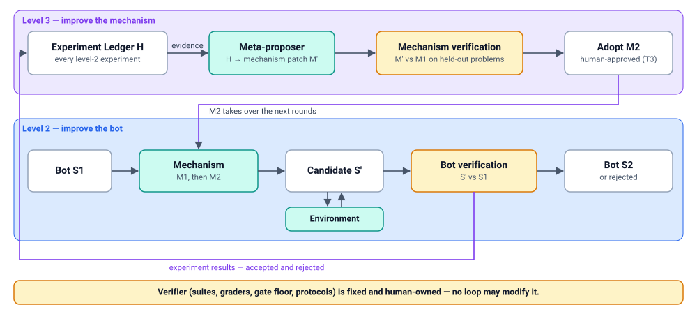

# Recursion — improving the improvement mechanism

> Status: DRAFT. This is what makes the platform *recursive* self-improvement
> rather than repeated single improvements. Read [verification.md](verification.md)
> first; recursion is only as trustworthy as its verifier.

## 1. Three levels

The platform is organised around three levels. Each level wraps the one
before it.

| Level | Loop | What changes | Verified by | In this design |
| --- | --- | --- | --- | --- |
| **1. Agent** | task → bot S1 ⇄ environment → result | Nothing persistent; the bot finishes the current task | Task outcome | Phenotype; produces **Experience** |
| **2. Single system improvement** | S1 + task feedback → mechanism **M1** proposes change → candidate S′ runs in environment → **verify & accept** → S2 | The **system** (bot genome). Later tasks use S2 | **Bot verification** (S′ vs S1) | Strategy runs over Bot Genome — [design.md](design.md) |
| **3. Recursive self-improvement** | experiment records **H** → improve M1 → **verify & adopt** M2 → M2 runs the following level-2 rounds | The **improvement mechanism** itself. M2 runs the next round | **Mechanism verification** (M2 vs M1) | This document |



No level guarantees improvement. Every change is verified, and a rejected
candidate is a normal, recorded outcome. That outcome is evidence for H.

## 2. What the "mechanism" is

M is a **strategy version** ([strategy-sdk.md](strategy-sdk.md)) together with
everything that determines its behaviour:

| Mechanism component | Example in ClawEvolve today |
| --- | --- |
| Flow (steps, loop limits, stop rules) | `bot_evolution` stage sequence, `maxRounds` |
| Proposer prompts and operator library | `_build_tune_prompt`, `references/mutation_operator_library.json` |
| Analyzer heuristics | diagnose batch sizes, good/bad ratio, root-cause clustering |
| Acceptance policy parameters | `FULL_OPT_MAX_REGRESSED_RATIO`, paired win-rate thresholds, `test > baseline` |
| Selector policy | latest-active (implicit) |
| Model choices and budgets per step | tune/review/judge models, round budget |

ClawEvolve already improves its mechanism by hand at level 3:
`scripts/calibrate_evolution_gates.py` and `scripts/replay_candidate_gate.py`
replay historical candidates to tune acceptance thresholds, and the tune
prompt carries evolution history. The platform makes that loop explicit,
verified, and pluggable.

**Mechanism Genome.** A strategy version is treated exactly like a Bot Genome
revision. It is immutable and content-addressed. It has parents and
provenance, and it is changed only by a typed patch. The patch can edit the
flow, replace a plugin version, edit a prompt, change a parameter, or add an
operator. One registry, refs, archive and promotion model serve both
artifact kinds:

```yaml
target_kind: bot_genome | mechanism   # the loop is generic over what it improves
```

Mechanism refs are scoped per strategy family. `clawevolve/bot-evolution`
has `active`, `previous`, `canary` and `candidate/*` refs, which bots and
tenants follow or pin through their evolution policy.

## 3. Experiment Ledger (H)

H is the **evidence base for level 3** and the selection pool for level 2.
It extends the Archive (C7 in [design.md](design.md#c7-experiment-ledger-h-and-archive)) into
an explicit, queryable record of **improvement experiments**.

An experiment is one level-2 attempt:

| Field | Meaning |
| --- | --- |
| `experiment_id`, `run_id`, `iteration` | Identity |
| `mechanism_revision` | Exact M used |
| `parent_revision` → `candidate_revision` | S and S′ (Bot Genome ids) |
| `evidence` | Episode / finding ids the mechanism consumed |
| `patch` | What it proposed (ops, risk tier, size) |
| `verdict` | Bot verification result per split, gate decision, reasons |
| `cost` | Tokens, money, wall clock, rollouts |
| `adoption` | Promoted? reviewed by whom? rolled back later? |
| `online_outcome` | Live metrics of S2 vs S1 after promotion (delayed join) |

Negative results are first-class records: rejected candidates, regressions,
rollbacks and wasted budget. That is what lets a meta-proposer learn
"operator X keeps failing on bots of type Y", the way ClawEvolve's operator
library would want to.

Derived **mechanism metrics** (the fitness of M), computed per mechanism
revision and per bot segment:

- **Verified improvement yield**: mean verified gain of promoted S2 over S1
  on held-out and regression suites, per unit cost.
- **Acceptance rate** and **false-acceptance rate** (promotions later rolled
  back, or regressing online).
- **Regression rate** on safety and regression suites.
- **Cost per accepted improvement.**
- **Descendant productivity**: how much the lineage *after* an accepted
  candidate keeps improving. The Huxley-Gödel Machine shows this predicts
  long-run progress better than a single score.

## 4. The level-3 loop

Same skeleton as level 2. The target is a mechanism, and the evaluator is
mechanism verification.

1. **Trigger**: schedule, enough new experiments in H, a drop in a
   mechanism metric (e.g. falling acceptance rate), or manual.
2. **Select parent mechanism**: usually the `active` M1 of a strategy family.
3. **Analyze H**: find patterns in failed or wasted experiments (operators
   with low yield, thresholds that let regressions through, steps that burn
   budget without effect).
4. **Meta-propose**: a **meta-proposer** (itself a plugin, e.g. a coding
   agent given a filesystem export of H, the Meta-Harness pattern) emits a
   **mechanism patch**: tune a threshold, rewrite the tune prompt section on
   persona edits, add an operator, swap the evaluator mix, reorder steps.
5. **Static checks**: the patch must not touch the **verifier boundary**
   (§6), must stay within declared capabilities, and must pass conformance.
6. **Mechanism verification**: see §5.
7. **Adopt or reject**: M2 becomes the strategy family's `active` mechanism
   only through the gate (human approval by default, §6).
8. **Hand over**: subsequent level-2 runs of bots that follow the family's
   `active` ref use M2. Pinned bots keep M1. Runs already in flight finish on
   the mechanism they started with, because runs freeze their mechanism
   version.

## 5. Mechanism verification

The question is not "is S′ better than S1" but "**does M2 produce better
verified improvements than M1, on problems neither was tuned on?**"

**Improvement problem.** A frozen, replayable level-2 task:

```text
ImprovementProblem = {
  bot_genome_revision S,           # starting system
  experience_snapshot,             # episodes / feedback the mechanism may see
  suites: train | validation       # visible to the mechanism under normal rules
  hidden: holdout | regression | safety,   # used only to score the outcome
  budget                           # identical for every mechanism compared
}
```

These are built from H: real past experiments, frozen with their inputs.
Synthetic problems can be added, e.g. deliberately degraded genomes with a
known fix.

**Protocol.**

1. Split improvement problems into **mechanism-train** (the meta-proposer may
   see outcomes) and **mechanism-holdout** (used only here), stratified by
   engine and bot type. Holdout problems should come from bots the
   meta-proposer never saw.
2. Run M1 and M′ on the same holdout problems with the **same budget** and
   multiple seeds. Each run is a full level-2 run in sandbox eval bots, so its
   output is verified by bot verification exactly as in production.
3. Score each outcome on the problem's hidden suites. Compare the mechanism
   metrics of §3 with paired statistics (per-problem paired differences and
   confidence intervals, not raw averages).
4. **Adopt M′ only if** yield improves significantly, regression and
   false-acceptance rates do not rise, and cost stays within tolerance.
   Optionally require M′ to beat a **budget-matched baseline**, i.e. M1 given
   M′'s extra spend.
5. **Canary at the mechanism level** (optional): after offline adoption, run
   M2 for a fraction of real level-2 runs alongside M1 and compare live yield
   before full handover.

This is expensive, since every comparison runs many level-2 runs. Level 3
therefore runs rarely and on a budget of its own. Cheap proxies are allowed
for *pre-screening* candidates. One example is replaying stored candidates
through a new acceptance policy, as `replay_candidate_gate.py` already does.
Proxies are never allowed for adoption.

## 6. Bounds: what recursion may not touch

Recursion needs a fixed anchor. Without one, the system can "improve" by
weakening its own judge, which is the Darwin Gödel Machine failure.

| Never changed by any automated loop | Why |
| --- | --- |
| The **verifier**: suites, splits, graders, platform gate floor, meta-verification protocol, significance thresholds | It defines "better". If the loop can edit it, gains become meaningless |
| Locked genes and `policy` sections of bot genomes | Owner authority (DR-2) |
| Budgets, kill switches, risk-tier table | Safety envelope |
| The meta-proposer's ability to modify itself or its own verifier | Prevents unbounded self-reference |

Rules:

- **Depth is bounded at 2.** M improves S; a meta-strategy improves M. A
  meta-strategy may target other strategy families but never itself. Its own
  changes are human-authored, or go through the same mechanism-verification
  protocol run by a *different* meta-strategy under human approval.
- Mechanism adoption is **risk tier T3 by default**: always human-approved,
  with the comparison report attached. An owner may lower this to T2 for
  parameter-only patches (thresholds, budgets) on their own tenant.
- The verifier evolves only through **human-authored, reviewed changes**. It
  may be *informed* by H (e.g. "regression suite misses failure class Z"),
  but such a finding is a recommendation to a human, never an automatic edit.
- Verifier changes invalidate comparability. When a suite changes,
  experiments in H are tagged with the verifier version, and mechanism
  metrics are only compared within a verifier version.

## 7. How this changes the platform design

| Area | Change |
| --- | --- |
| Genome Registry (C1) | Generic over `target_kind`. Mechanisms are stored with the same revision / ref / patch machinery |
| Strategy Registry (C3) | Strategy versions are mechanism revisions with lineage. Per-family refs; bot policy follows or pins a ref |
| Archive (C7) | Becomes the **Experiment Ledger H** with the schema of §3 and derived mechanism metrics |
| Evaluation (C5) | Adds **mechanism verification** on top of bot verification ([verification.md](verification.md)) |
| Gate (C6) | Separate gate profile for mechanism adoption (T3 default, comparison report required) |
| Plugin kinds | Adds **MetaProposer** (a Proposer whose input is H and output a mechanism patch). The other kinds are reused |
| Governance | Verifier boundary ([governance.md](governance.md#1-separation-of-powers)) |

## 8. Phasing

Level 3 depends on a populated H and a trustworthy level-2 verifier. Building
it before those exist would optimise noise.

1. **Record H from day one** (with RSI-08 and RSI-13). It is cheap and is the
   prerequisite for everything below.
2. **Offline replay** (P4): port `calibrate_evolution_gates.py` /
   `replay_candidate_gate.py` into a replay tool over H for acceptance-policy
   changes. Humans adopt.
3. **Improvement-problem benchmark** (P5): freeze problems from H and run the
   mechanism-verification protocol for human-authored mechanism changes. This
   alone is valuable: it is a regression test for strategies.
4. **Automated meta-proposer** (P6): let a meta-strategy propose mechanism
   patches, adopted only through §5 and human approval.
