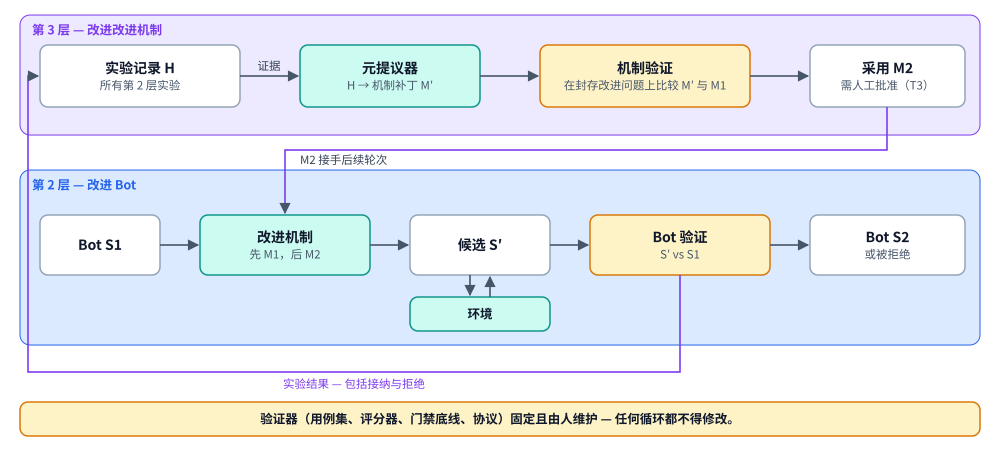

# 递归——改进「改进机制」本身

> English version: [recursion.md](recursion.md)

> 状态：DRAFT（讨论稿）。正是这一点让平台成为*递归*自改进（RSI），而不是重复的
> 单次改进。请先阅读 [verification.md](verification.zh-CN.md)；递归的可信程度
> 取决于其验证器。

## 1. 三个层次

平台围绕三个层次组织。每一层都包裹着前一层。

| 层次 | 循环 | 什么发生变化 | 由谁验证 | 在本设计中 |
| --- | --- | --- | --- | --- |
| **1. 最小形态：Agent** | 任务 → bot S1 ⇄ 环境 → 结果 | 没有持久变化；bot 完成当前任务 | 任务结果 | 表型；产出**经验** |
| **2. 单次系统改进** | S1 + 任务反馈 → 改进机制 **M1** 提议变更 → 候选 S′ 在环境中运行 → **验证与接纳** → S2 | **系统**（bot 基因组）。后续任务使用 S2 | **Bot 验证**（S′ 对比 S1） | 基于 Bot 基因组的进化策略运行——[design.md](design.zh-CN.md) |
| **3. 递归自改进** | 实验记录 **H** → 改进 M1 → **验证与采纳** M2 → M2 运行之后的第 2 层轮次 | **改进机制**本身。M2 运行下一轮 | **机制验证**（M2 对比 M1） | 本文档 |



没有任何一层能保证带来改进。每项变更都要经过验证，被拒绝的候选是一种正常的、
会被记录的结果。该结果是 H 的证据。

## 2. 「机制」是什么

M 是一个**进化策略版本**（[strategy-sdk.md](strategy-sdk.zh-CN.md)），连同
决定其行为的一切：

| 机制组成部分 | 当前 ClawEvolve 中的示例 |
| --- | --- |
| 流程（步骤、循环上限、停止规则） | `bot_evolution` 阶段序列、`maxRounds` |
| 提议器提示词与算子库 | `_build_tune_prompt`、`references/mutation_operator_library.json` |
| 分析器启发式 | 诊断批大小、好/坏比例、根因聚类 |
| 接纳策略参数 | `FULL_OPT_MAX_REGRESSED_RATIO`、成对胜率阈值、`test > baseline` |
| 选择器策略 | 最新 active（隐式） |
| 每一步的模型选择与预算 | tune/review/judge 模型、轮次预算 |

ClawEvolve 已经在第 3 层手工改进其机制：
`scripts/calibrate_evolution_gates.py` 和 `scripts/replay_candidate_gate.py`
回放历史候选来调优接纳阈值，而 tune 提示词携带了进化历史。平台让这个循环变得
显式、经过验证且可插拔。

**机制基因组（Mechanism Genome）。** 一个进化策略版本被完全当作一个 Bot 基因组
修订版来对待。它不可变且内容寻址。它有父版本和来源记录，并且只能通过带类型的
补丁来修改。补丁可以编辑流程、替换某个插件版本、编辑提示词、修改参数或添加
算子。同一套注册表、引用、归档和晋升模型同时服务于两种产物类型：

```yaml
target_kind: bot_genome | mechanism   # the loop is generic over what it improves
```

机制引用按进化策略家族划定作用域。`clawevolve/bot-evolution` 拥有 `active`、
`previous`、`canary` 和 `candidate/*` 引用，bot 和租户通过其进化策略设置跟随或
钉住这些引用。

## 3. 实验记录（H）

H 是**第 3 层的证据库**，也是第 2 层的选择池。它把归档（[design.md](design.zh-CN.md#c7-实验记录-h-与归档) 中的 C7）
扩展为一份显式的、可查询的**改进实验**记录。

一个实验就是一次第 2 层尝试：

| 字段 | 含义 |
| --- | --- |
| `experiment_id`、`run_id`、`iteration` | 标识 |
| `mechanism_revision` | 所用的确切 M |
| `parent_revision` → `candidate_revision` | S 与 S′（Bot 基因组 id） |
| `evidence` | 机制所消费的片段 / 发现 id |
| `patch` | 它提议了什么（op、风险等级、大小） |
| `verdict` | 逐划分的 Bot 验证结果、门禁决定、原因 |
| `cost` | token、花费、墙钟时间、rollout 次数 |
| `adoption` | 是否晋升？由谁审查？之后是否回滚？ |
| `online_outcome` | 晋升后 S2 对比 S1 的线上指标（延迟关联） |

负面结果是一等公民记录：被拒绝的候选、回归、回滚和浪费的预算。正是这些让
元提议器能够学到「算子 X 在 Y 类 bot 上总是失败」，这也正是 ClawEvolve 的算子库
所希望的方式。

派生的**机制指标**（M 的适应度），按机制修订版和 bot 分群计算：

- **经验证的改进收益**：已晋升的 S2 相对 S1 在封存集和回归集上的平均已验证增益，
  按单位成本计。
- **接纳率**与**误接纳率**（之后被回滚或在线上出现回归的晋升）。
- 在安全集和回归集上的**回归率**。
- **每次被接纳改进的成本。**
- **后代生产力**：一个被接纳候选*之后*的谱系能持续改进多少。Huxley-Gödel
  Machine 表明，它比单一分数更能预测长期进展。

## 4. 第 3 层循环

与第 2 层骨架相同。目标是一个改进机制，评估器是机制验证。

1. **触发器**：定时、H 中积累了足够的新实验、某项机制指标下降（例如接纳率
   下降），或手动触发。
2. **选择父机制**：通常是某个进化策略家族的 `active` M1。
3. **分析 H**：找出失败或浪费的实验中的模式（收益低的算子、放过回归的阈值、
   消耗预算却无效果的步骤）。
4. **元提议**：一个**元提议器**（本身是一个插件，例如一个拿到 H 文件系统导出的
   编码 agent，即 Meta-Harness 模式）产出一个**机制补丁**：调整一个阈值、改写
   tune 提示词中关于 persona 编辑的部分、添加一个算子、更换评估器组合、调整步骤
   顺序。
5. **静态检查**：补丁不得触及**验证器边界**（§6），必须保持在已声明的能力范围内，
   并且必须通过一致性测试。
6. **机制验证**：见 §5。
7. **采纳或拒绝**：M2 只有通过门禁（默认需要人工审批，§6）才能成为该进化策略
   家族的 `active` 机制。
8. **交接**：跟随该家族 `active` 引用的 bot，其后续第 2 层运行使用 M2。钉住的
   bot 保持 M1。已在进行中的运行以其启动时的机制完成，因为运行会冻结其机制版本。

## 5. 机制验证

问题不是「S′ 是否优于 S1」，而是「**在双方都未针对其调优过的问题上，M2 是否比
M1 产出更好的经验证改进？**」

**改进问题。** 一个冻结的、可回放的第 2 层任务：

```text
ImprovementProblem = {
  bot_genome_revision S,           # starting system
  experience_snapshot,             # episodes / feedback the mechanism may see
  suites: train | validation       # visible to the mechanism under normal rules
  hidden: holdout | regression | safety,   # used only to score the outcome
  budget                           # identical for every mechanism compared
}
```

这些问题由 H 构建：真实的历史实验，连同其输入一起冻结。也可以添加合成问题，
例如刻意劣化、修复方法已知的基因组。

**协议。**

1. 将改进问题划分为**机制训练集**（元提议器可以看到结果）和**机制封存集**
   （仅在此处使用），按引擎和 bot 类型分层。封存问题应来自元提议器从未见过的
   bot。
2. 在相同的封存问题上，以**相同预算**和多个种子运行 M1 和 M′。每次运行都是在
   沙箱评测 Bot 中进行的完整第 2 层运行，因此其输出与生产中完全一样由 Bot 验证
   来验证。
3. 在问题的隐藏用例集上为每个结果评分。用成对统计比较 §3 的机制指标（逐问题
   成对差值和置信区间，而不是原始均值）。
4. **仅当**收益显著提升、回归率和误接纳率不上升、且成本保持在容忍度之内时，
   **才采纳 M′**。可选地要求 M′ 胜过一个**预算匹配的基线**，即给予 M1 与 M′
   相同的额外花费。
5. **机制层面的金丝雀**（可选）：离线采纳之后，在一部分真实的第 2 层运行中让
   M2 与 M1 并行运行，并在完全交接之前比较线上收益。

这代价高昂，因为每次比较都要运行许多次第 2 层运行。因此第 3 层很少运行，并且
使用独立的预算。允许使用低成本代理指标对候选进行*预筛*。一个例子是把已存储的
候选回放过一个新的接纳策略，就像 `replay_candidate_gate.py` 已经做的那样。
代理指标永远不允许用于采纳。

## 6. 边界：递归不可触碰的部分

递归需要一个固定的锚点。没有锚点，系统就可能通过削弱自己的评判者来「改进」，
这正是 Darwin Gödel Machine 的失败模式。

| 任何自动化循环都永不更改 | 原因 |
| --- | --- |
| **验证器**：用例集、划分、评分器、平台门禁底线、元验证协议、显著性阈值 | 它定义了「更好」。如果循环能编辑它，增益就失去意义 |
| bot 基因组的锁定基因和 `policy` 部分 | 所有者权限（DR-2） |
| 预算、熔断开关、风险等级表 | 安全包络 |
| 元提议器修改自身或其自身验证器的能力 | 防止无界的自我指涉 |

规则：

- **深度上限为 2。** M 改进 S；元策略改进 M。元策略可以以其他进化策略家族为
  目标，但永远不能以自身为目标。它自身的变更由人编写，或在人工审批下，由*另一个*
  元策略运行同一套机制验证协议来完成。
- 机制采纳**默认为风险等级 T3**：始终需要人工审批，并附带比较报告。所有者可以在
  自己的租户上，对仅涉及参数的补丁（阈值、预算）将其降为 T2。
- 验证器只通过**由人编写、经过审查的变更**来演进。它可以*参考* H（例如「回归集
  遗漏了故障类别 Z」），但这样的发现是给人的建议，永远不是自动编辑。
- 验证器变更会破坏可比性。当用例集变化时，H 中的实验会被打上验证器版本标签，
  机制指标只在同一验证器版本内进行比较。

## 7. 这如何改变平台设计

| 领域 | 变更 |
| --- | --- |
| 基因组注册表（C1） | 对 `target_kind` 通用。机制使用同一套修订版 / 引用 / 补丁机制存储 |
| 进化策略注册表（C3） | 进化策略版本即带谱系的机制修订版。按家族划分引用；bot 策略跟随或钉住某个引用 |
| 归档（C7） | 成为具有 §3 schema 和派生机制指标的**实验记录 H** |
| 评估（C5） | 在 Bot 验证之上增加**机制验证**（[verification.md](verification.zh-CN.md)） |
| 门禁（C6） | 为机制采纳单独设置门禁配置（默认 T3，要求附带比较报告） |
| 插件类型 | 新增 **MetaProposer**（一种输入为 H、输出为机制补丁的 Proposer）。其他类型复用 |
| 治理 | 验证器边界（[governance.md](governance.zh-CN.md#1-权力分离)） |

## 8. 分阶段实施

第 3 层依赖于已填充的 H 和可信的第 2 层验证器。在这些具备之前构建它，只会是在
优化噪声。

1. **从第一天起记录 H**（随 RSI-08 和 RSI-13）。它成本低，并且是以下一切的
   前提。
2. **离线回放**（P4）：将 `calibrate_evolution_gates.py` /
   `replay_candidate_gate.py` 移植为一个基于 H、面向接纳策略变更的回放工具。
   由人来采纳。
3. **改进问题基准**（P5）：从 H 中冻结问题，并针对由人编写的机制变更运行机制
   验证协议。仅这一点就很有价值：它是进化策略的回归测试。
4. **自动化元提议器**（P6）：让元策略提议机制补丁，仅通过 §5 和人工审批才能
   采纳。
