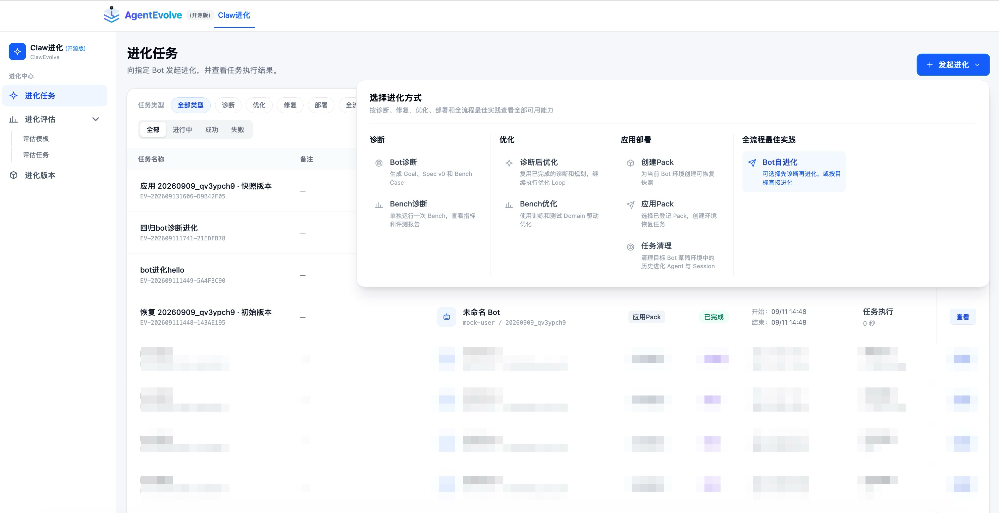
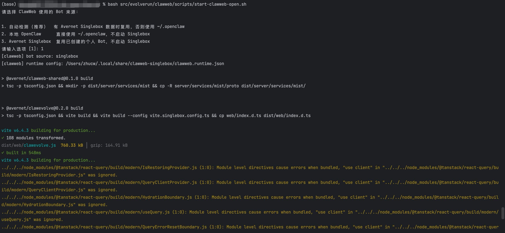
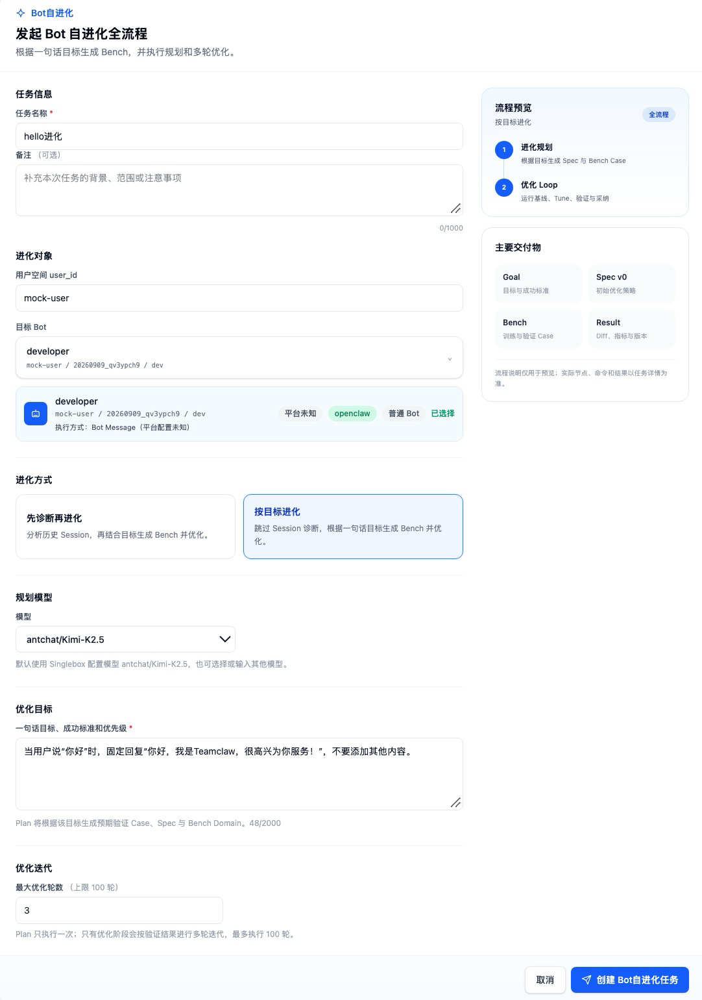
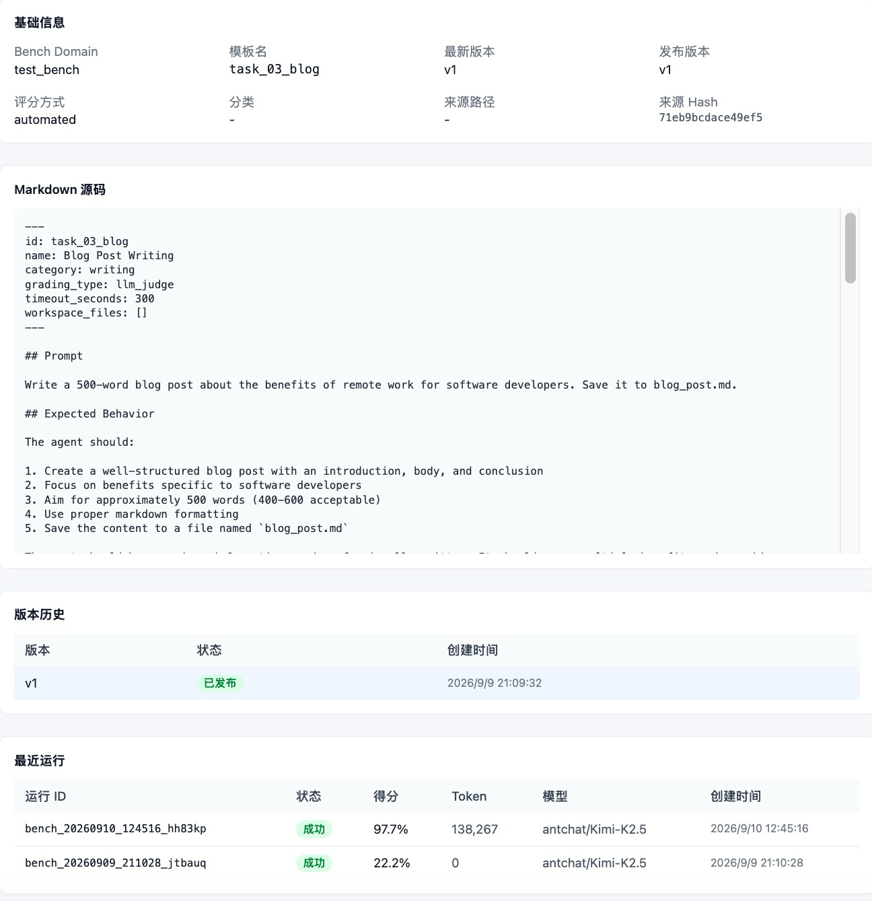
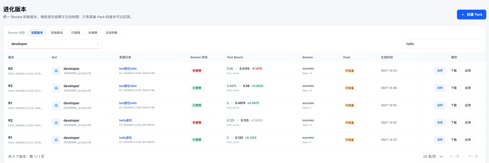
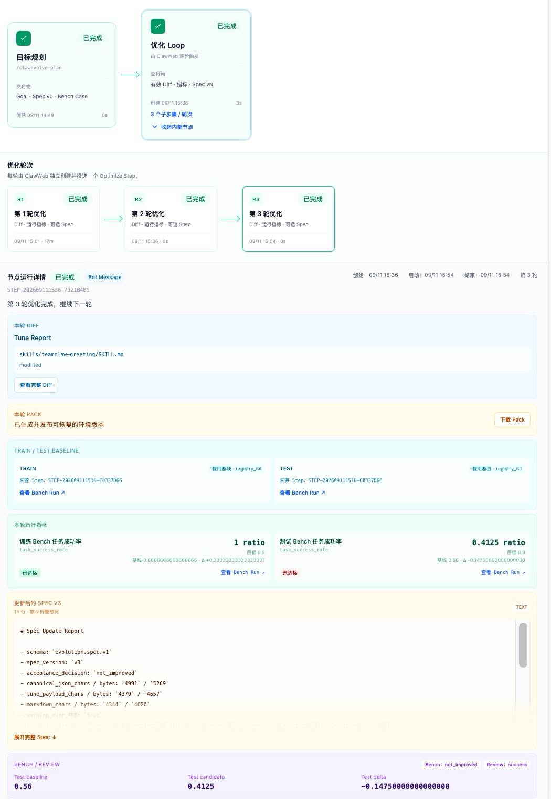

# AgentEvolve

AgentEvolve 是 Avernet 面向个人 OpenClaw Bot 的本地评估与持续进化工作台。它把真实任务、诊断、Bench、优化和版本恢复连接成一条可追踪的闭环，帮助开发者回答三个问题：Bot 当前表现如何、主要问题在哪里、一次优化是否真正带来提升。

English documentation: [agent-evolve.md](agent-evolve.md)

> 仓库中的历史技术目录、脚本名和配置字段仍可能保留 `clawweb`，它们是兼容路径，不代表产品名称。

## 文档导航

- [产品能力总览](#产品能力总览)
- [快速开始](#快速开始)
- [功能使用说明](#功能使用说明)
- [如何阅读任务结果](#如何阅读任务结果)
- [配置说明](#配置说明)
- [常见问题](#常见问题)

## 产品能力总览

| 能力 | 用途 | 开源版状态 |
|---|---|---|
| Bot 诊断 | 从个人 Bot 的历史 Session 中识别问题，提取 Good/Bad Case，并生成后续目标规划 | 可用 |
| Bench 诊断 | 使用已发布的本地模板评测 Bot，查看 Case、指标、Session 和原始结果 | 可用 |
| 诊断后优化 | 复用已经完成的诊断与规划，执行优化 Loop | 可用 |
| Bench 优化 | 使用训练与测试 Domain 建立 Baseline，执行多轮优化和独立验证 | 可用 |
| Bot 自进化 | 支持“先诊断再进化”和“按一句话目标直接进化”两条全流程 | 可用 |
| Pack 与应用 | 创建本地可恢复快照，将历史 Pack 应用到目标 Bot | 可用 |
| 任务清理 | 清理带明确任务标记的历史进化 Agent 与 Session | 可用 |
| 任务与版本管理 | 查看任务步骤、运行输出、评估结果、变更和 Pack 版本 | 可用 |

服务 Bot、会话专项诊断、Bot 修复、治理优化以及依赖内部环境的能力不属于当前开源版。页面只展示已经接通的公开能力。



*进化任务页集中展示任务、评估和版本入口，并仅开放当前版本已接通的能力。*

## 工作方式

AgentEvolve 不只是调用一次模型，而是把进化拆成可检查的阶段：

1. **选择目标 Bot**：使用 Avernet Singlebox 创建的个人 Bot，或者直接使用当前用户的本地 OpenClaw。
2. **定义目标或发现问题**：输入一句话目标，或从真实 Session 中执行诊断。
3. **形成规划与 Bench**：生成可执行的目标、Spec 和验证 Case；Bench 场景也可以直接选择已有模板。
4. **建立 Baseline**：记录优化前结果，避免只凭主观判断变更效果。
5. **执行优化**：在 Bot workspace 中生成候选变更，并按轮次保留 Diff 和运行记录。
6. **独立验证**：重新运行 Bench，对比优化前后的指标和 Case。
7. **保存或恢复版本**：确认结果后创建 Pack；需要时可将 Pack 应用到目标 Bot。

不同任务会跳过不需要的阶段。例如 Bot 诊断只分析、不修改 workspace；Bench 诊断只评测、不执行优化。

## 快速开始

### 环境要求

- Node.js 20.19+ 或 22.12+；
- 一个可用的模型配置；
- 以下两种 Bot 来源之一：
  - Avernet Singlebox 已创建的个人 Bot；
  - 当前用户已有的 `~/.openclaw`，其中包含 `openclaw.json` 和 `workspace/`。

### 1. 安装依赖

在 Avernet 仓库根目录执行：

```bash
cd src/evolverun/clawweb
npm ci
cd ../../..
```

### 2. 启动 AgentEvolve

```bash
bash src/evolverun/clawweb/scripts/start-clawweb-open.sh
```



*启动脚本通过交互式选项选择 Bot 来源，并准备 AgentEvolve 本地运行环境。*

脚本会提示选择 Bot 来源：

1. **自动检测（推荐）**：存在 Avernet Singlebox 数据库时复用，否则使用 `~/.openclaw`；
2. **本地 OpenClaw**：直接使用 `~/.openclaw`，不启动 Avernet Singlebox；
3. **Avernet Singlebox**：复用 Singlebox 已创建的个人 Bot，但不负责启动 Singlebox。

也可以显式指定：

```bash
# 直接使用 ~/.openclaw
bash src/evolverun/clawweb/scripts/start-clawweb-open.sh \
  --bot-source openclaw

# 复用 Avernet Singlebox 的 Bot 与数据库
bash src/evolverun/clawweb/scripts/start-clawweb-open.sh \
  --bot-source singlebox \
  --user-id mock-user

# 指定模型和端口
bash src/evolverun/clawweb/scripts/start-clawweb-open.sh \
  --bot-source openclaw \
  --model provider/model \
  --port 5173
```

### 3. 打开页面

访问 <http://127.0.0.1:5173/>，选择个人 Bot 后开始使用。

启动脚本只启动 AgentEvolve，不会启动、停止或重启 Avernet Singlebox 或 OpenClaw Gateway。若端口 `5173` 已被占用，脚本会退出而不是覆盖已有进程；可使用 `--port` 更换端口。

### 建议首次体验

1. 确认页面能够展示一个个人 Bot；
2. 先运行 **Bench 诊断**，验证模型、Bot workspace 和评估链路；
3. 再使用 **Bot 自进化 → 按目标进化** 完成一次小范围修改；
4. 在任务详情中检查 Diff 和 Bench 结果，确认符合预期后再创建 Pack。

首次体验建议使用可快速验证、容易回退的目标，不要直接修改重要 Bot。

## 功能使用说明

### Bot 自进化：按一句话目标优化

适合目标明确、无需先分析历史 Session 的场景，例如“当用户问候时，使用指定文案回复”。

1. 进入 **进化任务**，点击 **发起进化 → Bot 自进化**；
2. 选择 **按目标进化**；
3. 选择目标 Bot 和执行模型；
4. 输入目标、成功标准和必要约束；
5. 提交任务，依次检查 Plan、Baseline、优化轮次和验证结果；
6. 确认改动有效后创建 Pack。



*创建任务时选择个人 Bot、进化方式、执行模型和优化目标。*

一句话目标会由规划阶段转换为可执行 Spec 和 Bench Case，但不会要求生成文本逐字复制输入。最终是否达标以验证 Case 和实际输出为准。

### Bot 诊断

适合不知道问题根因、希望先从历史行为中发现改进方向的场景。

1. 点击 **发起进化 → Bot 诊断**；
2. 选择个人 Bot、诊断模型、Session 时间范围和最大样本数；
3. 补充诊断重点，例如工具失败、任务未完成或未经验证的回答；
4. 查看诊断结论、Good/Bad Case 和目标规划；
5. 如需继续修改 Bot，从任务结果进入 **诊断后优化**。

Bot 诊断本身只读取 Session 并生成结论，不应修改目标 Bot workspace。

### Bench 诊断

适合使用固定 Case 对 Bot 做可重复评测。

1. 先在 **进化评估 → 评估模板** 中准备或确认模板；
2. 点击 **发起进化 → Bench 诊断**；
3. 选择目标 Bot、模型和已发布模板；
4. 运行后查看总体指标、每个 Case 的结果、Session 和原始输出；
5. 报告能力未启用时，页面会提示报告未配置，但不影响查看评测结果。



*Bench 页面保留模板内容、版本以及历史运行指标，便于复现和比较。*

### 诊断后优化

适合基于一份已完成的诊断任务继续优化。

1. 点击 **发起进化 → 诊断后优化**；
2. 选择来源诊断任务和目标 Bot；
3. 确认诊断结论、Spec、训练 Case 和验证 Case；
4. 执行优化 Loop；
5. 对比 Baseline、候选变更与验证结果，再决定是否保留版本。

### Bench 优化

适合已有稳定评测集、希望用数据驱动多轮改进的场景。

1. 点击 **发起进化 → Bench 优化**；
2. 选择训练 Domain、测试 Domain、目标 Bot 和模型；
3. 先运行 Baseline；
4. 检查每轮 Tune 的 Diff、训练结果和独立测试结果；
5. 只在指标和关键 Case 符合预期时接受候选版本。

### Pack、应用与任务清理

- **创建 Pack**：将当前 Bot 允许范围内的 workspace 内容保存为带摘要的本地快照。
- **应用 Pack**：校验 Pack 路径、大小和 SHA-256 后，将其恢复到所选 Bot。
- **任务清理**：删除具有明确进化任务标记的历史 Agent 和 Session；不会按模糊目录名批量删除。

应用 Pack 会修改目标 Bot。执行前应核对 Bot、Pack 来源、Diff 和评估结果，并保留可回退版本。



*版本页用于比较评估结果、查看 Diff，并下载或应用可恢复的 Pack。*

## 如何阅读任务结果

任务详情页是排查和验收的主要入口：

- **Step 状态**：确认流程停在哪个阶段，失败时优先读取该 Step 的错误和技术信息；
- **目标与 Spec**：确认模型理解的目标、边界和成功标准是否正确；
- **Bench 指标**：比较完成率、分项得分以及训练/测试结果；
- **Case 与 Session**：查看每个 Case 的真实对话、工具调用和失败证据；
- **Diff**：确认候选版本只改动预期文件；
- **Pack**：记录版本来源、摘要、大小和应用状态。

不要只根据总分决定是否应用版本。关键 Case、失败模式和实际 Diff 同样需要人工确认。



*任务详情按阶段展示规划、优化轮次、Diff、Bench 指标与 Pack，便于逐步验收。*

## 本地数据与产物

任务数据按 Bot 来源隔离：

| Bot 来源 | 默认任务目录 |
|---|---|
| Avernet Singlebox | `~/.local/share/clawweb-singlebox` |
| 本地 OpenClaw | `~/.local/share/clawweb-open` |

Pack 文件实际存储在 `dataDirectory/artifacts`。协议中仍保留 `oss://` 逻辑引用，公开版的本地文件存储会将该引用解析到本机文件，而不是上传到内部 OSS。

可以通过 `--data-dir` 覆盖任务目录。切换 Bot 来源时任务列表不同是正常现象，因为两种来源默认使用不同数据库和数据目录。

## 配置说明

启动脚本会自动生成仅供本机使用的运行配置。自定义 YAML/JSON 配置必须放在仓库外，不应提交凭据或机器路径。

| 配置 | 必填 | 说明 |
|---|---:|---|
| `userId` | 是 | 本地用户标识 |
| `model` | 是 | 页面初始模型；未显式传入时读取 OpenClaw 默认模型 |
| `botSource` | 否 | `singlebox` 或 `openclaw` |
| `backendDb` | `singlebox` 模式 | Avernet Backend/Singlebox 创建的 SQLite 数据库 |
| `openclawHome` | `openclaw` 模式 | 包含 `openclaw.json` 和 `workspace/` 的本地目录 |
| `dataDirectory` | 是 | 任务、日志和 Pack 产物目录 |
| `skillsRoot` | 否 | 自定义公开 Skills 根目录；默认使用 Avernet 仓内公开 Skills |
| `botsRoot` | 否 | 自定义本地 Bot 数据根目录 |
| `port` | 否 | Web 端口，默认 `5173` |
| `maxArtifactBytes` | 否 | 单个流式产物大小上限 |

页面模型列表来自 AgentEvolve 模块配置，公开版允许输入自定义 `provider/model`。模型凭据继续由模型提供方或 OpenClaw 配置管理。

## 开发与安全边界

公开实现位于 `src/evolverun/clawweb`，公开运行 Skills 位于 `src/evolverun/clawweb-skills/clawevolve-skills`。新增公开能力应满足：

- 不依赖内部服务、内部域名或内部凭据；
- 环境差异通过参数、配置或环境变量传入；
- 不向源码目录写入运行数据；
- 保持既有任务命令和 Step 报告协议；
- 涉及 workspace 写入、Pack 应用或清理时必须限定目录边界并可追踪。

常用检查：

```bash
bash src/evolverun/clawweb-skills/clawevolve-skills/scripts/verify_public_skills.sh
cd src/evolverun/clawweb
npm run check
npm run build
npm test
```

## 常见问题

- **看不到 Bot**：检查 Bot 来源、`backendDb`、`userId` 和 `openclawHome`；公开版只展示当前用户的个人 Bot。
- **历史任务不见了**：确认是否切换了 `singlebox`/`openclaw` 来源或 `dataDirectory`。
- **缺少 Skill 入口**：运行 `verify_public_skills.sh`，并从同一份 Avernet checkout 重启。
- **找不到 Session/workspace**：确认目标 Bot 已创建 workspace，并已产生可读取的本地 Session。
- **页面样式或 native binding 异常**：删除 `node_modules`，在当前操作系统和 CPU 上使用受支持的 Node/npm 重新执行 `npm ci`，不要跨平台复用依赖目录。
- **端口被占用**：复用现有进程或使用 `--port` 指定其他端口。
