# Avernet 自定义协作(state_machine)完整执行时间线

> 从"用户点创建协作群"到"副屏画布上节点从 Pending→Running→Completed 并推进"的端到端机制。
> 涵盖:创建(YAML 编译)→ run 启动 → 副屏弹出(消息驱动)→ 节点派发 → bot 回复 → 判定 → 推进 → 画布轮询刷新。

## 角色与泳道

| 泳道 | 颜色 | 职责 |
|---|---|---|
| 用户/前端 | 🔵 | 点"创建协作群"、提交请求、看画布 |
| BCS HTTP 适配层 | 🟢 | `create_group` 路由、YAML 解析校验 |
| Collaboration Runtime | 🟡 | 执行引擎核心(本流程主角) |
| Bot / OpenClaw | 🔴 | 接 prompt、思考、回 Final |
| Judge LLM | 🟣 | 判官(独立配置,仅在节点配 judge 时介入) |
| 副屏画布 bcsPanel | 🟠 | UMD 画布、轮询 graph |

## 时间线流程图(ASCII)

```
┌─ 用户/前端 ──┐   ┌─ BCS HTTP ──┐   ┌─ Collaboration Runtime(引擎)─────────────────────┐   ┌─ Bot ─┐   ┌─ Judge ─┐   ┌─ 副屏画布 ─┐
│              │   │             │   │                                                    │   │       │   │         │   │           │
│ 1.点"创建协作 │──▶│ 2.create_   │──▶│ 3.start_state_machine_run (runtime.rs:1626)        │   │       │   │         │   │           │
│   群"+YAML   │   │   group     │   │   resolve_definition+编译                          │   │       │   │         │   │           │
│   +bindings  │   │   (groups.  │   │   resolve_participant_bindings(binding→bot_id)     │   │       │   │         │   │           │
│   strategy=  │   │   rs:165)   │   │   create session(service_invocation)               │   │       │   │         │   │           │
│   state_machine│ │   解析/校验/ │   │   建 run = sm-{uuid} (Running)                     │   │       │   │         │   │           │
│              │   │   存定义/   │   │                                                    │   │       │   │         │   │           │
│              │   │   起run     │   │ 4.build_node_runs (:1772) 每节点=Pending           │   │       │   │         │   │           │
│              │   │             │   │                                                    │   │       │   │         │   │           │
│              │   │             │   │ 5.🔥publish_state_machine_panel_event (:1795) ─────┼───┼───────┼───┼─────────┼─▶│6.消息渲染 │
│              │   │             │   │   发 <AixUI panel component=                       │   │       │   │         │   │  命中标签 │
│              │   │             │   │   bcsPanel.StateMachineRunView params=runId>       │   │       │   │         │   │→openPanel │
│              │   │             │   │   消息进群会话                                     │   │       │   │         │   │Tab→副屏弹出│
│              │   │             │   │                                                    │   │       │   │         │   │     │     │
│              │   │             │   │ 8.dispatch_node (:459) ◀───────────────────────┐  │   │       │   │         │   │     ▼     │
│              │   │             │   │   mark Running+delivery_correlation            │  │   │       │   │         │   │7.首次    │
│              │   │             │   │   build_node_prompt(:831):                     │  │   │       │   │         │   │fetchGraph │
│              │   │             │   │     [State Machine Task]node_id/display_name   │  │   │       │   │         │   │GET /graph │
│              │   │             │   │     [Input]run.input                            │  │   │       │   │         │   │initial=   │
│              │   │             │   │     [Upstream Outputs]上游artifact             │  │   │       │   │         │   │Running    │
│              │   │             │   │     [Instruction]node.instruction              │  │   │       │   │         │   │其余=Pending│
│              │   │             │   │                                                │  │   │       │   │         │   │     │     │
│              │   │             │   │ 9.chat.send帧(:551) ─────────────────────────┼──▶│ 9.接收 │   │         │   │     ▼     │
│              │   │             │   │   source=state_machine                        │  │ prompt │   │         │   │ [轮询刷新] │
│              │   │             │   │   节点=awaiting_response                      │  │       │   │         │   │ POLL每    │
│              │   │             │   │                                                │  │       │   │         │   │ interval  │
│              │   │             │   │                                                │  │ 10.返回│   │         │   │ fetchGraph│
│              │   │             │   │                                                │◀─┼─ Final │   │         │   │ (refresh) │
│              │   │             │   │ 11.handle_bot_terminal_event (:2355)          │  │ +文本  │   │         │   │节点色变化 │
│              │   │             │   │   lookup_delivery_correlation 关联回溯        │  │       │   │         │   │     ▲     │
│              │   │             │   │   校验时效(防陈旧)+存artifact                 │  │       │   │         │   │     │     │
│              │   │             │   │                                                │  │       │   │         │   │     │     │
│              │   │             │   │      ┌─ 节点配了judge? ◀─ :1366 evaluate_node_outcome
│              │   │             │   │      │                                        │  │       │   ▼         │   │ 17.推进刷新│
│              │   │             │   │   否 ▼                            是 ▼        │  │       │   │         │   │画布 ──────│
│              │   │             │   │ 12a.outcome=complete     13b.judge.judge()────┼──┼───────┼─▶POST/chat  │   │           │
│              │   │             │   │   (无judge默认)            LlmJudgeService   │  │       │  /completions│   │点节点看详情│
│              │   │             │   │      │                   criteria/           │  │       │   │         │   │GET /nodes/ │
│              │   │             │   │      │                   allowed_outcomes/   │  │       │   │ 14.返回 │   │{nodeId}    │
│              │   │             │   │      │                   artifact            │  │       │   │outcome │   │artifact/   │
│              │   │             │   │      │                                        │  │       │   │(∈允许集│   │judge/error │
│              │   │             │   │      └──────────────┬─────────────────────────┘  │       │   │ 否则   │   │human:      │
│              │   │             │   │                     ▼                           │       │   │ Failed │   │POST/respond│
│              │   │             │   │ 15.complete_node_attempt 节点=Completed        │       │   │         │   │           │
│              │   │             │   │    apply_completed_node_progression (:1597)    │       │   │         │   │           │
│              │   │             │   │                     │                           │       │   │         │   │           │
│              │   │             │   │ 16.推进三步:                                   │       │   │         │   │           │
│              │   │             │   │   skip_unselected_targets (:1083) 未选→Skipped │       │   │         │   │           │
│              │   │             │   │   dispatch_ready_targets (:1037) 下游+上游全完→┤       │   │         │   │           │
│              │   │             │   │     dispatch_node(支持并行汇聚)                 │       │   │         │   │           │
│              │   │             │   │   complete_run_if_done (:1187)                  │       │   │         │   │           │
│              │   │             │   │                     │                           │       │   │         │   │           │
│              │   │             │   │           ┌─────────┴──────────┐                │       │   │         │   │           │
│              │   │             │   │  全部未完成│                    │全部已完成     │       │   │         │   │           │
│              │   │             │   │           ▼                    ▼                │       │   │         │   │           │
│              │   │             │   │ 17.下游 Pending→Running   18.run=Completed      │       │   │         │   │           │
│              │   │             │   │     回第8步循环 ──────────┐ output=final_output │       │   │         │   │           │
│              │   │             │   │      (红色虚线回路)       │ 完成会话+回调       │       │   │         │   │           │
└──────────────┘   └─────────────┘   └───────────────────────────┼────────────────────┘   └───────┘   └─────────┘   └───────────┘
                                                     │
                                                     └──────────────────────►(循环回 8)
```

## Mermaid 版(可在支持 Mermaid 的 Markdown 渲染器中查看)

> 同目录下 `state-machine-timeline.mmd` 为独立 Mermaid 源文件。

```mermaid
flowchart LR
  S1["1. 点创建协作群 + YAML + bindings\nPOST /groups strategy=state_machine"]
  S2["2. create_group (groups.rs:165)\n解析/校验/存定义/起run"]
  S3["3. start_state_machine_run (runtime.rs:1626)\nresolve_definition+编译\nresolve_participant_bindings\ncreate session\n建 run=sm-uuid (Running)"]
  S4["4. build_node_runs (:1772)\n每节点 NodeRun=Pending"]
  S5["5. 🔥 publish_state_machine_panel_event (:1795)\n发 AixUI panel 消息"]
  S8["8. dispatch_node (:459)\nmark Running+delivery_correlation\nbuild_node_prompt"]
  S9["9. chat.send帧 (:551)\nsource=state_machine\n节点=awaiting_response"]
  S10["10. bot 接收 prompt\n返回 Final+文本"]
  S11["11. handle_bot_terminal_event (:2355)\n关联回溯+存artifact"]
  DEC{"节点配了 judge?"}
  S13A["12a. 无judge\noutcome=complete (:1366)"]
  S13B["13b. judge.judge()\nLlmJudgeService\nPOST /chat/completions"]
  S14["14. 返回 outcome\n(∈allowed_outcomes)"]
  S15["15. complete_node_attempt\n节点=Completed\napply_completed_node_progression (:1597)"]
  S16["16. 推进三步\nskip_unselected_targets (:1083)\ndispatch_ready_targets (:1037)\ncomplete_run_if_done (:1187)"]
  S17["17. 下游 Pending→Running\n回第8步循环"]
  DONE["18. 全部 Completed/Skipped\nrun=Completed\noutput=final_output"]
  P1["6. 消息渲染器命中标签\n→openPanelTab→副屏弹出"]
  P2["7. 首次 fetchGraph\nGET /graph\ninitial=Running"]
  POLL["画布轮询刷新\nfetchGraph(refresh)\n节点色变化"]

  S1 --> S2 --> S3 --> S4 --> S5 --> S8 --> S9 --> S10 --> S11 --> DEC
  DEC -- 否 --> S13A --> S15
  DEC -- 是 --> S13B --> S14 --> S15
  S15 --> S16
  S16 -->|未完成| S17 -.循环.-> S8
  S16 -->|全部完成| DONE
  S5 -.触发副屏.-> P1 --> P2 -.轮询.-> POLL
  S17 -.推进刷新.-> POLL
```



## 阶段详解

### 一、创建:YAML 怎么变成一个跑起来的 state machine

**入口**:`POST /groups`(`routes/groups.rs:165`),请求体带 `collaboration_definition_yaml` + `group_strategy: "state_machine"` + `participant_bindings`(角色槽→实际 bot)。

`create_group`(`groups.rs:165-401`):
1. **解析 YAML**:`parse_authoring_collaboration_definition_yaml`(`groups.rs:1329`)—— `serde_yaml` 反序列化成 `CollaborationDefinition`,拒绝带 `id`/`version` 的(创作态不允许),校验大小上限。
2. **校验 + 强制策略**:有 YAML 就必须 `group_strategy=state_machine`(`groups.rs:184-193`),否则 400;随后 strategy 被强制设为 `StateMachine`(`:253-261`)。
3. **upsert 定义**:`collaboration_runtime.upsert_definition_with_source_yaml`(`:268-285`)把定义存进定义库。
4. **建群 + 起初始 run**:`configure_group_runtime` → `start_initial_state_machine_run_for_group`(`:357-401`)调 `start_state_machine_run`。

**YAML schema**(`contracts/bbs-domain/src/collaboration.rs`):
- `CollaborationDefinition`(`:29`):`participants`(逻辑角色槽)、`runtime`。
- `StateMachineDefinition`(`:216`):`graph_mode`(Acyclic/Cyclic/EventDriven/Hierarchical)、`initial_node`、`defaults`(node_timeout_ms / max_attempts)、`nodes`。
- `StateMachineNodeDefinition`(`:305`):`kind`、`assignee`(binding 引用 participants)、`instruction`、`transitions`(outcome→{targets, guard})、`judge`、`final_output`。
- `kind` 枚举(`:334`):`BotTask | GroupChat | HumanInput | ToolAction | SubStateMachine`。

### 二、run 启动:`start_state_machine_run`

`runtime.rs:1626`。顺序:
1. **解析定义 + 编译**:`resolve_definition` → `validate_definition` 得到 `CompiledStateMachine`(预计算 upstreams、initial_nodes)。
2. **绑定 bot**:`resolve_participant_bindings` 把 YAML 里的 `assignee.binding`(如 `writer`)映射到 `participant_bindings` 里传入的实际 bot_id。
3. **建会话**:创建/复用 `service_invocation` 类型 session(`:1672-1690`)。
4. **建 run**:`sm-{uuid}`,status=`Running`(`:1754-1771`)。
5. **实例化节点**:`build_node_runs`(`:1772`)—— 每个节点建一条 `NodeRun`,填入 `assignee_bot_id`,status=`Pending`。
6. **🔥发面板消息**:`publish_state_machine_panel_event`(`:1795`,`:700-709`)—— 副屏自动弹出的触发点。拼出:
   ```html
   <AixUI type="panel" component="bcsPanel.StateMachineRunView"
          tab='{"id":"state-machine-run-{run_id}","title":"State Machine - {会话名}","closable":true}'
          params='{"runId":"{run_id}"}'/>
   ```
   这条消息推进群会话 → 前端 `MessageRenderer` 的 `hasAixPanelContent` 命中 `<AixUI ... component=...>` → `AixPanelPreviewCard` 调 `chatBridge.openPanelTab(...)` → ChatLayout `openTab` 自动 `setIsOpen(true)` → 副屏展开。
7. **派发初始节点**:对每个 `initial_nodes` 调 `dispatch_node`(`:1797-1799`)。

### 三、节点派发:`dispatch_node`

`runtime.rs:459`。**只支持 `BotTask` 和 `HumanInput` 两种 kind**(`:477-489`),`GroupChat`/`ToolAction`/`SubStateMachine` 直接报 "not supported"。

BotTask 流程:
1. **标记 Running**:`mark_node_running_if_run_active`(`:506-518`),设 `delivery_request_id = smnode-{run_id}-{node_id}-{attempt}`。
2. **建关联**:`upsert_delivery_correlation`(`:519-528`)—— bot 回复时凭此回溯 (run, node, attempt, bot)。
3. **构建 prompt**:`build_node_prompt`(`:831-873`),模板:
   ```
   [State Machine Task]
   node_id: {node_id}
   display_name: {display_name}

   [Input]
   {run.input 序列化}

   [Upstream Outputs]
   [{upstream_node_id}]
   {上游节点 artifact_text}
   ...

   [Instruction]
   {node.instruction}
   ```
4. **发任务**:`build_chat_send_frame`(`:551-567`)—— 以 `BCS_STATE_MACHINE_BOT` 身份向 `assignee_bot_id` 发 `chat.send` 帧,经 `bot_delivery` WebSocket 投递。
5. 投递失败 → `fail_dispatched_node`。

### 四、bot 回复如何推进:`handle_bot_terminal_event`

`runtime.rs:2355`。bot 终态事件回来时:
1. **关联回溯**:`lookup_delivery_correlation`(`:2359`)→ 拿到 (run, node, attempt, bot)。
2. **校验时效**:`current_event` 判断 —— run 还在 Running、节点还在 Running、attempt 一致、delivery_request_id 一致、bot_id 一致;否则记 `event_ignored` 丢弃(防陈旧事件,`:2384-2410`)。
3. **按事件状态分流**(`:2454+`):
   - `Final` + 无文本 → 视为失败 → `fail_node_or_schedule_retry`。
   - `Final` + 有文本 → 存 artifact → **`evaluate_node_outcome`** 判定。
   - `Error`/`Aborted` → `fail_node_or_schedule_retry`。

### 五、判定:`evaluate_node_outcome`

`runtime.rs:1366`:
- **节点没配 `judge`** → 直接 `Outcome("complete")`。
- **配了 `judge`** → 调 `self.judge.judge(JudgeRequest{...})`(`:1409`),即 BCS Rust LLM 判官(`bcs-llm-openai-compatible`,OpenAI `/chat/completions`),入参:`criteria`、`allowed_outcomes`、`input`、`upstream_outputs`、`artifact_text`。带 `tokio::time::timeout`(node_timeout_ms)。
- 判官返回 `decision.outcome`,必须 ∈ `allowed_outcomes`,否则 → `Failed`。
- 判官报错/超时 → `Failed`。

结果两类:`Outcome(outcome)` → 完成节点;`Failed(error)` → 走重试。

### 六、推进:`apply_completed_node_progression`

`runtime.rs:1597`,节点完成后三步:
1. **`skip_unselected_targets`**(`:1083`):按选中 outcome,把**其它 outcome 分支下不可达的节点标 `Skipped`**(分支裁剪)。
2. **`dispatch_ready_targets`**(`:1037`):查 `transitions[outcome].targets`,对每个下游 target —— **仅当它的所有上游都 Completed** 且自身是 Pending/Ready/RetryScheduled 时,`dispatch_node` 起它。**这一步实现并行汇聚**。
3. **`complete_run_if_done`**(`:1187`):若所有节点都 Completed/Skipped → 取 `final_output: true` 节点的 artifact 作 `run.output` → run 标 `Completed` → 完成会话 → 派发回调。

### 七、重试与超时

- **`fail_node_or_schedule_retry`**(`:1316`):`attempt+1 < max_attempts` → 节点 status=`RetryScheduled`,attempt+1,重新 `dispatch_node`(重试);否则 → `fail_run`。
- **`process_expired_node_timeouts`**(`:2683`):`node_timeout_ms` 到期触发,对超时节点走 `fail_node_or_schedule_retry`。
- 默认 `node_timeout_ms=120000`、`max_attempts=2`。
- run 状态机:`Running → Completed | Failed | Cancelled`(`cancel_state_machine_run` `:2284`)。

### 八、渲染:画布怎么画出来

**后端 graph 数据**:`get_state_machine_run_graph`(`runtime.rs:2235`)→ `run_graph_view`(`:3622`)返回 `StateMachineRunGraphView`:
- **nodes**:每个节点带 `display_name`、`kind`、`assignee`、`final_output`、`status`、`attempt`、`assignee_bot_id`、`started_at`/`completed_at`、`sub_status`。
  - node status:`pending | ready | running | completed | failed | retry_scheduled | skipped`。
  - sub_status(Running 时):有 artifact→`judging`,否则→`awaiting_response`。
- **edges**:遍历每个节点的 `transitions`,展开成 `{source, outcome, target, guard}`。
- **definition**:`id`/`version`/`name`/`graph_mode`/`initial_node`/`initial_nodes`。

即 **graph = 定义里的全图(所有节点 + 所有 transition 边)+ 每个节点的实时运行状态叠加**。

**前端画布** `StateMachineRunView.tsx`:
- **入口**:`props.runId`(从 `<AixUI params={runId}>` 注入),`baseUrl` 默认 `/bcnproxy`。
- **拉数据**:`fetchGraph`(`:2675`)调 `GET /state-machine-runs/{run_id}/graph`,initial 一次 + 周期 refresh。
- **轮询**:`useEffect`(`:2981+`)按 `pollingInterval` 定时 `fetchGraph('refresh')`,`autoRefresh` 默认开;失败指数退避。**画布是轮询拉 graph 快照,不是 WS 推 diff**。
- **渲染**:按 nodes 画节点(用 status 着色),按 edges 画连线(标 outcome)。
- **点节点看详情**:选中节点 → `GET /state-machine-runs/{run_id}/nodes/{node_id}` → 展示 `artifact_text`、`judge_outputs`、`error`、attempt/timeout 等。
- **人类在环节点**:若 run 有 `human_input` 节点 pending → `GET /pending-human-nodes` → 输入框 → `POST /nodes/{node_id}/respond` 提交人类回答。

## 关键节点说明

- **🔥 第 5 步** = 副屏弹出的唯一触发点。BCS 主动发 `<AixUI panel>` 消息 → 前端 `hasAixPanelContent` 命中 → `openPanelTab` → 副屏自动展开。**消息驱动,不是前端轮询/主动调**。
- **第 9→10→11 步** = bot 执行回路:`chat.send` 发 prompt → bot 回 Final → `handle_bot_terminal_event` 用 `delivery_request_id` 关联回溯到具体 (run, node, attempt)。
- **判定分支(12)**:节点没配 `judge` → 默认 `complete`;配了 → 调 Judge LLM(**独立于 bot 对话 LLM 的另一套配置**)按 `criteria` 评估,从 `allowed_outcomes` 选一个。
- **第 16 步推进**:`transitions[outcome].targets` 找下游,**要求所有上游都 Completed 才派发**(并行汇聚),未选分支标 `Skipped`。
- **画布(右侧)**:**轮询** `GET /state-machine-runs/{run_id}/graph` 拉快照(不是 WS 推 diff),所以节点变色有最多一个 `pollingInterval` 延迟。

## 开源边界(注意)

1. **节点 kind 只支持 `BotTask` + `HumanInput`**;`GroupChat`/`ToolAction`/`SubStateMachine` 在 `dispatch_node` 直接报 "not supported"(`runtime.rs:484-488`)。
2. **`human_input` 需要已认证人类**:`optional_authenticated_human` 依赖内部身份 SDK(BCS CLAUDE.md 明说 "in office-network, outside public workspace"),公开 build 下拿不到 → `human_input` 节点的人类在环接口(`/pending-human-nodes`、`/respond`)在公开版受限。**用纯 `bot_task` 的模板(如世界杯、写作质检)能完整跑通**。
3. **判官 LLM 用 BCS Rust 的 `[llm]` 配置**(`bbs-config` 里 `base_url`/`api_key_env`/`model`,默认 `OPENAI_API_KEY` + `gpt-4.1-mini`),跟 OpenClaw bot 的 `OPENCLAW_OPENAI_*` 是**两套独立配置**。模板里只要配了 `judge` 的节点,就需要这条 LLM 也配好,否则判官报错 → 节点 Failed → 重试耗尽 → run Failed。
4. **画布是轮询不是推送**:刷新节奏由 `pollingInterval` 决定,节点状态变化有最多一个轮询周期的延迟。

## 相关文件索引

| 关注点 | 位置 |
|---|---|
| 建群路由 | `src/bcs/crates/adapters/http/bcs-http/src/routes/groups.rs:165` |
| YAML 解析 | `src/bcs/crates/adapters/http/bcs-http/src/routes/groups.rs:1329` |
| 定义 schema | `src/bcs/crates/contracts/bcs-domain/src/collaboration.rs` |
| run 启动 | `src/bcs/crates/services/bcs-collaboration-runtime/src/runtime.rs:1626` |
| 发面板消息(🔥副屏触发) | `src/bcs/crates/services/bcs-collaboration-runtime/src/runtime.rs:1795` |
| 节点派发 | `src/bcs/crates/services/bcs-collaboration-runtime/src/runtime.rs:459` |
| prompt 构建 | `src/bcs/crates/services/bcs-collaboration-runtime/src/runtime.rs:831` |
| bot 回复处理 | `src/bcs/crates/services/bcs-collaboration-runtime/src/runtime.rs:2355` |
| 判定 | `src/bcs/crates/services/bcs-collaboration-runtime/src/runtime.rs:1366` |
| 推进三步 | `src/bcs/crates/services/bcs-collaboration-runtime/src/runtime.rs:1597` |
| 重试/超时 | `src/bcs/crates/services/bcs-collaboration-runtime/src/runtime.rs:1316` / `:2683` |
| 完成判定 | `src/bbs/crates/services/bcs-collaboration-runtime/src/runtime.rs:1187` |
| graph 生成 | `src/bcs/crates/services/bcs-collaboration-runtime/src/runtime.rs:2235` / `:3622` |
| graph 端点 | `src/bbs/crates/adapters/http/bcs-http/src/routes/collaboration_runs.rs:114` |
| 前端画布 | `src/bcs/assets/panel/src/StateMachineRunView.tsx` |
| seed 模板 | `src/bcs/seeds/collaboration-templates/{zh-CN,en-US}/` |