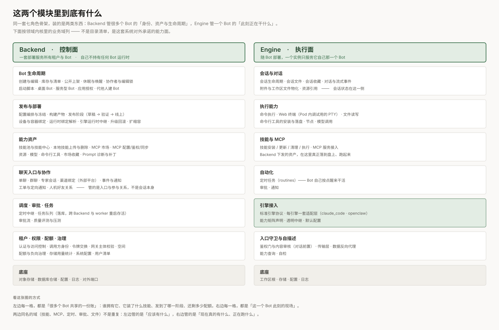
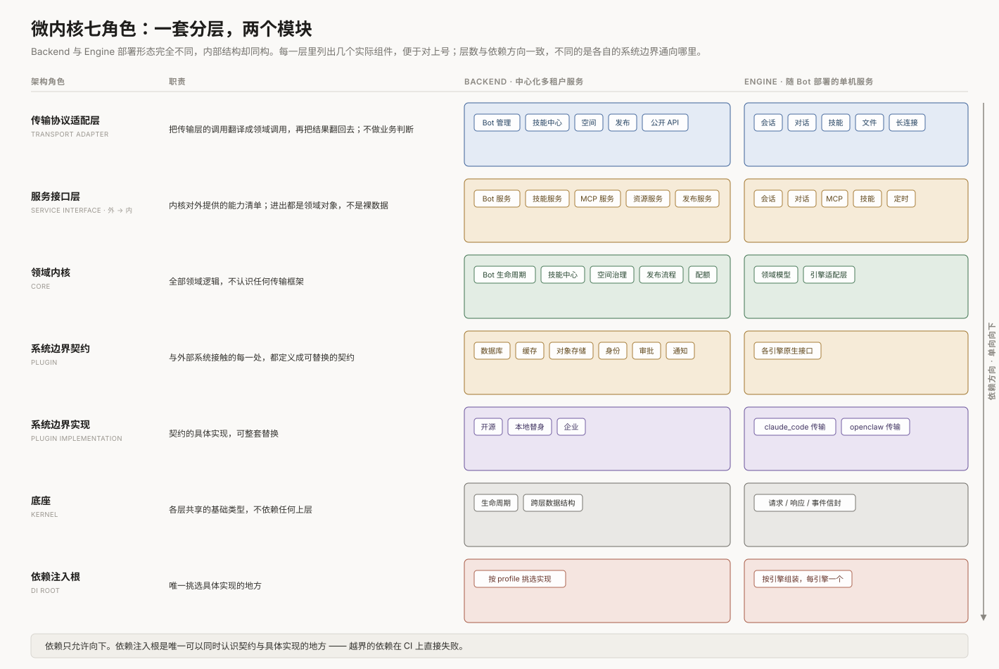
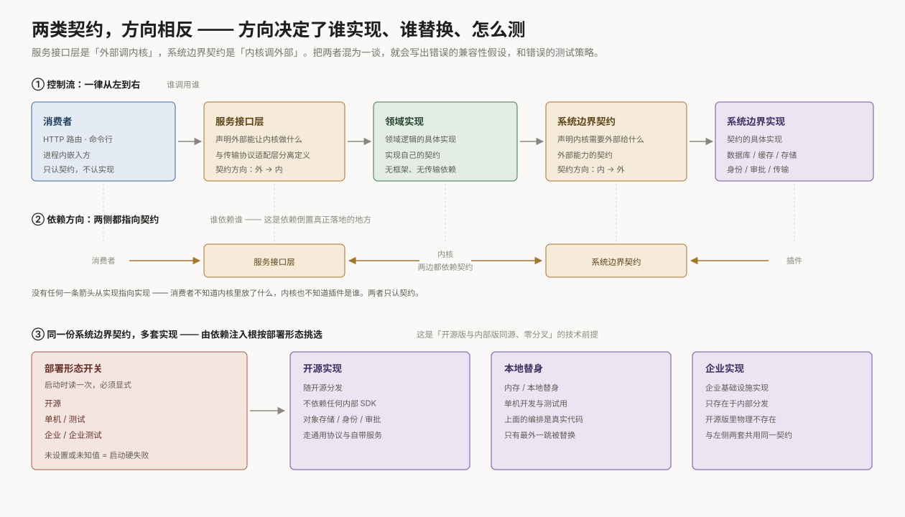
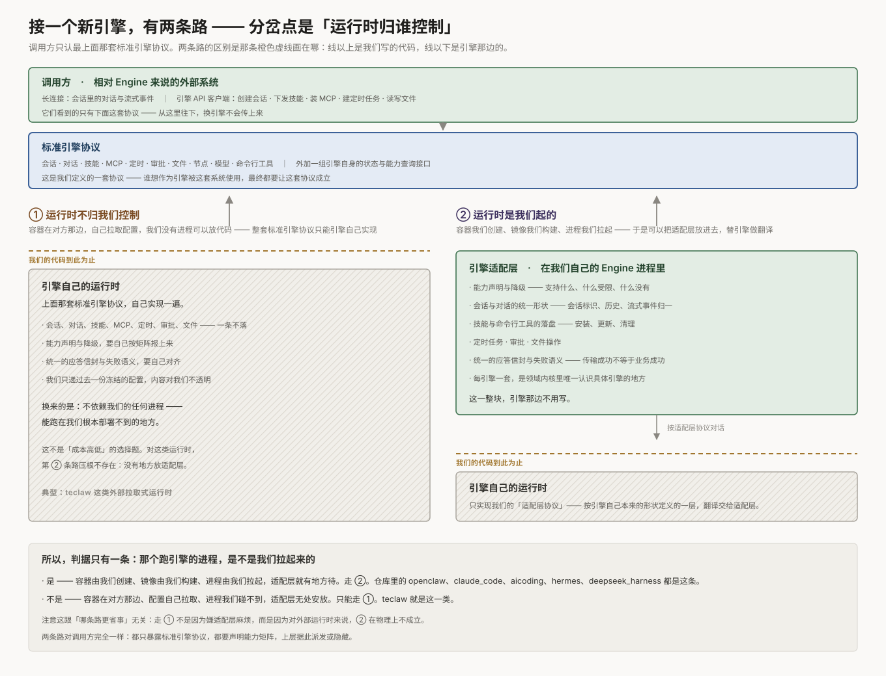
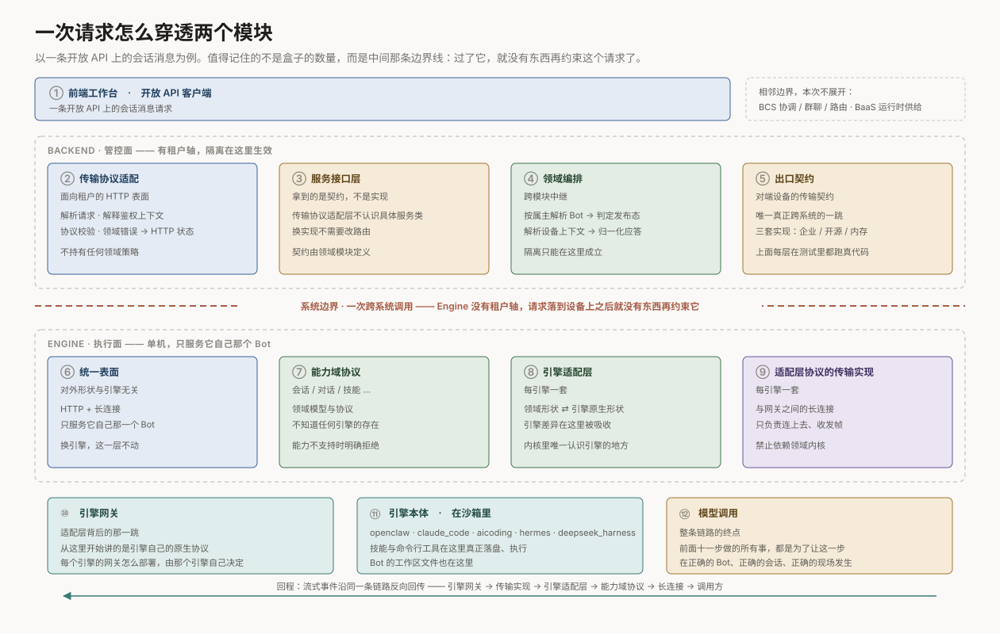
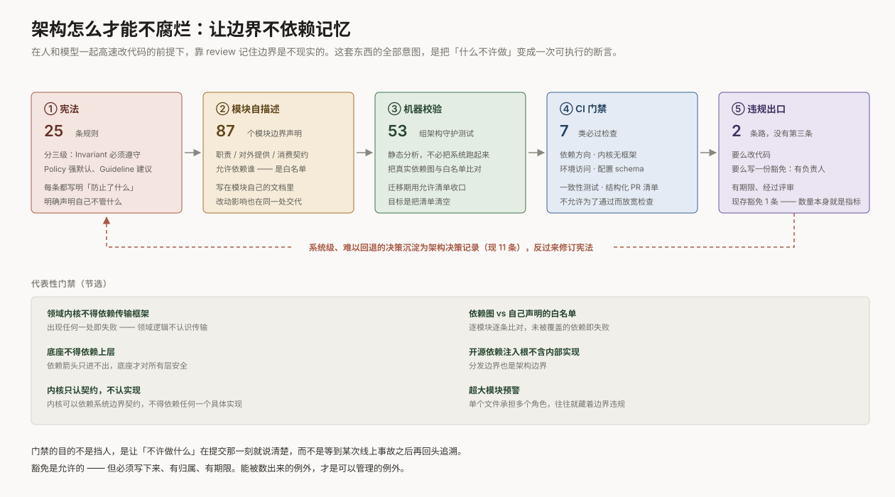

# Backend 与 Engine 架构分享

> 讲两件事：这两个模块各自由哪些部分组成，以及它们怎么配合。配图 8 张，在 `docs/images/arch/`。

---

## 目录

| # | 主题 | 配图 |
| --- | --- | --- |
| 1 | 全景：这两个模块怎么跟别的组件打交道 | 图 0 |
| 2 | 家底：这两个模块里到底有什么 | 图 1 |
| 3 | 骨架：微内核的七个角色 | 图 2 |
| 4 | 契约：两类接口，方向相反 | 图 3 |
| 5 | Profile：一份代码，多种部署形态 | — |
| 6 | 引擎：接一个新引擎有两条路 | 图 4、图 5 |
| 7 | 链路：一次请求怎么穿透两个模块 | 图 6 |
| 8 | 治理：架构怎么才能不腐烂 | 图 7 |
| 9 | 收口：可迁移的六条经验 | — |

---

## 1. 全景：这两个模块怎么跟别的组件打交道


先不看这两个模块内部长什么样，只看它们对外的几根线。一条线最能说明这套系统的形状：

**Backend 想跟某个 Bot 说话，不能直接找它。**

Backend 手上有 Bot 的全部元数据 —— 谁拥有它、装了什么技能、发到了哪个阶段 —— 唯独没有它此刻跑在哪。那份定位信息在 BaaS 手上：容器是 BaaS 创建的，连接方式也只有它知道。所以每一次要跟运行时打交道，顺序都是固定的：先问 BaaS 拿定位结果，再经 agentclawproxy 这个唯一入口打进去，由它鉴权、解析目标、转发到那个 Bot 的 Engine 上。会话、技能下发、定时触发，全部走这一条。

**Backend 从不直连运行时**，这不是实现细节，是整套部署模型的前提：Bot 可以跑在我们自己的集群里，也可以跑在我们根本部署不到的地方，Backend 的代码一行不用改 —— 因为它从来就没有假设过运行时在哪。

剩下几根线：

- **调用方分两类，路径不一样** —— 前端工作台的存量接口仍然直连 agentclawproxy；而新的开放 API 是收口的：调用方只跟 Backend 打交道，需要碰运行时的时候由 Backend 去走上面那条定位 + 转发的路。这是一个正在收敛的方向，不是已经完成的状态。
- **BCS / BCN 是协作面** —— Bot 注册进协作网络之后，Bot 与 Bot 之间的组队、消息路由、群聊由它负责，不经过 Backend。
- **接入协作网络有两条路** —— 自建运行时长连接直连；已有的外部 Bot 平台注册成 Provider，由协作面把消息派下去。
- **Engine 再往下还有一跳** —— 引擎网关和沙箱运行时。Engine 把标准接口翻成各引擎的原生协议，技能与命令行工具在沙箱里落盘，模型调用最终在那里发生。

本次讲的是其中两个：**Backend 是控制面，Engine 是执行面**。

---

## 2. 家底：这两个模块里到底有什么



上一节只说了它们跟谁打交道。这一节说它们各自装了什么 —— 因为「控制面 / 执行面」这两个词太空，容易让人以为 Backend 就是几个 CRUD 接口、Engine 就是一个模型调用的壳。实际不是。

**Backend 侧**大致六块：Bot 生命周期（创建、库存、上架、休眠、协作者、桌面 Bot、服务型 Bot）；发布与部署（配置编排与冻结、构建产物、草稿→验证→线上的阶段推进、设备与容器绑定、升级回滚与扩缩容）；能力资产（技能池与技能中心、MCP 市场与配置鉴权同步、资源、模型、命令行工具）；聊天入口与协作（单聊、群聊、专家会话、渠道绑定、事件通知、工单）；调度与审批（定时中继、落库的任务队列、审批流、质量评测）；以及租户治理（认证与访问控制、调用方身份与令牌交换、空间、配额、存储用量、系统配置）。

**Engine 侧**六块：会话与对话（会话生命周期、会话文件、流式事件、附件物化）；执行能力（命令执行、Web 终端、文件读写、命令行工具落盘、模型调用）；技能与 MCP；自动化（定时任务、审批、通知）；引擎接入（标准引擎协议与每引擎一套的适配层）；入口守卫与自描述（鉴权门与内容审核、传输层、数据反向代理、能力查询）。

这里有一处容易混淆，先讲清楚：

> **会话本身归 Engine。** 会话的创建、上下文、历史、会话文件、流式事件，状态都在 Engine 那一侧 —— 它是执行现场，会话就是现场的主线。
>
> **Backend 那一块管的是「谁能进哪个会话」，不是会话本身。** 单聊、群聊、专家会话、渠道绑定 —— 它解决的是入口和参与关系：这条消息属于哪个 Bot、由谁发起、从哪个渠道进来、要不要通知谁。真正要开一个会话、往里写东西的时候，它还是得按第 1 节那条路打到那个 Bot 的 Engine 上。
>
> 一句话：**Backend 管入口与关系，Engine 管会话与执行。**

看这张图还有一个要点，也是后面几节的伏笔：

> 两边会出现同名的域 —— 技能、MCP、定时、审批、文件，左右都有。这不是重复。**左边管的是「应该有什么」，右边管的是「现在真的有什么、正在跑什么」。** Backend 记账，Engine 落地；一次发布，就是把左边那份账推成右边的现场。

同样值得注意的是**倍率**：左边每一格，都是很多个 Bot 共享的一份账；右边每一格，都只是这一个 Bot 的现场。同一个域名字相同，但两边的并发、隔离、失败代价完全不是一个量级 —— 这也是为什么它们必须是两个模块，而不是一个模块的两个包。

---

## 3. 骨架：微内核的七个角色



Backend 是中心化的多租户服务，Engine 是随 Bot 部署的单机服务。部署形态完全不同，但两者的内部结构是同构的 —— 都落在同一组七个角色上。图里每一层都列了几个实际组件，可以直接对上号。

### 3.1 七个角色

这套架构有一份成文的规则集（25 条，下称「宪法」），它要求任何模块至少能区分出七种角色，并且**依赖方向必须显式、单向、可被工具检查**：

| 角色 | 职责 | Backend | Engine |
| --- | --- | --- | --- |
| **传输协议适配层** | 把传输层的调用翻译成领域调用，再把结果翻回去；不做业务判断 | Bot 管理 / 技能中心 / 空间 / 发布 / 公开 API | 会话 / 对话 / 技能 / 文件 / 长连接 |
| **服务接口层** | 内核对外提供的能力清单。进出的请求与响应都是**领域对象**，不是裸数据 —— 这是内核能与传输彻底解耦的前提 | Bot 服务 / 技能服务 / MCP 服务 / 资源服务 / 发布服务 | 会话 / 对话 / MCP / 技能 / 定时 |
| **领域内核** | 全部领域逻辑，不认识任何传输框架 | Bot 生命周期 / 技能中心 / 空间治理 / 发布流程 / 配额 | 领域模型 + 引擎适配层 |
| **系统边界契约（plugin）** | 与外部系统接触的每一处，都在这里定义成可替换的契约 | 数据库 / 缓存 / 对象存储 / 身份 / 审批 / 通知 | 各引擎的原生接口 |
| **系统边界实现（plugin implementation）** | 契约的具体实现，可整套替换 | 开源 / 本地替身 / 企业，三套 | claude_code 传输 / openclaw 传输 |
| **底座** | 各层共享的基础类型 | 生命周期 / 跨层数据结构 | 请求、响应、事件信封 |
| **依赖注入根（DI Root）** | 唯一挑选具体实现的地方 | 按 profile 挑选实现 | 按引擎组装，每引擎一个 |

层数和依赖方向完全一致，不同的是**各自的系统边界通向哪里**：Backend 的边界通向基础设施，Engine 的边界通向异构 Agent 引擎。

### 3.2 底座放什么

底座放的是**跨层共用的基础类型**：生命周期原语、各层之间传递的数据结构，以及 Engine 这边适配层与引擎网关之间收发的请求、响应、事件信封。

判断一个类型该不该放进底座，只看一件事：**它是不是被两个互相不能依赖的层同时需要**。适配层与传输实现之间的信封就是这种情况 —— 传输实现产生它，领域内核消费它，两边谁也不该依赖谁，它就落在两边都够得着的下方。

---

## 4. 契约：两类接口，方向相反



### 4.1 两类接口

宪法里最核心的一条：**服务接口层和系统边界契约是两类不同的东西，必须分开定义、分开记录、分开版本化、分开测试。**

- **服务接口层**：别人调我们。内核对外提供什么能力，在这里声明，进出都是领域对象。
- **系统边界契约**：我们调别人。每一处跨出本系统的调用，都要先有一份契约。

### 4.2 分清这两类，决定了三件具体的事

| | 服务接口层（别人调我们） | 系统边界契约（我们调别人） |
| --- | --- | --- |
| **改了谁会受影响** | 改接口 → 所有调用方 | 改契约 → 所有边界实现 |
| **测试怎么写** | 一致性测试：内核的实现是否满足自己声明的接口 | 用替身顶替外部系统：内核在各种外部行为下是否正确 |
| **谁可以被换掉** | 内核实现可换，调用方无感 | 边界实现可整套换，内核无感 |

把两者混为一谈，最直接的后果是测试写错方向：该用替身的地方去连真实系统，该验证一致性的地方只测了一条happy path。

### 4.3 依赖倒置真正落地的样子

图 3 的第二条带子是关键：**没有任何一条箭头从实现指向实现。**

- 调用方依赖服务接口层，内核也依赖它；
- 内核依赖系统边界契约，边界实现也依赖它。

两侧都指向中间的契约。调用方不知道内核里放了什么，内核也不知道外部是谁在实现。

---

## 5. Profile：一份代码，多种部署形态

上一节说每处系统边界都有多套实现。**决定装哪一套的，是 profile。**

### 5.1 一处边界，多套实现

Backend 侧的 35 处系统边界，每一处都对应多套实现：

| 实现集 | 用途 | 是否随开源分发 |
| --- | --- | --- |
| **开源实现** | 不依赖任何内部 SDK，走通用协议与自带服务 | 是 |
| **本地替身** | 内存实现，单机开发与测试用 | 是 |
| **企业实现** | 对接企业基础设施 | 否 |

### 5.2 profile 和依赖注入模块怎么配合

每一套实现被打包成一个**注入模块**；profile 决定装哪一列；依赖注入根读一次 profile，装上那一列，然后整个系统就按那套实现跑起来。示意：

```python
# 一处系统边界 = 一份契约
class ObjectStorage(Protocol):
    def put(self, path: str, data: bytes) -> str: ...

# 每套实现打包成一个注入模块
class CommunityStorageModule(Module):
    def configure(self, binder):
        binder.bind(ObjectStorage, to=S3CompatibleStorage)

class LocalStorageModule(Module):
    def configure(self, binder):
        binder.bind(ObjectStorage, to=InMemoryStorage)

# profile 决定装哪一列
def modules_for(profile: DeployProfile) -> list[Module]:
    if profile is DeployProfile.COMMUNITY:
        return [CommunityStorageModule(), CommunityIdentityModule(), ...]
    if profile in (DeployProfile.SINGLEBOX, DeployProfile.TEST):
        return [LocalStorageModule(), LocalIdentityModule(), ...]
    ...

# 依赖注入根只做一件事：读一次 profile，装那一列
injector = build_injector(modules_for(DeployProfile.detect()))
```

领域内核那一侧完全不知道这件事发生过 —— 它只认 `ObjectStorage` 这份契约。

现有五档：开源、单机、测试、企业、企业测试。

两个设计细节值得说：

**profile 是纯选择器。** 它只回答「哪一档」，不提供任何派生属性。「这一档装配了什么」由**装了哪些模块**回答，而不是由 profile 上的某个方法回答。

**profile 必须显式。** 未设置或取值未知是启动硬失败，没有静默默认值。一个「猜出来」的部署形态，比启动失败危险得多。

### 5.3 由此得到的分发性质

开源分发里只装得出开源实现与本地替身这两列，企业实现那一列不参与分发。

换个说法：**每份业务逻辑只写一次。** 开源版和内部版跑的是同一份领域内核，差别只在依赖注入根装了哪一列边界实现。不存在两棵需要各自维护的代码树，也就不存在两边行为漂移的问题。

---

## 6. 引擎：接一个新引擎有两条路



### 6.1 先明确一件事：我们定义了一套标准引擎协议

Engine 对外是一套固定的协议 —— **标准引擎协议**。会话、对话、技能、MCP、定时、审批、文件、节点、模型、命令行工具，再加一组引擎自身的状态与能力查询接口。前端和 Backend 只面向这套协议编程，换引擎它们一行不改。

问题只有一个：**这套协议由谁实现出来。** 两条路的分岔就在这里，而决定走哪条的，不是成本，是：

> **那个跑引擎的进程，是不是我们拉起来的。**

**不是我们的 —— 走第 ① 条：引擎方直接实现标准引擎协议。** 容器在对方那边、配置由它自己拉取、进程我们根本碰不到，我们没有任何地方可以放代码。这套协议只能由引擎方自己实现一遍。我们能递过去的只有一份冻结好的配置，内容对我们是不透明的。仓库里 teclaw 就是这一类，也是目前唯一一类外部拉取式运行时。

**是我们的 —— 走第 ② 条：我们提供适配层，引擎方只实现适配层协议。** 容器我们创建、镜像我们构建、进程我们拉起，于是可以在那个进程里放一层适配层。引擎方就不必直接实现标准引擎协议，只需要实现**适配层协议** —— 按它自己本来的接口形状定义的一层 —— 由适配层负责把它翻译成标准引擎协议。目前接进来的引擎 —— openclaw、claude_code、aicoding、hermes、deepseek_harness —— 走的都是这条。

注意第 ① 条不是「代价更高的那条」，对外部运行时来说，第 ② 条**物理上不成立**：没有任何一个我们控制的进程，可以站在中间做翻译。换个角度说，第 ① 条的代价，买的是**部署自由** —— 引擎可以跑在我们根本部署不到的地方，而上层完全无感。

### 6.2 第 ② 条路上，引擎方真正要写的是什么

写的是**翻译**：把引擎自己的协议，跟我们的适配层协议对上。就这一件事。

省掉的是**其余全部** —— 因为那些都由 Engine 这个我们自己的进程提供：

| 引擎方不用写的部分 | 具体是什么 |
| --- | --- |
| 对外的协议表面 | HTTP 与长连接入口、路由、请求响应信封、流式事件的传输 |
| 会话与对话的统一形状 | 会话生命周期、会话标识解析、历史、会话文件、附件与工作区文件物化 |
| 技能与命令行工具的落盘 | 安装、更新、清理，以及跟 Backend 那份账的对齐 |
| MCP 服务接入 | 服务注册、配置下发、调用转发 |
| 定时任务 · 审批 · 文件操作 · 节点 · Web 终端 | 这些能力域的编排逻辑 |
| 入口守卫 | 鉴权门与对话前置的内容审核、数据反向代理 |
| 能力声明与降级 | 支持什么、什么受限、什么没有；上层据此派发、降级或隐藏 |
| 统一的失败语义 | 传输成功不等于业务成功，在适配层被识别出来并归一 |
| 装配期的一致性交叉校验 | 声明了却没接上，启动就失败，而不是线上第一次调用才发现 |

换句话说：第 ① 条要把上面这张表连同标准引擎协议全部自己实现一遍；第 ② 条只需要写最上面那一行「翻译」，剩下的都是现成的。

两条路对上层完全一样：都只暴露标准引擎协议，都要声明能力矩阵，上层据此派发或隐藏。

### 6.3 适配层的两条关键性质

**它是领域内核里唯一认识具体引擎的地方。** 领域内核里除它之外的任何代码，都不应该出现引擎的名字。

**它依赖的是接口抽象，不是具体实现。** 适配层位于领域内核之内，但它只依赖该引擎的原生接口契约；具体的传输实现由依赖注入根注入。因此「内核不依赖边界实现」这条约束对整个内核成立，包括适配层自己。

### 6.4 能力矩阵：声明式，而不是异常驱动


每个引擎声明一份能力矩阵，分三态：**原生支持**、**受限降级**（必须写明原因）、**未接入**（上层不派发，前端直接隐藏）。

核心规则：**一个能力存在，当且仅当适配层真的把它接上了。** 声明与实现的一致性在装配阶段交叉校验 —— 声明了却没接上，启动就失败，而不是等到线上第一次调用。

**两条链路不是包含关系。** claude_code 在技能与对话交互上更强，openclaw 在 MCP、节点、渠道、Web Shell 上更全。交集才是领域内核可以无条件依赖的部分，差集必须走能力判断。

能力名是 Engine、Backend、前端三方之间的稳定契约：新增安全，改名或删除是破坏性变更。

---

## 7. 链路：一次请求怎么穿透两个模块



### 7.1 一次请求怎么走完

以一条开放 API 上的会话消息为例：

**Backend 侧**：① 调用方 → ② 传输协议适配（解析、鉴权、协议校验）→ ③ 服务接口层（拿到的是契约，不是实现）→ ④ 领域编排（按属主解析 Bot、判定发布态、解析设备上下文）→ ⑤ 出口契约（唯一的跨系统抽象）

**─── 系统边界 ───**

**Engine 侧**：⑥ 标准引擎协议表面 → ⑦ 能力域协议 → ⑧ 引擎适配层 → ⑨ 适配层协议的传输实现 → ⑩ 引擎网关与沙箱 → 模型

回程是流式事件沿同一条链路反向回传。

### 7.2 中间那条线为什么重要

**Engine 没有租户轴。** 它是随 Bot 部署的单机服务，只服务它自己那一个 Bot —— 请求一旦落到设备上，就没有任何东西再约束它。

所以隔离只能在左半边成立：**按属主解析 Bot、判定发布态、把业务失败跟传输失败区分开，全部发生在 Backend 的领域编排里**，因为过了那条线就再没有地方做这些事了。这是「边界画在哪，决定了什么必须在边界之前发生」的一个具体例子。

### 7.3 一个关于可测性的观察

这条链路上，真正难在测试里跑起来的，只有最外面那一跳 —— 对端是另一个进程。而它上面的一切 —— Bot 解析、权限判定、发布态选择、响应整形 —— **都是生产代码，都在测试里真实执行**。

这是「可测性由边界位置决定」最好的例证：**把不可测的部分压缩成一个契约，剩下的全部变成可测的**。如果测试里要替换的东西超过一个，通常说明边界画在了错误的地方。

顺带一提，这条「最外面那一跳跑不起来」的说法正在被推翻：单机形态（singlebox）在把本地沙箱和引擎也带起来，那一跳也会变成真实可跑的。这恰好是上面那句话的反面印证 —— 边界画对了，把替身换成真货不需要改任何上层代码。

---

## 8. 治理：架构怎么才能不腐烂



### 8.1 门禁针对的四个腐蚀方向

这套规则针对的不是抽象的「架构美感」，而是四个具体的、反复出现的腐蚀方向：

| 腐蚀方向 | 典型表现 | 后果 |
| --- | --- | --- |
| **传输内渗** | 传输协议的概念渗进领域逻辑 | 领域逻辑绑死协议，脱离框架就无法独立验证 |
| **实现直连** | 领域逻辑直接依赖某个具体实现 | 失去可替换性，本地与测试环境跑不起来 |
| **环境散落** | 配置读取散落在业务代码各处 | 部署行为不可知，环境差异变成隐性逻辑 |
| **分发泄漏** | 内部实现混进开源分发 | 开源版无法独立启动，分发边界失守 |

四条有一个共同特征：**单看一次改动都很合理，累积起来才致命**。这正是需要机器而不是人来把关的原因。

### 8.2 真正让架构不腐化的，是把宪法翻译成 CI 测试

前面那张表列的是「怕什么」。但光有规则不解决问题 —— 规则写在文档里、靠人在评审时想起来，就一定会漏。**唯一有效的办法，是把每一条规则翻译成一个会红的测试。**

这里面有一个不那么直觉的点，直接看代码最快。下面这条链路是仓库里真实存在的，一共四步。

**第一步：端到端测试长这样 —— 声明式，没有替身。**

```python
def _seed_quota(world) -> None:
    # 通过真实的 service 写真实的行，不是塞一个假对象
    world.get(CommonConfigService).upsert_config(
        business_code=BUSINESS_CODE, param_code=PARAM_CODE,
        param_value={"total": 100, "remaining": 42}, ...
    )

@endpoint_test(
    method="GET", path="/api/v1/beta/quota", scenario="happy",
    input=CaseInput(headers={"x-user-id": "u_beta_quota_test"}),
    seed=_seed_quota,
    expect=ExpectSuccess(status=200, json_contains={
        "success": True, "data": {"total": 100, "remaining": 42},
    }),
)
def get_beta_quota_happy():
    """Existing config returns total + remaining."""
```

它保证的是：装上全部依赖注入模块、真路由、真服务、真内存库，请求从最外层一路跑到最底层。**负责人只要扫一眼 `seed` 和 `expect`，就知道这个接口在真实数据上的行为对不对。**

配套有一道门禁，`coverage_gate.py` 第一句就写着 *every live endpoint must have a happy + error case*：接口没有这两种用例就红。存量缺口冻结在一份基线清单里，**新增缺口立刻红，而且基线条目被补上之后不删也红** —— 清单只能变短。

**第二步：人会这样把它破坏掉。**

```python
def _seed_quota(world) -> None:
    world.get(CommonConfigService).get_config = MagicMock(   # ← 路径断了
        return_value={"param_value": {"total": 100, "remaining": 42}}
    )
```

接口测试还在、覆盖率门禁还是绿的，但请求已经不碰真实代码了 —— 断言的是作者自己写的那个替身。**生产代码烂掉，测试照样绿。**

**第三步：于是写一个测试，保证端到端测试里没有替身。**

```python
_MOCK_MODULES   = frozenset({"unittest.mock", "mock"})
_MOCK_CALLABLES = frozenset({"patch", "MagicMock", "Mock", "AsyncMock", ...})
_MOCK_FIXTURES  = frozenset({"monkeypatch", "mocker"})
_PATCH_BUILTINS = frozenset({"setattr", "delattr"})   # 绕过赋值扫描的写法

def test_no_mock_or_patch_in_endpoint_tests() -> None:
    violations = [v for root in _ENDPOINTS_ROOTS
                    for path in root.rglob("*.py")
                    for v in _scan_file(path)]        # 纯 AST，不看注释和字符串
    assert not violations, ...
```

它同时留了正门：要替换系统边界，走依赖注入的替换点 —— `world.get(SomeBoundaryPlugin).set_response(...)`。**替换只发生在系统的边缘，边缘以内全部保持真实。**

**第四步：还有一个洞，再补一个。** 不导入 mock 库，直接给依赖注入拿到的实例赋值方法。兄弟测试 `test_no_mock_on_world_get.py` 专扫这个，直接式 `world.get(T).m = ...` 和 `repo = world.get(T); repo.m = ...` 间接式都认。

**最关键的一步：这两个测试放在哪。**

```
src/backend/tests/community/framework/
├── OWNERS                              ← reviewers: [...]  threshold: 1
├── test_no_mock_in_endpoint_tests.py
└── test_no_mock_on_world_get.py
```

现在回到那个想在端到端测试里 mock 的人：他要让 CI 变绿，**唯一的办法是去删 `_MOCK_CALLABLES` 里的某一个字符串** —— 一个具体文件里的一个具体位置。而那个目录带 `OWNERS`，改动必须有负责人点头。

这就是整件事的设计点：**负责人要审的不是几百个接口测试，而是那一行 frozenset。** 短到不可能看漏。

抽象成三句话：

1. **规则必须是可执行的断言，不是文档里的一段话。**
2. **守卫本身也会被绕过，所以守卫要有守卫。**
3. **把最后那道守卫收敛成一个「一眼能看懂的位置」，并放在需要审批的地方。** 绕过不必不可能，但必须是显式的、有署名的、改在一个藏不住的地方。

第三条是这套机制成立的真正原因：它不指望人不犯错，只要求**绕过的动作无处躲藏**。

### 8.3 宪法自己的边界感

25 条规则分三级：

- **不变量** — 必须遵守，违反需要显式豁免；
- **政策** — 强默认，偏离需要说明理由；
- **建议** — 推荐做法，本身不构成结构违规。

更值得注意的是它**明确声明不管什么**：不规定领域建模风格、不规定与架构无关的命名、不规定语言语法细节。

这个自我克制是它能被执行下去的前提。一部什么都想管的宪法，最后只会被整体忽略。

每条规则的结构也是固定的：**规则 → 防止了什么 → 必须检查什么 → 如何解释**。「防止了什么」这一栏是它区别于普通编码规范的地方 —— 每条规则都对应一类真实出现过的问题。

### 8.4 五个环节

**① 宪法（25 条）→ ② 模块自描述（87 处）→ ③ 机器校验（53 组）→ ④ CI 门禁（7 类）→ ⑤ 违规出口（2 条路）→ 回到 ①**

### 8.5 模块自描述：让白名单可校验

每个边界显著的模块，在自己的文档里用固定格式声明四件事：

- **职责** —— 一句话说清它负责什么；
- **对外提供什么** —— 公开能力清单；
- **消费哪些外部契约** —— 信息性，不做机器校验；
- **允许依赖哪些内部模块** —— **这是一份白名单，机器校验它**。

关键在最后一项：它不是文档，是断言。模块实际发生的、未被白名单覆盖的依赖，会让架构检查直接失败。

几个设计取舍值得注意：

- **前缀匹配** —— 声明一个范围即覆盖其下所有子模块，避免清单碎片化；
- **声明了但没用不算错** —— 过期条目顺手清理即可，不制造无谓的红灯；
- **反向视图是生成的** —— 「谁依赖了我」由工具反推，不手工维护。

同时明确了几条反模式：把具体实现列进白名单（多半意味着分层已经破了）、把「改动影响」写成文件清单（要写的是**谁会察觉到这个改动**，不是改了哪些文件）。

Backend 75 处 + Engine 12 处，共 87 个模块有这份声明。

### 8.6 机器校验：静态分析，不必把系统跑起来

53 组架构检查（Backend 50 + Engine 3），全部是对代码结构的静态分析 —— 不启动服务、不连依赖，因此可以无条件挂在每一次提交上。它们守的是这些事：

| 守的是什么 |
| --- |
| 领域内核里出现任何交付框架依赖即失败 |
| 底座不得依赖本模块任何其他层 |
| 内核只能依赖系统边界契约，不得依赖任何具体实现 |
| 真实依赖图 vs 各模块自己声明的白名单，逐条比对 |
| 开源依赖注入根里不得出现内部实现 —— 分发边界也是架构边界 |
| 超大模块预警 —— 单个文件承担多个角色，往往就藏着边界违规 |

这里有一个务实的做法值得单独提：**迁移期允许清单**。规则收紧时，存量违规先进允许清单，新增违规立刻失败，清单条目随迁移逐批删除，**目标是清空**。

这个做法承认现实，但同时锁定了方向 —— 比「一步到位」和「无限期妥协」都更可执行。

### 8.7 违规出口：只有两条路

要么改代码，**要么写一份豁免**：有归属、有负责人、经过评审、有期限。

目前存量豁免 **1 条**。这个数字本身就是一个健康度指标 —— **能被数出来的例外，才是可以管理的例外。**

系统级、难以回退的决策则沉淀为架构决策记录（现 11 条），反过来修订宪法。决策记录的地位高于规格说明和调研文档：**规格和调研是决策的输入，它们不能推翻一份已经接受的决策。**

### 8.8 一条明确的纪律

> 不要为了让改动通过而削弱检查。如果某个检查本身是错的，修检查，并说明为什么。

这句话写在仓库的贡献规范里。它的意义在于：**把「绕过门禁」从一个技术选项，变成一个需要解释的行为。**

---

## 9. 收口：可迁移的六条经验

不依赖这个仓库的上下文，这六条在任何中大型服务上都成立：

1. **方向比分层重要。** 先问清楚「谁调用谁」，再决定放在哪一层。方向搞错，分层再漂亮也没用 —— 兼容性假设和测试策略会跟着一起错。

2. **每一处跨出本系统的调用，都先定义成契约。** 这是同一份内核能落进不同部署环境的唯一办法，也是「本地能跑」和「线上能跑」不需要两套代码的前提。

3. **能力要声明，不要靠异常发现。** 「调用了才知道不支持」是运行期问题；「声明了却没实现」应该是装配期问题。把失败时机往前推。

4. **把不可测的部分压缩成一个契约。** 如果测试里需要替换的东西超过一个，边界多半画错了。可测性不是测试写得好，是边界画得对。

5. **例外要可数。** 允许豁免，但必须有归属、有期限、能被统计。一个说不清自己有多少例外的架构，等于没有架构。

6. **规则不落到 CI 上就等于没有，而守卫本身也需要守卫。** 写在文档里、靠人在评审时想起来的规则，一定会漏。把每条规则翻译成一个会红的测试；然后接受一个事实 —— 守卫会被绕过，所以还要有守卫的守卫。关键是把绕过的动作**收敛到一个具体文件的一个具体位置**，再把那个位置放在需要审批的地方：**绕过不必不可能，但必须是显式的、有署名的、藏不住的。**

补一条不算「经验」但值得带走的判断方式：**做扩展点设计时，先问「那段代码跑在谁的进程里」，再问「接口长什么样」。** 进程归属决定了你能不能在中间插一层；插不进去的时候，再漂亮的适配层设计也只是纸面方案。第 6 节两条接入路的分岔，本质上就是这一个问题。

---

## 附录：代码落点

> 正文刻意不提目录。这里是角色到实际位置的对照，给会后想深入的人。

### 1. 角色落在哪

| 角色 | Backend | Engine |
| --- | --- | --- |
| 传输协议适配层 | `adapters/http/` | `api/` |
| 服务接口层 | `api/`（定义在各领域模块内，此处转出） | `core/<domain>/protocol.py` |
| 领域内核 | `core/`，引擎适配层在 `core/adapters/<engine>/` | `core/` |
| 系统边界契约 | `plugin_api/` | `plugin_api/<engine>/` |
| 系统边界实现 | `plugins/{community, local}`（企业实现在内部分发） | `plugins/<engine>/` |
| 底座 | `kernel/` | `kernel/frames` |
| 依赖注入根 | `di/` | `di/` + `engines/<name>/` |

包根：Backend 在 `src/backend/src/agentclaw/community/`，Engine 在 `src/engine/src/engine/community/`。

### 2. 我要改 X，应该动哪

| 我要做的事 | 应该动的位置 |
| --- | --- |
| 加一个公开接口 | 传输协议适配层加路由 → 注入对应的服务接口 |
| 加一个领域能力 | 领域模块内定义契约 + 实现 → 服务接口层层转出 |
| 换一个基础设施实现 | 对应实现集里加实现 → 改依赖注入根的一处绑定 |
| 加一个新的外部依赖 | 先定系统边界契约，再写实现 |
| 接一个新引擎（进程是我们拉起的） | 引擎适配层 + 引擎原生接口契约 + 传输实现 + 依赖注入根，各加一套 |
| 接一个新引擎（外部拉取式运行时） | 引擎侧自行实现整组标准引擎接口；这边只加注册与能力矩阵声明 |
| 给引擎加一个能力 | 能力域协议定协议 → 各引擎引擎适配层接上 → 依赖注入根声明 |
| 改一个模块的依赖范围 | 同步改该模块的白名单声明，否则检查失败 |
| 做一个难以回退的系统决策 | 写一份架构决策记录 |
| 确实需要突破某条不变量 | 写豁免 —— 要有负责人和期限 |

### 3. 延伸阅读

| 文档 | 内容 |
| --- | --- |
| `docs/arch/arch.rules.md` | 架构宪法，25 条规则 |
| `docs/arch/ci.enforce.md` | CI 门禁的最低要求 |
| `docs/arch/context-boundary-format.md` | 模块边界声明格式 |
| `docs/adr/` | 已接受的系统级决策 |
| `CONTEXT.md` / `CONTEXT-MAP.md` | 产品领域语言与阅读入口 |
| `src/engine/docs/heterogeneous-engine-architecture.md` | 异构引擎设计细节 |
| `src/backend/src/agentclaw/community/api/README.md` | 服务接口层层的设计理由 |
| `src/backend/src/agentclaw/community/core/engine_runtime/README.md` | 跨模块中继的三条不变量 |
