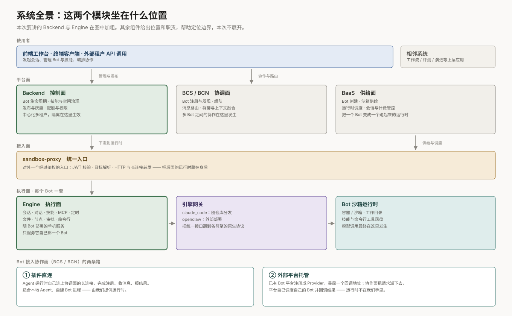
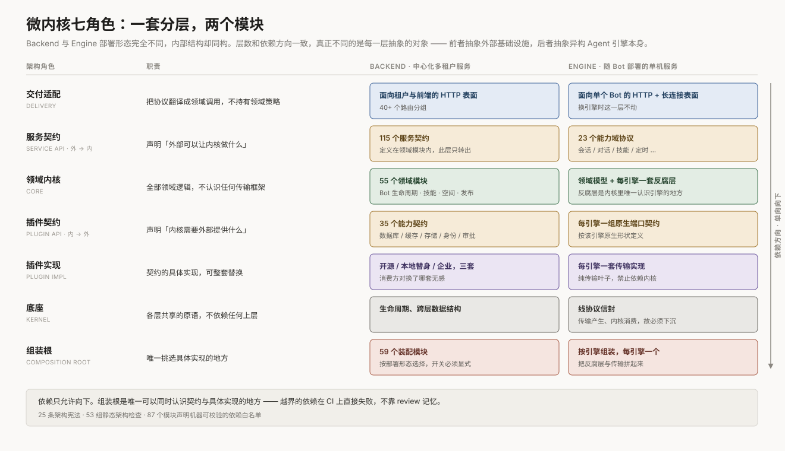
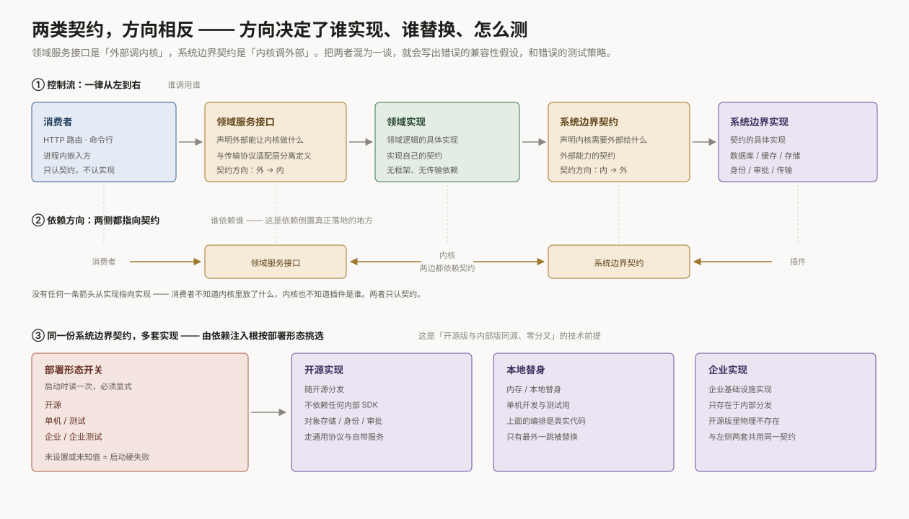
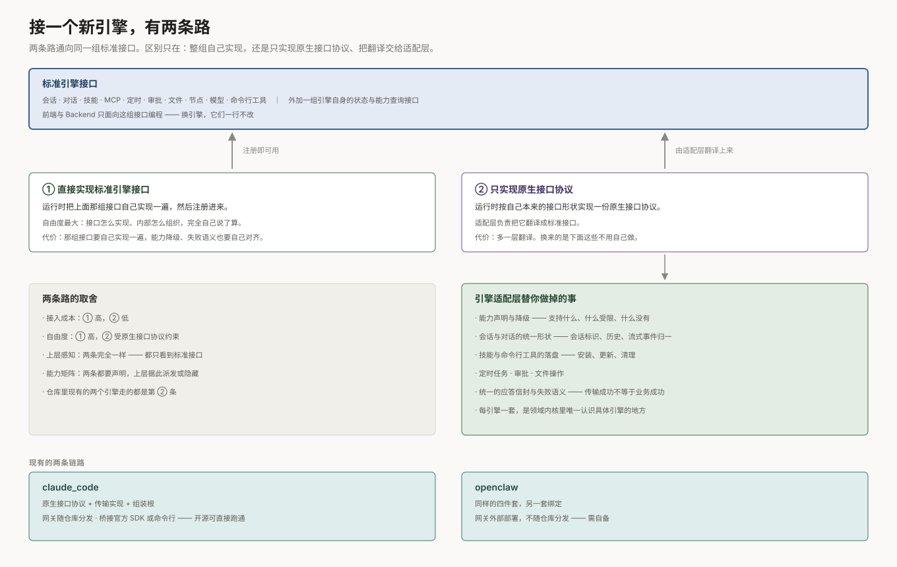
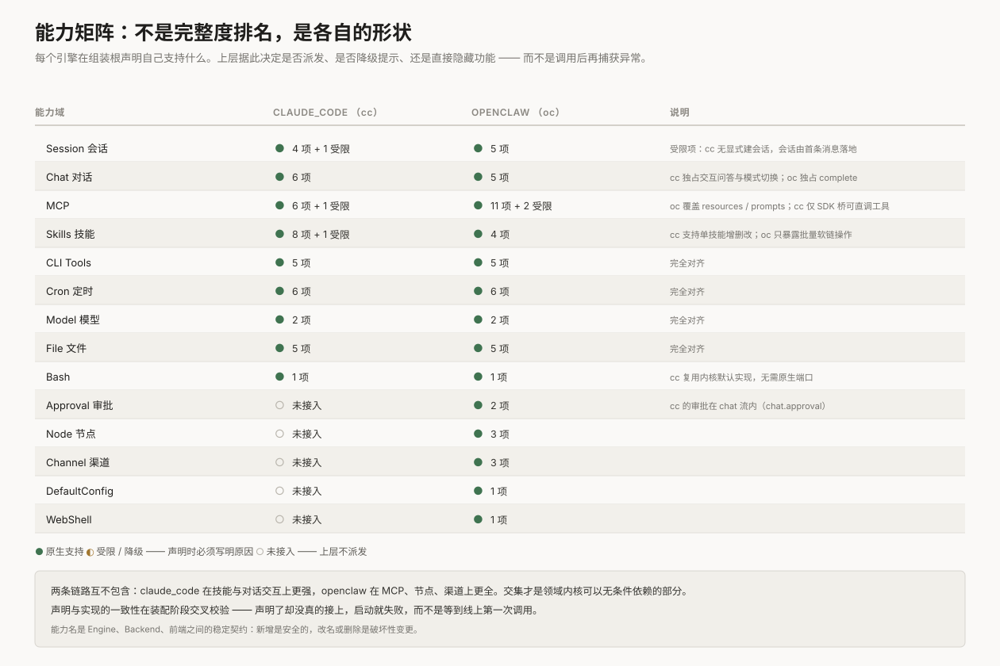
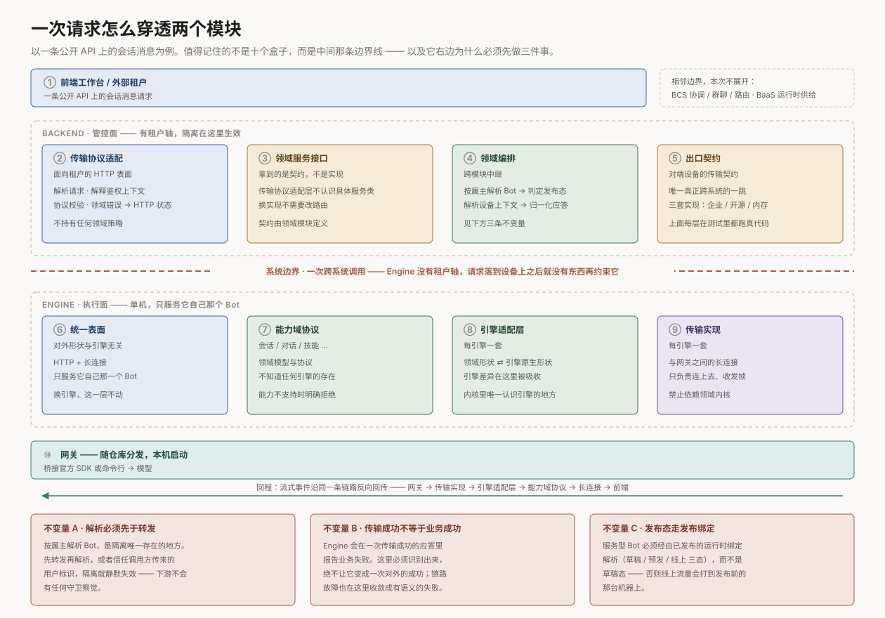

# Backend 与 Engine 架构分享

> **听众**：跨团队架构评审 · **配图**：7 张（`docs/images/arch/`）
>
> 讲两件事：这两个模块各自由哪些部分组成，以及它们怎么配合。

---

## 目录

| # | 主题 | 配图 |
| --- | --- | --- |
| 1 | 系统全景：这两个模块坐在什么位置 | 图 0 |
| 2 | 骨架：微内核的七个角色 | 图 1 |
| 3 | 契约：两类接口，方向相反 | 图 2 |
| 4 | Profile：一份代码，多种部署形态 | — |
| 5 | 引擎：接一个新引擎有两条路 | 图 3、图 4 |
| 6 | 链路：一次请求怎么穿透两个模块 | 图 5 |
| 7 | 治理：架构怎么才能不腐烂 | 图 6 |
| 8 | 收口：可迁移的五条经验 | — |

---

## 1. 系统全景：这两个模块坐在什么位置



整个平台分四层站位：

- **平台面** —— Backend 管 Bot 的生命周期、技能、空间、发布；BCS 管多个 Bot 之间的注册、发现、组队、路由；BaaS 管把一个 Bot 变成一个真正跑起来的运行时。
- **接入面** —— sandbox-proxy 是对外唯一一个经过鉴权的入口，负责校验、目标解析和转发，把后面的运行时藏在身后。
- **执行面** —— 每个 Bot 一套 Engine，加上它背后的引擎网关和沙箱运行时。模型调用最终在这里发生。
- **接入协作网络的两条路** —— Agent 运行时自己连上协作面（插件直连），或者已有 Bot 平台注册成 Provider、由协作面把请求派下去（外部平台托管）。

本次讲的是其中两个：**Backend 是控制面，Engine 是执行面**。

---

## 2. 骨架：微内核的七个角色



Backend 是中心化的多租户服务，Engine 是随 Bot 部署的单机服务。部署形态完全不同，但两者的内部结构是同构的 —— 都落在同一组七个角色上。图里每一层都列了几个实际组件，可以直接对上号。

### 2.1 七个角色

这套架构有一份成文的规则集（25 条，下称「宪法」），它要求任何模块至少能区分出七种角色，并且**依赖方向必须显式、单向、可被工具检查**：

| 角色 | 职责 | Backend | Engine |
| --- | --- | --- | --- |
| **传输协议适配层** | 把传输层的调用翻译成领域调用，再把结果翻回去；不做业务判断 | Bot 管理 / 技能中心 / 空间 / 发布 / 公开 API | 会话 / 对话 / 技能 / 文件 / 长连接 |
| **服务接口层** | 内核对外提供的能力清单。进出的请求与响应都是**领域对象**，不是裸数据 —— 这是内核能与传输彻底解耦的前提 | Bot 服务 / 技能服务 / MCP 服务 / 资源服务 / 发布服务 | 会话 / 对话 / MCP / 技能 / 定时 |
| **领域内核** | 全部领域逻辑，不认识任何传输框架 | Bot 生命周期 / 技能中心 / 空间治理 / 发布流程 / 配额 | 领域模型 + 引擎适配层 |
| **系统边界契约（plugin）** | 与外部系统接触的每一处，都在这里定义成可替换的契约 | 数据库 / 缓存 / 对象存储 / 身份 / 审批 / 通知 | 各引擎的原生接口 |
| **系统边界实现（plugin implementation）** | 契约的具体实现，可整套替换 | 开源 / 本地替身 / 企业，三套 | claude_code 传输 / openclaw 传输 |
| **底座** | 各层共享的基础类型 | 生命周期 / 跨层数据结构 | 请求、响应、事件信封 |
| **依赖注入根（DI Root）** | 唯一挑选具体实现的地方 | 按 profile 挑选实现 | 按引擎组装，每引擎一个 |

层数和依赖方向完全一致，不同的是**各自的系统边界通向哪里**：Backend 的边界通向基础设施，Engine 的边界通向异构 Agent 引擎。

### 2.2 底座放什么

底座放的是**跨层共用的基础类型**：生命周期原语、各层之间传递的数据结构，以及 Engine 这边适配层与引擎网关之间收发的请求、响应、事件信封。

判断一个类型该不该放进底座，只看一件事：**它是不是被两个互相不能依赖的层同时需要**。适配层与传输实现之间的信封就是这种情况 —— 传输实现产生它，领域内核消费它，两边谁也不该依赖谁，它就落在两边都够得着的下方。

---

## 3. 契约：两类接口，方向相反



### 3.1 两类接口

宪法里最核心的一条：**服务接口层和系统边界契约是两类不同的东西，必须分开定义、分开记录、分开版本化、分开测试。**

- **服务接口层**：别人调我们。内核对外提供什么能力，在这里声明，进出都是领域对象。
- **系统边界契约**：我们调别人。每一处跨出本系统的调用，都要先有一份契约。

### 3.2 分清这两类，决定了三件具体的事

| | 服务接口层（别人调我们） | 系统边界契约（我们调别人） |
| --- | --- | --- |
| **改了谁会受影响** | 改接口 → 所有调用方 | 改契约 → 所有边界实现 |
| **测试怎么写** | 一致性测试：内核的实现是否满足自己声明的接口 | 用替身顶替外部系统：内核在各种外部行为下是否正确 |
| **谁可以被换掉** | 内核实现可换，调用方无感 | 边界实现可整套换，内核无感 |

把两者混为一谈，最直接的后果是测试写错方向：该用替身的地方去连真实系统，该验证一致性的地方只测了一条happy path。

### 3.3 依赖倒置真正落地的样子

图 2 的第二条带子是关键：**没有任何一条箭头从实现指向实现。**

- 调用方依赖服务接口层，内核也依赖它；
- 内核依赖系统边界契约，边界实现也依赖它。

两侧都指向中间的契约。调用方不知道内核里放了什么，内核也不知道外部是谁在实现。

---

## 4. Profile：一份代码，多种部署形态

上一节说每处系统边界都有多套实现。**决定装哪一套的，是 profile。**

### 4.1 一处边界，多套实现

Backend 侧的 35 处系统边界，每一处都对应多套实现：

| 实现集 | 用途 | 是否随开源分发 |
| --- | --- | --- |
| **开源实现** | 不依赖任何内部 SDK，走通用协议与自带服务 | 是 |
| **本地替身** | 内存实现，单机开发与测试用 | 是 |
| **企业实现** | 对接企业基础设施 | 否 |

### 4.2 profile 和依赖注入模块怎么配合

每一套实现被打包成一个**注入模块**；profile 决定装哪一列；依赖注入根读一次 profile，装上那一列，然后整个系统就按那套实现跑起来。示意：

```python
# 一处系统边界 = 一份契约
class ObjectStorage(Protocol):
    def put(self, path: str, data: bytes) -> str: ...

# 每套实现打包成一个注入模块
class CommunityStorageModule(Module):
    def configure(self, binder):
        binder.bind(ObjectStorage, to=S3CompatibleStorage)

class LocalStorageModule(Module):
    def configure(self, binder):
        binder.bind(ObjectStorage, to=InMemoryStorage)

# profile 决定装哪一列
def modules_for(profile: DeployProfile) -> list[Module]:
    if profile is DeployProfile.COMMUNITY:
        return [CommunityStorageModule(), CommunityIdentityModule(), ...]
    if profile in (DeployProfile.SINGLEBOX, DeployProfile.TEST):
        return [LocalStorageModule(), LocalIdentityModule(), ...]
    ...

# 依赖注入根只做一件事：读一次 profile，装那一列
injector = build_injector(modules_for(DeployProfile.detect()))
```

领域内核那一侧完全不知道这件事发生过 —— 它只认 `ObjectStorage` 这份契约。

现有五档：开源、单机、测试、企业、企业测试。

两个设计细节值得说：

**profile 是纯选择器。** 它只回答「哪一档」，不提供任何派生属性。「这一档装配了什么」由**装了哪些模块**回答，而不是由 profile 上的某个方法回答。

**profile 必须显式。** 未设置或取值未知是启动硬失败，没有静默默认值。一个「猜出来」的部署形态，比启动失败危险得多。

### 4.3 由此得到的分发性质

开源分发里只装得出开源实现与本地替身这两列，企业实现那一列不参与分发。

换个说法：**每份业务逻辑只写一次。** 开源版和内部版跑的是同一份领域内核，差别只在依赖注入根装了哪一列边界实现。不存在两棵需要各自维护的代码树，也就不存在两边行为漂移的问题。

---

## 5. 引擎：接一个新引擎有两条路



### 5.1 两条接入路

**第一条：直接实现标准引擎接口。**

Engine 对外是一组固定的接口 —— 会话、对话、技能、MCP、定时、审批、文件、节点、模型、命令行工具，再加一组引擎自身的状态与能力查询接口。任何运行时只要把这组接口实现出来并注册进来，就能作为一个引擎被系统使用。前端和 Backend 都只面向这组接口编程，不关心背后是谁。

这条路给的自由度最大，代价是那组接口要自己实现一遍。

**第二条：只实现适配层协议。**

如果运行时不想实现整组标准接口，它可以只实现适配层定义的**原生接口协议** —— 按自己本来的接口形状定义，由适配层负责翻译成标准接口。

多一层翻译，换来的是下面这些不用自己做：

| 适配层替引擎做掉的事 |
| --- |
| 能力声明与降级 —— 声明支持什么、什么受限、什么没有，上层据此决定派发还是隐藏 |
| 会话与对话的统一形状 —— 会话标识、历史、流式事件都归一 |
| 技能与命令行工具的落盘 —— 安装、更新、清理 |
| 定时任务、审批、文件操作 |
| 统一的应答信封与失败语义 —— 传输成功不等于业务成功，在这里被识别出来 |

### 5.2 适配层的两条关键性质

**它是领域内核里唯一认识具体引擎的地方。** 领域内核里除它之外的任何代码，都不应该出现引擎的名字。

**它依赖的是接口抽象，不是具体实现。** 适配层位于领域内核之内，但它只依赖该引擎的原生接口契约；具体的传输实现由依赖注入根注入。因此「内核不依赖边界实现」这条约束对整个内核成立，包括适配层自己。

### 5.3 能力矩阵：声明式，而不是异常驱动



每个引擎声明一份能力矩阵，分三态：**原生支持**、**受限降级**（必须写明原因）、**未接入**（上层不派发，前端直接隐藏）。

核心规则：**一个能力存在，当且仅当适配层真的把它接上了。** 声明与实现的一致性在装配阶段交叉校验 —— 声明了却没接上，启动就失败，而不是等到线上第一次调用。

**两条链路不是包含关系。** claude_code 在技能与对话交互上更强，openclaw 在 MCP、节点、渠道、Web Shell 上更全。交集才是领域内核可以无条件依赖的部分，差集必须走能力判断。

能力名是 Engine、Backend、前端三方之间的稳定契约：新增安全，改名或删除是破坏性变更。

### 5.4 两条链路的部署差异

| | claude_code | openclaw |
| --- | --- | --- |
| 网关 | 随仓库分发 | 外部部署 |
| 桥接方式 | 官方 SDK 或命令行，两种可切 | 自有协议 |
| 开源可跑 | 是 | 否（需自备网关） |

开源版必须有一条完整可跑的链路，否则「可插拔」无法被外部验证。claude_code 那条就是这条链路。

---

## 6. 链路：一次请求怎么穿透两个模块



### 6.1 十步，但真正要记住的是中间那条线

以一条公开 API 上的会话消息为例，请求依次经过：

**Backend 侧**：① 调用方 → ② 传输协议适配（解析、鉴权、协议校验）→ ③ 服务接口层（拿到的是契约，不是实现）→ ④ 领域编排（按属主解析 Bot、判定发布态、解析设备上下文）→ ⑤ 出口契约（唯一的跨系统抽象）

**─── 系统边界 ───**

**Engine 侧**：⑥ 统一表面 → ⑦ 能力域协议 → ⑧ 引擎适配层 → ⑨ 传输实现 → ⑩ 网关 → 模型

回程是流式事件沿同一条链路反向回传。

### 6.2 中间那条线为什么重要

**Engine 没有租户轴。** 它是随 Bot 部署的单机服务，只服务它自己那一个 Bot —— 请求一旦落到设备上，就**没有任何东西再约束它**。

这意味着：**Backend 侧的领域编排，是隔离唯一存在的地方。** 三条不变量都由此推导：

#### 不变量 A · 解析必须先于转发

按属主解析 Bot 必须发生在任何设备操作之前。先转发再解析、或者信任调用方传来的用户标识，隔离就**静默失效** —— 下游不会有任何守卫察觉。

这是最危险的一类缺陷：它不报错、不告警，只是在某一天变成一次越权访问。

#### 不变量 B · 传输成功不等于业务成功

Engine 可以在一次传输层成功的应答里报告业务失败。这里必须把它识别出来，**绝不让它变成一次对外的成功**。同样地，链路故障要在这里收敛成有语义的失败，而不是把设备细节泄漏给调用方。

#### 不变量 C · 发布态走发布绑定

服务型 Bot 必须经由**已发布的运行时绑定**解析（草稿 / 预发 / 线上三态），而不是草稿态 —— 否则线上流量会打到发布前的那台机器上。

### 6.3 一个关于可测性的观察

这条链路上，**唯一不能在测试中真实运行的，是最外面那一跳** —— 因为真实的对端进程不可达。

而它上面的一切 —— Bot 解析、权限判定、发布态选择、响应整形 —— **都是生产代码，都在测试里真实执行**。

这是「可测性由边界位置决定」最好的例证：**把不可测的部分压缩成一个契约，剩下的全部变成可测的**。如果测试里要替换的东西超过一个，通常说明边界画在了错误的地方。

---

## 7. 治理：架构怎么才能不腐烂


### 7.1 门禁针对的四个腐蚀方向

这套规则针对的不是抽象的「架构美感」，而是四个具体的、反复出现的腐蚀方向：

| 腐蚀方向 | 典型表现 | 后果 |
| --- | --- | --- |
| **传输内渗** | 传输协议的概念渗进领域逻辑 | 领域逻辑绑死协议，脱离框架就无法独立验证 |
| **实现直连** | 领域逻辑直接依赖某个具体实现 | 失去可替换性，本地与测试环境跑不起来 |
| **环境散落** | 配置读取散落在业务代码各处 | 部署行为不可知，环境差异变成隐性逻辑 |
| **分发泄漏** | 内部实现混进开源分发 | 开源版无法独立启动，分发边界失守 |

四条有一个共同特征：**单看一次改动都很合理，累积起来才致命**。这正是需要机器而不是人来把关的原因。

### 7.2 宪法自己的边界感

25 条规则分三级：

- **不变量** — 必须遵守，违反需要显式豁免；
- **政策** — 强默认，偏离需要说明理由；
- **建议** — 推荐做法，本身不构成结构违规。

更值得注意的是它**明确声明不管什么**：不规定领域建模风格、不规定与架构无关的命名、不规定语言语法细节。

这个自我克制是它能被执行下去的前提。一部什么都想管的宪法，最后只会被整体忽略。

每条规则的结构也是固定的：**规则 → 防止了什么 → 必须检查什么 → 如何解释**。「防止了什么」这一栏是它区别于普通编码规范的地方 —— 每条规则都对应一类真实出现过的问题。

### 7.3 五个环节

**① 宪法（25 条）→ ② 模块自描述（87 处）→ ③ 机器校验（53 组）→ ④ CI 门禁（7 类）→ ⑤ 违规出口（2 条路）→ 回到 ①**

### 7.4 模块自描述：让白名单可校验

每个边界显著的模块，在自己的文档里用固定格式声明四件事：

- **职责** —— 一句话说清它负责什么；
- **对外提供什么** —— 公开能力清单；
- **消费哪些外部契约** —— 信息性，不做机器校验；
- **允许依赖哪些内部模块** —— **这是一份白名单，机器校验它**。

关键在最后一项：它不是文档，是断言。模块实际发生的、未被白名单覆盖的依赖，会让架构检查直接失败。

几个设计取舍值得注意：

- **前缀匹配** —— 声明一个范围即覆盖其下所有子模块，避免清单碎片化；
- **声明了但没用不算错** —— 过期条目顺手清理即可，不制造无谓的红灯；
- **反向视图是生成的** —— 「谁依赖了我」由工具反推，不手工维护。

同时明确了几条反模式：把具体实现列进白名单（多半意味着分层已经破了）、把「改动影响」写成文件清单（要写的是**谁会察觉到这个改动**，不是改了哪些文件）。

Backend 75 处 + Engine 12 处，共 87 个模块有这份声明。

### 7.5 机器校验：静态分析，不必把系统跑起来

53 组架构检查（Backend 50 + Engine 3），全部是对代码结构的静态分析 —— 不启动服务、不连依赖，因此可以无条件挂在每一次提交上。它们守的是这些事：

| 守的是什么 |
| --- |
| 领域内核里出现任何交付框架依赖即失败 |
| 底座不得依赖本模块任何其他层 |
| 内核只能依赖系统边界契约，不得依赖任何具体实现 |
| 真实依赖图 vs 各模块自己声明的白名单，逐条比对 |
| 开源依赖注入根里不得出现内部实现 —— 分发边界也是架构边界 |
| 超大模块预警 —— 单个文件承担多个角色，往往就藏着边界违规 |

这里有一个务实的做法值得单独提：**迁移期允许清单**。规则收紧时，存量违规先进允许清单，新增违规立刻失败，清单条目随迁移逐批删除，**目标是清空**。

这个做法承认现实，但同时锁定了方向 —— 比「一步到位」和「无限期妥协」都更可执行。

### 7.6 违规出口：只有两条路

要么改代码，**要么写一份豁免**：有归属、有负责人、经过评审、有期限。

目前存量豁免 **1 条**。这个数字本身就是一个健康度指标 —— **能被数出来的例外，才是可以管理的例外。**

系统级、难以回退的决策则沉淀为架构决策记录（现 11 条），反过来修订宪法。决策记录的地位高于规格说明和调研文档：**规格和调研是决策的输入，它们不能推翻一份已经接受的决策。**

### 7.7 一条明确的纪律

> 不要为了让改动通过而削弱检查。如果某个检查本身是错的，修检查，并说明为什么。

这句话写在仓库的贡献规范里。它的意义在于：**把「绕过门禁」从一个技术选项，变成一个需要解释的行为。**

---

## 8. 收口：可迁移的五条经验

不依赖这个仓库的上下文，这五条在任何中大型服务上都成立：

1. **方向比分层重要。** 先问清楚「谁调用谁」，再决定放在哪一层。方向搞错，分层再漂亮也没用 —— 兼容性假设和测试策略会跟着一起错。

2. **每一处跨出本系统的调用，都先定义成契约。** 这是同一份内核能落进不同部署环境的唯一办法，也是「本地能跑」和「线上能跑」不需要两套代码的前提。

3. **能力要声明，不要靠异常发现。** 「调用了才知道不支持」是运行期问题；「声明了却没实现」应该是装配期问题。把失败时机往前推。

4. **把不可测的部分压缩成一个契约。** 如果测试里需要替换的东西超过一个，边界多半画错了。可测性不是测试写得好，是边界画得对。

5. **例外要可数。** 允许豁免，但必须有归属、有期限、能被统计。一个说不清自己有多少例外的架构，等于没有架构。

---

## 附录 A：评审提问预案

> 以下是预计会被追问的问题，以及我们当前的答案。带 ⚠️ 的是我们自己也认为尚未收敛、希望在评审中听意见的。

**Q1：55 个领域模块 + 59 个装配模块，依赖注入是不是过度工程了？**

它的成本集中在依赖注入根，收益分布在每个消费点。真正的判据是：换一套基础设施实现要改多少处？现在是改一处绑定。取消它的话，改动面是所有消费点。规模到了这个量级，这笔账是正的。

**Q2：多套系统边界实现，测试成本是不是成倍增长？**

不是。各套实现共享同一份契约一致性测试，只有差异部分各自测。而且本地替身那套的存在，恰恰让**上层编排逻辑的测试成本大幅下降** —— 见 §6.3，整条链路只有最外一跳被替换，上面全部跑真实代码。

**Q3：Engine 没有租户轴，安全吗？**

Engine 是随 Bot 部署的单机服务，其边界就是那一个 Bot。隔离在 Backend 侧完成（不变量 A）。风险点不在「Engine 没有租户轴」这个事实，而在「Backend 侧是否真的每次都先解析后转发」—— 所以这条被写进了那个模块的「改动影响」声明里，任何重构都必须保留它。

**Q4：引擎适配层的翻译会不会成为维护负担？**

会有成本，但它替换的是更贵的东西：没有引擎适配层的话，引擎的原生形状会直接渗进领域内核，第二个引擎接入时就要大改。引擎适配层把「引擎差异」这件事的成本**固定在一个可预期的位置**，而不是让它扩散。

**Q5：53 组架构检查会不会拖慢 CI、成为改动阻力？**

全部是静态分析，不启动服务，开销很小。至于「阻力」—— 它确实会挡住一部分改动，这是设计意图。允许清单机制保证了存量不阻塞，只拦新增。

**Q6：为什么 Backend 和 Engine 不合并？**

部署形态不同（中心化多租户 vs 随 Bot 单机）、伸缩维度不同、信任边界不同。合并会让「Engine 没有租户轴」这个简化前提消失，反而增加复杂度。

**Q7：能力矩阵不是超集关系，上层代码怎么写？**

交集部分直接调用；差集部分必须查能力声明后再决定派发、降级还是隐藏。这正是把能力做成**显式声明**而不是「试了才知道」的原因。

**⚠️ Q8：能力的装配期交叉校验，目前只覆盖了一部分能力域。**

现在实际比对的是会话、对话、定时这几个有完整系统边界实现的槽位；其余能力域的协议槽位已经定义，但并非每个引擎都落了实现（openclaw 的 MCP 与技能能力至今由传输协议适配层直接服务）。也就是说，「声明了却没接上，启动即失败」这条保证在这几个域上还没有完全生效。这是已知的待收敛项，不是设计意图。

---

## 附录 B：代码落点

> 正文刻意不提目录。这里是角色到实际位置的对照，给会后想深入的人。

### B.1 角色落在哪

| 角色 | Backend | Engine |
| --- | --- | --- |
| 传输协议适配层 | `adapters/http/` | `api/` |
| 服务接口层 | `api/`（定义在各领域模块内，此处转出） | `core/<domain>/protocol.py` |
| 领域内核 | `core/`，引擎适配层在 `core/adapters/<engine>/` | `core/` |
| 系统边界契约 | `plugin_api/` | `plugin_api/<engine>/` |
| 系统边界实现 | `plugins/{community, local}`（企业实现在内部分发） | `plugins/<engine>/` |
| 底座 | `kernel/` | `kernel/frames` |
| 依赖注入根 | `di/` | `di/` + `engines/<name>/` |

包根：Backend 在 `src/backend/src/agentclaw/community/`，Engine 在 `src/engine/src/engine/community/`。

### B.2 我要改 X，应该动哪

| 我要做的事 | 应该动的位置 |
| --- | --- |
| 加一个公开接口 | 传输协议适配层加路由 → 注入对应的服务接口 |
| 加一个领域能力 | 领域模块内定义契约 + 实现 → 服务接口层层转出 |
| 换一个基础设施实现 | 对应实现集里加实现 → 改依赖注入根的一处绑定 |
| 加一个新的外部依赖 | 先定系统边界契约，再写实现 |
| 接一个新引擎 | 引擎适配层 + 引擎原生接口契约 + 传输实现 + 依赖注入根，各加一套 |
| 给引擎加一个能力 | 能力域协议定协议 → 各引擎引擎适配层接上 → 依赖注入根声明 |
| 改一个模块的依赖范围 | 同步改该模块的白名单声明，否则检查失败 |
| 做一个难以回退的系统决策 | 写一份架构决策记录 |
| 确实需要突破某条不变量 | 写豁免 —— 要有负责人和期限 |

### B.3 延伸阅读

| 文档 | 内容 |
| --- | --- |
| `docs/arch/arch.rules.md` | 架构宪法，25 条规则 |
| `docs/arch/ci.enforce.md` | CI 门禁的最低要求 |
| `docs/arch/context-boundary-format.md` | 模块边界声明格式 |
| `docs/adr/` | 已接受的系统级决策 |
| `CONTEXT.md` / `CONTEXT-MAP.md` | 产品领域语言与阅读入口 |
| `src/engine/docs/heterogeneous-engine-architecture.md` | 异构引擎设计细节 |
| `src/backend/src/agentclaw/community/api/README.md` | 服务接口层层的设计理由 |
| `src/backend/src/agentclaw/community/core/engine_runtime/README.md` | 跨模块中继的三条不变量 |
