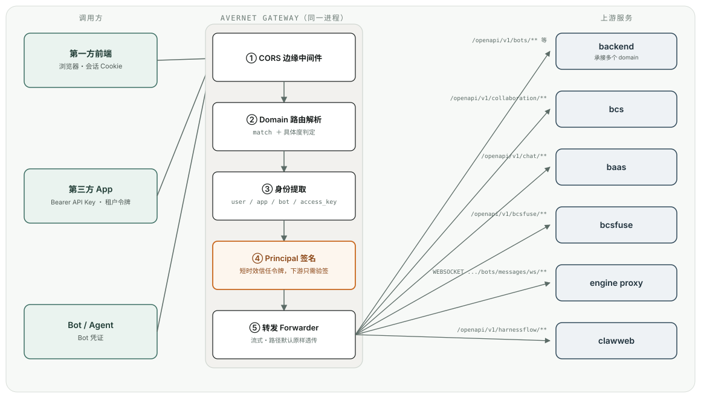
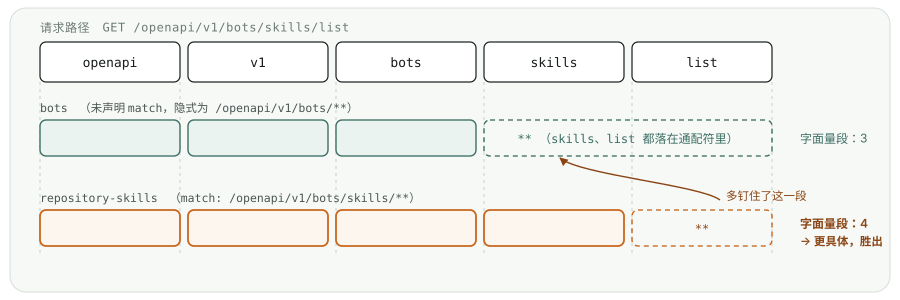

# Avernet Gateway 设计分享

`src/gateway`（gateway-community） · 面向内部对齐 / 第三方接入交流

---

## 目录

1. 网关是什么、解决什么问题
2. 整体架构：可插拔的微内核
3. 一次请求的完整生命周期
4. 认证设计：身份如何被识别与传递
5. 转发设计：配置驱动的路由
6. 网关的职责边界（做什么 / 不做什么）
7. **接入指南**：把网关当作你服务的代理，需要配置什么
8. 落地检查清单 & 参考资料

---

## 1. 网关是什么

- 统一的**入站流量入口**：所有对外 API（前端、第三方开发者、Bot/Agent）都先经过网关，再转发到具体的后端服务（`backend` / `bcs` / `baas` / `bcsfuse` / `engine proxy` / `clawweb` …）。
- 核心定位就两件事：
  - **认证**：把各种凭证（登录态 cookie、第三方 API Key、Bot 凭证、租户令牌…）统一解析成**中立的身份对象**（Principal），签名后转发给下游。
  - **转发**：按照**配置**（而不是代码）把请求路由到正确的上游服务，下游服务的地址、鉴权要求都能通过改配置调整，不需要网关发版。
- 定位是"边缘（Edge）"，不是"业务网关"：**不做资源级授权、不做业务逻辑**，这些留给下游各组件自己处理。

---

## 2. 为什么要有这一层

在网关出现之前的痛点（详见 `src/gateway/specs/2026-07-24-gateway-config-driven-forwarding/spec.md`）：

- **每个 API 定义两遍**：网关手写一份 stub 只是为了生成文档 / 挂鉴权，后端又真正实现一遍，两份定义容易漂移。
- **认证各组件各写一套**：每个后端组件都要自己对接 OIDC/SSO/第三方 Key 校验，重复造轮子且标准不一致。
- **第三方接入没有统一入口**：第三方开发者需要认识多个内部服务地址与各自的认证方式。

网关把"认证"和"转发拓扑"这两件横切关注点**收敛到一处**，后端组件只需要"验签 + 消费身份"，不用再自己对外谈认证协议。

---

## 3. 整体架构：可插拔的微内核

网关基于依赖注入（`dependency_injector`）构建，每个可替换能力都遵循同一模式：

```
SPI 协议（Protocol）  →  bare/stub 实现（开源默认）  →  PluginContainer Selector（运行时选择）
```

| Selector | 配置项 | 开源默认 | 作用 |
|---|---|---|---|
| `forwarder` | `plugins.forwarder` | `httpx` | 转发请求到上游 |
| `schema_catalog` | `plugins.schema_catalog` | `file` | 拉取/缓存上游 OpenAPI 描述，用于生成对外文档 |
| `cache` | `plugins.cache` | `stub` | 分布式缓存抽象 |
| `auth` | `plugins.auth` | `stub` | 第一方登录用户校验 |
| `authn.app_token` / `authn.tenant` | `plugins.authn.*` | `stub` | 第三方 App / 租户校验 |
| `database` | `plugins.database` | `SQLITE_ORM` | 应用/租户/凭证元数据存储 |

**两种 flavor：**

- **`bare`（社区版）**：开源、无内部依赖，桩实现即可跑通最小闭环，适合单机/自部署。
- **`sofa`（企业版）**：接入公司内部体系（BUService 等），通过 `plugin_registry.register_plugin_option()` 在启动期挂载真实实现，**策略/核心代码零改动**。

> 由 `GATEWAY_RUN_MODE` 环境变量决定使用哪种 flavor —— 这也是架构宪法里"配置驱动装配、mode 不下沉到业务代码"的具体体现。

---

## 4. 一次请求的完整生命周期

```
客户端
  │
  ▼
① CORS 预检 / 边缘中间件      —— 浏览器跨域场景在这里被统一处理，上游自己的 CORS 头会被剥离
  │
  ▼
② 路由解析（Domain 解析）     —— 取路径 base_path 后的第一段（或更具体的 match 规则），
  │                              决定这条请求属于哪个"domain"，从而决定转发到哪个上游服务
  ▼
③ 身份认证（identity 提取）   —— 按该路由声明的身份要求（user/app/bot/access_key，
  │                              每个 required/optional），逐类身份跑各自的提取器链
  ▼
④ Principal 签名               —— 网关用私钥/共享密钥对解析出的身份签名，生成短时效的
  │                              信任令牌（类 JWT），下游只需验签，不用再自己接认证系统
  ▼
⑤ 转发（Forwarding）           —— 路径原样转发到上游（除非配置了 rewrite 前缀替换），
  │                              请求体以流式传输，支持大文件上传且内存占用有界
  ▼
后端服务（backend/bcs/baas/bcsfuse/engine proxy/…）
  │
  ▼
⑥ 响应回传                     —— 流式回传响应，去重响应头，过滤 hop-by-hop 头
```

**关键设计取舍：**

- **未命中任何路由规则 = 拒绝**（fail-closed）。网关**绝不做开放代理**——只转发到配置里明确声明过的 domain。
- **凭证缺失 vs 凭证非法是两种不同语义**：缺失就跳过（换下一个提取器/判该身份不存在），非法（比如坏 token）**立即硬失败、绝不回退**，防止一个坏凭证被悄悄放过去试别的路径。

---

## 5. 认证设计：身份如何被识别

### 5.1 四种身份类型（判别联合 / discriminated union）

| 身份类型 | 代表谁 | 典型凭证 |
|---|---|---|
| `user` | 真实登录用户（自家前端 / 人工调用） | 会话 Cookie（`IAM_TOKEN`/`SSO_TOKEN` 等），未来可扩展 OAuth Bearer |
| `app` | 第三方开发者的应用本身 | `Authorization: Bearer <api_key>` |
| `bot` | Bot / Agent 自身 | Bot 专属凭证 |
| `access_key` | 访问密钥持有方 | Access Key Token |

> 每种类型的字段**只在它成立的形态下存在**，不用"可空字段 + 运行时判断"表达非法状态（例如 `UserPrincipal` 不会带 `app` 字段）——这是仓库对 `T | None` 的一贯要求在这里的落地。

### 5.2 两层提取模型

```
身份类型（AuthStrategy，如 UserStrategy）
    └── 有序的提取器链（IdentityExtractor），例如 user: [session_cookie, oauth_bearer]
            每个提取器先自判"认不认得这个凭证"：
              不认得 → 返回 None，链条继续试下一个
              认得且合法 → 返回 Principal，链条到此为止
              认得但非法 → 抛错，直接 401，不再回退
```

- **系统级配置**：决定每类身份启用哪些提取器、顺序如何（运维改配置即可新增来源，比如给 `user` 追加 OAuth，不用改代码）。
- **每路由配置**：`x-avernet-security`（写在各后端服务自己的 OpenAPI spec 里）声明这个接口需要哪些身份、是 `required` 还是 `optional`，网关构建期把它汇总成一张 `route_security` 表。

```yaml
# route_security 示例（application.yaml）
route_security:
  "/**":                          { user: required }          # 顶层默认：所有接口都要求登录用户
  "/openapi/v1/bots/**":          { user: optional, app: optional }  # 对第三方开放：用户或App任一即可
  "/openapi/v1/bots/logs/**":     { user: required, app: required }  # 敏感接口：两者都要
  "WEBSOCKET /openapi/v1/bots/messages/ws/**": {}              # 显式声明"无需身份"（凭证已在握手URL里）
```

匹配规则：**更具体的路径覆盖更一般的路径**；同路径下"带 method 的规则"优先于"不带 method 的规则"；命中的规则**整条生效**，不与更通用的规则做字段合并；`"/**"` 兜底，任何未命中的路由一律 fail-closed 拒绝。

### 5.3 网关 ↔ 下游的信任：签名 Principal

- 下游组件**不能相信一个裸的身份头**（绕过网关直连、伪造头、重放截获的令牌都是真实威胁）。
- 方案：网关对解析出的 Principal **签名**（短 TTL、绑定目标受众 `aud`），下游组件用对应的验签插件校验后再反序列化消费。
- 这正是"下游组件跑 `auth.mode=none`"的准确含义——它们不再各自对接认证系统，只验证"这确实来自网关、没被篡改"。

---

## 6. 转发设计：配置驱动的路由

### 6.0 为什么转发在应用层，而不是 Nginx / L7 代理

一个常见的第一反应是："转发不就是 Nginx/Envoy 配几条 `location`/路由规则的事吗，为什么要专门写一个应用来做？"

原因是**转发和认证必须是同一个不可分割的动作，而认证逻辑没法完全下沉到通用 L7 代理里**：

- 每条请求在转发前都要先跑完身份提取（§5.2）——判断凭证类型、按 flavor 调用不同的校验后端、必要时对 Principal 签名。这些逻辑本质是**业务/基础设施相关的代码**，而不是声明式的路由规则；尤其是 `sofa`（企业版）flavor，往往要调用公司内部的 SDK、连接内部的密钥管理/用户体系——这类深度定制在 Nginx/Envoy 这类通用网关里通常只能靠不太可控的插件机制（Lua 脚本、自定义模块）勉强实现，维护成本和风险都远高于一个原生应用。
- 把"认证"和"转发"放进同一个进程、同一次请求处理里，才能保证**认证先于转发发生**这件事是结构性成立的，而不是靠两套系统之间的约定去维持。
- 同一套 SPI/Plugin 架构（bare/sofa）在应用层下可以让社区版和企业版**共享同一份转发/路由代码**，差异只体现在认证依赖的插件实现上；如果转发在基础设施层、认证在应用层，两边就要各自维护一份路由声明，容易漂移。

所以网关是一个真正的应用进程（FastAPI + httpx），路由/转发的决策和认证的决策**发生在同一份代码、同一次请求生命周期里**，而不是"Nginx 转发 + 应用只管鉴权"的两层架构。

### 6.1 核心概念：Domain

- 请求路径 `base_path`（如 `/openapi/v1`）之后的**第一段**默认就是一个 **domain**，domain 决定转发到哪个上游 `server`。
- 一个请求的首段如果**不是**已配置的 domain → 直接拒绝。网关**只转发进已知 domain，永远不是开放代理**。

```yaml
upstreams:
  base_path: /openapi/v1
  domains:
    bots:
      server: backend            # /openapi/v1/bots/** → backend
    collaboration:
      server: bcs                # /openapi/v1/collaboration/** → bcs
      protocols: [http, websocket]
    chat:
      server: baas                # /openapi/v1/chat/** → baas
  servers:
    backend: { base_url: "${backend_server_url}" }
    bcs:     { base_url: "${bcs_server_url}" }
    baas:    { base_url: "${baas_server_url}" }
```

**整体拓扑**（客户端 → 网关内部各阶段 → 上游服务；边上标注的是 `application.yaml` 里真实存在的代表性 domain）：



**读图要点：**

- 客户端**不直连任何上游**——三类调用方（前端 / 第三方 App / Bot）都只认识网关这一个地址，网关内部才知道每个 domain 该去哪个上游。
- 网关内部①～⑤ 是**同一个请求生命周期里的顺序阶段**，不是几个独立服务（呼应 §6.0："转发和认证是同一个不可分割的动作"）——身份必须先解析出来、签好名，才轮到转发。
- 一个上游可能同时被**多个 domain** 指向（如 `backend` 同时接住 `bots`、`org`、`repository-skills`、`spaces` 等好几个 domain 的流量），图上只画了每个上游的代表性前缀；完整映射见 §8.1 与 `configs/application.yaml`。
- 到达上游的请求会带着网关签好名的 Principal（§5.3），上游只需验签，不用再各自对接认证系统。

### 6.2 进阶能力一览

| 能力 | 说明 |
|---|---|
| `match` | 声明这个 domain 具体 claim 哪些路径（比默认的"整段前缀"更精细），可以把一个 domain 放在另一个 domain 的子路径下，转发到不同上游 |
| `protocols` | 声明这个 domain 服务哪个"平面"：`http`、`websocket`，或两者都要。没声明 `websocket` 的 domain 不会被 WS 握手命中 |
| `rewrite` | 声明前缀替换（网关路径 → 上游路径不同时使用）。默认**路径原样转发**，只换 origin |
| `schema` | 声明去哪里读这个 domain 的 OpenAPI 描述，用于生成对外文档（`file` 本地文件 / `object_store` 对象存储 / `http` 拉取），**纯文档用途，不影响路由/鉴权/转发** |

`match`、`protocols`、`rewrite` 三者共同决定"这条请求最终归哪个 domain"，下面两节分别展开最容易问到的两点：**`match` 如何实现"把一个 domain 嵌进另一个 domain 里"**，以及**多个 domain 都能匹配同一条路径时，网关到底怎么选**。

### 6.3 `match`：如何声明子路径、"覆盖"父级 domain

**语法：** 一串**字面量段**，可选地接上若干 `{param}` 段（每个 `{param}` 只吃一段，之后还能再接字面量段），最后以 `**` 收尾。

**不写 `match` 的默认值** 是 `<base_path>/<domain名>/**`——也就是"整段前缀路由"这个所有 domain 出场时都有的默认行为。一个什么都不声明的 domain，地址完全不变。

**"覆盖"的真正含义：把一个 domain 放在另一个 domain 的路径之下，转发到不同的上游/走不同的平面。** 这不是配置意义上的"字段合并覆盖"，而是**整条规则互斥地取代**——一旦某个 domain 的 `match` 在某次请求上胜出，这次请求的 `server`/`protocols`/`rewrite`/`schema` **完全由这个胜出的 domain 决定**，跟它"父级"（路径更短的那个 domain）的配置**没有任何合并关系**。

用仓库里 `bots` 这一组真实配置举例（都在 `application.yaml` 的 `upstreams.domains` 下）：

```yaml
domains:
  bots:
    server: backend                        # 隐式 match: /openapi/v1/bots/**
    # 未声明 protocols → 默认 [http]，所以这个 domain 只服务 HTTP

  repository-skills:
    match: /openapi/v1/bots/skills/**       # 比 bots 多钉了一段字面量 "skills"
    server: backend                         # 恰好也转发到 backend，但作为独立 domain
                                             # 可以单独声明自己的 schema（对外文档粒度更细）

  bots-messages-ws:
    match: /openapi/v1/bots/messages/ws/**  # 嵌在 bots 路径之下
    server: engine_proxy                    # 但转发到完全不同的上游！
    protocols: [websocket]                  # 且只服务 WebSocket 平面
    rewrite: { from: /openapi/v1/bots/messages/ws, to: /proxypass }

  bots-loadtest-ws:
    match: /openapi/v1/bots/loadtest/ws/**  # 同样嵌在 bots 路径之下
    server: backend                         # 这次上游还是 backend（跟 bots 一样）
    protocols: [websocket]                  # 但 bots 本身默认只服务 http，
                                             # WebSocket 握手必须靠这个专门声明的 domain 才有地方落
```

这组例子说明了两件常被忽略的事：

1. **"嵌套子路径"不一定是为了换上游。** `bots-loadtest-ws` 的上游服务器和 `bots` 完全一样，声明它的唯一原因是 `bots` 没有声明 `protocols`（因此只服务 `http`），WebSocket 握手需要一个明确声明了 `protocols: [websocket]` 的 domain 才能被接住——否则这类请求会直接 404（"no route for path"）。
2. **一个更具体的 domain 完全不需要跟外层 domain 的配置保持一致。** `bots-messages-ws` 的上游、协议、路径改写规则都和 `bots` 毫不相关——它只是恰好复用了 `bots` 这个前缀下的一段子路径而已。这正是"把一个 domain 的运维（backend）和运行时（engine proxy）拆到不同上游，但对外呈现为同一个前缀"的手段（详见 `specs/2026-08-03-gateway-path-specific-domain-routing/spec.md`）。

**启动期的两条硬性校验**（防止 `match` 被滥用）：

- **禁止开放代理写法**：`match` 靠前的字面量段必须钉住 `base_path` 再加至少一个具体段；`{param}` 只能出现在这些字面量段**之后**。也就是说 `match: /**` 或 `match: /openapi/v1/{anything}/**` 这种"一上来就是通配符"的写法**在启动时直接被拒绝**——这就是让"配出一个开放代理"在配置语法层面就不可能表达的机制。
- **禁止 `rewrite` 永远打不中的规则**：`rewrite.from` 必须是这个 domain 自己 `match` 前缀的**前缀**，否则这条改写规则永远不可能命中，启动时直接报错拒绝，而不是留到线上才发现改写从没生效过。

### 6.4 一个例子：两个 domain 都能接住同一条请求，网关选谁？

`match` 允许多个 domain 的声明范围产生重叠。仓库里正好有一对真实的 domain 可以拿来走一遍这个过程：

- `bots`：没写 `match`，隐式覆盖 `/openapi/v1/bots/**`
- `repository-skills`：`match: /openapi/v1/bots/skills/**`

来一条请求 `GET /openapi/v1/bots/skills/list`，看网关怎么选：

**第一步：谁"够得着"这条路径？** 两个都够得着——`skills/list` 落在 `bots` 的 `**` 里，`list` 落在 `repository-skills` 的 `**` 里。两个 domain 也都服务 HTTP（都没有把自己限定成 `websocket` 专用），所以两个都进候选名单。

**第二步：比谁"钉住"的字面量段更多。** 把请求路径拆成一节一节，看每个 domain 的 `match` 能把哪几节钉死成字面量、从哪一节开始就撒手交给 `**`：



`repository-skills` 多钉死了 `skills` 这一段（4 段 vs 3 段），**更具体，赢得这条请求**。结果是：这条请求的转发目标、路径改写规则、对外文档，**完全由 `repository-skills` 的配置决定**，`bots` 的配置对这条请求不起任何作用——即便 `bots` 的 `**` 本来也"接得住"。

**两边钉住的字面量段数一样呢？** 那就看谁多带了 `{参数}` 段——多带的那个更具体（等于把路径钉得更深一层）。如果连这个也一样，说明这两个 domain 的声明范围产生了网关判不出优先级的重叠，**这种配置在启动时就会被直接拒绝**并点名冲突的 domain，不会留到线上才发现"结果取决于谁先注册"这种不确定行为。

> **一个常见误解要澄清：** "候选名单"是按平面（HTTP / WebSocket）**先筛一遍、筛完就定了**，不是"最具体的赢了、但它答不了这个平面，于是退而求其次转发到另一个 domain"。一个 domain 只要不服务某个平面，它在这个平面上就**根本不算候选**，不存在"重试到下一个"这回事——这样路由结果才是确定的，不会因为平面不同而悄悄改判给别的上游。

### 6.5 大请求体转发（Forwarder 契约 v2）

- 请求体以**流式**方式转发，不整体缓冲进内存，支持大文件上传且内存占用有界；一次性流不能被用于重定向/挑战认证/重试等场景的重放。

---

## 7. 网关的职责边界

**网关负责：**

- 统一认证入口，产出并签名一个中立身份对象
- 基于配置的路由与转发（含 CORS、WebSocket 中继、大请求体流式转发）
- 汇总各后端自己发布的 OpenAPI 描述，生成统一的对外 API 文档
- 粗粒度的租户/身份校验（这个身份能不能用这条 route）

**网关不负责（留给下游组件自己做）：**

- 资源级 / 细粒度授权（"这个人能不能访问 Bot X"）
- 业务逻辑
- 请求/响应的数据形状定义（网关不重写 shape，直接采用后端自己发布的 API 描述）

> 边界原则："契约即权威"——每个 API 的鉴权要求写在它自己的 spec 里，网关只**执行**、不内嵌 per-API 分支；"交付层薄，核心与传输无关"——网关只翻译鉴权上下文，不拥有领域策略。

---

## 8. 接入指南：把网关当作你服务的代理，你需要配置什么

如果你要接入网关（无论是把自己的后端服务挂到网关后面，还是作为第三方开发者调用经网关暴露的 API），需要关注以下几块配置——它们全部集中在网关唯一的运行时配置文件 `configs/application.yaml`（`user_config` 段）里。

### 8.1 转发：把你的服务接进来

在 `upstreams.servers` 里声明你的服务地址，在 `upstreams.domains` 下声明一个 domain 指向它：

```yaml
upstream_vars:
  your_service_url: http://127.0.0.1:9000   # 建议用变量占位，区分环境

upstreams:
  domains:
    your-domain:
      server: your_service
      # 可选：只想暴露某个子路径、或路径需要改写时才加：
      # match: /openapi/v1/your-domain/**
      # rewrite: { from: /openapi/v1/your-domain, to: /internal-prefix }
      # protocols: [http]        # 需要 WebSocket 就写 [http, websocket] 或 [websocket]
  servers:
    your_service:
      base_url: "${your_service_url}"
```

要点：
- 地址值**必须带 scheme**（`http/https/ws/wss`），否则启动直接拒绝。
- 默认路径**原样透传**，能不写 `rewrite` 就不写——这是"网关是透明转发层"的关键性质。
- 你的服务**不需要**在网关里重复定义接口的入参出参；网关只把请求原样转发，接口形状仍由你自己的服务定义与发布。

### 8.2 认证：这条路由需要什么身份

在 `route_security` 里，给你的 domain 加上一条规则，声明需要哪些身份、是否必需：

```yaml
route_security:
  "/openapi/v1/your-domain/**":
    user: required        # 只允许登录用户
  # 或者对第三方开放：
  "/openapi/v1/your-domain/public/**":
    app: required          # 只允许持有 API Key 的第三方应用
  # 或者两者皆可：
  "/openapi/v1/your-domain/mixed/**":
    user: optional
    app: optional          # 注意：网关只校验"身份是否存在"，
                            # 具体业务上"至少要有一个"的组合逻辑要在你自己服务里兜底校验
```

不写规则 = 继承更靠外层（最终是 `"/**"`）的默认要求，目前默认是 `user: required`。

**如果你是第三方开发者**（自己的服务器代表你的终端用户调用网关暴露的 API），你需要：

1. **申请一个 App 凭证（API Key）**：向平台注册后拿到一个 32 位的明文 API Key（只在注册时返回一次，请务必妥善保存——网关只存哈希，无法找回明文）。
2. **每次调用带上 `Authorization: Bearer <api_key>`**。
3. 如果这条路由要求了 `tenant` 归属校验，还需要带上租户令牌（如 `X-Tenant-Token`），网关会用它解析出租户并与你的 App 注册记录做交叉校验，不一致会被拒绝。
4. 如果需要代表某个终端用户办事而不是纯以自身身份调用，可以带上一个**不透明**的终端用户句柄（如 `X-End-User-Id`）——它只用于归属/配额/审计，**不会被当作已验证身份做跨租户/跨组织的资源判定**。

### 8.3 CORS：浏览器要跨域调用时

只有**浏览器发起**的跨域请求才需要关心这一块（服务器到服务器调用不受 CORS 限制）：

```yaml
cors:
  allow_origins:
    - "https://your-frontend.example.com"
  allow_origin_regex:
    - "https://[a-z0-9-]+\\.preview\\.example\\.com"
```

- 每个 origin 必须**精确列出**或用正则**锁定完整 host**；`allow_origins: ["*"]` 或形如 `https://.*` 的"抓一切"正则会在启动时直接被拒绝——因为响应带 `Access-Control-Allow-Credentials: true`，通配符等于向全网开放带凭证的跨域调用。
- overlay 配置是**整体替换**列表，不是追加，别忘了把本地开发要用的 localhost 也重复写一遍。

### 8.4 Principal 签名：让下游能验证身份

如果**你自己的服务**是网关的下游（而不是通过 HTTP 调网关的第三方），你的服务需要：

- 部署一个 `PrincipalVerifier`（bare 用共享密钥 HMAC 校验；企业版可用非对称密钥/JWKS）
- 与网关约定同一把签名密钥（`principal_signer.secret_name`，通过 `SecretResolver` 从环境变量/密钥管理系统读取，**没有兜底默认密钥**——没配就直接拒绝启动或转发失败，避免"用了一把谁都验不过的密钥却装作认证成功"）
- 校验请求头里网关签发的短时效 Principal 令牌，取代自己原来的登录态校验逻辑

### 8.5（可选）对外文档：让第三方开发者自助接入

如果你的服务要暴露给第三方开发者，建议发布自己的 OpenAPI 描述，并在 `internal_api_docs` / `domains.<name>.schema` 里声明来源：

```yaml
schema:
  source: file            # 单机场景：本地提交的文件
  # source: object_store  # 部署场景：CI 发布到对象存储（S3/OSS/MinIO…），网关自动拉取最新版
  # source: http          # 或者从一个 HTTP 端点拉取
  path: schemas/your-domain.openapi.json
  refresh_seconds: 300
```

这只影响**网关聚合生成的文档**，不影响路由/鉴权/转发——文档源不可用时只会让文档接口降级为"用上一份已知良好的版本"，不会影响线上真实流量。

---

## 9. 落地检查清单

给需要接入网关的团队/合作方一份自查表：

- [ ] 服务地址已加入 `upstream_vars`，且带正确的 scheme
- [ ] 已在 `upstreams.domains` 声明 domain，明确 `match`（如需要）/ `protocols`（如需要 WebSocket）
- [ ] 已在 `route_security` 为新路径声明身份要求（不声明则继承默认 `user: required`）
- [ ] 若作为下游组件消费签名身份：已接入 `PrincipalVerifier`，与网关的签名密钥/受众（`aud`）对齐
- [ ] 若面向第三方开发者开放：已完成 App 注册、拿到 API Key，并清楚哪些接口需要租户令牌
- [ ] 若有浏览器直连场景：前端 origin 已加入 `cors.allow_origins`（精确值或锁定 host 的正则）
- [ ] 若要生成对外文档：已发布自己的 OpenAPI 描述，并声明了 `schema` 来源
- [ ] 大文件/流式场景：确认自己的服务端兼容 chunked / 未知长度的请求体

---

## 10. 参考资料

- 架构总览：`src/gateway/README.md`
- 认证整体设计：`src/gateway/docs/2026-07-21-auth-design.md`
- 认证管线（当前实现形态：User/Bot/App 判别联合 + 提取器链）：`src/gateway/specs/2026-07-27-gateway-authn-identity-pipeline/spec.md`
- 配置驱动转发设计：`src/gateway/specs/2026-07-24-gateway-config-driven-forwarding/spec.md`
- 路径级 Domain 路由：`src/gateway/specs/2026-08-03-gateway-path-specific-domain-routing/spec.md`
- 第三方 API Key 凭证方案：`src/gateway/specs/2026-08-13-application-api-key-credentials/spec.md`
- 应用/租户/访问密钥 canonical schema：`src/gateway/specs/2026-07-30-application-tenant-accesskey-schema/spec.md`
- 唯一运行时配置文件（含完整注释）：`src/gateway/configs/application.yaml`
