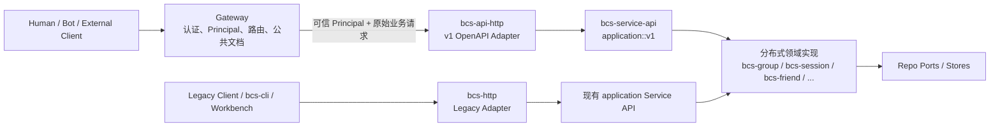
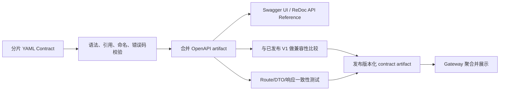

# BCN OpenAPI V1 架构与接口设计

> 状态：Draft for review
>
> 日期：2026-07-28
>
> 范围：`src/bcs`、`src/gateway`
>
> 文档类型：架构与接口设计文档（High-Level Design）

## 1. 文档定位

本文记录 BCN 第一阶段 OpenAPI 改造的目标、边界、关键架构决策、API
范围、身份与授权模型、crate 组织、契约治理和演进方式。

本文不是最终的 OpenAPI Contract，也不是逐文件的实施计划：

- 本文回答“为什么这样设计、组件边界是什么、第一阶段做什么”。
- 仓库中的 OpenAPI YAML 回答“每个接口准确接受和返回什么”，是接口契约的唯一事实来源。
- 后续实施计划回答“按什么顺序修改哪些文件、运行哪些测试”。

设计遵循 `docs/arch/arch.rules.md`：契约先行、核心逻辑与传输解耦、Delivery
Adapter 不承载领域策略、依赖只指向声明的 Service API。

## 2. 背景与问题

BCN 当前在 `bcs-http` 中维护一套长期演进的 Legacy HTTP API。生产链路、
Workbench、`bcs-cli` 和 E2E 脚本仍然使用这些接口。Legacy API 同时包含身份
提取、HTTP DTO、兼容逻辑和历史语义，例如部分 Group 消息接口允许 Human
指定自己拥有的 Bot 作为 sender。

新的平台调用链在 BCN 上游增加统一 Gateway：

1. 外部调用者只访问 Gateway。
2. Gateway 认证原始凭证并形成规范化 Principal。
3. Gateway 将可信 Principal 传给 BCN。
4. BCN 不再解析外部用户的 Cookie、Token 或 AgentPass，而是根据 Principal
   和 BCN 自己拥有的资源关系执行授权。

改造必须同时解决：

- 新增稳定、可版本化的 OpenAPI 和 Internal API 边界。
- 保持全部 Legacy 生产接口继续工作。
- 避免 TeamClaw 与 BCN 在 `/bots` 路径下发生资源所有权冲突。
- 把身份认证与资源授权分开。
- 让 HTTP Adapter、Application Service 和领域实现保持正确依赖方向。
- 从权威 Contract 自动生成文档并自动阻止不兼容修改。

## 3. 目标与非目标

### 3.1 第一阶段目标

- 新增 `/openapi/v1/**` 公共 API，不修改 Legacy 路由及语义。
- OpenAPI 和 Internal API 都经由 Gateway。
- Gateway 建立规范化 Principal，BCN 执行资源级授权。
- 第一阶段覆盖 Group、Session、Participant、Invitation 和 Friendship。
- 为新接口建立独立的 HTTP Adapter 和版本化 Application Service API。
- 以 OpenAPI YAML 为接口事实来源，生成合并文档和可浏览的 API Reference。
- 建立契约校验、实现一致性测试和向后兼容检查。

### 3.2 第一阶段非目标

- 不下线或收紧 `POST /groups/{id}/messages`、`POST /groups/{id}/chat`
  等 Legacy 接口。
- 不为 Legacy API 接入新的权限模型。
- 不提供 Group 级消息发送接口。
- 不提供 `POST /openapi/v1/sessions/{session_id}/messages`。
- 不设计 SSE；现有 WebSocket 和 callback 也不属于本次改造。
- 不包含 Actor 目录、Bot Registration、Provider、Service Invocation、
  CollaborationTemplate、StateMachineRun、Session File 和 collect。
- 不引入 ServiceKey、ProviderPrincipal 或 Gateway 自身发起请求的
  InternalService Principal。
- 不在本阶段确定 Gateway 与 BCN 之间 Principal 签名、密钥轮换和验签的最终实现。

## 4. 核心架构



新旧 HTTP Adapter 共享领域能力和存储，但不共享 HTTP DTO、路由和兼容逻辑。
这使新接口可以建立更严格的身份、授权和错误契约，而不会改变生产中的 Legacy
行为。

### 4.1 组件职责

| 组件 | 职责 |
| --- | --- |
| Gateway | 校验外部凭证，形成 Principal，执行入口级策略，按资源域路由，聚合公共 OpenAPI 文档 |
| `bcs-api-http` | 新 V1 HTTP 路由、DTO、Principal 提取接口、协议校验、Envelope 和错误映射 |
| `bcs-http` | 只维护现有 Legacy HTTP 行为 |
| `bcs-service-api::application::v1` | 新 V1 Use Case 契约，不依赖 Axum 或 HTTP 类型 |
| 领域 service crates | 实现授权后的业务规则和 Use Case orchestration |
| store crates | 实现 Repo Port、持久化和查询 |
| bootstrap | 注入具体实现，同时挂载 Legacy 与 V1 Router |

## 5. 路径与资源所有权

### 5.1 公共与内部路径

| API 类型 | 路径 | 说明 |
| --- | --- | --- |
| OpenAPI | `/openapi/v1/**` | 面向产品、Bot 和外部集成；路径不包含 `bcn` |
| Internal API | `/api/v1/bcn/**` | 面向受信任内部服务和运维工具；保留 `bcn` 服务命名空间 |
| Legacy API | 现有路径 | 不改名、不迁移、不改变语义 |

版本位于 API 类型之前的共同层级。代码目录因此采用 `v1/openapi` 和
`v1/internal`，而不是分别采用 `openapi/v1` 和 `internal/v1`。

### 5.2 Gateway 路由

Gateway 按 `/openapi/v1` 后的首段资源域选择上游。第一阶段只需按资源域配置，
不需要为每个 operation 配置 `contract_owner`：

| 资源域 | 上游 |
| --- | --- |
| `groups` | BCN |
| `sessions` | BCN |
| `actors` | BCN |
| `invitations` | BCN |
| `friend-requests` | BCN |

BCN 不占用 Gateway 的 `/openapi/v1/bots/**`。该路径由 TeamClaw Bot 资源所有者
维护。BCN 对协作网络中的身份统一使用 `Actor`：

- BotActor 的 `actor_id` 等于 BCN `bot_uuid`。
- Friendship 第一阶段虽然只支持 BotActor，但路径仍使用 `actors`。
- Gateway 解析到的 Bot UUID 必须能够稳定映射为同一个 BCN `bot_uuid`。

Gateway 首次接入 BCN 时需要增加上述资源域到同一个 BCN upstream 的映射；后续
同一资源域下新增兼容 operation 不需要逐接口改 Gateway。

## 6. Principal 与信任边界

### 6.1 当前事实

Gateway 当前实现了 `UserPrincipal`：

- `type = user`
- `tenant`
- `scopes`
- `subject: AuthenticatedUser`

`AuthenticatedUser` 是认证插件返回的中立用户对象，当前包含稳定用户 ID、用户名
以及可选展示名称、全名和租户信息。它不是 BCN 的领域 Actor。

当前 Gateway 尚未实现 BotPrincipal。Gateway 的认证设计已经提出“签名的短期
Principal Token”方向，但 Gateway 到 BCN 的签发、转发和验签尚未完成接入。

### 6.2 BCN 目标接口

BCN 新 API 只接受投影后的领域 Principal：

```text
Principal
├── Human { actor_id, authenticated_user, tenant, scopes }
└── Bot   { actor_id, tenant, scopes }
```

约束如下：

- Bot `actor_id == bot_uuid`。
- Human 的 canonical `actor_id` 必须由 Gateway/身份映射契约明确提供；BCN
  不应根据可变的 `username` 或展示字段自行猜测。
- BCN 不接触外部原始 Cookie、Bearer Token 或 AgentPass。
- ProviderPrincipal、ServiceKey 和 InternalService 不在第一阶段 union 中。

当前 Gateway `UserPrincipal.subject.id` 与 Legacy BCN `human_{staff_no}` 的最终
映射仍需 Gateway/身份负责人确认。这是上线前置项，不应在业务代码中用 fallback
掩盖。

### 6.3 Principal 如何进入 BCN

V1 HTTP Adapter 定义抽象的 Principal 获取接口。Route 只从请求扩展中读取已经
验证的 Principal：

```text
Gateway principal token
        │
        ▼
PrincipalVerifier / extractor
        │  验签、aud/iss/exp 校验、反序列化
        ▼
BCN Principal
```

本地开发和单元测试可以注入静态 Principal；生产环境不能信任裸
`X-Avernet-Principal` JSON Header。最终机制需满足：

- 请求确实来自合法 Gateway。
- Principal 未被篡改。
- Token 绑定 BCN audience。
- Token 有短 TTL，并支持密钥轮换。
- 失败时 fail closed，返回统一 `401`，不回退到 Legacy 身份提取。

签名 JWT、mTLS 加签 Header 或其他实现可以后续确认，但不会改变 Route 和
Application Service 使用 Principal 的接口。

## 7. 授权模型

### 7.1 认证与授权分离

- Gateway 回答“调用者是谁、入口凭证是否合法”。
- BCN 回答“该 Principal 是否能对目标 BCN 资源执行该 Action”。

HTTP Route 不直接判断 `created_by`、Participant role 或 Friendship。Route 将
Principal、Action 和资源标识交给 Application 层。授权策略从 BCN 已有领域关系
派生，不维护一套与领域数据重复的细粒度 ACL。

建议的稳定 Action 粒度包括：

```text
GroupRead / GroupCreate / GroupManage
GroupParticipantManage
SessionRead / SessionCreate / SessionManage / SessionComplete
SessionParticipantManage
SessionMessageRead
InvitationCreate / InvitationAccept
FriendshipRead / FriendshipManage
FriendRequestCreate / FriendRequestDecide
```

Action 是 Application 层概念，不暴露 HTTP 状态码。

### 7.2 关键授权原则

- Group 和 Session 的读取、管理权限从 creator、manager、直接 Participant
  和 SessionParticipant 关系推导。
- Participant 自身可以退出；manager/creator 可以管理普通 Participant；不能
  通过删除破坏 driver 等领域不变量。
- Invitation 创建者必须有目标 Group/Session 的管理权限；接受邀请以当前
  Human Principal 加入，不允许 body 指定加入者。
- Friendship 仅存在于两个 BotActor 之间。Bot 可以管理自身关系；Human 可以
  基于 `created_by` 关系管理其创建 Bot 的 Friendship。
- “Human 可以管理其创建的 Bot”不等于“Human 可以作为该 Bot 发言”。
- 新接口中的 Actor 身份来自 Principal 或受授权的资源管理参数，不能通过
  `sender`、`from` 等字段改变调用身份。
- Provider 能否管理目标 Provider/Bot 等资源，留待 ProviderPrincipal 阶段处理。

### 7.3 对 Legacy 的影响

新授权模型只用于 V1 API。第一阶段不修改 Legacy 的身份提取、兼容授权和返回
格式，也不下线 Group 级消息接口。Legacy 下线需要后续独立方案、调用方迁移和
生产流量确认。

## 8. 第一阶段 OpenAPI

第一阶段采用“领域闭环最小集”：覆盖 Group、Session、Participant、Invitation
和 Friendship 的管理闭环，不机械复制 Legacy Router。共 27 个 operation。

### 8.1 Group

| Method | Path | Operation |
| --- | --- | --- |
| GET | `/openapi/v1/actors/{actor_id}/groups` | 查询 Actor 参与的 Group |
| POST | `/openapi/v1/groups` | 创建 Group |
| GET | `/openapi/v1/groups/{group_id}` | 获取 Group 详情 |
| PATCH | `/openapi/v1/groups/{group_id}` | 修改 Group 可变属性 |
| DELETE | `/openapi/v1/groups/{group_id}` | 删除 Group |

`GET /actors/{actor_id}/groups` 使用
`membership=all|direct|session_only` 过滤，默认 `all`。`session_only` 是关系
过滤条件，不单独设计成子资源。

### 8.2 GroupParticipant

| Method | Path | Operation |
| --- | --- | --- |
| POST | `/openapi/v1/groups/{group_id}/participants` | 添加 GroupParticipant |
| PATCH | `/openapi/v1/groups/{group_id}/participants/{actor_id}` | 修改 Participant 可变属性 |
| DELETE | `/openapi/v1/groups/{group_id}/participants/{actor_id}` | 移除 Participant 或自行退出 |

Group 详情包含 Participants，第一阶段不增加独立列表接口。

### 8.3 Session

| Method | Path | Operation |
| --- | --- | --- |
| POST | `/openapi/v1/groups/{group_id}/sessions` | 在 Group 中创建 Session |
| GET | `/openapi/v1/groups/{group_id}/sessions` | 查询 Group 下的 Session |
| GET | `/openapi/v1/sessions/{session_id}` | 获取 Session 详情 |
| PATCH | `/openapi/v1/sessions/{session_id}` | 修改 Session 可变属性 |
| DELETE | `/openapi/v1/sessions/{session_id}` | 删除 Session |
| POST | `/openapi/v1/sessions/{session_id}/completion` | 完成 Chat Session |
| GET | `/openapi/v1/sessions/{session_id}/messages` | 查询 Session 消息历史 |

`completion` 表达带授权、状态校验和副作用的单次生命周期转换，不混入普通
`PATCH Session`。

明确不提供：

```http
POST /openapi/v1/sessions/{session_id}/messages
```

现有发送能力继续通过 Legacy `POST /sessions/{sid}/chat` 服务现有调用方。

### 8.4 SessionParticipant

| Method | Path | Operation |
| --- | --- | --- |
| POST | `/openapi/v1/sessions/{session_id}/participants` | 添加 SessionParticipant |
| PATCH | `/openapi/v1/sessions/{session_id}/participants/{actor_id}` | 修改 Participant mode |
| DELETE | `/openapi/v1/sessions/{session_id}/participants/{actor_id}` | 移除 Participant 或自行退出 |

Session 详情包含 Participants，第一阶段不增加独立列表接口。新接口不继承
Legacy Session Chat 的 Human 自动加入行为；未加入的 Human 必须先通过
Participant 管理或 Invitation 加入。

### 8.5 Invitation

| Method | Path | Operation |
| --- | --- | --- |
| POST | `/openapi/v1/groups/{group_id}/invitations` | 创建 Group Invitation |
| POST | `/openapi/v1/sessions/{session_id}/invitations` | 创建 Session Invitation |
| POST | `/openapi/v1/invitations/{token}/accept` | 接受邀请并加入目标资源 |

Invitation 保存目标类型和目标 ID，因此接受邀请不再拆成 Group Join 和 Session
Join 两套 endpoint。

### 8.6 Friendship

| Method | Path | Operation |
| --- | --- | --- |
| GET | `/openapi/v1/actors/{actor_id}/friendships` | 查询 Actor 的 Friendship |
| DELETE | `/openapi/v1/actors/{actor_id}/friendships/{friend_actor_id}` | 解除 Friendship |
| POST | `/openapi/v1/friend-requests` | 发起好友申请 |
| GET | `/openapi/v1/actors/{actor_id}/friend-requests` | 查询发出或收到的申请 |
| POST | `/openapi/v1/friend-requests/{request_id}/accept` | 接受好友申请 |
| POST | `/openapi/v1/friend-requests/{request_id}/reject` | 拒绝好友申请 |

## 9. 第一阶段 Internal API

第一阶段 Internal API 是空集，即不新增 `/api/v1/bcn/**` 业务 operation。

原因：

- Gateway 转发 OpenAPI 请求不等于 Internal API，不需要为每个 OpenAPI 复制
  一套内部路由。
- 当前草案中的 Internal API 只有 Provider 创建和 StateMachineRun。
- Provider 与 StateMachineRun 均已明确延后。

以下 operation 保留为后续候选，不进入 V1 第一阶段：

| Deferred endpoint | 原因 |
| --- | --- |
| `POST /api/v1/bcn/providers` | Provider/ProviderPrincipal 延后 |
| `POST /api/v1/bcn/groups/{group_id}/state-machine-runs` | StateMachineRun 延后 |
| `GET /api/v1/bcn/state-machine-runs/{run_id}` | StateMachineRun 延后 |
| `GET /api/v1/bcn/state-machine-runs/{run_id}/graph` | StateMachineRun 延后 |
| `GET /api/v1/bcn/state-machine-runs/{run_id}/nodes/{node_id}` | StateMachineRun 延后 |
| `POST /api/v1/bcn/state-machine-runs/{run_id}/cancel` | StateMachineRun 延后 |

保留 `v1/internal` 目录边界，但不创建无业务意义的占位 Route。

## 10. HTTP Contract 约定

### 10.1 统一响应

所有 V1 JSON 响应使用：

```json
{
  "code": 20000,
  "message": "OK",
  "data": {},
  "request_id": "req_..."
}
```

- 字段使用 `snake_case`。
- 时间使用 Unix milliseconds。
- 成功码使用 `20000`、`20100`、`20200`。
- 业务错误使用稳定五位码；前三位与 HTTP status 对齐。
- 面向调用者的错误信息稳定且安全，内部错误细节只进入日志。
- Gateway 传入或生成 request ID，BCN 全链路传播并回传。

### 10.2 分页和幂等

- 列表接口使用统一分页结构，第一阶段采用 `offset`、`limit` 和总量/下一页元数据。
- 查询结果必须定义稳定排序，不能依赖数据库默认顺序。
- DELETE 在资源已经不存在时采用幂等成功，但不能泄露调用者无权知道的资源存在性。
- Invitation 接受、FriendRequest 决策和 Session completion 必须定义重复请求语义。

### 10.3 身份字段

- Request body 不允许携带用于覆盖 Principal 的 caller、sender 或 from。
- 资源管理请求可以携带目标 `actor_id`，但必须由 BCN 授权层验证关系。
- `GET Session Messages` 不允许调用方通过查询参数切换到无权代表的 Bot 视角。

### 10.4 Gateway 鉴权声明

新 Contract 不再把 BCN 本地的 `humanCookie`、`botRuntimeBearer`、
`agentPassBearer` 当作 BCN Route 自己解析的凭证。每个 operation 通过 Gateway
约定的 `x-avernet-security` 描述入口 Principal 要求；Gateway 可以在最终公共
文档中生成标准 OpenAPI security 描述。

## 11. Crate 与代码组织

### 11.1 HTTP Adapter

新增独立 crate，不把新 V1 Route 混入 Legacy `bcs-http`：

```text
crates/adapters/http/bcs-api-http/src/
└── v1/
    ├── common/
    │   ├── envelope.rs
    │   ├── error.rs
    │   ├── request_id.rs
    │   └── principal.rs
    ├── openapi/
    │   ├── router.rs
    │   ├── state.rs
    │   ├── dto/
    │   └── routes/
    └── internal/
        ├── router.rs
        ├── state.rs
        ├── dto/
        └── routes/
```

第一阶段 Internal API 为空时，可以只保留模块边界，不注册空路由或虚假
endpoint。

`bcs-api-http`：

- 可以依赖 Axum、Serde 和 `bcs-service-api`。
- 不能依赖具体 `services/*` 实现。
- HTTP DTO 留在 Delivery Adapter，不进入 Service API。
- 只把 HTTP 输入映射成 Application Command，把 Application Error 映射成
  HTTP Envelope。

### 11.2 Application Service API

继续使用现有 `bcs-service-api` crate，在其中增加版本模块：

```text
crates/service-api/bcs-service-api/src/application/
└── v1/
    ├── mod.rs
    ├── principal.rs
    ├── authorization.rs
    ├── group.rs
    ├── session.rs
    ├── invitation.rs
    └── friendship.rs
```

约定：

- 版本体现在模块路径 `application::v1`，类型名不使用
  `V1GroupApplication`、`V1SessionApplication` 等前缀。
- 不增加 `application::coordination::v1` 中间层；`coordination` 没有提供额外
  边界价值。
- 一个源文件只定义一个版本的 Application Contract，不在同一文件混合 V1/V2。
- Application 类型不依赖 HTTP Request、Response、StatusCode 或 Axum。
- 共享领域实体继续使用无传输版本前缀的领域模型；V1 Command/Result 只描述
  Use Case 输入输出。

### 11.3 分布式实现

不创建实现全部 Application API 的“god crate”。实现继续按领域分布：

```text
bcs-group/src/application/v1.rs       -> Group、GroupParticipant、Invitation
bcs-session/src/application/v1.rs     -> Session、SessionParticipant、completion
bcs-friend/src/application/v1.rs      -> Friendship、FriendRequest
bcs-message/src/application/v1.rs     -> Session message history query
```

具体文件可按现有 crate 结构拆分，但依赖方向保持：

```text
bcs-api-http
      │
      ▼
bcs-service-api::application::v1
      ▲
      │ implements
bcs-group / bcs-session / bcs-friend / bcs-message
```

Bootstrap 是唯一选择和组装具体实现的地方。

### 11.4 Legacy 为什么不需要“Legacy Application crate”

Legacy `bcs-http` 已经依赖现有 `bcs-service-api::application`，其实现也已分布在
领域 service crates 中。没有必要为了目录对称再创建一个 Legacy Application
crate，也不应为了新 API 反向重构 Legacy 调用链。

## 12. Contract 与自动文档

### 12.1 权威源

建议把当前外部设计稿迁入仓库：

```text
src/bcs/api-contracts/v1/
├── openapi/
│   ├── groups.yaml
│   ├── sessions.yaml
│   ├── invitations.yaml
│   └── friendships.yaml
├── internal/
├── domain-models.yaml
├── shared.yaml
└── openapi.yaml
```

YAML Contract 是权威源，生成的 HTML、合并 JSON/YAML 和 SDK 不是手工维护源文件。

### 12.2 自动化流水线



CI 至少检查：

- OpenAPI 3.1 语法和 `$ref` 完整性。
- `/openapi/v1/**` 与 `/api/v1/bcn/**` 命名空间不混用。
- `operationId` 全局唯一。
- 每个 operation 有明确 Principal 要求和错误码。
- Router 注册的 Method/Path 与 Contract 一致。
- 请求/响应 DTO 与 Schema 一致。
- 相对上一已发布 V1 不存在 breaking change。

以下属于 breaking change，必须使用新 major version：

- 删除或重命名 operation、字段或枚举值。
- 把可选请求字段改成必填。
- 收窄合法输入。
- 改变字段类型、默认值或已承诺语义。
- 将原本允许的 Principal 或资源关系改为拒绝。

只增加 optional 字段、新 operation 或新错误细分通常属于兼容修改，但仍需契约
测试。

### 12.3 Contract 与代码 PR 流程

Contract 和实现应逻辑分离评审，但不能让“已发布 Contract”和线上实现长期
不一致：

1. 设计 PR：本文档，确认边界和 operation 集合。
2. Contract PR：提交候选 YAML、Schema、示例和兼容性检查；候选状态不进入
   已发布文档。
3. Implementation PR：实现 Application Service、Adapter、授权和 conformance
   tests，可作为 Contract PR 的 stacked PR。
4. 发布时原子地激活实现和对应 Contract artifact。

如果仓库无法表达“候选但未发布”的 Contract，则 Contract 与实现必须放在同一
PR 中，以满足架构规则要求的“Contract 变更同时具有文档和 conformance test”。

## 13. 测试与发布

### 13.1 测试层次

| 层次 | 验证内容 |
| --- | --- |
| Contract validation | YAML、Schema、错误码、路径、`operationId` |
| Application unit tests | Principal、Action、领域关系和状态转换 |
| HTTP contract tests | Method/Path、DTO、Envelope、错误映射、request ID |
| Gateway integration tests | 资源域路由、Principal 传递、未知域拒绝 |
| Principal trust tests | 无签名、过期、错误 audience、篡改 Principal 全部拒绝 |
| Legacy regression | 现有 Legacy contract、CLI 和 E2E 不回归 |
| End-to-end | Client → Gateway → BCN → store 的主要用户故事 |

授权测试至少覆盖：

- Human/Bot 合法访问。
- 未认证和无权限访问。
- Human 管理自己的 Bot 资源关系。
- Human 不能把资源管理权解释成 Bot 发言权。
- 跨 Group、跨 Session 和跨租户访问。
- 已删除、已完成和重复请求。

### 13.2 发布顺序

1. 合并领域/Application 能力和 V1 Adapter，但不开放 Gateway 路由。
2. 完成 Principal 签名/验签接入和 E2E。
3. 发布 BCN Contract artifact。
4. Gateway 增加 BCN 资源域映射并聚合文档。
5. 开放流量并观察错误率、延迟和授权拒绝。

回滚优先关闭 Gateway 的 BCN 资源域暴露；Legacy Router 和生产调用链保持不变。

## 14. 已知待定项与上线门槛

以下问题不阻止定义 Application/Adapter 边界，但阻止生产开放：

1. Gateway BotPrincipal 的正式 Schema、认证入口和实现。
2. Human `AuthenticatedUser.subject.id` 到 BCN canonical `actor_id` 的映射。
3. Gateway → BCN Principal 的签名、传递、验签、audience 和密钥轮换。
4. BCN 资源域在 Gateway 配置中的最终注册名称。
5. 权限 scope 词表；在其落地前，BCN 仍必须执行完整资源关系授权。

第一阶段 Internal API 为空不是待定项。未来只有出现明确内部调用者和无法通过
OpenAPI 表达的受信任 Use Case 时，才新增 Internal API。

## 15. 决策摘要

| 决策 | 结论 |
| --- | --- |
| Legacy 兼容 | Legacy Router 保持功能和语义，不在本阶段下线 |
| 公共路径 | `/openapi/v1/**`，不包含 `/bcn` |
| Internal 路径 | `/api/v1/bcn/**` |
| 第一阶段 Internal API | 空集 |
| 资源命名 | BCN 使用 `actors`，不与 TeamClaw `/bots` 冲突 |
| Bot ID | `actor_id == bot_uuid` |
| 身份职责 | Gateway 认证并形成 Principal；BCN 做资源授权 |
| Human 管理 Bot | 可以管理已确认的资源关系，不能代表 Bot 发言 |
| Session 消息 | 只开放 GET history，不开放 POST send |
| Group 消息 | 不进入新 API；Legacy 暂不下线 |
| V1 HTTP Adapter | 新增独立 `bcs-api-http` crate |
| Application API | 在现有 `bcs-service-api::application::v1` 中定义 |
| Application 实现 | 按 Group/Session/Friend/Message 领域 crate 分布 |
| 版本命名 | 版本放模块路径，不加到类型名前缀 |
| API 文档 | 从 YAML Contract 自动生成 |
| 兼容性 | V1 breaking change 由 CI 阻止，新 major version 承载破坏性变更 |
