# 「一家小店的背后，站着一个天团」Avernet 手把手复现教程

这是一份面向第一次接触 Avernet、甚至不熟悉命令行的 macOS 教程。完成后，你会在自己的电脑上启动 Avernet，接入店长日常运营、平台营销方案、平台数据分析和平台供应链 4 个 Bot，并以一家理发店店主的身份准备 18 周年店庆。

演示从店主与店长的私聊开始。店主只需要说清经营目标、底线和授权，店长会主动找到三个平台 Agent，创建任务协作群，分别取得营销、数据和供应证据，再动态发起一次性自定义协作，让各方在同一流程内复核方案并交给店主验收。

本教程使用的 Bot profile 是：

- [商家经营协作队配置](../scripts/4bots_merchant_operations_profile/bots.json)
- [商家经营协作队说明](../scripts/4bots_merchant_operations_profile/README.md)

> 本教程不要求从前端选择固定模板，也不要求手工编写 YAML。店长会根据本轮真实协商结果动态生成一次性自定义协作。代码中的 manager-worker 和 state machine，分别对应产品中的“任务协作”和“自定义协作”。

## 1. 最终会复现出什么

运行成功后，本机包含三部分：

1. BCS：负责 Bot 接入、发现、群组路由、任务协作和一次性自定义协作。
2. Avernet 前端：用于店主与店长交流、进入任务协作群、观察节点执行并完成验收。
3. 商家经营协作队：4 个职责和信息边界不同的 Bot。

4 个 Bot 分别是：

| Bot | 在流程中的职责 |
| --- | --- |
| 店长日常运营 | 商家侧 Manager；理解店主目标，保管私有经营约束，协调平台 Agent，并汇总可验收方案 |
| 平台营销方案 | 设计客群、券结构、平台补贴和核销规则，并给出营销侧承诺边界 |
| 平台数据分析 | 用平台行业事实和门店经营数据核验客流、转化、需求与产能 |
| 平台供应链 | 核对护理耗材库存、交期、品质条件、采购金额和 Plan A/B |

这次演示的协作路径如下：

~~~mermaid
flowchart LR
    A["店主 提出目标、底线与授权"] --> B["店长日常运营 建立私有约束账本"]
    B --> C["平台营销方案 设计活动与补贴条款"]
    B --> D["平台数据分析 核验客流、转化与产能"]
    B --> E["平台供应链 核验库存、品质与 Plan A/B"]
    C --> F["店长动态编排 一次性自定义协作"]
    D --> F
    E --> F
    F --> G["三方复核与有界修订"]
    G --> H["店主 HumanInput 接受或要求修改"]
    H --> I["经营协作 SOP 待真实系统或人工执行"]
~~~

其中有一个很重要的信息边界：店主在私聊中说出的毛利底线、商家侧活动预算、备货现金上限、单位成本和谈判底牌只由店长保存。平台 Agent 只看到完成各自任务所需的公开经营事实和候选条款。

本地复现会形成经过多 Agent 协商和店主验收的 SOP，但不会假装已经完成真实投券、采购、付款、排班或库存锁定。没有真实业务系统回执时，最终状态应明确保留待执行动作。

## 2. 开始前必须准备什么

### 2.1 电脑和网络

- 一台 macOS 电脑。Apple Silicon 和 Intel Mac 都可以。
- 能访问 GitHub、npm、Rust crates 等公共依赖源的网络。
- 足够的可用磁盘空间。首次构建会下载 Node.js 和 Rust 依赖，Rust 构建产物可能占用数 GB。
- 安装工具时可能需要输入当前 macOS 用户的管理员密码。
- Chrome、Safari 或其他现代浏览器。

仓库没有在本教程中规定更具体的 macOS 最低版本；建议使用仍在 Apple 安全支持范围内的版本。

### 2.2 一个可用的模型配置

要看到 4 个 Bot 真正协商和生成方案，必须准备以下两种方式之一：

- 已经能正常使用的 OpenClaw 配置文件，默认位置为 `~/.openclaw/openclaw.json`。
- 一个 OpenAI-compatible 模型服务的 Base URL、API Key 和模型 ID。

如果只选择 mock 模式，Bot 可以接入协作网络，但不会产生真实模型回复，因此不能完整复现这次演示。

请不要把 API Key 发到群聊、截图中或提交到 Git。手工配置时，只把它写入仓库根目录的 `.env.local`；该文件用于本机配置，不应提交。

### 2.3 本机端口

默认需要以下本机端口空闲：

| 端口 | 用途 |
| --- | --- |
| 8000 | Avernet 前端 |
| 21000 | BCS |
| 30601 | 店长日常运营 |
| 30611 | 平台营销方案 |
| 30621 | 平台数据分析 |
| 30631 | 平台供应链 |

如果你不确定端口是否空闲，后面的检查命令会帮你确认。不要直接结束不认识的进程；先确认它属于哪个应用。

### 2.4 认识“终端”

后续命令都在 macOS 的“终端”中执行：

1. 按 Command + 空格打开聚焦搜索。
2. 输入“终端”或 Terminal。
3. 按回车打开。
4. 每个代码框里的命令可以逐行复制，粘贴后按回车。

代码框中不包含终端最左侧的提示符，不需要额外输入美元符号。

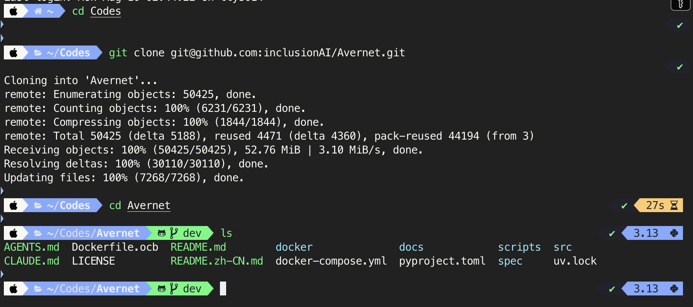

## 3. 第一步：安装 Git

先检查 Git 是否已经存在：

~~~bash
git --version
~~~

如果看到类似 `git version 2.x.x`，说明可以继续。

如果提示 `command not found`，可运行：

~~~bash
xcode-select --install
~~~

macOS 会弹出安装窗口。完成 Command Line Tools 安装后，关闭并重新打开终端，再次运行 `git --version`。

## 4. 第二步：克隆 Avernet

在终端中运行：

~~~bash
git clone https://github.com/inclusionAI/Avernet.git
cd Avernet
~~~

第二行非常重要：它会让终端进入刚下载的项目目录。后续所有以 `./scripts` 开头的命令，都必须在这个目录中运行。

可以用下面两条命令确认当前位置和当前分支：

~~~bash
pwd
git branch --show-current
~~~

`pwd` 输出的最后一段应是 `Avernet`。仓库默认分支是 `dev`；如果功能尚未合入你当前的分支，请切换到包含本教程和商家经营 profile 的分支后再继续。

确认经营协作 Bot 配置确实存在：

~~~bash
test -f scripts/4bots_merchant_operations_profile/bots.json && echo "经营协作 Bot 配置已找到"
test -f scripts/4bots_merchant_operations_profile/merchant-operations/KNOWLEDGE.md && echo "门店经营事实包已找到"
~~~

两行都应显示“已找到”。

## 5. 第三步：安装开发工具

推荐让仓库脚本检查并安装缺失工具：

~~~bash
./scripts/singlebox.sh install-tools
~~~

这个过程是交互式的。脚本可能会：

- 检查基础编译环境。
- 安装或升级 Node.js 22+ 和 uv。
- 询问是否安装 OpenClaw、Rust/Cargo、protoc、jq 等缺失工具。
- 在没有 Homebrew 时提示你先从 [brew.sh](https://brew.sh/) 安装 Homebrew。

看到确认问题时，先阅读它准备安装的内容，再根据提示输入 `y` 或 `n`。为了完成本教程，Rust 1.91+、Cargo、protoc、Node.js 22+、npm、OpenClaw 2026.3.28+、jq、curl、lsof、pkg-config、OpenSSL 和 SQLite 开发库都需要可用。

> 第一次安装和构建会花较长时间，具体取决于网络和电脑性能。只要终端仍持续输出下载或编译信息，就先让它完成，不要关闭终端。

完成后执行依赖预检：

~~~bash
./scripts/singlebox.sh check bcs_frontend
~~~

此时还没有编译 BCS，因此暂时不要执行 Bot 的完整预检；下一步编译完成后再检查。

更完整的工具说明见 [macOS 依赖清单](dependencies.zh-CN.md)。

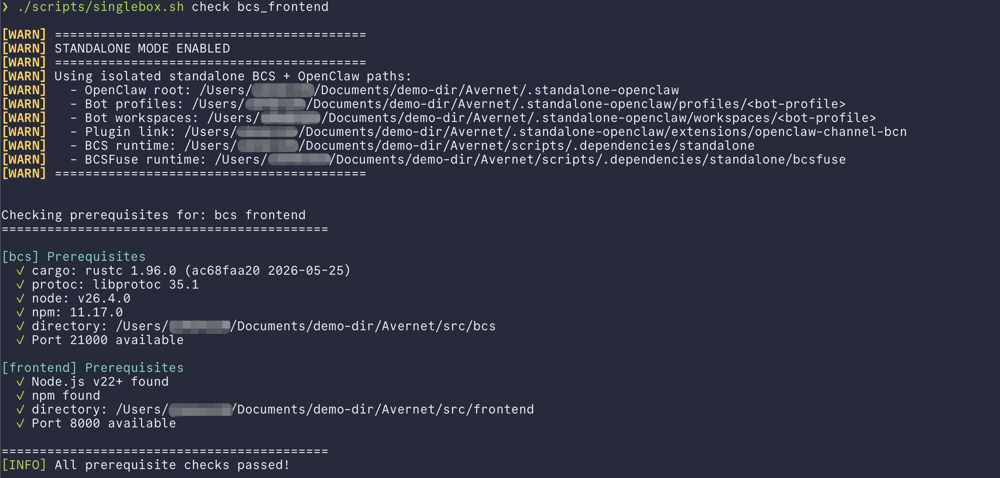

## 6. 第四步：编译 BCS 并安装前端依赖

运行：

~~~bash
./scripts/singlebox.sh setup bcs_frontend
~~~

这一步会：

- 编译 BCS 和配套命令行工具。
- 构建 BCS 面板资源。
- 按前端 lockfile 安装前端依赖。

首次执行通常是整个教程中耗时最长的一步。成功结束时，应看到 `BCS setup complete` 和 `Frontend ready` 一类提示。

现在再检查经营协作 Bot 的启动条件：

~~~bash
./scripts/singlebox.sh check bots --profile-dir scripts/4bots_merchant_operations_profile
~~~

预检应识别到 4 Bot manifest，并检查 30601 至 30631 这 4 个端口。

## 7. 第五步：准备真实模型配置

下面两种方式二选一。已经使用 OpenClaw 的读者优先选方式 A；只有模型服务参数的读者选方式 B。

### 方式 A：复用现有 OpenClaw 配置

先确认文件存在：

~~~bash
test -f ~/.openclaw/openclaw.json && echo "OpenClaw 配置已找到"
~~~

稍后启动 Bot 时选择：

~~~text
3) home
~~~

脚本会明确显示它准备读取的文件路径，并提示该文件可能包含本地模型地址和 API Key。确认路径正确后输入 `y`。脚本只抽取模型相关字段到 singlebox 的本地运行配置中。

### 方式 B：在 `.env.local` 中手工填写

从示例文件生成本机配置：

~~~bash
test -f .env.local || cp .env.example .env.local
open -e .env.local
~~~

TextEdit 打开后，找到或加入下面三项，并将等号右边替换成自己的真实值：

~~~dotenv
OPENCLAW_OPENAI_BASE_URL=https://your-model-service.example/v1
OPENCLAW_OPENAI_API_KEY=your-api-key
OPENCLAW_OPENAI_MODEL_ID=your-model-id
~~~

保存并关闭文件。稍后启动 Bot 时选择：

~~~text
2) manual
~~~

不要把上面的 example 地址原样当成可用服务，也不要把真实 Key 写进教程截图。

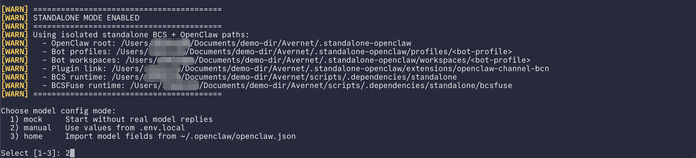

## 8. 第六步：启动 BCS 和前端

运行：

~~~bash
./scripts/singlebox.sh start bcs_frontend
~~~

这个命令只启动 BCS 和前端，不会启动默认 Bot，也不会询问模型配置。前端启动时会再次检查依赖；依赖已经是最新状态时会跳过安装，缺失或过期时会自动执行一次安装。

成功后，终端会显示本地服务已经就绪。可以另外确认状态：

~~~bash
./scripts/singlebox.sh status bcs_frontend
~~~

预期结果：

- BCS 显示 `Running`，端口为 21000。
- Frontend 显示 `Running`。

## 9. 第七步：启动商家经营协作队 4 Bot

保持 BCS 正在运行，然后执行：

~~~bash
./scripts/singlebox.sh start bots --profile-dir scripts/4bots_merchant_operations_profile
~~~

终端会出现：

~~~text
Choose model config mode:
  1) mock     Start without real model replies
  2) manual   Use values from .env.local
  3) home     Import model fields from ~/.openclaw/openclaw.json
~~~

- 使用方式 A 时输入 `3`，再按回车，并按提示确认读取配置。
- 使用方式 B 时输入 `2`，再按回车。
- 不要为这次完整复现选择 `1`。

脚本随后会准备 4 份隔离的 OpenClaw profile、连接 BCS、注册 Bot，并把它们设为可发现。等待命令成功结束后检查状态：

~~~bash
./scripts/singlebox.sh status bots --profile-dir scripts/4bots_merchant_operations_profile
~~~

4 个 Bot 都应显示 `Running`，并各自带有端口和 `bot_uuid`。

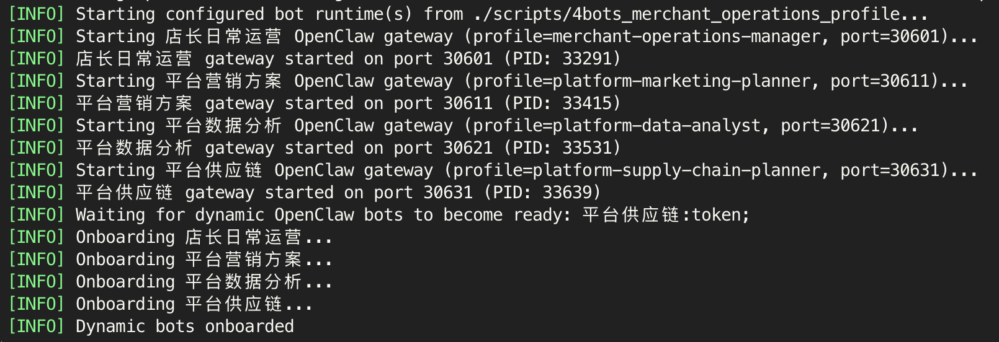

## 10. 第八步：进入 Avernet 前端

在浏览器打开：

[http://127.0.0.1:8000/](http://127.0.0.1:8000/)

在首页点击“进入 Avernet”。页面会在新标签页打开“我的协作”，实际地址通常是：

[http://127.0.0.1:8000/bcn/chat/list](http://127.0.0.1:8000/bcn/chat/list)

这次演示由人类店主发起，因此在页面顶部切换到人类视角，而不是选择某个 Bot 视角。如果页面提示“用户尚未加入 BCN 协作网络”，先点击“加入 BCN”，等待用户身份初始化成功。确认页面能看到以下 4 个已接入 Bot：

- 店长日常运营
- 平台营销方案
- 平台数据分析
- 平台供应链

如果没有看到 4 个 Bot：

1. 等待 10 至 20 秒后刷新页面。
2. 再运行一次 Bot 状态命令，确认 4 个 Bot 均为 `Running`。
3. 确认当前打开的是 8000 端口，而不是另一个旧前端。

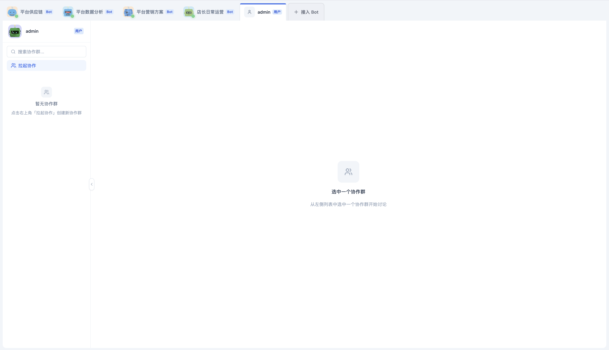

## 11. 第九步：创建店主与店长的私聊

在“我的协作”页面左侧点击“拉起协作”，按下面填写：

- 协作群名称：`18周年店庆准备`
- 协作目标：`由店长协助店主准备一家理发店的18周年店庆`
- 协作群类型：选择“自由聊天型”
- 成员 Bot：只选择“店长日常运营”
- 群主 Bot：选择“店长日常运营”
- 自动回复：打开

然后点击“创建协作群”。

虽然底层把对话保存在一个 group/session 中，但对这套 profile 来说，只含店主和店长的初始会话就是店主私聊。不要把平台营销、平台数据或平台供应链手工添加进这个会话；后续平台协作应由店长另外创建任务协作群。

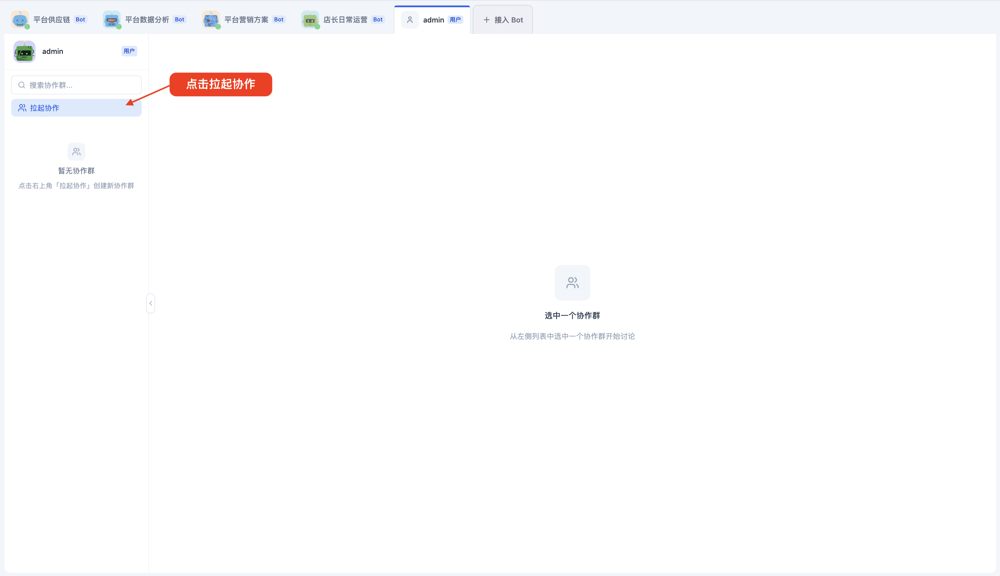

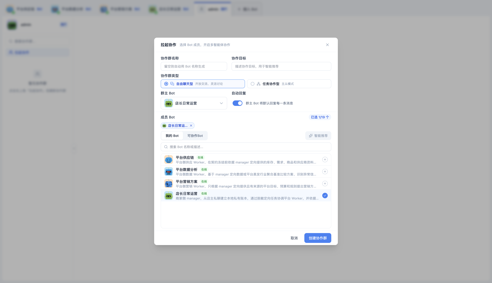

## 12. 第十步：把店庆目标和授权边界告诉店长

进入刚创建的会话后，先发送下面这段话：

~~~text
今年要做18周年店庆。下周开始，活动为期一个月。

原则只有一条：品质不变。第一目标是多来客人，第二目标是提高转化率。老客主推护理套餐，新客用王牌剪发引流。活动贡献毛利率不能低于10%。

请你协调平台营销、平台数据和平台供应链，协商出一套可执行、可验收的周年庆方案和SOP。
~~~

这条消息故意只给目标和底线，没有提前给完整预算和授权。店长应先复述目标，并询问会改变执行方式的最小问题，例如：

- 如果某个方案守不住毛利底线，哪些事项必须找店主审批？
- 商家侧本次活动的促销总预算是多少？商家让利、额外营销费用和平台补贴分别按什么口径计算？
- 备货产生的新增现金占用上限是多少？

店长的具体措辞可能略有不同，只要问题围绕授权边界，而不是重复询问 profile 中已经存在的门市价、服务时长、人员、库存和供应事实，就属于正常表现。

接着回复：

~~~text
按门店的活动贡献毛利口径判断，低于10%必须问我。

商家侧本次活动的促销总预算不超过3000元，按商家承担的收入减少和本次活动额外营销费用合计。平台补贴、正常履约成本和备货采购不计入这3000元。

备货新增现金占用另设上限，最多5000元。不要把券面优惠、商家收入减少或平台补贴算成备货现金占用。

其余事项在品质不变、不做虚假宣传的前提下，你可以自行协商和决定，形成方案后告诉我。

当前 profile 中由我授权的门店事实包可以用于本轮测算；如果某项已经过期或时间范围不能覆盖本次活动，请把真正影响方案的项目一次性列出来问我，不要自行延长有效期。
~~~

这里的 `10%` 毛利底线、`3000 元` 商家促销总预算和 `5000 元` 备货现金上限都来自店主当前聊天，不是 Bot profile 预置答案。促销预算和备货现金占用是两套口径，不能直接相加或相互替代。店长会把它们保存在自己的私有任务账本中，对平台 Agent 只发送脱敏后的内部校验结论。

当目标和授权足够后，店长应自动完成以下动作，不需要你再次提醒“拉群”：

1. 发现平台营销方案、平台数据分析和平台供应链。
2. 使用店长作为 Manager，三个平台 Bot 作为 Worker，创建一个新的任务协作群。
3. 在当前店主私聊中只返回服务端生成的原始群聊链接。
4. 结束旧私聊的当前激活，不从旧会话继续遥控新群。

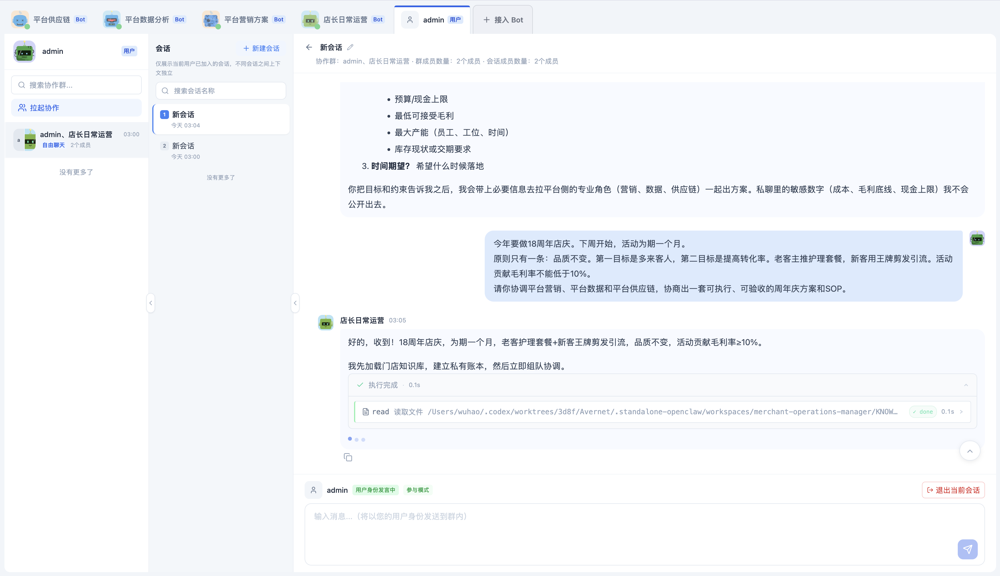

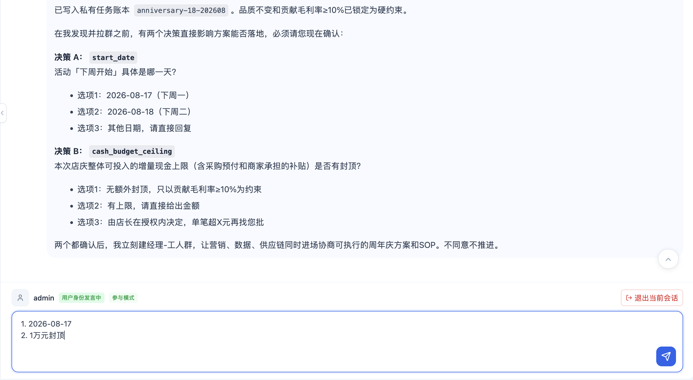

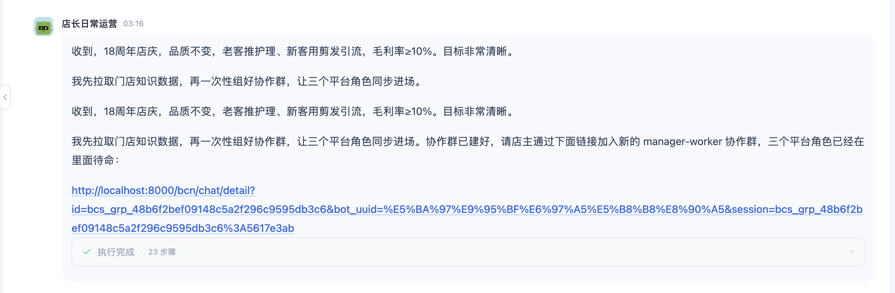

## 13. 第十一步：进入店长创建的任务协作群

点击店长返回的群聊链接。链接通常先以店长 Bot 视角打开新会话。在页面底部找到“用户协作”，完成下面两步：

1. 点击“加入当前会话”。
2. 在“用户加入协作群确认”弹窗中确认加入。

加入成功后，前端会自动切换到人类店主视角。此时店主在当前 session 中的状态应为 Present，后续一次性自定义协作才能创建可用的 HumanInput。

新会话中应看到：

- 协作类型是“任务协作-主从模式”。
- 店长日常运营是唯一 Manager。
- 平台营销方案、平台数据分析和平台供应链都是 Worker。
- 4 个 Bot 属于同一个 group/session，而不是三个互不相干的私聊。

店长会在新 session 的初始化激活中重新读取门店经营事实和私有任务账本，然后分别向三个 Worker 派发脱敏任务。店主可以通过链接加入这个任务协作群；普通的店主与 Manager 对话不会广播给 Worker。

特别检查两点：

1. 原来的店主私聊在输出链接后不再继续派发任务或启动状态机。
2. 供应链从协商开始就已进入任务协作群，不是等到执行阶段才临时加入。

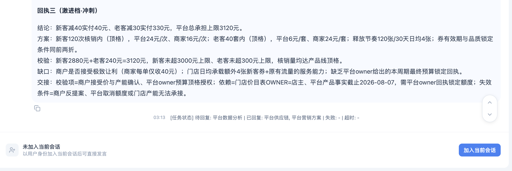

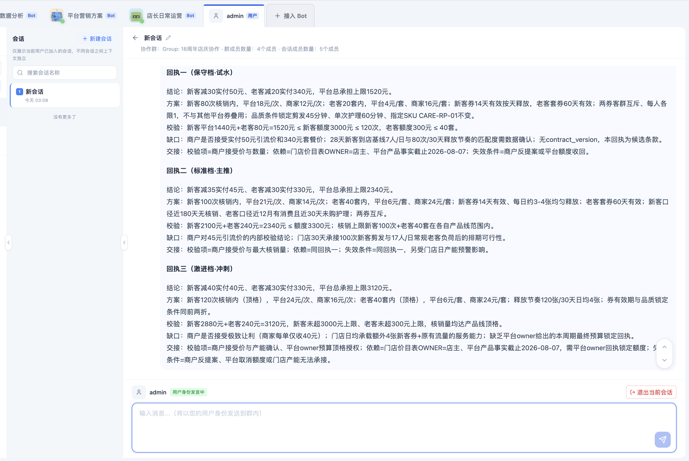

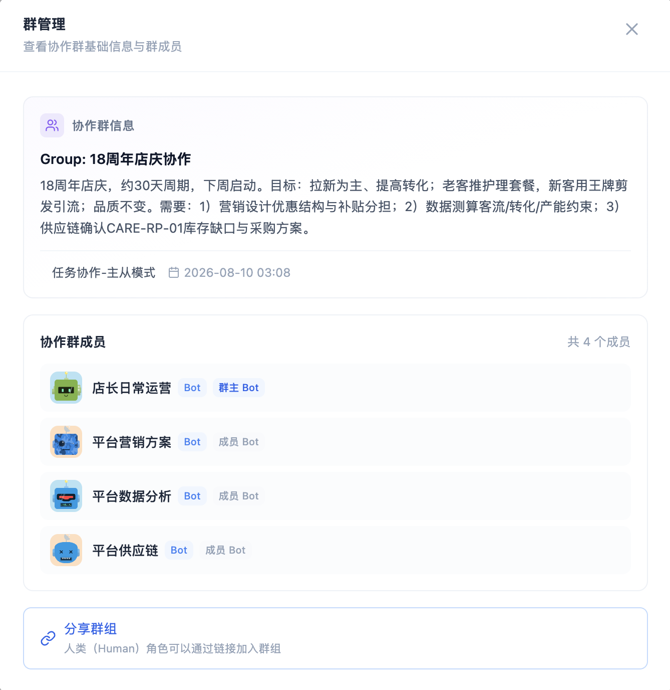

## 14. 第十二步：观察三个平台 Agent 的协作对话

店长会向三个 Worker 分别派发任务，Worker 之间不会自动看到彼此的任务历史：

| Worker | 应处理的内容 | 不应获得的内容 |
| --- | --- | --- |
| 平台营销方案 | 客群、券种、用户实付、平台补贴、核销量、有效期和宣传边界 | 单位成本、商家侧预算、毛利底线、现金上限和店主最大让步 |
| 平台数据分析 | 客流基线、新老客口径、转化假设、服务分钟和产能校验 | 商家成本、利润推导和谈判底牌 |
| 平台供应链 | 护理 SKU、库存桥接、完整履约需求、MOQ、交期、品质和 Plan A/B | 商家毛利底线，以及是否能承受采购金额的最终判断 |

当前前端不会把 Worker 回执单独渲染成任务卡。请直接沿聊天时间线观察店长与三个平台 Agent 的对话、任务状态提示和方案合并结果。正常情况下，可以从对话中看到各角色的结论、关键方案、校验结果、资料缺口和交接事项，而不是大段 JSON。

店长会在本地完成私有财务校验，再合并三方结果。一个合理的周年庆候选通常会包含：

- 面向新客的王牌剪发引流方案。
- 面向老客的护理套餐方案。
- 用户实付、平台补贴、商家结算和最大核销量的明确口径。
- 客流、转化和共享产能是否支持当前数量。
- 护理耗材的活动可用库存、完整履约义务和采购缺口。
- 同一品质 SKU 下的 Plan A/B、相对交期和触发条件。
- 需要继续修订或由 owner 补证的公开问题。

模型每次提出的具体券额、核销量和补贴组合可能不同，不要把某一轮生成的数值当作写死答案。判断协作是否正确，重点看数值能否复算、来源和 owner 是否明确、三方是否对同一个方案版本作结论。

同时检查平台 Worker 的回复中不应出现店主私聊里的 `10%` 毛利底线、`3000 元` 商家促销预算、`5000 元` 现金上限、单位成本或精确利润推导。平台 Agent 可以知道“内部财务校验通过或未通过”，但不需要知道店主底牌。

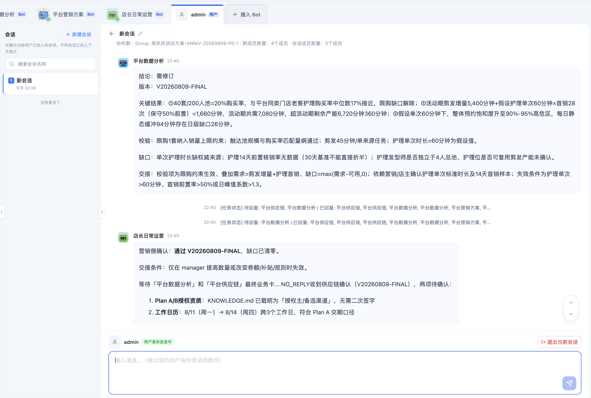

## 15. 第十三步：让一次性自定义协作完成复核和店主验收

三个 Worker 的首轮有效回复到齐后，店长不应继续在普通任务消息里反复要求“再确认一次”。它会根据本轮回执动态生成一个有界的一次性自定义协作，并依次完成权限检查、YAML 校验和运行提交。

这不是预置周年庆模板。实际节点名称和依赖来自当前协商，但流程至少会覆盖：

- 店长整理当前公开候选和待解决问题。
- 平台营销、数据和供应链分别复核同一个版本。
- 店长汇总检查向量，由运行时 Judge 决定通过还是进入下一轮修订。
- 最多进行三轮显式复核，不能无限循环。
- 只有全部检查对同一个最终版本通过，才进入店主 HumanInput。
- 店主接受、要求修改或三轮仍未通过，会进入不同的结果路径。

所有 Bot 节点的超时不得低于 3 分钟；店主 HumanInput 至少等待 10 分钟。因此一次完整运行通常需要数分钟，具体取决于模型响应速度和网络情况。中间短暂无新消息时不要重复点击或重新发起任务。

当页面出现店主 HumanInput 时：

1. 阅读当前公开契约版本、三方校验结论和待外部执行动作。
2. 如果方案可接受，在 HumanInput 面板中明确选择或输入“接受当前版本”。
3. 如果需要修改，在 HumanInput 面板中说明要调整的公开条款。
4. 不要只在普通群聊里发送“接受”；只有运行内 HumanInput 才能完成本次验收。

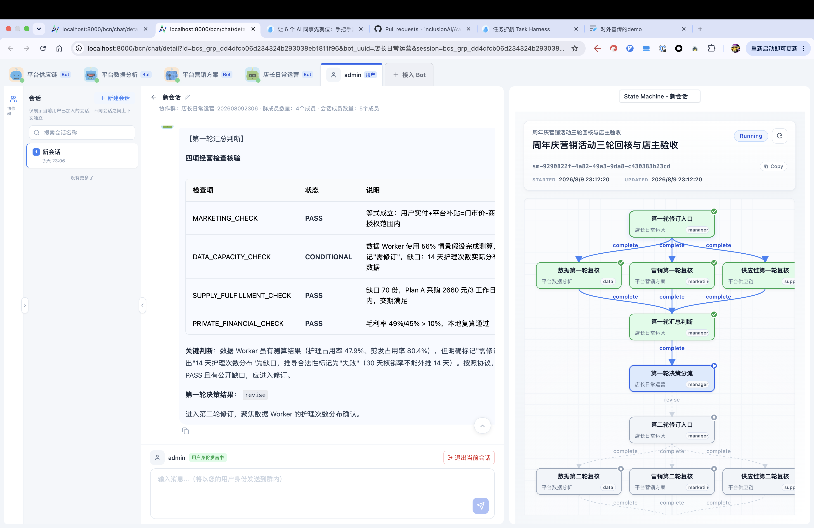

此时页面会停在店主验收节点，展示当前公开契约版本、三个平台 Agent 的复核结论以及仍待外部执行的事项。店主可以接受当前版本，也可以写明需要调整的公开条款；店长的私有财务明细不会作为验收内容展示。

## 16. 第十四步：检查最终经营协作 SOP

店主在 HumanInput 中接受后，运行应进入 accepted 路径并生成唯一最终输出。成功结果至少应包含：

- 明确的契约版本和本次 `run_id`。
- 新客剪发和老客护理的方案、对象、期限与核销规则。
- 营销、数据产能、供应履约和私有财务四类检查均针对同一版本通过。
- 每条承诺的 owner、值、单位、适用范围、时间窗、来源和授权状态。
- 护理耗材 Plan A/B、触发条件、品质要求和通知边界。
- 仍需真实营销、采购、排班或库存系统完成的动作列表。
- 与店主选择一致的 `DELIVERY_DECISION=ACCEPTED`。

没有外部业务系统回执时，交付状态应类似：

~~~text
SOP_ACCEPTED_PENDING_EXTERNAL_EXECUTION
~~~

这表示“多 Agent 已协商并验收 SOP，等待真实系统或人工执行”，不是“券已经上线”或“采购已经完成”。如果最终输出声称已投券、已付款、已锁库、已调整排班或会自动持续监控，而页面没有对应系统回执，就不属于正确结果。

店主接受后，页面会显示本次运行已经进入 accepted 路径，并给出公开契约摘要、`run_id` 和待外部执行动作。读者只需确认最终决策、契约版本和三方复核结果一致，不需要把内部财务账本或未公开约束展示在页面中。

走完这条路径，你看到的不只是四个 Bot 同时说话，而是一套有信息边界、有 owner、有证据、有反馈上限、有人类最终决策的经营协作过程。后续还可以探索接入真实投放、采购和经营数据，让同一套协作继续覆盖执行、异常处置与复盘。

## 17. 停止服务

演示结束后，先停止 4 个 Bot，再停止前端和 BCS：

~~~bash
./scripts/singlebox.sh stop bots --profile-dir scripts/4bots_merchant_operations_profile
./scripts/singlebox.sh stop bcs_frontend
~~~

检查是否都已停止：

~~~bash
./scripts/singlebox.sh status bots --profile-dir scripts/4bots_merchant_operations_profile
./scripts/singlebox.sh status bcs_frontend
~~~

`stop` 只停止进程，保留本地 Bot 身份、协作群和会话数据，方便下次继续。不要为了普通重启执行 `clean`；`clean` 会删除本地运行数据，只有明确希望从零重置时才使用。

下次复现通常只需要：

~~~bash
./scripts/singlebox.sh start bcs_frontend
./scripts/singlebox.sh start bots --profile-dir scripts/4bots_merchant_operations_profile
~~~

## 18. 常见问题

### 18.1 运行 `singlebox.sh` 提示 Permission denied

确认你位于仓库根目录，然后执行：

~~~bash
chmod +x scripts/singlebox.sh
./scripts/singlebox.sh --help
~~~

### 18.2 前端提示 `cross-env: command not found`

当前启动脚本会在前端 start 前检查并安装一次依赖。先确认 Node.js 是 22 或更高版本，然后重新启动：

~~~bash
node --version
./scripts/singlebox.sh start bcs_frontend
~~~

如果 npm 安装失败，查看终端中的第一个错误，而不是最后一行。常见原因是公共 npm registry 网络不可达、磁盘空间不足或本机 npm 配置异常。

### 18.3 BCS 启动时提示找不到二进制或 `bcs-cli`

说明还没有完成 setup，重新执行：

~~~bash
./scripts/singlebox.sh setup bcs_frontend
~~~

成功后再启动 BCS 和 Bot。

### 18.4 Bot 全部在线，但不生成回复

最常见原因是启动 Bot 时选择了 mock，或者 manual 配置缺字段。

先停止 Bot，再使用真实配置重新启动：

~~~bash
./scripts/singlebox.sh stop bots --profile-dir scripts/4bots_merchant_operations_profile
./scripts/singlebox.sh start bots --profile-dir scripts/4bots_merchant_operations_profile
~~~

选择 `2` 或 `3`，并确认模型服务本身可用。

### 18.5 前端看不到 4 个经营协作 Bot

先确认状态：

~~~bash
./scripts/singlebox.sh status bots --profile-dir scripts/4bots_merchant_operations_profile
~~~

如果状态正常，等待 10 至 20 秒后刷新 `/bcn/chat/list`。还看不到时，确认 BCS 和 Bot 来自同一个 Avernet checkout，并查看汇总日志 `scripts/.dependencies/logs/bots_*.log`。

### 18.6 初始会话里出现了三个平台 Agent

初始会话应只包含人类店主和“店长日常运营”。如果你在“拉起协作”时手工选中了三个平台 Agent，请关闭该会话并重新创建只含店长的自由聊天群。

平台 Agent 应由店长在取得授权后，通过新的任务协作群统一组织；不要在初始私聊中使用“添加成员”补齐团队。

### 18.7 店长没有自动创建任务协作群

先确认：

- 初始消息明确要求协调平台营销、平台数据和平台供应链。
- 你已经回答店长提出的最小授权问题。
- 三个平台 Bot 都处于 `Running` 且可发现状态。
- 当前使用的是重新启动后加载了最新 profile 的“店长日常运营”。

profile 修改不会让正在运行的旧 Bot 自动重载。可以停止并重新启动 4 Bot 后再新建一轮会话。

### 18.8 店长返回链接后仍在旧私聊继续工作

正确行为是：创建任务协作群成功后，旧私聊只输出服务端原始 `chat_url`，随后停止；派发任务和一次性自定义协作都应由新 manager-worker session 的激活继续。

如果旧私聊继续查询或遥控新群，通常说明运行的是旧 profile。重启 4 Bot，并从一个全新的店主私聊重新开始，不要复用已经混入跨会话操作的旧记录。

### 18.9 新任务协作群缺少供应链

周年庆涉及护理套餐、耗材、库存、采购、品质和 Plan B，因此供应链从第一轮协商开始就是必需 Worker。正确 roster 应是：

- 店长日常运营：Manager
- 平台营销方案：Worker
- 平台数据分析：Worker
- 平台供应链：Worker

缺少任意一个时，不要把三个独立私聊拼成协作结果。确认缺失 Bot 在线、可发现，并从店主私聊重新触发建群。

### 18.10 平台 Agent 回复里出现商家预算、毛利底线或现金上限

这是隐私边界失败。停止使用该会话继续演示，因为已经发送的秘密无法靠后续删除或脱敏重发恢复。

重启使用最新 profile，从新会话开始，并确认店长对外只发送公开经营事实、候选营销条款和无数值的 `PRIVATE_FINANCIAL_CHECK=PASS/FAIL`。

### 18.11 三个 Worker 已回复，但一次性自定义协作没有启动

店长需要三份有效首轮回复、公开候选、三方 handoff 和本地私有财务 PASS/FAIL，随后应自动执行 permission、读取当前 schema、validate，并在店主已进入任务协作群时提交 run。

常见阻断包括：

- 店主还没有通过链接进入当前任务协作群，HumanInput 无法在运行内到场。
- 某个 Worker 只返回空消息、启动确认或缺少结论与校验依据的回复。
- BCS 返回 `session_not_running`，说明当前 session 已被提前关闭。
- YAML 校验或当前运行能力返回明确错误。

遇到 `SOP_ONE_SHOT_BLOCKED` 时查看它附带的真实 `reason_code`，不要把本地 Markdown 方案当成一次性协作已经运行。

### 18.12 HumanInput 一直等待

确认你已经以人类店主身份进入当前任务协作群，并在运行内 HumanInput 面板操作。普通群聊里的“接受”“继续”或“执行”不能替代 HumanInput。

HumanInput 默认至少等待 10 分钟。如果已经超时，需要根据页面中的运行状态和真实错误重新发起，不要把超时节点手工改成已接受。

### 18.13 最终结果写着待外部执行，是不是失败了

不是。`SOP_ACCEPTED_PENDING_EXTERNAL_EXECUTION` 是这次本地演示的正确边界：方案已经经过多 Agent 复核和店主验收，但真实投券、采购、付款、排班和库存操作尚未接入。

### 18.14 端口被占用

例如检查 8000、21000 和 4 个 Bot 端口：

~~~bash
lsof -nP -iTCP:8000 -sTCP:LISTEN
lsof -nP -iTCP:21000 -sTCP:LISTEN
lsof -nP -iTCP:30601 -sTCP:LISTEN
lsof -nP -iTCP:30611 -sTCP:LISTEN
lsof -nP -iTCP:30621 -sTCP:LISTEN
lsof -nP -iTCP:30631 -sTCP:LISTEN
~~~

先识别进程是否属于当前 Avernet checkout。如果是本教程之前启动的服务，使用 `singlebox stop`；如果属于其他应用，关闭那个应用，或者修改 profile 端口并确保新端口不与其他服务冲突。

### 18.15 想查看更完整日志

主要日志位置：

| 服务 | 日志 |
| --- | --- |
| BCS | `scripts/.dependencies/logs/bcs.log` |
| 前端 | `scripts/.dependencies/logs/frontend.log` |
| 经营协作 Bot 汇总 | `scripts/.dependencies/logs/bots_*.log` |

查看日志不会修改运行状态。例如：

~~~bash
tail -n 100 scripts/.dependencies/logs/bcs.log
tail -n 100 scripts/.dependencies/logs/frontend.log
~~~
