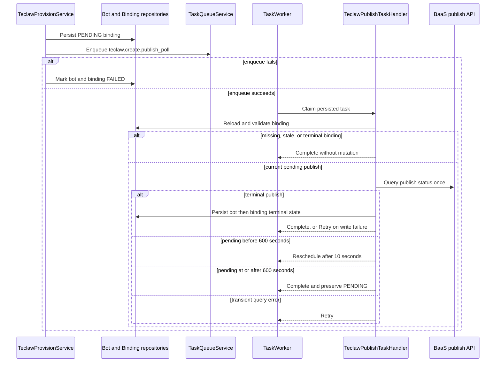

# Durable Teclaw Publish Status Reconciliation

## Problem

After Teclaw creates and approves a BaaS publish, `TeclawProvisionService`
persists a pending bot binding and starts `TeclawStatusReconciler`. The
reconciler schedules future polls in a process-local heap owned by a daemon
thread. A Backend restart discards that heap, so a publish that later reaches a
terminal state can leave both the bot and binding permanently `PENDING`.

The regular BaaS create flow already solves the same durability problem by
persisting poll work through `TaskQueueService`. Teclaw must use that durable
mechanism as well, without changing the existing public status semantics.

## Goals

1. Persist Teclaw publish polling as a dedicated task so pending work survives
   Backend and task-worker restarts.
2. Preserve the current mapping from BaaS publish states to bot and binding
   states.
3. Make retries, duplicate delivery, and reclaimed leases safe when a binding
   has already completed or a newer publish has replaced the original one.
4. Use the same handler and lifecycle in corp, singlebox, and test profiles;
   only task-queue infrastructure configuration may differ by profile.
5. Remove the process-local Teclaw reconciler and its profile-specific no-op
   scheduler bindings.

## Non-goals

- Changing the BaaS publish API or its state model.
- Changing the regular BaaS create or restart lifecycle.
- Rolling back or destroying the remote BaaS bot when task enqueue fails.
- Changing the existing Teclaw timeout result from `PENDING` to `FAILED`.

## Design

### Task contract

Introduce a dedicated task type:

```text
teclaw.create.publish_poll
```

The persisted payload contains only the identifiers and timestamp needed to
validate and resume the operation:

```text
binding_id: integer
bot_id: string
owner_id: string
publish_id: integer
started_at_epoch_s: number
```

`TeclawPublishTaskHandler` owns one polling step. A
`TeclawPublishTaskLifecycle` registers the handler before the shared task
worker starts. The task may have the task queue's normal long infrastructure
deadline, while `started_at_epoch_s` enforces Teclaw's independent 600-second
business polling window.

### Enqueue boundary

`TeclawProvisionService` enqueues the task immediately after the Teclaw
binding has been persisted. This ordering guarantees that every runnable task
can resolve its binding and that a binding is not published to the database
without attempting to persist its follow-up work.

If enqueue succeeds, provisioning remains `PENDING`. If queue infrastructure
is unavailable, the payload is invalid, or enqueue raises, provisioning marks
both the bot and binding `FAILED` and returns a failed provisioning result.
This matches the regular BaaS create lifecycle. The already-created remote bot
is not destroyed as part of this failure path.

Database write failures in this failure path remain errors. The service must
not report a successful failure transition when either required persistence
write did not complete.

### Idempotency and stale-task guards

Before querying BaaS, the handler reloads the binding and completes without
mutation when any of the following is true:

- the binding no longer exists;
- `device_provider` is not `teclaw`;
- the binding's current `device_props.publish_id` differs from the task's
  `publish_id`;
- the binding is already terminal.

These checks make duplicate delivery and lease reclaim harmless, and prevent
an old task from overwriting a newer publish. Invalid or structurally
incomplete payloads are permanent task failures rather than retryable work.

### Poll result mapping

Each execution performs at most one BaaS status query, then returns a task
decision:

| BaaS result | Bot state | Binding state | Task decision |
| --- | --- | --- | --- |
| `SUCCESS` | `ACTIVE` | `ACTIVE` | `Complete` after both writes |
| `FAILED`, `REJECTED`, or `REVOKED` | `FAILED` | `FAILED` | `Complete` after both writes |
| Any other non-terminal state before 600 seconds | unchanged | unchanged | `Reschedule` after 10 seconds |
| Any other non-terminal state at or after 600 seconds | `PENDING` | `PENDING` | `Complete` |
| Transient query error | unchanged | unchanged | `Retry` |

The handler queries once before applying the 600-second timeout. Therefore a
publish that became terminal while the worker was down still converges after a
restart, even if its elapsed time is already over 600 seconds. Only a publish
that is still non-terminal after that query is completed while remaining
`PENDING`.

Leaving a non-terminal publish `PENDING` after 600 seconds is intentional
backward compatibility with the current Teclaw reconciler. This change makes
work durable; it does not introduce a new timeout failure policy.

### Terminal persistence

Terminal state remains a dual write in the existing order: update the bot,
then update the binding. The task returns `Complete` only after both writes
succeed. Any persistence exception returns `Retry` so a partially completed
attempt can converge on a later delivery.

The stale-task guard is based on terminal binding state, not terminal bot
state. This is important when the bot write succeeded but the binding write
failed: the retry must still finish the binding update.

### Runtime wiring and cleanup

All deployment profiles install the same Teclaw task handler and lifecycle.
Existing profile-specific no-op scheduling providers are removed. The old
`TeclawStatusReconciler`, its in-memory delayed scheduler, and reconciler-only
dependency-injection bindings are deleted.

The shared `TaskQueueService`, repository, and worker retain responsibility
for durable rows, leases, retry scheduling, and reclaiming work after a worker
restart. No Teclaw-specific background thread is introduced.

## End-to-end flow



## Test strategy

Focused tests will cover:

- successful publish converging both records to `ACTIVE`;
- failed, rejected, and revoked publishes converging both records to `FAILED`;
- pending publishes rescheduling before the business timeout;
- transient query failures returning `Retry`;
- timeout querying once, then completing without changing `PENDING`;
- missing, non-Teclaw, stale-publish, and already-terminal bindings completing
  without polling or mutation;
- bot or binding persistence failure returning `Retry`, including convergence
  after a partial bot-only write;
- lifecycle registration of the dedicated task handler;
- provisioning enqueueing the exact task after binding persistence;
- enqueue failure marking the bot and binding `FAILED` and returning failure;
- persisted task reclaim after worker restart;
- identical handler wiring across corp, singlebox, and test profiles, with the
  old reconciler and no-op scheduler providers absent.

The closest Backend unit tests run during implementation. Because runtime
wiring and an architecture boundary change, the affected dependency-injection
and architecture checks also run before completion.

## Compatibility and rollout

No schema migration is required because the existing task queue stores an
opaque typed payload. Deployments with old in-memory reconciler callbacks lose
those callbacks during restart exactly as they do today; newly provisioned
Teclaw bindings use durable tasks after the new version starts.

The implementation commit message and pull request must explicitly record the
600-second `PENDING` behavior as intentional forward compatibility. The final
pull request should request review from `@totalfrank`.
