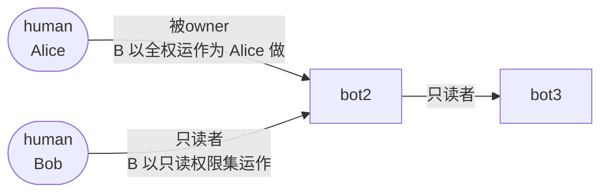

> **历史归档 / 非实现基线**：本文记录早期讨论方案，可能包含已废弃的 `role`、`edge_id` 下发、`permission_profiles[]` / `rules_grants[]` 拆分、`extra_rules` 等设计。实现请以 `docs/superpowers/specs/2026-08-07-bcs-a2a-authz-final-design.md` 和 `docs/superpowers/specs/2026-08-07-bcs-a2a-authz-implementation-spec.md` 为准。

# BCS 边权限方案 — 汇报

> 日期: 2026-07-16
> 配套: `2026-07-16-bcs-edge-permission-design.html`（mentor 版 + 四点修正，可视化交互版）/ `2026-07-16-bcs-edge-permission-design.md`（详细 spec）
> 上游: 07-14 TeamClaw 鉴权 briefing（第一层） + mentor 07-14 边权限讨论稿（点-边图雏形，本稿在其上做方向定调与四点修正）

---

## 1. 一句话

**把权限画成点-边图：点只有 human/bot，边 = 一个角色 = 一组 `(tool, specifier, allow/deny)` 权限集。** 边 `A → B` 读作"**B 以这角色运作、为 A 做事**"。同一对 (A,B) 一时刻只有一条边、一个通道（某角色 / 角色+附带 / 自定义集），换通道 = 整体替换、不是合并。平台守卫保安全底线，长链逐跳看边、不回溯发起者，回环自然跑通。

---

## 2. 与 mentor 讨论稿的四点修正

| # | mentor 稿 | 本稿修正 |
|---|---|---|
| 1 | 边方向未定（A 对 B 还是 B 对 A） | **定调**：边 = B 以角色运作、为 A 做事；角色 = B 的姿态。owner 边逆转为 `被owner`，与 Teacher/只读者同构 |
| 2 | 边键 `(from, to, env)` | `(from A → to B, env)`，与图 `A-->B` 排版一致 |
| 3 | 边里把角色 rules 全抄一遍 | `role_name` **引用**现成角色定义（`bcs_role_defs`）；边只挂 role_name + extra_rules，求值取并集、冲突 extra 覆盖 |
| 4 | 同 grantor 匿名边自动合并 | **删**。一时刻一通道，换 = 整体替换。唯一叠加是"角色+附带"（通道内部 extra 覆盖 role 默认），非多集并集 |

---

## 3. 点-边图



- **点只有 human/bot**（对齐 `bcs-domain/src/actor.rs` 的 `ActorKind{Bot,Human}`，human = `human_{staff_no}`，bot = uuid）。
- **边 = 角色 = 一组权限集合**；角色不是独立节点，就是边本身。
- **`A→B` = B 以角色运作、为 A 做事**；角色是 B 的姿态。
- **env 是边键**：`(from A → to B, env)` 唯一，按环境隔离。

> **被owner 不是特例**：owner 关系天然读作 "A 管 B"（A 是管理方），与"B 以角色运作"反着。逆转为 `被owner`（B 被某人拥有、B 以全权运作为 A 做），即与 Teacher/只读者同构——都是 B 的姿态。token 上 `is_creator` 标识，结构上 rules = `(*, *, allow)`（平台守卫除外）。同一张图、同一套求值器，无特例。

---

## 4. 角色 = 一组 `(tool, specifier, allow/deny)` 三元组

decision 三态 `allow/ask/deny`，但本第一层（角色边）只用二元 `allow/deny`（`ask` 归第二层 bot 自身鉴权）。每个 tool 的 specifier 类型不同（命令/路径/域名/工具名 …），通配让组合既能粗（整类）又能细（精确）。

```
只读者      = [ Read(./*) allow, Grep(./*) allow, Edit(*) deny, Bash(*) deny ]
受限协作者  = [ Bash(git *) allow, Read(./src/**) allow, Bash(rm *) deny, Bash(curl *) deny ]
```

各 tool 的 specifier 类型 / 危险面 / 示例 rule 详见 spec §3.4 与 HTML §3 tool tabs（Bash / Read / Edit / WebFetch / WebSearch / Agent / Skill / MCP / exec / 守卫）。

---

## 5. 边的数据形态：一通道 + role_name 引用 + extra 覆盖

```
Edge[from A → to B, env] = {
  channel : named_role | role_with_extra | custom   // 一时刻一个通道
  role_name : "只读者" | "被owner" | custom | null  // 引用 bcs_role_defs，不抄 rules
  extra_rules[] / custom_rules[]                     // extra 冲突覆盖 role 默认
  delegation_depth / expires_at / grantor
}
```

- **named_role**：权限集 = `bcs_role_defs[role_name].rules`
- **role_with_extra**：权限集 = 角色默认 rules ⊕ extra_rules，冲突 extra 覆盖
- **custom**：不走任何角色，独立选一组 rules

**换通道 = 整体替换这条边的权限集，不是合并**（旧 rules 不残留）。这取代了 mentor "同一对点多边 allow 优先"的模型——本稿同一对 (A,B) 一时刻只有一个权限集在用。需要"长期基础 + 临时增量"时用 `role_with_extra` 在一个通道内表达。

---

## 6. 求值：守卫 → 通道权限集 → bot default

```
对一次 tool call (caller A → bot B, tool, args):

  ① 平台守卫(最高,不可被任何边覆盖)
     命中 deny(Bash(rm -rf /)) → deny 熔断
     命中 ask(external_directory) → 转 bot 第二层
  ② A→B 这条边的当前通道权限集(§5 求出的那一个)
     命中 allow → allow ; 命中 deny → deny ; 未命中 → 走 ③
  ③ bot default 集(owner 配的对任何 caller 默认成立)
     命中 → 按 allow/deny ; 未命中 → deny(零信任)
```

第一层产二元，喂第二层 bot 自身鉴权（两层 AND，第一层 deny 短路）。

---

## 7. 落点：图是现成的，只待点亮（mentor 已探明）

- 点-边图 = BCS 现成的 `bcs_actor_relations` 表（每条边一行）。
- `RelationEdge`（`actor.rs:65`）已**预埋** `kinds/allow/deny` 三个 64-bit 位图（V1 恒 0，见 `actor.rs:59` 注释），本方案即"点亮位图"。
- **位图挡大面 + 规则判细节**：位图（整类摘要，BCS 准入 O(1) 粗判）+ 扩展表 `bcs_role_defs`（角色定义）/ `bcs_edge_grants`（边当前通道全文，bot 端 before_tool_call specifier 细判）。
- 写入口：`bcs-relation-store/src/lib.rs` upsert（当前硬编码 0,0,0 需打开）。
- 校验复用 `bcs-group/src/application/management.rs` 的 `ensure_reachable`。

---

## 8. 真实场景九环节（图怎么动 — mentor 第二部分）

1. owner 定义角色（`bcs_role_defs`，绑 owner_bot）+ Alice 的 `被owner` 边
2. Bob 建 friend → 关系边（无通道，位图恒 0）
3. 绑通道（写 `bcs_edge_grants`，关系边长权限身份 + 位图回写）
4. 一次调用：守卫 → 位图粗判 → bot 细判通道权限集 → 第一层 allow → 喂第二层
5. **换通道**（named_role → role_with_extra 让 Write(/tmp) 放行；extra 覆盖 onlyreader 的 deny；非加边、非合并）
6. 长链逐跳 AND，每跳看自己的边，不回溯发起者
7. 回环每跳看自己的边（`bot3→bot2` 边本就在图上）→ **死结①消除**；死循环由 `doom_loop` 守卫兜
8. 平台守卫兜底（通道之上安全闸，绝对禁止绕不开）
9. 撤销/改约 = 删边/换通道（version+1）；friend 关系边保留

## 9. 委托：只能收紧，不可升级（链上 ⊆ 发起 caller 第一跳）

```
new_allow = 下游_req.allow & 上游.allow   // 子集
new_deny  = 下游_req.deny  | 上游.deny    // 更严
new_depth = 上游.delegation_depth - 1     // 衰减
```

逐跳 AND + 委托收紧 → 链上任意 bot 能做的 ⊆ 发起 caller 第一跳被允许的。**无需回溯发起者即得此界**——这正是 briefing 想要、旧方案做不到的性质。

---

## 10. 价值总结

- **方向定调**：边一律"B 以角色运作"，`被owner` 与 Teacher 同构，无特例。
- **干净**：role_name 引用不抄 rules；一时刻一通道、换 = 替换，删合并歧义。
- **结构解死结**：长链逐跳看边、回环自然跑通（不回溯发起者）。
- **安全底线**：平台守卫保绝对禁止，与通道权限集分层。
- **现成落点**：点-边图就是 `bcs_actor_relations`，位图已预埋、只待点亮（mentor 已验证代码锚点）。
- **场景闭环**：mentor 第二部分九环节把建边→绑通道→换通道→长链→回环→撤销→委托跑通一遍。

---

> 待讨论 D1–D7（位图段分配 / 角色定义同步 / 缓存失效 / 委托 depth 上限 / 换通道并发 / 二层衔接 / 被owner 命名采纳）详见 spec §12。
