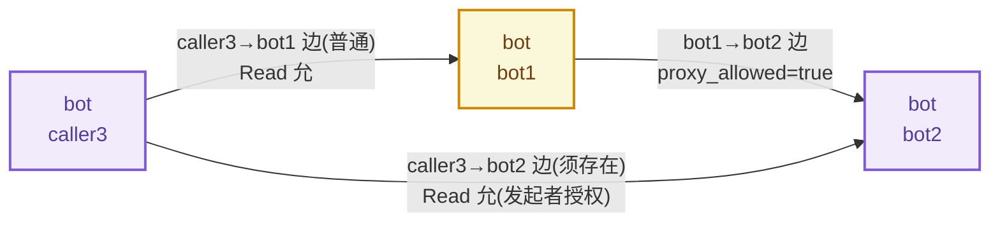
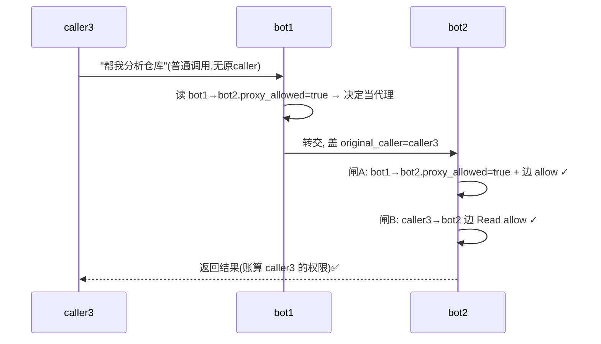
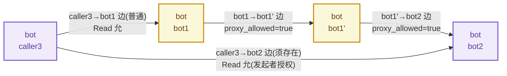
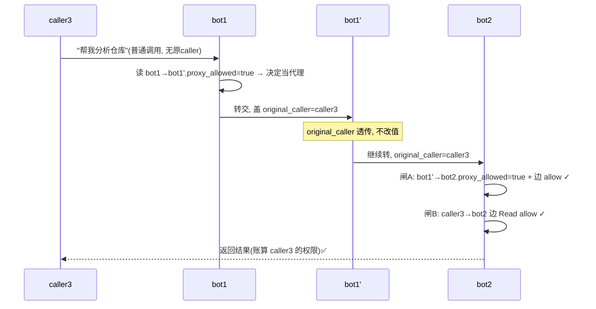

> **历史归档 / 非实现基线**：本文记录早期讨论方案，可能包含已废弃的 `role`、`edge_id` 下发、`permission_profiles[]` / `rules_grants[]` 拆分、`extra_rules` 等设计。实现请以 `docs/superpowers/specs/2026-08-07-bcs-a2a-authz-final-design.md` 和 `docs/superpowers/specs/2026-08-07-bcs-a2a-authz-implementation-spec.md` 为准。

# BCS 代理转发方案 — 汇报

> 日期: 2026-07-21
> 配套: `2026-07-21-bcs-edge-permission-design.html`(mentor 版,可视化交互)
> 范围: 只讲代理转发这条线——`proxy_allowed` / `original_caller` / 双闸 / 多级代理 / 委托收紧。点-边图主干(三类点、friend=default、申请-审批、多边 allow 优先、平台守卫)见 07-16 briefing,本文不重述。
> 用途: 把 mentor HTML 里散在 §3.5 / §5.4 / §18 / 特殊场景二 的代理内容收成一份可读底稿,对照 brainstorming 中 A→B→C 委托结论看。

---

## 1. 一句话

**普通协作零负担:默认边都是普通边,消息上没有发起者印章、也走不到代理校验。只有"bot1 替第三方 caller 把活转给 bot2、账算那第三方"这个特殊场景,才点亮 `proxy_allowed=true` 边 + 在消息上盖一个 `original_caller` 印章,走双闸(代理边 ∧ 发起者→执行者边)。**

---

## 2. 三个不混的概念

| 概念 | 归属 | 含义 |
|---|---|---|
| `original_caller` | **消息**(一次调用)上的印章 | "这次调 bot2 真正算谁调的"——发起者身份。由执行转交的那一方盖、原样往下传、中途不改。 |
| `proxy_allowed` | **边**上的开关(边属性) | "这条边是否允许代人转发"。默认 false;由被调方 owner 设。 |
| "自用 / 代理"模式 | 调用方运行时选 | 调用方看自己边上的 `proxy_allowed` 决定本次走哪种模式。 |

> 三者别串:印章跟**消息**走、开关跟**边**走、模式跟**调用瞬时**选。开关不开,印章根本盖不出去。

---

## 3. 三种调用模式(对照)

| 调用场景 | 用哪条边 | 边上 `proxy_allowed` | 消息 `original_caller` | 结果算谁 |
|---|---|---|---|---|
| **普通调用**:bot1 找 bot2 干活 | bot1→bot2 普通授权边 | false(默认,用不上) | **无** | bot1 |
| **外包自用**:bot1 当甲方外包给 bot2 | bot1→bot2 普通边 | false 可 | **无**(算 bot1 自己) | bot1 |
| **代理转发**:bot1 替 caller3 转给 bot2 | bot1→bot2 边(须 `proxy_allowed=true`)+ caller3→bot2 边 | **true(必须)** | **有,=caller3** | caller3 |

> 第一行就是绝大多数情况:bot1 找 bot2 干活,边是普通授权边,`proxy_allowed` 默认 false 也无所谓(消息没 `original_caller`,根本走不到代理校验)。proxy / original_caller 只在"代人转发"这个特殊场景才出现,默认完全不碰。

---

## 4. 为什么需要 `proxy_allowed` 开关

"为什么不能让 bot1 自由盖 `original_caller`、bot2 照单全收?" 三个不可省的理由:

- **防 bot1 伪造发起者**。`original_caller` 是 bot1 自己盖的,没门槛则 bot1 能在任意调用谎报"我替 bot某 来的"钻别人权限空子。`proxy_allowed` 把"bot1 可当代理"做成 owner 预授权的信任缓存——只在 owner 信任的边上,bot1 盖的 `original_caller` 才被认可。
- **保证普通边不被代理语义污染**。`proxy_allowed=false` 的边,看到 `original_caller` 直接拒。普通协作边永远干净,不会误带代理语义——这正是"普通调用零负担"的保证。
- **代理链可审计的最小信任边界**。一次代理调用必须**两证齐全**:发起者被授权(`caller3→bot2` 边)+ 代理被信任(`bot1→bot2.proxy_allowed`),缺一不可。

---

## 5. 何时加 `proxy_allowed`、何时加 `original_caller`

```
# proxy_allowed(边属性):由谁、何时加
默认 false —— 所有普通边都是。
当且仅当 bot2 owner 决定"让 bot1 当 bot2 的代理通道"时,
在授权/改约 bot1→bot2 边时主动拨成 true。由被调方(bot2) owner 设;
bot1 自己不能为自己开(否则自提权)。

# original_caller(消息印章):由谁、何时加
bot1 运行时,决定"这次调 bot2 用什么模式"时:
  读自己 bot1→bot2 边的 proxy_allowed:
    false → bot1 不能选代理模式,original_caller 一律不带(自用/外包自用)
    true  → bot1 被允许(非命令)选代理:
              选"替 caller3 转" → 带 original_caller=caller3
              选"自用外包"    → 不带
# proxy_allowed=true 是许可(permissive)不是命令(imperative)
# original_caller 的值必须是真实发起者(caller3)身份,从请求追溯,bot1 不能凭空指一个 bot
```

---

## 6. 代理转发的双闸校验(单跳)

bot2 收到带 `original_caller=caller3` 的代理调用,做两道闸,缺一拒:

```
caller3 → bot1 → bot2 (bot1 当代理):

bot1→bot2 段,bot2 端双闸:
  闸A 代理信任: bot1→bot2.proxy_allowed = true         (代理被信任)
        + bot1→bot2 边 rules 对本次 tool call allow      (代理者有权限调 bot2 做 X)
  闸B 发起者授权: caller3→bot2 边 rules 对本次 tool call allow (发起者被授权做 X)

  全 allow → 终局 allow;任一 deny / 边不存在 → 拒(未授权必拦)
```

落到最简一跳 `caller3 → bot1 → bot2`:bot1 是唯一代理、bot2 是直接执行者,闸A 与闸B 都在 bot2 这一跳(跳②既是末跳也是执行处)。



运行时:caller3 普通调 bot1 → bot1 读自己 `bot1→bot2.proxy_allowed=true` → 决定替 caller3 转,盖 `original_caller=caller3` → bot2 收到做闸A+闸B:



> §7 的多级代理就是在这基础上把 bot1 换成 `bot1→bot1'→…→bot1''` 中续链——闸B 仍在末跳执行处一次,中跳只过闸A。回头要一张图看那一跳够不够直观,这是最简的元图。

> **回到最初担心的越权**:caller3 没被 bot2 授权(闸B 扣)→ 拦死;bot1 自作主张当代介但边没开 `proxy_allowed`(闸A 扣)→ 拦死;两者都齐 → 放行,且这次调用花的是 **caller3 自己**在 bot2 上的权限,不是借道 bot1 的——**多级代理不放大权限**。

---

## 7. 多级代理:信任逐段传、发起者恒定带

链路 `caller3 → bot1 → bot1' → bot2`(三段代理)。两样东西分别传递:



- **① 信任逐段**:每条代理边 `proxy_allowed=true`,由"被调方 owner"逐级预授权。哪段没开,链就断在那段;**没有谁一次性授权整条链**。
- **② 发起者恒定**:`original_caller` 从第一跳盖定,中途原样直传、不改值。中途代理者在变,但发起者恒等于 caller3——不篡改是协议硬约束。

| 跳 | 谁发→谁做 | 判什么 |
|---|---|---|
| ① caller3→bot1 | 发起者调首个代理 | 普通:看 caller3→bot1 边 rules allow? |
| ② ③ …中间代理跳 | 代理→下一个代理 | **闸A**:本段代理边 `proxy_allowed=true` + rules allow?(中间代理不判发起者授权,只保证"能往下一跳转") |
| 末跳→bot2 | 末代理→最终执行者 | **闸A + 闸B**:本段代理边 allow + caller3→bot2 边 allow?(发起者核对只在最终执行处一次) |

> **分工**:信任**逐跳分散**(每段独立授权代理边),发起者核对**最终集中**(只执行者做一次)。每跳只看自己那段 + 一个恒定的 `original_caller` 常量——**不回溯发起者**,既消除回环死结,又在终点兜住发起者授权。

**三个钉死的边界**:
1. **链长限**:复用 `delegation_depth`,每过一跳代理 depth-1,到 0 不允许再代理。
2. **`original_caller` 不可篡改**:中途代理若改成自己,就是冒充发起者逃校验,协议层硬禁止。
3. **整条链成立 = 每段代理边都 `proxy_allowed=true`(信任齐)AND caller3→bot2 边 allow(发起者被授权)**,两条件独立,任一不满足断链——故**多级代理不放大权限**。

---

## 8. 运行时跑法(盖章 + 透传 + 双闸)



每跳判定:跳① 看 caller3→bot1 → v1;跳② 闸A bot1→bot1' → v2;跳③ 闸A+闸B → v3。终局 = v1 ∧ v2 ∧ v3 = **allow**,账算 caller3 在 bot2 上的权限。

---

## 9. 未授权怎么拦(三类)

- **✗ 情况A:caller3 没被 bot2 授权**。若 `caller3→bot2` 边不存在 / 该 Read 是 deny → 跳③ **闸B 拒**。bot1 通道再畅通也救不了未授权的 caller3——未授权必拦,越权放大被堵死。
- **✗ 情况B:bot1 没被开 `proxy_allowed`**。若 `bot1→bot1'.proxy_allowed=false` → 跳② **闸A 拒**。bot1 自作主张当代介不行——"代理被信任"这一证缺失,bot1 的边成不了通行证。
- **✗ 情况C:bot1 篡改 `original_caller`**。若 bot1 把 `original_caller` 改成自己 → 协议层硬禁止;即便没拦下,bot2 端闸B 校验的是改值后的"发起者",bot1 自身被 bot2 授权与否重新判,**无法逃过发起者校验**。

> **一句话**:多级代理 = 每段代理边由被调方 owner 开 `proxy_allowed`(信任逐段传)+ `original_caller` 由首代盖定、原样透传(发起者恒定带)+ 最终执行处双闸一次性校验(代理边 ∧ 发起者→执行者边)。整条链成立 = 所有代理边齐 AND 发起者被授权,两条件独立 → **多级代理不放大权限**。普通协作(`proxy_allowed` 默认 false)完全不碰这套,零负担。

---

## 10. 委托收紧(连回长链全局有界)

bot2 若想在协作链里把自己部分权限下传给下游 bot3,用边的 `delegation_depth`。铁律——**只能收紧,不可升级**(下游 ⊆ 上游):

```
// 委托时下游边 = 收紧后的上游边
new_allow = 下游_req.allow & 上游.allow   // 只能是子集
new_deny  = 下游_req.deny  | 上游.deny    // 只能更严
new_depth = 上游.delegation_depth - 1      // 深度衰减
```

> 逐跳 AND + 委托收紧,合力给出一个界:链上任意 bot 能做的事,**恒 ⊆ 发起 caller 在第一跳被允许做的事**。无需回溯发起者即可得到这个界。

---

## 11. 求值关系:普通 vs 代理

| 调用类型 | 触发 | 求值 |
|---|---|---|
| 普通调用 / 外包自用 | 消息**无** `original_caller` | 两档:守卫 → 角色边 allow 优先(含 default 边,逐跳看自己边) |
| 代理转发 | 消息**有** `original_caller` | 双闸:代理边(闸A)∧ 发起者→执行者边(闸B),再叠加守卫① |

> **关键**:多边 allow 优先(§07-16 briefing)是**同一对点之间多条角色边**的合成;代理双闸是**不同对点(代理者边 + 发起者边)**的合成。同一对点的 N 条边先内部 allow 优先合成一个跳的 verdict;若是代理跳,再把这个 verdict 与发起者边的 verdict 做 AND。两者粒度不同、不冲突。守卫① 永远是最高优先级,两类都在其后。

---

## 12. 价值总结

- **普通协作零负担**:`proxy_allowed` 默认 false,消息无 `original_caller`,默认完全不碰代理语义。
- **两证齐全**:代理被信任(边 `proxy_allowed=true`)+ 发起者被授权(发起者→执行者边),缺一不可。
- **信任逐段、发起者集中**:多级代理信任逐跳分散授权、发起者核对最终执行处做一次,每跳只看自己那段 + 恒定 `original_caller`——不回溯发起者,回环也跑得通。
- **多级不放大权限**:每段代理边齐 AND 发起者被授权,两条件独立 → 断其一即断链。
- **全局有界**:委托只能收紧不可升级,链上任意 bot ⊆ 发起 caller 第一跳被允许的。

---

## 13. 待讨论(代理相关)

- **D4 链长上限**:`delegation_depth` 兼管"委托级 cascade"和"代理转发跳数",默认值与硬上限(防恶意长链放大)?要不要全局 max_depth?
- **D8 `original_caller` 可信传递**:协议层如何硬保证 `original_caller` 不被中途篡改?靠消息签名还是每跳由转发方重盖 + 执行端回溯校验?
- **D6 与第二层衔接**:代理转发带入的 `original_caller` 在第二层 bot 自身鉴权是否也需可见?

> **本稿边界**:只管第一层协作鉴权(allow 优先产二元 + 平台守卫 + 代理转发双闸 + 边申请-审批)。第二层 bot 自身三态鉴权、守卫具体实现、bot runtime 审批流均不在本稿。与 briefing A1–A9 并行不冲突。
