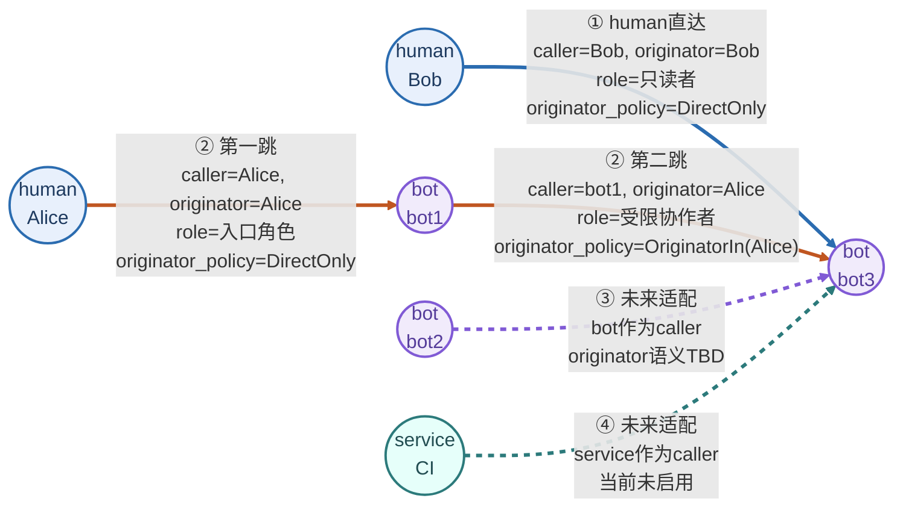
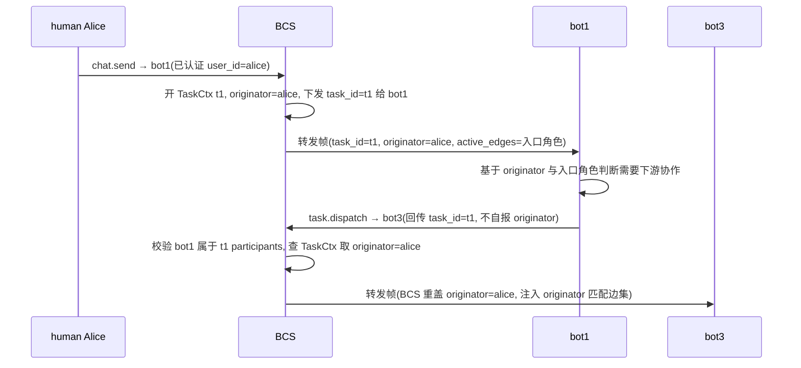
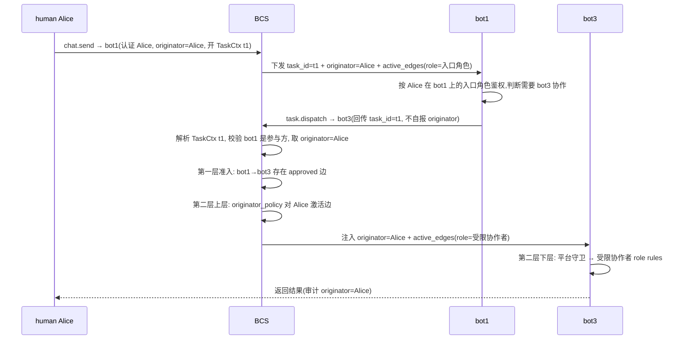

> **历史归档 / 非实现基线**：本文记录早期讨论方案，可能包含已废弃的 `role`、`edge_id` 下发、`permission_profiles[]` / `rules_grants[]` 拆分、`extra_rules` 等设计。实现请以 `docs/superpowers/specs/2026-08-07-bcs-a2a-authz-final-design.md` 和 `docs/superpowers/specs/2026-08-07-bcs-a2a-authz-implementation-spec.md` 为准。

---
title: bcs 边权限方案设计 · originator 前置条件模型
日期: 2026-07-24
类型: 技术设计稿(评审中,含未来适配项)
上游: 07-14 TeamClaw 鉴权两层设计(BCS 准入 + bot 端能力鉴权)
未来适配项: ③ bot→bot、④ service→bot 场景及二者的 originator 取值均为 tbd(service 目前根本不是 caller;bot 作无 human 的发起者语义未定)
---

# bcs 边权限方案设计

## 0. 核心论点

权限 = 点-边有向图。点有三类(human / bot / service),模型对三类点的边**同构、同求值**(机制不区分)。

> 命名说明:本文统一使用 `originator` 表示“原始发起方 / 源发起方”,不再使用 `oc` 缩写,避免与 OpenClaw 混淆。

但在当下,只有 **human 到 bot** 的两类走法是**确认的**(human 直达、human 经 bot 中转);**bot→bot** 与 **service→bot** 是**未来适配项**(service 目前根本不是 caller;bot 作无 human 的发起者,其 originator 语义未定)。

一条 caller **a → B** 的有向边 = **一份授给 caller 的角色权限集 + 一个 originator 激活条件**。角色权限集由目标 bot B 的 owner 定义,表达这条边被激活后能使用哪些 tool;originator 激活条件只回答一个问题:**当前 originator 是否允许激活这条边上的角色权限集**。

originator 由 BCS 在整件事的 kickoff 处依**已认证身份**权威盖定,沿任务链由 BCS **逐跳重盖、原样透传**;bot 不能自填 originator,也不能把自己的 originator 字段传给下游。bot 上行只带不透明 `task_id`,BCS 依据 TaskCtx 解析出可信 originator。

一句话:被保护的目标 bot B 干活时保护自己。运行时先确认本跳 caller `a` 到 target `B` 有可进入鉴权流程的 approved 边;再在第二层上层用 originator 激活其中部分边;最后在第二层下层用这些 active edge 绑定的 role 权限集做 tool 鉴权。**权限不沿路径复制或传递;每跳只使用当前 caller→target 边上被 originator 激活的角色权限集。**



上图保留一张综合图,同时展示 caller、originator、role 与 originator_policy。① Bob→bot3 是 human 直达确认走法;② Alice→bot1→bot3 是 human 经 bot 中转确认走法;③ bot2→bot3 与 ④ CI→bot3 只表示未来适配方向,当前不进入 MVP 主路径。关键读法是:第二跳 `bot1→bot3` 使用的是 **bot1→bot3 边** 上被 `originator=Alice` 激活的 `受限协作者` 角色权限集,不是把 `Alice→bot1` 的权限复制给 bot3。

---

---

## 1. 点 / 边

### 1.1 三类点与当前 caller 状态

| 点类型 | 标识 | 凭证 | 当前是否 caller |
|---|---|---|---|
| **human** | `human_{user_id}` | SSO(OAuth user_id 锚点) | **是**(确认) |
| **bot** | bot uuid | bot token | 作被调(边的 to)确认;作发起 caller **未来适配**(见 §0) |
| **service** | `svc_{service_id}` | 机器凭证(API key / JWT / mTLS) | **目前根本不是 caller**(④ 未来适配) |

<div class="callout"><b>模型对三类点同构同求值(机制不区分)</b>,但当下 caller 的现实状态是:<code>human→bot</code> 两类走法确认;<code>bot→bot</code> 与 <code>service→bot</code> 只做未来适配且 originator=tbd。模型的同构性是为"将来若启用这两条线,机制照搬不另造";不是宣称它们当下已实装。</div>

> 注:本文用固定演员做示例——Alice(human,bot1/bot3 的协作发起者)、Bob(human,直连 bot3 的 caller)、bot1(中转 relay)、bot2(bot 发起者,未来适配)、bot3(被保护的目标 bot)、CI(service,目前非 caller)。四条线重新统一围绕 bot3 展开:Bob 表示 human 直达, Alice 表示 human 经 bot1 中转。

### 1.2 一条边 = role 权限集 + originator 激活条件(数据形态)

边是 role 绑定容器,其上附带 originator 激活条件。规则**引用**目标 bot 的角色定义(`role_name`),不内联抄写;边上可叠 `extra_rules` 覆盖/补充。落在扩展表 `bcs_edge_grants`:

```
EdgeGrant(from=a, to=B, env) = {
  edge_id          : 主键                        ★ 同对点多边靠它区分,不靠 role_name
  from_id          : a (human_{user_id} / bot uuid / svc_{service_id})
  to_id            : B (bot uuid)
  env              : 边键,按环境隔离
  role_name        : "default" | "owner" | "只读者" | 自定义 | null
                     ← 引用 bcs_role_defs[(env, B, role_name)],不抄 rules
  extra_rules[]    : [(tool, specifier, allow | deny)]   可选,在边上覆盖/补充
  originator_policy         : DirectOnly | OriginatorIn | OriginatorType | Any 等,见 §2
                     底层可存为 originator_policy_json              ★ 第二层上层激活条件
  delegation_depth : 0 = 不可再传下游; >0 = 做链长限(不做子集收紧,见 §6.2)
  expires_at       : null = 永久(默认); 留作将来临时授权
  status           : pending | approved | rejected   ★ 仅 approved 参与求值
  applicant        : 发起申请的 caller
  approver         : 审批的 B 的 owner
  grantor          : = approver(审批通过者)
  version          : 单调递增(缓存对账用)
  audit_meta       : 通配等高危配置的 opt-in/审计记录,见 §2.4
}
```

### 1.3 `role_name` 引用 `bcs_role_defs`,不内联 rules

角色定义单独存表 `bcs_role_defs`,由 **B 的 owner** 写(B 最懂自己挂了哪些 tool);边只挂 `role_name` 引用 + 可选 `extra_rules`。于是"owner 卖什么角色"与"把这个角色授给哪条 a→B 边"两件事分开:

```
RoleDef = {
  env, owner_bot_id, role_name              [unique (env, owner_bot_id, role_name)]
  rules_json    : [(tool, specifier, decision)]    ★ role 的 tool 权限集真相
  danger_level  : normal | elevated | restricted
  is_builtin    : default | owner 等系统角色
  description, record_status, created_by
}
```

- 一条**单权限**边 = `role_name = null` + `extra_rules` size 1(匿名边的退化,与命名角色边同构)。
- 边的最终 tool 规则池 = `bcs_role_defs[role_name].rules` ∪ `edge.extra_rules`。`extra_rules` 与 defs 的 rules 合成时仍按 §4.2 的 allow 优先。
- caller 申请边时只声明 `role_name` + 提议 originator_policy,拿不到 role 的 rules 全文(贴合 §6.3"originator_policy 与规则只归 B owner 写")。

### 1.4 owner 边 / default(friend)边

- **owner 边**:关系层 `is_creator = true` 标识(系统初始化回填),权限层回填 `bcs_edge_grants` builtin owner 行:`role_name = owner`(rules = 全权,守卫外)、`originator_policy = DirectOnly`(仅 owner 本人亲身作 originator 才走全权,不能被借用当全权代理)。owner 替 X 转发须另挂 `OriginatorIn([X])` 的普通角色边。owner 边不发申请-审批(owner 关系是事实)。
- **default(friend)边**:`role_name = default`,`originator_policy = DirectOnly`。语义:"直连熟人入场用,链中 caller ≠ originator 不放行。" default 是熟人入场安全垫,默认不承担 relay 责任——否则 B owner 给 bot1 挂 default,等于默认让 bot1 滥代任意 human。链中需要 default 语义时 owner 须显式写 `OriginatorIn([...])` 或更高风险 policy(记 audit)。
- **friend = default 边**:friend(关系层)与角色边(权限层)收敛成一类——friend 即一条 `role_name = default` 的边,"是熟人" = 该边存在,"走默认权限" = 该边参与求值。模型只有一类边。

---

## 2. 第二层上层: Edge Activation / originator_policy

本稿把原来抽象的“原始发起方谓词”收敛成更容易理解的 **originator_policy / 边激活策略**。底层字段统一建议叫 `originator_policy_json`,文档和产品语义也按 `originator_policy` 解释。

核心语义:

```
EdgeGrant(from=a, to=B) = role_name + originator_policy

role_name  决定:这条边激活后能使用哪些 tool 权限集
originator_policy  决定:当前 originator 是否允许激活这条边
```

originator 本身不是权限,也不是 caller。originator 只是第二层上层的激活输入:在本跳 `(caller=a, target=B, originator)` 中,只有 `originator_policy.match(caller=a, originator)` 为 true 的 EdgeGrant 才进入 active_edges;active_edges 绑定的 role 权限集才会进入第二层下层 tool 鉴权。

### 2.1 内置 originator_policy

| policy | 语义 | 典型用途 | 风险 |
|---|---|---|---|
| **DirectOnly** | 仅当 `caller == originator` 时激活 | human 直达 bot、owner/default 直连边 | 最安全;链中默认不激活 |
| **OriginatorIn([ids])** | `originator` 在显式 id 列表中时激活 | relay 场景:允许 bot1 只代表 Alice/Bob 使用某角色 | 白名单明确,推荐用于中转 |
| **OriginatorType(type)** | `originator.kind == human/bot/service` 时激活 | 未来需要信任一整类 originator | 风险高,须 opt-in + audit |
| **Any** | 任意 originator 都激活 | 极少数系统内置/运维场景 | 默认禁用,强审计 |

旧文档里的 `self` 可视为 `DirectOnly` 的底层简写;`ids` 可视为 `OriginatorIn`;`wildcard` 可视为 `OriginatorType`;`human:*` 等通配不再作为主叙事,避免读者把通配当默认能力。

### 2.2 DirectOnly:直连默认安全垫

`DirectOnly` 的判断是:

```
originator_policy.match(caller, originator) = (caller == originator)
```

示例:Bob 直连 bot3。

```
caller = Bob
originator     = Bob
edge   = Bob → bot3, role=只读者, originator_policy=DirectOnly
=> edge 激活,进入只读者 role 权限集判断
```

但在 Alice→bot1→bot3 的第二跳:

```
caller = bot1
originator     = Alice
edge   = bot1 → bot3, originator_policy=DirectOnly
=> caller != originator, edge 不激活
```

因此 default(friend) 边默认用 `DirectOnly`:它只提供直连入场能力,不默认承担 relay 责任。链中若要让 bot1 代表 Alice 使用 bot3,必须由 bot3 owner 显式给 `bot1→bot3` 配 `OriginatorIn([Alice])`。

### 2.3 OriginatorIn:relay 的主推荐

relay 场景用 `OriginatorIn([ids])` 明确允许哪些 originator 激活这条 caller→target 边。

```
RoleDef(bot3, "受限协作者") = [
  Read(./src/**) allow,
  Bash(git *) allow,
  Bash(rm *) deny
]

EdgeGrant(bot1 → bot3) = {
  role_name = "受限协作者",
  originator_policy = OriginatorIn([Alice])
}
```

运行时 Alice 经 bot1 调 bot3:

```
caller = bot1
originator     = Alice
edge   = bot1 → bot3
originator_policy.match(bot1, Alice) = true
=> 激活 bot1→bot3 的受限协作者角色权限集
```

如果 Bob 经 bot1 调 bot3:

```
caller = bot1
originator     = Bob
originator_policy.match(bot1, Bob) = false
=> bot1→bot3 这条边不激活;若没有其他 active edge,拒绝
```

这正好表达你的目标:bot3 的权限表仍是角色权限集;上层只判断 originator 是否允许使用这份分配给 bot1 的角色权限集;通过后再进入正常 tools 鉴权。

### 2.4 OriginatorType / Any:未来扩展与审计

`OriginatorType(human)` 表示任意 human 作为 originator 时都能激活该边。它适合少数高信任 relay,但新成员加入后会自动生效,风险高。

`Any` 表示任意 originator 都能激活,风险更高。默认禁止普通申请创建 `Any`;仅允许系统内置或 owner 明确 opt-in,并强制写入 `audit_meta(record_reason, opted_in_by, audit_ts)`。

`service` 目前不是 caller,所以 `OriginatorType(service)` 与 service id 相关配置只作为未来适配项保留,当前不进入 MVP 主路径。

### 2.5 暂不把 has-edge-to-B 放进主线

`has-edge-to-B` 的语义是:如果 originator 自己对 B 有 approved 边,则允许激活当前 a→B 边。它接近 07-21 proxy 双闸里的“originator 自身也要被 B 授权”,但会让第二层上层从“只判断当前 a→B 边”变成“跨边查询 originator→B”,增加复杂度和缓存一致性问题。

因此本版不把 `has-edge-to-B` 作为基础能力;只保留为未来高级 policy。当前主线只用 `DirectOnly` 与 `OriginatorIn([ids])`。

---

---

## 3. originator 的建立、传播、防伪造

### 3.1 BCS 单点盖定 + 不透明 task_id 句柄

bot 不能自报 originator;originator 由 BCS 单点盖定。盖定依据两种:(a) 直接已认证身份(`AuthPluginChain` / WS `bot.connect` 解析的 `AuthPrincipal`,人类 `user_id` 或 bot `bot_uuid`);(b) BCS 自管的 `TaskCtx`。bot 之手只摸到不透明 `task_id` 句柄,**永远拿不到 originator 值**。

```
TaskCtx (BCS 侧持有) = {
  task_id        : 不透明句柄(BCS 签发)
  originator: ActorId(只在 kickoff 写一次,永不改)
  participants   : Set<bot_uuid>(动态,每次转发把目标 bot 加进)
  status         : Active | Completed | Expired
  created_at, updated_at, ttl
}
```

### 3.2 四场景 originator 来源(①② 确认;③④ 未来适配 tbd)

| 场景 | originator 值 | 谁盖 / 用哪条已认证身份 | 机制 | 状态 |
|---|---|---|---|---|
| **① human→bot3** | `human_{user_id}` | BCS HTTP 准入 `caller_actor_id_from_headers` 跑 AuthPluginChain,`principal.user_id`(human cookie 无 bot_uuid 故不可冒充 bot) | (a) | **确认** |
| **② human→bot1→bot3** | `human_{user_id}` | 开端进 BCS 时开 TaskCtx 写 originator=alice、把 task_id 随帧下发 bot1;bot1→bot3 转发只带 task_id,BCS 查 TaskCtx 取 originator 盖到 bot3 入站帧 | (b) | **确认** |
| **③ bot2→bot3** | **tbd(未来适配)** | 待定:bot 作无 human 的发起者,其 originator 语义未定(能否 originator=bot2?还是必须有上游 human?) | (a) 候选 | **未来适配** |
| **④ service→bot3** | **tbd(未来适配)** | service 目前根本不是 caller;若将来启用,机器凭证→`svc_id` 盖 originator,plugin 缺位(§9) | (a) 候选 | **未来适配** |

### 3.3 continuation vs fresh 判定

bot1→bot3 这一次调用,是否引用了一个 **active 且 bot1 是其参与方**的 `task_id`:是且通过 → continuation(originator=该 task);否则 → fresh(originator=bot1),开新 TaskCtx。

> 注:①② 确认走法下 continuation/fresh 已定(② = 续接,① = fresh 直达)。fresh 时 originator=caller 自身这一点对 ③ bot→bot 尚未拍板(bot 能否当无人的发起者,originator 取 caller 自身还是拒),故 ③ originator=tbd。

防 bot1"升级"originator 四种攻击:
1. 凭空报更高权 originator 值:不可能(bot 上行帧无 originator 字段)。
2. 报别人的 task_id(冒 alice):`bot1 ∈ participants` 校验扣死 → 拒/降级 fresh(originator=bot1)。bot1 只能引用上游转发带进过自己的 task。
3. task 结束后复用旧 task_id 延长:`status != Active` 即拒。TaskCtx 在 `task.complete` / TTL 时关。
4. 把 alice 的 task_id 接到对 bob 的调用:TaskCtx 额外记 `current_dispatch_chain`,bot1 须是这条 dispatch 的发起方且目标 bot3 进 participants(MVP 可先只做 participants + TTL,加严分阶段)。

### 3.4 每跳 BCS 重盖(D8 已决)

originator 不靠 bot 透传签名、不靠 bot 自填 originator 字段:**每跳 BCS 依 TaskCtx 重盖 originator** 到转发给目标 bot 的下行帧。目标 bot 收到的下行帧里可以读取 originator 与 active_edges/角色权限集,用于本地审计、策略判断和 tool 鉴权;但它发往下游的上行 dispatch 不能自报 originator,只能回传 `task_id`。篡改在结构上无从发生——下一跳 BCS 仍依 TaskCtx 取出可信 originator 并重盖,不采信 bot 上行声明的 originator。



### 3.5 代码落点

- **originator 挂在哪个现有对象**:新增,不重用 `AuthPrincipal`(语义正交:principal = 直接 caller;originator = 真正发起者,可能 = caller 也可能 = 链上游)。挂 `bcs-protocol` 的 `CallerContext`(加 sibling `originator: ActorId`),这是 bcn plugin inbound-handler 已要注入的 ctx(上游 07-14 契约)。
- **BCS 侧 TaskCtx**:新 trait `TaskContextPort`(open/resolve/get_participants/close),落 `bcs_service_api::application` 或新 crate `bcs-task`。
- **盖 originator / 开 TaskCtx 的入口**:`bcs-http` 的 `POST /bots/{id}/chat` 与 `bcs-ws` 的 `task.dispatch` dispatcher(`chat.send` 下行 stub 正好是现成扩展位,顺势加 originator 合成)。
- **flag(§9)**:WS bot 路径当前不经 AuthPluginChain(`AuthPrincipal.owner_id/user_id` 在 connect 路径恒空);service 机器凭证 plugin 缺位,是 ④ 的上游 blocker,与 originator 机制本身解耦。

---

## 4. 两层鉴权模型

外层模型保持“两层”:**第一层准入**,**第二层鉴权**。第二层内部再分上下层:

```
第一层: BCS Admission / 准入
第二层: Authorization / 鉴权
  2A 上层: Edge Activation / originator_policy 判断
  2B 下层: Role Permission Evaluation / 角色权限集判断
```

### 4.1 第一层:BCS 准入

准入只判断这次 caller→target 调用是否有资格进入目标 bot 的鉴权流程,不做 tool 级能力判断,也不判断 `originator_policy` 是否匹配。

```
输入: caller a, target B, env, task_id/认证上下文

0. 准备可信运行时上下文(不是授权判断)
   直连 kickoff: BCS 根据已认证 caller 盖定 trusted_originator
   continuation: BCS 通过 task_id 查 TaskCtx 取 trusted_originator,并校验 caller 是参与方
   失败 → 拒绝或按 fresh 策略处理(③ bot fresh 仍属未来适配)

1. 认证 caller
   human → human_{user_id}; bot → bot_uuid; service(未来适配) → svc_{service_id}
   失败 → 401

2. 校验 target B 存在且可达

3. 查询 (a, B, env) 是否存在 approved 且未过期的 EdgeGrant
   完全没有边 → 准入拒,不唤醒 bot
   有边 → 进入第二层鉴权
```

第一层准入只保证 caller 身份可信、trusted_originator 来源可信、target 存在、当前 caller→target 至少存在可被鉴权的 approved 授权边。`trusted_originator` 在这里是后续鉴权输入,不是第一层的授权条件;真正判断“当前 originator 能否激活边”只发生在第二层上层。

### 4.2 第二层上层:Edge Activation / originator_policy 判断

第二层上层从准入拿到可信运行时上下文和候选边:

```
caller = a
target = B
current_originator = trusted_originator
candidate_edges = approved EdgeGrant(a → B, env)
```

然后逐条执行:

```
active_edges = []
for edge in candidate_edges:
  if edge.originator_policy.match(caller=a, originator=current_originator):
    active_edges.push(edge)

if active_edges 为空:
  deny
```

这一步只判断“哪些边在当前 originator 语境下被激活”。它不看 tool 名,也不解释 role rules。

### 4.3 第二层下层:角色权限集判断

第二层下层只使用 `active_edges` 绑定的 role 权限集做 tool 级鉴权:

```
1. 平台守卫(最高,不可被任何边覆盖)
   命中 Bash(rm -rf /) 等 deny → deny · 熔断
   命中 external_directory / doom_loop 等 → ask / deny

2. 加载 active_edges 的规则池
   每条 active edge 的规则池 = bcs_role_defs[(env, target, role_name)].rules ∪ edge.extra_rules

3. 多边 allow 优先合成(当前设计)
   任一 active edge 的 rule allow 命中 → allow
   无 allow,但有 deny 命中 → deny
   全未命中 → deny

4. 第一层准入 + 第二层上层 + 第二层下层 串行 AND
   任一阶段失败即拒绝
```

当前多边合成语义是 capability union:多个 active role 叠加时,任一 allow 可以放行。deny 暂不作为跨边 hard deny;真正不可覆盖的 hard deny 只来自平台守卫。后期若要 owner-defined hard deny,需要新增规则优先级,不在本版主线。

### 4.4 Alice→bot1 不会自动授权 bot1→bot3

`Alice→bot1` 只决定 Alice 能否使用 bot1 及 bot1 暴露给 Alice 的入口能力;它不会被 BCS 复制、委托或传递到下游。

当 bot1 再调用 bot3 时,必须独立存在 `bot1→bot3` 的 approved EdgeGrant,并且这条边的 `originator_policy` 能被当前 `originator=Alice` 激活。通过后,bot3 才使用 `bot1→bot3` 边绑定的 role 权限集做 tool 鉴权。

### 4.5 与 07-14 两层契约一致

07-14 定 BCS = 先做准入,bot 端做能力鉴权。本稿保持这个外层契约,只是把第二层鉴权拆清楚:

- 第二层上层:判断 originator 是否激活本跳 caller→target 边。
- 第二层下层:对 active edge 的 role 权限集做 tool allow/deny。

originator_policy 不产出具体 tool 是否允许;role rules 才产出 tool verdict。两者串行,避免把 originator 与 tool 权限混在一个规则维度里。

---

---

## 5. 边的写入:申请-审批

沿用 caller 申请 → B owner 审批 → approved 生效。新模型下:caller 在 `apply` 提议 originator_policy(只能 `DirectOnly` 或 `OriginatorIn([自己])`,**不能提 Any/类型通配**,提即系统拒);B owner 在 `approve` 校正写最终 originator_policy(通配/Any 须 audit 完整)。

```
# caller 申请(只提自己占了)
apply(from_id=a, to_id=B, env,
      role_name="default"|"只读者"|...|null,
      extra_rules=[...],
      originator_policy_proposed = DirectOnly | OriginatorIn([a]),   # caller 不能提 Any/类型通配
      status=pending, applicant=a)

# B owner 审批(校正 + 通配须 audit)
approve(edge_id=...,
        action = approve | reject,
        originator_policy_final = owner 校正后的值(通配/Any 需 audit_meta.record_reason/opted_in_by/audit_ts),
        role_name_final + extra_rules_final = owner 可校正,
        approver = B 的 owner,
        if approve: status=approved, grantor=approver, version=1
        else:       status=rejected(留待审))
```

- **安全闸**:approver 必为 B 的 owner(复用 `ensure_reachable` / bcs-group 同源校验);caller ≠ approver,不能自审自批。
- **owner 边不发审批**:系统初始化时为每个 (env, bot) 回填 builtin `owner` 行(`DirectOnly`, `role_name = owner`, `status = approved`, `approver` = `created_by`),并回填存量 `bcs_actor_relations.is_creator = 1` 为权限层 owner 行。

---

## 6. 安全性质与硬约束

### 6.1 安全性质

| 威胁 | 新模型如何拦 |
|---|---|
| 伪造 originator 值 | BCS 权威盖定,bot 上行帧无 originator 字段、摸不到 originator 值 → 值伪造关闭 |
| 选 task 升级 originator | task_id 受 `participants` + `status==Active` 双校验;报别人/旧 task → 拒或降级 fresh(originator=自己) |
| 未授权 originator 到达 B | a→B 边没有任何 originator_policy 能激活该 originator → 第二层上层拒绝 |
| bot1 滥当中介 | a→B 边的 originator_policy 不允许该 originator 即不激活(无 proxy 开关可自开);"中介被信任"并入"a→B 边允许哪些 originator 激活" |
| 回环 bot3→bot2→bot3 | 逐跳看自己边、originator 恒定 → 照常跑通;`doom_loop` 守卫兜底死循环 |
| service / bot 自启动 | caller 的 tool 界 = active a→B 边绑定的 role rules,单跳无自提权 ⚠️ ③④ 未来适配,见 §0 |
| **通道受限访问**(净增) | B owner 可表达"Alice 只能经 bot1 到 B、不能直连"——给 bot1→B 挂 `OriginatorIn([Alice])`、不给 Alice→B 直连边 |

### 6.2 不保证"链上 ⊆ 发起者首跳"全局界的有意取舍

**不引入委托收紧**(下游 rules ⊆ 上游、depth 衰减)。界是 **per-hop-edge**:链上任一 bot 能做的事 = **该跳 caller→B 边的 role rules** ∩ **该边 originator_policy 激活条件**,逐跳 AND。跨跳不存在"⊆ 发起者首跳"——每跳 owner 独立显式授权(originator+role),放大只能由每跳 owner 主动配宽,属**知情同意**而非绕过。`delegation_depth` 不做子集收紧,只做 DoS 链长限(防恶意长链放大 / 深链 originator 状态混乱)。

### 6.3 硬约束(写进实现)

1. **originator 值不可篡改**:BCS 在 kickoff 依已认证身份盖定,沿链透传,bot 无权改。
2. **task ↔ originator 绑定归 BCS 权威**:每次出站调用的 task_id + originator 必须由 BCS 逐跳注入封套;bot runtime 只能声明续接的 task_id,BCS 校验调用方是该 task 参与者。否则"选 task 升级 originator"攻击成立。
3. **originator_policy 只归 B owner 写**(指向 B 的边的 to 侧 owner);caller/代理不可自改(平行于"bot1 自己不能为自己开 proxy_allowed")。originator_policy 修改走 §5 申请-审批闸。
4. **delegation_depth 链长限**:硬上限,防恶意长链 DoS。
5. **通配/Any originator_policy 需 opt-in + 审计 + 定期复核**,默认禁;`service:*` 尤其默认禁。
6. **凭证撤销即终止链**:human SSO / bot token / 机器凭证撤销时,BCS 终止该身份所有 in-flight task 链(含 originator 仍带该身份的)。
7. **originator_policy 激活判断不跨环 stale 缓存**:回环里每跳查当前边状态。
8. **doom_loop + 平台守卫保留**。
9. **所有"把消息下发到 bot"的 handler 都必经统一准入门**:否则 originator_policy 检查会漏。

---

## 7. 场景全程走查

> ①② 是当前确认走法;③④ 是未来适配项(originator=tbd 或 caller 未启用)。四条线都围绕 bot3 展开:Bob 表示 human 直达 bot3;Alice 表示 human 经 bot1 中转到 bot3。

### 7.1 S1 · Bob → bot3(human 直达,确认)

配置:

```
RoleDef(bot3, "只读者") = [Read allow, Edit deny, Bash deny]

EdgeGrant(Bob → bot3) = {
  role_name = "只读者",
  originator_policy = DirectOnly
}
```

运行时:

```
caller = Bob
originator     = Bob
target = bot3
```

第一层准入:Bob 已认证,bot3 存在,`Bob→bot3` 有 approved 边。第二层上层:`DirectOnly` 判断 `caller == originator` 成立,该边进入 active_edges。第二层下层:加载 bot3 的 `只读者` RoleDef,对 tool 做 allow 优先判断。

### 7.2 S2 · Alice → bot1 → bot3(human 经 bot 中转,确认)



配置:

```
RoleDef(bot3, "受限协作者") = [
  Read(./src/**) allow,
  Bash(git *) allow,
  Bash(rm *) deny
]

EdgeGrant(bot1 → bot3) = {
  role_name = "受限协作者",
  originator_policy = OriginatorIn([Alice])
}
```

第二跳 `bot1→bot3` 的运行时输入是:

```
caller = bot1
originator     = Alice
target = bot3
```

第一层准入只确认 `bot1→bot3` 有 approved 边。第二层上层检查 `OriginatorIn([Alice])`,当前 originator=Alice,所以该边激活。第二层下层加载这条 active edge 绑定的 `受限协作者` 角色权限集,对 bot3 的 tool call 做正常鉴权。

注意:`Alice→bot1` 只授权 Alice 使用 bot1;它不会自动授权 bot1 使用 bot3。bot1 能否代表 Alice 调 bot3,完全取决于 `bot1→bot3` 这条边是否存在、是否 approved、以及它的 originator_policy 是否允许 Alice 激活。

### 7.3 S3 · bot2 → bot3(未来适配)

bot2 作为无 human 上游的发起 caller 找 bot3,当前不进入 MVP 主路径。未来若启用,需要先拍板 fresh bot caller 的 originator 语义:

- 候选 A:`originator = bot2`。
- 候选 B:无上游 human 的 bot fresh 调用直接拒绝。
- 候选 C:bot fresh 调用必须绑定某个 owner/user task。

无论最终选哪种,下层结构不变:bot3 owner 给 `bot2→bot3` 配 role 权限集,再用相应 originator_policy 决定该边何时激活。

### 7.4 S4 · service → bot3(未来适配)

service 目前根本不是 caller。未来若启用,CI 用机器凭证进入 BCS,由新 AuthPlugin 解析出 `svc_ci`,再决定 `originator=svc_ci` 或其他 service originator 语义。

同样,bot3 owner 给 `svc_ci→bot3` 配 role 权限集,并通过 originator_policy 决定它何时激活。当前文档只保留适配位,不宣称 service 已可发起调用。

### 7.5 回环 bot3 → bot2 → bot3

回环仍按每跳当前边求值。originator 由 TaskCtx 保持恒定;每跳先确认 caller→target 有 approved 边,再用该边的 originator_policy 激活 active_edges,最后按 active_edges 的 role 权限集做 tool 鉴权。不回溯发起者、不靠全局委托界。死循环由 `doom_loop` 守卫兜底。

### 7.6 未授权怎么拦

- Alice 不满足任何 `bot1→bot3` 边的 originator_policy:第二层上层 active_edges 为空 → 拒绝。
- caller 想给边加 originator_policy 放自己:originator_policy 只归 B owner 写、走审批(§6.3-3)。
- bot1 自作主张盖 originator / 改 task_id:无 originator 字段可改;task_id 受 participants/liveness 校验 → 拒绝或降级 fresh。
- 链上某跳没有 active edge:链断在该跳,不放大。

---

---

## 8. schema 与代码落点

### 8.1 schema 增量(002_ migration)

**`bcs_role_defs`**(B owner 写,角色定义表):
```
id, gmt_create, gmt_modified,
env (32), owner_bot_id (256), role_name (128)   [unique (env, owner_bot_id, role_name)]
description (1024),
rules_json (json: [(tool, specifier, decision)]),
danger_level (normal | elevated | restricted),
is_builtin (default | owner),
record_status, created_by (human_id)
# 索引 (env, owner_bot_id) + role_name;builtin 角色 per (env, bot) 回填 default + owner
```

**`bcs_edge_grants`**(资源主 grant 边):
```
id, gmt_create, gmt_modified,
env (32), from_id (256), to_id (256), role_name (128)   [可空, 引用 bcs_role_defs]
extra_rules_json (json, 可空),
originator_policy_json (json: 自描述 policy, 见 §8.2),
delegation_depth (int), expires_at (timestamp, 可空),
status (pending | approved | rejected),
applicant (256), approver (256, 可空), grantor (256, 可空),
version (bigint), audit_meta_json (json, 可空)
# KEY (to_id, env, status) / KEY (applicant, status) / KEY (env, from_id, to_id, status)
# 多对点 (a,B) 多边靠 edge_id 区分,允许同名 role + 不同 originator_policy 多条
```
**迁移**:对每个现存 `bcs_actor_relations.is_creator=1` 行回填一行 `bcs_edge_grants` builtin owner 边(DirectOnly, role=owner, status=approved, approver=created_by)。

### 8.2 originator_policy JSON 规范
```
originator_policy_json =
  { kind: "direct_only" }
| { kind: "originator_in", ids: [ActorId...] }
| { kind: "originator_type", actor_type: "human" | "bot" | "service" }
| { kind: "any" }

# 底层字段也可沿用 originator_policy_json,但语义按 originator_policy 解释
# 求值器输入 (caller, originator),输出 bool,用于第二层上层 Edge Activation
```

MVP 推荐只实现 `direct_only` 与 `originator_in`;`originator_type` / `any` 需要 opt-in + audit;`has_edge` 暂不进入主线。

### 8.3 与 RelationEdge / bcs_actor_relations 的关系
`RelationEdge`(`bcs-domain/src/actor.rs`)**结构不动**:关系层(friend / owner 是否存在 + `is_creator`),三位图 `kinds/allow/deny` 恒 0(`bcs-relation-store` `upsert_sql` 保持硬编码 0,0,0)。`bcs_edge_grants` 是权限层(tool/specifier/originator_policy/version),两表逻辑外键 `(env, from_id, to_id)` 弱关联(允许 grant pending 时关系层未落);求值前 `ensure_reachable` 校验 approved 边存在。

### 8.4 RelationRepoPort 扩展(落点)
- `list_approved_edges_for_admission(from, to, env) -> Vec<AdmissionEdge>`:准入侧批量列表(现 trait 只有单条 `get_edge`,需扩)。
- `list_rules_for_edge_ids(edge_ids) -> Vec<Rules>`:bot 端拉取(cache 命中走 version)。

### 8.5 ensure_reachable 改写
现 `bcs-group/src/application/management.rs::ensure_reachable` 只看 `visibility + friend.are_friends`(不查 `RelationRepoPort`)。新模型 body 扩成:`registry.get(target)` 短路 Hidden → `list_approved_edges_for_admission(caller, target, env)` → 对每边判 originator_policy、得到 active_edges → 空即拒(代替原 Forbidden);非空 OK 并把 `active_edge_id_list` 作副产物下发。

### 8.6 准入门多入口风险
`bcs-http::router` 是裸路由各 handler 直调(无统一 interceptor)。"把消息下发到 bot"的 handler(`routes::bot_chat`、`routes::group_messages` 等)都必经统一准入门,否则 originator_policy 检查漏——后续须 static 路径分析确认无分叉(见 §9)。

---

## 9. 待讨论

- **D-bot-originator**【未来适配,高优先】:bot→bot(③)能否成立——bot 能否作无 human 的发起者、其 originator 取值(bot2 自身?还是必须有上游 human?)未定。这是当下两类未来适配项里更接近落地的一项。
- **D-service-caller**【未来适配,高优先】:service 目前根本不是 caller(④);若将来启用需机器凭证 plugin + ActorKind::Service 对齐 + originator 取值。④ 整条线未来适配。
- **D-originator-stamp**:TaskCtx 并发与一致性(MVP in-memory + Mutex/DashMap,DB 持久化后续);TTL 与 `task.complete` 关 TaskCtx 的竞态(close 用 tombstone + 版本号)。
- **D-ws-identity**:WS bot 路径现不经 AuthPluginChain,`AuthPrincipal.owner_id` 恒空;若要 originator 含 bot.owner 需先补齐 WS 身份解析或复用 `created_by`。
- **D-originator-policy**:originator_policy JSON 语法与第二层上层求值器精确规范(DirectOnly/OriginatorIn/OriginatorType/Any 各自求值契约)。
- **D-admission-entry**:`ensure_reachable` 重构后哪些路径需一致性联动(group create vs DM create)?有无绕过 `ensure_reachable` 直接投递 bot 的路径?需 static 路径分析。
- **D-cache**:准入下发作热路径主推(零跨进程 IO),配置侧重大改约仍走主动拉取/推送失效;version + TTL 一致性协议。
- **D-originator-layer2**:originator 在第二层(bot 自身鉴权)仅审计可见(本设计立场);是否让 bot 用 originator 调整 ask 策略属后续。
- **D-default-relay**:default 边 `DirectOnly` 在多跳下退化为永空集拒(正确行为:该边对链中无效)。owner 挂 default+owner 边若均 DirectOnly 即隐含"只放直连",需联调与 fallback。
- **D-friend-as-default**:friend 收敛为 `role_name=default` 边后,与现有 `bcs-group` friend 路径(visibility/friend.are_friends)的迁移与并存策略。

---

## 10. 一句话收尾

把权限画成点-边图——点有 human/bot/service 三类(机制同构同求值),但当下只有 human→bot 的两类走法确认,bot→bot 与 service→bot 只是未来适配。边就是目标 bot owner 分配给 caller 的 role 权限集,再叠一个 originator_policy 作为第二层上层激活条件。originator 由 BCS 在 kickoff 依已认证身份权威盖定、沿任务链逐跳重盖、bot 摸不到也改不了。鉴权外层分两层:第一层准入确认 caller、target、TaskCtx 和 approved 边;第二层鉴权先用 originator_policy 激活 active_edges,再用 active_edges 绑定的 role 权限集做 tool allow 优先 + 平台守卫。权限不沿路径复制或传递;Alice→bot1 不会自动授权 bot1→bot3;每跳只使用当前 caller→target 边上被当前 originator 激活的角色权限集。
