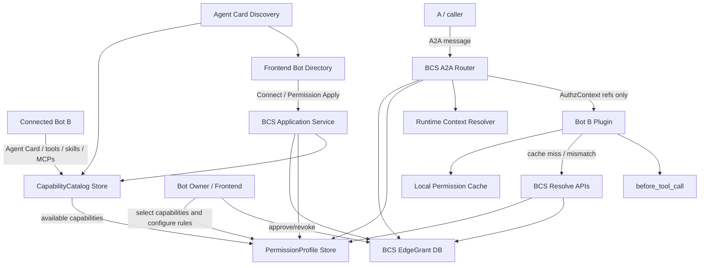
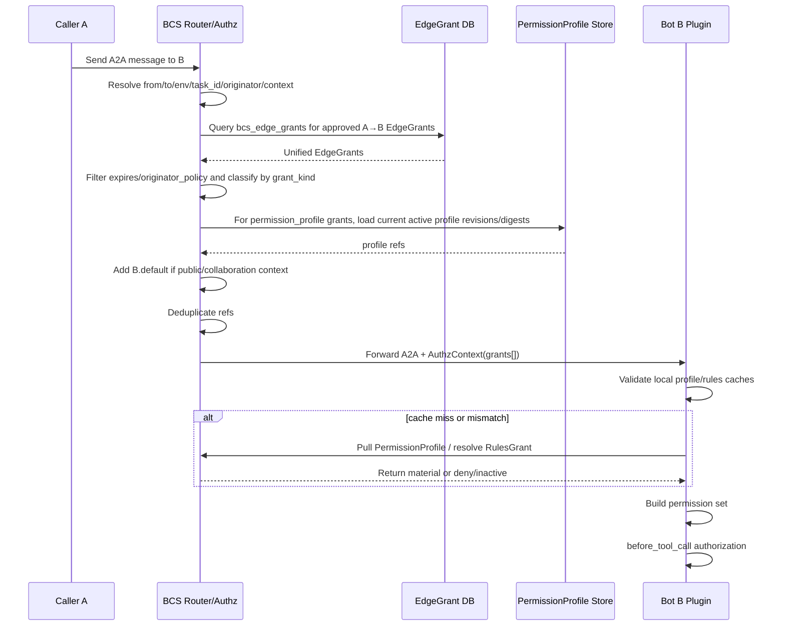
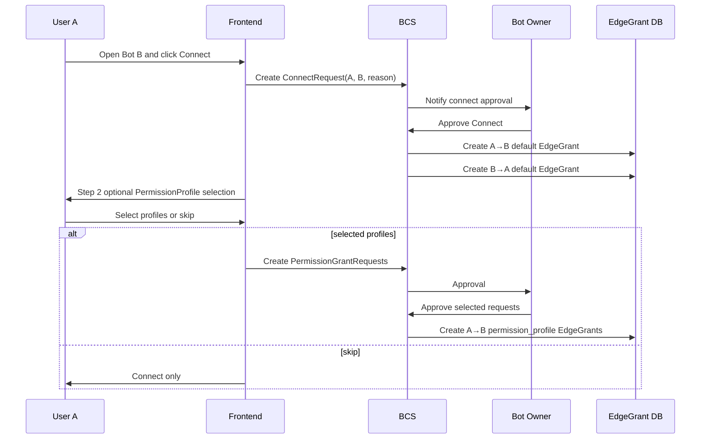

# BCS / A2A 鉴权最终设计详稿

> 日期：2026-08-07  
> 状态：实现前最终设计基线（用于后续 Superpowers spec / plan / subagent 拆解）  
> 范围：BCS 边授权模型、A2A 授权上下文传递、Bot 本地鉴权缓存、权限申请/审批、公开 Bot 与协作场景授权语义。  
> 重要说明：本文以 2026-08-06 之后和 mentor 重新确认的方案为准。早期文档中出现的 `role`、`role_def_version` 历史钉住、`edge_id` 下发、`VirtualGrant`、`ActiveGrantSnapshot`、`PermissionProfile + extra_rules` 等方案均不作为实现基线。

---

## 0. 阅读和收敛来源

本文件综合了 2026-07-16 至 2026-08-06 多轮设计文档、briefing、HTML 讲解稿与 grilling 纪要，目标是把历史讨论收敛成一份可以进入实现计划的单一事实源。

已纳入阅读/对齐的主要文件：

- `docs/superpowers/specs/2026-07-16-bcs-edge-permission-briefing.md`
- `docs/superpowers/specs/2026-07-16-bcs-edge-permission-design.md`
- `docs/superpowers/specs/2026-07-16-bcs-edge-permission-design.html`
- `docs/superpowers/specs/2026-07-21-bcs-edge-permission-design.html`
- `docs/superpowers/specs/2026-07-21-bcs-proxy-briefing.md`
- `docs/superpowers/specs/2026-07-24-bcs-edge-permission-design.md`
- `docs/superpowers/specs/2026-07-24-bcs-edge-permission-design.html`
- `docs/superpowers/specs/2026-07-27-bcs-edge-permission-briefing.html`
- `docs/superpowers/specs/2026-07-30-bcs-cooperation-auth-mvp-design.md`
- `docs/superpowers/specs/2026-07-31-bcs-a2a-cooperation-auth-design.md`
- `docs/superpowers/specs/2026-07-31-bcs-a2a-grill-log.md`
- `docs/superpowers/specs/2026-08-06-a2a-permission-meeting-issues.md`
- `docs/superpowers/specs/a2a-permission-and-grant-workflow.md`
- `docs/superpowers/specs/a2a-permission-and-grant-workflow-briefing.html`
- `docs/superpowers/specs/edge-permission-schema.md`

注意：历史文件中存在不同阶段的方案演进。本文不逐字继承旧文档，而是保留被确认的部分，并显式废弃已被 mentor / leader 重新收敛掉的部分。

---

## 1. 最终一句话

**BCS 维护真实边库和 Bot 权限包；申请/好友通过时落真实 EdgeGrant；公开聊天和协作群组不批量落边，而由 BCS 根据运行时 context 补目标 Bot 的 default 权限包；A2A 消息不下发完整权限，也不下发 `edge_id`，只下发 BCS 本次计算出的统一 `grants[]` 引用；Bot 本地根据 `kind + ref_id + revision + digest` 校验缓存，缺失或不匹配就向 BCS 拉取/resolve，拉取失败就 deny。**

---

## 2. 已废弃方案清单

为避免实现时混入旧方案，先列清楚哪些内容已经不是最终方案。

| 旧方案 / 旧术语 | 当前状态 | 原因 |
|---|---|---|
| `role` 作为核心领域名 | 废弃，改为 `PermissionProfile` / 权限包 | `role` 容易被理解为身份角色；实际表达的是可申请、可审批、可复用的权限配置包。 |
| `RoleDef` / `role_def_id` | 废弃命名，映射为 `PermissionProfile` / `permission_profile_id` | 后续产品、领域模型、协议字段统一。 |
| EdgeGrant 钉住旧 `role_def_version`，旧边永远按旧 role 鉴权 | 废弃 | 产品语义改为：owner 修改权限包后，已有权限包授权默认跟随最新定义生效。 |
| 完全取消版本 / revision / digest | 不采纳 | 分布式缓存必须有 freshness proof；否则 Bot 本地无法证明自己使用的是最新版。 |
| `PermissionProfile + extra_rules` 混合授权 | MVP 废弃 | 会把权限包授权变成私有变体，删除/修改权限包后的语义不清。 |
| A2A 下发完整 rules | 废弃 | 臃肿、泄漏目标 Bot 能力细节、容易诱导错误信任消息内容。 |
| A2A 下发 `edge_id` / `edge_version` | 废弃 | mentor 最新方案要求 A2A 直接下发可消费的权限包引用和 rules 授权引用；edge 是 BCS 内部事实。 |
| Bot 本地缓存 `EdgeGrant` / `ActiveGrantSnapshot` 作为鉴权材料 | 废弃 | Bot 本地只需要缓存 `PermissionProfile` 与 `RulesGrant` 的可鉴权材料。 |
| `VirtualGrant` / `ActiveGrantSnapshot` 作为核心领域对象 | 废弃 | default 补充是 BCS runtime context 计算结果，不需要新建核心虚拟边模型。 |
| 协作群组成员两两落 default 边 | 废弃 | 群组成员数大时边爆炸；协作关系通常临时有效。 |
| 公开 Bot 为所有访问者预先落 EdgeGrant | 废弃 | public chat 是 runtime context 补 default，不是永久授权边。 |
| Agent Card 角色可见性分 public/private/hidden | 本期不做 | mentor 已确认本阶段不考虑安全可见性复杂度；加好友流程第二步可展示可申请权限包。 |

---

## 3. 领域词汇表

### 3.1 Actor

图中的主体。MVP 中主要是：

- `human`：人类用户，例如 `H_alice`。
- `bot`：Bot，例如 `bot_xxx`。
- `service`：服务主体可预留，但本期重点仍是 human / bot。

### 3.2 PermissionProfile（权限包）

目标 Bot B 暴露的一组可复用权限配置。

它不是 caller 的身份，而是 B 对外提供的一种“可申请能力包”。例如：

- `default`：基础聊天 / 低风险交互权限。
- `reader`：只读某些资源。
- `lark_doc_writer`：写某类 Lark 文档。
- `repo_operator`：操作指定仓库的有限命令。
- `owner` / `co_editor` / `team_member`：系统或产品场景预置权限包。

推荐产品中文名：**权限包 / 能力包**。  
推荐内部名：`PermissionProfile`。

### 3.3 CapabilityCatalog（能力目录）

`CapabilityCatalog` 是目标 Bot B 暴露的**原子能力目录**，来自 Bot 的 Agent Card、tools、skills、MCP servers、agent calls 以及 Bot 自定义 capability 声明。

它回答的是：

```text
这个 Bot 理论上有哪些能力可以被配置？
每种能力的资源范围和参数约束是什么？
```

它不是授权事实，也不是申请结果。它是 PermissionProfile 的下层素材。

典型条目：

```jsonc
{
  "capability_id": "cap_lark_doc_write",
  "tool": "LarkDoc",
  "operation": "write",
  "specifier_schema": "doc:<doc_id>",
  "description": "写入指定 Lark 文档"
}
```

三层关系是：

```text
Bot raw capabilities
  → CapabilityCatalog
  → Rule
  → PermissionProfile
```

也就是说，Owner 不是凭空创建 PermissionProfile，而是从 `CapabilityCatalog` 里选择能力、配置 `allow/deny` 和资源范围，组装成可申请的权限包。

### 3.4 Rule

权限包或独立 rules grant 中的最小判定单元。

基础形态：

```json
{
  "tool": "LarkDoc",
  "specifier": "doc:123",
  "decision": "allow"
}
```

字段含义：

| 字段 | 含义 |
|---|---|
| `tool` | 工具或能力类别，也可以理解为 capability category。例如 `chat`、`LarkDoc`、`Bash`、`Read`、`Edit`、`WebFetch`、`WebSearch`、`Skill`、`MCP`、`Agent`、`exec`，以及 Bot 自定义暴露的 tool / capability。 |
| `specifier` | tool 内部资源范围，例如 `doc:123`、`repo:abc/*`、`cmd:git status`、`skill:repo-review`、`mcp:jira/issue:123`。 |
| `decision` | `allow` 或 `deny`。`ask` 如需保留，应属于 Bot 二层 HITL 或后续扩展，不作为本期 BCS 第一层核心。 |

### 3.5 EdgeGrant（授权边）

BCS 边库中的统一持久授权事实。读作：

```text
A → B: A 被批准在某个 env/context 下调用 B 的某类能力。
```

注意：EdgeGrant 是 BCS 内部持久事实；A2A 消息不直接把 `edge_id` 发给 Bot。

MVP 中 EdgeGrant 是**一个统一结构体 / 一张核心授权边表**，用 `grant_kind` 区分授权对象：

```text
grant_kind = permission_profile
  grant_ref_id = permission_profile_id
  rules = null

grant_kind = rules
  grant_ref_id = rules_grant_ref
  rules = 独立 rules JSON
```

领域心智上不要把它理解成两套 EdgeGrant；它是一套授权边，两种 grant subject。

### 3.6 RulesGrant（独立 rules 授权）

当 A 不申请某个完整权限包，而只申请几条独立规则时，审批通过后形成 rules grant。

它仍然由同一张 EdgeGrant / 同一个 EdgeGrant 领域结构承载，只是：

```text
grant_kind = rules
grant_ref_id = rules_grant_ref
rules = [...]  // 独立 rules
```

对 A2A / Bot 本地鉴权来说，暴露的是 opaque 的 `rules_grant_ref`，而不是 `edge_id`。

### 3.7 Default PermissionProfile

每个 Bot 必须有一个 `default` 权限包。

它代表“最低限度可交互能力”，例如基础聊天、查看公开信息、触发低风险行为。default 不等于所有权限，也不等于高阶能力。

### 3.8 Context

BCS 路由 A2A 时掌握的运行时上下文，例如：

- direct / normal chat
- public bot chat
- collaboration group chat
- connect-approved relationship
- env：`prod` / `pre` / `dev` / `singlebox`
- task / session / originator

最终授权不是只看边库，而是：

```text
edge database + runtime context → 本次 A2A 可用授权引用
```

---

## 4. 总体架构



核心分工：

| 模块 | 责任 |
|---|---|
| Frontend | 展示 Bot、Connect、权限包申请、审批、授权状态与排查视图。 |
| CapabilityCatalog Store | 保存 Bot 从 Agent Card / tools / skills / MCPs / 自定义 capabilities 暴露出来的原子能力目录，作为 PermissionProfile 的配置素材。 |
| PermissionProfile Store | 保存 Owner 基于 CapabilityCatalog 组装出的权限包定义、revision、digest、状态。 |
| BCS Application | 处理申请、审批、落边、撤销、权限包管理、公开/协作 context 判定。 |
| BCS EdgeGrant DB | 保存真实持久授权边。EdgeGrant 是统一结构，用 `grant_kind + grant_ref_id` 区分授权对象。 |
| BCS A2A Router/Authz | 每次消息路由时根据边库和 context 计算本次可用授权引用。 |
| Bot Local Plugin | 消费 AuthzContext，校验/拉取缓存，拼出 permission set，在 before_tool_call 执行本地鉴权。 |

架构约束：

- 权限策略属于 BCS domain/application，不应散落在 HTTP/WebSocket adapter 中。
- A2A 协议字段属于稳定 contract，变更需有协议文档和 conformance / compatibility tests。
- Bot 本地插件消费的是已定义的 Plugin API / control API，不应从消息里信任 caller 自带权限内容。

---

## 5. 持久事实模型

### 5.1 PermissionProfile

```jsonc
{
  "permission_profile_id": "profile_B_default",
  "bot_id": "B",
  "name": "default",
  "display_name": "基础聊天",
  "description": "允许基础聊天和低风险交互",
  "rules_template": [
    { "tool": "chat", "specifier": "*", "decision": "allow" }
  ],
  "risk_level": "low",
  "self_apply": false,
  "approver_policy": { "type": "bot_owner" },
  "revision": 8,
  "digest": "sha256:...",
  "status": "active",
  "created_by": "H_owner",
  "created_at": 1785900000000,
  "updated_at": 1785900000000
}
```

字段说明：

| 字段 | 说明 |
|---|---|
| `permission_profile_id` | 稳定 ID。 |
| `bot_id` | 该权限包属于哪个目标 Bot。 |
| `name` | Bot 内唯一名称，例如 `default`、`reader`。 |
| `rules_template` | 该权限包包含的规则模板。 |
| `revision` | 单调递增版本，用于 Bot 本地缓存 freshness 校验。 |
| `digest` | 对 canonical PermissionProfile 内容计算的摘要，用于发现缓存污染/序列化错误。 |
| `status` | `active` / `disabled` / `deleted` 等。禁用/删除后运行时不可用。 |

#### 5.1.1 修改语义

Owner 修改 PermissionProfile 后：

```text
BCS 更新 PermissionProfile.rules_template / metadata
BCS 递增 revision
BCS 重算 digest
后续 A2A 引用最新 revision/digest
Bot 本地如果缓存旧 revision/digest，则必须拉取最新定义
```

产品语义：已有 permission_profile grant 自动跟随最新定义生效。  
技术语义：Bot 必须通过 `revision + digest` 证明缓存是 BCS 本次要求的最新版。

#### 5.1.2 禁用 / 删除语义

PermissionProfile 被禁用或删除后：

- BCS 运行时不应再把它加入 AuthzContext 的 `grants[]`。
- 已有依赖该 PermissionProfile 的 EdgeGrant 可保留为审计事实，但运行时视为不可用。
- 如果 Bot 本地持有旧缓存，但 A2A 不再下发该 ref，则旧缓存不会参与本次鉴权。
- 若误收到已禁用 profile 的 ref，resolve API 必须拒绝或返回不可用状态，Bot deny。

### 5.2 EdgeGrant

EdgeGrant 是一套统一领域结构，MVP 推荐用一张核心 `bcs_edge_grants` 表承载。它不是两张表、两套模型，而是通过 `grant_kind` 表达这条边授权的对象是什么。

统一结构：

```jsonc
{
  "edge_id": "edge_123",
  "from_id": "A",
  "to_id": "B",
  "env": "prod",

  "grant_kind": "permission_profile",
  "grant_ref_id": "profile_B_writer",

  "rules": null,
  "rules_revision": null,
  "rules_digest": null,

  "status": "approved",
  "applicant": "A",
  "approver": "H_owner_of_B",
  "requested_at": 1785900000000,
  "decided_at": 1785900010000,

  "originator_policy_type": "any",
  "originator_policy_data": null,
  "expires_at": null,

  "created_at": 1785900000000,
  "updated_at": 1785900010000
}
```

`grant_kind = "rules"` 时：

```jsonc
{
  "edge_id": "edge_456",
  "from_id": "A",
  "to_id": "B",
  "env": "prod",

  "grant_kind": "rules",
  "grant_ref_id": "rg_opaque_abc",

  "rules": [
    { "tool": "LarkDoc", "specifier": "doc:123", "decision": "allow" }
  ],
  "rules_revision": 3,
  "rules_digest": "sha256:...",

  "status": "approved",
  "originator_policy_type": "any",
  "expires_at": null
}
```

字段解释：

| 字段 | 说明 |
|---|---|
| `grant_kind` | `permission_profile` 或 `rules`。 |
| `grant_ref_id` | 多态引用。`permission_profile` 时表示 `permission_profile_id`；`rules` 时表示 opaque `rules_grant_ref`。 |
| `rules` | 仅 `grant_kind=rules` 时填写；`permission_profile` 授权时必须为 `null`。 |
| `rules_revision` / `rules_digest` | 仅 `grant_kind=rules` 时填写，用于 Bot 本地 rules grant 缓存校验。 |

关键约束：

1. `grant_kind` 只能是 `permission_profile` 或 `rules`。
2. `grant_kind=permission_profile` 时：
   - `grant_ref_id` 必须是目标 Bot B 的某个 `permission_profile_id`。
   - `rules` / `rules_revision` / `rules_digest` 必须为 `null`。
   - EdgeGrant 不复制 `PermissionProfile.rules_template`。
3. `grant_kind=rules` 时：
   - `grant_ref_id` 必须是 BCS 生成的 opaque `rules_grant_ref`。
   - `rules` / `rules_revision` / `rules_digest` 必须非空。
4. MVP 不支持 `permission_profile + extra_rules`。
5. EdgeGrant 是 BCS 内部事实，A2A 不下发 `edge_id`。
6. DB 可以用 nullable 字段实现统一表，但领域层建议用 enum / tagged union，避免业务代码到处处理无意义的 optional。

领域层推荐表达：

```rust
struct EdgeGrant {
    edge_id: EdgeId,
    from_id: ActorId,
    to_id: ActorId,
    env: Env,
    subject: GrantSubject,
    status: GrantStatus,
    expires_at: Option<i64>,
}

enum GrantSubject {
    PermissionProfile {
        permission_profile_id: String,
    },
    Rules {
        rules_grant_ref: String,
        rules: Vec<Rule>,
        revision: i64,
        digest: String,
    },
}
```

### 5.3 RulesGrantRef 语义

`rules_grant_ref` 不需要单独代表另一张必需表；MVP 中它可以就是 `bcs_edge_grants.grant_ref_id` 在 `grant_kind=rules` 时的取值。

```text
EdgeGrant.grant_ref_id
  grant_kind=permission_profile → permission_profile_id
  grant_kind=rules              → rules_grant_ref
```

设计原则：

- `rules_grant_ref` 对 Bot 来说是不透明 ID。
- A2A 下发 `rules_grant_ref + revision + digest`。
- BCS resolve 时用 `rules_grant_ref` 找回内部 EdgeGrant，并校验 `from_id`、`to_id`、`env`、`revision`、`digest`、`status`、`expires_at`。
- `rules_grant_ref` 推荐按 rules grant revision 稳定生成；rules 变更时 revision/digest 变化，必要时也可以生成新的 ref。
- 内部审计仍可追溯 `edge_id`，但 `edge_id` 不进入 A2A payload。

### 5.4 PlatformGuard

平台守卫是 BCS / 平台定义的最高优先级安全底线，例如：

```json
[
  { "tool": "Bash", "specifier": "rm -rf /*", "decision": "deny" },
  { "tool": "Bash", "specifier": "sudo *", "decision": "deny" }
]
```

语义：

- 不归 Bot owner 配置。
- 不可被 PermissionProfile 或 rules grant 覆盖。
- 本地 before_tool_call 先判平台守卫，命中 deny 直接 deny。
- 平台守卫同样需要 revision/digest 缓存校验；如 MVP 暂不下发到 A2A，也必须由 Bot 本地通过控制通道保持可校验的最新版本。

---

## 6. 什么时候落边，什么时候只靠 context 补 default

### 6.1 会落真实 EdgeGrant 的场景

#### 场景一：Connect / 加好友审批通过

Connect 通过后落双向 default 边：

```text
A → B: permission_profile grant = B.default
B → A: permission_profile grant = A.default
```

原因：Connect 表达的是双方建立基础可交互关系。双向 default 边是持久事实，后续普通聊天时无需 runtime 特殊补充。

#### 场景二：专门申请权限包

A 申请 B 的某个 PermissionProfile，审批通过后落：

```text
A → B: permission_profile grant = profile_B_xxx
```

这是高阶能力授权，必须显式申请、审批、审计、撤销。

#### 场景三：专门申请独立 rules

A 只需要几条独立 rules，不适合抽象为可复用权限包，审批通过后落：

```text
A → B: rules grant = [rules...]
```

这类授权不绑定 PermissionProfile。

### 6.2 不批量落边、由 runtime context 补 default 的场景

#### 场景一：公开 Bot 聊天

公开 Bot B 被 A 直接点开聊天：

```text
BCS 查询 A→B 已有 EdgeGrant
BCS 发现本次 context = public_bot_chat
BCS 额外补 B.default PermissionProfile ref
A2A 下发统一 `grants[]` refs
```

不为所有访问公开 Bot 的 actor 预先落永久 EdgeGrant。

#### 场景二：协作群组

A 在协作群组 G 内向 B 发消息：

```text
BCS 查询 A→B 已有 EdgeGrant
BCS 发现本次 context = collaboration_group
BCS 校验 A、B 都在群组/当前 session 范围内
BCS 额外补 B.default PermissionProfile ref
A2A 下发统一 `grants[]` refs
```

不为群组成员两两落永久 default 边。

约束：

- 只补目标 Bot B 的 default。
- 不补高阶权限包。
- 群组解散、成员退出、session 过期后不再补。
- 群组内需要高阶权限时仍走显式权限申请。

### 6.3 去重规则

BCS 最终组装 AuthzContext 的统一 `grants[]` 时需要去重：

```text
同一个 `(kind, ref_id)` 出现多次
  → 保留一个 ref
  → source 可记录多个来源，或保留最高优先级 source
```

推荐 source 优先级仅用于排查展示，不影响权限：

```text
edge_grant > connect_default > public_default > collaboration_default
```

如果 B.default 既来自真实 EdgeGrant，又来自 public/collaboration context，最终只下发一次。

---

## 7. BCS 运行时授权计算

### 7.1 输入

每次 A2A 消息路由，BCS Authz 需要输入：

```text
caller_id: 本跳直接调用者 A
target_id: 本跳目标 Bot B
env: 当前环境
task_id: 本次任务 ID
originator: 初始发起者，由 BCS 绑定/注入
context: public / collaboration / direct / connect / etc.
now: 当前时间
```

### 7.2 查询边库

BCS 查询真实持久 EdgeGrant：

```sql
SELECT * FROM bcs_edge_grants
 WHERE from_id = :caller_id
   AND to_id = :target_id
   AND env = :env
   AND status = 'approved'
   AND (expires_at IS NULL OR expires_at > :now)
```

再对每条边执行：

- `originator_policy_type` 匹配。
- target Bot 状态可达性检查。
- PermissionProfile active 检查。
- grant_kind 分类。

### 7.3 补 context default

BCS 根据 runtime context 判断是否额外加入 B.default：

| context | 是否补 B.default | 是否落边 |
|---|---:|---:|
| 普通 direct chat，已有 connect | 否，default 已来自边库 | Connect 通过时已落边 |
| 公开 Bot 聊天 | 是 | 否 |
| 协作群组消息 | 是 | 否 |
| 高阶权限调用 | 否，需要已有显式 EdgeGrant | 申请审批通过时落边 |

### 7.4 输出

BCS 输出 AuthzContext 中可消费的统一授权引用：

```text
grants[]  // 每一项用 kind 区分 permission_profile / rules
```

BCS 不输出：

- 完整 rules。
- `edge_id`。
- caller 自声明的权限。
- B 的完整权限包目录。

---

## 8. A2A AuthzContext 设计

### 8.1 字段形态

```jsonc
{
  "authz_context": {
    "task_id": "task_01J...",
    "run_id": "run_01J...",
    "from_id": "A",
    "to_id": "B",
    "env": "prod",
    "originator": "H_alice",
    "context": {
      "type": "collaboration",
      "group_id": "G1"
    },
    "grants": [
      {
        "kind": "permission_profile",
        "ref_id": "profile_B_default",
        "revision": 8,
        "digest": "sha256:...",
        "source": "collaboration_default"
      },
      {
        "kind": "permission_profile",
        "ref_id": "profile_B_writer",
        "revision": 5,
        "digest": "sha256:...",
        "source": "edge_grant"
      },
      {
        "kind": "rules",
        "ref_id": "rg_opaque_abc",
        "revision": 3,
        "digest": "sha256:...",
        "source": "edge_grant"
      }
    ],
    "issued_at": 1785900000000,
    "expires_at": 1785900300000
  }
}
```

### 8.2 字段说明

| 字段 | 说明 |
|---|---|
| `task_id` | BCS 在首跳生成，跨跳稳定，用于绑定 originator。 |
| `run_id` | 每跳 / 每次运行实例 ID，可与 A2A 原有 run 语义对齐。 |
| `from_id` | 本跳直接 caller。 |
| `to_id` | 本跳目标 Bot。 |
| `originator` | 初始发起者，由 BCS 根据 `task_id` 注入，Bot 不可自填。 |
| `context` | BCS 认定的运行时上下文，用于审计和排查。 |
| `grants` | 本次可用的统一授权引用数组；每一项通过 `kind` 区分 `permission_profile` / `rules`。 |
| `issued_at` / `expires_at` | AuthzContext 的短 TTL，避免长期复用。 |

### 8.3 `source` 取值

推荐枚举：

```text
edge_grant
connect_default
public_default
collaboration_default
owner_default
team_member
co_editor
```

说明：

- `source` 是审计/排查字段，不作为安全判定唯一依据。
- Bot 本地不得因为 source 字符串就自行放行，仍必须校验 ref 的 revision/digest 并拉取实际内容。

### 8.4 AuthzContext 信任边界

Bot B 信任的是：

```text
BCS 注入的 AuthzContext + BCS resolve API 返回的材料 + revision/digest 校验
```

Bot B 不信任：

- Caller A 自己携带的 rules。
- 中间 Bot 修改后的权限内容。
- 本地未校验缓存。
- 过期 AuthzContext。

MVP 可以先不做签名，但协议应预留签名字段或后续扩展位：

```jsonc
"signature": null
```

未来如要增强跨进程/离线异步安全，可由 BCS 对 AuthzContext canonical payload 签名，Bot 验签。

---

## 9. Bot 本地缓存与拉取

### 9.1 本地缓存内容

Bot B 本地插件缓存两类授权材料：

```text
permission_profile_cache
rules_grant_cache
```

可选缓存：

```text
platform_guard_cache
```

Bot 本地不再缓存 EdgeGrant 作为鉴权主材料。

### 9.2 PermissionProfile cache

Key：

```text
(permission_profile_id, revision)
```

Value：

```jsonc
{
  "permission_profile_id": "profile_B_default",
  "revision": 8,
  "digest": "sha256:...",
  "bot_id": "B",
  "name": "default",
  "rules_template": [
    { "tool": "chat", "specifier": "*", "decision": "allow" }
  ],
  "status": "active",
  "fetched_at": 1785900000000
}
```

校验条件：

- `permission_profile_id` 匹配。
- `revision` 匹配。
- `digest` 匹配。
- `bot_id == self`。
- `status == active`。

### 9.3 RulesGrant cache

Key：

```text
(rules_grant_ref, revision)
```

Value：

```jsonc
{
  "rules_grant_ref": "rg_opaque_abc",
  "revision": 3,
  "digest": "sha256:...",
  "from_id": "A",
  "to_id": "B",
  "env": "prod",
  "rules": [
    { "tool": "LarkDoc", "specifier": "doc:123", "decision": "allow" }
  ],
  "expires_at": null,
  "status": "active",
  "fetched_at": 1785900000000
}
```

校验条件：

- `rules_grant_ref` 匹配。
- `revision` 匹配。
- `digest` 匹配。
- `from_id == authz_context.from_id`。
- `to_id == self`。
- `env == authz_context.env`。
- 未过期。
- `status == active`。

### 9.4 拉取接口

推荐控制接口：

```http
GET /authz/permission-profiles/{permission_profile_id}?revision=8
```

返回指定 revision 的 PermissionProfile，或在 latest-only 实现中返回当前 revision 并要求与 AuthzContext 一致。

```http
POST /authz/rules-grants/resolve
```

请求：

```jsonc
{
  "rules_grant_ref": "rg_opaque_abc",
  "revision": 3,
  "digest": "sha256:...",
  "from_id": "A",
  "to_id": "B",
  "env": "prod"
}
```

返回：

```jsonc
{
  "rules_grant_ref": "rg_opaque_abc",
  "revision": 3,
  "digest": "sha256:...",
  "from_id": "A",
  "to_id": "B",
  "env": "prod",
  "rules": [
    { "tool": "LarkDoc", "specifier": "doc:123", "decision": "allow" }
  ],
  "expires_at": null,
  "status": "active"
}
```

### 9.5 缓存 miss / mismatch 规则

```text
cache hit + revision/digest/fields valid
  → 使用缓存

cache miss 或 revision/digest/fields mismatch
  → 向 BCS 拉取/resolve

拉取成功且校验通过
  → 更新缓存并继续鉴权

拉取失败 / 超时 / digest 不匹配 / BCS 返回 inactive
  → deny
```

安全不依赖 BCS 主动下发。主动下发只能作为缓存预热和失效通知。

### 9.6 LRU / TTL

本地缓存可以采用：

- max entries
- max bytes
- TTL
- LRU eviction
- disk persistence（可选）

安全原则：

```text
缓存淘汰只会导致下一次拉取，不会导致默认 allow。
```

---

## 10. 本地 tool 鉴权语义

### 10.1 拼接 permission set

Bot 收到 A2A 消息并完成缓存校验后：

```text
permission_set =
  platform_guard_rules
  + union(permission_profile.rules_template)
  + union(rules_grant.rules)
```

其中：

- `permission_profile.rules_template` 来自本次 AuthzContext 下发的 `grants[]` 中 `kind=permission_profile` 的引用。
- `rules_grant.rules` 来自本次 AuthzContext 下发的 `grants[]` 中 `kind=rules` 且成功 resolve 的引用。
- 不在 AuthzContext 中的本地缓存不得参与本次鉴权。

### 10.2 判定顺序

推荐判定顺序：

```text
1. 平台守卫 deny 命中 → deny
2. PermissionProfile / RulesGrant 中有匹配 allow → allow
3. 有匹配 deny 且没有 allow → deny
4. 全部未命中 → deny
```

说明：

- 平台守卫优先级最高。
- 普通 rules 内部是否 allow 优先，需要和历史模型保持一致；MVP 推荐“平台守卫 deny 绝对优先，业务 rules allow 优先”。
- 如果需要更精细的 priority，可在 Rule 内增加 `priority` 字段，但不应改变本期主流程。

### 10.3 本地鉴权只发生在 before_tool_call

A2A 消息准入由 BCS 做；具体 tool/specifier 细判由 Bot 本地插件在 `before_tool_call` 做。

原因：

- BCS 不一定知道具体 tool call 参数。
- Bot 本地插件最接近工具执行点。
- 这符合“两层鉴权”：BCS 决定这次可唤醒/可传递哪些授权引用；Bot 本地决定具体工具调用是否允许。

---

## 11. A2A 运行时流程

### 11.1 总流程



### 11.2 BCS 侧伪代码

```text
function build_authz_context(caller, target, env, task_id, context):
    originator = resolve_originator(task_id, caller)
    assert target is reachable in this env/context

    approved_edge_grants = edge_repo.find_approved(
        from_id=caller,
        to_id=target,
        env=env,
        now=now,
    )

    grants = []

    for grant in approved_edge_grants:
        if not match_originator_policy(grant, originator, caller):
            continue

        if grant.grant_kind == permission_profile:
            profile = profile_repo.get_active(grant.grant_ref_id)
            if profile exists:
                grants.add(ref(kind="permission_profile", ref_id=profile.id, revision=profile.revision, digest=profile.digest, source="edge_grant"))

        if grant.grant_kind == rules:
            grants.add(ref(kind="rules", ref_id=grant.grant_ref_id, revision=grant.rules_revision, digest=grant.rules_digest, source="edge_grant"))

    if should_add_default(context, caller, target):
        default_profile = profile_repo.get_active_default(target)
        if default_profile exists:
            grants.add(ref(kind="permission_profile", ref_id=default_profile.id, revision=default_profile.revision, digest=default_profile.digest, source=context_default_source(context)))

    grants = dedupe(grants)

    if empty(grants):
        deny_before_wakeup()

    return AuthzContext(...)
```

### 11.3 Bot 侧伪代码

```text
function authorize_tool_call(authz_context, tool_call):
    assert authz_context.to_id == self_id
    assert authz_context.expires_at > now

    profiles = []
    rules_grants = []
    for ref in authz_context.grants:
        if ref.kind == "permission_profile":
            profile = profile_cache.get(ref.ref_id, ref.revision)
            if not valid_profile(profile, ref):
                profile = bcs.get_permission_profile(ref.ref_id, ref.revision)
            if not valid_profile(profile, ref):
                return deny
            profiles.add(profile)

        if ref.kind == "rules":
            grant = rules_grant_cache.get(ref.ref_id, ref.revision)
            if not valid_rules_grant(grant, ref, authz_context):
                grant = bcs.resolve_rules_grant(ref.ref_id, authz_context.from_id, self_id, authz_context.env)
            if not valid_rules_grant(grant, ref, authz_context):
                return deny
            rules_grants.add(grant)

    permission_set = platform_guard + profiles.rules_template + rules_grants.rules
    return evaluate(permission_set, tool_call)
```

---

## 12. 申请、审批与授权生成流程

### 12.1 三件事必须分开

```text
Discovery / Agent Card
  只是发现和展示 Bot。

Connect Request
  申请建立基础关系。

Permission Request
  申请某个高阶 PermissionProfile 或独立 rules grant。

Approved EdgeGrant
  才是后续 A2A runtime 可使用的持久授权事实。
```

### 12.2 Bot 接入与 Agent Card

BCS 作为一个 Bot / 平台服务，通过 discovery / Agent Card 获取接入 Bot 的基本信息与可申请权限包信息。

本期不设计复杂安全可见性：

- 前端可以展示 Bot 暴露的可申请 PermissionProfile。
- 不区分 public / private / hidden permission profiles。
- 是否展示 rules 明细可按产品需要简化；但 A2A runtime 仍不传完整 rules。

Agent Card 推荐包含：

```jsonc
{
  "bot_id": "B",
  "name": "Doc Writer Bot",
  "description": "帮助处理文档",
  "public_chat": true,
  "grants": [
    {
      "kind": "permission_profile",
      "permission_profile_id": "profile_B_default",
      "name": "default",
      "display_name": "基础聊天",
      "description": "允许基础聊天",
      "risk_level": "low",
      "approver_policy": { "type": "auto_or_owner" }
    },
    {
      "permission_profile_id": "profile_B_writer",
      "name": "writer",
      "display_name": "文档写入",
      "description": "允许写指定文档",
      "risk_level": "high",
      "approver_policy": { "type": "bot_owner" }
    }
  ]
}
```

### 12.3 Connect 两步流程



说明：

- Connect 和权限包申请是两个语义动作。
- 产品交互上可以做成连续两步。
- 第二步可跳过。
- Connect 通过只代表 default 可聊，不代表高阶权限。

### 12.4 独立 rules grant 申请

当用户只申请几条独立 rules：

```text
A submits RulesGrantRequest(to=B, rules=[...])
B owner approves
BCS creates EdgeGrant(kind=rules)
BCS creates/updates rules_grant_ref mapping
后续 A2A 下发 rules_grant_ref
```

MVP 产品界面可以暂缓开放 rules grant，但后端模型应保留。

### 12.5 权限包变更影响提示

Owner 编辑 PermissionProfile 时，前端必须提示：

```text
该权限包的修改会影响所有已批准获得该权限包的 caller。
后续 A2A 鉴权将按最新 revision 生效。
```

Owner 禁用 / 删除 PermissionProfile 时，前端必须提示：

```text
依赖该权限包的授权将无法在运行时生效。
```

---

## 13. 场景设计

### 13.1 普通好友聊天

```text
前置：A 和 B connect 已审批通过
持久边：A→B default，B→A default

A sends message to B
  BCS 查询 bcs_edge_grants 中 A→B 的 approved EdgeGrants
  按 grant_kind 分类，命中 grant_kind=permission_profile 且 grant_ref_id=B.default
  BCS 下发 profile_B_default ref
  B 本地校验/拉取 profile_B_default
  before_tool_call 按 default rules 鉴权
```

### 13.2 公开 Bot 聊天

```text
前置：B 是公开 Bot，A 与 B 不一定 connect
持久边：可能没有 A→B edge

A opens public Bot B and chats
  BCS 查询 bcs_edge_grants 中 A→B 的 approved EdgeGrants
  结果可能为空
  BCS 判断 context=public_bot_chat
  BCS 补 B.default ref
  A2A 下发 profile_B_default ref
  B 本地校验/拉取并鉴权
```

关键：公开 Bot 可聊不是永久授权边。

### 13.3 协作群组

```text
前置：A 和 B 都在 collaboration group G 的有效 session 中
持久边：A→B 可能没有 default edge

A sends group-context A2A message to B
  BCS 查询 bcs_edge_grants 中 A→B 的 approved EdgeGrants
  BCS 判断 context=collaboration_group 且成员关系有效
  BCS 按 grant_kind 分类生成已有 EdgeGrant 对应 refs
  BCS 补 B.default ref
  B 本地鉴权
```

关键：群组不导致两两建边；高阶权限仍需单独申请。

### 13.4 高阶权限包调用

```text
前置：A 已申请并被批准 B.writer 权限包
持久边：A→B profile_B_writer EdgeGrant

A sends message to B
  BCS 查询 bcs_edge_grants 中 A→B 的 approved EdgeGrants
  按 grant_kind 分类，命中 grant_kind=permission_profile 且 grant_ref_id=profile_B_writer
  如果同时有 default，也一起下发并去重
  B 本地加载 default + writer
  tool call 命中 writer allow → allow
```

### 13.5 独立 rules grant 调用

```text
前置：A 被批准一条独立 rules grant，例如 doc:123 write
持久边：A→B rules grant

A sends message to B
  BCS 查询 bcs_edge_grants 中 A→B 的 approved EdgeGrants
  按 grant_kind 分类，命中 grant_kind=rules
  BCS 使用该 EdgeGrant.grant_ref_id 作为 rules_grant_ref
  A2A 下发 rules_grant_ref + revision/digest
  B 本地 resolve ref 得到 rules
  before_tool_call 判定 doc:123 write
```

### 13.6 PermissionProfile 更新后

```text
T1: A 已拥有 B.writer
T2: B owner 修改 writer rules_template，revision 5 → 6
T3: A 再次给 B 发消息

BCS 查询 bcs_edge_grants 中 A→B 的 approved EdgeGrants
命中 grant_kind=permission_profile、grant_ref_id=profile_B_writer
BCS 加载 profile_B_writer 当前 active revision=6 digest=d6
A2A 下发 writer@6
B 本地只有 writer@5
B 发现 revision mismatch
B 拉取 writer@6
拉取成功 → 按 writer@6 鉴权
拉取失败 → deny
```

这就是“产品语义跟随最新、技术上仍校验 freshness”。

---

## 14. originator、task_id 与多跳

### 14.1 语义

- `caller/from_id`：本跳直接发送者。
- `originator`：任务最初发起者，由 BCS 根据 `task_id` 绑定。
- `task_id`：跨跳稳定 ID。
- `run_id`：本跳执行实例 ID。

### 14.2 首跳

```text
Human Alice → bot1
  BCS mint task_id
  BCS bind task_id → originator=Alice
  BCS 计算 Alice→bot1 的 refs
  BCS 注入 AuthzContext
```

### 14.3 中转跳

```text
bot1 → bot3
  bot1 outbound 只携 task_id
  BCS 根据 task_id 注入 originator=Alice
  BCS 计算 bot1→bot3 的 refs
  BCS 注入新的 per-hop AuthzContext
```

### 14.4 MVP 安全约束

- Bot 不能自填 originator。
- Bot outbound 没有合法 task_id，MVP 可拒绝。
- originator 本期用于激活/过滤授权，不改变 tool 执行身份。
- tool 执行身份仍是目标 Bot 自己。
- 代理、delegation_depth、original_caller 可预留，但不进本期主线。

---

## 15. 产品功能清单

### 15.1 Bot 广场 / 发现页

需要支持：

- 展示 Bot 名称、头像、简介、标签。
- 展示 Bot 是公开可聊还是需要申请。
- 公开 Bot：直接进入聊天。
- 申请 Bot：展示 Connect 入口。
- 展示可申请 PermissionProfile 列表。
- 明确文案：公开/Connect 只代表 default 可聊，不代表高阶权限。

### 15.2 Connect 申请

需要支持：

- 创建 ConnectRequest。
- Owner 审批 ConnectRequest。
- 审批通过后 BCS 落双向 default EdgeGrant。
- 展示 pending / approved / rejected / revoked 状态。
- Connect 后可以继续申请权限包。

### 15.3 PermissionProfile 管理

Owner 管理台需要支持：

- 查看 Bot 的 PermissionProfiles。
- 创建 / 编辑 / 禁用 / 删除 PermissionProfile。
- 配置 default PermissionProfile。
- 配置 display name、description、risk level、approver policy。
- 编辑时展示影响范围。
- 禁用/删除时展示授权失效影响。

### 15.4 权限申请 / 审批

需要支持：

- 申请某个 PermissionProfile。
- 可选申请独立 rules grant（MVP 产品可暂缓）。
- 审批通过后创建 EdgeGrant。
- 撤销 EdgeGrant。
- 查看某 actor 当前拥有哪些授权。

### 15.5 协作群组说明

需要支持：

- 在群组内说明默认只开放 default 能力。
- 群组解散 / 退出后不保留隐式 default。
- 高阶权限需要单独申请。
- 避免给用户造成“进群=永久授权”的误解。

### 15.6 审计与排查

需要支持：

- 查看某次 A2A 消息 BCS 下发了哪些 PermissionProfile refs / RulesGrant refs。
- 展示每个 ref 的 source。
- 内部审计可追溯到 EdgeGrant edge_id，但不进入 A2A payload。
- 查看一次 tool call 的 allow/deny 原因。
- 查看 Bot 本地缓存 miss/mismatch/resolve failed 日志。

---

## 16. 实现切分建议

本节不是正式 plan，只是为后续 Superpowers plan 做边界提示。

### 16.1 BCS domain / contracts

- 定义 `CapabilityCatalog`、`PermissionProfile`、统一 `EdgeGrant`、`RulesGrantRef`、`AuthzContext` 类型。
- 替换旧 `RoleDef` 命名。
- 明确 `grant_kind` enum。
- A2A protocol 增加 `authz_context.grants[]` 统一模板，用 `kind` 区分 permission_profile / rules。

### 16.2 BCS persistence

- CapabilityCatalog 表 / repo，用于保存 Bot 暴露的原子能力目录。
- PermissionProfile 表 / repo。
- 统一 EdgeGrant 表 / repo，用 `grant_kind + grant_ref_id` 表达 permission_profile / rules 两类授权。
- RulesGrantRef 生成与 resolve 服务；MVP 可直接使用 `EdgeGrant.grant_ref_id` 承载 opaque ref。
- task_id → originator 绑定存储。
- approval event / audit event。

### 16.3 BCS authz application service

- `build_authz_context(caller, target, env, task_id, context)`。
- edge query + originator_policy filter。
- public/collaboration default supplement。
- profile/rules refs dedupe。
- deny-before-wakeup 逻辑。

### 16.4 BCS delivery adapters

- HTTP / WebSocket / A2A adapter 只做协议解析和字段注入，不承载核心策略。
- 首跳 mint task_id。
- 中转跳按 task_id 注入 originator。
- 调用 authz application service 生成 AuthzContext。

### 16.5 Bot local plugin

- AuthzContext 消费。
- PermissionProfile cache。
- RulesGrant cache。
- BCS pull / resolve client。
- before_tool_call evaluator。
- cache LRU / TTL / invalidation。

### 16.6 Frontend / Backend product surface

- Bot discovery / Agent Card 展示。
- Connect 两步流程。
- PermissionProfile 管理。
- Permission grant / rules grant 申请审批；两者最终都写入统一 EdgeGrant 结构。
- 授权排查视图。

---

## 17. 测试与验收建议

### 17.1 Contract tests

需要覆盖：

- A2A AuthzContext schema 兼容性。
- PermissionProfile ref 不携带完整 rules。
- RulesGrant ref 不暴露 edge_id。
- Bot resolve API 校验 from/to/env/revision/digest。

### 17.2 BCS authz unit tests

场景：

1. Connect 后 A→B default 来自真实 EdgeGrant。
2. Public Bot 无边时补 B.default。
3. Collaboration group 无边时补 B.default。
4. Group 退出后不再补 default。
5. 高阶 PermissionProfile 只来自显式 EdgeGrant。
6. PermissionProfile disabled 后不下发 ref。
7. Rules grant 下发 opaque ref。
8. originator_policy 不匹配时 grant 不 active。
9. 多来源 default 去重。

### 17.3 Bot local evaluator tests

场景：

1. profile cache hit 且 digest 匹配 → allow/deny 正常。
2. profile cache miss → pull 成功后继续。
3. profile digest mismatch → pull；pull 失败 deny。
4. rules_grant_ref resolve 成功 → rules 生效。
5. rules_grant_ref from/to/env 不匹配 → deny。
6. 平台守卫 deny 覆盖业务 allow。
7. AuthzContext 过期 → deny。
8. 本地存在但本次 AuthzContext 未引用的缓存不得参与鉴权。

### 17.4 End-to-end tests

建议 E2E：

- 公开 Bot 首次聊天：无 EdgeGrant，但 BCS 补 default，tool 仅 default 范围允许。
- 申请 Bot connect：审批后双向 default 边，聊天可用。
- 权限包申请：审批后高阶 tool 允许。
- 权限包修改：Bot 本地旧缓存 mismatch，拉取最新 revision 后按最新规则执行。
- 协作群组：群内 default 可用，退群后不可用。

---

## 18. 安全与正确性不变量

1. A2A 不携带完整权限规则。
2. A2A 不暴露 `edge_id`。
3. Caller / 中间 Bot 不提供可信权限事实。
4. BCS 是 AuthzContext 的唯一签发者。
5. Bot 本地只消费本次 AuthzContext 引用的 PermissionProfile / RulesGrant。
6. Bot 本地缓存必须校验 `revision + digest`。
7. 缓存 miss / mismatch 必须拉取；拉取失败必须 deny。
8. Owner 修改 PermissionProfile 后，已有 permission_profile grant 跟随最新定义生效。
9. 技术上仍用 revision/digest 确认 Bot 本地拿到的是 BCS 本次声明的版本。
10. PermissionProfile 禁用/删除后，运行时不再下发；resolve 也不得返回 active。
11. Connect 通过会落双向 default EdgeGrant。
12. Public Bot / Collaboration Group 不批量落边，只 runtime 补 default。
13. 群组 default 随 context/session 有效，不是永久授权。
14. 高阶权限必须显式申请并落 EdgeGrant。
15. MVP 不支持 `PermissionProfile + extra_rules`。
16. Rules grant 通过 opaque `rules_grant_ref` 解析，不在 A2A 里暴露完整 rules。
17. Platform guard deny 优先级最高。
18. Tool 执行身份是目标 Bot 自己，originator 本期只用于授权激活/审计。

---

## 19. 与历史文档的映射

| 历史概念 | 最终概念 |
|---|---|
| `role` | `PermissionProfile` / 权限包 |
| `RoleDef` | `PermissionProfile` |
| `role_def_id` | `permission_profile_id` |
| `role_def_version` | `permission_profile_revision`，但语义改为 freshness 校验，不是旧授权永久钉住旧版本 |
| `edge_id` in A2A | 不进入 A2A；BCS 内部审计/resolve 使用 |
| `active_grants` | 映射为 A2A `grants[]` refs，使用 `kind` 区分 permission_profile / rules |
| `edge_grant@version` local cache | 废弃为主缓存；Bot 缓存 `permission_profile_cache` + `rules_grant_cache` |
| `role + extra_rules` | 不支持；改为 PermissionProfile grant 或 rules grant 二选一 |
| `VirtualGrant` | 不建模；public/collaboration default 是 runtime context supplement |
| `ActiveGrantSnapshot` | 不建模；A2A 只传 refs，Bot 按 refs 拉取/校验材料 |

---

## 20. 后续进入正式 spec / plan 前需要钉住的小点

这些点不阻塞总体模型，但正式实现计划需要逐项定具体字段：

1. `digest` canonical JSON 字段集合与排序规则。
2. `rules_grant_ref` 生成策略：推荐每个 rules grant revision 一个稳定 opaque ref。
3. AuthzContext TTL 默认值。
4. PermissionProfile disabled / deleted 的 DB 状态枚举。
5. default PermissionProfile 的 seed 策略和缺失修复策略。
6. public/collaboration context 的校验输入来自哪个服务。
7. platform guard 是否进入 AuthzContext，还是由 Bot 插件独立同步。
8. MVP 是否开放 rules grant 产品申请入口。
9. A2A 签名字段是否本期只预留还是实现。
10. 旧 friend-check 到 edge authz 的迁移步骤。

---

## 21. 最终实现心智模型

实现时只需要记住这条主链：

```text
申请/审批阶段：
  Connect → 双向 default EdgeGrant
  PermissionProfile Request → A→B permission_profile EdgeGrant
  Rules Request → A→B rules EdgeGrant

运行时阶段：
  BCS = edge DB + runtime context → unified grants[]

A2A 阶段：
  消息只带 refs，不带 rules，不带 edge_id

Bot 本地阶段：
  refs → cache check by revision/digest → miss pull from BCS → compose rules → before_tool_call

失败策略：
  任何缺失、不匹配、过期、拉取失败 → deny
```

这就是当前最终收敛的 BCS / A2A 鉴权模型。
