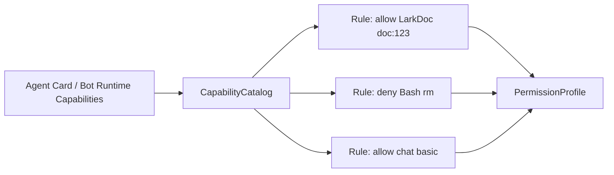
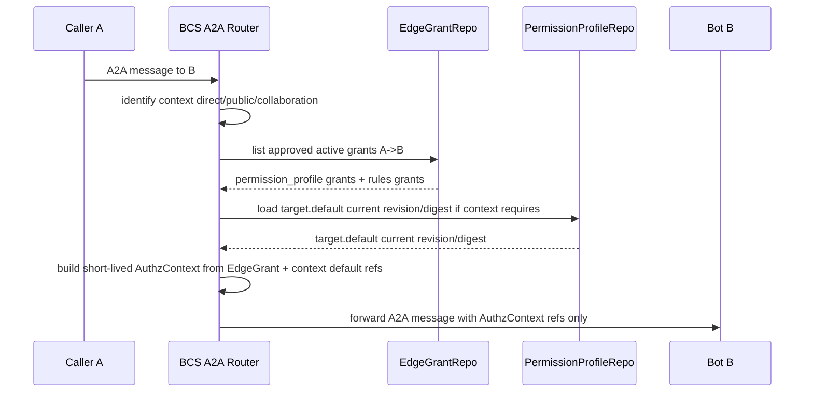
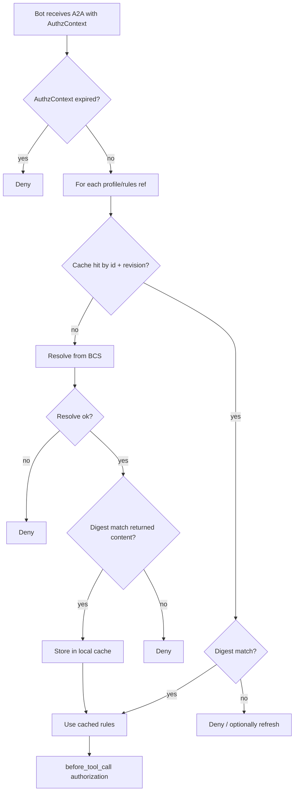
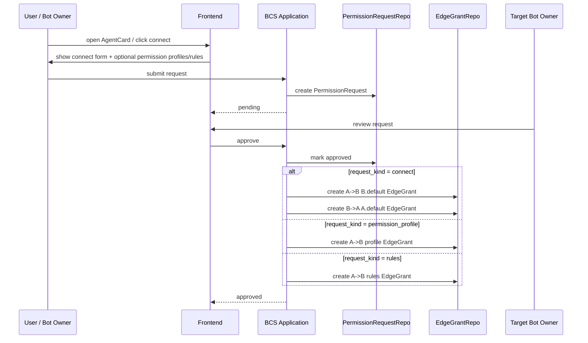
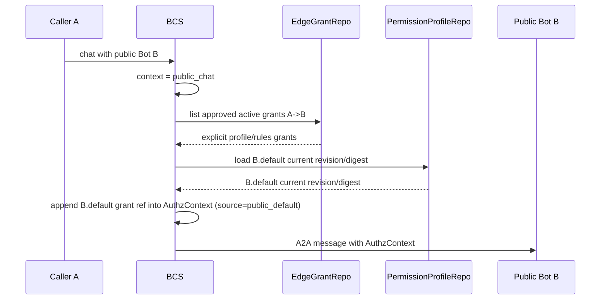
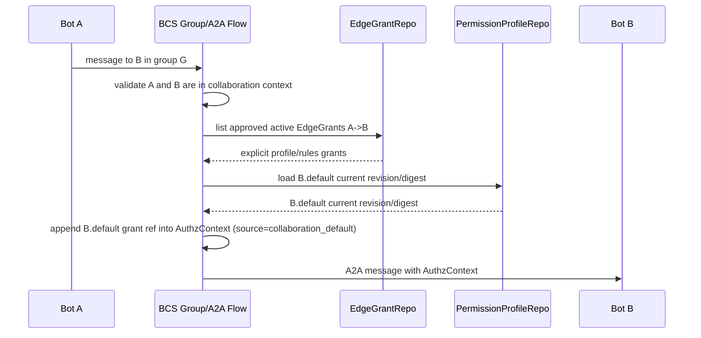
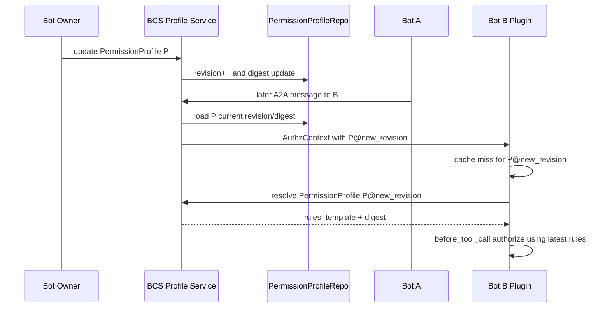

# BCS / A2A 鉴权实现 Spec

> 日期：2026-08-07  
> 状态：待评审实现规格  
> 范围：BCS A2A 授权模型、权限申请/审批、EdgeGrant 数据模型、A2A AuthzContext、Bot 本地缓存与 tool 鉴权、公开 Bot 与协作群组授权语义。  
> 目标读者：BCS 后端、Bot runtime/plugin、Frontend/Product、测试与架构评审人员。

---

## 1. 结论摘要

BCS 是 A2A 授权事实的唯一裁决方。Bot 的能力先进入 `CapabilityCatalog`，Owner 基于这些能力组装 `PermissionProfile`（权限包）。好友申请或显式权限申请审批通过后，BCS 持久化 `EdgeGrant`。A2A 运行时，BCS 查询边库并结合上下文生成 `AuthzContext`，只把 `PermissionProfile` 引用和 `RulesGrant` 引用注入 A2A 消息。

A2A 消息不携带 `edge_id`，不携带完整 rules，不携带完整 PermissionProfile。目标 Bot 本地插件根据 `revision` / `digest` 校验本地缓存；缓存缺失或不一致时向 BCS resolve，resolve 失败则拒绝执行 tool。

公开 Bot 聊天和协作群组不会批量创建两两授权边。BCS 在运行时根据上下文补充目标 Bot 的 `default` PermissionProfile 引用。群组解散或公开聊天上下文结束后，该默认授权自然失效，不需要撤销边。

---

## 2. Goals / Non-goals

### 2.1 Goals

| 目标 | 说明 |
|---|---|
| 统一授权模型 | 所有 A2A 鉴权都通过 `CapabilityCatalog → PermissionProfile / RulesGrant → EdgeGrant → AuthzContext → Bot local auth` 链路表达。 |
| 统一 EdgeGrant | `permission_profile` 和 `rules` 两种授权使用同一套 EdgeGrant 结构，不拆成多套核心边模型。 |
| A2A 只传引用 | A2A 只携带统一 grant refs、revision、digest、source，不携带完整权限内容。 |
| 权限包更新自然生效 | Owner 更新 PermissionProfile 后，后续 A2A 消息使用最新 revision/digest。 |
| Bot 本地 fail closed | 缓存缺失、digest 不匹配、resolve 失败、AuthzContext 过期都必须 deny。 |
| 支持公开 Bot | public chat 不落永久边，由 BCS runtime 补充 target.default。 |
| 支持协作群组 | collaboration 不做 N² 建边，由 BCS runtime 补充 target.default。 |
| 可落地到现有 BCS 架构 | domain / protocol / service-api / services / store / adapters / bootstrap 分层清晰。 |
| 可测试 | 表设计、协议、repo、core policy、A2A flow、product flow 都能形成测试矩阵。 |

### 2.2 Non-goals

| 非目标 | 说明 |
|---|---|
| 不做旧鉴权代码兼容 | 当前没有已落地的正式鉴权代码，本 spec 直接定义新模型。 |
| 不在 A2A 中传完整 rules | 完整规则只能由 BCS resolve 到目标 Bot 本地，不能在消息中裸传。 |
| 不在 A2A 中传 `edge_id` | EdgeGrant 是 BCS 内部授权事实，A2A runtime 消费的是已计算出的授权引用。 |
| 不把 adapter 写成策略层 | HTTP/WS/A2A adapter 只做协议转换和错误映射，不承载领域授权策略。 |
| 不启用 actor relation bitmap 作为主模型 | `bcs_actor_relations.allow/deny` 不足以表达 grant lifecycle、审批、撤销、digest、审计。 |
| 不支持长期旧版本权限包语义 | `revision/digest` 用于缓存 freshness，不用于让旧授权永久按旧 profile 内容运行。 |
| 不做多跳代理完整授权链 | 本期可保留 `task_id` / `originator` 字段，但不实现完整 delegation policy。 |

---

## 3. 核心领域模型

### 3.1 总体链路

```text
Bot exposed capabilities
  → CapabilityCatalog
  → Rule
  → PermissionProfile
  → PermissionRequest
  → EdgeGrant
  → Runtime AuthzContext
  → Bot local cache / resolve
  → before_tool_call authorization
```

### 3.2 术语表

| Term | 中文名 | 含义 |
|---|---|---|
| Actor | 主体 | human、bot、service 等参与者。A2A 中常见为 A Bot、B Bot、human originator。 |
| Capability | 能力 | Bot 暴露的原子能力，例如 `chat`、`LarkDoc`、`Bash`、`Read`、`Edit`、`WebFetch`、`Skill`、`MCP`。 |
| CapabilityCatalog | 能力目录 | BCS 从 Bot Agent Card / tools / skills / MCPs / 自定义声明中提取出的可配置能力集合。 |
| Rule | 规则 | 对某个 capability/tool/resource 的 allow 或 deny 条目。 |
| PermissionProfile | 权限包 | Owner 基于 CapabilityCatalog 组装的一组可申请、可审批、可复用 rules。 |
| Default PermissionProfile | 默认权限包 | 每个 Bot 必备的最低交互权限包，用于好友默认授权、公开聊天、协作上下文。 |
| PermissionRequest | 权限申请 | A 向 B 申请 connect、PermissionProfile 或独立 rules 的流程对象。 |
| EdgeGrant | 授权边 | BCS 持久化的 A→B 授权事实。 |
| RulesGrant | 独立规则授权 | EdgeGrant 的一种，表示不引用权限包，而是引用一组独立审批通过的 rules。 |
| AuthzContext | 鉴权上下文 | BCS 注入 A2A 消息的短期授权引用集合。 |
| PlatformGuard | 平台保护规则 | 平台级绝对约束，例如禁止某些高危 tool 或跨租户资源访问。 |

### 3.3 Capability / Rule / PermissionProfile 的关系

`CapabilityCatalog` 是 Bot 能力的目录，不直接授权。`Rule` 是对某个能力的 allow/deny 约束。`PermissionProfile` 是 Owner 组装出来的一组规则模板。



---

## 4. 授权事实与运行时上下文

### 4.1 什么会落库

| 场景 | 落库内容 | 说明 |
|---|---|---|
| Connect 通过 | A→B 的 `B.default` EdgeGrant；B→A 的 `A.default` EdgeGrant | 好友关系建立时默认互授最低交互权限。 |
| 申请 PermissionProfile 通过 | A→B 的 `permission_profile` EdgeGrant | A 获得 B 某个权限包。 |
| 申请独立 rules 通过 | A→B 的 `rules` EdgeGrant | A 获得 B 审批通过的一组独立规则。 |
| 撤销授权 | 更新对应 EdgeGrant 状态 | 不删除事实，保留审计。 |

### 4.2 什么不落库

| 场景 | 不落库原因 | 运行时处理 |
|---|---|---|
| 公开 Bot 临时聊天 | 访问者不应被批量写永久边 | BCS runtime 补充 target.default。 |
| 协作群组默认交互 | 避免 N² pairwise edges，群组关系可能临时 | BCS runtime 补充 target.default。 |
| 每条 A2A 消息 | 消息不是授权事实 | 消息只携带短期 AuthzContext。 |

### 4.3 AuthzContext 的来源

BCS 生成 AuthzContext 时有两类来源：

| 来源 | source | 是否来自 EdgeGrant | 说明 |
|---|---|---|---|
| 已审批授权边 | `edge_grant` | 是 | 从 `bcs_authz_edge_grants` 查询。 |
| 好友默认权限 | `edge_grant` | 是 | connect 通过后已经落了双向 default EdgeGrant。 |
| 公开 Bot 默认权限 | `public_default` | 否 | runtime context 补充，不落边。 |
| 协作默认权限 | `collaboration_default` | 否 | runtime context 补充，不落边。 |

---

## 5. 数据模型

### 5.1 表总览

| 表 | 责任 | MVP 必需 |
|---|---|---|
| `bcs_authz_capabilities` | 存储 Bot 暴露的可配置能力 | 是 |
| `bcs_authz_permission_profiles` | 存储 Bot Owner 配置的权限包 | 是 |
| `bcs_authz_edge_grants` | 存储 A→B 授权事实 | 是 |
| `bcs_authz_permission_requests` | 存储 connect/profile/rules 申请审批流程 | 是 |
| `bcs_authz_decision_logs` | 存储运行时授权决策审计 | 建议 MVP 设计，按优先级实现 |
| `bcs_authz_platform_guards` | 存储平台级保护规则 | 可预留 |

### 5.2 `bcs_authz_capabilities`

| 字段 | 类型 | 约束 | 说明 |
|---|---|---|---|
| `capability_id` | string | pk | 能力 ID。 |
| `bot_id` | string | indexed, required | 所属 Bot。 |
| `env` | string | indexed, required | 环境。 |
| `tool` | string | required | 工具或能力类别，例如 `chat`、`LarkDoc`、`Bash`、`Read`、`Edit`、`WebFetch`、`Skill`、`MCP`。 |
| `operation` | string/null | optional | 操作，例如 `read`、`write`、`execute`、`search`。 |
| `specifier_schema` | string/null | optional | 资源范围格式，例如 `doc:<doc_id>`、`repo:<repo>/*`。 |
| `description` | string/null | optional | 前端展示说明。 |
| `source` | enum | required | `agent_card` / `manual` / `system`。 |
| `status` | enum | required | `active` / `inactive`。 |
| `raw_metadata` | json/null | optional | Agent Card 原始字段或扩展元数据。 |
| `created_at` | datetime | required | 创建时间。 |
| `updated_at` | datetime | required | 更新时间。 |

建议唯一约束：

```text
unique(env, bot_id, tool, operation, specifier_schema)
```

### 5.3 `bcs_authz_permission_profiles`

| 字段 | 类型 | 约束 | 说明 |
|---|---|---|---|
| `permission_profile_id` | string | pk | 权限包 ID。 |
| `bot_id` | string | indexed, required | 权限包所属 Bot。 |
| `env` | string | indexed, required | 环境。 |
| `name` | string | required | 展示名，例如 `default`、`writer`、`reader`。 |
| `description` | string/null | optional | 描述。 |
| `rules_template` | json | required | 由 CapabilityCatalog 组装出的 rules。 |
| `revision` | int | required | 当前版本号，用于 Bot 缓存 freshness 校验。 |
| `digest` | string | required | 当前内容 hash。 |
| `is_default` | bool | required | 是否是 default 权限包。 |
| `status` | enum | required | `active` / `deleted`。 |
| `created_by` | string | required | 创建者。 |
| `updated_by` | string/null | optional | 最近更新者。 |
| `created_at` | datetime | required | 创建时间。 |
| `updated_at` | datetime | required | 更新时间。 |

关键语义：

- 每个 Bot 在每个 env 下必须有且只有一个 active default PermissionProfile。
- Owner 更新 PermissionProfile 后，`revision` 递增，`digest` 重新计算。
- EdgeGrant 引用 PermissionProfile 时不复制 `rules_template`。
- 后续 A2A 运行时总是加载 active PermissionProfile 的当前 revision/digest。

建议约束：

```text
unique(env, bot_id, name) where status = active
unique(env, bot_id) where is_default = true and status = active
```

### 5.4 `bcs_authz_edge_grants`

统一存储 `permission_profile` grant 和 `rules` grant。

| 字段 | 类型 | 约束 | 说明 |
|---|---|---|---|
| `edge_id` | string | pk | BCS 内部授权事实 ID。A2A 不传。 |
| `from_id` | string | indexed, required | 获权方 A。 |
| `to_id` | string | indexed, required | 授权目标 B。 |
| `env` | string | indexed, required | 环境。 |
| `grant_kind` | enum | required | `permission_profile` / `rules`。 |
| `grant_ref_id` | string | indexed, required | `permission_profile_id` 或 `rules_grant_ref`。 |
| `rules` | json/null | conditional | `grant_kind=rules` 时填写；`permission_profile` 时必须为 null。 |
| `rules_revision` | int/null | conditional | rules grant 版本。 |
| `rules_digest` | string/null | conditional | rules grant 内容 digest。 |
| `status` | enum | indexed, required | `pending` / `approved` / `rejected` / `revoked` / `expired`。 |
| `request_id` | string/null | indexed | 来源申请。 |
| `requested_by` | string | required | 申请人。 |
| `approved_by` | string/null | optional | 审批人。 |
| `revoked_by` | string/null | optional | 撤销人。 |
| `reason` | string/null | optional | 申请原因。 |
| `expires_at` | datetime/null | optional | 过期时间。 |
| `created_at` | datetime | required | 创建时间。 |
| `updated_at` | datetime | required | 更新时间。 |
| `approved_at` | datetime/null | optional | 审批时间。 |
| `revoked_at` | datetime/null | optional | 撤销时间。 |

业务约束：

| grant_kind | grant_ref_id | rules | revision/digest |
|---|---|---|---|
| `permission_profile` | `permission_profile_id` | null | 使用 `bcs_authz_permission_profiles.revision/digest`。 |
| `rules` | `rules_grant_ref` | rules JSON | 使用 `rules_revision/rules_digest`。 |

建议查询索引：

```text
index(env, from_id, to_id, status)
index(env, to_id, grant_kind, grant_ref_id, status)
index(env, request_id)
```

### 5.5 `bcs_authz_permission_requests`

表示申请/审批流程对象。

| 字段 | 类型 | 约束 | 说明 |
|---|---|---|---|
| `request_id` | string | pk | 申请 ID。 |
| `env` | string | indexed, required | 环境。 |
| `from_id` | string | indexed, required | 申请方 A。 |
| `to_id` | string | indexed, required | 被申请方 B。 |
| `request_kind` | enum | required | `connect` / `permission_profile` / `rules`。 |
| `requested_ref_id` | string/null | conditional | profile id；rules 申请时可为空，审批后生成 rules grant ref。 |
| `requested_rules` | json/null | conditional | 独立 rules 申请时填写。 |
| `message` | string/null | optional | 申请说明。 |
| `status` | enum | indexed, required | `pending` / `approved` / `rejected` / `cancelled`。 |
| `decision_reason` | string/null | optional | 审批说明。 |
| `created_by` | string | required | 创建者。 |
| `decided_by` | string/null | optional | 审批者。 |
| `created_at` | datetime | required | 创建时间。 |
| `decided_at` | datetime/null | optional | 审批时间。 |

审批产物：

| request_kind | approved 后产物 |
|---|---|
| `connect` | A→B `B.default` EdgeGrant + B→A `A.default` EdgeGrant。 |
| `permission_profile` | A→B `permission_profile` EdgeGrant。 |
| `rules` | A→B `rules` EdgeGrant。 |

### 5.6 `bcs_authz_decision_logs`

运行时授权决策审计表。

| 字段 | 类型 | 约束 | 说明 |
|---|---|---|---|
| `decision_id` | string | pk | 决策 ID。 |
| `env` | string | indexed | 环境。 |
| `task_id` | string/null | indexed | task id。 |
| `run_id` | string/null | indexed | A2A run id。 |
| `from_id` | string | indexed | A。 |
| `to_id` | string | indexed | B。 |
| `originator` | string/null | indexed | 最初触发者。 |
| `context_type` | enum | required | `direct` / `public_chat` / `collaboration`。 |
| `decision` | enum | required | `allow` / `deny`。 |
| `reason_code` | string | required | 机器可读原因。 |
| `grant_refs` | json | required | 本次注入的统一授权引用列表，元素用 `kind` 区分 `permission_profile` / `rules`。 |
| `context_json` | json/null | optional | group/session/source 等上下文。 |
| `created_at` | datetime | required | 创建时间。 |

---

## 6.0 流程图约定

为了避免歧义，本 spec 里的 Mermaid 图遵循以下约定：

| 约定 | 含义 |
|---|---|
| 需要说明数据来源时，必须显式画出 repo / service 访问 | 例如 EdgeGrant、PermissionProfile、Request 这类授权事实或派生内容的来源不能只写成 “BCS 内部处理”。 |
| 纯内部拼装步骤可以省略具体子步骤 | 如果不会影响读者理解数据来自哪里，可以只写成 BCS 内部动作。 |
| 如果 participant 已经代表 repo / store，则消息内容只写动作 | 例如 `BCS ->> EdgeGrantRepo: list approved active grants A->B`。 |
| 如果某一步会让人误以为是黑盒推导，就必须补 source | 尤其是 default 补充、revision/digest 读取、审批产物生成。 |

## 6. A2A AuthzContext 协议

### 6.1 Wire shape

A2A 消息增加 BCS 扩展字段：

```jsonc
{
  "authz_context": {
    "task_id": "task_123",
    "run_id": "run_456",
    "from_id": "bot_A",
    "to_id": "bot_B",
    "env": "prod",
    "originator": "human_alice",
    "context": {
      "type": "collaboration",
      "group_id": "group_789"
    },
    "grants": [
      {
        "kind": "permission_profile",
        "ref_id": "profile_B_default",
        "revision": 8,
        "digest": "sha256:abc",
        "source": "collaboration_default"
      },
      {
        "kind": "rules",
        "ref_id": "rg_opaque_abc",
        "revision": 3,
        "digest": "sha256:def",
        "source": "edge_grant"
      }
    ],
    "issued_at": 1785900000000,
    "expires_at": 1785900300000,
    "signature": null
  }
}
```

### 6.2 `authz_context` 字段表

| 字段 | 类型 | 必填 | 说明 |
|---|---|---|---|
| `task_id` | string/null | 否 | 多步任务 ID。 |
| `run_id` | string/null | 否 | A2A run ID。 |
| `from_id` | string | 是 | 发送方。 |
| `to_id` | string | 是 | 接收方。 |
| `env` | string | 是 | 环境。 |
| `originator` | string/null | 否 | 最初发起任务的人或 Bot。 |
| `context` | object | 是 | direct/public/collaboration 上下文。 |
| `grants` | array | 是 | 本次可用的统一授权引用列表，元素用 `kind` 区分 `permission_profile` / `rules`。 |
| `issued_at` | int64 | 是 | BCS 签发时间，毫秒。 |
| `expires_at` | int64 | 是 | 过期时间，毫秒。 |
| `signature` | string/null | 否 | 预留签名字段，MVP 可为空。 |

### 6.3 `grants[]` 字段表

A2A 使用统一 `grants[]` 模板，不拆成 `permission_profiles[]` 和 `rules_grants[]` 两个数组。

| 字段 | 类型 | 说明 |
|---|---|---|
| `kind` | enum | `permission_profile` / `rules`。 |
| `ref_id` | string | 当 `kind=permission_profile` 时是 `permission_profile_id`；当 `kind=rules` 时是 `rules_grant_ref`。 |
| `revision` | int | BCS 生成该上下文时读取到的当前 revision。 |
| `digest` | string | 对应 revision 的内容 digest。 |
| `source` | enum | `edge_grant` / `public_default` / `collaboration_default`。 |

约束：

| kind | ref_id 含义 | source 允许值 |
|---|---|---|
| `permission_profile` | `permission_profile_id` | `edge_grant` / `public_default` / `collaboration_default` |
| `rules` | `rules_grant_ref` | `edge_grant` |

### 6.4 A2A 禁止字段

A2A AuthzContext 不允许包含：

| 禁止字段 | 原因 |
|---|---|
| `edge_id` | EdgeGrant 是 BCS 内部授权事实，Bot runtime 不应依赖边 ID 鉴权。 |
| `edge_version` | 运行时只消费统一 grant refs 的 freshness proof。 |
| 完整 `rules` | 防泄漏、防篡改、防消息膨胀。 |
| 完整 `PermissionProfile` | 同上。 |
| caller 自声明权限 | 权限只能由 BCS 计算注入。 |

---

## 7. BCS Runtime AuthzContext 构建

### 7.1 总流程



### 7.2 Context 决策表

| 场景 | 查询 `bcs_authz_edge_grants` | 是否补充 target.default | source | 说明 |
|---|---:|---:|---|---|
| 好友 direct chat | 是 | 否 | `edge_grant` | connect 通过时 default 已落 EdgeGrant。 |
| 显式授权 direct chat | 是 | 否 | `edge_grant` | profile/rules grant 来自审批。 |
| public bot chat | 是 | 是 | `public_default` | 不落 pairwise default edge。 |
| collaboration group | 是 | 是 | `collaboration_default` | 不做 N² 建边。 |
| 无关系、非 public、非 collaboration | 是 | 否 | 无 | 没有有效 grant 则 deny 或不注入任何可用权限。 |

### 7.3 EdgeGrant 到 AuthzContext 的转换

| EdgeGrant | AuthzContext 输出 |
|---|---|
| `grant_kind=permission_profile` | `grants[] += { kind=permission_profile, ref_id=permission_profile_id, current_revision, current_digest, source=edge_grant }` |
| `grant_kind=rules` | `grants[] += { kind=rules, ref_id=rules_grant_ref, rules_revision, rules_digest, source=edge_grant }` |
| public runtime default | `grants[] += { kind=permission_profile, ref_id=target.default, current_revision, current_digest, source=public_default }` |
| collaboration runtime default | `grants[] += { kind=permission_profile, ref_id=target.default, current_revision, current_digest, source=collaboration_default }` |

### 7.4 失败策略

| 失败 | BCS 行为 |
|---|---|
| EdgeGrant repo 查询失败 | 返回错误，不应静默放行。 |
| PermissionProfile 缺失 | 对应 ref 不注入；如果无任何有效权限则 deny。 |
| default PermissionProfile 缺失 | public/collaboration default 补充失败，deny 并记录配置错误。 |
| digest 计算失败 | deny。 |
| context 无效或过期 | deny。 |

---

## 8. Bot 本地缓存与 Resolve

### 8.1 Bot 本地缓存内容

Bot 本地插件不缓存 EdgeGrant 作为主要鉴权材料，只缓存可执行规则材料。

| 缓存 | Key | Value | 来源 |
|---|---|---|---|
| PermissionProfile cache | `(permission_profile_id, revision)` | `rules_template + digest + metadata` | BCS resolve。 |
| RulesGrant cache | `(rules_grant_ref, revision)` | `rules + digest + metadata` | BCS resolve。 |
| PlatformGuard cache | policy key / revision | platform guard rules | BCS / platform config，MVP 可预留。 |

### 8.2 Resolve 流程



### 8.3 本地鉴权不变量

| 不变量 | 说明 |
|---|---|
| 只使用本次 AuthzContext 引用 | 本地有缓存但本次消息没引用，不得参与鉴权。 |
| cache miss 必须 resolve | 不能因为本地没有就默认 allow。 |
| digest mismatch 必须 deny | 防止缓存污染或旧内容误用。 |
| resolve 失败必须 deny | fail closed。 |
| AuthzContext 过期必须 deny | 防 replay。 |
| profile 更新后新消息带新 revision/digest | Bot 必须拉取最新内容后再授权。 |

### 8.4 Resolve API 语义

| API | 输入 | 输出 | 鉴权要求 |
|---|---|---|---|
| Resolve PermissionProfile | `permission_profile_id`, `revision`, `digest`, `to_id`, `authz_context_id/run_id` | rules_template + metadata | 调用方必须是目标 Bot 本地插件或 BCS 认可 runtime principal。 |
| Resolve RulesGrant | `rules_grant_ref`, `revision`, `digest`, `to_id`, `authz_context_id/run_id` | rules + metadata | 同上。 |

Resolve API 不是给任意 caller 枚举权限内容的 API。它只用于目标 Bot 本地鉴权材料同步。

---

## 9. Tool 鉴权语义

### 9.1 Effective rules

Bot 本地插件执行 tool 前，基于本次 AuthzContext 引用解析得到：

```text
effective_rules =
  PlatformGuard rules
  + PermissionProfile.rules_template
  + RulesGrant.rules
```

MVP 建议判定顺序：

```text
PlatformGuard deny > business allow > business deny > default deny
```

### 9.2 判定表

| 情况 | 决策 |
|---|---|
| PlatformGuard deny 命中 | deny |
| PlatformGuard allow 命中但业务无 allow | 默认 deny，除非后续明确 platform allow 可单独授权。 |
| PermissionProfile allow 命中 | allow |
| RulesGrant allow 命中 | allow |
| 只有业务 deny 命中 | deny |
| 业务 allow 和业务 deny 同时命中 | allow 优先；PlatformGuard deny 仍绝对优先。 |
| 无任何匹配 | deny |

### 9.3 before_tool_call 输入

Bot 本地 `before_tool_call` 至少需要：

| 字段 | 说明 |
|---|---|
| `tool` | 本次要调用的工具类别。 |
| `operation` | 操作，例如 read/write/execute。 |
| `specifier` | 资源范围。 |
| `authz_context` | BCS 注入的 AuthzContext。 |
| `task_id` / `run_id` | 审计关联。 |
| `caller` | A 或 originator。 |
| `target_bot_id` | 当前 Bot。 |

---

## 10. 申请 / 审批流程

### 10.1 Connect + 可选权限申请



### 10.2 Product flow

| 步骤 | 前端行为 | BCS 行为 |
|---|---|---|
| 发现 Bot | 展示 Bot AgentCard / capabilities / permission profiles | 提供 Bot discovery + profile list。 |
| 申请好友 | 用户填写 connect 申请 | 创建 `request_kind=connect`。 |
| 可选申请权限包 | 用户选择一个或多个 PermissionProfile | 创建 permission profile request，或与 connect request 关联。 |
| 可选申请独立 rules | 用户选择若干 capability/rule | 创建 `request_kind=rules`。 |
| Owner 审批 | 展示 request inbox | approve 后生成 EdgeGrant。 |
| 查看授权 | 展示 grant viewer | 查询 `bcs_authz_edge_grants`。 |

---

## 11. Public Bot 场景

### 11.1 语义

公开 Bot 可以被直接聊天，但这不代表 BCS 给所有访问者持久创建 A→B default 边。

公开聊天时：

1. BCS 识别 target Bot 是 public chat context。
2. BCS 查询 A→B 已有 approved EdgeGrant。
3. BCS 额外补充 B.default PermissionProfile ref，source = `public_default`。
4. BCS 将 AuthzContext 注入 A2A 消息。
5. Bot B 本地只基于 AuthzContext 鉴权。

### 11.2 流程图



### 11.3 边界

| 问题 | 决策 |
|---|---|
| public chat 是否落 EdgeGrant | 不落。 |
| public chat 是否能使用显式授权 | 能。已有 A→B EdgeGrant 会一并进入 AuthzContext。 |
| public chat default 何时失效 | 本次 AuthzContext 过期即失效。 |
| public default 权限大小 | 由 B Owner 的 default PermissionProfile 决定。 |

---

## 12. Collaboration Group 场景

### 12.1 语义

协作群组只是运行时合作上下文，不自动制造所有成员两两长期授权关系。

当群组内 A 给 B 发消息：

1. BCS 识别 context = collaboration。
2. BCS 查询 A→B 已有 EdgeGrant。
3. BCS 补充 B.default PermissionProfile ref，source = `collaboration_default`。
4. 如果 A 需要 B 的更高权限，仍需显式申请 PermissionProfile 或 rules。
5. 群组解散后，runtime default 自然不再成立。

### 12.2 流程图



### 12.3 N² 边爆炸说明

如果一个群组有 N 个 Bot，两两建边会产生：

```text
N * (N - 1)
```

条有向边。20 个 Bot 是 380 条，100 个 Bot 是 9900 条。协作上下文默认授权不落边，可以避免这种爆炸，同时保证群组解散后默认权限自动消失。

---

## 13. PermissionProfile 更新语义

### 13.1 规则

Owner 修改 PermissionProfile 后：

1. `revision` 递增。
2. `digest` 重新计算。
3. 后续 BCS 构建 AuthzContext 时读取最新 active revision/digest。
4. Bot 收到新 revision/digest 后，本地 cache miss，向 BCS resolve。
5. resolve 成功后按新 rules 鉴权。
6. resolve 失败则 deny。

### 13.2 流程图



### 13.3 为什么仍需要 revision/digest

虽然不支持旧版本长期语义，但分布式缓存仍必须知道“我本地是不是最新版”。`revision/digest` 的作用是 freshness proof：

| 字段 | 作用 |
|---|---|
| `revision` | 快速判断本地是否有对应版本。 |
| `digest` | 校验内容是否被污染、传错或缓存不一致。 |

---

## 14. BCS 代码落点

### 14.1 推荐模块结构

| 目录 / 文件 | 内容 |
|---|---|
| `crates/contracts/bcs-domain/src/authorization.rs` | 领域类型：Capability、Rule、PermissionProfile、EdgeGrant、AuthzContext、Decision。 |
| `crates/contracts/bcs-protocol/src/a2a.rs` | A2A wire DTO：AuthzContext extension、统一 grant refs。 |
| `crates/service-api/bcs-service-api/src/core/authorization.rs` | 核心授权上下文构建接口。 |
| `crates/service-api/bcs-service-api/src/application/authorization.rs` | profile 管理、request/approval、resolve 应用接口。 |
| `crates/service-api/bcs-service-api/src/port/repo/authorization.rs` | repo traits。 |
| `crates/services/bcs-authorization` | 授权上下文构建、决策、审计写入。 |
| `crates/services/bcs-authorization-store` | memory/db store。 |
| `crates/services/bcs-message-flow/src/a2a_chat/mod.rs` | A2A direct chat 调用 authz service 并注入 AuthzContext。 |
| `crates/services/bcs-message-flow/src/group_flow.rs` | collaboration context 授权入口。 |
| `crates/services/bcs-message-flow/src/bot_event.rs` | bot event / structured routing 授权入口。 |
| `crates/adapters/http/bcs-http` | HTTP API adapter。 |
| `crates/adapters/ws/bcs-ws` | WS/A2A adapter。 |
| `crates/bootstrap/bcs/src/server.rs` | wire authz service/store；禁止把空的 `MemoryAuthorizationStore` 强行接入生产 A2A，否则会因无 grants/default profiles 导致所有 direct chat fail-closed。MVP foundation 阶段只保留可注入 seam，等真实 repo / seed / API 完整后再启用 enforcement。 |

### 14.2 Core service 接口草案

```rust
pub trait AuthzContextBuilderCoreService: Send + Sync {
    async fn build_a2a_authz_context(
        &self,
        request: BuildA2aAuthzContextRequest,
    ) -> ServiceResult<AuthzContext>;
}
```

`BuildA2aAuthzContextRequest`：

| 字段 | 说明 |
|---|---|
| `from_id` | 发送方 A。 |
| `to_id` | 目标 B。 |
| `env` | 环境。 |
| `caller` | 当前认证主体。 |
| `originator` | 原始触发者，可为空。 |
| `context` | direct/public/collaboration。 |
| `task_id` / `run_id` | 运行时关联。 |
| `issued_at` | 生成时间。 |
| `ttl_ms` | AuthzContext 有效期。 |

`AuthzContext` 输出即 A2A wire DTO 的 domain 版本。

### 14.3 Repo traits

```rust
pub trait CapabilityCatalogRepoPort: Send + Sync { ... }
pub trait PermissionProfileRepoPort: Send + Sync { ... }
pub trait EdgeGrantRepoPort: Send + Sync { ... }
pub trait PermissionRequestRepoPort: Send + Sync { ... }
pub trait AuthzDecisionLogRepoPort: Send + Sync { ... }
```

必须遵守现有 repo 风格：

- trait 在 `bcs-service-api/src/port/repo`。
- memory/db implementation 在 `services/*-store`。
- conformance tests 覆盖 memory/db。
- DB 写失败必须向上返回错误。

---

## 15. API 设计

### 15.1 管理与产品 API

| API | 方法 | 用途 |
|---|---|---|
| `/authz/capabilities/:bot_id` | GET | 查看 Bot 的 CapabilityCatalog。 |
| `/authz/permission-profiles/:bot_id` | GET | 查看 Bot 的 PermissionProfiles。 |
| `/authz/permission-profiles` | POST | 创建 PermissionProfile。 |
| `/authz/permission-profiles/:id` | PATCH | 更新 PermissionProfile，revision++。 |
| `/authz/permission-profiles/:id` | DELETE | 删除或停用 PermissionProfile。 |
| `/authz/permission-requests` | POST | 发起 connect/profile/rules 申请。 |
| `/authz/permission-requests/inbox` | GET | Owner 查看待审批请求。 |
| `/authz/permission-requests/:id/approve` | POST | 审批通过并生成 EdgeGrant。 |
| `/authz/permission-requests/:id/reject` | POST | 拒绝申请。 |
| `/authz/edge-grants` | GET | 查看已授权 EdgeGrants。 |
| `/authz/edge-grants/:id/revoke` | POST | 撤销授权。 |

### 15.2 Bot runtime resolve API

| API | 方法 | 用途 |
|---|---|---|
| `/authz/resolve/permission-profile` | POST | Bot 根据 AuthzContext ref 拉取 PermissionProfile rules_template。 |
| `/authz/resolve/rules-grant` | POST | Bot 根据 AuthzContext ref 拉取 RulesGrant rules。 |

Resolve API 的返回必须包含：

| 字段 | 说明 |
|---|---|
| `ref_id` | profile id 或 rules grant ref。 |
| `revision` | 返回内容版本。 |
| `digest` | 返回内容 digest。 |
| `rules` | 可执行 rules。 |
| `expires_at` | 可选缓存过期时间。 |

---

## 16. Frontend / Product 需求

| 页面/组件 | 需要支持的功能 |
|---|---|
| Bot Square | 展示可发现 Bot、进入 AgentCard。 |
| AgentCard Detail | 展示 Bot 基本信息、capabilities、可申请 PermissionProfiles。 |
| Connect Modal | 第一步申请好友，第二步可选申请 PermissionProfile / rules。 |
| PermissionProfile 管理页 | Owner 基于 CapabilityCatalog 创建/编辑/删除权限包。 |
| Request Inbox | Owner 审批 connect/profile/rules 请求。 |
| Grant Viewer | 查看、撤销已有 EdgeGrant。 |
| Collaboration Picker | 拉 Bot 进协作群组，并提示默认权限来自 target.default。 |
| Audit View | 查看 allow/deny 决策日志，可作为后续功能。 |

现有前端落点：

| 文件 | 改造方向 |
|---|---|
| `src/frontend/src/pages/GroupChat/components/FriendModal.tsx` | connect + optional permission request。 |
| `src/frontend/src/pages/GroupChat/components/BotInfoCard.tsx` | AgentCard / PermissionProfile 展示入口。 |
| `src/frontend/src/pages/GroupChat/components/CreateGroupModal.tsx` | collaboration default 说明。 |
| `src/frontend/src/stores/friendStore.ts` | request/grant 状态。 |
| `src/frontend/src/stores/botNetworkStore.ts` | Bot discovery / visibility / public bot 状态。 |
| `src/frontend/src/services/backend-api/*` | 新增 authz API client。 |

---

## 17. Agent Card 对齐

当前实现中尚未形成完整 A2A AgentCard 领域结构，因此 spec 先定义目标语义：

| AgentCard 内容 | BCS 内部落点 |
|---|---|
| Bot identity | Bot registry / actor registry。 |
| Tools | CapabilityCatalog。 |
| Skills | CapabilityCatalog。 |
| MCP servers/tools | CapabilityCatalog。 |
| Custom capabilities | CapabilityCatalog。 |
| Suggested permission profiles | 可选，进入 PermissionProfile 初始模板。 |

BCS 接入 Bot 时：

1. BCS 与 Bot 建立连接或发现流程。
2. BCS 读取 Bot AgentCard。
3. BCS 提取 tools/skills/MCPs/custom capabilities。
4. BCS upsert CapabilityCatalog。
5. Owner 在前端基于 CapabilityCatalog 管理 PermissionProfile。

AgentCard 标准没有的字段，可以放入 A2A extension / BCS extension 字段，但必须落到 protocol contract tests。

---

## 18. 测试矩阵

| 测试类型 | 覆盖内容 | 建议位置 |
|---|---|---|
| domain unit tests | Rule 匹配、business allow/deny、PlatformGuard deny、default deny | `crates/services/bcs-authorization` |
| core service tests | `build_a2a_authz_context` 在 direct/public/collaboration 下的输出 | `crates/services/bcs-authorization/tests` |
| repo conformance tests | Capability/Profile/EdgeGrant/Request/Audit repo memory/db 一致性 | `crates/services/bcs-authorization-store/tests` |
| protocol contract tests | A2A AuthzContext wire DTO 兼容性 | `crates/contracts/bcs-protocol/tests` |
| service-api contract tests | repo traits、core service input/output contract | `crates/service-api/bcs-service-api/tests` |
| A2A integration tests | direct chat 注入统一 grant refs | `crates/services/bcs-message-flow/tests` |
| public bot E2E | public chat 补 target.default 且不落 EdgeGrant | BCS user-story E2E |
| collaboration E2E | 群组消息补 target.default 且不生成 N² edges | BCS user-story E2E |
| cache resolve tests | cache miss、digest mismatch、resolve failure、expired deny | Bot runtime/plugin tests 或 contract mock |
| migration tests | MySQL migration 与 SQLite/bootstrap schema 对齐 | migration tests |
| audit tests | allow/deny 决策日志写入与查询 | authorization store/service tests |

---

## 19. 架构约束

实现必须遵守仓库架构规则：

| 约束 | 要求 |
|---|---|
| contracts 是权威 | domain / protocol / service-api 变更必须有对应测试。 |
| core transport-agnostic | 授权核心不能依赖 HTTP、WS、Axum frame。 |
| adapter thin | adapter 只做 principal 提取、DTO 转换、错误映射。 |
| repo port 抽象 | store 通过 repo traits 注入，composition root 选择具体实现。 |
| migration 双维护 | MySQL migration 和 SQLite/bootstrap migration 需要同步。 |
| 写失败不能吞 | DB 写入失败必须传播。 |
| 不引入私有 endpoint/token | 保持 open-source 默认可复现。 |
| 不运行全局 formatter | BCS 变更遵守本地 AGENTS / CLAUDE 约束。 |

---

## 20. 实现拆分建议

正式 plan 可按以下阶段拆：

| 阶段 | 内容 | 主要产物 |
|---|---|---|
| Phase 1 | domain/protocol/service-api contracts | authorization domain types、A2A AuthzContext DTO、repo traits。 |
| Phase 2 | store/migrations | new tables、memory/db repos、conformance tests。 |
| Phase 3 | authorization core | AuthzContext builder、context supplement、digest loading、audit。 |
| Phase 4 | A2A message-flow integration | direct/public/collaboration 注入 AuthzContext。 |
| Phase 5 | request/approval APIs | connect/profile/rules request + approve/revoke。 |
| Phase 6 | Bot runtime resolve contract | resolve profile/rules APIs + local cache contract tests。 |
| Phase 7 | frontend product integration | AgentCard、connect modal、permission request、grant viewer。 |
| Phase 8 | E2E and hardening | public bot、collaboration、profile update freshness、failure deny。 |

---

## 21. 核心不变量

| Invariant | 说明 |
|---|---|
| BCS 是授权事实源 | caller 不能自声明权限。 |
| A2A 不传完整权限 | A2A 只传 refs、revision、digest、source。 |
| A2A 不传 `edge_id` | Bot runtime 不依赖边 ID。 |
| EdgeGrant 只在审批通过时落库 | public/collaboration default 不落边。 |
| PermissionProfile 更新后新消息用最新版 | revision/digest 用于 freshness proof。 |
| Bot cache 只能服务当前 AuthzContext | 未被当前上下文引用的缓存不能参与鉴权。 |
| cache miss / mismatch / resolve failure 均 deny | fail closed。 |
| AuthzContext 过期 deny | 防 replay。 |
| PlatformGuard deny 绝对优先 | 平台安全边界不能被业务 allow 覆盖。 |
| adapter 不拥有 domain policy | 授权策略集中在 service/core。 |

---

## 22. Future Work

| 项 | 说明 |
|---|---|
| Signed AuthzContext | 后续对 AuthzContext 加签，防中间层篡改。 |
| 完整 PlatformGuard 管理 | 平台级策略配置、同步、审计。 |
| Delegation chain | 多跳代理、原始调用者、代理权限缩减。 |
| 更复杂 conflict resolution | 支持 specificity、deny-priority、资源继承等更细规则。 |
| AgentCard 标准深度对齐 | 等 A2A AgentCard 字段稳定后完善 contract。 |
| 权限申请模板推荐 | Bot 根据 AgentCard 自动生成默认 PermissionProfile 模板。 |
