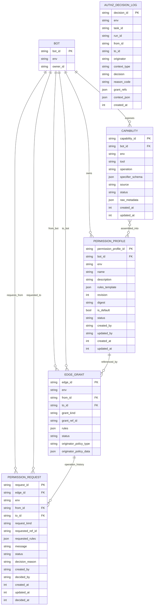
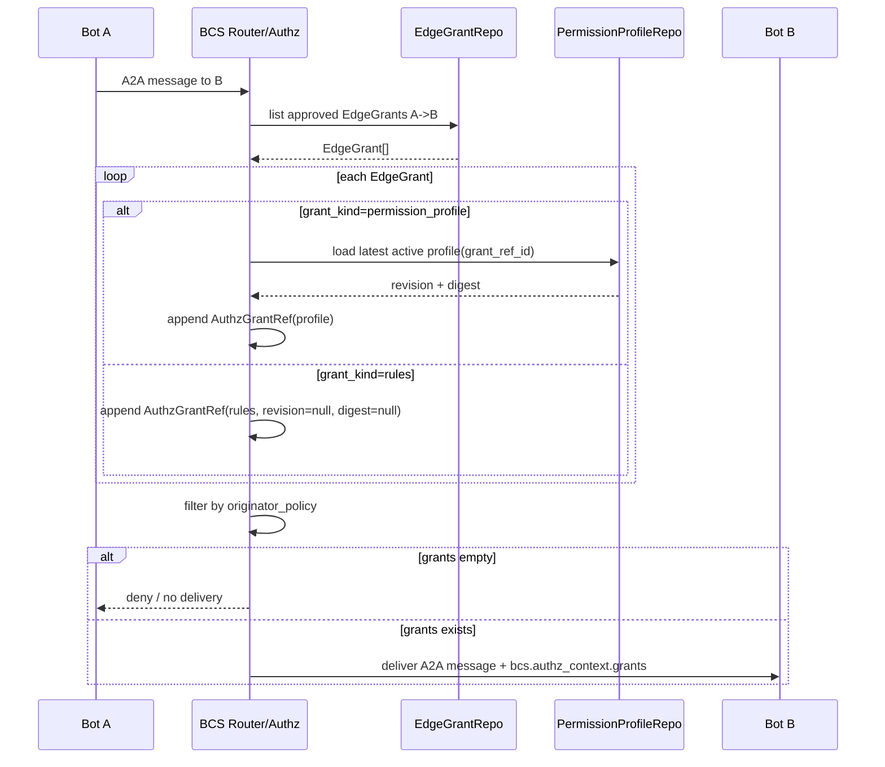
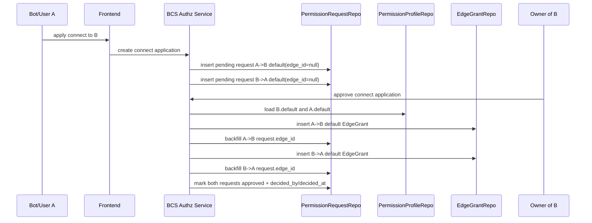
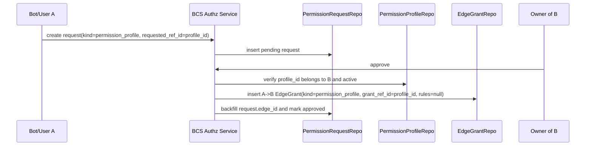
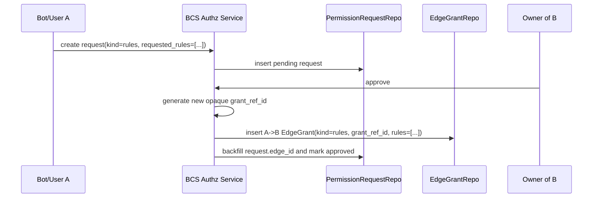

# BCS A2A 授权模型最终 Spec（2026-08-12 Draft）

> 状态：Final，按 2026-08-12 最新讨论落地。
> 本文以 2026-08-12 mentor 最新讨论为准，取代 2026-08-07 文档中关于 `rules_revision` / `rules_digest`、`AuthzContext.issued_at/expires_at`、EdgeGrant 审批冗余字段的旧设计。

## 1. 核心结论

BCS 授权系统分为三层：

1. **管理层**：Bot Owner 从 Bot 暴露的能力中组装 `PermissionProfile`，或审批临时 `rules` 授权。
2. **授权事实层**：BCS 使用 `EdgeGrant` 表记录 A→B 的授权事实。
3. **A2A 运行时层**：BCS 根据边库和上下文生成 `AuthzContext`，注入 A2A 消息；Bot B 只消费 `AuthzGrantRef`，不接收 EdgeGrant 内部字段。

最终原则：

- A2A 不传 `edge_id`。
- A2A 不传完整 `PermissionProfile`。
- A2A 不传完整 `rules`。
- A2A 只传统一模板 `AuthzGrantRef[]`。
- `permission_profile` grant 的 revision/digest 来自最新 active `PermissionProfile`。
- `rules` grant 不再维护 revision/digest；如果 rules 内容变化，生成新的 `grant_ref_id`。
- `AuthzContext` 只表达授权信息，不承担消息 TTL 控制，因此不包含 `issued_at` / `expires_at`。
- `EdgeGrant` 只保存当前授权事实必要字段；审批人、审批原因、创建/更新/撤销历史都从 `PermissionRequest.edge_id -> EdgeGrant.edge_id` 反向查询，不允许 `EdgeGrant.request_id` 覆盖历史。

---

## 2. ER 图



说明：

- `PermissionProfile` 由 Bot 的 `Capability` 组装得到，但 MVP 可不单独建立 join 表；`rules_template` 里记录实际规则。
- `EdgeGrant.grant_ref_id` 是统一引用字段：
  - `grant_kind=permission_profile` 时，等于 `permission_profile_id`。
  - `grant_kind=rules` 时，等于 BCS 生成的不透明 rules grant ref。
- `EdgeGrant.rules` 是条件字段：
  - `grant_kind=permission_profile` 时必须为空。
  - `grant_kind=rules` 时必须非空。
- `EdgeGrant` 不再保存 `rules_revision` / `rules_digest`。
- `EdgeGrant` 不保存 `request_id`。方向必须反过来：`PermissionRequest.edge_id -> EdgeGrant.edge_id`。
- 加好友/connect 在数据库层落两条 request：A→B 一条，B→A 一条，分别关联各自创建出的 EdgeGrant。
- `EdgeGrant` 不再保存 `requested_by` / `approved_by` / `reason` / `created_at` / `updated_at` / `revoked_at` 等操作历史字段；这些都从请求/操作流水按时间排序得到。

---

## 3. 概念定义

### 3.1 Capability

`Capability` 是 Bot 暴露出来的底层能力，例如：

- `chat`
- `LarkDoc`
- `Bash`
- `Read`
- `Edit`
- `WebFetch`
- `skills`
- `mcps`

它回答的是：**这个 Bot 有哪些可被授权控制的能力点？**

### 3.2 Rule

`Rule` 是对某个能力点的 allow/deny 控制。

建议结构：

```rust
struct Rule {
    tool: String,
    operation: Option<String>,
    specifier: Option<String>,
    effect: RuleEffect, // allow | deny
    description: Option<String>,
    raw_metadata: Option<Value>,
}
```

### 3.3 PermissionProfile

`PermissionProfile` 是 Bot Owner 为了方便申请、审批、管理，把一组 rules 组合出来的权限包。

它回答的是：**别人可以申请我预设好的哪一组权限？**

例如：

- `default`
- `reader`
- `writer`
- `maintainer`

关键规则：

- `PermissionProfile` 有 `revision` 和 `digest`。
- Owner 修改 profile 后，生成新的 revision/digest。
- 运行时 BCS 给 A2A 注入 profile grant 时，总是查询最新 active profile，把最新 revision/digest 写入 `AuthzGrantRef`。
- Bot B 本地如果没有对应 revision/digest，就向 BCS resolve profile。

### 3.4 EdgeGrant

`EdgeGrant` 是 BCS 内部授权事实，表示 A 对 B 拥有某个授权引用。

它回答的是：**A→B 这条方向上被 BCS 批准了什么授权？**

EdgeGrant 有两种：

1. `grant_kind=permission_profile`
2. `grant_kind=rules`

MVP 不支持 `permission_profile + extra_rules` 混合 grant。

### 3.5 AuthzGrantRef

`AuthzGrantRef` 是 A2A 消息里携带的统一授权引用。

```rust
struct AuthzGrantRef {
    kind: GrantKind,          // permission_profile | rules
    ref_id: String,           // permission_profile_id 或 rules grant ref
    revision: Option<i64>,    // 仅 permission_profile 填写
    digest: Option<String>,   // 仅 permission_profile 填写
    source: GrantSource,      // edge_grant | public_default | collaboration_default
}
```

字段规则：

| kind | ref_id | revision | digest | source |
| --- | --- | --- | --- | --- |
| `permission_profile` | `permission_profile_id` | latest active profile revision | latest active profile digest | `edge_grant` / `public_default` / `collaboration_default` |
| `rules` | rules grant ref | `null` | `null` | `edge_grant` |

为什么 rules 不需要 revision/digest：

- rules grant 内容一旦变化，就生成新的 `grant_ref_id`。
- `grant_ref_id` 本身代表一次固定的 rules 授权材料。
- Bot B resolve `rules` 时通过 `ref_id` 拉取对应 rules material。
- 这样避免在 EdgeGrant 表中维护 `rules_revision` / `rules_digest`，也避免额外冗余存储。

### 3.6 RulesGrantMaterial

`RulesGrantMaterial` 是 Bot B 在本地缓存 miss 时，向 BCS resolve `kind=rules` 的结果。

```rust
struct RulesGrantMaterial {
    rules_grant_ref: String,
    from_id: String,
    to_id: String,
    env: String,
    rules: Vec<Rule>,
}
```

它不包含：

- `edge_id`
- `revision`
- `digest`
- EdgeGrant 审批字段

---

## 4. 数据表 Spec

### 4.1 capabilities

| 字段 | 类型 | 说明 |
| --- | --- | --- |
| `capability_id` | string PK | 能力 ID。 |
| `bot_id` | string | 能力所属 Bot。 |
| `env` | string | 环境。 |
| `tool` | string | 工具/能力类别。 |
| `operation` | string/null | 细分操作。 |
| `specifier_schema` | json/null | 资源范围 schema。 |
| `description` | string/null | 展示说明。 |
| `source` | enum | `agent_card` / `manual` / `system`。 |
| `status` | enum | `active` / `inactive`。 |
| `raw_metadata` | json/null | AgentCard 原始扩展信息。 |
| `created_at` | int | 创建时间。 |
| `updated_at` | int | 更新时间。 |

### 4.2 permission_profiles

| 字段 | 类型 | 说明 |
| --- | --- | --- |
| `permission_profile_id` | string PK | Profile ID。 |
| `bot_id` | string | Profile 所属 Bot。 |
| `env` | string | 环境。 |
| `name` | string | 展示名，例如 default/reader/writer。 |
| `description` | string/null | 描述。 |
| `rules_template` | json | Profile 内 rules。 |
| `revision` | int | Profile 版本。 |
| `digest` | string | `rules_template` 的稳定摘要。 |
| `is_default` | bool | 是否为 default profile。 |
| `status` | enum | `active` / `deleted`。 |
| `created_by` | string | 创建者。 |
| `updated_by` | string/null | 最近更新者。 |
| `created_at` | int | 创建时间。 |
| `updated_at` | int | 更新时间。 |

约束：

- 同一 `(bot_id, env)` 应只有一个 active default profile。
- BCS 构造 `AuthzGrantRef(kind=permission_profile)` 时，必须读取最新 active revision/digest。
- Bot B resolve profile 时，必须用 `permission_profile_id + revision + digest + to_id` 校验。

### 4.3 permission_requests

| 字段 | 类型 | 说明 |
| --- | --- | --- |
| `request_id` | string PK | 申请/操作记录 ID。 |
| `edge_id` | string/null FK | 本次申请/操作关联的边 ID。建边申请审批前为空，建边成功后回填新建 `edge_id`；更新/撤销申请创建时直接填写目标 `edge_id`。 |
| `env` | string | 环境。 |
| `from_id` | string | 申请方，即未来授权方向 A→B 的 A。 |
| `to_id` | string | 被申请方，即未来授权方向 A→B 的 B。 |
| `request_kind` | enum | `connect` / `permission_profile` / `rules` / `revoke`。 |
| `requested_ref_id` | string/null | 申请 profile 时为 `permission_profile_id`；connect/rules 可为空。 |
| `requested_rules` | json/null | 申请/更新独立 rules 时填写。 |
| `message` | string/null | 申请说明。 |
| `status` | enum | `pending` / `approved` / `rejected` / `cancelled`。 |
| `decision_reason` | string/null | 审批原因。 |
| `created_by` | string | 发起者。 |
| `decided_by` | string/null | 审批者。 |
| `created_at` | int | 创建时间。 |
| `updated_at` | int | 更新时间。 |
| `decided_at` | int/null | 审批时间。 |

`request_kind` 与 `edge_id` 的组合语义：

| request_kind | edge_id | 语义 |
| --- | --- | --- |
| `connect` | `null` | 加好友/连接申请。数据库层应落两条 request：A→B default 与 B→A default。 |
| `permission_profile` | `null` | 申请创建一条新的 profile 边。`requested_ref_id = permission_profile_id`。 |
| `permission_profile` | 非空 | 申请把已有边更新为某个 profile。`requested_ref_id = permission_profile_id`。 |
| `rules` | `null` | 申请创建一条新的 rules 边。`requested_rules` 非空。 |
| `rules` | 非空 | 申请把已有边更新为新的 rules。审批通过后生成新的 `grant_ref_id`，并更新同一条 EdgeGrant。 |
| `revoke` | 非空 | 申请撤销已有边。 |

### 4.4 request 与 edge 的关系

不使用 `permission_request_edges` 中间表。

正确方向：

```text
PermissionRequest.edge_id -> EdgeGrant.edge_id
```

原因：

- 一条 EdgeGrant 会经历多次创建/更新/撤销申请，不能在 EdgeGrant 上保存单个 `request_id`，否则后续操作会覆盖历史。
- 每一次申请/操作都是一条 `PermissionRequest` 记录。
- 查询某条边的完整历史时，按 `edge_id` 反查所有 requests，并按时间排序。

connect 特殊处理：

- 用户体验上可以是一次“加好友申请”。
- 数据库层必须落两条 request：
  - A→B default request
  - B→A default request
- 两条 request 在审批前都是 `edge_id = null`。
- 审批通过后分别创建两条 EdgeGrant，并分别回填到对应 request 的 `edge_id`。
- 因此不需要中间表。

### 4.5 edge_grants

| 字段 | 类型 | 说明 |
| --- | --- | --- |
| `edge_id` | string PK | BCS 内部边 ID，不进入 A2A。 |
| `env` | string | 环境。 |
| `from_id` | string | 授权方向起点。 |
| `to_id` | string | 授权方向终点。 |
| `grant_kind` | enum | `permission_profile` / `rules`。 |
| `grant_ref_id` | string | 统一授权引用 ID。 |
| `rules` | json/null | 仅 `grant_kind=rules` 时填写。 |
| `status` | enum | `approved` / `revoked`。MVP 边表不需要 pending/rejected/expired；过期类语义后续如果需要，应通过 request/policy 扩展。 |
| `originator_policy_type` | enum | `any` / `same_as_from` / `specific` / `owner`。 |
| `originator_policy_data` | json/null | originator 限制数据。 |

删除的旧字段：

- `rules_revision`
- `rules_digest`
- `requested_by`
- `approved_by`
- `revoked_by`
- `reason`
- `expires_at`
- `approved_at`

删除原因：

- `rules_revision` / `rules_digest`：rules 内容变化直接换新的 `grant_ref_id`。
- `request_id` 不能放在 EdgeGrant 上：一条边会经历创建、更新、撤销等多次申请/审批。如果 EdgeGrant 只保存一个 request_id，后续更新会覆盖历史引用，导致建边历史丢失。
- 审批类字段、创建/更新时间、撤销时间都属于操作历史，应由 `PermissionRequest` / 操作流水记录表达。
- `expires_at`：当前不作为 EdgeGrant 核心字段；如后续要临时授权，优先在 request/policy 层扩展，不混入当前 MVP。

关系方向：

- 正确方向是 `PermissionRequest.edge_id -> EdgeGrant.edge_id`，而不是 EdgeGrant 指向某一个 request。
- 建边申请创建时：`edge_id = null`。
- 建边审批成功后：先创建 EdgeGrant，再回填该 request 的 `edge_id`。
- 更新申请创建时：直接填写目标 `edge_id`；审批通过后更新同一条 EdgeGrant 的当前授权事实。
- 撤销申请创建时：直接填写目标 `edge_id`；审批通过后把同一条 EdgeGrant 标记为 revoked。
- 查询某条边历史时：`SELECT * FROM permission_requests WHERE edge_id = ? ORDER BY created_at ASC`。

EdgeGrant 条件约束：

| grant_kind | grant_ref_id | rules |
| --- | --- | --- |
| `permission_profile` | `permission_profile_id` | `null` |
| `rules` | BCS 生成的不透明 ref | 非空 |

### 4.6 authz_decision_logs

| 字段 | 类型 | 说明 |
| --- | --- | --- |
| `decision_id` | string PK | 决策日志 ID。 |
| `env` | string | 环境。 |
| `task_id` | string/null | 任务 ID。 |
| `run_id` | string/null | run ID。 |
| `from_id` | string | A。 |
| `to_id` | string | B。 |
| `originator` | string/null | 原始发起者。 |
| `context_type` | enum | `direct` / `public_chat` / `collaboration`。 |
| `decision` | enum | `allow` / `deny`。 |
| `reason_code` | string | 决策原因码。 |
| `grant_refs` | json | 实际注入的授权引用。 |
| `context_json` | json/null | 运行上下文快照。 |
| `created_at` | int | 记录时间。 |

---

## 5. A2A AuthzContext 协议

A2A 消息中 BCS 扩展字段：

```json
{
  "extensions": {
    "bcs.authz_context": {
      "task_id": "task_123",
      "run_id": "run_456",
      "from_id": "bot_A",
      "to_id": "bot_B",
      "env": "prod",
      "originator": "human_or_bot_X",
      "context": { "type": "direct" },
      "grants": [
        {
          "kind": "permission_profile",
          "ref_id": "profile_B_default",
          "revision": 8,
          "digest": "sha256:abc",
          "source": "edge_grant"
        },
        {
          "kind": "rules",
          "ref_id": "rules_grant_opaque_123",
          "revision": null,
          "digest": null,
          "source": "edge_grant"
        }
      ],
      "signature": null
    }
  }
}
```

禁止进入 A2A 的字段：

- `edge_id`
- `edge_version`
- `EdgeGrant` 完整对象
- `PermissionProfile` 完整对象
- `rules` 完整对象
- `rules_template`
- `rules_grants` 分裂数组
- `permission_profiles` 分裂数组
- `issued_at`
- `expires_at`

---

## 6. 运行时授权计算

### 6.1 直接 A2A：A 给 B 发消息



### 6.2 公开 Bot 场景

公开 Bot 不需要为所有访问者提前落 N 条边。

运行时规则：

1. BCS 查询 A→B 已存在的 approved EdgeGrants。
2. BCS 判断当前是 public chat 场景。
3. BCS 补充 B 的 latest active default profile：
   - `kind=permission_profile`
   - `ref_id=B.default.permission_profile_id`
   - `revision/digest=B.default latest active revision/digest`
   - `source=public_default`
4. 注入 A2A。

### 6.3 协作群组场景

协作群组不做 N² 落边。

运行时规则：

1. BCS 对每一次实际 A→B 投递查询 A→B 已存在的 approved EdgeGrants。
2. BCS 判断当前是 collaboration 场景。
3. BCS 补充 B 的 latest active default profile：
   - `source=collaboration_default`
4. 如果某个 Bot 需要 default 之外的 profile/rules，则走单独申请审批，审批通过后落 EdgeGrant。

---

## 7. 申请与审批流程

### 7.1 connect 申请



### 7.2 permission_profile 申请



### 7.3 rules 申请



rules grant 修改规则：

- rules 内容不做原地静默修改，必须走新的 `PermissionRequest(kind=rules, edge_id=已有边)`。
- 审批通过后，BCS 生成新的 `grant_ref_id`，并更新同一条 EdgeGrant 的 `grant_ref_id` 与 `rules`。
- 这样 A2A 看到的是新的 rules ref；历史则通过同一 `edge_id` 下的多条 request 追溯。

---

## 8. Bot 本地 resolve 与鉴权

### 8.1 permission_profile grant

Bot B 收到：

```json
{
  "kind": "permission_profile",
  "ref_id": "profile_B_reader",
  "revision": 8,
  "digest": "sha256:abc",
  "source": "edge_grant"
}
```

处理：

1. 查本地 `PermissionProfileCache` 是否有 `profile_B_reader@revision=8@digest=sha256:abc`。
2. 如果有，使用本地 rules_template 鉴权。
3. 如果没有，调用 BCS resolve profile。
4. BCS 校验：
   - caller 是目标 Bot B 或其本地插件；
   - profile 属于 B；
   - profile revision/digest 匹配；
   - profile active。
5. BCS 返回完整 `PermissionProfile` 给 B。
6. B 本地缓存后鉴权。

### 8.2 rules grant

Bot B 收到：

```json
{
  "kind": "rules",
  "ref_id": "rules_grant_opaque_123",
  "revision": null,
  "digest": null,
  "source": "edge_grant"
}
```

处理：

1. 查本地 `RulesGrantCache` 是否有 `rules_grant_opaque_123`。
2. 如果有，使用缓存 rules 鉴权。
3. 如果没有，调用 BCS resolve rules grant。
4. BCS 校验：
   - caller 是目标 Bot B 或其本地插件；
   - EdgeGrant `grant_kind=rules`；
   - `grant_ref_id` 匹配；
   - from/to/env 与当前上下文匹配；
   - EdgeGrant active；
   - originator policy 匹配。
5. BCS 返回 `RulesGrantMaterial`。
6. B 本地缓存后鉴权。

---

## 9. originator_policy

EdgeGrant 必须支持 originator 过滤。

字段：

```rust
enum OriginatorPolicyType {
    Any,
    SameAsFrom,
    Specific,
    Owner,
}
```

语义：

| policy | 说明 |
| --- | --- |
| `any` | 不限制原始发起者。 |
| `same_as_from` | `originator == from_id`。 |
| `specific` | `originator` 必须在 `originator_policy_data.allowed_originators` 内。 |
| `owner` | `originator` 必须是指定 Bot 的 owner。 |

BCS 构造 AuthzContext 时，必须先按 A→B 查询边，再按 originator_policy 过滤。

---

## 10. Repository / Service 行为

### 10.1 PermissionProfileRepo

必须支持：

- list active profiles by `bot_id + env`
- get profile by `permission_profile_id + revision`
- load active default profile by `bot_id + env`
- upsert profile revision

### 10.2 EdgeGrantRepo

必须支持：

- list approved active grants by `from_id + to_id + env`
- insert edge grant
- update/revoke current edge grant fact
- get edge grant by `edge_id`
- find rules grant by `grant_ref_id`

返回 active grants 时：

- 只返回 `status=approved`。
- 不在 repo 层决定 public/collaboration default；default 补充属于 AuthzContextBuilder 的运行时逻辑。

### 10.3 PermissionRequestRepo

必须支持：

- insert request
- get request
- list inbox by `to_id + status`
- update decision：必须同时写入 `status / decision_reason / decided_by / decided_at / updated_at`
- backfill request `edge_id` after create-edge approval
- list request history by `edge_id`

禁止：

- request 不存在时静默返回成功。

---

## 11. 需要修改旧实现的点

相对 2026-08-07 foundation 实现，必须改：

1. `AuthzGrantRef.revision/digest` 改成 `Option`。
2. `EdgeGrant` 删除：
   - `request_id`
   - `created_at`
   - `updated_at`
   - `revoked_at`
   - `rules_revision`
   - `rules_digest`
   - `requested_by`
   - `approved_by`
   - `revoked_by`
   - `reason`
   - `expires_at`
   - `approved_at`
3. `RulesGrantMaterial` 删除：
   - `revision`
   - `digest`
   - `expires_at`
4. `AuthzContext` 删除：
   - `issued_at`
   - `expires_at`
5. `BuildA2aAuthzContextRequest` 删除：
   - `issued_at`
   - `ttl_ms`
6. AuthzContextBuilder：
   - profile grant：查最新 active PermissionProfile，写 revision/digest。
   - rules grant：只写 `kind/ref_id/source`，revision/digest 为 null。
   - 不再检查 EdgeGrant expires_at。
7. DecisionLog：
   - `created_at` 用当前时间或 request/build 入参的 message timestamp，不再从 `AuthzContext.issued_at` 取。
   - `context_json` 不写 authz context TTL。
8. DB migration：
   - 删除 rules revision/digest 列。
   - 删除 EdgeGrant 冗余审批字段、`request_id`、创建/更新/撤销时间字段。
   - 在 PermissionRequest 增加/保留 nullable `edge_id` FK。
   - 增加/保留 `originator_policy_type` 和 `originator_policy_data`。
   - 修复 MySQL migration 编号冲突。
9. Contract tests：
   - A2A JSON 中禁止旧字段。
   - rules grant 的 revision/digest 必须为 null 或字段省略。
   - AuthzContext 中不能出现 issued_at/expires_at。

---

## 12. 文件提交策略

本 PR 最终只应提交：

1. 最新融合后的唯一 spec 文档。
2. 两份 plan 文档。
3. 实现该 spec 的代码和测试。

不要把 7 月份历程文档重新作为本 PR diff 推上去。那些文件属于设计历程，不进入本次最终 PR 变更范围。
