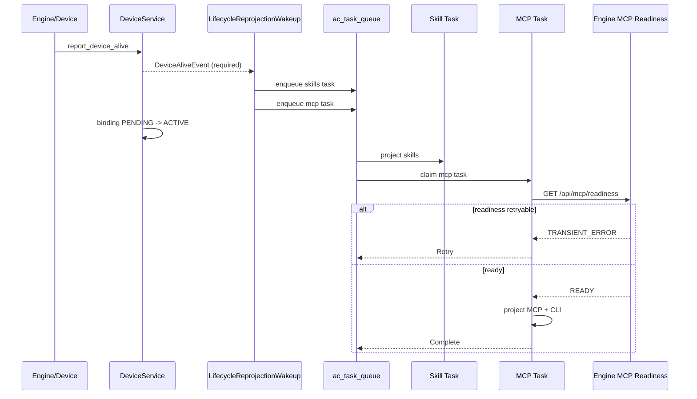

# 分域生命周期运行时重投影方案

> 状态：已定稿，尚未实现
>
> 日期：2026-09-09
>
> 源码核对基线：Avernet `github/dev` at `ca308268927f10df887ad3543d664244dbe6ce52`
>
> 决策记录：[ADR 0012](../../adr/0012-durable-per-domain-lifecycle-runtime-reprojection.md)

## 1. 结论

设备 `ACTIVE` 只表示当前 binding 已报告基础心跳，不表示 Skill、MCP 或整产物运行时均可交付。首次激活、BaaS 重启完成和显式恢复触发的 **PerDomain 生命周期重投影** 改由 `ac_task_queue` 持久执行，并拆成独立的 Skill 与 MCP 任务；用户 mutation 保持现有同步投影、响应和回滚合同。

MCP 任务在写入前调用 Engine 自己实现的 fail-closed `GET /api/mcp/readiness`。OpenClaw/Hermes 验证本地 MCP 配置面；AICoding/Claude Code 必须完成 Relay MCP 往返。Teclaw 不进入本方案：继续一次 compose 完整 `BotConfigArtifact`、一次 `/api/v1/bot/apply`，不增加 probe、任务或 retry。

## 2. 当前缺口

当前首次激活链路为：

```text
report_device_alive
  DeviceAliveEvent(required consumers)
  binding PENDING -> ACTIVE
  DeviceActivatedEvent
    SkillSymlinkListener
      BotRuntimeProjector.project(scope=everything)
```

`BotRuntimeProjector` 已用 `RuntimeProjectionResult` 表达 `CONVERGED`、`PENDING` 与 `DEGRADED`，issue 也已有 `retryable`；但 `SkillSymlinkListener` 同步执行后不处理返回结果。进程退出或 `PENDING` 都不会形成可恢复工作。

现有 `/readiness` 也不能作为 MCP 门禁：它表示 Engine 生命周期/进程状态；现有 `GET /api/mcp` 又可能把 Relay `response.ok=false` 降级为空列表并返回 200。

## 3. 范围

### 3.1 包含

- PerDomain Engine 的首次激活、BaaS 重启完成和显式重投影。
- Skill 与 MCP 生命周期任务的持久化、幂等、binding fencing、重试和终态。
- Engine MCP readiness Service API、HTTP adapter 和各 Engine 实现。
- Backend 当前 Runtime MCP probe module。
- Avernet Community、OCB Corp、协议测试、架构门禁和发布集成。

### 3.2 不包含

- 不改变 `DeviceBindingStatus.ACTIVE` 的含义。
- 不异步化用户 Skill/MCP mutation；不改变统一 MCP 配置失败回滚。
- 不改变 Teclaw WholeArtifact 投影、`/api/v1/bot/apply` 或重试语义。
- 不增加用户 UI，不把 Runtime 未收敛映射成 Bot 非 ACTIVE。
- 不复用或扩展 `skills_pool.reconcile` 承载 MCP 工作。
- 不以固定 `sleep`、字符串错误检测或无限重试作为 readiness。

## 4. 目标时序

### 4.1 PerDomain 首次激活



### 4.2 Teclaw

```text
WholeArtifactRuntimeProjection
  compose current complete BotConfigArtifact
    SkillRef + StoreRef
    McpServerRef
    resources / identity / CLI
  POST /api/v1/bot/apply exactly once
```

此路径保持现状，不进入 `runtime_projection.reconcile`。

## 5. 生命周期任务合同

统一 task type：

```text
runtime_projection.reconcile
```

PerDomain 产生两个 component task：

```text
runtime-projection:{env}:{binding_id}:skills
runtime-projection:{env}:{binding_id}:mcp
```

Payload：

```json
{
  "env": "prod",
  "bot_id": "...",
  "owner_id": "...",
  "binding_id": 123,
  "device_id": "...",
  "sandbox_id": "...",
  "component": "skills | mcp",
  "source": "device_alive | baas_restart | explicit_reconcile",
  "signal_identity": {}
}
```

每次执行必须：

1. 按 `binding_id` 重读 binding 与 Bot。
2. 校验 `env`、`device_id`、`sandbox_id` 和 Bot 当前 binding 均未改变。
3. 失配时 `Complete` 为 stale no-op，绝不选择历史 sandbox。
4. 从数据库重新解析当前 Desired State；payload 不携带 Skill/MCP 快照。
5. `skills` 调用 `project(scope=ProjectionScope(skills=True))`。
6. `mcp` 先做 MCP readiness，再调用 `project_mcp_and_cli(scope=ProjectionScope(mcp=True, claim_all_mcp=True))`。
7. `CONVERGED`/合法 `SKIPPED` → `Complete`；全部 issue 可重试 → `Retry`；存在不可重试 issue → `Fail`。

Task deadline 为 600 秒。超时进入 `TIMED_OUT`，保留 Desired State。新 binding、后续重启、显式 `RuntimeProjectionRequestedEvent` 或运维 manual reconcile 可以使用已释放的幂等键创建新任务。

Task worker 已有运行中 lease heartbeat；保留现有 transport 内部短重试不会造成 lease 过期后的重复 claim。生命周期的跨尝试退避继续由 worker 统一管理，范围为 1 秒指数增长至 60 秒上限。

## 6. MCP readiness 合同

Engine Core 增加独立结果类型：

```python
class McpRuntimeReadinessStatus(StrEnum):
    READY = "READY"
    NOT_CAPABLE = "NOT_CAPABLE"
    TRANSIENT_ERROR = "TRANSIENT_ERROR"
    INVALID = "INVALID"

@dataclass(frozen=True)
class McpRuntimeReadinessResult:
    status: McpRuntimeReadinessStatus
    engine: str
    reason: str | None
    retryable: bool
```

Engine MCP Service API 增加只读 readiness 方法，HTTP adapter 暴露：

```text
GET /api/mcp/readiness
```

HTTP 200 承载合法业务状态；无法形成合法合同响应时返回非 2xx。响应不得包含 MCP header、token、endpoint query secret 或完整配置。

状态解释：

| 状态 | 含义 | TaskOutcome |
| --- | --- | --- |
| `READY` | 当前 MCP 配置面可接受交付 | 继续投影 |
| `TRANSIENT_ERROR` | 启动中、连接失败、timeout、可恢复上游错误 | `Retry` |
| `INVALID` | 配置损坏、响应不合法、控制面矛盾 | `Fail` |
| `NOT_CAPABLE` | 当前 Engine/Image 不支持 MCP 投影合同 | `Fail` |

## 7. Engine 矩阵

| Engine | Projection | readiness 实现 | 本期行为 |
| --- | --- | --- | --- |
| OpenClaw | PerDomain | 解析本地 `mcporter.json` 并验证配置面 | 使用持久 Skill/MCP 任务 |
| Hermes | PerDomain | 验证本地 `mcporter.json`；不要求 Hermes Gateway connected | 使用持久 Skill/MCP 任务 |
| AICoding | PerDomain | Relay connected 且 `mcp.config.list` 明确 `ok=true` | 使用持久 Skill/MCP 任务 |
| Claude Code | PerDomain | Relay connected 且 `mcp.config.list` 明确 `ok=true` | 使用持久 Skill/MCP 任务 |
| Teclaw | WholeArtifact | 不调用 MCP readiness | 完全保持现状 |
| Moltis/未知 | 未确认 | `NOT_CAPABLE`，禁止默认乐观 READY | 不投递并显式失败 |

`GET /api/mcp/readiness` 不得调用现有会把 Relay 失败降级为空列表的 `list_servers()` 作为唯一判断；Relay Engine 的实现必须检查原始 RPC 结果。

## 8. 超时与并发

- Engine readiness 内部 deadline：5 秒。
- Backend `DeviceAdapterTransport` readiness deadline：8 秒。
- MCP CRUD 的 Engine 内部 Relay deadline 必须小于 Backend transport deadline；目标为 20 秒与 25 秒。
- Task lease heartbeat 必须覆盖整个 handler；不依赖固定 lease 长度猜测最长运行时间。
- 保留现有 MCP detail fan-out concurrency=5；当前没有证据表明并发度是根因。
- AICoding 的 `sync-cc --mcp` 当前失败只记录 warning，不改变配置写成功；实现时应把它从 HTTP 成功回执的关键路径分离，并保留单独的恢复与日志证据。

## 9. 模块变更计划

### 9.1 Avernet Backend

- `core/skill_center/services/skill_symlink_listener.py`
  - PerDomain 不再同步执行 lifecycle full projection。
  - WholeArtifact 保持当前直接投影。
  - `RuntimeProjectionRequestedEvent` 同样按 Projection Strategy 路由。
- 新增 lifecycle reprojection wakeup/task handler，复用 `TaskQueueService`、`HandlerRegistry` 与 `TaskOutcome`。
- `core/skill_center/services/runtime_projections/registry.py`
  - 通过正式 interface 暴露 lifecycle delivery shape，禁止 listener 硬编码 `engine == "teclaw"`。
- 新增 `CurrentMcpRuntimeProbeService`，消费 `DeviceContextResolver` 与 `DeviceAdapterTransport` Plugin API。
- 更新模块 `README.md` 的 `## Context Boundary` 元数据。

### 9.2 Avernet Engine

- MCP Core models/interface：增加 readiness 结果与方法。
- `api/mcp/router.py`：增加只做协议翻译的 `/api/mcp/readiness`。
- OpenClaw 与 Community Claude Code 实现 readiness。
- 更新 Engine MCP Service API 合同测试与路由测试。

### 9.3 OCB Corp

- AICoding、Claude Code、Hermes MCP 实现 readiness。
- 确认 Corp Device Adapter 与 Community task/probe 合同一致，不复制编排策略。
- 更新 `ocb-public` gitlink 到包含 Backend/Engine 公共合同的精确 SHA。
- 构建并部署包含对应 Engine 代码的镜像；只更新 Backend 或 gitlink不能证明运行时接口存在。

## 10. 测试矩阵

### Backend Core

- required `DeviceAliveEvent` 入队失败时 binding 保持 `PENDING`。
- 同一 binding/component 多次 wake 只保留一个 live task。
- stale binding/device/sandbox 任务安全 `Complete`，不访问旧实例。
- Skill 与 MCP 任务独立；MCP Retry 不重复投递已完成 Skill。
- `READY` 才调用 MCP projector。
- `TRANSIENT_ERROR`/retryable `PENDING` → `Retry`。
- `INVALID`/`NOT_CAPABLE`/non-retryable issue → `Fail`。
- deadline 后为 `TIMED_OUT`，Desired State 不回滚。
- mutation flow、统一 MCP 配置回滚与响应合同保持原样。
- Teclaw 仍是一次 compose、一次 apply、零 readiness 调用。

### Engine 合同

- 每个 MCP 实现通过同一 Service API conformance suite。
- Relay disconnected、RPC timeout、`ok=false` 不得返回 `READY`。
- 空 MCP 列表但 RPC `ok=true` 必须返回 `READY`。
- OpenClaw/Hermes 配置文件缺失的合法空状态与 JSON 损坏状态严格区分。
- readiness 响应不泄露 secret。

### OCB/集成

- Corp AICoding、Claude Code、Hermes conformance。
- ARCA 与 BaaS transport 路由。
- 首次激活、BaaS restart、Backend worker 重启恢复。
- Teclaw whole-artifact 回归。
- 架构依赖、context boundary、DI 与协议合同门禁。

## 11. 完成证据

必须分别报告：

1. Avernet 窄单测、合同测试、架构/DI/type/lint 门禁。
2. Standards/Spec 双轴 review 及问题修复。
3. Backend 全量测试最终一次。
4. Avernet PR、CI、review、merge 状态。
5. OCB Corp 实现与精确 `ocb-public` gitlink SHA。
6. OCB PR、CI、review、merge 状态。
7. Engine/Backend 镜像及部署版本。
8. 预发首次启动与重启验证：任务入队、probe 状态、Retry、最终 `CONVERGED`。
9. Teclaw 行为未变化的 live 证据。

本地测试或绿色 CI 均不能替代 OCB gitlink、镜像部署和运行时验证。
