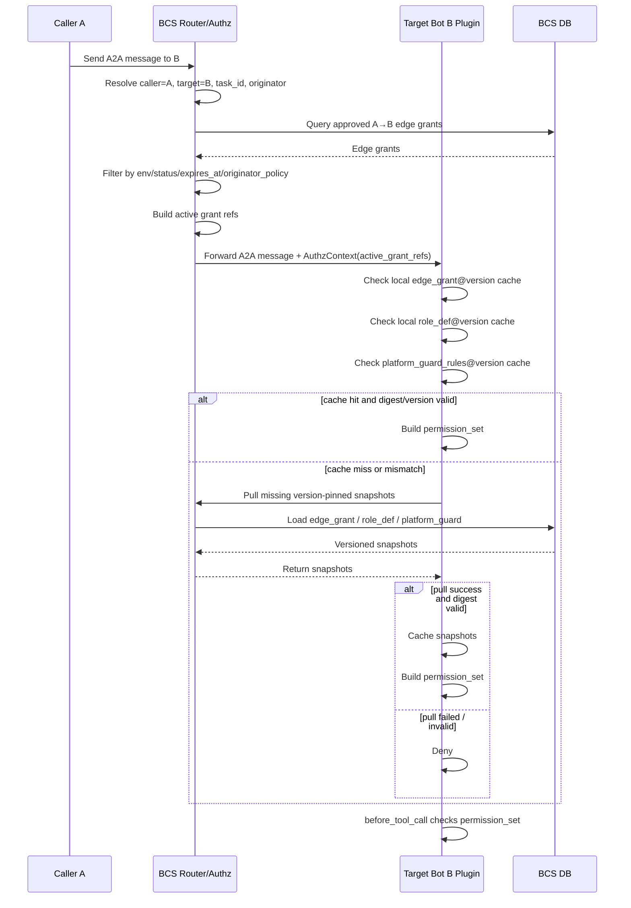
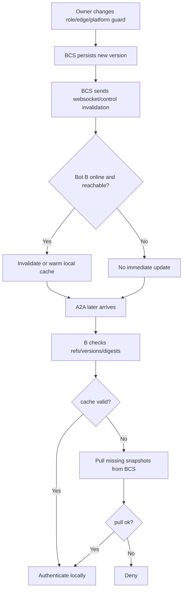
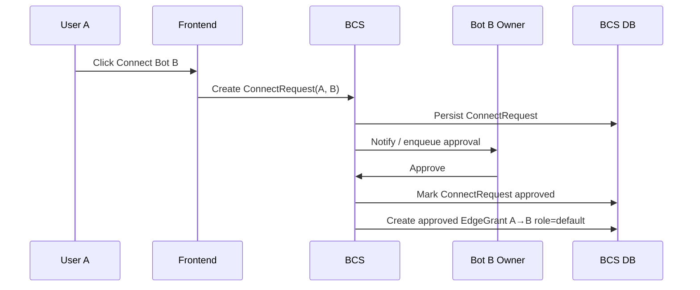
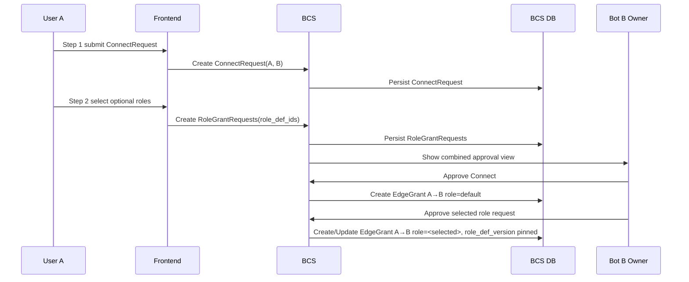
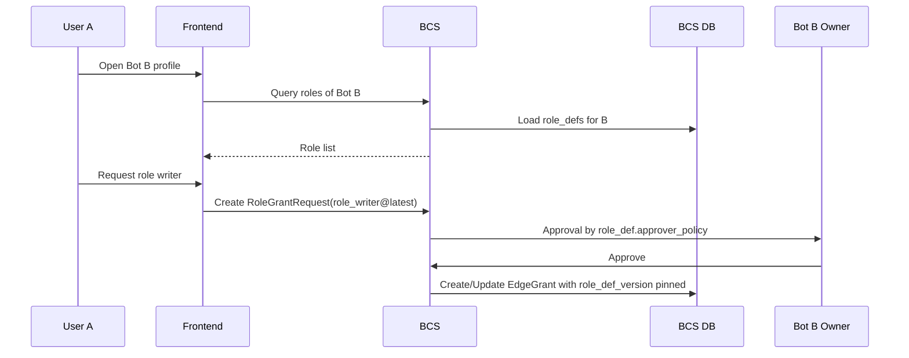
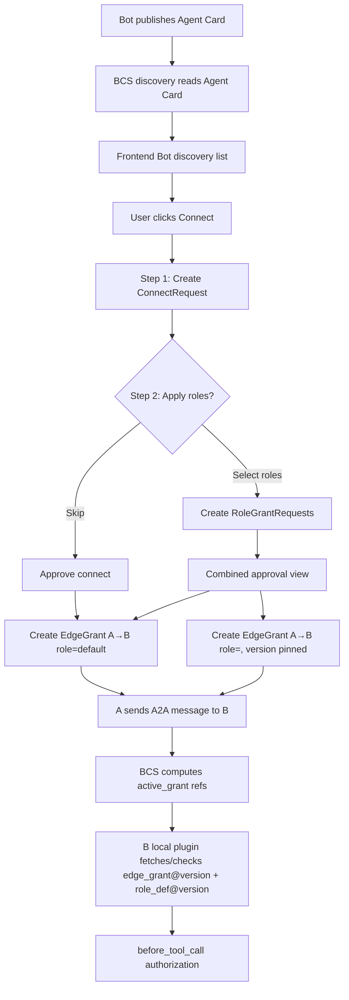

> **历史归档 / 非实现基线**：本文记录早期讨论方案，可能包含已废弃的 `role`、`edge_id` 下发、`permission_profiles[]` / `rules_grants[]` 拆分、`extra_rules` 等设计。实现请以 `docs/superpowers/specs/2026-08-07-bcs-a2a-authz-final-design.md` 和 `docs/superpowers/specs/2026-08-07-bcs-a2a-authz-implementation-spec.md` 为准。

# A2A 权限传递、本地鉴权缓存与授权申请策略

> 状态：设计草案 v2
> 日期：2026-08-05
> 关联：`docs/superpowers/specs/edge-permission-schema.md` Part III · A2A 协议融合

## 0. 总览

本文把两个相关但不同的问题放在同一份设计里：

1. **A2A 消息时如何确定鉴权集**：BCS 在 A→B 消息链路中注入什么，B 本地如何用缓存安全鉴权。
2. **授权边如何产生**：BCS 通过 discovery 发现 Bot 并在前端展示后，用户点击 Connect / 加好友时，是否应该同时展示和申请 Bot 暴露的角色。

核心区分：

```text
Discovery 发现 Bot ≠ 暴露完整角色目录
Connect / 加好友 ≠ 获得具体高阶能力
Role Request / 申请角色 ≠ A2A 消息时的鉴权判定
Approved EdgeGrant 才是 A2A 鉴权事实
```

---

# Part I · A2A 权限传递与本地鉴权缓存

## 1. 背景

BCS 边权限模型中，BCS 持有 Bot 的角色定义、权限规则、授权边以及 A2A 路由上下文。A2A 调用链路中，`caller A` 给 `target B` 发消息时，消息会经过 BCS 路由。

本部分解决的问题是：

> BCS 在 A2A 协议里应该如何把本次调用的授权信息传递给 B，使 B 能在本地插件中安全、准确、低开销地完成 tool 鉴权？

需要同时满足：

- A2A 消息不能携带完整权限集，避免臃肿和权限细节泄露。
- B 不能信任 caller 或中间 bot 自带的权限内容。
- B 本地缓存可以不是最新，但不能因为缓存过期导致越权。
- owner 修改 role/rules 后，旧授权边不能意外套用最新角色权限。
- BCS 主动下发可以优化性能，但不能成为安全正确性的唯一依赖。

## 2. 核心结论

A2A 权限传递采用：

> **A2A 只传 BCS 判定后的 active grant refs；B 本地用 version-pinned 的 `edge_grant@version` + `role_def@version` + `platform_guard_rules@version` 拼出鉴权集；缺缓存就向 BCS 拉取，拉不到就 deny；主动下发只做缓存预热和失效通知，不作为安全保证。**

也就是说：

- BCS 负责判断本次 A→B 调用有哪些授权边 active。
- A2A 消息只携带这些 active 授权边的引用、版本和摘要。
- B 本地插件负责根据版本钉住的缓存拼出本次鉴权集。
- 本地缓存 miss、版本不匹配、摘要不匹配或拉取失败时，默认拒绝。

## 3. 角色分工

| 组件 | 责任 |
|---|---|
| BCS | 维护 role_defs、edge_grants、platform guards；路由 A2A；计算 active grants；注入 AuthzContext |
| Bot B 本地插件 | 缓存 B 自己相关的 role_defs、edge_grants、platform guards；在 before_tool_call 中鉴权 |
| Caller A | 只发起调用，不提供可信权限事实 |
| Frontend / Owner 操作面 | 修改 role_def、edge grant、平台策略等配置，经 BCS 持久化和版本化 |

## 4. A2A 中传递什么

BCS 在 A2A 消息中注入 `AuthzContext`。

`AuthzContext` 中的 `active_grants` 是瘦引用，不包含完整 rules。

示例：

```json
{
  "authz_context": {
    "task_id": "task_001",
    "originator": "H_alice",
    "issued_at": 1785900000000,
    "expires_at": 1785900300000,
    "active_grants": [
      {
        "edge_id": "edge_123",
        "edge_version": 12,
        "edge_digest": "sha256:...",
        "role_def_id": "role_writer",
        "role_def_version": 7,
        "platform_guard_version": 4,
        "expires_at": null
      }
    ]
  }
}
```

### 4.1 `edge_digest` 是什么

`edge_digest` 是 `edge_grant@version` 快照的内容指纹。

它用于让 B 本地确认：

```text
我缓存的 edge_123@12，确实就是 BCS 在本次 A2A AuthzContext 里引用的那份 edge_123@12。
```

建议计算对象是 canonical JSON 后的 `edge_grant_snapshot` 关键字段，例如：

```text
edge_id
edge_version
from_id
to_id
env
status
role_def_id
role_def_version
extra_rules
originator_policy_type
originator_policy_data
expires_at
```

区别：

| 字段 | 含义 |
|---|---|
| `edge_version` | 版本号，表达这条 edge grant 演进到了第几版 |
| `edge_digest` | 内容指纹，表达本地缓存内容是否和 BCS 引用内容一致 |
| BCS signature | 可选签名，用于证明 AuthzContext 确实由 BCS 签发 |

`edge_digest` 不是完整权限，也不是签名。MVP 可以先只做 `edge_version`，但推荐保留 `edge_digest` 字段，因为它能发现本地缓存污染、序列化 bug 或错误回滚。

### 4.2 A2A 不传递的内容

A2A 消息不携带：

- 完整 role rules。
- 完整 edge extra_rules。
- B 的完整权限集合。
- caller 自声明的授权内容。

原因：

- 避免 A2A 消息体膨胀。
- 避免将 B 的完整能力细节暴露给 A 或中间链路。
- 避免 caller / 中间 bot 篡改 rules 后诱导 B 鉴权。
- 避免把授权事实来源从 BCS 转移到消息内容本身。

## 5. B 本地缓存什么

B 本地插件维护两类权限事实缓存和一类平台守卫缓存。

### 5.1 `role_def@version`

角色定义版本缓存。

Key：

```text
(role_def_id, role_def_version)
```

Value 示例：

```json
{
  "role_def_id": "role_writer",
  "version": 7,
  "bot_id": "B",
  "role_name": "writer",
  "rules_template": [
    {
      "tool": "LarkDoc",
      "specifier": "doc:*",
      "decision": "allow"
    }
  ],
  "digest": "sha256:...",
  "fetched_at": 1785900000000
}
```

### 5.2 `edge_grant@version`

授权边版本快照缓存。

Key：

```text
(edge_id, edge_version)
```

Value 示例：

```json
{
  "edge_id": "edge_123",
  "edge_version": 12,
  "from_id": "A",
  "to_id": "B",
  "status": "approved",
  "role_def_id": "role_writer",
  "role_def_version": 7,
  "extra_rules": [
    {
      "tool": "LarkDoc",
      "specifier": "doc:123",
      "decision": "allow"
    }
  ],
  "originator_policy_type": "any",
  "expires_at": null,
  "edge_digest": "sha256:...",
  "fetched_at": 1785900000000
}
```

`extra_rules` 归属于 edge grant，因此直接放在 `edge_grant@version` 里，不单独拆成独立缓存。

### 5.3 `platform_guard_rules@version`

平台守卫规则缓存。

Key：

```text
platform_guard_version
```

Value 示例：

```json
{
  "version": 4,
  "rules": [
    {
      "tool": "Bash",
      "specifier": "rm -rf /*",
      "decision": "deny"
    }
  ],
  "digest": "sha256:...",
  "fetched_at": 1785900000000
}
```

平台守卫规则在本地鉴权时优先级最高。

## 6. 鉴权集如何确定

B 收到 A2A 消息后，只信任 BCS 注入的 `authz_context.active_grants`。

对每个 active grant ref：

1. 查本地 `edge_grant_cache[(edge_id, edge_version)]`。
2. 校验 `edge_digest`。
3. 校验 `edge.from_id == caller`。
4. 校验 `edge.to_id == self`。
5. 校验 `edge.status == approved`。
6. 校验 `edge.expires_at` 未过期。
7. 查本地 `role_def_cache[(role_def_id, role_def_version)]`。
8. 查本地 `platform_guard_rules[platform_guard_version]`。
9. 任一缺失、版本不符、摘要不符，则向 BCS 拉取。
10. 拉取失败则 deny。

命中后，B 本地拼出本次 active permission set：

```text
permission_set =
  platform_guard_rules@version
  + role_def@version.rules_template
  + edge_grant@version.extra_rules
```

多个 active grants 同时存在时：

```text
permission_set = 多条 edge 对应权限的并集
```

最终在 `before_tool_call` 阶段执行具体 tool/specifier 判定。

## 7. Version Pin 语义

B 本地鉴权永远按版本钉住的权限事实执行，不能使用 latest role 自动替代旧版本。

例如：

```text
edge_123@12 钉住 role_writer@7
```

如果 owner 后来把 `writer` 改到 v8：

```text
role_writer@latest = v8
edge_123@12 仍然使用 role_writer@7
```

旧 edge 不会自动套用最新 role。

如果 owner 希望旧 edge 使用 v8，需要显式执行 reapply / upgrade：

```text
reapply role_def
  → BCS 更新 edge_grant
  → edge_version 变化
  → edge_digest 变化
  → 后续 A2A 携带新的 grant ref
  → B 本地 miss 或 digest mismatch
  → B 向 BCS 拉取新 edge_grant@version / role_def@version
```

## 8. 下发与拉取策略

采用：

```text
拉取是安全闭环；下发是性能优化。
```

### 8.1 按需拉取

B 收到 A2A 消息后，如果本地缺少：

- `edge_grant@version`
- `role_def@version`
- `platform_guard_rules@version`

则同步向 BCS 控制接口拉取。

拉取成功后继续鉴权。

拉取失败、超时、版本不一致或摘要不一致时：

```text
deny
```

### 8.2 主动下发 / 失效通知

当前端 owner 修改 role、edge 或平台策略后，BCS 可以通过 websocket/control channel 给在线 Bot B 发送通知：

```text
role_def_updated
edge_grant_updated
platform_guard_updated
invalidate_cache
```

这些通知用于：

- 预热缓存。
- 提前失效旧缓存。
- 降低下一次 A2A 调用时的同步拉取延迟。

但通知不是安全正确性的依赖。

即使通知失败，也不会导致越权；最多导致下一次 A2A 时 B 发现 miss 或版本不匹配，然后同步拉取。

## 9. 缓存淘汰

本地缓存可以采用 LRU / TTL / max bytes 组合策略。

推荐：

| 缓存 | 策略 |
|---|---|
| `role_def@version` | versioned；可 LRU；可持久化；保留 latest 和近期历史版本 |
| `edge_grant@version` | versioned；内含 extra_rules；可 LRU；可 TTL；可持久化 |
| `platform_guard_rules@version` | 建议保留 latest 和少量历史版本 |

缓存淘汰不影响安全：

```text
cache miss → pull from BCS → pull failed means deny
```

## 10. 流程图

### 10.1 A2A 调用整体流程



### 10.2 本地鉴权集拼接

```mermaid
flowchart TD
  Start[A2A message received] --> ReadCtx[Read AuthzContext.active_grants]
  ReadCtx --> ForEach[For each GrantRef]

  ForEach --> EdgeCache{edge_grant@version exists?}
  EdgeCache -- No --> PullEdge[Pull edge_grant@version from BCS]
  EdgeCache -- Yes --> EdgeDigest{edge_digest valid?}
  PullEdge --> EdgeDigest

  EdgeDigest -- No --> Deny[Deny]
  EdgeDigest -- Yes --> EdgeFields{from/to/status/expires valid?}
  EdgeFields -- No --> Deny
  EdgeFields -- Yes --> RoleCache{role_def@version exists?}

  RoleCache -- No --> PullRole[Pull role_def@version from BCS]
  RoleCache -- Yes --> GuardCache{platform_guard@version exists?}
  PullRole --> GuardCache

  GuardCache -- No --> PullGuard[Pull platform_guard@version from BCS]
  GuardCache -- Yes --> Compose[Compose permission set]
  PullGuard --> Compose

  Compose --> Rules[platform_guard + role_def.rules_template + edge.extra_rules]
  Rules --> ToolCall[before_tool_call]
  ToolCall --> Decision{Allowed?}
  Decision -- Yes --> Allow[Allow tool]
  Decision -- No --> Deny
```

### 10.3 Role 更新与旧 Edge 的关系

```mermaid
flowchart LR
  R7[role_writer@7] --> E12[edge_123@12 pins role_writer@7]
  E12 --> Auth1[B uses role_writer@7 + edge_123@12.extra_rules]

  Owner[Owner edits writer role] --> R8[role_writer@8 latest]
  R8 -. does not affect .-> E12

  Owner2[Owner explicitly reapplies role] --> E13[edge_123@13 pins role_writer@8]
  E13 --> Auth2[B uses role_writer@8 + edge_123@13.extra_rules]
```

### 10.4 下发与拉取关系



## 11. 安全不变量

1. **A2A 消息不携带完整权限集。**
2. **B 不信任 caller 自带 rules。**
3. **BCS 注入 active grant refs，是 A2A 鉴权上下文的来源。**
4. **B 本地鉴权必须校验 edge_id、edge_version、role_def_version、digest。**
5. **本地 cache miss 不默认 allow，必须拉取；拉取失败则 deny。**
6. **旧 edge 不自动套用 latest role。**
7. **owner 修改 role_def 只产生新 role_def version，不自动改变旧 edge。**
8. **旧 edge 升级必须显式 reapply，产生新 edge_version。**
9. **主动下发只是缓存优化，不是安全正确性的依赖。**
10. **platform guard deny 优先级最高。**

---

# Part II · Discovery、Connect 与 Role Request

## 12. 背景

BCS 会通过 A2A / Bot discovery 协议读取 Bot 的 agent card，并把 Bot 展示在前端界面中。这样其他用户可以直接在前端发现 Bot，而不需要每个 Bot 再逐个向其他 Bot 发送 A2A 请求获取 agent card。

本部分解决的问题是：

> 用户在前端点击“加好友 / Connect”时，是否应该同时申请这个 Bot 的角色？

会议结论：

> **不需要在本期区分 public / private / connected / hidden 等角色可见性。加好友和申请角色仍然是两个语义动作，但前端流程可以做成两步：第一步申请好友，第二步可选申请角色。**

也就是说：

```text
Step 1: Connect / 加好友
  建立基础关系

Step 2: Optional Role Request / 可选申请角色
  在加好友流程后选择是否额外申请一个或多个角色

Approved EdgeGrant
  后续 A2A 鉴权使用的权限事实
```

## 13. 设计原则

### 13.1 Connect 和 Role Request 语义分离

Connect 的语义是：

```text
A 希望和 B 建立基础联系，并获得最低限度的基础交互资格。
```

通过后，可以授予低风险 `default` role，例如：

```text
允许基础 chat
允许查看 Bot 基础信息
允许触发低风险 basic interaction
```

Role Request 的语义是：

```text
A 希望获得 B 的某一类额外能力授权。
```

它最终会转化为具体的 `EdgeGrant`，并在 A2A 消息时进入 Part I 的 `active_grants` 计算。

### 13.2 前端流程可以合并

虽然领域语义分离，但用户体验不需要割裂成两个入口。

推荐流程：

```text
用户点击 Connect
  ↓
Step 1: 填写好友申请 / connect request
  ↓
Step 2: 展示可申请角色列表，用户可选，也可以跳过
  ↓
提交
```

如果用户只想加好友，可以跳过第二步。

如果用户同时申请角色，后端仍然把它拆成：

```text
ConnectRequest
RoleGrantRequest(role_1)
RoleGrantRequest(role_2)
...
```

### 13.3 不引入角色可见性分层

本期不设计：

```text
public roles
connected roles
invite_only roles
hidden roles
request_visibility
```

角色是否展示、展示多少细节、是否需要过滤，不作为本期策略重点。

本期只保留一个简单规则：

```text
加好友流程第二步可以展示 Bot 当前可申请的角色列表；用户可选申请，也可跳过。
```

后续如果出现安全、合规或产品复杂度问题，再单独引入角色可见性字段。

## 14. 推荐领域模型

建议把申请流程和最终授权事实分开：

```text
BotDiscoveryProfile
  来自 agent card
  面向发现和展示
  不等于最终授权事实

ConnectRequest
  from_id
  to_id
  status
  message
  requested_at
  decided_at

RoleGrantRequest
  from_id
  to_id
  role_def_id
  role_def_version
  status
  applicant
  reason
  requested_at
  decided_at

EdgeGrant
  approved 后生成或更新
  真正进入 A2A active_grants
```

关键不变量：

```text
申请单不是授权事实。
只有 approved EdgeGrant 才能进入 A2A 鉴权链路。
```

## 15. 前端交互流程

### 15.1 Bot 发现列表

展示：

```text
Bot 名称
描述
头像
能力摘要
标签
Connect 按钮
```

用户点击 Connect 后进入两步申请流程。

### 15.2 Step 1：申请好友 / Connect

第一步展示基础好友申请表单：

```text
申请连接 Bot B

申请说明：
[________________]

下一步：选择是否申请角色
```

这一步产生：

```text
ConnectRequest(A, B)
```

如果审批通过，BCS 可以创建基础授权边：

```text
EdgeGrant A→B role=default
```

### 15.3 Step 2：可选申请角色

第二步展示 Bot 的角色列表，用户可以选择一个或多个角色，也可以跳过。

示例：

```text
可选申请角色：
[ ] reader
[ ] commenter
[ ] lark_doc_writer
[ ] repo_operator

申请理由：
[________________]

[跳过，只申请好友]
[提交申请]
```

如果用户选择角色，则后端创建：

```text
RoleGrantRequest(reader)
RoleGrantRequest(commenter)
RoleGrantRequest(lark_doc_writer)
...
```

如果用户跳过，则只保留 `ConnectRequest`。

### 15.4 已连接后的 Bot Profile

用户和 Bot 已建立基础关系后，仍然可以在 Bot Profile 中继续申请角色：

```text
当前拥有的角色
可申请的角色
申请状态
过期时间
```

这属于单独的 Role Request，不需要重新走 Connect。

## 16. 后端流程

### 16.1 Connect only



### 16.2 Connect + optional role requests



### 16.3 Connected user later requests role



## 17. 和 Part I 的衔接

Part II 解决的是：

```text
EdgeGrant 从哪里来？
```

Part I 解决的是：

```text
A2A 消息发生时，已批准的 EdgeGrant 怎么被安全使用？
```

衔接关系：

```text
Discovery
  → ConnectRequest
  → optional RoleGrantRequest
  → Approved EdgeGrant
  → A2A active_grant refs
  → B local edge_grant@version + role_def@version 鉴权
```

一旦 RoleGrantRequest 被批准，BCS 创建或更新：

```json
{
  "edge_id": "edge_123",
  "from_id": "A",
  "to_id": "B",
  "role_def_id": "role_writer",
  "role_def_version": 7,
  "edge_version": 12,
  "extra_rules": []
}
```

后续 A 给 B 发 A2A 消息时，BCS 仍按 Part I：

```text
查 approved edges
过滤 env/status/expires_at/originator_policy
注入 active_grant refs
B 本地按 version-pinned cache 拼接鉴权集
```

因此，前端 Connect / Role Request 的设计不会改变 A2A 鉴权链路的安全不变量。

## 18. MVP 建议

MVP 必做：

1. Connect 和 Role Request 概念分离。
2. Connect 默认只申请或授予 `default` role。
3. Connect 流程做成两步：第一步好友申请，第二步可选角色申请。
4. 第二步可以跳过。
5. 用户已连接后，可以在 Bot Profile 中继续单独申请角色。
6. 只有 approved EdgeGrant 能进入 A2A `active_grants`。

MVP 暂缓：

1. public/private/connected/hidden 等角色可见性分层。
2. 邀请链接。
3. 复杂组织可见性。
4. 角色推荐。
5. 批量申请多个 role 的复杂审批编排。
6. role marketplace。

## 19. 全链路图



## 20. 产品与权限不变量

1. **Connect 是基础关系申请，不等于所有角色授权。**
2. **Role Request 是额外能力申请。**
3. **前端可以把 Connect 和 Role Request 做成两步连续流程。**
4. **第二步角色申请是可选的，可以跳过。**
5. **申请单不是授权事实。**
6. **只有 approved EdgeGrant 才能进入 A2A active_grants。**
7. **Connect 审批通过后通常产生 `default` role 的基础 EdgeGrant。**
8. **Role Request 审批通过后产生对应 role 的 version-pinned EdgeGrant。**
9. **用户已连接后仍可单独申请更多角色。**
10. **本期不引入角色可见性分层。**

## 21. 待接入原文档的位置

建议后续将本设计合并进 `edge-permission-schema.md`：

- 替换或扩展 Part III §18 `AuthzContext`。
- 扩展 §21 friend-check 替换为 edge 准入后的本地鉴权缓存策略。
- 在 §23 A2A 融合改造点中增加：
  - Bot 本地 `role_def@version` cache。
  - Bot 本地 `edge_grant@version` cache。
  - Bot 本地 `platform_guard_rules@version` cache。
  - BCS version-pinned snapshot pull API。
  - websocket/control invalidation protocol。
- 在申请/审批流程中区分：
  - `ConnectRequest`。
  - `RoleGrantRequest`。
  - `EdgeGrant`。
- 本期不在 role_def schema 中增加角色可见性分层字段。
