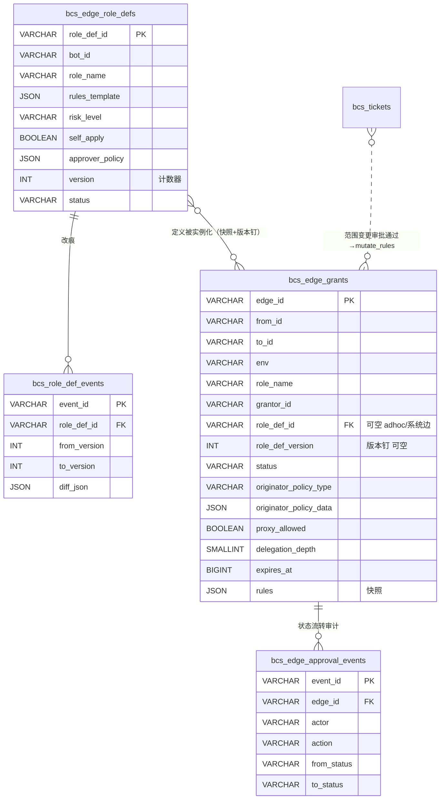

> **历史归档 / 非实现基线**：本文记录早期讨论方案，可能包含已废弃的 `role`、`edge_id` 下发、`permission_profiles[]` / `rules_grants[]` 拆分、`extra_rules` 等设计。实现请以 `docs/superpowers/specs/2026-08-07-bcs-a2a-authz-final-design.md` 和 `docs/superpowers/specs/2026-08-07-bcs-a2a-authz-implementation-spec.md` 为准。

# BCS 边权限 Schema 设计

> 状态：设计定稿（grilling 共识，11 项决策 + 角色定义 + 新表迁移）
> 日期：2026-08-02
> 关联：`docs/arch/arch.rules.md`、`bcs-edge-permission-design` 记忆、briefing `2026-07-27-bcs-edge-permission-briefing(1).html`

## 1. 背景与范围

BCS 边权限把"谁能以什么角色对谁的 Bot 用哪些能力"建模为**有向角色授权图**：点 = human / bot / service 三类 actor，有向边 `A→B` = 一份角色授权（`EdgeGrant`）= 一个自带规则集的 grant 文档。本设计落地该模型的物理 schema、求值语义、申请-审批流程，以及从现有 `bcs_actor_relations` + friend 表的兼容迁移。

**本期 MVP 范围**：① human 直达（DirectOnly）+ ② human 经 bot 中转（OriginatorIn）。③ bot 自启动 / ④ service caller / proxy 多级 / originator-bound 临时边只留模型字段，不进本期。

## 2. 决策总览

| # | 决策 | 要点 |
|---|---|---|
| Q1 | owner 全权 = 通配 allow rule | `rules=[{tool:'*',specifier:'*',allow}]}`；`role_name='owner'` 纯标签；删 `is_creator` |
| Q2 | 无匿名边 | 临时授权用 `role_name='adhoc:<grantor>'`；`role_name` 恒非空 |
| Q2b | 2-layer，无 relation 父表 | `grants` + `approval_events`；"两点一条边"父表 rejected |
| Q3 | 唯一键 `UNIQUE(from_id,to_id,env,role_name)` | `grantor_id` 普通属性；一角色一绑定，生命周期同行连续 |
| Q4 | env = 部署环境 | prod/pre/dev/singlebox；与发布阶段正交；边按 env 隔离 |
| Q5 | originator_policy 双列 | `type`(列,direct_only/originator_in/any) + `data`(JSON)；预留 space_member_of/has_role 零迁移 |
| Q6 | rules 改 = 直接 mutate + 审计 | 范围变更审批走上层 `bcs_tickets`；边无影子 pending |
| Q7 | rules 存边 JSON 列 | 撤 `edge_rules` 子表；grant 自包含，热路径一次行读 |
| Q8 | owner = `H_<created_by>` | 团队 bot owner=管理员自然人；null→`system`；`co_editor` 独立边 |
| Q9 | 删位图三列 + 表名 | `kinds/allow/deny` 弃用删；命名 `bcs_edge_grants` |
| Q10 | 快照 + 版本钉 | grant 拷 `rules_template` 到边 + 钉 `role_def_version`；定义改不动已授边 |
| Q11 | 版本简化 | role_def 单活行 + `version` 计数器；旧版以快照活在边上；升级靠显式"重新应用" |
| —  | 新表迁移 | `bcs_edge_grants` 等四表纯新增，历史 ETL 迁入；旧 `bcs_actor_relations` 保留过渡 |

## 3. 实体关系



四张核心表 + 边之上独立工单层 `bcs_tickets`（非边审批，工单中心 = 待审边 ∪ 待审单 视图，本 schema 不展开其细节）。

## 4. DDL

> SQLite/MySQL 双 flavor。差异处用生成列模拟 partial unique（MySQL 8）或直接条件唯一（SQLite partial index）。时间戳一律 BIGINT 毫秒。

### 4.1 `bcs_edge_role_defs`（角色定义，每 bot 维度，单活行）

```sql
CREATE TABLE bcs_edge_role_defs (
  role_def_id    VARCHAR(48) PRIMARY KEY,
  bot_id         VARCHAR(64) NOT NULL,
  role_name      VARCHAR(64) NOT NULL,
  display_name   VARCHAR(64) NULL,
  description    VARCHAR(256) NULL,
  rules_template JSON NOT NULL DEFAULT '[]',
  risk_level     VARCHAR(16) NOT NULL DEFAULT 'medium',  -- low/medium/high
  self_apply     BOOLEAN  NOT NULL DEFAULT FALSE,
  approver_policy JSON NOT NULL,                         -- {"type":"bot_owner|specific|auto","approvers":[...]}
  version        INT NOT NULL DEFAULT 1,
  status         VARCHAR(16) NOT NULL DEFAULT 'active',  -- draft/active/deprecated
  created_by     VARCHAR(64) NOT NULL,
  created_at     BIGINT NOT NULL,
  updated_at     BIGINT NOT NULL,
  UNIQUE (bot_id, role_name)
);
CREATE INDEX ix_roledef_bot ON bcs_edge_role_defs(bot_id, status);
```

- 系统角色 `owner`/`default`/`co_editor`：bot 创建时由 `ensure_owner_edges` seed 三条 `created_by='system'`。
- `adhoc:<grantor>` 无定义（边自带 rules，`role_def_id` 为 NULL）。

### 4.2 `bcs_role_def_events`（角色定义改痕）

```sql
CREATE TABLE bcs_role_def_events (
  event_id     VARCHAR(48) PRIMARY KEY,
  role_def_id  VARCHAR(48) NOT NULL,
  actor        VARCHAR(64) NOT NULL,
  from_version INT NOT NULL,
  to_version   INT NOT NULL,
  diff_json    JSON NULL,
  at           BIGINT NOT NULL
);
CREATE INDEX ix_roledef_event ON bcs_role_def_events(role_def_id, at);
```

### 4.3 `bcs_edge_grants`（授权边，自包含 grant 快照）

```sql
CREATE TABLE bcs_edge_grants (
  -- 标识
  edge_id    VARCHAR(48) PRIMARY KEY,
  from_id    VARCHAR(64) NOT NULL,
  to_id      VARCHAR(64) NOT NULL,
  env        VARCHAR(16) NOT NULL,

  -- 角色 + 定义溯源
  role_name        VARCHAR(64) NOT NULL,
  grantor_id       VARCHAR(64) NOT NULL,
  role_def_id      VARCHAR(48) NULL,
  role_def_version INT NULL,

  -- 生命周期
  status        VARCHAR(16) NOT NULL DEFAULT 'pending',  -- pending/approved/rejected/revoked/expired
  applicant     VARCHAR(64) NULL,
  approver      VARCHAR(64) NULL,
  requested_at  BIGINT NULL,
  decided_at    BIGINT NULL,
  reject_reason VARCHAR(256) NULL,

  -- 准入策略
  originator_policy_type  VARCHAR(16) NOT NULL DEFAULT 'any',  -- direct_only/originator_in/any
  originator_policy_data  JSON NULL,
  proxy_allowed    BOOLEAN  NOT NULL DEFAULT FALSE,
  delegation_depth SMALLINT NOT NULL DEFAULT 0,
  expires_at       BIGINT NULL,
  purpose          VARCHAR(256) NULL,
  audit_required   BOOLEAN  NOT NULL DEFAULT FALSE,

  -- 权限规则（快照）
  rules JSON NOT NULL DEFAULT '[]',  -- [{tool,specifier,decision,priority,note}]

  created_at BIGINT NOT NULL,
  updated_at BIGINT NOT NULL,
  UNIQUE (from_id, to_id, env, role_name)
);
CREATE INDEX ix_grant_into ON bcs_edge_grants(to_id, env, status);
CREATE INDEX ix_grant_eval ON bcs_edge_grants(from_id, to_id, env, status);
CREATE INDEX ix_grant_app  ON bcs_edge_grants(applicant, status);
CREATE INDEX ix_grant_appr ON bcs_edge_grants(approver, status);
```

> `UNIQUE(from_id,to_id,env,role_name)` 统一唯一键，无 partial 索引、无匿名分支。`role_name='adhoc:<grantor>'` 自带 grantor，同 grantor 重复授天然合并进同一条边。

### 4.4 `bcs_edge_approval_events`（边状态流转审计）

```sql
CREATE TABLE bcs_edge_approval_events (
  event_id    VARCHAR(48) PRIMARY KEY,
  edge_id     VARCHAR(48) NOT NULL,
  actor       VARCHAR(64) NOT NULL,
  action      VARCHAR(16) NOT NULL,  -- apply/approve/reject/revoke/expire/mutate_rules/comment
  from_status VARCHAR(16) NOT NULL,
  to_status   VARCHAR(16) NOT NULL,
  reason      VARCHAR(256) NULL,
  at          BIGINT NOT NULL
);
CREATE INDEX ix_event_edge ON bcs_edge_approval_events(edge_id, at);
```

## 5. 标准 Grant 样式

| 角色 | role_name | rules | status | grantor/approver | policy | from_id |
|---|---|---|---|---|---|---|
| owner | `owner` | `[{*,*,allow}]` | approved | system/system | any | `H_<created_by>` |
| friend | `default` | 拷自 role_def default | approved（双向两条） | accept 方 owner | any | human/bot |
| 命名角色 | `lark_writer` 等 | 拷自 `rules_template` | approved/pending | 按 `approver_policy` | 由配置 | caller |
| 临时 | `adhoc:<grantor>` | 边自带 | approved | grantor | 由配置 | caller |
| 共编辑 | `co_editor` | 拷自 role_def co_editor | approved/pending | bot_owner | any | member |

**漂移检测**：`bcs_edge_grants.role_def_version <> bcs_edge_role_defs.version` → UI 标 lagging，owner 走"重新应用当前版本"（低危批量自动、高危逐条审批）。

## 6. 求值语义（两层直判）

```text
请求 caller a → target B
┌─ 第一层·准入 ─────────────────────────────────────────────┐
│ EXISTS edge FROM a→B, env, status='approved', 未过期         │
│ 无 → 拒（不唤醒 bot）                                        │
└─────────────────────────────────────┬──────────────────────┘
┌─ 第二层上层·激活 ──────────────────────────────────────────┐
│ 对每条 approved 边 match originator_policy_type:           │
│   direct_only   → caller==originator 且直达                 │
│   originator_in → originator ∈ data.ids                   │
│   any           → 命中（owner 边常用）                       │
│ 不命中 → 该边不进 rule 池                                    │
└─────────────────────────────────────┬──────────────────────┘
┌─ 第二层下层·规则（bot 端 before_tool_call）────────────────┐
│ active 边的 rules JSON 展平并集 →                            │
│   1. 平台守卫 deny 命中 → 熔断 deny（最高优先级）           │
│   2. 否则 allow 优先：任一 allow→allow                       │
│   3. 无 allow 有 deny → deny                                │
│   4. 全未命中 → bot default                                 │
│   5. default 未命中 → deny（零信任）                         │
└────────────────────────────────────────────────────────────┘
```

**平台守卫** = 全局配置驱动的高危 deny 清单（如 `Bash: rm -rf /*`），不归 owner 配、不可取消、绕开 allow 优先。

## 7. 申请-审批流程（依赖角色定义）

```text
caller 申请角色 R 于 target B
  → resolve role_def(B, R)
  → 查 approver_policy / self_apply / risk_level：
       self_apply=true ∧ risk=low → 直落 status='approved'（事后审计）
       否则 → 写 status='pending' 边（applicant=caller），approver_policy=bot_owner 路由
              → bot_owner 审 → approved / rejected
  → approved 边的 rules = 拷自 role_def.rules_template，role_def_version = role_def.version
```

**rules 修改**（已有 approved 边改 rules）：

- 有权方（owner/approver）直接 mutate `edge.rules` + 写 `bcs_edge_approval_events(action='mutate_rules')`。
- 敏感"公开范围变更"走 `bcs_tickets` 审批，通过后系统触发 mutate。
- 边上**无**影子 pending-change 状态；审批复杂度交给工单层。

## 8. 配置项（config-driven，Rule 14）

```toml
[edge_permission]
preauthorized_callers = ["H_alice", "svc_ci"]                    # 自动 approved
self_apply_roles      = ["default", "lark_read_only"]            # 申请即落、事后审计
platform_guard_rules  = [{tool="Bash", specifier="rm -rf /*"},
                          {tool="Bash", specifier="sudo *"}]
default_proxy_allowed = false
```

## 9. 兼容迁移（新表 + ETL，7 步）

新 schema 与旧 `bcs_actor_relations`（6 列）语义不同，采用**纯新增表 + 历史 ETL 迁入 + 旧表保留过渡**，而非 in-place ALTER。

```text
1. 建新四表（4.1–4.4）
2. 建新 repo + 新写路径：
     ensure_owner_edges → 写 grant + seed owner/default/co_editor role_def
     friend accept      → 写 default grant（双向）
     角色申请-审批       → 落 grant
3. 双写一周期：新写路径同时写新表与旧（bcs_actor_relations + bcs_friendships + bcs_friend_requests）
     写面小（owner 边在 bot 创建时落、friend 在 accept 时落），双写廉价
4. ETL 批（可重放）：
     旧 bcs_actor_relations(owner 边) → owner grant（role_name='owner', rules=[{*,*,allow}], from_id=H_<created_by>）
     bcs_friendships                 → default approved grant（双向两条，rules 拷自 default role_def）
     pending bcs_friend_requests     → default pending grant
     按 bot seed owner/default/co_editor 三条 role_def
5. 切读：repo 优先读新表，miss 回退旧表
6. 停双写到旧；旧表只读备份
7. 下一发布：drop 旧表 + 废 RelationRepo/FriendRepo
```

**回滚**：任何阶段 revert 代码即恢复旧读写；新表留存或 drop 皆可；旧数据未动。步骤 6/7 不可逆——必须在双写稳定 + 切读验证通过后执行，建议 5 与 6/7 分两个发布周期。

**ID 规范化**：旧 `bcs_bots.created_by`（user id）→ owner grant 的 `from_id` 需规范化为 `H_<id>`（见 `bcs-human-actor-id-h-format-migration`），归 `ensure_owner_edges` 做。

## 10. 代码锚点

| 改造 | 锚点 |
|---|---|
| Rust 类型 `RelationEdge` → `EdgeGrant` + 新 `RoleDef` | `ocb-public/src/bcs/crates/contracts/bcs-domain/src/actor.rs:65` |
| `EdgeGrantRepo` / `RoleDefRepo`（新表）+ 旧 `RelationRepo` 降 fallback | `services/bcs-relation-store/`、`bcs_service_api::port::repo` |
| 新表 DDL + 迁移脚本 | `bootstrap/bcs/src/migrations.rs` |
| 准入调用点（挂第一层） | group 创建 friend 检查、`/bots/{id}/chat`、`/sessions/{id}/state-machine-runs` |
| owner 边落库 + ID 规范化 | `ensure_owner_edges`（`actor.rs:50`） |
| friend 双写/切读 | `bcs-friend` + `bcs-friend-store` + `human_friend_dual_write_integration.rs` |
| bot 端 rule 消费（第二层下层） | `src/plugin/packages/openclaw-channel-bcn-internal/src/{internal-enhancements.ts,hitl.ts}` |

### 微内核合规

- **Rule 14**：`preauthorized_callers` / `self_apply_roles` / `platform_guard_rules` 全配置驱动，无散落 `if is_local_mode()`。
- **Rule 20/21**：`EdgeGrantRepo`/`RoleDefRepo` 需 local/prod 实现 + Noop/Mock + 契约测试（`tests/contracts/test_edge_grant.py` 同型）。
- **Rule 25**：求值器与 repo 的 conformance 套件，upper-layer consumer 用 local impl 注入 `world` fixture。

### `Option<T>` 合规（`ocb-public/AGENTS.md`）

`role_def_id` / `role_def_version` / `applicant` / `approver` / `originator_policy_data` / `expires_at` 的 `None` 均为 **intentional state**（adhoc/系统边、未决策、不限策略、永久），结构体注释须标明，符合 AGENTS.md 对 Option 的约束。

## 11. 附录：决策追溯（grilling 纪要）

- **Q1** owner 全权三选 → 通配 allow rule（C），消灭魔法角色判等与 `is_creator`。
- **Q2** 删匿名边 → `adhoc:<grantor>` 确定性自动名复刻合并。
- **Q2b** relation 父表 → 关系级属性太薄（可见性/隐私实为 bot 级），2-layer 更合理。
- **Q3** 唯一键 → `(from,to,env,role_name)`；grantor 不进键，避免多 granter 同角色病态。
- **Q4** env 与发布阶段正交，按部署隔离。
- **Q5** originator policy 双列预留，MVP 枚举 ids，未来 space/role 零迁移。
- **Q6** rules 改直接 mutate + 工单包裹范围变更，边上无影子 pending。
- **Q7** rules 存边 JSON，撤子表，热路径一次行读。
- **Q8** owner = `H_<created_by>` 自然人；空间非 actor；co_editor 独立边。
- **Q9** 删位图三列；表名 `bcs_edge_grants`（对齐 `EdgeGrant` 类型）。
- **Q10/Q11** 快照 + 版本钉；role_def 单活行 + version 计数器，旧版以快照活在边上，升级靠显式"重新应用"。
- **迁移** 纯新增表 + ETL，旧表保留过渡，比 in-place ALTER 更可逆。

---

# Part II · 产品改版结合点与改造点

> 第二轮 grilling 共识（2026-08-03）。把 §Part I 的 schema 映射到 TC 工作台改版 + BCN 迁移的产品表面，钉**应用点**（产品面→边/角色/工单）与**改造点**（代码动哪）。

## 12. 边模型范围界定（第二轮 Q1）

**边权限严格只管"bot 被要求用 tool"**（briefing 原范围；Q6 进一步加固：tool 执行身份=bot 自己）。以下属于"管理 bot 本身"，**不进**边 tool-rules，走 **backend bot-edit 授权域**：编辑锁、定时任务协作者、#11 服务bot协同审批。

**例外：co_editor 双授权**（Q1）——co_editor 既要"改"也要"用"bot，两套并存：

| 关注点 | 授权什么 | 落点 |
|---|---|---|
| 编辑 | 改 bot 配置 | backend edit-auth 域 |
| 使用 | 调用/测试 bot（BCN 对话） | `role_name='co_editor'` 边 |

owner 添加 co_editor 时**同时落两套**，移除时同时撤，生命周期对齐、语义独立。`co_editor` role_def 默认通配 allow、owner 可收窄（仅管 tool 调用，不管编辑权）。草稿/预发态编辑调试走 **Bot 工坊 debug 通道**（不经 BCN 边）。

## 13. 应用点（产品表面 → schema 映射）

### 13.1 TC 工作台改版

| 产品表面 | schema 映射 | 决策 |
|---|---|---|
| 空间管理员/成员 | `space_members` 域（**非边**，space 非 actor） | Q8 |
| 团队 Bot 单聊（成员） | `team_member` 自动边（加入空间→写，离开→撤） | Q4=A2 |
| 团队 Bot 单聊（`team_member` role_def） | 独立于 `default`，rules 更宽，owner/admin 设 | Q4 |
| co_editor 编辑授权 | backend edit-auth（非边） | Q1 |
| co_editor 用 bot | `co_editor` 边（ BCN 对话，running 态） | Q1 双授权 |
| 编辑锁 / 定时任务协作者 / #11 协同审批 | backend edit-auth 域 / `bcs_tickets` | Q1 |
| Bot 公开状态变更（公开↔私有） | `bcs_tickets`（bot 属性，非边） | Q3 |
| 协作群公开状态变更 | `bcs_tickets`（group 属性） | Q3 |
| Bot 公开权限范围变更 | `bcs_tickets`（通过→mutate `default` role_def rules + `role_def_events`） | Q2 |
| Skill 共同编辑申请 | skill 服务审批表（非边、非 `bcs_tickets`） | Q3 |
| 空间加入申请 | space 成员服务审批表（非边、非 `bcs_tickets`） | Q3 |
| 好友申请 | `default` 边审批（pending→approved） | Q2 |
| #10 caller 身份调用 | originator 上线（见 §14） | Q5 |

### 13.2 BCN 迁移

| BCN 表面 | schema 映射 | 决策 |
|---|---|---|
| 好友关系（#5/#7 可聊Bot→好友） | `default` 边（双向两条） | Q2 |
| 公开能力范围（①首次公开） | `default` role_def `rules_template`；首次设定走"公开能力范围审批"（`bcs_tickets`→mutate role_def）；好友申请 grant 同一份 default 边 | Q2=A |
| 公开资源范围（①） | 同上，资源表达为 rules 中的 tool/specifier | Q2 |
| 可聊状态 / 公开画像 / 开放加好友（②隐私） | **bot 级属性**（非 edge、非对级） | Q8 |
| 统一 BotID 含 uuid（③） | actor_id 格式变 → edge `from_id`/`to_id` 迁移 | 迁移 |
| 单聊·我管理 Bot（④） | `owner` 边 | — |
| 单聊·好友公开 Bot（④） | `default` 边 | Q2 |
| 单聊·共享团队 Bot（④） | `team_member` 自动边 | Q4 |
| 协作群（④） | BCS group V1 服务（非 1:1 边） | 独立域 |
| 多 Session（④⑨） | BCS session 携 `task_id`/`originator`；同 (Human,Bot) 多 task_id | Q5 |
| 通知中心（⑤） | `bcs_edge_approval_events` ∪ `bcs_tickets` ∪ space/skill 待审 的联邦事件 | Q3 |
| 存量可聊 Bot 回刷好友（⑥⑦） | 批量写 `default` approved 边（双向，rules 快照=通配 allow 保留旧行为）；幂等 skip 已有；冲突走产品层确认 prompt 不阻断 | Q7 |
| 存量单聊 Session→BCS Session（⑧） | 一次性 ETL：旧 session→BCS session，originator=该 Human，task_id 新生成，历史消息迁移 | Q7 |
| 多 Session 新能力（⑨） | 新功能，旧数据不涉及 | Q7 |

### 13.3 准入与状态的两轴

- **edge.status**（pending/approved/...）= 持久授权策略。
- **bot.status**（服务 bot：草稿/预发/运行/下线）= 运行时可达性门（Q5=A）。
- 准入第一层 = `EXISTS approved edge` **AND** bot 可对话态（服务 bot 须 running；非服务 bot 无 gate）。边随生命周期**持久保留**，下线 bot 不可达→准入拒，重运行即恢复。草稿/预发调试走 Bot 工坊 debug 通道，不经 BCN 边。

## 14. 改造点（代码动哪）

### 14.1 BCS Rust

| 改造 | 锚点 | 说明 |
|---|---|---|
| 协议帧加 `task_id` + `originator` | `bcs-protocol` | originator 由 BCS 填，bot 不设 |
| `task_id→originator` 绑定落库 + session 维度 | 新表/扩 session store | 承载 #9 多 Session |
| BCS 每跳按 task_id 注入 originator | `bcs-http`/`bcs-ws` 路由 | 防篡改：bot 永远只携 task_id |
| 准入第一层 + bot.status 门 | group 创建 friend 检查、`/bots/{id}/chat`、`/sessions/{id}/state-machine-runs` | Q5 |
| `team_member` 自动边 provision/revoke | 空间成员服务 join/leave 钩子 | Q4 |
| role_def seed（owner/default/co_editor/team_member） | `ensure_owner_edges` | bot 创建时 |
| `bcs_tickets`（bot/group 属性审批） | 新表 + 工单联邦 | Q3 |
| 新四表 + ETL（见 §9） | `migrations.rs`、`bcs-relation-store/src/lib.rs` | Part I |

### 14.2 Plugin（OpenClaw channel）

| 改造 | 锚点 |
|---|---|
| bot outbound 调下游带 `task_id`（无则拒） | `bcs-cli`/`bcs-coordination` SKILL、openclaw channel |
| `before_tool_call` 消费 `rules`（allow 优先 + 平台守卫） | `src/plugin/.../openclaw-channel-bcn-internal/src/{internal-enhancements.ts,hitl.ts}` |
| tool 执行身份=bot 自己（本期不做 originator 委托） | 同上 |

### 14.3 Backend / Frontend

| 改造 | 说明 |
|---|---|
| co_editor backend edit-auth 域 | 配置写授权，与 `co_editor` 边生命周期对齐 |
| `space_members` 服务 + 成员→`team_member` 边钩子 | Q4 |
| `bcs_tickets`：Bot 公开状态/群公开/范围变更审批 | Q3，范围变更通过→触发 `default` role_def mutate |
| 工单中心联邦视图 | 边待审 ∪ `bcs_tickets` ∪ space 待审 ∪ skill 待审 |
| 隐私管理 UI（可聊/公开画像/开放加好友） | bot 级属性 |
| 单聊统一入口（我管理/共享团队/好友 Bot） | 读 owner/team_member/default 边 |
| 多 Session UI | 同 (Human,Bot) 多 task_id |
| 统一 BotID（含 uuid）迁移 | actor_id 格式，影响 edge from/to_id |
| 存量回刷 ETL | default 边（双向，通配 allow）+ session ETL（§13.2） |

## 15. 求值时序（带 originator）

```text
Human Alice → bot1（首跳）
  BCS 盖定 originator=Alice，落 task_id→Alice 绑定
  准入：Alice→bot1 approved edge? bot1 可对话态? → 通过
  bot1 用 tool：按 active edge rules 鉴权（执行身份=bot1）

bot1 → bot3（中转，originator=Alice）
  bot1 outbound 只带 task_id（不带 originator）
  BCS 路由：按 task_id 注入 originator=Alice 进下游帧
  准入：bot1→bot3 approved edge? bot3 running? → 通过
  第二层上层：originator_policy match（OriginatorIn([Alice])? → 激活）
  第二层下层：active edge rules 鉴权（执行身份=bot3）
  MVP：bot outbound 无 task_id → 拒（防绕过 DirectOnly）
```

## 16. 第二轮决策追溯

| # | 决策 |
|---|---|
| Q1 | 边模型只管 tool 调用；co_editor 双授权（backend edit-auth + `co_editor` 边）；草稿/预发调试走 debug 通道 |
| Q2 | 公开能力/资源范围 = `default` role_def `rules_template`；首次设定走审批，好友申请 grant 同一份 default 边 |
| Q3 | `bcs_tickets` 只收无家 bot/group 属性审批；space/skill 各归各；工单中心联邦视图 |
| Q4 | 团队 Bot 单聊 = `team_member` 自动边（加入空间写/离开撤），独立 role_def、rules 更宽 |
| Q5 | originator 本期上线（A）；BCS 持 task_id→originator 绑定、每跳注入、bot 只携 task_id（防篡改）；无 task_id 拒绝 |
| Q6 | tool 执行身份=bot 自己（X）；originator 本期仅激活边，不做执行身份委托 |
| Q5' | bot.status 作准入门（服务 bot 仅 running 经边对话；非服务 bot 无 gate）；边持久不随状态迁移 |
| Q7 | 存量回刷：default 边双向、rules 通配 allow 保留旧行为、ETL 幂等 skip 冲突+产品层确认 prompt 不阻断；单聊 Session→BCS Session 一次性 ETL |

---

# Part III · A2A 协议融合

> 第三轮 grilling 共识（2026-08-03）。把边权限的 originator / role / 边准入 / authz 融入 BCS A2A（bot↔bot 直接对话）协议，并按"扩展 A2A 增强安全"的方向预留可验凭证。A2A 在本仓 = BCS 自身的 agent-to-agent 协议（`bcs-protocol/src/a2a.rs`、`A2aChat` 服务、`bcs-cli chat`），**已挂 friend 检查**且已携 `from_actor_id`/`authenticated_staff_id`/`session_key`——融合 = 把这些对齐边权限语义 + 补显式 authz。

## 17. 融合总览

```text
human Alice → bot1（首跳）
  BCS: mint task_id(ULID) + 绑定 task_id→originator=Alice
  BCS: 解析 (Alice→bot1) active grants（approved 边 × originator 激活）
  BCS: 注入 AuthzContext 进 A2A run 首条帧（瘦：edge 引用，不含 rules）
  bot1: before_tool_call 用按 edge_id 缓存的 rules 本地判（allow 优先 + 守卫）

bot1 → bot3（中转，新 run_id，同 task_id）
  bot1 outbound 只带 task_id（不带 originator）
  BCS 路由: 按 task_id 注入 originator=Alice；解析 (bot1→bot3) active grants；注入 AuthzContext
  bot3: 用 active grants 的 rules 判；MVP 无 task_id → 拒
```

三轴分离：`task_id` 跨跳稳定（originator 作用域）/ `run_id` per-hop（每跳新）/ `edge_id` rules 缓存键（稳定，跨 run 复用）。

## 18. `AuthzContext`（瘦，run 首条注入）

```jsonc
AuthzContext {
  task_id: String,                 // BCS-mint, 跨跳稳定
  originator: String,              // BCS 按 task_id 注入, bot 不可设
  original_caller: Option<String>, // 预留（代理场景）, MVP=originator
  active_grants: [GrantRef],       // (caller→target) 的 active 边引用, 不含 rules
  issued_at: i64,
  expires_at: i64,                 // 短 TTL（task/run 生命内）
  signature: Option<Bytes>         // C 扩展（BCS 签名）预留, 本期可空
}
GrantRef {
  edge_id, role_name, role_def_id, role_def_version,
  originator_policy_type, expires_at
  // rules 不在此; 目标端按 edge_id 缓存取
}
```

- **瘦**：只带 edge 引用（几十字节），不带 rules JSON → 多跳频繁 run 也不膨胀。
- **per-hop**：active_grants 是 (caller→target) 针对，每跳不同，无法跨跳复用。
- **rules 按 edge_id 缓存**：目标端按 GrantRef.edge_id 取 rules 并缓存（TTL 刷新 / role_def_version 变则失效重取）；rules 是边快照、稳定，跨 run 复用，不随 run_id 变。
- **签名（C）预留**：`signature` 本期可空，安全加固时 BCS 签 AuthzContext、目标端验签，使 A2A 自携可验授权（抗篡改/重放，异步离线 run 自洽）。

## 19. `A2aChatCommand` 字段改造

| 字段 | 现状 | 改造 |
|---|---|---|
| `caller: CallerContext` | 即时 caller | **保留**=即时 caller（bot1 调 bot3 时 caller=bot1） |
| `task_id` | 无 | **新增**：BCS-mint（首跳生成），下游透传 |
| `originator` | 无（散落在 from_actor_id/staff_id） | **新增**：BCS 按 task_id 注入，bot 不可设 |
| `authz_context: Option<AuthzContext>` | 无 | **新增**：run 首条带；后续消息只携 `run_id`/`task_id` |
| `original_caller` | 无 | **新增（预留）**：MVP=originator，代理场景激活 |
| `from_actor_id` | 语义模糊 | **deprecated**：新代码不读，过渡后删 |
| `authenticated_staff_id` | originator 候选 | **降级**：BCS 内部首跳 originator 来源，不进下游帧 |
| `session_key` | 会话 | **保留**：per-pair 会话语义，与 task_id 分离 |
| `organization_code` | org scope | 保留 |

关键：`originator` 是 BCS 注入的**显式字段**，不藏在 `from_actor_id` 的多重含义里（安全可审计）。

## 20. task_id 生成与 originator 注入

- **生成**：BCS 在首次 human→bot 调用时 mint（ULID），绑定 `task_id→originator=该 human`。client/bot **不可生成**（防伪——伪造 task_id 即伪造 originator 绑定）。
- **透传**：bot outbound 只携 `task_id`；BCS 路由每跳按 task_id 从绑定注入 `originator` 进下游帧。bot 永远不设 originator → 天然不可篡改（无需密码学盖戳）。
- **与 session_id 分离**：task_id 跨跳（originator 作用域）；session_id per-pair 会话。首跳 human↔bot1 建会话时 BCS 同时 mint task_id；子会话（bot1↔bot3）有自己的 session_id 但携同一 task_id。
- **多 Session（#9）**：同一 (Human,Bot) 多个对话 = 多个 BCS-mint 的 task_id（同 originator、不同 task）。MVP 一对话一 task_id，不跨会话恢复。

## 21. 准入与 AuthzContext 注入合一（friend→edge 准入）

旧 A2A friend-check（`are_friends`/`not_friends_bot_ids`）**替换为 BCS edge 准入**，且与 AuthzContext 注入是同一件事：

```text
BCS 准入（第一层）+ 激活（第二层上层）= 计算 active grants = AuthzContext.active_grants
  SELECT * FROM bcs_edge_grants
   WHERE from_id=caller AND to_id=target AND env AND status='approved'
     AND (expires_at IS NULL OR expires_at>now)
  → 对每条边 match originator_policy_type（direct_only/originator_in/any，按 task_id 解析的 originator）
  → 命中的边 = active_grants
  无 active grant → 拒（不唤醒）
  有 → 注入 AuthzContext（run 首条）+ bot 端 union rules、allow 优先 + 守卫
```

- **多边并集**：caller 与 target 可能同时有 default(friend) + lark_writer + team_member 多条边；全部 active 的并集进 active_grants，目标端 union rules、allow 优先。
- **role-pinning 留后期**：MVP 不让 caller 显式指定 `role_name`（最小权限按需收窄）；BCS 默认并集所有 active 边。
- 旧 friend 表经 §9 迁移降级后废，friend 检查代码随删。

## 22. bot 发现 / Agent Card 分层广播 role_defs

`/bots/discover`（及 Agent Card）按**分层**广播 `role_defs`：

| 层 | 内容 | 可见性 |
|---|---|---|
| 元数据层（画像） | `role_name` / `display_name` / `description` / `risk_level` / `approver_policy.type` / `self_apply` | **公开**——对应 BCN ③"查看 Bot 画像"、知情申请 |
| 明细层（武器库） | `rules_template`（具体 tool/specifier） | **仅 edge 持有者或申请审批中**可见 |

非好友只看画像、不看武器库；避免 bot 内部能力细节泄漏给无权者。

## 23. 改造点（A2A 融合）

| 模块 | 改造 | 锚点 |
|---|---|---|
| `bcs-protocol` | `A2aChatCommand` 加 `task_id`/`originator`/`authz_context`/`original_caller`；新增 `AuthzContext`/`GrantRef` 类型 | `contracts/bcs-protocol/src/a2a.rs`、`service-api/src/application/a2a_chat.rs` |
| BCS 路由 | 首跳 mint task_id + 绑定 originator；每跳按 task_id 注入 originator + 解析 active grants + 注入 AuthzContext | `adapters/http/bcs-http`、`adapters/ws/bcs-ws`、`a2a_chat` 应用服务 |
| BCS 准入 | friend-check 替换为 edge 准入（计算 active grants）；挂 §10 准入点 | group/chat/sessions 调用点 |
| task_id→originator 绑定 | 新表或扩 session store（task_id, originator, created_at, ttl） | 新 repo |
| rules 缓存 | 目标端按 edge_id 缓存 rules（TTL/版本失效） | bot 端 `internal-enhancements.ts`/`hitl.ts` |
| bot 发现 | `/bots/discover` 分层广播 role_defs 元数据 | `bcs-bot` 发现服务、Agent Card |
| bot outbound | 调下游只携 task_id（无则 MVP 拒） | `bcs-cli`/`bcs-coordination` SKILL、openclaw channel |

## 24. 代理预留（本期不实现）

- `original_caller`（AuthzContext/A2A）预留，MVP=originator、不激活代理逻辑。
- `proxy_allowed` / `delegation_depth` 留在 **edge 属性**（Part I §4.3，默认 inactive：`proxy_allowed=false`、`delegation_depth=0`），准入门读、本期不设 proxy 边。
- 代理多级、③ bot 自启动、④ service caller 落地时：填 `original_caller` + 开边属性 + 实现 delegation_depth 递减，协议不改。

## 25. 第三轮决策追溯（A2A 融合）

| # | 决策 |
|---|---|
| Q1 | authz 权威 = B（BCS 注入 AuthzContext）；修正为**瘦 AuthzContext per-hop**（仅 edge 引用、不含 rules）+ rules 按 edge_id 目标端缓存（与 run/task 解耦） |
| task_id | BCS 首跳 mint（ULID）+ 绑 originator；client/bot 不可造；与 session_id 分离；MVP 一对话一 task_id |
| Q2 | A2A 新增显式 `task_id`/`originator`/`authz_context`/`original_caller`；`caller` 保留=即时 caller；`from_actor_id` deprecated；`session_key` per-pair；`authenticated_staff_id` 降内部 |
| Q5 | bot 发现分层广播 role_defs：元数据公开、rules_template 仅 edge 持有者/申请时可见 |
| Q6 | friend-check 替换为 BCS edge 准入（计算 active grants=注入 AuthzContext，合一）；多边并集、allow 优先；role-pinning 留后期 |
| Q4 | 预留 `original_caller`（MVP=originator 不激活）；proxy_allowed/delegation_depth 留 edge 属性默认 inactive；代理逻辑延后 |