# 手把手复现 WAIC 现场演示全流程

这是一份面向第一次接触 Avernet、甚至不熟悉命令行的 macOS 教程。完成后，你会在自己的电脑上启动 Avernet、接入 6 个世界杯内容 Bot，从前端选择内置的“世界杯比赛前瞻内容生产”模板，绑定角色，提交一次自定义协作，并看到多 Bot 按固定流程完成内容生产。

本教程使用的模板源码是：

- [世界杯比赛前瞻内容生产 YAML](../src/bcs/seeds/collaboration-templates/zh-CN/world-cup-preview-content-production.yaml)
- [世界杯 6 Bot 配置](../scripts/6bots_world_cup_creator_profile/bots.json)

> 产品文案统一使用“自定义协作”。代码中的 state machine 是它的实现方式；旧资料里的“结构化协同”或“自定义协同”在本教程中都按“自定义协作”理解。

## 1. 最终会复现出什么

运行成功后，本机包含三部分：

1. BCS：负责 Bot 接入、群组、路由和自定义协作执行。
2. Avernet 前端：在浏览器中选择模板、绑定 Bot、提交任务和查看结果。
3. 世界杯内容小队：6 个各司其职的 Bot。

6 个 Bot 分别是：

| Bot | 在流程中的职责 |
| --- | --- |
| 世界杯运营总监 | 明确选题目标、受众、平台、时长和整体制作方向 |
| 世界杯内容主编 | 整理任务简报并验收最终发布包 |
| 世界杯战术解说 | 设计战术看点、关键对位和通俗表达 |
| 世界杯赛事数据核查 | 核验赛程、球队、球员、历史交锋和数据口径 |
| 世界杯短视频编导 | 生成指定时长的口播稿和纯文字分镜 |
| 世界杯增长运营 | 生成标题、封面文案、发布包装和互动方案 |

模板执行顺序如下。战术分析和事实核查会并行进行，完成后再汇合到短视频脚本节点：

~~~mermaid
flowchart LR
    A["世界杯运营总监 安排制作方向"] --> B["世界杯内容主编 整理任务简报"]
    B --> C["世界杯战术解说 设计战术洞察"]
    B --> D["世界杯赛事数据核查 核验选题事实"]
    C --> E["世界杯短视频编导 创作两分钟脚本"]
    D --> E
    D --> F["世界杯增长运营 包装分发素材"]
    E --> F
    F --> G["世界杯内容主编 验收最终发布包"]
~~~

## 2. 开始前必须准备什么

### 2.1 电脑和网络

- 一台 macOS 电脑。Apple Silicon 和 Intel Mac 都可以。
- 能访问 GitHub、npm、Rust crates 等公共依赖源的网络。
- 足够的可用磁盘空间。首次构建会下载 Node.js 和 Rust 依赖，Rust 构建产物可能占用数 GB。
- 安装工具时可能需要输入当前 macOS 用户的管理员密码。
- Chrome、Safari 或其他现代浏览器。

仓库没有在本教程中规定更具体的 macOS 最低版本；建议使用仍在 Apple 安全支持范围内的版本。

### 2.2 一个可用的模型配置

要看到 6 个 Bot 真正生成内容，必须准备以下两种方式之一：

- 已经能正常使用的 OpenClaw 配置文件，默认位置为 ~/.openclaw/openclaw.json。
- 一个 OpenAI-compatible 模型服务的 Base URL、API Key 和模型 ID。

如果只选择 mock 模式，Bot 可以接入协作网络，但不会产生真实模型回复，因此不能完整复现这次演示。

请不要把 API Key 发到群聊、截图中或提交到 Git。手工配置时，只把它写入仓库根目录的 .env.local；该文件用于本机配置，不应提交。

### 2.3 本机端口

默认需要以下本机端口空闲：

| 端口 | 用途 |
| --- | --- |
| 8000 | Avernet 前端 |
| 21000 | BCS |
| 30401 | 世界杯运营总监 |
| 30411 | 世界杯内容主编 |
| 30421 | 世界杯赛事数据核查 |
| 30431 | 世界杯战术解说 |
| 30441 | 世界杯短视频编导 |
| 30451 | 世界杯增长运营 |

如果你不确定端口是否空闲，后面的检查命令会帮你确认。不要直接结束不认识的进程；先确认它属于哪个应用。

### 2.4 认识“终端”

后续命令都在 macOS 的“终端”中执行：

1. 按 Command + 空格打开聚焦搜索。
2. 输入“终端”或 Terminal。
3. 按回车打开。
4. 每个代码框里的命令可以逐行复制，粘贴后按回车。

代码框中不包含终端最左侧的提示符，不需要额外输入美元符号。

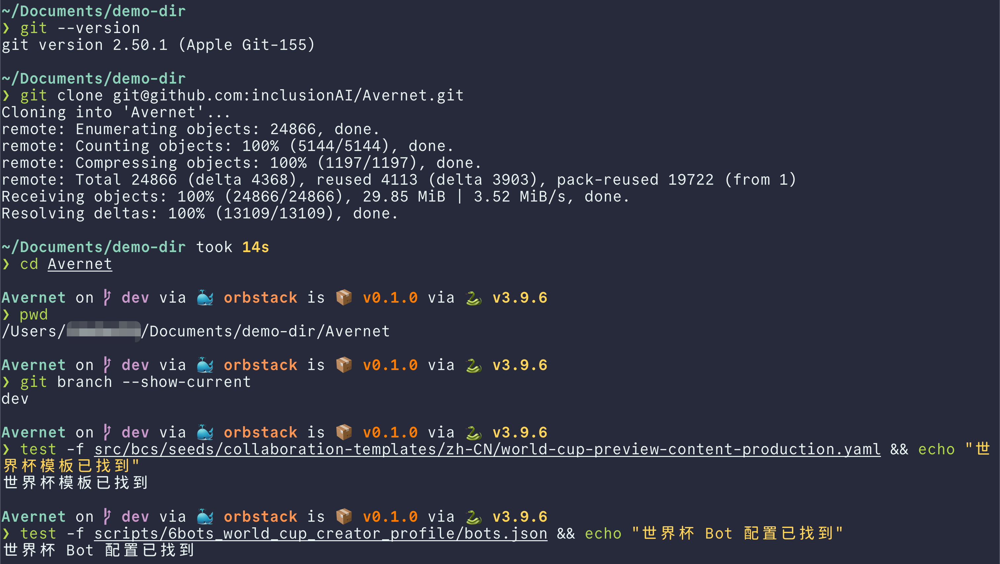

## 3. 第一步：安装 Git

先检查 Git 是否已经存在：

~~~bash
git --version
~~~

如果看到类似 git version 2.x.x，说明可以继续。

如果提示 command not found，可运行：

~~~bash
xcode-select --install
~~~

macOS 会弹出安装窗口。完成 Command Line Tools 安装后，关闭并重新打开终端，再次运行 git --version。

## 4. 第二步：克隆 Avernet

在终端中运行：

~~~bash
git clone https://github.com/inclusionAI/Avernet.git
cd Avernet
~~~

第二行非常重要：它会让终端进入刚下载的项目目录。后续所有以 ./scripts 开头的命令，都必须在这个目录中运行。

可以用下面两条命令确认当前位置和当前分支：

~~~bash
pwd
git branch --show-current
~~~

pwd 输出的最后一段应是 Avernet。仓库默认分支是 dev；如果功能尚未合入你当前的分支，请切换到包含本教程和世界杯模板的分支后再继续。

确认模板文件确实存在：

~~~bash
test -f src/bcs/seeds/collaboration-templates/zh-CN/world-cup-preview-content-production.yaml && echo "世界杯模板已找到"
test -f scripts/6bots_world_cup_creator_profile/bots.json && echo "世界杯 Bot 配置已找到"
~~~

两行都应显示“已找到”。

## 5. 第三步：安装开发工具

推荐让仓库脚本检查并安装缺失工具：

~~~bash
./scripts/singlebox.sh install-tools
~~~

这个过程是交互式的。脚本可能会：

- 检查基础编译环境。
- 安装或升级 Node.js 22+ 和 uv。
- 询问是否安装 OpenClaw、Rust/Cargo、protoc、jq 等缺失工具。
- 在没有 Homebrew 时提示你先从 brew.sh 安装 Homebrew。

看到确认问题时，先阅读它准备安装的内容，再根据提示输入 y 或 n。为了完成本教程，Rust 1.91+、Cargo、protoc、Node.js 22+、npm、OpenClaw 2026.3.28+、jq、curl、lsof、pkg-config、OpenSSL 和 SQLite 开发库都需要可用。

> 第一次安装和构建会花较长时间，具体取决于网络和电脑性能。只要终端仍持续输出下载或编译信息，就先让它完成，不要关闭终端。

完成后执行依赖预检：

~~~bash
./scripts/singlebox.sh check bcs_frontend
~~~

此时还没有编译 BCS，因此暂时不要执行 Bot 的完整预检；下一步编译完成后再检查。

更完整的工具说明见 [macOS 依赖清单](dependencies.zh-CN.md)。

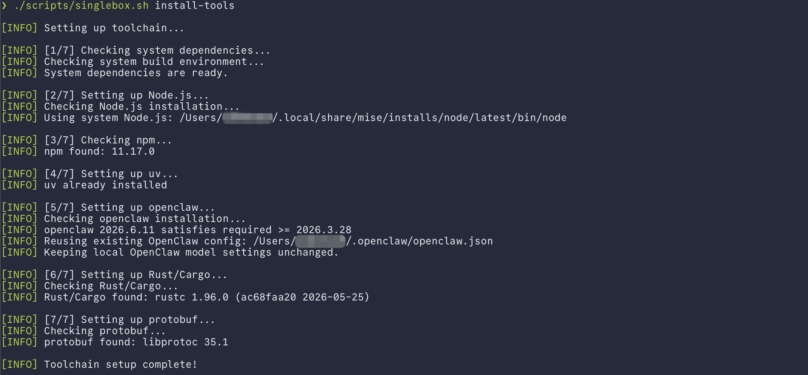

## 6. 第四步：编译 BCS 并安装前端依赖

运行：

~~~bash
./scripts/singlebox.sh setup bcs_frontend
~~~

这一步会：

- 编译 BCS 和配套命令行工具。
- 构建 BCS 面板资源。
- 按前端 lockfile 安装前端依赖。

首次执行通常是整个教程中耗时最长的一步。成功结束时，应看到 BCS setup complete 和 Frontend ready 一类提示。

现在再检查世界杯 Bot 的启动条件：

~~~bash
./scripts/singlebox.sh check bots --profile-dir scripts/6bots_world_cup_creator_profile
~~~

预检应识别到 6 Bot manifest，并检查 30401 至 30451 这 6 个端口。

## 7. 第五步：准备真实模型配置

下面两种方式二选一。已经使用 OpenClaw 的读者优先选方式 A；只有模型服务参数的读者选方式 B。

### 方式 A：复用现有 OpenClaw 配置

先确认文件存在：

~~~bash
test -f ~/.openclaw/openclaw.json && echo "OpenClaw 配置已找到"
~~~

稍后启动 Bot 时选择：

~~~text
3) home
~~~

脚本会明确显示它准备读取的文件路径，并提示该文件可能包含本地模型地址和 API Key。确认路径正确后输入 y。脚本只抽取模型相关字段到 singlebox 的本地运行配置中。

### 方式 B：在 .env.local 中手工填写

从示例文件生成本机配置：

~~~bash
test -f .env.local || cp .env.example .env.local
open -e .env.local
~~~

TextEdit 打开后，找到或加入下面三项，并将等号右边替换成自己的真实值：

~~~dotenv
OPENCLAW_OPENAI_BASE_URL=https://your-model-service.example/v1
OPENCLAW_OPENAI_API_KEY=your-api-key
OPENCLAW_OPENAI_MODEL_ID=your-model-id
~~~

保存并关闭文件。稍后启动 Bot 时选择：

~~~text
2) manual
~~~

不要把上面的 example 地址原样当成可用服务，也不要把真实 Key 写进教程截图。

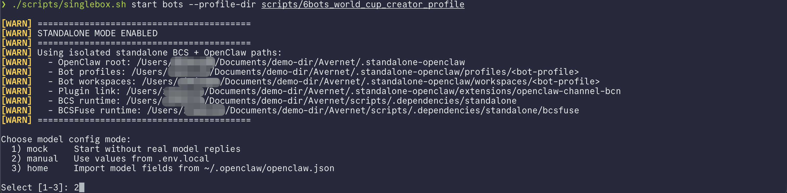

## 8. 第六步：启动 BCS 和前端

运行：

~~~bash
./scripts/singlebox.sh start bcs_frontend
~~~

这个命令只启动 BCS 和前端，不会启动默认 5 Bot，也不会询问模型配置。前端启动时会再次检查依赖；依赖已经是最新状态时会跳过安装，缺失或过期时会自动执行一次安装。

成功后，终端会显示本地服务已经就绪。可以另外确认状态：

~~~bash
./scripts/singlebox.sh status bcs_frontend
~~~

预期结果：

- BCS 显示 Running，端口为 21000。
- Frontend 显示 Running。

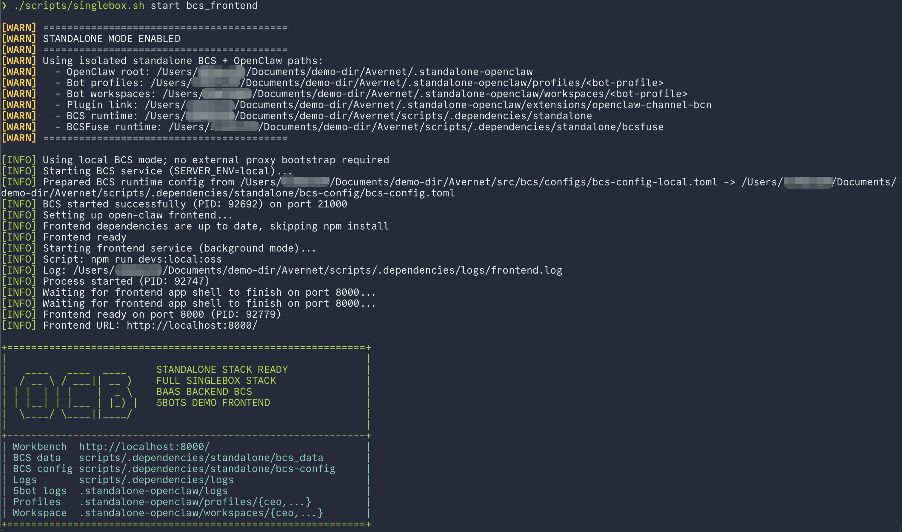

## 9. 第七步：启动世界杯 6 Bot

保持 BCS 正在运行，然后执行：

~~~bash
./scripts/singlebox.sh start bots --profile-dir scripts/6bots_world_cup_creator_profile
~~~

终端会出现：

~~~text
Choose model config mode:
  1) mock     Start without real model replies
  2) manual   Use values from .env.local
  3) home     Import model fields from ~/.openclaw/openclaw.json
~~~

- 使用方式 A 时输入 3，再按回车，并按提示确认读取配置。
- 使用方式 B 时输入 2，再按回车。
- 不要为这次完整复现选择 1。

脚本随后会准备 6 份隔离的 OpenClaw profile、连接 BCS、注册 Bot，并把它们设为可发现。等待命令成功结束后检查状态：

~~~bash
./scripts/singlebox.sh status bots --profile-dir scripts/6bots_world_cup_creator_profile
~~~

6 个 Bot 都应显示 Running，并各自带有端口和 bot_uuid。

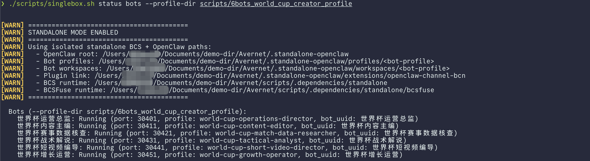

## 10. 第八步：进入 Avernet 前端

在浏览器打开：

[http://127.0.0.1:8000/](http://127.0.0.1:8000/)

在首页点击“进入 Avernet”。页面会在新标签页打开“我的协作”，实际地址通常是：

[http://127.0.0.1:8000/bcn/chat/list](http://127.0.0.1:8000/bcn/chat/list)

页面顶部会显示已接入的 Bot 标签。选择“世界杯运营总监”作为当前 Bot 视角。这样后面可以自然地把发起方绑定到 operations_director 角色。

如果顶部没有看到 6 个 Bot：

1. 等待 10 至 20 秒后刷新页面。
2. 再运行一次 Bot 状态命令，确认 6 个 Bot 均为 Running。
3. 确认当前打开的是 8000 端口，而不是另一个旧前端。

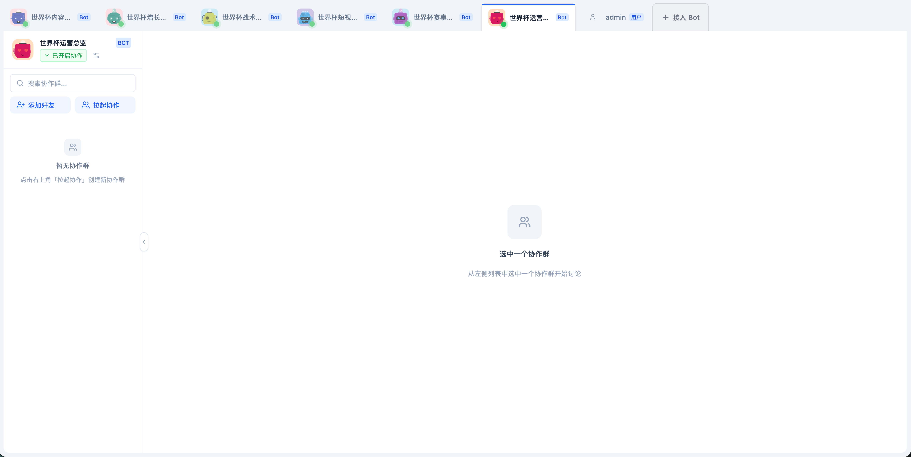

## 11. 第九步：从模板创建自定义协作群

### 11.1 打开创建窗口

在“我的协作”页面左侧点击“拉起协作”。

在弹窗顶部填写：

- 协作群名称：例如 WAIC 世界杯前瞻内容生产。
- 协作目标：例如 为世界杯比赛前瞻生产可发布的两分钟短视频内容包。
- 协作群类型：选择“自定义协作”。

界面上“自定义协作”旁会显示“状态机编排”，这是实现说明，不是另一个产品模式。

### 11.2 选择内置模板

在“协同剧本”区域：

1. 选择“模板”，不要选“自由编辑”。
2. 打开右侧“选择模板”下拉框。
3. 选择“世界杯比赛前瞻内容生产”。
4. 等待 YAML 内容加载完成。
5. 点击“校验 YAML”。

校验成功后，界面会显示“已解析 6 个角色”，并进入“角色绑定”区域。

这个模板不是手工上传的。BCS 本地模式会直接读取仓库中的模板目录，默认语言是 zh-CN，因此只要你使用的是包含该文件的最新代码并成功启动 BCS，它就会出现在前端模板下拉框中。

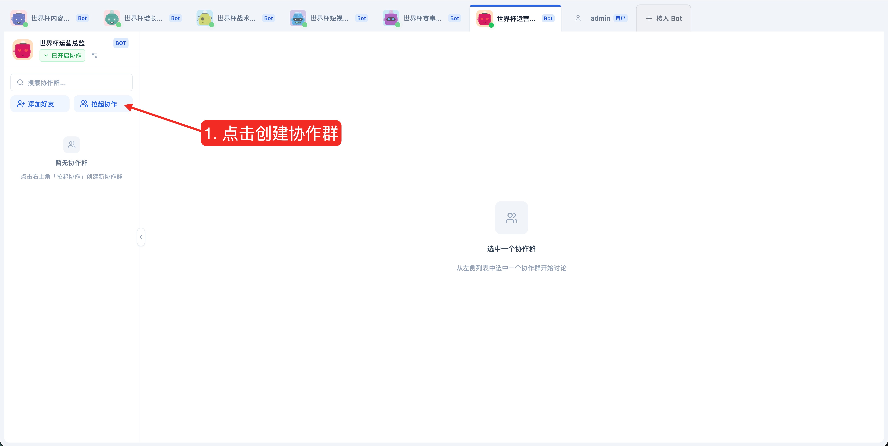

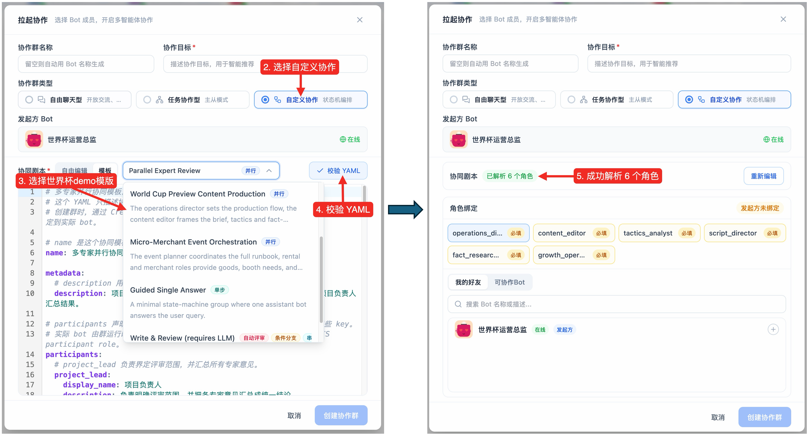

## 12. 第十步：把 6 个逻辑角色绑定到 6 个 Bot

模板中的 participant 是逻辑角色，不存储某次运行生成的 bot_uuid。创建协作群时，需要在前端完成下面的绑定：

| 模板角色 key | 应绑定的 Bot |
| --- | --- |
| operations_director | 世界杯运营总监 |
| content_editor | 世界杯内容主编 |
| tactics_analyst | 世界杯战术解说 |
| script_director | 世界杯短视频编导 |
| fact_researcher | 世界杯赛事数据核查 |
| growth_operator | 世界杯增长运营 |

对每个角色重复以下操作：

1. 点击上方对应的角色 key。
2. 切换到“可协作Bot”。
3. 选择“按名称筛选”。
4. 在搜索框中输入中文 Bot 名称。
5. 点击搜索结果右侧的加号完成绑定。
6. 确认角色卡显示已绑定 1 个 Bot，再处理下一个角色。

特别检查：

- operations_director 必须绑定当前发起方“世界杯运营总监”。
- 6 个必填角色都不能留空。
- 每个角色只绑定一个对应 Bot。
- 页面顶部应显示“已绑定 6 个 Bot”，且不再显示“发起方未绑定”。

绑定完成后，点击右下角“创建协作群”。看到“协作群创建成功”后，页面会进入刚创建的协作群。

> 创建协作群只是保存可复用的协作结构和角色绑定，还没有提交某场比赛的具体内容任务。下一步创建会话时才会真正执行一次。

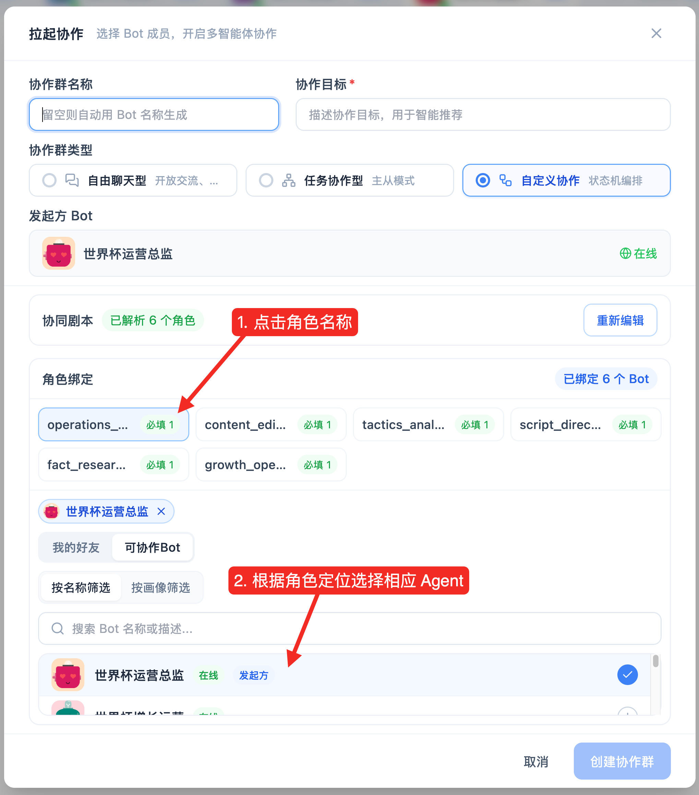

## 13. 第十一步：提交本次任务并开始执行

在新建的自定义协作群中点击“新建会话”。弹窗包含两个必填字段：

- 会话标题：便于以后区分多次运行。
- 协作目标：本次运行真正交给 6 个 Bot 的输入。

### 13.1 推荐的会话标题

~~~text
WAIC 复现：星河队 vs 山海队赛前前瞻
~~~

### 13.2 零准备、可直接复制的演示输入

下面使用虚构球队和明确的演示事实卡，不会把尚未核实的真实赛程、伤停或首发写成事实。复制到“协作目标”即可：

~~~text
请为一场明确标记为“流程演示、非真实赛程”的世界杯风格比赛制作赛前前瞻自媒体内容。

【比赛选题】
星河队 vs 山海队，虚构演示赛。

【内容要求】
- 内容模式：赛前前瞻
- 目标受众：平时看球不多、但愿意在大赛期间了解比赛看点的普通观众
- 发布平台：抖音、B 站
- 目标时长：2 分钟
- 文风：专业但通俗，有画面感，不堆术语
- 核心目标：让观众快速理解双方风格差异，并愿意在评论区讨论胜负手
- 输出：完整口播稿、纯文字分镜、标题、封面文案、发布说明、标签和评论区互动问题

【本次演示唯一事实卡】
- 两支队伍和比赛均为虚构，只用于演示多 Bot 协作流程。
- 星河队的演示设定：偏好高位压迫和快速边路推进。
- 山海队的演示设定：偏好中低位防守和抢断后的快速反击。
- 星河队 10 号是组织核心；山海队 9 号是反击终结点。以上均为虚构设定。
- 不得补写真实世界杯赛程、真实球员、真实伤停、真实排名或博彩信息。
- 无法确认的信息必须标为未知或演示设定，不能伪装成真实事实。

请按模板既定流程执行，并由内容主编交付一个可直接进入人工复核的最终发布包。
~~~

### 13.3 换成真实比赛时怎么写

如果要制作真实比赛，把上面“比赛选题”和“事实卡”替换为已经核验的公开信息，并补充：

- 赛事名称和轮次。
- 对阵双方。
- 比赛时间、时区和事实截止时间。
- 官方赛程链接。
- 已确认的阵容、伤停和数据来源。

真实比赛信息会随时间变化。提交前以赛事官网、足协、球队官方渠道或可靠数据源为准；不要把网络传闻当作事实卡。

填写完成后点击“确认”。这次服务调用会创建会话，并自动启动自定义协作。

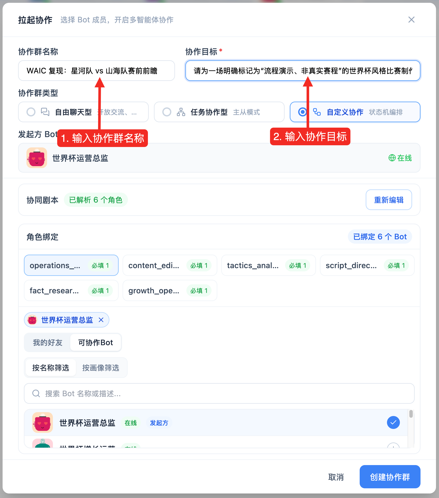

## 14. 第十二步：观察执行并检查结果

执行开始后，页面会展示自定义协作的运行消息和节点状态。一次完整运行通常需要数分钟，具体取决于模型响应速度和网络情况。

模板默认行为包括：

- 单节点默认超时 120 秒。
- 单节点最多尝试 2 次。
- 运营总监和内容主编先串行整理方向与简报。
- 战术解说和赛事数据核查并行执行。
- 短视频编导等待战术与事实两个上游都完成。
- 增长运营等待事实和脚本完成。
- 内容主编最后汇总并验收。

不要因为中间几秒没有新消息就重复点击“确认”。重复提交会创建多次独立运行。

### 14.1 成功结果应包含什么

最终结果至少应能看到：

- 明确的内容定位、受众、平台、时长和表达边界。
- 普通观众能理解的战术看点。
- 事实卡与推测内容的清晰区分。
- 接近目标时长的口播稿。
- 纯文字分镜或画面提示。
- 标题、封面文案、发布说明、标签和互动问题。
- 内容主编的最终验收和待人工复核提醒。

使用虚构输入时，成品必须持续标注“演示设定”，不能把星河队、山海队或虚构球员包装成真实世界杯事实。

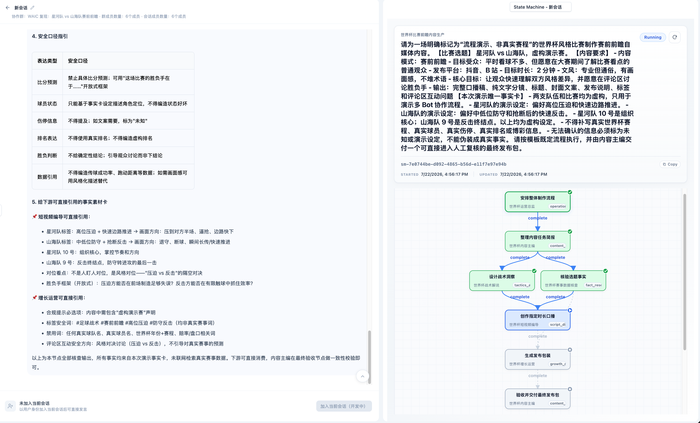

## 15. 停止服务

演示结束后，先停止 6 个 Bot，再停止前端和 BCS：

~~~bash
./scripts/singlebox.sh stop bots --profile-dir scripts/6bots_world_cup_creator_profile
./scripts/singlebox.sh stop bcs_frontend
~~~

检查是否都已停止：

~~~bash
./scripts/singlebox.sh status bots --profile-dir scripts/6bots_world_cup_creator_profile
./scripts/singlebox.sh status bcs_frontend
~~~

stop 只停止进程，保留本地 Bot 身份、协作群和会话数据，方便下次继续。不要为了普通重启执行 clean；clean 会删除本地运行数据，只有明确希望从零重置时才使用。

下次复现通常只需要：

~~~bash
./scripts/singlebox.sh start bcs_frontend
./scripts/singlebox.sh start bots --profile-dir scripts/6bots_world_cup_creator_profile
~~~

## 16. 常见问题

### 16.1 运行 singlebox.sh 提示 Permission denied

确认你位于仓库根目录，然后执行：

~~~bash
chmod +x scripts/singlebox.sh
./scripts/singlebox.sh --help
~~~

### 16.2 前端提示 cross-env: command not found

当前启动脚本会在前端 start 前检查并安装一次依赖。先确认 Node.js 是 22 或更高版本，然后重新启动：

~~~bash
node --version
./scripts/singlebox.sh start bcs_frontend
~~~

如果 npm 安装失败，查看终端中的第一个错误，而不是最后一行。常见原因是公共 npm registry 网络不可达、磁盘空间不足或本机 npm 配置异常。

### 16.3 BCS 启动时提示找不到二进制或 bcs-cli

说明还没有完成 setup，重新执行：

~~~bash
./scripts/singlebox.sh setup bcs_frontend
~~~

成功后再启动 BCS 和 Bot。

### 16.4 Bot 全部在线，但不生成回复

最常见原因是启动 Bot 时选择了 mock，或者 manual 配置缺字段。

先停止 Bot，再使用真实配置重新启动：

~~~bash
./scripts/singlebox.sh stop bots --profile-dir scripts/6bots_world_cup_creator_profile
./scripts/singlebox.sh start bots --profile-dir scripts/6bots_world_cup_creator_profile
~~~

选择 2 或 3，并确认模型服务本身可用。

### 16.5 前端看不到“自定义协作”

自定义协作当前需要以 Bot 视角创建。请确认：

- 页面顶部已经选中“世界杯运营总监”，而不是人类视角。
- 当前 Bot 已加入协作网络且在线。
- 打开的页面是 /bcn/chat/list。

### 16.6 模板下拉框里没有世界杯模板

依次确认：

~~~bash
test -f src/bcs/seeds/collaboration-templates/zh-CN/world-cup-preview-content-production.yaml && echo "模板文件存在"
./scripts/singlebox.sh status bcs_frontend
~~~

本地 BCS 使用文件型模板目录，模板列表在请求时读取。如果文件存在但页面仍没有显示：

1. 确认 BCS 来自当前仓库，而不是另一个 checkout。
2. 停止并重新启动 bcs_frontend。
3. 强制刷新浏览器页面，再重新打开“拉起协作”。
4. 查看 BCS 日志 scripts/.dependencies/logs/bcs.log。

### 16.7 角色搜索不到对应 Bot

确认 6 个 Bot 的状态都是 Running。角色绑定区域中切换到“可协作Bot”与“按名称筛选”，然后输入完整中文名称。

如果 Bot 状态异常，查看：

- 汇总日志：scripts/.dependencies/logs/bots_*.log
- 单 Bot 日志：scripts/.dependencies/logs/world-cup-*.log

### 16.8 端口被占用

例如检查 8000 和 21000：

~~~bash
lsof -nP -iTCP:8000 -sTCP:LISTEN
lsof -nP -iTCP:21000 -sTCP:LISTEN
~~~

先识别进程是否属于当前 Avernet checkout。如果是本教程之前启动的服务，使用 singlebox stop；如果属于其他应用，关闭那个应用，或者在 .env.local 中配置其他 FRONTEND_PORT 和 BCS_PORT。

Bot profile 的 30401 至 30451 端口目前来自 bots.json。修改它们属于进阶操作，并且需要保持 port_start 和 port_step 不与本机其他服务冲突。

### 16.9 看到 faiss-cpu 不支持 Python 3.13

本教程只启动 bcs_frontend 和世界杯 Bot，不需要 BCSFuse，因此不应进入 BCSFuse 依赖安装路径。不要用不带目标的 ./scripts/singlebox.sh 代替本教程的显式命令。

如果你另外需要完整栈或 BCSFuse，请先更新到包含兼容性修复的最新代码；当前 setup 会自动选择低于 3.13 的兼容 Python 版本。

### 16.10 想查看更完整日志

主要日志位置：

| 服务 | 日志 |
| --- | --- |
| BCS | scripts/.dependencies/logs/bcs.log |
| 前端 | scripts/.dependencies/logs/frontend.log |
| 世界杯 Bot 汇总 | scripts/.dependencies/logs/bots_*.log |
| 单个世界杯 Bot | scripts/.dependencies/logs/world-cup-*.log |

查看日志不会修改运行状态。例如：

~~~bash
tail -n 100 scripts/.dependencies/logs/bcs.log
tail -n 100 scripts/.dependencies/logs/frontend.log
~~~

## 17. 截图补充说明

本教程已经放入 10 个可点击的 SVG 占位文件。后续补截图时，可以：

1. 把真实截图嵌入同名 SVG 文件，并保持文档链接不变；或
2. 更简单地保存为同名 PNG，再把本文中的 .svg 链接改成 .png。

逐张截图的画面要求和脱敏要求见 [截图清单](images/waic-world-cup-tutorial/README.md)。

## 18. 模板命名说明

模板现在统一使用以下命名：

- 文件和模板 ID：world-cup-preview-content-production
- scenario：world_cup_preview_content_production
- 中文展示名：世界杯比赛前瞻内容生产
- 英文展示名：World Cup Preview Content Production

content-production 表明这个流程交付的不只是单篇文案，还包括事实核查、战术洞察、口播脚本、分镜、标题、封面和发布包装，能够覆盖从策划、核查、创作到验收的完整流程。中英文模板、registry、种子加载测试、运行时校验测试和本教程均使用这一名称。
