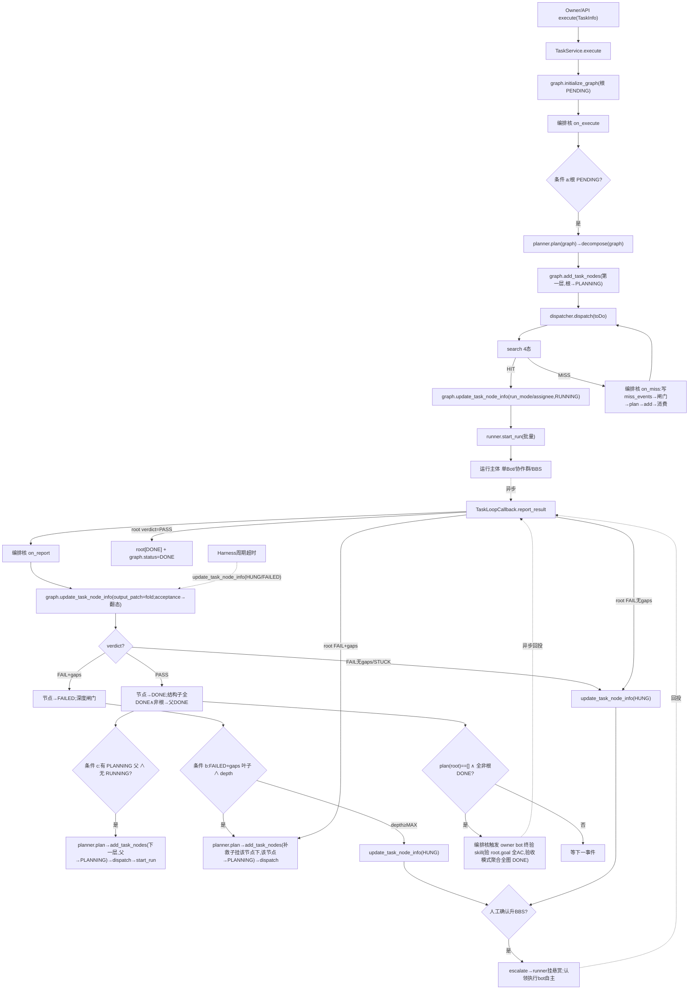

# Plan — 任务目标驱动的任务动态规划执行框架 (HOW: 架构 / 领域模型 / 模块 API / 交互逻辑)

> 权威源(冲突时以此为准):最新领域模型 classDiagram(2026-08-11)、流程架构图 `apoi9lcedw9u8ivq`、5 模块设计文档(任务中心 `yugg6dorsxo8sgmp`/任务图谱 `lunk1txfuv6gtwk2`/任务规划 `uuq2tlue91q4lkal`/任务派发 `ue1ie0g3supwo2uf`/任务执行 `lxg2mwgmtfqg6d95`)、case 剧本 `gwqie46v7hzr1w6h`。WHAT/WHY 见 `spec.md`;实现计划见 `tasks.md`。

## 0. 一句话定位

一个**事件驱动 + 状态条件触发**的任务动态规划执行框架:外部事件(提交/回投)触发 → 编排核按图谱状态条件协调 `plan→add_task_nodes→dispatch→start_run→回调→update_task_node_info` 推进;**图谱是 SSOT,所有写收口到 `TaskGraphService`**;规划/派发是可插拔的优化策略,规划的**分解内容**委托 `DecomposerPort`(默认规划 agent/bot 在 corp,Avernet 用 stub/singlebox 实现),框架本身零 case 知识。**全仓库只有一套实现**,位于规范位置 `core/task`。

## 1. 架构总览(六模块 + 编排核;单一实现,规范位置 `core/task`)

| 模块 | 性质 | 职责一句话 | 对外有 API? |
|---|---|---|---|
| **TaskService** | 对外 facade | 系统唯一对外入口(2 API);内部含编排核协调其余模块 | ✅ 2 个 |
| **TaskGraphService** | 内部图谱 SSOT | 图谱原子变更唯一网关(增删改查);`relations` 依赖派生 | ❌ 内部(7 API:4 核心+3 派生只读) |
| **TaskPlanner** | 规划编排壳(可插拔) | 读图按状态条件产逻辑子节点(不含执行信息);分解内容委托 `DecomposerPort`/规划 agent | ❌ 内部 |
| **DecomposerPort** | 规划策略 seam | 真正的分解智能:产哪些节点。默认 LLM/规划 bot(corp);Avernet stub/singlebox | ❌ seam |
| **TaskDispatcher** | 分发策略(可插拔) | 搜推决定"谁来做",把 `run_mode`/`assignee` 填到 `TaskNode.run_info` 后返回 `list[TaskNode]`,多 bot 动态拉协作群;**不写图、不起 run**(编排核落库+起 run) | ❌ 内部 |
| **TaskRunner** | 执行承载 | `start_run(批量)` 三模态自适应 + `query_status/detail/result/bot_tasks`;`TaskLoopCallback` 回投;`form_coop_group` 复用 BCS | ❌ 内部 |
| **TaskHarness** | 旁路常驻 | 周期巡检超时/崩溃,写同网关,不抢正向驱动 | ❌ 内部 |
| **(编排核)** | TaskService 内部 | 事件驱动 + 状态条件触发协调 plan/graph/dispatch/execution | ❌ 非独立模块 |

**关键边界**:
- **编排核只做"决策与转写"**,不自己改图/执行——改图经 `TaskGraphService`,执行经 `TaskDispatcher→TaskRunner`,规划经 `TaskPlanner`(再委托 `DecomposerPort`)。
- **框架零 case 知识**:planner 是编排壳,分解内容来自 `DecomposerPort`;`N_overview`/`N_market` 等任意节点名只能出现在**case 的 DecomposerPort 产出**或**测试 stub**,绝不写死在框架代码。
- **单一实现**:规范位置 `core/task`;继承旧 seam 命名、DI 接线(`CommunityTaskModule`)、开源边界纪律。
- **开源边界**:Avernet 发**契约 seam + Noop/singlebox double**(本地关键词 cover 的 bot catalog、BCS local/mock 拉群、stub decomposer);真实搜推/真实执行/LLM 规划/验收 SKILL 在 corp `ocb` adapter。

对外只有 `TaskService` facade 2 个 API:`execute`/`get_task_dashboard`;图谱内部 4 核心写/读 API(`initialize_graph`/`add_task_nodes`/`update_task_node_info`/`query_task_dashboard`)+ 3 派生只读查询(`query_task_nodes`/`decompose_children_tasks`/`compute_parent_tasks`)由 `TaskGraphService` 独立持有(不合并进 facade)。

---

## 2. 领域模型类(对齐最新 classDiagram)

```python
class Status(StrEnum):            # 6 态(含 PLANNING)
    PENDING | PLANNING | RUNNING | DONE | FAILED | HUNG
class AcceptanceVerdict(StrEnum): PASS | FAIL
class RelationType(StrEnum):      DEPENDENCY    # 节点间依赖关系

@dataclass Metadata:
    task_id: str                  # 任务 ID
    title: str
    instruction: str              # 核心执行指令(Prompt)
@dataclass Context:
    background: str
    extend_props: dict            # 非结构化补充数据
@dataclass AcceptanceCriteria:
    id: str
    description: str
@dataclass Goal:
    objective: str
    acceptances: list[AcceptanceCriteria]
@dataclass TaskSpec:
    metadata: Metadata
    context: Context
    goal: Goal

@dataclass TaskInfo:              # 对外 execute 入参
    task_spec: TaskSpec
    source_channel_type: str      # "bot" | "coop_group"
    source_channel_id: str
    execution_config: dict        # 用户指定执行配置(指定 bot/workflow yaml/MAX_DEPTH 等)

@dataclass AcceptanceResult:      # 无 verifier 字段
    verdict: AcceptanceVerdict
    acceptances_metric: list[str] # 已满足的验收指标明细
    gaps: list[str]               # 驱动 plan 自算 gap,不是 plan 入参

@dataclass RuntimeInfo:           # 持久运行面(所有 None 均合法域态)
    run_mode: str | None          # "single_bot"/"coop_group"/"bbs";无 collab_mode
    assignee: str | None          # 执行者(bot_id / group_id / bbs queue)
    start_time: float | None; end_time: float | None
    output: dict
    acceptance_result: AcceptanceResult | None
    extend_props: dict            # miss_events(list[str]) / 崩溃栈/超时
    # depth 核内派生(从 relations),非持久

@dataclass Relation:              # 节点间依赖关系(一等公民)
    src_id: str                   # 起始节点(前序/被依赖)
    dst_id: str                   # 目标节点(后继/依赖方)
    type: RelationType            # DEPENDENCY
    extend_props: dict            # 关系元数据(可扩展)

@dataclass TaskNode:              # 含 task_id/node_run_graph/decomposed_by;数据依赖在 graph.relations
    node_id: str                  # 节点唯一实例 ID
    task_id: str                  # 节点所发整体任务 ID(归属键)
    status: Status
    task_spec: TaskSpec
    run_info: RuntimeInfo
    node_run_graph: "TaskExecutionGraph"   # 节点所属执行图实例引用
    decomposed_by: str | None     # B1 结构归属:产自 decompose(谁);根节点 None。
                                   # 结构父分解树(严格单父);数据依赖(多入 DAG)在 graph.relations(DEPENDENCY),
                                   # 两者解耦:decomposed_by 决定验收归属/结构子查询/传播,
                                   #          DEPENDENCY 决定就绪判定/投影取上游产出

@dataclass TaskExecutionGraph:    # 含 run_id/relations
    run_id: int                   # 运行实例唯一 ID
    loop_round: int               # 循环/迭代轮次(reroute 递增)
    status: Status
    output: dict                  # 图的最终汇总输出
    tasks: list[TaskNode]
    relations: list[Relation]     # 依赖关系(一等公民)
    extend_props: dict
    # 派生不持久: dependencies_satisfied / depth / decomposition_children(均从 relations 派生)
```

> **依赖关系**:依赖由 `Relation{type=DEPENDENCY}` 表达,`dependencies_satisfied`/`depth`/传播均从 `relations` 派生。
> **`PLANNING` 语义**:节点被分解委托子执行时进 `PLANNING`(显式状态);子全 PASS → 传播该节点 DONE。
> **`collab_mode`**:`RuntimeInfo` 无 `collab_mode`;协作方式作 `form_coop_group` 内部参数,不持久。 

### 2.1 中间类型(patch/criteria/op_result)

```python
@dataclass TaskNodePatch:          # 节点级原子写(update_task_node_info 入参)
    task_id: str; node_id: str
    status: Status | None = None
    run_mode: str | None = None             # str
    assignee: str | None = None
    output_patch: dict | None = None        # fold 到 run_info.output
    acceptance_result: AcceptanceResult | None = None   # 唯一终态翻转依据
    extend_props_patch: dict | None = None  # miss_events / hung_reason(no_gaps|depth_max|stuck) / 崩溃栈 / bbs_escalated

@dataclass TaskNodeQueryCriteria:   # 节点查询条件(内部用)
    status: Status | None = None
    dependencies_satisfied: bool | None = None
    node_ids: list[str] | None = None
    has_decompose_children: bool | None = None

@dataclass TaskOpResult:            # facade 级返回
    task_id: str; success: bool
    error: str | None = None
    run_id: int | None = None       # 关联运行实例
@dataclass NodeOpResult:            # 节点级写返回
    task_id: str; node_id: str; success: bool
    prev_status: Status | None = None; new_status: Status | None = None
    error: str | None = None

@dataclass TaskCallbackData:        # 回投数据协议(对齐执行模块文档)
    loop_task_id: str               # 关联回框架侧 (task_id, node_id)
    workflow_type: str              # "single_bot" | "bcn_coop_group" | "bbs" | ...
    workflow_id: int
    instance_id: int                # workflow 运行实例 id
    result: dict                    # {"success": bool, "data": "..."} / {"fail_detail": "..."}
```

---

## 3. 模块类与 API 定义

### 3.0 内部编排核(`TaskService` 内部;非独立模块;无对外 API)

> 编排核为**事件驱动 + 状态条件触发**:在 facade `execute`/回投适配后,按图谱状态条件协调 `plan→add_task_nodes→dispatch→start_run`。是 `TaskService` 内部实现细节,对外只暴露 2 facade API(§3.7)。

```python
class ExecutionEngine:   # TaskService 内部编排核(不对外)
    """事件驱动 + 状态条件触发协调 plan/graph/dispatch/execution。
    持 TaskGraphService/TaskPlanner/TaskDispatcher/TaskRunner;BBS 模态统一归 TaskRunner 一条 run_mode="bbs" 分支。
    按事件 + 状态条件分段协调(无 single drive fixpoint 泵)。on_miss/on_report/on_harness 入参统一收口为 TaskNodePatch。"""

    def on_execute(self, task_id) -> None:
        # execute 事件:initialize_graph(根 PENDING)→ 触发首帧推进:
        #   条件 a(根 PENDING)成立 → planner.plan(graph) → graph.add_task_nodes(第一层,根进 PLANNING)
        #   → 条件:有新 PENDING 就绪 ∧ 无 RUNNING → dispatcher.dispatch(toDo) 返回填执行者后的 list[TaskNode](不写图不起 run)→ 编排核落库(graph.update_task_node_info run_mode/assignee/RUNNING)→ runner.start_run
    def on_report(self, patch: TaskNodePatch) -> NodeOpResult:
        # 回投事件:patch 内含 (task_id,node_id) + 唯一翻态依据 acceptance_result + output_patch。
        #   graph.update_task_node_info(patch) 翻态(+fold output):
        #   PASS→DONE:传播(结构子 decomposed_by==本 全 DONE ∧ 非根 → 父 DONE;根 DONE → 图 DONE)
        #     → 触发:若有 PLANNING 父节点条件 c 成立 → plan → add_task_nodes(下一层)→ dispatch(返 list[TaskNode] 填执行者)→ 编排核落库(RUNNING)→ start_run
        #   FAIL+gaps→FAILED:深度闸门(<MAX 放行)→ 条件 b(FAILED+gaps 叶子)成立 → plan → add_task_nodes(补救子挂该节点下,该节点进 PLANNING)→ dispatch(返 list[TaskNode] 填执行者)→ 编排核落库(RUNNING)→ start_run
        #   FAIL 无 gaps/STUCK→HUNG(patch.extend_props_patch.hung_reason):不推进,等人工
        # 返回 NodeOpResult(prev/new_status)供适配层 ack,不作驱动依据
    def on_miss(self, patch: TaskNodePatch) -> None:
        # dispatcher MISS → 节点仍 PENDING,patch.extend_props_patch.miss_events 已由 dispatcher 填
        #   → 深度闸门:<MAX→ plan→add_task_nodes(拆细)→ 消费 miss_events → dispatch;≥MAX→ patch.status=HUNG(hung_reason=depth_max)→ update_task_node_info
    def on_harness(self, patch: TaskNodePatch) -> None:
        # Harness 旁路:graph.update_task_node_info(patch)(HUNG/FAILED),不抢正向驱动
    # loop_round: reroute 补救非根节点时 graph.loop_round++(graph 持久字段,非 engine 内部)
```

> 每个事件 on_* 分段推进,由状态条件(a/b/c + plan 三条件)把关是否进入下一阶段。同 task_id 仍串行(可重入锁)。

### 3.1 `TaskGraphService`(内部图谱 SSOT,7 API:4 核心+3 派生只读,独立模块)

> `TaskGraphService` 为独立模块(对齐任务图谱文档 `lunk1txfuv6gtwk2`),`TaskService` facade 持有其引用。图谱原子变更唯一网关。

```python
class TaskGraphService:
    """任务图谱 SSOT + 原子变更唯一网关。
    边界:只做图结构 + 节点/图级状态原子写 + 派生只读查询;不含编排(不调编排核、不搜推、不规划)。"""

    def initialize_graph(self, task_info: TaskInfo) -> TaskExecutionGraph:
        """建图首帧(全局 RUNNING,只含根节点 PENDING,task_id=task_spec.metadata.id,run_id 分配);
        幂等:同 task_id 重复调抛冲突。调用方:需求识别 skill(execute 内部)。"""

    def add_task_nodes(self, tasks: list[TaskNode]) -> TaskExecutionGraph:
        """并子图。触发条件(图谱文档 a/b/c,由编排核判后调):
          a. 只有一个根节点且 status=PENDING(初始规划);
          b. 叶子节点验收未通过:存在 FAILED 节点 且 acceptance_result.gaps 非空的叶子节点(补救);
          c. 父节点验收未通过:存在 PLANNING 节点 ∧ 无 RUNNING(下一层规划可推进;B1 前层产出已落 output)。
        登记双写(B1):① 结构归属——新子.decomposed_by = 父node_id;父节点进 PLANNING(显式委托态);
          ② 数据依赖——新子与上游产出节点的 DEPENDENCY 关系写入 graph.relations(数据父可≠结构父)。
        单层同构硬约束:本批新节点的数据依赖(DEPENDENCY 入边)只能指向已存在节点,本批内不互依(防汇聚死锁)。
        task_id 从 tasks[0].task_id 取(同批同 task_id)。不改其他已有节点状态。
        返回更新后的整图。调用方:任务规划 skill。"""

    def update_task_node_info(self, patch: TaskNodePatch) -> NodeOpResult:
        """节点级原子状态流转网关。唯一翻态依据=patch.acceptance_result:
          PASS→DONE / FAIL+gaps→FAILED / FAIL 无 gaps→HUNG / STUCK→HUNG;
          无 acceptance_result 只 fold output 不翻态。
          派发写:patch.run_mode(str)/assignee 落库 + 置 RUNNING。
        task_id/node_id 从 patch 内取;幂等。调用方:任务派发 skill + 任务执行 skill。"""

    def query_task_dashboard(self, task_id: str, node_id: str = None) -> TaskExecutionGraph:
        """只读看板快照(整图或按 node_id 子树投影)。调用方:API(经 facade get_task_dashboard)。"""

    # ===== 内部派生查询(供编排核/planner/dispatcher/runner,只读)=====
    def query_task_nodes(self, task_id: str, criteria: TaskNodeQueryCriteria) -> list[TaskNode]:
        """按条件查节点。就绪扫描:criteria={status=PENDING, dependencies_satisfied=True}
          → 返回排除"有分解子(PLANNING 委托中)"的节点。depth/deps_satisfied 从 relations 派生回填。"""
    def decompose_children_tasks(self, task_id: str, node_id: str) -> list[TaskNode]:
        """读某节点【结构子】(tasks where decomposed_by==node_id;B1:结构归属从字段取,不查 relations)。数据父(取 DEPENDENCY 入边 src)= compute_parent_tasks。
          用途:PLANNING 判据/传播/depth 自算。"""
    def compute_parent_tasks(self, task_id: str, node_id: str) -> list[TaskNode]:
        """读某节点【数据依赖父】(relations.type=DEPENDENCY 且 dst_id=node_id 的 src 节点)。
          用途:Runner 执行模式取直接上游产出。"""
    def _node_depth(self, task_id: str, node_id: str) -> int:
        """从 relations 递归自算深度(派生不持久)。深度闸门读。"""
    def _execution_config(self, task_id: str) -> dict:
        """读 MAX_DEPTH 等(随图 extend_props/task_spec)。"""
```

> 派生查询:`query_task_nodes`/`decompose_children_tasks`/`compute_parent_tasks` 升为公开(跨模块依赖:dispatcher/runner/planner/传播);`_node_depth`/`_execution_config` 保持内部(仅编排核用,可从已返回查询/relations/dashboard 自算)。
> 旧 `compute_output_projection` 不在图谱;执行/验收上下文由 `TaskRunner` 内聚(内部自动判定,见 §3.5.4)。

### 3.2 `TaskPlanner` 规划编排壳 + `DecomposerPort` 委托 seam

```python
class DecomposerPort(Protocol):     # 分解策略 seam(非领域实体,模块层接缝;与 TaskPlanner 委托关系)
    def decompose(self, graph: TaskExecutionGraph) -> list[TaskNode]:
        """读图自行发现规划目标(FAIL 叶子 / PLANNING 父)并产"下一步可执行的子节点"
          (挂该目标下;status=PENDING,run_info 空,task_id 已填,node_run_graph 指向所属图)。
        target-finding 由本 seam 自洽(不再由 planner 预选 target 传入);planner 仅做纯读图去重
          + 步进式 deps 满足才产 + 硬契约兜底。返回 [] 可表"无可规划目标"
          (decompose(root)==[] 的判断属实现侧:stub/corp 各自负责,框架不介入)。默认:corp 走规划
          agent(plan_bot)/LLM SKILL;Avernet stub。"""

class TaskPlanner(PlannerPort):     # 编排壳,零 case 知识
    def __init__(self, decomposer: DecomposerPort): ...
    def plan(self, graph: TaskExecutionGraph) -> list[TaskNode]:
        # 触发条件(规划文档):图谱有更新(新增失败节点/PLANNING 节点)
        #   AND 没有派发(RUNNING)或执行中节点 AND 状态图谱有处于 PLANNING 状态的节点
        #   不满足 → 返回 [] 空跑
        # 1) 读图自发现规划目标(不依赖具体节点名):
        #    - FAIL: status=FAILED 且 acceptance_result.gaps 非空 且 无分解子(叶子补救)
        #    - 前向/委托: status=PLANNING 的父节点(planner 不自查 deps;由编排核先确认无 RUNNING 再调 plan)
        # 2) 规划原则(规划文档硬约束):派发/执行中节点不可改(含前序依赖);
        #    只对失败节点 + 子全完成且自身 PLANNING 的父节点规划
        # 3) 调 decomposer.decompose(graph) — 由 seam 自行发现 target + 产子;planner 不预选 target
        # 4) 硬契约兜底:纯读图去重(图上已存则不产);步进式 deps 满足才产
        # 5) 返回并集 list[TaskNode](不含物理执行信息)
```

> **默认实现**:Avernet=`StubDecomposer`/singlebox(测试注入 case 节点名);corp=`PlanBotDecomposer`(规划 agent plan_bot,LLM/SKILL)。可经 `GapBasedPlanningRule`(§3.4)包策略。
> **DecomposerPort 与 TaskPlanner 关系(为何不并进)**:`TaskPlanner` 是规划编排壳(判触发条件/读图发现目标/硬契约去重,零 case 知识,框架固定);`DecomposerPort` 是真正产子节点内容的 seam。分层三因:① 开源边界(Avernet 框架不绑 corp LLM,只发接口+stub,真实规划经 DI 注入);② 可测试(singlebox 注入 stub 不依赖 LLM);③ 可插拔(换 plan_bot/规则/其它 decomposer,编排壳不变)。领域模型无 DecomposerPort(非领域实体),它活在模块层 §3。
> **硬契约**:① 产的每个子其父语义已就绪可委托;② 无状态纯读图去重;步进式 deps 满足才产。`plan` 不接收外部 gaps。
> MISS 经 `on_miss` 写 miss_events 后,编排核按条件 b 类(FAILED+gaps)路径处理(或 HUNG);PLANNING 前向目标用显式状态判。

### 3.3 `TaskDispatcher`(决定"谁来做",不做执行)

> **职责**:据搜推 4 态选执行主体 + 多 bot 动态拉协作群;**把 `run_mode`(str)/`assignee` 填到 `TaskNode.run_info` 后返回 `list[TaskNode]`,不写图、不起 run**(对齐派发文档 `dispatch(toDoTaskList)->List[TaskNode]`);执行交 `TaskRunner.start_run`(由编排核拿返回节点后调用)。分层:搜推(谁做)填 TaskNode → 编排骨 `update_task_node_info`(落派发目标+RUNNING)→ `start_run`(真正发)。

```python
class BotDiscoverPort(Protocol):    # 搜推 seam(同步 in-process)
    def search(self, node: TaskNode) -> "SearchResult": ...
    # -> HIT_SINGLE(bot_id) | HIT_GROUP(group_id) | HIT_MULTI_BOTS(group_formation,含 collab_mode) | MISS
    # collab_mode 在 SearchResult/GroupFormation 内(内部参数),不进 RuntimeInfo 持久

class TaskDispatcher(DispatcherPort):
    def __init__(self, discover: BotDiscoverPort, runner: "TaskRunner"): ...   # 不持 graph;不写图不起 run
    def dispatch(self, toDoTaskList: list[TaskNode]) -> list[TaskNode]:
        # 入参=待派发节点;返回=填充执行者信息后的 list[TaskNode](对齐派发文档签名);
        #   不写图、不起 run;per node 仅按 node.task_spec 搜推,把结果填 node.run_info 上:
        #   HIT_SINGLE     → node.run_info.run_mode="single_bot",  assignee=bot_id
        #   HIT_GROUP      → node.run_info.run_mode="coop_group",  assignee=group_id
        #   HIT_MULTI_BOTS → runner.form_coop_group(gf)→ node.run_info.run_mode="coop_group", assignee=gid
        #   MISS → 不填执行者(run_mode/assignee 仍 None,节点 status 仍 PENDING),标 node.run_info.extend_props.miss_events
        # 返回 list[TaskNode] 交编排核:有 assignee 的→ graph.update_task_node_info(run_mode/assignee,RUNNING)+ runner.start_run;
        #                     标了 miss_events 的→ 编排核 on_miss(深度闸门)
```

> 搜推/拉群不对外;`HIT_MULTI_BOTS` 时 `collab_mode` 由 `search` 一并决出(在 `GroupFormation` 内,作 `form_coop_group` 参数)。可经 `SearchBasedDispatchRule`(§3.4)包策略。
> **派发文档注**:对齐派发文档 `dispatch(toDoTaskList)->List[TaskNode]`——dispatcher 搜推后把 `run_mode`/`assignee` 填到 `TaskNode.run_info` 上返回 `list[TaskNode]`,**不写图、不起 run**;编排核拿返回节点后调 `graph.update_task_node_info(run_mode/assignee,RUNNING)` 落库 + `runner.start_run`(图谱 SSOT,dispatcher 不直接写图;返回的 TaskNode 是入参填充后副本,落库由编排核经 patch 完成)。

### 3.4 可插拔策略(`OptimizerRule`, Unified Optimizer Contract)

```python
class OptimizerRule(Protocol, Generic[PlanT, ResultT]):
    rule_id: str; priority: int
    def matches(self, graph, input_) -> bool: ...   # 纯读
    def apply(self, graph, input_) -> ResultT: ...   # 可含副作用(dispatcher update RUNNING)
class Optimizer(Generic[PlanT, ResultT]):
    def optimize(self, graph, input_, default=None) -> ResultT | None: ...  # first-match-wins
# 默认: GapBasedPlanningRule(委托 DecomposerPort) / SearchBasedDispatchRule(委托 BotDiscoverPort+TaskRunner)
```

### 3.5 `TaskRunner` 任务执行模块(对齐执行文档 `lxg2mwgmtfqg6d95`)

> 功能:把已派发任务按派发目标发送给**单 bot / 协作群 / BBS**执行,并回收状态/详情/结果。一个 `start_run(批量)` 入口三模态自适应;`form_coop_group`(动态拉群)内部辅助;BBS 认领执行由 bot 自主,**不在此接口内**。

#### 3.5.1 供任务 Loop 内部和产品使用的 API(`TaskRunner`)

```python
class TaskRunner:
    """将已派发 TaskNode 发送给单 bot/协作群/BBS 执行,并回收状态/详情/结果。
    调用方:编排核(经 TaskService facade 驱动)。"""

    def start_run(self, toDoTaskList: list[TaskNode]) -> list[bool]:
        """图谱上有 TaskNode 完成派发后,立即触发执行。入参批量(刚被 Dispatcher patch 完 run_mode/assignee 的节点);
        返回每个任务派发是否成功 list[bool]。内部按每节点 run_mode(str)自适应分发:
          "single_bot" → 单 bot workflow(workflow_type=single_bot)
          "coop_group" → bcn 协作群(已有群 or 刚 form_coop_group 拉的群)
          "bbs"        → 任务广场挂题(认领/执行是 bot 自主,不经此接口)
        派发成功仅表示"已投递给执行主体",不等于完成;完成结果经回调(下)回收。"""

    def query_status(self, task_id: str) -> "Status":
        """产品/系统触发:查询某任务及其所有子任务的状态。"""

    def query_detail(self, node: TaskNode) -> TaskNode:
        """产品触发:查询任务最新详情(回填 node.run_info)。"""

    def query_result(self, node: TaskNode) -> TaskNode:
        """产品/系统触发:查询某任务及其所有子任务的产出结果(回填 node.run_info.output)。"""

    def query_bot_tasks(self, bot_id: str) -> list[TaskNode]:
        """获取某个 Bot 下的所有任务实例列表。"""

    def form_coop_group(self, gf: "GroupFormation") -> str:
        """(内部)HIT_MULTI_BOTS 动态拉协作群,复用 BCS 建群 → group_id。
        CHAT/MANAGER_WORKER/STATE_MACHINE 三模式(group_strategy=collab_mode;state_machine 注入 workflow yaml)。
        collab_mode 在 GroupFormation 内(内部参数),不进 RuntimeInfo 持久字段。"""
```

#### 3.5.2 回调服务(供单 bot workflow / bcn 协作群,PUSH 回投)`TaskLoopCallback`

```python
class TaskLoopCallback:
    """供执行实体(bot workflow 或 bcn 协作群)PUSH 回投,对接框架 update_task_node_info(经编排核 on_report)。"""

    def start_run(self, data: TaskCallbackData) -> None:     # 任务开始执行(可选进度信号)
        ...
    def report_result(self, data: TaskCallbackData) -> None: # 任务完成或失败(success/data or fail_detail)
        # 框架适配层把 data 组装成 TaskNodePatch(task_id/node_id 从 loop_task_id 映射;
        #              acceptance_result 从 result.success/data 映射;output_patch=fold data;
        #              fail_detail → extend_props_patch)→ 编排核 on_report(patch) → graph.update_task_node_info(patch) → 按 verdict 翻态/传播/补救
```

#### 3.5.3 三模态自适应作用

| 模式 | start_run 内部动作 | 结果回收 | Avernet 实现 | prod 实现 |
|---|---|---|---|---|
| 单 Bot | 调单 bot workflow(workflow_type=single_bot) | `TaskLoopCallback.report_result`(PUSH)或 `query_result`(PULL) | seam + singlebox double(本地 bot stub) | corp adapter |
| 协作群 | 触发 bcn 协作群(群可能刚 `form_coop_group` 拉的) | `TaskLoopCallback`(群终态回投) | seam + BCS local/mock 拉群 | corp BCS wiring |
| BBS | 挂悬赏至任务广场(**认领与执行由 bot 自主控制,不在此接口**) | 认领 bot 自主 `report_result` 回投 | seam + stub 任务广场 | corp 任务广场 |

#### 3.5.4 上下文组装(Runner 内聚;内部自动判定,无 NODE/SUBTREE/TASK scope 区分)

验收只按 `(task_id, node_id)` 上报对应节点——执行主体/owner bot 验收后直接把结论回投该节点,**不引入 NODE/SUBTREE/TASK scope 参数**。`start_run` 内部据该节点**是否有结构子**自动判定组装上下文:

- **验收模式**(有结构子,`decompose_children_tasks(task_id,node)` 非空):本节点已被分解委托子执行 → 聚合【结构子(子树)run_info.output + 本节点 `task_spec.goal/acceptances`】→ 组装**验证 prompt**,经 `source_channel` 派给 owner/master bot 用 skill 验收 → bot 回投 verdict 直接落该节点。(根节点的终验即此模式:结构子=全图,聚合得全图 DONE 产出;非根 PLANNING 节点子全 PASS 后自动传播 DONE,不另起验收 skill。)
- **执行模式**(无结构子):本节点是叶执行节点 → 聚合【上游 DEPENDENCY 父 `compute_parent_tasks` 的 run_info.output + 本节点 `task_spec`】→ 组装**执行 prompt** 注入执行主体(单 bot/协作群/BBS)。

bot/群据 `node.task_spec.goal` + 该上下文产出 → 经 `TaskCallbackData.result` 回投 → 框架适配层按 success/data 映射成 `AcceptanceResult` 落该节点。`TaskGraphService` 不提供 `compute_output_projection`;上下文聚合由 Runner 内部 helper `_build_context(task_id, node)` 用 `decompose_children_tasks`/`compute_parent_tasks` 组合收口,验收/执行模式自动切换(无 scope 入参)。`form_coop_group` 复用现有 BCS(`crates/contracts/bcs-domain` `GroupStrategy`/`CollaborationRuntimeDefinition`),群自闭环持 `SubDagRef(bcs_run_id)` 收终态回投。

### 3.6 `TaskHarness`(旁路常驻)

```python
class TaskHarness:
    """旁路常驻:周期巡检 SLA 超时/崩溃,经 graph.update_task_node_info 写 HUNG/FAILED,不抢正向驱动。
    超时阈值从 execution_config / extend_props 读(SLA 不在 TaskSpec)。"""
    def run_poll_loop(self) -> None:
        # 周期:graph.query_task_nodes(status=RUNNING) → 比对 start_time + sla_timeout → 超时/崩溃
        #   → graph.update_task_node_info(TaskNodePatch{status=HUNG/FAILED, extend_props_patch={...}})
        # 不调编排核正向;主链下一轮事件自然续驱
```

### 3.7 对外 API(`TaskService` facade,2 个)

> facade 暴露 2 API(对齐任务中心文档 `yugg6dorsxo8sgmp`):`execute`/`get_task_dashboard`。`add_task_nodes`/`update_task_node_info`/`query_task_dashboard` 下沉 `TaskGraphService`,`dispatch`/`plan`/`start_run` 各归各模块。

| facade 方法 | 调用方 | 触发时机 | 内部委托 |
|---|---|---|---|
| `execute(task_info) -> TaskOpResult` | API or 需求识别 skill | 提交执行任务 | `graph.initialize_graph` + 编排核 `on_execute`(plan→add→dispatch→start_run) |
| `get_task_dashboard(task_id, node_id=None) -> TaskExecutionGraph` | API | 任务执行详情可视化(eg.副屏) | `graph.query_task_dashboard` |

```python
class TaskService:   # facade(2 API);内部持编排核 + TaskGraphService + Planner + Dispatcher + Runner
    def __init__(self, graph: TaskGraphService, planner: TaskPlanner,
                 dispatcher: TaskDispatcher, runner: TaskRunner, harness=None): ...

    def execute(self, task_info: TaskInfo) -> TaskOpResult:
        # graph.initialize_graph(task_info)(根 PENDING)→ 编排核 on_execute(task_id)
        #   → 首帧推进(条件 a:根 PENDING → plan → add_task_nodes → dispatch → start_run)
        # 返回 TaskOpResult{task_id, success, run_id}
    def get_task_dashboard(self, task_id: str, node_id: str = None) -> TaskExecutionGraph:
        # graph.query_task_dashboard(task_id, node_id);只读
```

> 无 `report_search_result`(搜推内部,在 Dispatcher);无 `add_task_nodes`/`update_task_node`/`abandon_task`/`rollback_to_node`(5 模块文档未提供 facade 版;若需人工操作,后续扩展确认后补,预留 `on_harness`/人工事件位点)。回投经 `TaskLoopCallback` 适配层 → 编排核 `on_report`(非 facade 直暴露)。

---

## 4. 控制流总图(事件驱动 + 状态条件触发)



---

## 5. 触发时机与事件(状态条件触发)

> 驱动模型为**事件驱动 + 状态条件触发**。模块调用由图谱状态变化事件驱动,且 `plan`/`add_task_nodes` 有显式状态触发条件。

### 5.0 事件 → 编排骨回调 → 状态条件

| 事件 | 编排核回调 | 状态条件 | 推进动作 |
|---|---|---|---|
| Owner 提交 | `on_execute` | 条件 a:根 PENDING | plan→add_task_nodes(第一层,根→PLANNING)→dispatch→start_run |
| 回投 PASS | `on_report` | 条件 c:有 PLANNING 父 ∧ 无 RUNNING | plan→add_task_nodes(下一层)→dispatch→start_run |
| 回投 FAIL+gaps | `on_report` | 条件 b:FAILED+gaps 叶子 ∧ depth<MAX | plan→add_task_nodes(补救子挂该节点下,该节点→PLANNING)→dispatch |
| 回投 FAIL无gaps/STUCK | `on_report` | — | update_task_node_info(HUNG, hung_reason=no_gaps或stuck),不推进 |
| 搜推 MISS | `on_miss` | 深度闸门:depth<MAX | 写miss_events→plan→add_task_nodes(拆细)→消费→dispatch |
| 搜推 MISS | `on_miss` | 深度闸门:depth≥MAX | update_task_node_info(HUNG, hung_reason=depth_max) |
| Harness 周期超时 | `on_harness` | — | update_task_node_info(HUNG/FAILED),不抢正向 |

### 5.1 `TaskPlanner.plan` 触发条件(规划文档原文)

```
状态图谱有更新(新增失败节点/PLANNING 节点)
  AND 没有派发(RUNNING)或执行中节点
  AND 状态图谱有处于 PLANNING 状态的节点
```
规划原则(硬约束):处于派发、执行状态的节点不能修改(包括其前序依赖节点);只针对失败的节点 以及 子节点都已经完成并且自身处于 PLANNING 状态的父节点进行。

### 5.2 `TaskGraphService.add_task_nodes` 触发条件(图谱文档 a/b/c)

- **a. 只有一个根节点且 `status=PENDING`**(初始规划)
- **b. 叶子节点验收未通过**:存在 `FAILED` 节点 且 `acceptance_result.gaps` 非空的叶子节点(补救)
- **c. 父节点验收未通过**:存在 `PLANNING` 节点 ∧ 无 RUNNING(下一层规划;B1 前层产出已落 output)

> 不满足任一条件 → `add_task_nodes` 拒绝/空跑;编排核在调 `add_task_nodes` 前先判条件。

### 5.3 其它模块触发时机(5 文档)

| 模块 | 方法 | 触发时机 |
|---|---|---|
| TaskDispatcher | `dispatch` | 每次规划出新 toDo 之后(溯源 task service) |
| TaskRunner | `start_run` | 图谱上有 TaskNode 完成派发后立即执行 |
| TaskLoopCallback | `report_result` | 任务完成或失败(执行主体 PUSH) |
| TaskHarness | `run_poll_loop` | 周期常驻 |

### 5.4 传播与终结

**状态流转表(6 节点态 + 图态;唯一翻态依据=`TaskNodePatch.acceptance_result`):**

| 当前态 | 合法后继 | 触发/依据 |
|---|---|---|
| PENDING | RUNNING | dispatch 落 run_mode/assignee(`update_task_node_info`) |
| PENDING | PLANNING | 接受分解委托作结构父(`add_task_nodes`,条件 a/c) |
| PLANNING | DONE | 结构子(decomposed_by==本)全 PASS → 传播 |
| RUNNING | DONE | 回投 verdict=PASS(`update_task_node_info`) |
| RUNNING | FAILED | 回投 verdict=FAIL ∧ gaps≠[] |
| RUNNING | HUNG | 回投 verdict=FAIL ∧ gaps=[] / `ExecutorResult{STUCK}`(hung_reason=no_gaps\|stuck) |
| FAILED | PLANNING | 条件 b ∧ depth<MAX → 接补救子(`add_task_nodes`) |
| FAILED | HUNG | depth≥MAX(hung_reason=depth_max) |
| FAILED | DONE | 补救结构子(decomposed_by==本)全 PASS → 传播治愈 |
| HUNG | (终态,人工) | 人工确认升 BBS / 放弃(预留 `on_harness` 事件位点) |
| 图 RUNNING | DONE | 全非根 DONE ∧ 终验 PASS(`update_task_node_info` 根 DONE) |
| 图 RUNNING | (不退回) | 单向;图无 FAILED,terminal FAIL 由节点 HUNG 表达 |

> 图态只有 RUNNING/DONE:建图=RUNNING;终验 PASS 后图 DONE;不设图级 FAILED。
> fold 契约:`output_patch` 只 fold 不翻态;`acceptance_result` 唯一终态翻转 + 唯一下游触发/补救点。

- **传播 DONE**(B1):结构子(decomposed_by==本node)全 DONE ∧ 非根 ∧ 本节点非 DONE → 本节点 DONE(PLANNING 父子全 PASS→DONE 治愈;FAILED 节点的补救结构子全 PASS 可治愈)。数据依赖(DEPENDENCY 边)只决定就绪,不参与传播判定。
- **terminal PASS(主动验证)**:`plan(root)==[]`(无可再产) ∧ 全非根 DONE ∧ 无 RUNNING → 编排核经 `source_channel`(owner/master bot)触发**终验 skill**(验 root.goal 全 AC,输入=验收模式聚合 root 结构子=全图 DONE 产出,Runner 自判无 scope)→ owner bot 回投 `on_report(patch)`(TaskNodePatch 内含 root 的 verdict/gaps):
  - verdict=PASS → root[DONE] ∧ graph.status=DONE(终态)。
  - verdict=FAIL+gaps → **根不特殊化**:plan(root) 按 gaps 产补救子挂 root 下 → dispatch → 继续驱动(根不进终态)。
  - verdict=FAIL 无 gaps → root[HUNG] → graph terminal FAIL(人工/升 BBS)。
- **terminal FAIL**:root[HUNG](终验 FAIL 无 gaps)或深度闸门顶到 HUNG;仅人工(HUNG→人工确认升 BBS;预留 `on_harness` 事件位点,无 abandon facade)。
- **HUNG 三路径与 `hung_reason`**(落 `extend_props_patch.hung_reason`,便于 Harness/人工/BBS 诊断区分介入):① FAIL 无 gaps→`no_gaps`(验收失败但无补救方向);② FAIL+gaps ∧ depth≥MAX / MISS ∧ depth≥MAX→`depth_max`(有方向但深度闸门顶到);③ `ExecutorResult{STUCK}`→`stuck`(执行层卡住,非验收失败)。
- **loop_round++**:reroute 补救非根节点时 graph.loop_round++(graph 持久字段)。

---

## 6. API 串联推演(事件驱动;节点名来自 DecomposerPort 产出,非框架写死)

```mermaid
sequenceDiagram
    autonumber
    participant U as 业务方
    participant O as Owner-Bot(SKILL)
    participant TS as TaskService(facade)
    participant ORC as 编排核(内部)
    participant G as TaskGraphService
    participant P as TaskPlanner(编排壳)
    participant Dp as DecomposerPort(stub/plan_bot)
    participant D as TaskDispatcher
    participant R as TaskRunner
    participant X as 运行主体(单Bot/协作群/BBS)
    participant CB as TaskLoopCallback
    participant H as TaskHarness(旁路)
    U->>O: 一句话需求
    O->>TS: execute(TaskInfo)
    TS->>G: initialize_graph(根 PENDING, run_id 分配)
    TS->>ORC: on_execute(task_id)
    ORC->>P: plan(graph)(条件 a:根 PENDING)
    P->>Dp: decompose(graph)
    Dp-->>P: list[TaskNode]
    P-->>ORC: 去重+硬契约后 list[TaskNode]
    ORC->>G: add_task_nodes(第一层;B1双写:子.decomposed_by=root,父→PLANNING)
    ORC->>D: dispatch(toDo)
    D->>D: BotDiscoverPort.search → 4态(填 node.run_info,不写图不起 run)
    alt HIT_SINGLE
        D-->>ORC: list[TaskNode](run_mode="single_bot",assignee 已填)
        ORC->>G: update_task_node_info(run_mode/assignee,RUNNING)
    else HIT_MULTI_BOTS(动态拉群)
        D->>R: form_coop_group(GroupFormation{collab_mode})
        R-->>D: group_id
        D-->>ORC: list[TaskNode](run_mode="coop_group",assignee=gid 已填)
        ORC->>G: update_task_node_info(run_mode/assignee,RUNNING)
    else MISS
        D-->>ORC: list[TaskNode](assignee 仍 None,标 miss_events)
        ORC->>ORC: on_miss:闸门→miss_events→plan→add→消费
    end
    ORC->>R: start_run(toDoTaskList)
    R-->>ORC: list[Boolean]
    R->>X: 按 run_mode 投递
    X-->>CB: (异步) report_result(TaskCallbackData{loop_task_id, workflow_type, instance_id, result})
    CB->>ORC: on_report(patch)(适配层把 data 组装成 TaskNodePatch)
    ORC->>G: update_task_node_info(output_patch=fold;acceptance→翻态)
    alt PASS
        G-->>G: 节点→DONE;子全DONE→传播父DONE
        opt 条件 c:有 PLANNING 父 ∧ 无 RUNNING
            ORC->>P: plan(graph)→decompose(graph)
            ORC->>G: add_task_nodes(下一层;父→PLANNING)
            ORC->>D: dispatch→list[TaskNode]填执行者→(ORC)update(RUNNING)+start_run
        end
    else FAIL+gaps
        G-->>G: 节点→FAILED
        ORC->>ORC: 深度闸门 depth<MAX?
        ORC->>P: plan(graph)→decompose(graph)
        ORC->>G: add_task_nodes(补救子挂该节点下;failed_node→PLANNING;loop_round++)
        ORC->>D: dispatch→list[TaskNode]填执行者→(ORC)update(RUNNING)+start_run
    end
    opt 产品/系统探活
        TS->>R: query_status(task_id) / query_detail(node) / query_result(node)
    end
    H-->>G: (旁路) SLA超时→update_task_node_info(HUNG/FAILED)
    ORC->>ORC: plan(root)==[] ∧ 全非根DONE → 触发 owner bot 终验 skill(经 source_channel)
    owner-->>CB: report_result(root_task_id, verdict=PASS, 全AC)
    CB->>ORC: on_report(patch{root,PASS})
    ORC->>G: update_task_node_info(root DONE) + 图 status=DONE
    U->>TS: get_task_dashboard(task_id)
    TS->>G: query_task_dashboard
    G-->>U: TaskExecutionGraph{status=DONE,loop_round,看板}
```

> **分层要点**:facade 2 API(execute/get_task_dashboard);编排核 on_* 事件驱动 + 状态条件(a/b/c + plan 三条件)分段推进;Dispatcher 只搜推把 run_mode/assignee 填到 TaskNode 上返回 list[TaskNode](不写图不起 run);编排核落 update_task_node_info + 置 RUNNING + 立即 start_run;执行结果 PUSH `TaskLoopCallback.report_result` 为主,可选 PULL `query_status/detail/result`;`TaskCallbackData.loop_task_id↔(task_id,node_id)`、`result.success→verdict`、`result.data→output` 由适配层完成,再走 `on_report`→`update_task_node_info`。

## 7. Case 端到端推演:存储行业尽调(权威剧本 `gwqie46v7hzr1w6h`;从任务输入到任务执行完成按 API 流程串联)

> 剧本输入(原文):任务=「存储行业尽调:AI 基础设施驱动下企业级与数据中心存储的最新变化、竞争格局与进入机会」;目标=产出一份尽调报告;验收标准(AI 设定,由 DecomposerPort 据此拆解):
> ① 明确是否具备中短期投资价值;② 最值得跟踪的细分赛道/公司类型/核心变量;③ 市场规模/竞争格局/技术演进/客户需求四维度系统分析;④ ≥5 条核心投资判断,每条含支持证据+风险因素+待验证问题;⑤ ≥30% 判断来自最近 3 个月信息更新。
> 剧本三阶段(执行主体天然覆盖三模态):
> - **阶段一·快速建立行业全貌** → 单 Bot「行业信息抓取 Bot」(single_bot)
> - **阶段二·深度专题研究** → 4 专题各落协作群/单 bot:专题A 市场(2 子bot 协作群)、专题B 技术(3 子bot 协作群)、专题C 供应链(单 bot)、专题D 客户(3 子bot 协作群)
> - **阶段三·一手实践经验** → BBS 悬赏 ×2(认领执行由 bot 自主)

**图结构**(由 singlebox 注入的 stub DecomposerPort 按三阶段 AC 拆解产出;节点名是 stub 产出非框架写死;仅列主干,子 bot 为协作群内部不进图):

| node | 角色 | decomposed_by(结构父) | 数据依赖(relations DEPENDENCY) | 执行主体(run_mode) |
|---|---|---|---|---|
| `n_root` | 尽调任务根 | None | [] | Planner(decompose) |
| `N_overview` | 阶段一·行业全貌 | n_root | [] | single_bot「行业信息抓取 Bot」 |
| `N_market` | 专题A·市场规模与周期 | n_root | [N_overview] | coop_group「市场研究群」(2 子bot,manager_worker) |
| `N_tech` | 专题B·技术路线研究 | n_root | [N_overview] | coop_group「技术研究群」(3 子bot,manager_worker) |
| `N_compete` | 专题C·竞争格局 | n_root | [N_overview] | single_bot「供应链专家」 |
| `N_customer` | 专题D·客户与场景 | n_root | [N_overview] | coop_group「客户分析群」(3 子bot,manager_worker) |
| `N_practice_bbs` | 阶段三·一手实践(BBS) | n_root | [N_market,N_tech,N_compete,N_customer] | bbs(悬赏 ×2) |
| `N_report` | 汇总成尽调报告(全 AC 验收) | n_root | [N_practice_bbs] | single_bot「报告聚合 Bot」 |

> 注:B1 结构归属(decomposed_by)与数据依赖(relations DEPENDENCY)解耦:四专题/N_practice_bbs/N_report 的结构父都是 n_root(产自 decompose(n_root));数据依赖指向各自上游产出节点。协作群内部子 bot 不进框架图(群自闭环持 `SubDagRef(bcs_run_id)`)。

**逐 step 端到端 API 流程串联(记法 `node[状态]`):**

1. **任务输入→建图**:`Owner-Bot SKILL` 调 `TaskService.execute(TaskInfo{spec, source_channel=bot})`→`graph.initialize_graph`(run_id 分配,根 n_root[PENDING])→编排核 `on_execute`。
2. **初始规划(委托)**:`on_execute`→条件 a(根 PENDING)成立→`planner.plan(graph)`→委托 `DecomposerPort.decompose(graph)`:seam 读图自发现目标=根 PENDING→产 `[N_overview]`(task_id 已填)。`graph.add_task_nodes([N_overview])`:B1 双写——N_overview.decomposed_by=n_root;n_root→PLANNING(无 DEPENDENCY 入边,N_overview 入口可跑)。
3. **派发(N_overview)**:`dispatch([N_overview])`→search→`HIT_SINGLE(行业信息抓取Bot)`→`update_task_node_info(run_mode="single_bot", assignee, RUNNING)`,N_overview[RUNNING]。
4. **开始执行**:`start_run([N_overview])`→投递单 bot workflow。派发与执行分层:dispatcher 决定谁做,start_run 真正投递。
5. **回投(PUSH)**:单 bot 完成→`TaskLoopCallback.report_result(TaskCallbackData{loop_task_id=N_overview 映射, workflow_type=single_bot, instance_id, result{success=true, data=行业全貌}})`→适配层 `on_report`→`update_task_node_info(output=行业全貌, acceptance=PASS)`→N_overview[DONE]。
6. **传播+下一层规划(委托)**:`on_report`→传播:N_overview 的结构子(N_overview.decomposed_by==n_root,当前无)无,跳过;条件 c(n_root PLANNING ∧ 无 RUNNING)成立→`plan(graph)`→委托 `decompose(graph)`:seam 读图发现 n_root 仍 PLANNING(据阶段二 AC)产 `[N_market,N_tech,N_compete,N_customer]`→`add_task_nodes([四专题])`:B1 双写——四专题.decomposed_by=n_root(结构父);relations 登记 N_overview→四专题(DEPENDENCY,数据依赖)。n_root 仍 PLANNING(结构子含未 DONE 的四专题)。
7. **四专题并行派发执行**:N_overview[DONE] 使四专题数据依赖(DEPENDENCY 入边)满足(plan 触发条件:无 RUNNING ∧ 有 PLANNING)→`dispatch([四专题])`:
   - N_market/N_tech/N_customer search→`HIT_MULTI_BOTS`→`form_coop_group(GroupFormation{collab_mode=MANAGER_WORKER, member_bots})`(BCS 建群)→`update_task_node_info(run_mode="coop_group", assignee=gid, RUNNING)`。
   - N_compete search→`HIT_SINGLE(供应链专家Bot)`→`update_task_node_info(run_mode="single_bot", RUNNING)`。
   →`start_run([四专题])` 批量投递。
8. **协作群终态回投(PUSH)**:三个协作群各自 `TaskCallbackData(workflow_type=bcn_coop_group)`→`report_result`→`on_report`→`update_task_node_info(PASS)`→DONE。N_compete 单 bot 同理。
9. **BBS 阶段**:四专题全 DONE→n_root 结构子(N_overview,N_market,N_tech,N_compete,N_customer)全 DONE,但 n_root 是根不传播 DONE(根 DONE 由终验判)。条件 c(无 PLANNING 父待规划)→`plan`→委托 `decompose(graph)`:seam 据阶段三 AC 产 `[N_practice_bbs]`→`add_task_nodes`:B1 双写——N_practice_bbs.decomposed_by=n_root;relations 登记 N_market/N_tech/N_compete/N_customer→N_practice_bbs(DEPENDENCY)→`dispatch→HIT(bbs 通道)→update_task_node_info(run_mode="bbs", RUNNING)→start_run` **仅挂悬赏**;认领执行由 bot 自主,不经 start_run 接口。
10. **BBS 自主回投**:认领 bot 完成→自主 `report_result(TaskCallbackData{workflow_type=bbs, result{success,data=一手实践}})`→`on_report`→`update_task_node_info(DONE/FAILED by verdict)`。若 FAIL+gaps→条件 b→`plan` 产补救子挂 N_practice_bbs 下→重派。
11. **报告聚合(普通子节点)**:无 RUNNING ∧ N_practice_bbs DONE→`plan`→委托 `decompose(graph)`:seam 产 `[N_report]`(挂 N_practice_bbs 下)(**普通子节点,不是"终验节点";框架不识别特殊节点**)→`dispatch→HIT_SINGLE(报告聚合Bot)→start_run`→回投 PASS→`update_task_node_info(N_report DONE)`。N_report 只是 decomposer 据阶段产出汇总报告的执行节点,自己的 acceptance 是"产出报告",验收由报告 Bot skill 回投,与全 AC 终验无关。
12. **根终验(主动验证)**:`plan(graph)==[]` ∧ 全非根 DONE ∧ 无 RUNNING →委托 `decompose(graph)` 判全 AC 已被现有子产出结构 cover,无可再产,返回 [] → 编排核经 `source_channel_type=bot` 回调 owner bot **终验 skill**(输入=验收模式聚合 root 结构子=全图 DONE 产出,Runner 自判,验 root.goal 5 条全 AC)→ owner bot 回投 `on_report(patch{root,PASS})`→`update_task_node_info(root DONE)`+graph.status=DONE。若终验 FAIL+gaps → plan(root) 按 gaps 补救子(根不特殊化);FAIL 无 gaps → root HUNG(terminal FAIL,人工)。

**未触分支(可 singlebox 注入验证)**:任一专题 FAIL+gaps→补救子挂该专题节点下(该节点→PLANNING);协作群 MISS(无群 cover)+form_coop_group 不适用→`on_miss` 按深度裁决;STUCK→HUNG→人工确认升 BBS;Harness 周期超时 `update_task_node_info(HUNG)`。

> 本 case 同时验证三模态自适应:`start_run` 一个入口分发 single_bot/coop_group/bbs,PUSH `TaskLoopCallback.report_result` 统一回收,适配层把 `TaskCallbackData` 翻译成 `on_report`→`update_task_node_info`,事件驱动推进。

---

## 8. 并发与幂等、fold 契约

- **同图串行**:同 task_id 可重入锁(编排核 on_* 串行);跨 task 并行。防止回投并发撕裂图。
- **plan 幂等空跑**:纯读图无副作用;不满足触发条件返回 `[]`;去重靠"图上已存则不产"。`decompose` 应是纯函数。
- **MISS 内联消化**:`on_miss` 写 miss_events→plan→add→消费 同回调内完成,不跨事件持久化 miss_events。
- **fold 契约**:`output_patch` 只 fold 不翻态不触发;`acceptance_result` 唯一终态翻转 + 唯一下游触发/补救点(PASS→DONE 传播,FAIL+gaps→FAILED 补救)。
- **add 单层同构**:本批新节点数据依赖(DEPENDENCY 入边)仅指向已存在节点,本批内不互依(防汇聚死锁)。

---
