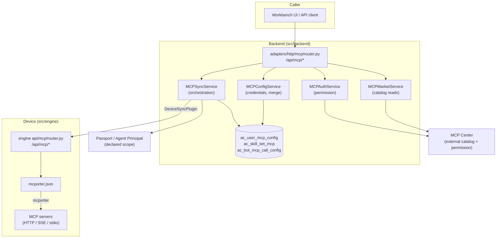

# How MCP works in Avernet

**English** | [简体中文](README.zh-CN.md)

A walkthrough of the Model Context Protocol (MCP) subsystem: what it is, which
tables and services own it, how a user's credential travels from an HTTP request
to a tool call inside a running bot, and where the in-flight tenant-isolation
work (Track A Stage 5, PR #564) plugs in.

Every code block below is quoted verbatim from this repository, with a
`path:line` reference you can click through.

---

## 1. What MCP is, in one paragraph

MCP is a standard way for an AI agent to call external tools. An **MCP server**
is a process or HTTP endpoint that advertises a list of tools (`tools/list`) and
executes them on request (`tools/call`). The agent's runtime holds a list of MCP
servers it is allowed to talk to, plus the credentials for each one. When the
model decides to use a tool, the runtime opens a connection to the right MCP
server and forwards the call.

So a working MCP integration needs three things:

1. **A catalog** — which MCP servers exist, what tools they expose, at which URL.
2. **A credential + a scope** — which servers *this* user/bot may use, and with
   what API key or header.
3. **Delivery to the runtime** — the agent process needs both of the above
   written somewhere it will read at tool-call time.

Avernet splits those three responsibilities across three components, and most of
the confusion when reading the code disappears once you know which is which:

| Concern | Owner | Notes |
| --- | --- | --- |
| Catalog | **MCP Center** (external service), behind `MCPCenterPlugin` | Avernet stores no server metadata table |
| Credential + scope | **backend** (`ac_user_mcp_config`, skill sets) | This is what Avernet actually persists |
| Delivery + execution | **engine** on the device (`mcporter.json`) | Backend pushes; engine executes |

---

## 2. The map



Two HTTP surfaces are both called `/api/mcp` and they are **not** the same API:

- `src/backend/.../adapters/http/mcp/router.py` — the user-facing backend API
  (marketplace, permissions, "save my API key").
- `src/engine/.../api/mcp/router.py` — the device-side API the backend *calls*
  to install/remove an MCP server inside a running bot.

---

## 3. What Avernet actually stores

### 3.1 `ac_user_mcp_config` — the caller's credential per server

This is the single most important table in the subsystem. One row = "user X's
settings for MCP server Y in environment Z".

```python
class UserMCPConfig(Base):
    """User-specific MCP Server configuration (API keys, etc.).

    Note: We store server_code directly instead of using a foreign key
    to ac_mcp_server table, as MCP server data is managed by MCP Center.
    """
    __tablename__ = "ac_user_mcp_config"

    id = Column(Integer, primary_key=True, autoincrement=True)
    user_id = Column(String(100), nullable=False, index=True)  # 用户工号
    server_code = Column(String(256), nullable=False, index=True)  # MCP server code
    api_key = Column(String(500), nullable=True)  # LING_XI类型需要的API Key (向后兼容)
    custom_headers = Column(Text, nullable=True)  # JSON: 用户自定义Headers
    extra_config = Column(Text, nullable=True)  # JSON: 其他配置项
    env = Column(String(50), nullable=True)  # 环境标识: dev/pre/prod
```

<sub>`src/backend/src/agentclaw/community/core/models/mcp.py:56`</sub>

Two things to internalise:

- **There is no foreign key to a server table** — `server_code` is an opaque
  string resolved against MCP Center. Avernet never owns the catalog.
- **The live payload lives in `extra_config` (JSON)**, not in the flat columns.
  `api_key`/`custom_headers` are legacy back-compat. The accessor spells out the
  real shape:

```python
    def get_unified_config(self) -> dict:
        """获取统一的配置（从 extra_config 中解析）

        Returns:
            {
                "api_key": str or None,           # API Key（授权格式）
                "headers": dict,                   # 自定义 Headers
                "endpoint_env": str,              # 环境选择：PROD/PRE
            }
        """
```

<sub>`src/backend/src/agentclaw/community/core/models/mcp.py:100`</sub>

The uniqueness key is `(user_id, server_code, env)` — note it says nothing about
*which tenant* the `user_id` belongs to. That gap is exactly what PR #564 is
about; see §8.

### 3.2 `ac_skill_set_mcp` — which servers a skill set brings

A **skill set** is a bundle of capabilities a bot can activate. Attaching an MCP
server to a skill set is what makes it reachable by a bot at all:

```python
class SkillSetMCPServer(Base):
    """Association table between SkillSet and MCP Server.
    ...
    """
    __tablename__ = "ac_skill_set_mcp"
```

<sub>`src/backend/src/agentclaw/community/core/models/mcp.py:14`</sub>

Ownership is split on purpose: `UserMCPConfig` belongs to the `mcp` module,
`SkillSetMCPServer` belongs to `skill_center` (the file header says so).

### 3.3 `ac_bot_mcp_call_config` — whose identity the call runs as

When a bot invokes a tool, does it authenticate as the bot's **owner** or as the
**caller** who is chatting with it? The default is owner; only overrides get a
row (a sparse table):

```python
class BotMcpCallConfigModel(Base):
    """Sparse Caller overrides; Owner is represented by a missing row."""

    __tablename__ = "ac_bot_mcp_call_config"

    id = Column(AutoIncrementBigInteger, primary_key=True, autoincrement=True)
    bot_pk = Column(BigInteger, nullable=False, comment="ac_bots.id")
    server_code = Column(String(256), nullable=False)
    engine_type = Column(String(64), nullable=False)
    call_type = Column(String(16), nullable=False)
```

<sub>`src/backend/src/agentclaw/community/core/caller_identity/models.py:30`</sub>

### 3.4 Defaults — servers every bot gets for free

Some MCP servers are attached to every bot of a given engine type, without
anyone configuring anything:

```python
_DEFAULT_MCP_SERVERS_BY_ENGINE: Dict[str, List[dict]] = {
    "openclaw": [
        {"server_code": "mcp.ant.antprocessai.anttaskmcp"},
        {"server_code": "mcp.ant.arkai.dimamcpserver"},
        ...
```

<sub>`src/backend/src/agentclaw/community/core/mcp/services/_defaults.py:27`</sub>

---

## 4. The four backend services

All four live in `core/mcp/services/` and are bound as singletons in one DI
module:

```python
        binder.bind(MCPMarketService, to=MCPMarketService, scope=singleton)
        binder.bind(MCPAuthService, to=MCPAuthService, scope=singleton)
        binder.bind(MCPConfigService, to=MCPConfigService, scope=singleton)
```

<sub>`src/backend/src/agentclaw/community/di/modules/mcp_module.py:70`</sub>

| Service | Responsibility | Talks to |
| --- | --- | --- |
| `MCPMarketService` | Read the catalog (list / detail / tenants) | `MCPCenterPlugin` |
| `MCPAuthService` | "May this user use this server?" + apply for access | `MCPAuthPlugin` + `MCPCenterPlugin` |
| `MCPConfigService` | CRUD the caller's credential, and **merge** it with defaults | `UserMCPConfigRepository` |
| `MCPSyncService` | Orchestrate: collect → merge → push to devices → update scope | everything |

The division that matters: **`MCPConfigService` never makes an HTTP call to a
device.** Its own docstring pins that boundary down:

```python
class MCPConfigService:
    """管理用户级 MCP 配置（CRUD + 负载构建）。

    **不**向设备发送 HTTP 请求 —— 该职责由 ``MCPSyncService`` /
    ``DeviceMCPSyncPlugin`` 承担。
    """
```

<sub>`src/backend/src/agentclaw/community/core/mcp/services/config_service.py:17`</sub>

`MCPSyncService` is wired by an explicit provider rather than plain `@inject`,
because MCP delivery sits in the middle of a dependency cycle:

```python
        return MCPSyncService(
            ...
            resolver_provider=lambda: injector.get(DeviceContextResolver),
            device_sync_dispatcher_provider=lambda: injector.get(DeviceSyncDispatcher),
        )
```

<sub>`src/backend/src/agentclaw/community/di/modules/mcp_module.py:133` — the
docstring above it names the cycle: `MCPSyncService → DeviceContextResolver →
ArcaConnInfoBuilder → DeviceService → BotService → SkillSetServiceFactory →
MCPSyncService`.</sub>

---

## 5. Walkthrough A — a user saves an API key

This is the write path, end to end. Entry point: `POST /api/mcp/user/config`.

### Step 0 — validate before touching anything

```python
    # 校验 endpoint_env
    if request.endpoint_env is not None and request.endpoint_env not in ("PROD", "PRE"):
        raise HTTPException(status_code=400, detail="endpoint_env must be PROD or PRE")
```

<sub>`src/backend/src/agentclaw/community/adapters/http/mcp/router.py:250`</sub>

### Steps 1–3 — external check, then DB, then push, with rollback

The ordering here is deliberate and is the single most instructive block in the
subsystem:

```python
        # 步骤1：校验 MCP 存在性（外部依赖先校验，避免写库后再回滚）
        mcp_data = market_service.get_mcp_detail(request.server_code)
        if not mcp_data:
            raise HTTPException(status_code=404, detail=f"MCP server {request.server_code} not found")

        # 步骤2：写库，保留旧配置供回滚
        old_config = config_service.update_user_unified_config(
            user_id=user.staffId,
            server_code=request.server_code,
            ...
        )

        # 步骤3：推送到该用户/实体下的所有设备
        result = await sync_service.sync_mcp_detail_to_all_bots(...)

        if not result["success"]:
            config_service.rollback_unified_config(
                user_id=user.staffId,
                server_code=request.server_code,
                old_config=old_config,
            )
            raise HTTPException(status_code=500, detail=result.get("error", "Failed to sync to all devices"))
```

<sub>`src/backend/src/agentclaw/community/adapters/http/mcp/router.py:271` (elided
for length)</sub>

Read that as: *the database is not the source of truth on its own — a config the
devices never received is rolled back.* There is no background reconciler that
would repair a divergence later, which is why the write is compensated by hand.

### The merge rule — how a partial update behaves

`None` means "leave it alone", not "clear it":

```python
        if existing:
            # 合并策略：入参为 None 表示不修改，沿用旧值
            old_extra = old_config or {}
            extra_config = {
                "api_key": api_key if api_key is not None else old_extra.get("api_key"),
                "headers": headers if headers is not None else old_extra.get("headers", {}),
                ...
```

<sub>`src/backend/src/agentclaw/community/core/mcp/services/config_service.py:120`</sub>

### The other merge rule — user headers over engine defaults

When a config is turned into a payload for a device, defaults form the base and
the user's values win. There is also one genuinely surprising special case:

```python
        # 当 api_key 是 x-ling-auth 格式时，需要把默认 headers 里的同名 key 删掉，
        # 否则设备端会收到两个冲突的 authorization header。
        if _api_key and "=" in _api_key:
            key_name, _ = _api_key.split("=", 1)
            if key_name.lower() == "x-ling-auth":
                config_headers = {
                    k: v for k, v in config_headers.items() if k.lower() != "x-ling-auth"
                }

        # 合并策略：默认 headers 作为基底，用户 headers 覆盖同名键。
        merged_headers = {**config_headers, **user_headers}
```

<sub>`src/backend/src/agentclaw/community/core/mcp/services/config_service.py:233`</sub>

Note the `api_key` format: it is **not** a bare token, it is `"name=value"` —
the name decides whether the credential becomes a header or a query parameter
(see §6.2).

### The fan-out — push to every bot that has the server

```python
        for bot_id in bot_ids:
            ...
            has_mcp = await asyncio.to_thread(plugin.has_mcp, server_code)
            if not has_mcp:
                logger.warning(
                    "[MCPSyncService] bot=%s 设备上未找到 MCP %s", bot_id, server_code
                )
                sync_results.append({
                    "bot_id": bot_id, "synced": False, "reason": "设备上未找到该 MCP",
                })
                continue
```

<sub>`src/backend/src/agentclaw/community/core/mcp/services/sync_service.py:478`</sub>

And the failure rule — a device that doesn't have the server, or has no device
binding at all, is *not* a failure:

```python
        # 只有"确实有该 MCP 的设备全部失败"时才整体报错；
        # 如果设备上没有该 MCP 或者根本没有设备，不算失败。
        if has_mcp_devices > 0 and not any_success:
```

<sub>`src/backend/src/agentclaw/community/core/mcp/services/sync_service.py:538`</sub>

### Reads mask the secret

The GET counterpart never returns the stored key:

```python
    api_key = config.get("api_key")
    masked_key = None
    if api_key:
        masked_key = api_key[:4] + "****" + api_key[-4:] if len(api_key) > 8 else "****"
```

<sub>`src/backend/src/agentclaw/community/adapters/http/mcp/router.py:370`</sub>

---

## 6. Walkthrough B — a bot's toolset changes

Saving a credential (Walkthrough A) is the small path: one server, one
credential. The complicated one runs when the **set of servers a bot may use**
changes — a user activates a skill set, or adds a new MCP to one. This section
takes that path apart.

### 6.0 First, two concepts: scope and detail

The thing that makes this code hard to read is not noticing that the system
syncs **two independent things**. By analogy with a building's access control:

- **scope** = the door whitelist. Answers "which servers is this bot *allowed*
  to use".
- **detail** = each door's address and key. Answers "what is this server's URL,
  and what credential and headers connect to it".

You need both, and the symptoms of missing either are quite different. Whitelist
without detail: the bot is allowed to use a server but has no idea where to
connect. Detail without whitelist: the config sits on the device but is filtered
out, and the tool never appears.

Two different sets of methods own them, and they are **always called in pairs**:

| Concept | Question it answers | Where it lands | Method |
| --- | --- | --- | --- |
| scope | Which servers may this bot use | Device `filter-servers` whitelist **+** passport | `refresh_mcp_scope` |
| detail | A server's URL / credential / headers | Device `mcporter.json` entry | `sync_mcp_detail` (one) / `sync_mcp_details` (all) |

The service-layer docstring states the split plainly:

```python
        """刷新MCP授权范围（异步方法）。

        向设备声明filter-servers白名单，并更新passport的MCP codes列表。
        不包含MCP详细配置的推送——那是 sync_mcp_details / sync_mcp_detail 的职责。
        """
```

<sub>`src/backend/src/agentclaw/community/core/skill_center/services/skill_set_service.py:1844`
— "declares the filter-servers whitelist to the device and updates passport's MCP
code list. It does **not** push MCP detail config — that is
`sync_mcp_details` / `sync_mcp_detail`'s job."</sub>

### 6.1 What triggers it

No single endpoint owns this path; four classes of event do. Note the pairing —
and that two of them run the pair in the opposite order:

| Scenario | Call order | Location |
| --- | --- | --- |
| Add an MCP to a skill set | push that one detail, then refresh scope | `skill_set_service.py:1360` → `:1378` |
| Remove an MCP from a skill set | remove that one from the device, then refresh scope | `skill_set_service.py:1442` → `:1459` |
| Switch / activate a skill set | refresh scope, then push the active set's details | `skill_set_service.py:2265` → `:2274` |
| Device comes back online | refresh scope, then push every detail | `device_service.py:1502` → `:1513` |

Why does the order flip? **Adding an MCP** pushes its config to the device
first, then whitelists it — so by the time the whitelist opens, the config is
already there. **A device coming online** has no "one" server to speak of; it
has to rebuild the whole state, so it declares the whitelist first and returns
early on failure, skipping an entire round of detail pushes:

```python
                async def _do_sync() -> tuple[dict, dict | None]:
                    # 1. 先声明白名单（scope），失败则直接返回，不必继续推送详细配置
                    scope_result = await self._mcp_sync.refresh_mcp_scope(...)
                    if not scope_result.get("success"):
                        return scope_result, None

                    # 2. 再推送详细配置
                    detail_result = await self._mcp_sync.sync_mcp_details(...)
```

<sub>`src/backend/src/agentclaw/community/core/devices/services/device_service.py:1500`
(elided for length)</sub>

One more detail in the "add" case — the association has just been written to the
DB, and a failed push undoes it. Same hand-written compensation as Walkthrough A:

```python
        if not push_result.get("success"):
            error = push_result.get("error", "Unknown error")
            logger.error(f"[add_mcp_to_skill_set] Device sync failed: {error}")
            self.skill_set_repo.remove_mcp_from_set(skill_set_id, server_code)
```

<sub>`src/backend/src/agentclaw/community/core/skill_center/services/skill_set_service.py:1366`</sub>

### 6.2 Inside `refresh_mcp_scope` — two destinations

Refreshing scope means writing "the currently allowed server list" to two places
— device first, passport second:

```python
        # 先向设备声明白名单：即使 active_mcps 为空也会调用，防止设备残留旧白名单。
        scope_result = await self._declare_mcp_scope(...)
        if not scope_result.get("success"):
            return scope_result

        # 白名单声明成功后，再更新 passport 供前端权限校验使用。
        passport_result = await self._update_passport(...)
```

<sub>`src/backend/src/agentclaw/community/core/mcp/services/sync_service.py:378`</sub>

The order is deliberate: **the device enforces, passport declares.** If the
device write fails the method returns early and passport is never touched —
better that both sides stay on the old state than have passport advertise a
scope the device never took.

### 6.3 Why an empty list must still be pushed

The easiest phrase to skim past in that comment is "called even when
`active_mcps` is empty". That isn't defensive coding, it's a security property:

Suppose a user deactivates their last skill set. The allowed list becomes empty.
If the call were skipped because "there's nothing to declare", the device's old
whitelist would sit there untouched — and the bot would still be able to call
tools it is no longer entitled to. **Revocation is exactly the empty-list case,
and exactly the case most likely to be optimised away.**

This is also why the engine side needs a sentinel for "allow nothing" — an empty
string is indistinguishable from "no argument" on a command line (see
`__EMPTY_FILTER_DISABLE_ALL__` in §7).

### 6.4 Where the list comes from

The `mcp` module does not know what a skill set is. It knows one Protocol, which
`skill_center` implements:

```python
@runtime_checkable
class BotMCPProvider(Protocol):
    """Interface for fetching a bot's MCP list from skill_center.

    Implemented by ``SkillSetService``.  MCPSyncService depends only on
    this protocol so that the mcp module does not need to import
    skill_center internals.
    """
```

<sub>`src/backend/src/agentclaw/community/core/mcp/services/repositories.py:11`</sub>

Two of that Protocol's methods are easy to confuse; the difference is whether
"active" filters:

- `collect_bot_active_mcps` — only MCPs from **currently active** skill sets
  (plus the engine defaults). Scope declaration uses this one
  (`sync_service.py:588`): a whitelist should only ever contain what is live now.
- `collect_bot_mcps` — **every** MCP associated with the bot, inactive included.

Detail pushes switch between them with the `active_only` flag:

```python
            active_only: 为 True 时只推送当前**激活** skill sets 中的 MCP；
                为 False 时推送该 bot 关联的**全部** MCP（含 inactive）。
```

<sub>`src/backend/src/agentclaw/community/core/mcp/services/sync_service.py:177`
— "True pushes only MCPs from currently **active** skill sets; False pushes
**every** MCP associated with the bot, inactive included."</sub>

Why would you ever push inactive ones? Because a detail is just config sitting in
`mcporter.json` — the whitelist is what decides usability. Loading every detail
when a device comes online means a later skill-set activation only has to change
the whitelist, with no config push at all.

### 6.5 Passport is an overwrite snapshot — hence the CLI read-back

This is the least obvious part of the section, and the most worth understanding.
Passport's `resourceManifest` is a **whole-object overwrite**: what you submit is
what it becomes. And a bot's manifest carries CLI grants *as well as* MCP grants.

The consequence: a sync that only cares about MCP would, by submitting only the
MCP list, **silently erase that bot's CLI grants.** So the code reads the current
CLI scope back, merges it with the engine defaults, and submits both together:

```python
        # MCP 同步触发 resourceManifest 更新时，要回填当前 CLI，避免覆盖式更新丢失 CLI 授权。
        try:
            current_cli_items = self.passport_update.query_passport_clis(
                bot_id, user_id
            )
        ...
        default_cli_items = get_default_cli_items(engine_type, template_type)
        cli_items = _merge_cli_items(current_cli_items, default_cli_items)
```

<sub>`src/backend/src/agentclaw/community/core/mcp/services/sync_service.py:888`</sub>

```python
            # resource_scope 是完整快照：MCP 来自同步结果，CLI 来自当前许可证 + 引擎默认 CLI。
            self.passport_update.update_passport(
                bot_id=bot_id,
                user_id=user_id,
                resource_scope={
                    "mcp_codes": synced_server_codes,
                    "cli_items": cli_items,
                },
```

<sub>`src/backend/src/agentclaw/community/core/mcp/services/sync_service.py:913`</sub>

Existing values win on merge, and there's a timing trap to guard against too — a
freshly created bot may momentarily read back an empty CLI list, and taking that
at face value would let one MCP sync flatten the defaults:

```python
    """Merge passport CLI scope with default CLI items, de-duped by cli_code.

    The passport update API treats resourceManifest as an overwrite. During MCP
    sync we must send the complete CLI scope as well as MCPs. If the passport
    service returns a temporarily-empty CLI list right after bot creation,
    preserving the engine defaults here prevents a later MCP sync from clearing
    them. Existing passport values win on duplicate cli_code so user/provider
    metadata is not overwritten by static defaults.
    """
```

<sub>`src/backend/src/agentclaw/community/core/mcp/services/sync_service.py:46`</sub>

Same reasoning: if reading the bot's metadata fails, the passport update aborts
outright rather than write a partial snapshot (`sync_service.py:884`).

**The rule to carry away: anything writing passport must submit a complete
snapshot, never a delta.**

### 6.6 Detail pushes — concurrent, but throttled

Scope is one call; details are N. They go out concurrently, with a deliberate cap,
because the target is a single container:

```python
        # 3. 并发推送，但限制并发数为 5，防止一次性向设备发太多 HTTP 请求把引擎压垮。
        semaphore = asyncio.Semaphore(5)
```

<sub>`src/backend/src/agentclaw/community/core/mcp/services/sync_service.py:681`</sub>

One failure doesn't abort the rest (`asyncio.gather(..., return_exceptions=True)`),
and results come back split into successes and failures — but `CancelledError` is
re-raised rather than swallowed as an ordinary failure.

### 6.7 One plugin boundary, two delivery shapes

The backend does not branch on container type. It resolves a per-bot
`DeviceSyncPlugin` and calls four methods; each implementation decides *how*:

```python
    def sync_all_mcp_servers(self, mcp_servers: list[dict[str, Any]]) -> bool:
        """Declare the full set of allowed MCP servers to the device
        (filter-servers). Returns ``True`` on success."""
        ...

    def sync_single_mcp(
        self,
        mcp_data: dict[str, Any],
        *,
        api_key: Optional[str] = None,
        custom_headers: Optional[dict[str, str]] = None,
        endpoint_env: str = "PROD",
        transport_protocol: Optional[str] = None,
    ) -> bool:
```

<sub>`src/backend/src/agentclaw/community/plugin_api/device_sync.py:89`</sub>

Those four methods (declare whitelist / push one / remove one / probe presence)
are exactly the actions in §6.1's table. The comment above them names the two
delivery styles:

> Per impl: arca/baas push per-MCP over `/api/mcp`; teclaw delivers the whole
> composed artifact; local is no-op.

<sub>`src/backend/src/agentclaw/community/plugin_api/device_sync.py:81`</sub>

The difference is more than transport. For a whole-artifact container like teclaw,
*any* change means recomposing and delivering the entire manifest — so
`sync_single_mcp` and `sync_all_mcp_servers` do the same work there, just
idempotently repeated.

In this (community) repository the local implementation is a no-op —
`LocalDeviceSyncPlugin.sync_single_mcp` simply returns `True`
(`plugins/local/device_sync.py:338`). The corp/arca implementations that do the
real HTTP push are not part of this repo.

### 6.8 Credentials are inlined in plaintext at compose time

For the whole-artifact style, the manifest is composed **in the backend** and the
credential is inlined into it — this is the clearest statement of the credential
format anywhere in the codebase:

```python
        """Inline the resolved credential, mirroring ``convert_to_device_format``.

        ``api_key`` is ``"name=value"``. ``authorization`` is appended to the
        endpoint URL query; ``x-ling-auth`` becomes a header; any other name is
        ignored (device-path parity).
        """
        merged_headers: dict[str, str] = {}

        if api_key and "=" in api_key:
            key_name, key_value = api_key.split("=", 1)
            lowered = key_name.lower()
            if lowered == "authorization" and endpoint:
                separator = "&" if "?" in endpoint else "?"
                endpoint = f"{endpoint}{separator}{key_name}={key_value}"
            elif lowered == "x-ling-auth":
                merged_headers[key_name] = key_value
```

<sub>`src/backend/src/agentclaw/community/core/config_compose/services/mcporter_composer.py:125`</sub>

**Secrets are inlined in plaintext at compose time** — there is no secret broker
or by-reference indirection on the device. The module docstring says so
explicitly, and it is why a failed device push rolls the DB write back: changing
an `api_key` changes the artifact bytes, and a stale container would keep serving
the old credential.

The same file also holds the endpoint-selection rule (which URL out of the
catalog's several):

```python
# Teclaw containers reach networks in this order; an endpoint on an earlier
# network always wins over a later one (network is the primary sort key).
TECLAW_MCP_NETWORK_PRIORITY = ("OFFICE", "INTERNET", "INTRANET")
```

<sub>`src/backend/src/agentclaw/community/core/config_compose/services/mcporter_composer.py:53`</sub>

### 6.9 The passport scope excludes LOCAL servers

Back to §6.2's second destination. The list sent to passport is not the list sent
to the device: `stdio`/LOCAL servers are stripped out, because they're
runtime-local capabilities no permission system grants — but the device still
needs their config:

```python
def passport_mcp_items_from_entries(
    mcps: Iterable[Mapping[str, Any]],
    *,
    identity_modes: Mapping[str, object],
    local_registry: LocalMCPRegistry | None = None,
) -> list[McpScopeItem]:
    """Build the complete non-local MCP identity scope for Agent Principal."""
    ...
        raw_mode = identity_modes.get(code, "owner")
        mode = getattr(raw_mode, "value", raw_mode)
        normalized_mode = str(mode).strip().lower()
        if normalized_mode not in {"owner", "caller"}:
            raise ValueError("identity mode must be owner or caller")
```

<sub>`src/backend/src/agentclaw/community/core/mcp/services/passport_scope.py:44`</sub>

That `owner`/`caller` value is the `ac_bot_mcp_call_config` decision from §3.3,
surfacing at the point where scope is published.

### Recap

One toolset change lands in three places:

1. **The device whitelist** — what's allowed (pushed even when empty).
2. **The device's `mcporter.json` entries** — how to reach each server, with what
   credential.
3. **The passport snapshot** — the declared scope, LOCAL excluded, identity mode
   attached, and CLI grants read back in.

The first two decide what the bot *can actually do*; the third is the *declaration*
of that authority to the rest of the system.

---
## 7. What happens on the device

The engine exposes its own `/api/mcp` and dispatches everything to an
engine-specific plugin:

```python
"""MCP router — dispatches every endpoint through ``EngineManager.mcp``.

Engine-specific behaviour (mcporter file edits, ``mcporter`` CLI shell-out)
lives in ``engines/openclaw/mcp.OpenClawMCPService``; AiCoding ships its own
plugin proxying to teamclaw-aicoding-relay. The router only marshals
HTTP↔Plugin types and applies capability guards.
"""
```

<sub>`src/engine/src/engine/community/api/mcp/router.py:1`</sub>

For the OpenClaw engine, "installing an MCP server" literally means editing a
JSON file:

```python
    def _mcp_load(self) -> "tuple[dict[str, Any], str, dict[str, Any]]":
        """Load mcporter.json; return (root, servers_key, servers_dict)."""
```

<sub>`src/engine/src/engine/community/plugins/openclaw/_mcp.py:24`</sub>

…and the allow-list is applied by shelling out to the `mcporter` CLI. Note the
sentinel for "allow nothing", which is why an empty list is still pushed:

```python
        csv_codes = (
            ",".join(normalized) if normalized else "__EMPTY_FILTER_DISABLE_ALL__"
        )
        command = ["mcporter", "filter-servers", csv_codes]
```

<sub>`src/engine/src/engine/community/plugins/openclaw/_mcp.py:260`</sub>

Tool execution is the same shape:

```python
        cmd = ["mcporter", "call", tool]
        for key, value in (args or {}).items():
            cmd.append(f"{key}={value}")
```

<sub>`src/engine/src/engine/community/plugins/openclaw/_mcp.py:209`</sub>

The engine's transport model is a small dataclass set, and it is where the
`stdio` vs `http` vs `sse` distinction finally becomes concrete:

```python
@dataclass
class MCPServerConfig:
    """Declared configuration for an MCP server.

    `server_code` is the stable identifier used to look up the server.
    Transport-dependent fields:
      - HTTP / SSE: `url` (and optional `headers`)
      - stdio: `command` + `args` (and optional `env`)
    """
```

<sub>`src/engine/src/engine/community/core/mcp/models.py:31`</sub>

Not every engine supports every operation; the router guards each one with a
capability check (`check_capability(Capability.MCP_CREATE)` etc.) and answers
`501` when an engine doesn't implement it — see
`src/engine/src/engine/community/api/mcp/router.py:145`.

---

## 8. Where PR #564 fits — tenant isolation

Everything above assumes one tenant. `ac_user_mcp_config` is keyed by
`(user_id, server_code, env)` — a user id alone is only meaningful *inside* a
tenant, and nothing on the row records which tenant that is.

That is fine today, because all data belongs to the internal tenant. It stops
being fine the moment `/openapi/v1` is opened to external tenants — those routes
already exist as stubs:

```python
@router.get(
    "/servers/{server_code}/config",
    response_model=Envelope[McpConfig],
)
async def get_mcp_config(
    server_code: str, principal: PrincipalDep
) -> Envelope[McpConfig]:
    """Read the caller's unified config for an MCP server."""
    raise NotImplementedError
```

<sub>`src/backend/src/agentclaw/community/adapters/http/openapi_v1/mcp/router.py:72`</sub>

The public-API programme is split into two tracks, and the rule is that a
category's endpoints must not be implemented before its data is isolated
(`src/backend/docs/openapi-v1/README.md`):

- **Track A** — add tenant scoping to a data category. Implements no endpoint.
- **Track B** — implement that category's `/openapi/v1` endpoints.

The mechanism was built and proved on bots in Track A Stage 1 (PR #456) and is
reused unchanged: a per-request tenant carrier, plus two SQLAlchemy guards
registered on the model —

> - `do_orm_execute` **read guard** on the `Session` class →
>   `with_loader_criteria(...)`. Also constrains `Query.update()`/`Query.delete()`,
>   so writes need no filter.
> - `before_insert` **insert guard** → stamp when unset, raise
>   `CrossTenantInsertError` on an explicit conflicting tenant.

<sub>`src/backend/docs/openapi-v1/README.md:168`</sub>

**PR #564 is Track A Stage 5: apply that mechanism to MCP configuration.** It is
currently the spec document only (`src/backend/specs/2026-07-29-tenant-isolation-mcp/spec.md`);
plan, tasks and implementation follow. In concrete terms it means adding an
`avernet_tenant` column plus the two guards to:

1. `UserMCPConfig` (§3.1) — the API keys and headers, the most sensitive data in
   the category.
2. `BotMcpCallConfigModel` (§3.3) — flagged in the PR as a judgement call. Its
   rows hang off a bot, so Stage 1's bot isolation already covers anything
   reached *through* a bot; but its aggregate reads query by `bot_pk` without
   ever touching a bot record, so the guard doesn't reach them.

Four of the six `mcp` endpoints (marketplace, tenants, server detail,
permissions) need no Stage 5 work at all — they are served by MCP Center, and as
§1 established, Avernet stores nothing for them.

---

## 9. Deployment profiles — why an "external" service isn't a hard dependency

The catalog is reached only through a Protocol:

```python
@runtime_checkable
class MCPCenterPlugin(Plugin, Protocol):
    """Read-only queries against MCP Center API."""

    def get_mcp_detail(self, server_code: str) -> dict[str, Any] | None:
```

<sub>`src/backend/src/agentclaw/community/plugin_api/mcp_center.py:13`</sub>

Under `DEPLOY_PROFILE=community` that Protocol is satisfied by a config-file
catalog with allow-all permissions, so the whole subsystem resolves with no
internal MCP-Center service:

```python
class CommunityMCPCenter(MCPCenterPlugin):
    """Config-file-backed MCP catalog with allow-all permission + default tenant."""
```

<sub>`src/backend/src/agentclaw/community/plugins/community/mcp_center.py:31`</sub>

Its module docstring makes the key point about why an empty catalog is still a
working system:

> The bot-run path uses bring-your-own MCP configs (`ac_user_mcp_config`) and
> skill-set references, which sync to devices regardless of this catalog — so an
> empty catalog never blocks a configured MCP server from working.

<sub>`src/backend/src/agentclaw/community/plugins/community/mcp_center.py:19`</sub>

Servers declared in `configs/local-mcp-servers.yaml` are loaded by
`LocalMCPRegistry` and normalised into MCP-Center-shaped dicts
(`core/mcp/services/local_mcp_registry.py:18`), which is why the rest of the code
can treat both sources identically.

One useful escape hatch: when the caller presents an IAM token, server detail is
fetched **live** from the MCP server (a real `initialize` → `tools/list`
JSON-RPC exchange in `core/mcp/services/mcp_live_fetcher.py:14`) instead of
trusting possibly-stale catalog metadata — falling back to catalog data on any
failure (`adapters/http/mcp/router.py:144`).

---

## 10. Reading order & test map

If you want to trace one thread end to end, read in this order:

1. `core/models/mcp.py` — what's stored (117 lines).
2. `adapters/http/mcp/router.py:237` — the write endpoint, all five steps.
3. `core/mcp/services/config_service.py` — the merge rules.
4. `core/mcp/services/sync_service.py:439` — the fan-out.
5. `core/mcp/services/sync_service.py:324` — `refresh_mcp_scope`, the scope path
   (§6), and `:849` for the passport snapshot it writes.
6. `plugin_api/device_sync.py:81` — the delivery boundary.
7. `src/engine/.../plugins/openclaw/_mcp.py` — what a device actually does.

Tests worth reading as executable documentation:

| Test | Covers |
| --- | --- |
| `src/backend/tests/community/api/mcp/routers/test_mcp.py` | Backend router behaviour |
| `src/backend/tests/community/endpoints/test_mcp_device_sync.py` | Device-sync orchestration |
| `src/backend/tests/community/_flows/mcp/api_lifecycle.py` | Full config lifecycle flow |
| `src/backend/tests/community/contracts/test_mcp_center.py` | `MCPCenterPlugin` conformance |
| `src/engine/.../api/tests/test_mcp_router.py` | Engine-side router |
| `src/engine/.../plugins/openclaw/tests/test_mcp_port.py` | `mcporter.json` editing |

Related docs:

- `src/backend/src/agentclaw/community/core/mcp/README.md` — the module's
  machine-checked context boundary.
- `src/backend/docs/openapi-v1/README.md` — the Track A / Track B handoff board.
- `src/engine/docs/heterogeneous-engine-architecture.md` §6.2 — engine-side MCP
  model.
