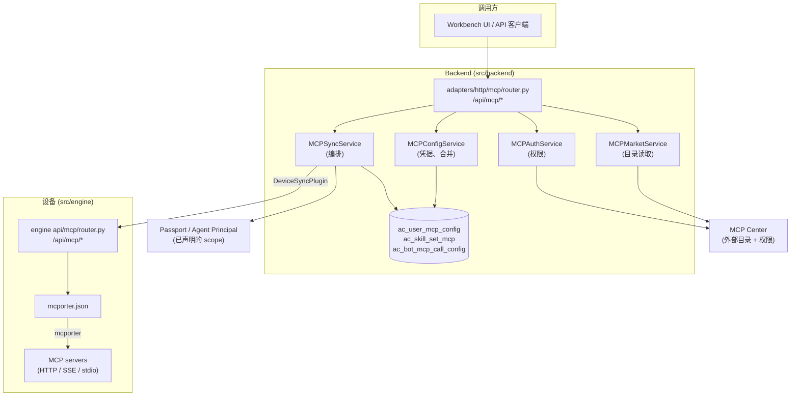

# Avernet 中的 MCP 是如何工作的

[English](README.md) | **简体中文**

一份关于 Model Context Protocol（MCP）子系统的走查：它是什么、哪些表和服务持有它、
一份用户凭据如何从一个 HTTP 请求一路走到运行中的 bot 内部的一次工具调用，以及正在进行中的
租户隔离工作（Track A Stage 5，PR #564）接在什么位置。

下文每一段代码都逐字引自本仓库，并附带可点击的 `path:line` 引用。

---

## 1. 一段话讲清 MCP 是什么

MCP 是让 AI agent 调用外部工具的一套标准。一个 **MCP server** 是一个进程或 HTTP
端点，它对外声明自己有哪些工具（`tools/list`），并按请求执行它们（`tools/call`）。
agent 的运行时持有一份"允许与之通信的 MCP server 列表"，以及每一个 server 对应的凭据。
当模型决定要用某个工具时，运行时就与对应的 MCP server 建立连接并把调用转发过去。

所以一套能跑起来的 MCP 集成需要三样东西：

1. **一份目录（catalog）** —— 有哪些 MCP server、各自暴露什么工具、URL 是什么。
2. **一份凭据 + 一个授权范围（scope）** —— *这个*用户/bot 可以用哪些 server，以及用什么
   API key 或 header。
3. **投递到运行时** —— agent 进程需要在工具调用时能读到上面两样东西，因此它们必须被写到
   进程读得到的地方。

Avernet 把这三件事拆给了三个组件。一旦你分清了谁是谁，读代码时的大部分困惑就消失了：

| 关注点 | 归属 | 说明 |
| --- | --- | --- |
| 目录 | **MCP Center**（外部服务），位于 `MCPCenterPlugin` 之后 | Avernet 不存任何 server 元数据表 |
| 凭据 + 范围 | **backend**（`ac_user_mcp_config`、skill set） | 这才是 Avernet 真正持久化的东西 |
| 投递 + 执行 | 设备上的 **engine**（`mcporter.json`） | backend 负责推送；engine 负责执行 |

---

## 2. 全局地图



有两个 HTTP 接口都叫 `/api/mcp`，但它们**不是**同一套 API：

- `src/backend/.../adapters/http/mcp/router.py` —— 面向用户的 backend API（市场、权限、
  "保存我的 API key"）。
- `src/engine/.../api/mcp/router.py` —— 设备侧 API，backend *调用*它来在运行中的 bot 里
  安装/移除 MCP server。

---

## 3. Avernet 究竟存了什么

### 3.1 `ac_user_mcp_config` —— 调用方在每个 server 上的凭据

这是整个子系统里最重要的一张表。一行 = "用户 X 在环境 Z 下针对 MCP server Y 的设置"。

```python
class UserMCPConfig(Base):
    """User-specific MCP Server configuration (API keys, etc.).

    Note: We store server_code directly instead of using a foreign key
    to ac_mcp_server table, as MCP server data is managed by MCP Center.
    """
    __tablename__ = "ac_user_mcp_config"

    id = Column(Integer, primary_key=True, autoincrement=True)
    user_id = Column(String(100), nullable=False, index=True)  # 用户工号
    server_code = Column(String(256), nullable=False, index=True)  # MCP server code
    api_key = Column(String(500), nullable=True)  # LING_XI类型需要的API Key (向后兼容)
    custom_headers = Column(Text, nullable=True)  # JSON: 用户自定义Headers
    extra_config = Column(Text, nullable=True)  # JSON: 其他配置项
    env = Column(String(50), nullable=True)  # 环境标识: dev/pre/prod
```

<sub>`src/backend/src/agentclaw/community/core/models/mcp.py:56`</sub>

有两点需要先记住：

- **没有指向 server 表的外键** —— `server_code` 是一个不透明字符串，靠 MCP Center 解析。
  Avernet 从不拥有这份目录。
- **真正生效的负载放在 `extra_config`（JSON）里**，而不是那几个扁平列。
  `api_key`/`custom_headers` 属于遗留的向后兼容字段。访问器把真实结构写得很清楚：

```python
    def get_unified_config(self) -> dict:
        """获取统一的配置（从 extra_config 中解析）

        Returns:
            {
                "api_key": str or None,           # API Key（授权格式）
                "headers": dict,                   # 自定义 Headers
                "endpoint_env": str,              # 环境选择：PROD/PRE
            }
        """
```

<sub>`src/backend/src/agentclaw/community/core/models/mcp.py:100`</sub>

唯一键是 `(user_id, server_code, env)` —— 注意它完全没有提及这个 `user_id`
*属于哪个租户*。这个缺口正是 PR #564 要解决的问题，见 §8。

### 3.2 `ac_skill_set_mcp` —— 一个 skill set 带来哪些 server

**skill set** 是一组 bot 可以激活的能力包。把一个 MCP server 挂到某个 skill set 上，
才是让 bot 能够触达它的前提：

```python
class SkillSetMCPServer(Base):
    """Association table between SkillSet and MCP Server.
    ...
    """
    __tablename__ = "ac_skill_set_mcp"
```

<sub>`src/backend/src/agentclaw/community/core/models/mcp.py:14`</sub>

归属是有意拆开的：`UserMCPConfig` 属于 `mcp` 模块，`SkillSetMCPServer` 属于
`skill_center`（文件头注释里写明了这一点）。

### 3.3 `ac_bot_mcp_call_config` —— 这次调用以谁的身份执行

当一个 bot 发起工具调用时，它是以 bot 的**拥有者（owner）**身份、还是以正在与它对话的
**调用者（caller）**身份去做鉴权？默认是 owner；只有覆盖项才会写一行（稀疏表）：

```python
class BotMcpCallConfigModel(Base):
    """Sparse Caller overrides; Owner is represented by a missing row."""

    __tablename__ = "ac_bot_mcp_call_config"

    id = Column(AutoIncrementBigInteger, primary_key=True, autoincrement=True)
    bot_pk = Column(BigInteger, nullable=False, comment="ac_bots.id")
    server_code = Column(String(256), nullable=False)
    engine_type = Column(String(64), nullable=False)
    call_type = Column(String(16), nullable=False)
```

<sub>`src/backend/src/agentclaw/community/core/caller_identity/models.py:30`</sub>

### 3.4 默认值 —— 每个 bot 白拿的 server

有一些 MCP server 会挂到某个引擎类型下的每一个 bot 上，不需要任何人做任何配置：

```python
_DEFAULT_MCP_SERVERS_BY_ENGINE: Dict[str, List[dict]] = {
    "openclaw": [
        {"server_code": "mcp.ant.antprocessai.anttaskmcp"},
        {"server_code": "mcp.ant.arkai.dimamcpserver"},
        ...
```

<sub>`src/backend/src/agentclaw/community/core/mcp/services/_defaults.py:27`</sub>

---

## 4. backend 的四个服务

四个服务都位于 `core/mcp/services/`，并在同一个 DI 模块里绑定为单例：

```python
        binder.bind(MCPMarketService, to=MCPMarketService, scope=singleton)
        binder.bind(MCPAuthService, to=MCPAuthService, scope=singleton)
        binder.bind(MCPConfigService, to=MCPConfigService, scope=singleton)
```

<sub>`src/backend/src/agentclaw/community/di/modules/mcp_module.py:70`</sub>

| 服务 | 职责 | 依赖 |
| --- | --- | --- |
| `MCPMarketService` | 读目录（list / detail / tenants） | `MCPCenterPlugin` |
| `MCPAuthService` | "这个用户能用这个 server 吗？" + 申请权限 | `MCPAuthPlugin` + `MCPCenterPlugin` |
| `MCPConfigService` | 增删改查调用方的凭据，并与默认值做**合并** | `UserMCPConfigRepository` |
| `MCPSyncService` | 编排：收集 → 合并 → 推送到设备 → 更新 scope | 以上全部 |

真正关键的一条分工：**`MCPConfigService` 从不向设备发 HTTP 请求。** 它自己的
docstring 就把这条边界钉死了：

```python
class MCPConfigService:
    """管理用户级 MCP 配置（CRUD + 负载构建）。

    **不**向设备发送 HTTP 请求 —— 该职责由 ``MCPSyncService`` /
    ``DeviceMCPSyncPlugin`` 承担。
    """
```

<sub>`src/backend/src/agentclaw/community/core/mcp/services/config_service.py:17`</sub>

`MCPSyncService` 是用显式 provider 装配的，而不是普通的 `@inject`，因为 MCP 投递正好
卡在一个依赖环的中间：

```python
        return MCPSyncService(
            ...
            resolver_provider=lambda: injector.get(DeviceContextResolver),
            device_sync_dispatcher_provider=lambda: injector.get(DeviceSyncDispatcher),
        )
```

<sub>`src/backend/src/agentclaw/community/di/modules/mcp_module.py:133` —— 它上方的
docstring 点名了这个环：`MCPSyncService → DeviceContextResolver → ArcaConnInfoBuilder
→ DeviceService → BotService → SkillSetServiceFactory → MCPSyncService`。</sub>

---

## 5. 走查 A —— 用户保存一个 API key

这是端到端的写入路径。入口：`POST /api/mcp/user/config`。

### 第 0 步 —— 在动任何东西之前先校验

```python
    # 校验 endpoint_env
    if request.endpoint_env is not None and request.endpoint_env not in ("PROD", "PRE"):
        raise HTTPException(status_code=400, detail="endpoint_env must be PROD or PRE")
```

<sub>`src/backend/src/agentclaw/community/adapters/http/mcp/router.py:250`</sub>

### 第 1–3 步 —— 先查外部依赖，再写库，再推送，失败则回滚

这里的顺序是刻意安排的，也是整个子系统里最有启发性的一段：

```python
        # 步骤1：校验 MCP 存在性（外部依赖先校验，避免写库后再回滚）
        mcp_data = market_service.get_mcp_detail(request.server_code)
        if not mcp_data:
            raise HTTPException(status_code=404, detail=f"MCP server {request.server_code} not found")

        # 步骤2：写库，保留旧配置供回滚
        old_config = config_service.update_user_unified_config(
            user_id=user.staffId,
            server_code=request.server_code,
            ...
        )

        # 步骤3：推送到该用户/实体下的所有设备
        result = await sync_service.sync_mcp_detail_to_all_bots(...)

        if not result["success"]:
            config_service.rollback_unified_config(
                user_id=user.staffId,
                server_code=request.server_code,
                old_config=old_config,
            )
            raise HTTPException(status_code=500, detail=result.get("error", "Failed to sync to all devices"))
```

<sub>`src/backend/src/agentclaw/community/adapters/http/mcp/router.py:271`（为篇幅做了省略）</sub>

这段应该这样理解：*数据库本身并不是唯一事实来源 —— 一份设备从未收到的配置会被回滚。*
系统里没有后台对账任务去事后修复这种不一致，所以这次写入只能靠手写的补偿逻辑来兜底。

### 合并规则之一 —— 部分更新的语义

`None` 表示"别动它"，而不是"清空它"：

```python
        if existing:
            # 合并策略：入参为 None 表示不修改，沿用旧值
            old_extra = old_config or {}
            extra_config = {
                "api_key": api_key if api_key is not None else old_extra.get("api_key"),
                "headers": headers if headers is not None else old_extra.get("headers", {}),
                ...
```

<sub>`src/backend/src/agentclaw/community/core/mcp/services/config_service.py:120`</sub>

### 合并规则之二 —— 用户 header 盖过引擎默认值

当一份配置要被转成推给设备的负载时，默认值作为基底，用户的值优先。这里还有一个真的很容易
踩坑的特例：

```python
        # 当 api_key 是 x-ling-auth 格式时，需要把默认 headers 里的同名 key 删掉，
        # 否则设备端会收到两个冲突的 authorization header。
        if _api_key and "=" in _api_key:
            key_name, _ = _api_key.split("=", 1)
            if key_name.lower() == "x-ling-auth":
                config_headers = {
                    k: v for k, v in config_headers.items() if k.lower() != "x-ling-auth"
                }

        # 合并策略：默认 headers 作为基底，用户 headers 覆盖同名键。
        merged_headers = {**config_headers, **user_headers}
```

<sub>`src/backend/src/agentclaw/community/core/mcp/services/config_service.py:233`</sub>

注意 `api_key` 的格式：它**不是**一个裸 token，而是 `"name=value"` —— 其中的 name
决定了这份凭据最终变成一个 header 还是一个 query 参数（见 §6.2）。

### 扇出 —— 推给每一个装了该 server 的 bot

```python
        for bot_id in bot_ids:
            ...
            has_mcp = await asyncio.to_thread(plugin.has_mcp, server_code)
            if not has_mcp:
                logger.warning(
                    "[MCPSyncService] bot=%s 设备上未找到 MCP %s", bot_id, server_code
                )
                sync_results.append({
                    "bot_id": bot_id, "synced": False, "reason": "设备上未找到该 MCP",
                })
                continue
```

<sub>`src/backend/src/agentclaw/community/core/mcp/services/sync_service.py:478`</sub>

以及失败判定规则 —— 设备上没有这个 server、或者压根没有设备绑定，*都不算*失败：

```python
        # 只有"确实有该 MCP 的设备全部失败"时才整体报错；
        # 如果设备上没有该 MCP 或者根本没有设备，不算失败。
        if has_mcp_devices > 0 and not any_success:
```

<sub>`src/backend/src/agentclaw/community/core/mcp/services/sync_service.py:538`</sub>

### 读取时会做掩码

对应的 GET 接口从不返回已存储的 key：

```python
    api_key = config.get("api_key")
    masked_key = None
    if api_key:
        masked_key = api_key[:4] + "****" + api_key[-4:] if len(api_key) > 8 else "****"
```

<sub>`src/backend/src/agentclaw/community/adapters/http/mcp/router.py:370`</sub>

---

## 6. 走查 B —— 一个 bot 的工具集发生变化

保存凭据（走查 A）是小路径：一个 server、一份凭据。真正复杂的是当一个 bot **可用的
server 集合本身**发生变化时 —— 用户激活了一个 skill set，或者往 skill set 里加了一个
新的 MCP。这一节把这条路径拆开讲。

### 6.0 先分清两个概念：scope（范围）与 detail（详情）

读这段代码最容易卡住的地方，是没有意识到系统在同步**两种彼此独立的东西**。用一个门禁的
比方：

- **scope（范围）** = 门禁白名单。回答"这个 bot *被允许*使用哪些 server"。
- **detail（详情）** = 每扇门的地址和钥匙。回答"某个 server 的 URL 是什么、用什么凭据和
  header 连上去"。

两者缺一不可，而且缺失时的症状完全不同：只有白名单没有详情，bot 知道自己被允许用某个
server，却不知道往哪连；只有详情没有白名单，配置躺在设备上，但会被过滤掉，工具根本不出现。

它们由两组不同的方法负责，**总是成对被调用**：

| 概念 | 回答的问题 | 落到哪里 | 负责的方法 |
| --- | --- | --- | --- |
| scope | 这个 bot 允许用哪些 server | 设备的 `filter-servers` 白名单 **+** passport | `refresh_mcp_scope` |
| detail | 某个 server 的 URL / 凭据 / header | 设备的 `mcporter.json` 条目 | `sync_mcp_detail`（单条）/ `sync_mcp_details`（全量） |

服务层的 docstring 把这条分工写得很直白：

```python
        """刷新MCP授权范围（异步方法）。

        向设备声明filter-servers白名单，并更新passport的MCP codes列表。
        不包含MCP详细配置的推送——那是 sync_mcp_details / sync_mcp_detail 的职责。
        """
```

<sub>`src/backend/src/agentclaw/community/core/skill_center/services/skill_set_service.py:1844`</sub>

### 6.1 什么时候会触发

这条路径不是由某一个端点触发的，而是由四类事件触发。注意**成对调用**的模式，以及两种事件
下顺序是相反的：

| 场景 | 调用顺序 | 代码位置 |
| --- | --- | --- |
| 往 skill set 里加一个 MCP | 先推该条 detail，再刷新 scope | `skill_set_service.py:1360` → `:1378` |
| 从 skill set 移除一个 MCP | 先从设备移除该条，再刷新 scope | `skill_set_service.py:1442` → `:1459` |
| 切换 / 激活 skill set | 先刷新 scope，再推激活集合的 details | `skill_set_service.py:2265` → `:2274` |
| 设备重新上线 | 先刷新 scope，再推全部 details | `device_service.py:1502` → `:1513` |

顺序为什么会反过来？**加一个 MCP 时**，先把它的配置推到设备上，再把它放进白名单 —— 这样
白名单一放行，配置就已经在那儿了。**设备上线时**没有"某一条"可言，需要重建整个状态，于是
先声明白名单，失败就直接返回，省掉后面一整轮详情推送：

```python
                async def _do_sync() -> tuple[dict, dict | None]:
                    # 1. 先声明白名单（scope），失败则直接返回，不必继续推送详细配置
                    scope_result = await self._mcp_sync.refresh_mcp_scope(...)
                    if not scope_result.get("success"):
                        return scope_result, None

                    # 2. 再推送详细配置
                    detail_result = await self._mcp_sync.sync_mcp_details(...)
```

<sub>`src/backend/src/agentclaw/community/core/devices/services/device_service.py:1500`（为篇幅做了省略）</sub>

另外注意"加 MCP"这个场景里的一个细节 —— 关联刚写进库，如果推送失败会被撤销，和走查 A
里的回滚是同一种手写补偿：

```python
        if not push_result.get("success"):
            error = push_result.get("error", "Unknown error")
            logger.error(f"[add_mcp_to_skill_set] Device sync failed: {error}")
            self.skill_set_repo.remove_mcp_from_set(skill_set_id, server_code)
```

<sub>`src/backend/src/agentclaw/community/core/skill_center/services/skill_set_service.py:1366`</sub>

### 6.2 `refresh_mcp_scope` 内部：两个目的地

刷新 scope 就是把"当前允许的 server 列表"同时写到两个地方 —— 先设备，后 passport：

```python
        # 先向设备声明白名单：即使 active_mcps 为空也会调用，防止设备残留旧白名单。
        scope_result = await self._declare_mcp_scope(...)
        if not scope_result.get("success"):
            return scope_result

        # 白名单声明成功后，再更新 passport 供前端权限校验使用。
        passport_result = await self._update_passport(...)
```

<sub>`src/backend/src/agentclaw/community/core/mcp/services/sync_service.py:378`</sub>

顺序是有意的：**设备是执行方，passport 是对外的声明。** 设备没改成功就提前返回，
passport 完全不动 —— 宁可两边都停在旧状态，也不要 passport 宣称一份设备并未生效的范围。

### 6.3 为什么"空列表也必须推"

上面那句注释里最容易被读过去的，是"即使 `active_mcps` 为空也会调用"。这不是防御性编程，
而是一条安全属性：

设想用户取消激活了最后一个 skill set。此时允许列表变成空。如果因为"没什么可声明的"就跳过
这次调用，设备上的旧白名单会原封不动地留着 —— bot 依然能调用它已经不该拥有的工具。**收回
权限恰恰是列表为空的那一刻，也正是最容易被跳过的那一刻。**

引擎侧因此需要一个"什么都不允许"的哨兵值，因为空字符串在命令行上无法与"没传参数"区分
（见 §7 的 `__EMPTY_FILTER_DISABLE_ALL__`）。

### 6.4 这份名单从哪来

`mcp` 模块并不知道 skill set 是什么。它只认识一个 Protocol，实现方在 `skill_center`：

```python
@runtime_checkable
class BotMCPProvider(Protocol):
    """Interface for fetching a bot's MCP list from skill_center.

    Implemented by ``SkillSetService``.  MCPSyncService depends only on
    this protocol so that the mcp module does not need to import
    skill_center internals.
    """
```

<sub>`src/backend/src/agentclaw/community/core/mcp/services/repositories.py:11`</sub>

这个 Protocol 上有两个容易混淆的方法，区别在于是否只要"激活的"：

- `collect_bot_active_mcps` —— 只取**当前激活**的 skill set 里的 MCP（外加引擎默认值）。
  scope 声明用的就是它（`sync_service.py:588`）：白名单当然只该包含此刻生效的。
- `collect_bot_mcps` —— 取该 bot 关联的**全部** MCP，包含未激活的。

详情推送则用 `active_only` 参数在两者之间切换：

```python
            active_only: 为 True 时只推送当前**激活** skill sets 中的 MCP；
                为 False 时推送该 bot 关联的**全部** MCP（含 inactive）。
```

<sub>`src/backend/src/agentclaw/community/core/mcp/services/sync_service.py:177`</sub>

为什么要有"把未激活的也推下去"这种模式？因为详情只是躺在 `mcporter.json` 里的配置，真正
决定能不能用的是白名单。设备重新上线时把全部详情灌下去，之后再激活某个 skill set 就只需要
改白名单，不必重新推配置。

### 6.5 passport 是覆盖式快照 —— 所以必须回填 CLI

这是本节里最不直观、也最值得理解的一段。passport 的 `resourceManifest` 是**整体覆盖**的：
你提交什么，它就变成什么。而一个 bot 的 manifest 里同时装着 MCP 授权**和** CLI 授权。

后果是：一次只关心 MCP 的同步，如果只提交 MCP 列表，会把这个 bot 的 CLI 授权**静默抹掉**。
代码因此先把当前 CLI 读回来，与引擎默认值合并，再连同 MCP 一起提交：

```python
        # MCP 同步触发 resourceManifest 更新时，要回填当前 CLI，避免覆盖式更新丢失 CLI 授权。
        try:
            current_cli_items = self.passport_update.query_passport_clis(
                bot_id, user_id
            )
        ...
        default_cli_items = get_default_cli_items(engine_type, template_type)
        cli_items = _merge_cli_items(current_cli_items, default_cli_items)
```

<sub>`src/backend/src/agentclaw/community/core/mcp/services/sync_service.py:888`</sub>

```python
            # resource_scope 是完整快照：MCP 来自同步结果，CLI 来自当前许可证 + 引擎默认 CLI。
            self.passport_update.update_passport(
                bot_id=bot_id,
                user_id=user_id,
                resource_scope={
                    "mcp_codes": synced_server_codes,
                    "cli_items": cli_items,
                },
```

<sub>`src/backend/src/agentclaw/community/core/mcp/services/sync_service.py:913`</sub>

合并时"已有值优先"，而且还要防住一个时序陷阱 —— bot 刚创建时 passport 可能暂时返回空
CLI 列表，此时若直接采信，一次 MCP 同步就会把默认 CLI 抹平：

```python
    """Merge passport CLI scope with default CLI items, de-duped by cli_code.

    The passport update API treats resourceManifest as an overwrite. During MCP
    sync we must send the complete CLI scope as well as MCPs. If the passport
    service returns a temporarily-empty CLI list right after bot creation,
    preserving the engine defaults here prevents a later MCP sync from clearing
    them. Existing passport values win on duplicate cli_code so user/provider
    metadata is not overwritten by static defaults.
    """
```

<sub>`src/backend/src/agentclaw/community/core/mcp/services/sync_service.py:46`</sub>

同样的道理，读 bot 元数据失败时这次 passport 更新会直接中止 —— 宁可不更新，也不要写进一份
不完整的快照（`sync_service.py:884`）。

**一句话记住：任何写 passport 的地方，都必须提交完整快照，而不是增量。**

### 6.6 详情推送：并发，但限流

scope 是一次调用；详情是 N 次。推送是并发的，但刻意限了并发数，因为目标是同一个容器：

```python
        # 3. 并发推送，但限制并发数为 5，防止一次性向设备发太多 HTTP 请求把引擎压垮。
        semaphore = asyncio.Semaphore(5)
```

<sub>`src/backend/src/agentclaw/community/core/mcp/services/sync_service.py:681`</sub>

单条失败不会中断其余（`asyncio.gather(..., return_exceptions=True)`），最终按成功/失败
两组返回；但 `CancelledError` 必须继续向上抛，不能被当成普通失败吞掉。

### 6.7 一个插件边界，两种投递形态

backend 不按容器类型做分支。它解析出 per-bot 的 `DeviceSyncPlugin` 并调用四个方法；
*怎么投递*由各实现自己决定：

```python
    def sync_all_mcp_servers(self, mcp_servers: list[dict[str, Any]]) -> bool:
        """Declare the full set of allowed MCP servers to the device
        (filter-servers). Returns ``True`` on success."""
        ...

    def sync_single_mcp(
        self,
        mcp_data: dict[str, Any],
        *,
        api_key: Optional[str] = None,
        custom_headers: Optional[dict[str, str]] = None,
        endpoint_env: str = "PROD",
        transport_protocol: Optional[str] = None,
    ) -> bool:
```

<sub>`src/backend/src/agentclaw/community/plugin_api/device_sync.py:89`</sub>

这四个方法（声明白名单 / 推单条 / 移除单条 / 探测是否已装）正好覆盖了 §6.1 那张表里的所有
动作。它们上方的注释点明了两种投递风格：

> Per impl: arca/baas push per-MCP over `/api/mcp`; teclaw delivers the whole
> composed artifact; local is no-op.
>
> （各实现：arca/baas 逐个 MCP 走 `/api/mcp` 推送；teclaw 投递整份组装好的产物；
> local 是 no-op。）

<sub>`src/backend/src/agentclaw/community/plugin_api/device_sync.py:81`</sub>

差别不只是传输方式。对 teclaw 这种"整份产物"的容器，*任何一次*改动都意味着重新组装并投递
整个 manifest —— 所以对它而言 `sync_single_mcp` 和 `sync_all_mcp_servers` 实际做的是
同一件事，只是幂等地重复投递。

在本（community）仓库里，local 实现是 no-op —— `LocalDeviceSyncPlugin.sync_single_mcp`
直接返回 `True`（`plugins/local/device_sync.py:338`）。真正做 HTTP 推送的 corp/arca
实现不在本仓库内。

### 6.8 凭据在组装时以明文内联

对于"整份产物"这种形态，manifest 是在 **backend 侧**组装的，凭据被内联进去 ——
这段代码是全仓对凭据格式说得最清楚的地方：

```python
        """Inline the resolved credential, mirroring ``convert_to_device_format``.

        ``api_key`` is ``"name=value"``. ``authorization`` is appended to the
        endpoint URL query; ``x-ling-auth`` becomes a header; any other name is
        ignored (device-path parity).
        """
        merged_headers: dict[str, str] = {}

        if api_key and "=" in api_key:
            key_name, key_value = api_key.split("=", 1)
            lowered = key_name.lower()
            if lowered == "authorization" and endpoint:
                separator = "&" if "?" in endpoint else "?"
                endpoint = f"{endpoint}{separator}{key_name}={key_value}"
            elif lowered == "x-ling-auth":
                merged_headers[key_name] = key_value
```

<sub>`src/backend/src/agentclaw/community/core/config_compose/services/mcporter_composer.py:125`</sub>

**凭据是在组装时以明文内联进去的** —— 设备侧没有 secret broker，也没有按引用间接解析的
机制。模块 docstring 明确写了这一点；这也正是设备推送失败时要回滚数据库写入的原因：改
`api_key` 就是改产物的字节，而一个过期的容器会继续用旧凭据对外发请求。

同一个文件里还放着 endpoint 选择规则（从目录给出的若干 URL 里挑哪一个）：

```python
# Teclaw containers reach networks in this order; an endpoint on an earlier
# network always wins over a later one (network is the primary sort key).
TECLAW_MCP_NETWORK_PRIORITY = ("OFFICE", "INTERNET", "INTRANET")
```

<sub>`src/backend/src/agentclaw/community/core/config_compose/services/mcporter_composer.py:53`</sub>

### 6.9 passport scope 里排除 LOCAL server

回到 §6.2 的第二个目的地。发给 passport 的列表并不等于发给设备的列表：`stdio`/LOCAL
类型的 server 会被剔除，因为它们是运行时本地能力，没有哪个权限系统需要为它们授权 ——
但设备仍然需要它们的配置：

```python
def passport_mcp_items_from_entries(
    mcps: Iterable[Mapping[str, Any]],
    *,
    identity_modes: Mapping[str, object],
    local_registry: LocalMCPRegistry | None = None,
) -> list[McpScopeItem]:
    """Build the complete non-local MCP identity scope for Agent Principal."""
    ...
        raw_mode = identity_modes.get(code, "owner")
        mode = getattr(raw_mode, "value", raw_mode)
        normalized_mode = str(mode).strip().lower()
        if normalized_mode not in {"owner", "caller"}:
            raise ValueError("identity mode must be owner or caller")
```

<sub>`src/backend/src/agentclaw/community/core/mcp/services/passport_scope.py:44`</sub>

这里的 `owner`/`caller` 值，就是 §3.3 里 `ac_bot_mcp_call_config` 所做的决定，在
scope 被发布出去的这一刻浮出水面。

### 小结

一次工具集变更，最终落在三个地方：

1. **设备白名单** —— 允许哪些（空列表也必须推）。
2. **设备 `mcporter.json` 条目** —— 每个 server 怎么连、用什么凭据。
3. **passport 快照** —— 对外声明的范围，排除 LOCAL，带上身份模式，且必须回填 CLI。

前两者决定 bot *实际能做什么*，第三个是这份权限对系统其余部分*的声明*。

---
## 7. 设备上发生了什么

engine 暴露了它自己的 `/api/mcp`，并把所有端点都转发给一个 engine 专属的插件：

```python
"""MCP router — dispatches every endpoint through ``EngineManager.mcp``.

Engine-specific behaviour (mcporter file edits, ``mcporter`` CLI shell-out)
lives in ``engines/openclaw/mcp.OpenClawMCPService``; AiCoding ships its own
plugin proxying to teamclaw-aicoding-relay. The router only marshals
HTTP↔Plugin types and applies capability guards.
"""
```

<sub>`src/engine/src/engine/community/api/mcp/router.py:1`</sub>

对 OpenClaw 引擎来说，"安装一个 MCP server"字面意思就是改一个 JSON 文件：

```python
    def _mcp_load(self) -> "tuple[dict[str, Any], str, dict[str, Any]]":
        """Load mcporter.json; return (root, servers_key, servers_dict)."""
```

<sub>`src/engine/src/engine/community/plugins/openclaw/_mcp.py:24`</sub>

……而白名单是通过 shell 调用 `mcporter` CLI 来生效的。注意"什么都不允许"的哨兵值 ——
这也解释了为什么空列表仍然要推送一次：

```python
        csv_codes = (
            ",".join(normalized) if normalized else "__EMPTY_FILTER_DISABLE_ALL__"
        )
        command = ["mcporter", "filter-servers", csv_codes]
```

<sub>`src/engine/src/engine/community/plugins/openclaw/_mcp.py:260`</sub>

工具执行也是同样的形态：

```python
        cmd = ["mcporter", "call", tool]
        for key, value in (args or {}).items():
            cmd.append(f"{key}={value}")
```

<sub>`src/engine/src/engine/community/plugins/openclaw/_mcp.py:209`</sub>

engine 的传输模型是一小组 dataclass，也正是在这里，`stdio` / `http` / `sse` 的区别
才终于变得具体：

```python
@dataclass
class MCPServerConfig:
    """Declared configuration for an MCP server.

    `server_code` is the stable identifier used to look up the server.
    Transport-dependent fields:
      - HTTP / SSE: `url` (and optional `headers`)
      - stdio: `command` + `args` (and optional `env`)
    """
```

<sub>`src/engine/src/engine/community/core/mcp/models.py:31`</sub>

并不是每个引擎都支持每个操作；router 用能力检查（`check_capability(Capability.MCP_CREATE)`
等）逐个把关，引擎没实现时返回 `501` —— 见
`src/engine/src/engine/community/api/mcp/router.py:145`。

---

## 8. PR #564 接在哪里 —— 租户隔离

上面所有内容都默认只有一个租户。`ac_user_mcp_config` 的键是
`(user_id, server_code, env)` —— 一个 user id 只在*某个租户内部*才有意义，而这一行上
没有任何字段记录它属于哪个租户。

今天这没问题，因为所有数据都属于内部租户。但一旦 `/openapi/v1` 对外部租户开放，它就不再
成立了 —— 那些路由已经以桩的形式存在了：

```python
@router.get(
    "/servers/{server_code}/config",
    response_model=Envelope[McpConfig],
)
async def get_mcp_config(
    server_code: str, principal: PrincipalDep
) -> Envelope[McpConfig]:
    """Read the caller's unified config for an MCP server."""
    raise NotImplementedError
```

<sub>`src/backend/src/agentclaw/community/adapters/http/openapi_v1/mcp/router.py:72`</sub>

公共 API 这项工作被拆成两条 Track，规则是：某个类别的数据没有完成隔离之前，不得实现它的
端点（见 `src/backend/docs/openapi-v1/README.zh-CN.md`）：

- **Track A** —— 给某个数据类别加上租户隔离。不实现任何端点。
- **Track B** —— 实现该类别的 `/openapi/v1` 端点。

这套机制已经在 Track A Stage 1（PR #456）里于 bots 上建成并验证过，后续原样复用：一个
按请求维度的租户载体，加上注册在模型上的两个 SQLAlchemy guard ——

> - 在 `Session` 类上的 `do_orm_execute` **读 guard** →
>   `with_loader_criteria(...)`。它同时约束 `Query.update()`/`Query.delete()`，
>   所以写路径不需要额外加过滤条件。
> - `before_insert` **插入 guard** → 未设置时自动打标；显式传入冲突租户时抛
>   `CrossTenantInsertError`。

<sub>`src/backend/docs/openapi-v1/README.md:168`</sub>

**PR #564 就是 Track A Stage 5：把这套机制套用到 MCP 配置上。** 它目前只包含 spec 文档
（`src/backend/specs/2026-07-29-tenant-isolation-mcp/spec.md`），plan、tasks 和实现
随后跟进。具体来说，就是给下面两者加上 `avernet_tenant` 列以及那两个 guard：

1. `UserMCPConfig`（§3.1）—— 也就是 API key 和 header，这个类别里最敏感的数据。
2. `BotMcpCallConfigModel`（§3.3）—— PR 里把它标为一个需要判断的点。它的行挂在 bot 之下，
   所以 Stage 1 的 bots 隔离已经覆盖了*通过 bot* 触达的一切；但它的聚合查询是直接按
   `bot_pk` 查的，全程不碰任何 bot 记录，因此 guard 覆盖不到这些读。

`mcp` 的六个端点里有四个完全不需要 Stage 5 做任何事（市场、租户列表、server 详情、权限）
—— 它们由 MCP Center 提供服务，而正如 §1 所确立的，我们对它们什么都不存。

---

## 9. 部署 profile —— 为什么"外部服务"不是硬依赖

目录只通过一个 Protocol 访问：

```python
@runtime_checkable
class MCPCenterPlugin(Plugin, Protocol):
    """Read-only queries against MCP Center API."""

    def get_mcp_detail(self, server_code: str) -> dict[str, Any] | None:
```

<sub>`src/backend/src/agentclaw/community/plugin_api/mcp_center.py:13`</sub>

在 `DEPLOY_PROFILE=community` 下，这个 Protocol 由一个基于配置文件、权限全放开的目录实现
来满足，因此整个子系统在没有内部 MCP-Center 服务的情况下也能装配起来：

```python
class CommunityMCPCenter(MCPCenterPlugin):
    """Config-file-backed MCP catalog with allow-all permission + default tenant."""
```

<sub>`src/backend/src/agentclaw/community/plugins/community/mcp_center.py:31`</sub>

它的模块 docstring 讲清了"为什么空目录依然是一套能用的系统"这个关键点：

> The bot-run path uses bring-your-own MCP configs (`ac_user_mcp_config`) and
> skill-set references, which sync to devices regardless of this catalog — so an
> empty catalog never blocks a configured MCP server from working.
>
> （bot 运行路径使用自带的 MCP 配置（`ac_user_mcp_config`）和 skill set 引用，
> 它们与这份目录无关地同步到设备 —— 所以空目录永远不会挡住一个已配置好的 MCP server
> 正常工作。）

<sub>`src/backend/src/agentclaw/community/plugins/community/mcp_center.py:19`</sub>

在 `configs/local-mcp-servers.yaml` 里声明的 server 由 `LocalMCPRegistry` 加载，并被
规整成 MCP-Center 形状的 dict（`core/mcp/services/local_mcp_registry.py:18`），这就是
为什么其余代码可以对两种来源一视同仁。

还有一个有用的逃生口：当调用方带上 IAM token 时，server 详情会**实时**从 MCP server 本身
拉取（`core/mcp/services/mcp_live_fetcher.py:14` 里是一次真实的 `initialize` →
`tools/list` JSON-RPC 交互），而不是相信可能已经过期的目录元数据；任何一步失败都会退回到
目录数据（`adapters/http/mcp/router.py:144`）。

---

## 10. 阅读顺序与测试地图

如果你想端到端地跟一条线，建议按这个顺序读：

1. `core/models/mcp.py` —— 存了什么（117 行）。
2. `adapters/http/mcp/router.py:237` —— 写入端点，完整五步。
3. `core/mcp/services/config_service.py` —— 合并规则。
4. `core/mcp/services/sync_service.py:439` —— 扇出。
5. `core/mcp/services/sync_service.py:324` —— `refresh_mcp_scope`，即 scope 路径
   （§6）；以及 `:849`，它写出的 passport 快照。
6. `plugin_api/device_sync.py:81` —— 投递边界。
7. `src/engine/.../plugins/openclaw/_mcp.py` —— 设备实际做的事。

值得当作可执行文档来读的测试：

| 测试 | 覆盖 |
| --- | --- |
| `src/backend/tests/community/api/mcp/routers/test_mcp.py` | backend router 行为 |
| `src/backend/tests/community/endpoints/test_mcp_device_sync.py` | 设备同步编排 |
| `src/backend/tests/community/_flows/mcp/api_lifecycle.py` | 完整配置生命周期流程 |
| `src/backend/tests/community/contracts/test_mcp_center.py` | `MCPCenterPlugin` 一致性 |
| `src/engine/.../api/tests/test_mcp_router.py` | engine 侧 router |
| `src/engine/.../plugins/openclaw/tests/test_mcp_port.py` | `mcporter.json` 编辑 |

相关文档：

- `src/backend/src/agentclaw/community/core/mcp/README.md` —— 本模块受机器校验的
  context boundary。
- `src/backend/docs/openapi-v1/README.zh-CN.md` —— Track A / Track B 交接看板。
- `src/engine/docs/heterogeneous-engine-architecture.md` §6.2 —— engine 侧 MCP 模型。
