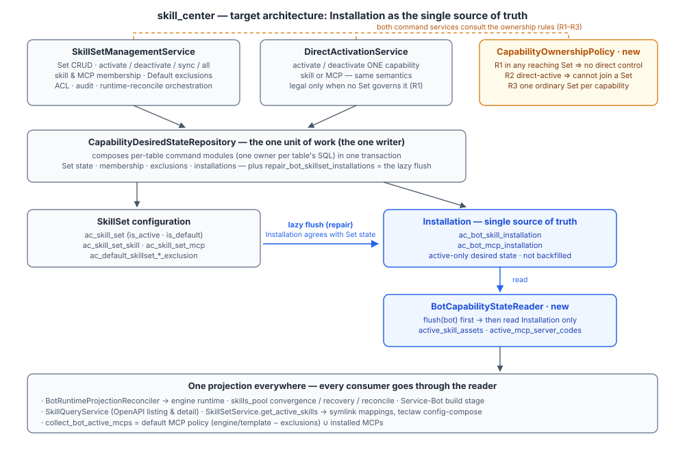

# Plan — Installation as the Single Source of Truth

Paths below are relative to `src/backend/src/agentclaw/community/` unless
noted. Tests live under `src/backend/tests/`.

## Architecture at a glance



Reading order: two symmetric command services (Set-scoped, capability-scoped)
consult one rule book and commit through one unit-of-work repository — the
only writer of activation state; the lazy flush keeps Installation agreeing
with SkillSet configuration; the reader is the only door to "what is active",
and every consumer walks through it.

Principles applied:

- **One writer.** All activation state (Set state, membership, exclusions,
  installations) is written by one UoW repository, invoked by two command
  services.
- **One flush.** The bridge repair is the only algorithm mapping Set
  configuration onto Installation (skills and MCPs). The materializer dies.
- **One reader.** Flush-then-read, nothing else merges membership in memory.
- **One rule book.** `CapabilityOwnershipPolicy` decides R1–R3 for both
  enforcement sites.
- **Skills ≡ MCPs.** Every MCP operation mirrors its skill counterpart —
  same service, same UoW pattern, same policy, same flush treatment.
- **Fewer layers.** `BotSkillAssetService` (dispatch layer) and
  `LocalSkillStateService` (misnamed, parallel write path) dissolve into
  `DirectActivationService` + `SkillQueryService`.

## Renames (naming axis)

| Today | Target | Why |
| --- | --- | --- |
| `SkillSetControlPlaneService` | `SkillSetManagementService` | named by scope: everything done *to a SkillSet* |
| `LocalSkillStateService` | `DirectActivationService` | not "Local" (handles market/repo skills too); parallel to the Set service by scope |
| `SkillSetControlPlaneRepository` (+ protocol, types module) | `CapabilityDesiredStateRepository` | named by aggregate, since both services write through it |
| `BotInstallationReader` (prev. draft) | `BotCapabilityStateReader` | consistent `Capability*` axis |
| `BotSkillAssetService` + `LocalSkillQueryService` | `SkillQueryService` | one query component, one fewer layer |

Error classes (`SkillSetControlPlane*Error`, `LocalSkill*Error`) keep their
names — accepted naming debt to bound the diff (spec F.15).

## Components and contracts

### 1. Domain model (types)

`core/repository/capability_desired_state_types.py` (renamed) — the bridge
gains the MCP half; exclusion semantics change per spec:

```python
@dataclass(frozen=True)
class BotSkillSetBridge:
    """What a Bot's Sets imply for Installation, split by desired state.

    activate  = members of active/Default Sets; deactivate = members only
    inactive claims account for. An excluded Default-Set member is an
    INACTIVE claim (exclusion is the Default Set's per-Bot deactivation),
    and an active claim always wins. ``mcp_activate``/``mcp_deactivate``
    are the identical split for the same Sets' MCP members.
    """
    members: frozenset[int]
    activate: frozenset[int]
    deactivate: frozenset[int]
    mcp_activate: frozenset[str] = frozenset()
    mcp_deactivate: frozenset[str] = frozenset()
```

Unchanged and load-bearing: `SkillSetDesiredState` / `SkillSetMutation`,
`RegisteredSkillAsset`, `RuntimeDesiredState` / `RuntimeProjection`.

### 2. The one writer — `CapabilityDesiredStateRepository`

One unit of work per aggregate. Internally, **each table's SQL has one
owner**: per-table command modules under
`core/repository/implementations/skill_center/tables/` that take the session
as a parameter; the UoW composes them in one transaction. (Session-owning
one-repo-per-table is deliberately rejected: it would reintroduce the
eventual-atomicity bug this UoW exists to prevent — its module docstring
already says so.)

```python
# tables/skill_installations.py — the ONLY code that writes
# ac_bot_skill_installation (mcp_installations.py, default_exclusions.py,
# set_rows.py, set_members.py follow the same shape)
def install(session, *, bot_id, owner_id, env, skill_id) -> bool: ...
def uninstall(session, *, bot_id, owner_id, env, skill_id) -> bool: ...
def installed_ids(session, *, bot_id, owner_id, env) -> set[int]: ...
```

The UoW's command surface (existing commands unchanged unless noted):

```python
class CapabilityDesiredStateRepositoryProtocol(Protocol):
    # Sets & membership (existing): create/get/update/delete_set, set_active,
    # add_skill, remove_skill, add_mcp, remove_mcp, list_*, snapshot/restore.

    # Direct activation — NEW for skills, mirroring the existing MCP pair,
    # so both command services share one write path and one compensation:
    def activate_skill_direct(self, *, bot_id, owner_id, skill_id, engine_type=None) -> SkillSetMutation: ...
    def deactivate_skill_direct(self, *, bot_id, owner_id, skill_id, engine_type=None) -> SkillSetMutation: ...
    # (activate_mcp_direct / deactivate_mcp_direct already exist here.)

    # Default-Set exclusions — NEW commands restoring the dead opt-out
    # (spec E.11): exclusion row + Installation delta in one transaction.
    def exclude_default_skill(self, *, bot_id, owner_id, set_id, skill_id, ...) -> SkillSetMutation: ...
    def unexclude_default_skill(self, *, bot_id, owner_id, set_id, skill_id, ...) -> SkillSetMutation: ...
    def exclude_default_mcp(self, *, bot_id, owner_id, set_id, server_code, ...) -> SkillSetMutation: ...
    def unexclude_default_mcp(self, *, bot_id, owner_id, set_id, server_code, ...) -> SkillSetMutation: ...

    # deactivate-all — NEW (spec C.6): ordinary Sets -> inactive; delete the
    # Bot's skill Installation rows and Set-claimed MCP rows, one txn.
    def deactivate_all_sets(self, *, bot_id, owner_id, engine_type=None) -> SkillSetMutation: ...

    # The lazy flush (existing, extended to MCPs; excluded members are
    # inactive claims):
    def repair_bot_skillset_installations(self, *, bot_id, owner_id, env, ...) -> BotSkillSetBridge: ...
```

`SkillInstallationRepository` (separate session-owning writer of the same
table) is deleted; its callers move to the UoW commands or the reader.

### 3. The reader — `BotCapabilityStateReader` (new)

Protocol in `api/bot_capability_state_reader.py`, implementation in
`core/skill_center/services/bot_capability_state_reader.py`:

```python
class BotCapabilityStateReaderProtocol(Protocol):
    """The one read model for a Bot's active capabilities.

    Installation is the single source of truth; the tables are not
    backfilled, so every read first flushes SkillSet configuration into
    Installation, then answers from Installation alone.
    """

    def flush(self, *, bot: Mapping[str, Any]) -> BotSkillSetBridge:
        """Reconcile Installation with SkillSet configuration for one Bot."""

    def active_skill_assets(
        self, *, bot_id: str, owner_id: str,
        bot: Mapping[str, Any] | None = None,
    ) -> tuple[RegisteredSkillAsset, ...]:
        """Flush, then read ac_bot_skill_installation joined to ac_skill."""

    def active_mcp_server_codes(
        self, *, bot_id: str, owner_id: str,
        bot: Mapping[str, Any] | None = None,
    ) -> frozenset[str]:
        """Flush, then read ac_bot_mcp_installation."""
```

Engine scope from the Bot row via `bot_engine_scope` (layout-engine-first
Default-Set precedence); `bot` omitted → loaded via
`bot_repo.get_by_id_and_owner`, missing Bot raises `LocalSkillNotFoundError`.

Backing read: `SkillRepository.list_bot_active_assets` loses its merge and
becomes a pure Installation→`ac_skill` join, renamed
`list_bot_installed_assets`; after migration its only caller is the reader.

Migrated consumers (all previous merge-readers): the reconciler (snapshot +
plan), the direct-activation name-conflict guard,
`skills_pool/{mapping_convergence,recovery_service,reconcile_service,
active_aicoding_bridge_repair}.py`, Service-Bot `publish_flow/build_stage.py`,
plus `SkillQueryService` (listing/detail) via `reader.flush`.

### 4. The rule book — `CapabilityOwnershipPolicy` (new)

`core/skill_center/policies/capability_ownership.py` — pure decisions over
caller-supplied facts; enforcement sites keep raising their existing errors.
R1 is simpler than the earlier draft: **exclusion is not an escape hatch**,
so no exclusion lookup exists here at all.

```python
"""The one authority for who controls a capability's activation state.

R1 — Set-managed, no direct control. A capability that is a member of ANY
     Set reaching the Bot — the Default Set included, excluded or not — is
     activated/deactivated only through Set-level operations (activate/
     deactivate the Set; exclude/un-exclude for Default-Set members).
R2 — Deactivate before joining. A capability holding a direct Installation
     row cannot be added to a Set (checked before R3 — today's precedence).
R3 — One ordinary Set per capability.
Identical for skills and MCPs.
"""

def skill_set_reaches_bot(skill_set, *, bot_id, owner_id,
                          engine_type, default_engine_types) -> bool:
    """Whether a Set governs this Bot's capabilities (moved verbatim from
    local_skill_state_service)."""

def governing_set(
    *, referencing_sets: Sequence[Mapping[str, Any]],
    bot_id: str, owner_id: str,
    engine_type: str | None, default_engine_types: tuple[str, ...],
) -> Mapping[str, Any] | None:
    """R1: the Set that owns this capability's state, or None = directly
    controllable."""

def membership_conflict(
    *, directly_installed: bool, held_by_other_ordinary_set: bool,
) -> str | None:
    """R2 + R3: 'RESOURCE_DIRECT_ACTIVE' |
    'RESOURCE_ALREADY_IN_ANOTHER_SKILL_SET' | None."""
```

Enforcement sites:

| Site | Rule | Change |
| --- | --- | --- |
| `DirectActivationService` (skills) | R1 | two near-copy guards collapse into one `governing_set` call; **excluded members now refused too** |
| `DirectActivationService` (MCPs) | R1 | gains the Default-Set half it misses today (spec D.10) |
| UoW `add_skill` / `add_mcp` | R2+R3 | inline checks become facts → `membership_conflict` |

### 5. Command service A — `SkillSetManagementService` (renamed)

Everything done *to a SkillSet*. Existing shape (ACL via `_bot`, one UoW
mutation, one reconcile with compensating restore) is kept; additions:

```python
class SkillSetManagementService:
    # existing: list/create/get/update/delete set, list_skills/list_mcps,
    # add_skill/remove_skill, add_mcp/remove_mcp, activate/deactivate/sync,
    # resources, mcp_permissions, request_mcp_permissions

    async def deactivate_all(self, *, bot_id, owner_id, user_id) -> dict:
        """Converge the Bot to Default-Set capabilities only — the canonical
        /api/skills/deactivate-all."""

    # Default-Set opt-out, restored (spec E.11). Wire mapping keeps the
    # historical routes: remove_skill/remove_mcp on the Default Set now
    # performs the exclusion instead of raising; add_skill/add_mcp on the
    # Default Set removes an existing exclusion, else SYSTEM_DEFAULT_IMMUTABLE.
```

MCP *direct* activation moves out of this service into
`DirectActivationService` (spec F.12) — the OpenAPI MCP router's injection
changes, routes stay put.

### 6. Command service B — `DirectActivationService` (new; absorbs `LocalSkillStateService`)

```python
class DirectActivationService:
    """Activate/deactivate ONE capability (skill or MCP) for a Bot, directly.
    Legal only when no Set governs it (Policy R1). Same authorization, same
    UoW write, same compensation as the Set service — one pattern, two scopes.
    """

    async def set_skill_active(
        self, *, skill_id: str, bot_id: str, owner_id: str,
        actor_id: str, active: bool,
    ) -> dict[str, Any]:
        """Resolve the asset (local rows carry their own Bot/owner; shared
        repo assets take the addressed Bot/owner), authorize (owner or MEMBER
        collaborator), enforce R1 and the runtime-name-conflict guard, then
        UoW activate/deactivate_skill_direct + reconcile."""

    async def set_mcp_active(
        self, *, server_code: str, bot_id: str, owner_id: str,
        actor_id: str, active: bool,
    ) -> dict[str, Any]:
        """Identical semantics for MCPs (moved from the Set service)."""
```

The mutate-then-reconcile-with-compensation orchestration is extracted from
today's `SkillSetControlPlaneService._mutate/_reconcile` into one internal
helper shared by both command services (a module-private class, not a new
public layer), replacing `LocalSkillStateService`'s hand-rolled rollback.

### 7. The query side — `SkillQueryService` (merges `LocalSkillQueryService` + `BotSkillAssetService` reads)

```python
class SkillQueryService:
    """Answer questions about a Bot's skills. No activation writes.

    list_bot_skills(...)      # paging; reader.flush first (active is a filter)
    get_skill(...)            # detail; active from Installation after flush
    get_content(...)          # SKILL.md via device/repo storage
    get_parameters(...) / replace_parameters(...)   # delegate to the existing
                              # parameter service (the one non-read, kept here
                              # so routers keep a single seam)
    resolve_legacy_skill_id(...)                    # legacy wire references
    """
```

`BotSkillAssetService` is deleted: its `set_active` dispatch goes to
`DirectActivationService`; the OpenAPI skills router, the legacy internal
activate/deactivate routes, `deprecated/skills.py`, and
`service_publication_facade.py` re-point to the two new seams.

### 8. Legacy `SkillSetService` (BFF facade) — delegations only

`get_active_skills` delegates to the reader (dict keys preserved: `id`,
`name`, `git_path`, `skill_uuid`, `sc_version_number`) — symlink mappings and
teclaw compose converge with zero call-site edits. `collect_bot_active_mcps`
keeps its `BotMCPProvider` signature and becomes the one MCP union:

```python
def collect_bot_active_mcps(self, entity_id, bot_id, user_id,
                            entity_type="staff", engine_type=None) -> list[dict]:
    """default policy ∪ installed.
    1. Default-Set projection (unchanged helpers): static engine/template
       defaults + Default-Set rows − exclusions.
    2. reader.active_mcp_server_codes(...) — flushes, then installed codes.
    3. Entries for installed codes not already present, metadata from the
       Bot's ac_skill_set_mcp rows when available, else minimal entry.
    Stops iterating active ordinary Sets."""
```

### 9. Runtime projection — `BotRuntimeProjectionReconciler` (existing)

Inputs come from the reader (assets, installed MCP codes) and the converged
`collect_bot_active_mcps`; structure and `RuntimeProjectionResolver` are
untouched. Assets now follow `bot_default_engine_types` Default-Set
precedence (spec H.18).

## Work items (→ task groups)

1. **Renames** — the table above: files, classes, protocols, DI, tests;
   zero behavior change.
2. **Flush** — bridge MCP fields; excluded Default-Set members become
   inactive claims; retire the materializer.
3. **Reader** — protocol + impl + DI; repurpose the repository read; migrate
   all merge-readers; bypass-grep guard.
4. **Symlink/compose convergence** — `get_active_skills` delegation.
5. **MCP union** — `collect_bot_active_mcps`.
6. **Ownership policy** — extract R1–R3; collapse duplicate guards.
7. **DirectActivationService** — absorb `LocalSkillStateService`; move MCP
   direct commands; skill-direct UoW commands; per-table installation
   modules; delete `SkillInstallationRepository`; shared mutate helper.
8. **Exclusion commands** — UoW exclusion commands + Default-Set
   remove/add wire mapping + parity tests.
9. **Legacy writer retirement** — `deactivate_all`; `/skillset/current`
   from `list_sets`; delete Activator/Switcher; delete the dead data-init
   step mechanically.
10. **SkillQueryService** — merge, dissolve `BotSkillAssetService`,
    flush-consistent detail.
11. **Dead code + docs** — verified deletions; README context boundary;
    adapter CLAUDE.md.
12. **Full validation.**

## Risks and mitigations

- **Excluded-member semantics change** (rows deleted by the flush; direct
  control refused): supersedes the 2026-08-23 decision at the domain owner's
  direction; the listing spec's pinning tests are updated deliberately, and
  the new exclusion commands land in the same change so the opt-out story is
  whole.
- **Flush on more paths**: the repair's read-only fast path keeps steady
  state cheap; watch singlebox E2E timings.
- **Rename fallout**: Group 1 is pure renames validated by the full suite
  before any behavior change lands.
- **Default-Set engine precedence** (layout-engine-first) pinned by a
  reconciler test.
- **Error-precedence compatibility** (R2 before R3) encoded in
  `membership_conflict` and pinned by tests.
- **Deletion fallout**: every deletion lands with the migration of its last
  caller.

## Validation

Per work item: the focused pytest files named in tasks.md. Before push:

```bash
cd src/backend
uv run pytest tests/community/core/skill_center tests/community/repository/skill_center \
  tests/community/services tests/community/contracts \
  tests/community/adapters/http/skill_center \
  tests/community/adapters/http/openapi_v1/test_skills_endpoints.py \
  tests/community/adapters/http/openapi_v1/test_skill_sets_endpoints.py \
  tests/community/adapters/http/openapi_v1/test_mcp_endpoints.py \
  tests/community/adapters/http/openapi_v1/test_skills_contract.py
uv run pytest tests/community   # full community suite
```

plus the repo's pre-push SAST/lint gate (`scripts/ci/python_sast_local.sh`).
Anything not runnable in the environment is reported explicitly in the PR's
Validation section.
