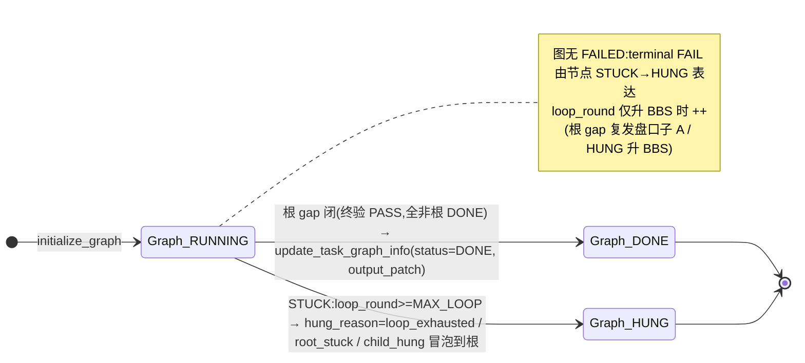

# core/task — 任务目标驱动执行框架

基于任务目标(Goal + Acceptance)驱动的任务动态规划执行框架;跨 单 Bot / 协作群 / BBS 三模态自驱跑完「理解 → 规划 → 派发 → 执行 → 验收 → 重规划」闭环。

> 权威源(冲突时以此为准):
> - 设计三件套:`src/backend/specs/2026-08-09-task-goal-driven-execution-framework/{plan,spec,tasks}.md`

## 四层目录结构(对齐 `docs/arch/arch.rules.md §8`)

| 层 | 路径 | 职责 |
|---|---|---|
| api/ | `community/api/task/` | 对外 Service API Protocols(transport-agnostic) |
| core/ | `community/core/task/` | 业务实现(transport-agnostic,禁 transport import) |
| adapters/http/ | `community/adapters/http/task/`(内部:execute/dashboard/list 公开面镜像 + callback-report/bbs 接力/discovery,前缀 `/api/v1/collaboration/tasks`,不经 spanner)+ `community/adapters/http/openapi_v1/task/`(前端公开面:execute/dashboard/list,前缀 `/openapi/v1/collaboration/tasks`,经 gateway spanner) | HTTP transport(thin:router+schema,不持 domain policy) |
| di/modules/ | `community/di/modules/task_module.py` | composition root(DI 接线) |

## core/task/ 目录树

```text
core/task/
├── README.md
├── domain/                        # TaskSpec/TaskNode/Graph 等共享领域模型
├── task_center/                   # TaskService facade 与双模式入口
├── task_plan/                     # TaskPlanner + static_plan.py 统一领域定义/Runtime
├── task_dispatch/                 # TaskDispatcher + query-only TaskSearch
├── task_runner/                   # TaskRunner、模式 Adapter、语义事件分发与回投适配
├── task_context/                  # 统一 TaskGraphService + TaskContext 投影 + TaskTrajectoryService
│   ├── task_graph_service.py      # 唯一公开图谱领域服务与事实入口
│   └── task_graph_support.py      # 私有 report/状态策略/查询/TaskContext 投影函数
├── task_harness/                  # TaskHarness 重试、超时、恢复与 redrive
└── task_discovery/                # Bot 候选发现与会话创建
```

## 节点状态机流转(6 节点态 + 图态;双机实现于 TaskGraphService)

节点态:`PENDING` / `PLANNING` / `RUNNING` / `DONE` / `FAILED` / `HUNG`;图态:`RUNNING` / `DONE` / `HUNG`。

- `_ACCEPTANCE_TRANSITIONS`(唯一终态翻转依据 = `TaskNodePatch.acceptance_result`,skill 回投):`RUNNING→{DONE,FAILED}`。
- `_DIRECT_TRANSITIONS`(框架内部 status 直驱:派发/复位/传播/HUNG):见下图合法边。
- `_DELEGATABLE_PARENT={PENDING,FAILED,PLANNING}`:`add_task_nodes` 侧向改结构时,父可被委托进 `PLANNING`。
- **语义解耦**:`PLANNING`=规划中(显式委托态,等子完成/gap 重算);`RUNNING`=真执行叶子(`single_bot`/`coop_group`/`bbs`)。规划出子的父永不为 `RUNNING`,始终 `PLANNING`。

```mermaid
stateDiagram-v2
    direction TB

    [*] --> PENDING : initialize_graph(根 PENDING;图=RUNNING)

    PENDING --> RUNNING : 派发命中 + start_run 成功
    note on transition
      派发命中先填 run_mode/assignee + 置 dispatching 飞行态,
      _drain 等 start_run 成功才翻 RUNNING 并清 dispatching
    end note
    PENDING --> PLANNING : add_task_nodes 委托为结构父(父→PLANNING) / on_miss(depth<MAX → plan 拆细)
    PENDING --> HUNG : on_miss(depth>=MAX 拆不动,连续 MISS)

    PLANNING --> DONE : 子全 DONE + plan 返 [](gap 闭)→ 传播治愈(非根) / 根 gap 闭 → 图 DONE
    PLANNING --> HUNG : on_miss(depth>=MAX 拆不出子) / gap_no_progress(有 gap 拆不出)
    PLANNING --> PLANNING : 新子 add_task_nodes(父维持委托态)

    RUNNING --> DONE : 回投 verdict=DONE(_on_pass_collect)
    RUNNING --> FAILED : 回投 verdict=FAILED+gaps(_on_fail_collect)
    RUNNING --> PENDING : Harness 复位(超时/崩溃/exec_error _on_harness_collect)
    RUNNING --> HUNG : Harness 重试达 MAX_HARNESS

    FAILED --> PENDING : Harness 重新派发执行(re-dispatch 不拆; <MAX_HARNESS)
    FAILED --> HUNG : Harness 重试达 MAX_HARNESS(→ 升 BBS:loop_round++ + bbs_mode)
    FAILED --> PLANNING : 条件 b 补救(经 add_task_nodes 委托;_DELEGATABLE_PARENT 含 FAILED)

    DONE --> [*] : 终态(成功)
    HUNG --> [*] : 终态(STUCK:人介入)

    note right of PENDING
        派发四态(dispatch 返回):
          HIT_SINGLE → 单 bot
          HIT_MULTI_BOTS → 拉协作群 LOOP
          MISS → on_miss 拆子(深度闸门)
          dispatch_fail → 标 dispatch_error 留 PENDING 待 harness
        PENDING 超时(派发无响应/推理失败/派发失败)
          → harness 按 PENDING_TIMEOUT(180s) 重试搜推
    end note

    note right of PLANNING
        委托态:子执行中 / gap 重算中
        等本批兄弟全 DONE 才触发父 plan(决策C)
        父恒 PLANNING,无需翻态(add 不走 RUNNING)
    end note

    note right of RUNNING
        只给真正派发执行的叶子:
          single_bot / coop_group / bbs
        on_start: PENDING→RUNNING(幂等纯翻态)
        执行报错(exec_error) ≠ 验收不过(FAIL+gaps):
          报错 → harness 复位重投(计数)
          验收不过 → FAILED → harness 重派重试
    end note

    note right of HUNG
        终态传播冒泡:_maybe_propagate_hung
        父的子全终态且含 HUNG → 父 HUNG → 上行
        到根 → 图 HUNG(root_stuck)
        升 BBS = loop_round++ + bbs_mode(节点保留不 remove)
    end note
```

**图态流转:**



**驱动源 → 状态推进映射:**

| 驱动源 | 入口 | 触发条件 | 状态推进 |
|---|---|---|---|
| `TaskService.execute` | `PLAN_REQUESTED` → `CentralizedExecutionAdapter` | 条件 a:根 PENDING | Graph 持久化计划事件→Planner→产生 `DISPATCH_REQUESTED`→兼容派发执行 |
| skill 回投 PASS | `on_report`(→`_on_pass_collect`) | 子 DONE | 父 plan:有子→add+dispatch;gap 闭→传播 DONE 上行/根→图 DONE |
| skill 回投 FAIL+gaps | `on_report`(→`_on_fail_collect`) | 叶验收不过 | 叶→FAILED,等 harness 重派重试(不立即拆) |
| skill 回投 exec_error | `on_report`(→`_on_harness_collect`) | bot 没跑通 | RUNNING/FAILED→PENDING 复位重投;达 MAX_HARNESS→HUNG 升 BBS |
| dispatcher MISS | `on_miss` | 搜推未匹配执行者 | depth<MAX→plan 拆子;depth>=MAX→HUNG 升 BBS |
| `on_start` 回调 | `on_start` | 投递开始 | PENDING→RUNNING(幂等纯翻态,不触发传播) |
| TaskHarness 巡检 | `on_harness` | 超时/崩溃/FAILED | 复位重投;达 MAX_HARNESS→HUNG 升 BBS;PENDING 派发卡 180s→重搜推 |

## 协程化约束(任务执行是耗时任务;对齐 backend lifecycle async 模式)

任务执行(投递单 bot workflow / BCS 拉群 / BBS 广场)是网络 IO 耗时操作,编排核全链路 **`async def`**,耗时 IO 不阻塞事件循环、不阻塞编排核。

### 全链路 async 签名

| 方法 | 所在类 | 签名 |
|---|---|---|
| `on_execute` / `on_report` / `on_miss` / `on_harness` | `CentralizedExecutionAdapter` | `async def` |
| `start_run` / `form_coop_group` | `TaskRunner` | `async def` |
| `deliver` | `DeliveryPort`(Protocol) | `async def deliver(node) -> bool` |
| `report_result` / `start_run` | `TaskLoopCallback` | `async def` |
| `execute` | `TaskService` facade | `async def`(内部 `await engine.on_execute`) |
| `plan` | `TaskPlanner` | `async def`(内部 `await strategy.matches/apply`) |
| `dispatch` | `TaskDispatcher` | `async def`(内部 `await strategy.matches/apply`) |
| `matches` / `apply` | `PlanningStrategy` / `DispatchStrategy` Protocol | `async def`(corp 为 LLM/catalog 耗时 IO) |

> `plan`/`dispatch`/策略 `apply` 在 corp 是 LLM 规划 / bot catalog 搜推(耗时 IO),亦 `async`,在锁内 `await`。

### 锁内 await 边界(collect / drain 模式)

- per-task `threading.RLock` 保护锁内编排写:`TaskGraphService` 内存同步快操作(graph patch、add_task_nodes)+ `await plan/dispatch`(同 task 串行推进的耗时 IO,设计意图)。
- **锁内不 `await` 的是高并发外部投递 IO**(`start_run`/BCS 拉群 `form_coop_group`/`deliver`)——这些 `await` 在锁外。
- **collect / drain 模式**:`on_*` 锁内 `async collect`(`await plan/dispatch` + 同步 add/patch,产 side-effects list)→ 锁外 `_drain` 统一 `await` 执行 run/group/miss/finish(投递 IO),保证投递 IO 全锁外。
- 跨 task 并行;同 task_id 编排串行(锁内);投递/拉群 IO 不受锁约束(锁外 await,可并发)。
- **锁选型**:`threading.RLock` 适用本仓一次性事件循环 / 跨线程回调模型(跨线程正确串行)。若 corp 采用单持久 event loop 并发处理同 task 多回投(如 FastAPI async 端点),同 loop 协程重入会穿透 RLock,需切 `asyncio.Lock`(ocb 仓接入时定)。

### 投递并发下沉 runner

- 多节点投递并发:`asyncio.gather` + `asyncio.Semaphore(_DELIVER_CONCURRENCY=8)` **下沉 `TaskRunner.start_run` 内部**(投递是 runner 职责;engine 批量调 `start_run`,不持锁内拆单节点)。
- 对齐 backend `desktop_bot/lifecycle.py` 的 `_check_one_bot` Semaphore 限流模式,防多节点投递雪崩。

### BCS Bot 身份边界

- 任务领域只保存产品 Bot ID:`SearchResult.bot_id`/`GroupFormation.bot_ids`/单 Bot `assignee` 不保存 BCS UUID。
- 动态拉群在 `TaskExecutor.form_coop_group` 的 BCS integration 边界,经内部 `BcsBotIdentityResolver` 查询 BotService 权威 `owner_id`,转换为 ``{product_bot_id}:{owner_id}``。
- BCS 请求的 `driver_bot`/`originator`/`participants[].bot_uuid`/manager-worker/`participant_bindings[*].bot_ids` 使用 BCS UUID。
- state-machine `participant_bindings` 的 key 是 workflow YAML 逻辑 binding 名;不得以 Bot ID 作为 binding key。workflow binding 与 BCS ParticipantRole 分离,`participants[].role` 只使用 BCS 合法角色。

### 执行结果与 SLA 契约

- worker 最终结果严格为 `{"success":bool,"data":Any,"gaps":list[str]}`:PASS 的 `gaps=[]`;FAIL 的 `gaps` 必须非空。旧 `fail_detail` 仅作过渡兼容并归一成单 gap。
- 空内容、非法 JSON、缺 `success`、`success` 非 bool、FAIL 无 gaps 均转 `exec_error=terminal_result_invalid`,进入 Harness;不得默认 PASS。
- `TaskExecutorResultPoller` 是 worker fire-and-poll 业务 SLA 的唯一所有者。SLA 超时/连续轮询失败属于执行异常(`exec_error`),不是验收 FAIL。
- Poller 超时后 best-effort `cancel_run`;Singlebox 真实取消后台 WebSocket collector。Singlebox Adapter 仅保留连接/握手/send ACK 等传输超时,不再用更短业务超时提前截断 Bot。

### graph 与 harness

- `TaskGraphService` **保持同步**(内存快;`to_thread` 隔离语义留 corp DB 适配,本轮不动)。
- `TaskHarness` 后台 `threading` 巡检线程无事件循环:调 async `on_harness` 时经 `asyncio.iscoroutine` 判定起短命 `asyncio.run`(兼容同步 stub,低频旁路)。

### 测试规约

- 单测经 `asyncio.new_event_loop().run_until_complete(coro)` 驱动 async 编排方法 helper,**不用 `@pytest.mark.asyncio`**(对齐本仓现有测试约定)。
- 真实投递/seam 经 `run_until_complete` 驱动;sync stub runner 仍可被 `await`(返非 coroutine 协程兼容由 `iscoroutine` 兜底,harness 用)。

## 2026-09-10 双编排边界

当前任务模块同时支持中心化规划执行和分布式 Relay 接力，目标契约以
`src/backend/specs/2026-09-10-task-module-boundary-and-strategy-extensibility/`
为准。

共同边界：

- `TaskGraphService` 是唯一图谱领域服务；中心化与 Relay 不再通过 Mixin、monkey patch 或模式专用 Graph 类扩展它。
- `task_graph_support.py` 仅承载私有 report、状态策略、查询和 TaskContext 投影函数，不构成第二套领域对象。
- `TaskSpec` 只保存 `context + goal`；`task_id` 属于任务/节点实体，执行指令由业务事实按需投影。
- `TaskGraphService.report(...)` 是 Planner、Dispatcher、Runner、Harness、BBS 和 Relay 写入图谱事实的统一入口。
- `GET /api/v1/collaboration/tasks/{task_id}/context` 返回通用
  `TaskContext(spec, all_done_output, gaps)`。
- `/search` 只检索候选；`DISPATCH_RESULT` 记录决策；`/dispatch` 执行实际投递。
- `TaskRuntimeProfile` 在建图时冻结策略名和允许的执行模态。

模式差异：

- 中心化模式已由 Graph 语义事件启动：`PLAN_REQUESTED → DISPATCH_REQUESTED`。规划、派发、投递、结果收敛、恢复和轨迹分别归属 `TaskPlanner`、`TaskDispatcher`、`TaskRunner`、`TaskGraphService`、`TaskHarness` 与 `TaskTrajectoryService`；`static_plan.py` 只保留 Static Plan 定义和纯 Runtime，Static Plan 的编排动作归还上述现有模块；`CentralizedExecutionAdapter` 仅保留模式路由、端口装配和兼容事件入口。
- Relay 模式由当前 Bot 的 task-loop Skill 计算能力范围和 GAP；每次 `PLAN_RESULT` 最多创建一个下一棒，Graph 生成节点 ID，后续节点不回写前序节点运行事实。
- Relay Runner 指令只注入 `EXECUTION_RESULT → PLAN_RESULT → /search → DISPATCH_RESULT → /dispatch/BBS` 事件协议；Relay 任务拒绝中心化 `status/output/acceptance_result` 节点终态回投，避免错误协议把节点推成一次性终态。
- Relay BBS 是目标节点级认领；认领 Bot 执行同一 Relay 闭环，不进入中心化根节点收敛。

## 中心化语义事件驱动迁移

当前动态中心化任务的首轮入口为：

```text
TaskService.execute
  → TaskGraphService.emit_semantic_event(PLAN_REQUESTED)
  → TaskSemanticEventDispatcher
  → CentralizedExecutionAdapter.handle_plan_requested
  → Graph.emit_semantic_event(DISPATCH_REQUESTED)
  → CentralizedExecutionAdapter.handle_dispatch_requested
  → 现有 TaskRunner.start_run/form_coop_group
```

语义事件记录持久化在 Graph 的 `_semantic_outbox` 中，并支持 pending/acked 状态。
`handle_dispatch_requested` 通过 `TaskDispatcher._prepare_into` 与 `TaskRunner._drain` 完成派发准备和锁外投递；不再引入 `Centralized*Handler`，也不再使用多继承拼装中心化执行链路。
