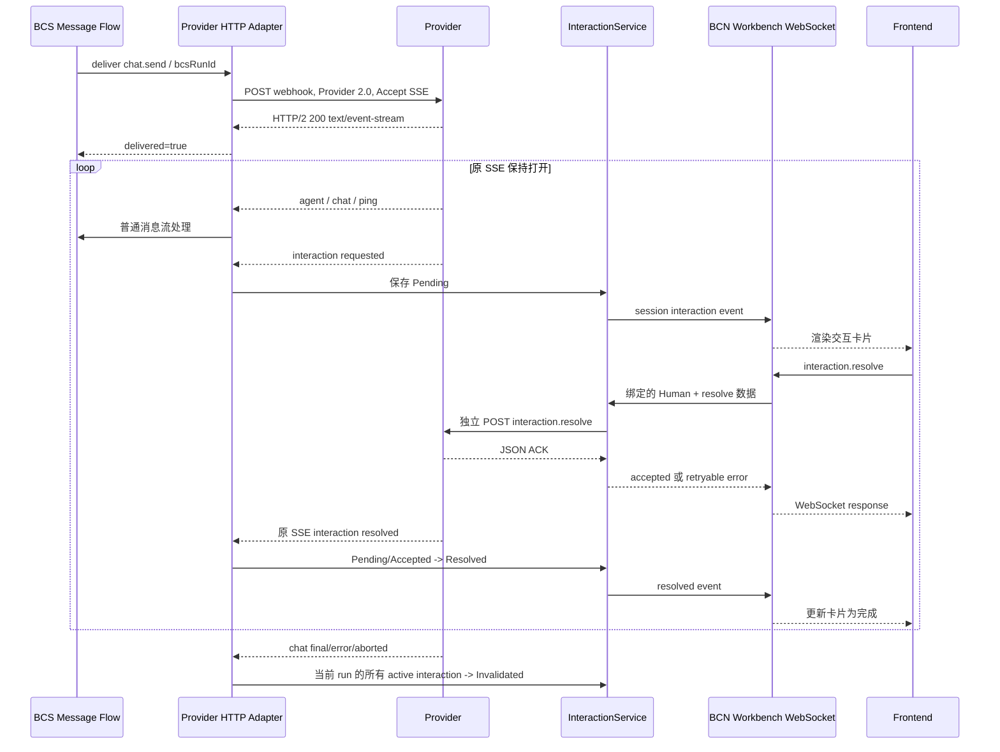
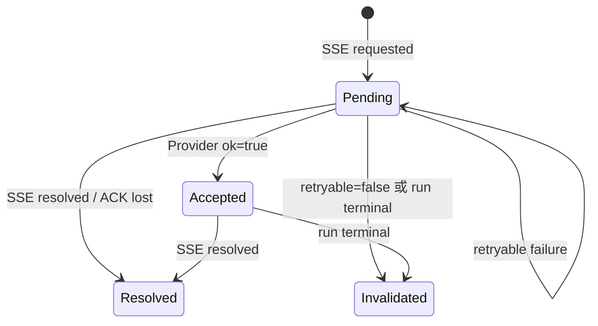

# BCS Provider 2.0 SSE 通信协议

本文定义 Provider 2.0 的 SSE 下行协议、BCN 与 Frontend 的 WebSocket
交互协议，以及人工交互（HITL）的 resolve 回程协议。

状态说明：

- `agent`、`chat`、`ping`：线上已实现。
- 顶层 `interaction`、BCN 内存状态机、Frontend WebSocket
  `interaction.resolve`、BCN 到 Provider 的 resolve HTTP：本分支已实现。
- Frontend 卡片渲染、Provider/BAAS 到具体 Agent 引擎的转换：待对应团队实现，不在
  本次 BCS 代码范围内。
- 旧 `event: agent + stream: approval` 仅保留兼容解析，不能用于新接入。

## 1. SSE 通信模式

BCS 通过一次 HTTP `POST method=chat.send` 发起 run。Provider 将该请求的
response 保持为 SSE，在同一连接、同一 run 上连续返回 `agent`、`chat`、
`ping` 和 `interaction`，直到 `chat/final`、`chat/error` 或
`chat/aborted`。



### 1.1 BCS 到 Provider 的起始请求

```http
POST <provider.webhook_url> HTTP/2
Authorization: Bearer <bcs_to_provider_token>
Content-Type: application/json; charset=utf-8
Accept: text/event-stream, application/json
X-BCN-Protocol-Version: 2.0
X-BCN-Transport: sse
X-BCN-Message-Id: <UUID>
X-BCN-Timestamp: <毫秒时间戳>
```

```json
{
  "type": "req",
  "id": "bcs-run-1",
  "method": "chat.send",
  "session_id": "group-1:session-1",
  "bcn_group_id": "group-1",
  "to_bot": {
    "provider_id": "provider-1",
    "provider_bot_ref": "provider-bot-1"
  },
  "from": {
    "kind": "bot",
    "name": "sender-bot",
    "actor_id": "sender-bot-id"
  },
  "message": {
    "role": "user",
    "content": [{"type": "text", "text": "请分析这个问题"}],
    "timestamp": 1786260000000
  },
  "timeout_ms": 3600000
}
```

约束：

- `method=chat.send` 才进入 SSE；`id` 必须等于 BCS `run_id`。
- SSE 正式连接使用 HTTP/2；response 必须是 `text/event-stream`。
- response headers 最长等待 125 秒。连接建立后没有 HTTP total/read timeout，
  但 run 仍受 `deadline_ms` 约束。
- 连续 15 分钟没有收到任何字节触发 idle timeout。
- 等待下一段字节的时间同时受 run deadline 限制；`ping` 或 comment heartbeat
  不能把连接延长到 deadline 之后。
- 单个 SSE 帧（包括未遇到空行的累计 buffer）最大 8 MiB；超过后关闭 run 并合成
  terminal error，避免异常 Provider 无界占用内存。
- Provider 返回 JSON 时沿用原 callback fallback，不创建 SSE。

### 1.2 SSE 帧、JSON 序列化和反序列化

```http
event: <agent|chat|ping|interaction>
id: <可选数字>
data: <JSON>

```

SSE 通用帧本身不是 JSON；它是 `text/event-stream` 文本格式。只有 `data:`
中的业务对象使用 JSON。

Provider 将业务对象编码为 UTF-8 JSON，推荐单行紧凑格式；在前面添加
`event:`、可选 `id:` 和 `data:`，最后用空行结束一帧。BCS 先按 SSE 语法
拆帧，多行 `data:` 以换行连接，再对完整 `data` 做 JSON 反序列化。
非法 UTF-8、非法 JSON 或已知事件结构不匹配的帧不会进入业务处理。

公共字段：

| 字段 | 要求 | 说明 |
| --- | --- | --- |
| SSE `event` | 必填 | `agent`、`chat`、`ping`、`interaction` |
| SSE `id` | 可选 | 当前不用于去重、重连或断点续传 |
| `data.runId` | 除 ping 外必填 | Provider/Engine run ID；不是 BCS 路由依据 |
| `data.seq` | interaction 必填，其他应提供 | 同一 SSE 内跨 `agent/chat/interaction` 单调递增 |
| `data.ts` | 推荐 | Provider 事件毫秒时间戳 |
| `data.sessionKey` | 可选 | Provider 内部 session；不是 BCN session 权限依据 |

BCS 使用发起请求时保存的 `bcsRunId`、`bcsSessionId` 和 Provider target；
不信任 SSE `runId/sessionKey` 作为 BCS 路由信息。

### 1.3 顺序、心跳和终结

- `seq <= last_seq`：BCS 丢弃；seq gap：告警并继续；普通事件无 `seq` 时接受但无法
  去重；`interaction` 无 `seq` 时按坏帧丢弃。
- `agent`、`chat`、`interaction` 共用一套 seq。
- `chat final/error/aborted` 是 terminal；terminal 后 Provider 不应再发送事件。
- EOF、读取失败或 idle timeout 前没有 terminal，BCS 合成 `chat/error`。
- 当前没有 `Last-Event-ID`、自动重连或断点续传。

`ping` 是可观测的业务心跳：

```http
event: ping
data: {"ts":1786260000000}

```

SSE comment heartbeat 是纯传输保活：

```http
: heartbeat

```

二者都能避免 idle timeout，且都不进入聊天消息流。区别是 `ping` 会经过事件
解析并可记录 `ts`；comment 会被 SSE decoder 忽略，不占业务 seq，也通常不出现在
业务事件日志中。只需要连接保活时优先 comment；需要心跳可观测性时使用 `ping`。

## 2. SSE 事件类型总览

| event | 子事件判别字段 | 是否 terminal | BCS 状态 |
| --- | --- | --- | --- |
| `agent` | `stream=tool/thinking/lifecycle/phase` | 否 | 已实现 |
| `agent` | `stream=approval` | 旧兼容结构 | 不支持新 HITL；不要发送 |
| `chat` | `state=delta/final/error/aborted` | 后三者是 | 已实现 |
| `ping` | 无子事件 | 否 | 已实现 |
| `interaction` | `phase=requested/resolved` + `kind` | 否 | BCS 已实现 |

## 3. chat 事件

### 3.1 delta

```http
event: chat
data: {"runId":"provider-run-1","seq":1,"ts":1786260000000,"state":"delta","deltaText":"正在分析"}

```

`deltaText` 是本次文本增量，事件不是 terminal。

### 3.2 final

```json
{
  "runId": "provider-run-1",
  "seq": 5,
  "ts": 1786260001000,
  "state": "final",
  "message": {
    "role": "assistant",
    "content": [{"type": "text", "text": "最终答案"}],
    "timestamp": 1786260001000
  },
  "stopReason": "completed"
}
```

`stopReason` 可选。收到后 BCS 标记 run terminal 并关闭 SSE。

### 3.3 error

```json
{
  "runId": "provider-run-1",
  "seq": 5,
  "ts": 1786260001000,
  "state": "error",
  "errorMessage": "run terminated with status FAILED",
  "errorKind": "runtime_error"
}
```

`errorKind` 和 `message` 可选。没有合法 `message.content[].text` 时，BCS 尝试
用 `errorMessage` 补成 assistant message。

### 3.4 aborted

```http
event: chat
data: {"runId":"provider-run-1","seq":5,"ts":1786260001000,"state":"aborted","stopReason":"user_cancelled"}

```

`aborted` 表示 run 被取消。它会终结 run，并使该 run 上所有 `Pending` 或
`Accepted` interaction 失效；不会把 interaction 重新解释为某个用户 decision。

## 4. agent 事件

`agent` 使用平铺 JSON；`stream` 和子事件字段直接位于 `data` 顶层。

### 4.1 tool

开始：

```json
{"runId":"provider-run-1","seq":2,"stream":"tool","phase":"start","name":"search","toolCallId":"tc-1","args":{"query":"BCS"}}
```

增量更新：

```json
{"runId":"provider-run-1","seq":3,"stream":"tool","phase":"update","name":"search","toolCallId":"tc-1","partialResult":{"progress":50}}
```

结果：

```json
{"runId":"provider-run-1","seq":4,"stream":"tool","phase":"result","name":"search","toolCallId":"tc-1","result":{"content":[{"type":"text","text":"搜索结果"}]},"isError":false,"exitCode":0,"durationMs":120,"cwd":"/workspace"}
```

`start/update/result` 分别映射 BCS 的 `ToolCallStart/Delta/ToolCallEnd`。
`toolCallId` 关联一次工具调用；它不等于 HITL `interactionId`，也不能替代后者。

### 4.2 thinking

```json
{"runId":"provider-run-1","seq":2,"stream":"thinking","delta":"本次增量","text":"累计思考文本"}
```

`delta` 和 `text` 分别表示本次增量和可选累计文本。

### 4.3 lifecycle

```json
{"runId":"provider-run-1","seq":1,"stream":"lifecycle","phase":"start","model":"model-name","agentMode":"plan"}
```

`phase` 支持 `start/end`；`model`、`agentMode` 可选。

### 4.4 phase

```json
{"runId":"provider-run-1","seq":6,"stream":"phase","fromPhase":"planning","toPhase":"executing"}
```

它是 Agent 工作阶段的观察事件，例如 `planning -> executing`，不表示等待用户。
只有 Provider 能可靠观察阶段变化时才发送；没有阶段模型时可以不发送。

### 4.5 旧 approval 兼容结构

```json
{"runId":"provider-run-1","seq":3,"stream":"approval","phase":"requested","kind":"exec","approvalId":"approval-1","toolCallId":"tc-1","questions":[]}
```

该结构不是正式 HITL 协议。现有代码仍能识别，但会按 unsupported 终结 run。
新 Provider 必须使用顶层 `event: interaction`。

## 5. interaction 公共协议

### 5.1 requested

```http
event: interaction
data: {"runId":"provider-run-1","seq":7,"ts":1786300000000,"phase":"requested","interactionId":"interaction-1","kind":"exec","title":"Run command?","command":"npm run deploy","options":[{"decision":"allow_once","label":"Allow once"},{"decision":"deny","label":"Deny"}]}

```

| 字段 | 要求 | 说明 |
| --- | --- | --- |
| `runId` | 必填 | 当前 Provider SSE run |
| `seq` | 必填 | 与 agent/chat 共用序列 |
| `ts` | 推荐 | 事件时间 |
| `phase` | 必填 | `requested` |
| `interactionId` | 必填 | Provider 生成；在 `bcsRunId` 内唯一且不可复用 |
| `kind` | 必填 | `exec`、`ask_user`、`mode_switch` |
| `title` | 推荐 | 用户可见标题；不参与校验 |
| `description` | 可选 | 风险、原因或补充说明 |
| `toolCallId` | 可选 | 仅关联 UI/观测；路由和 resolve 不依赖它 |

`requested` 不是 terminal，原 SSE 继续打开。一个 run 可以同时存在多个 pending
interaction，不同 `interactionId` 独立处理、可按任意顺序 resolve。

### 5.2 resolved

`resolved` 表示 Agent runtime 已经应用用户响应；Provider HTTP ACK 只表示请求被
受理，二者不能混同。`resolved` 不是 run terminal，同一 SSE 可继续发送其他事件。

```http
event: interaction
data: {"runId":"provider-run-1","seq":10,"ts":1786300003000,"phase":"resolved","interactionId":"interaction-1","kind":"exec","decision":"allow_once"}

```

- 所有 kind 通过 `interactionId` 关联 requested。
- `exec/mode_switch` 必须回显已应用且属于原 options 的 `decision`。
- `ask_user` 的 `action`、`answers` 都是可选回显，可独立出现；缺少时只表示完成。
- `idempotencyKey` 不是引擎原生 ID，resolved 允许尽力回显但消费者不得依赖。
- runtime 无法应用响应时不要发送 resolved；run 失败应发送 `chat/error` 或
  `chat/aborted`。

## 6. interaction kind 协议

### 6.1 exec

Requested：

```json
{
  "runId": "provider-run-1",
  "seq": 7,
  "phase": "requested",
  "interactionId": "interaction-1",
  "kind": "exec",
  "title": "Run command?",
  "description": "Deploy the current build",
  "toolCallId": "tc-1",
  "command": "npm run deploy",
  "cwd": "/workspace",
  "options": [
    {"decision": "allow_once", "label": "Allow once"},
    {"decision": "allow_workspace", "label": "Allow npm in this workspace", "description": "Workspace-scoped policy"},
    {"decision": "deny", "label": "Deny"}
  ]
}
```

Resolve 数据：

```json
{"decision":"allow_once"}
```

约束：

- `command`、非空 `options` 必填；`cwd/toolCallId` 可选。
- 每项 `decision/label` 必填，`description` 可选；decision 在本 interaction 内唯一。
- decision 是 Provider 定义的可扩展字符串，BCS 不维护封闭枚举，但 resolve 必须
  选择原 requested options 中的值。
- 推荐常见值：`allow_once`、`allow_session`、`allow_persistent`、`deny`、
  `cancel`。Provider 仍必须完整下发实际支持的每个 `decision/label`。
- 不定义 `optionId`。主流引擎用 request/interaction ID 关联整次审批，用
  decision/reply/behavior 表示选择；额外 option ID 不能提高跨引擎可转换性。
- `interactionId` 与 `toolCallId` 语义不同，不能混用；不增加 `subject` 包装。

Resolved：

```json
{"runId":"provider-run-1","seq":10,"phase":"resolved","interactionId":"interaction-1","kind":"exec","decision":"allow_once"}
```

### 6.2 ask_user

Requested：

```json
{
  "runId": "provider-run-1",
  "seq": 8,
  "phase": "requested",
  "interactionId": "interaction-2",
  "kind": "ask_user",
  "title": "Deployment settings",
  "questions": [
    {
      "questionId": "deploy_target",
      "header": "Environment",
      "question": "Where should this be deployed?",
      "allowOther": true,
      "options": [
        {"value": "staging", "label": "Staging", "description": "Staging environment"},
        {"value": "production", "label": "Production"}
      ]
    },
    {
      "questionId": "components",
      "question": "Which components?",
      "multiSelect": true,
      "options": [
        {"value": "web", "label": "Web"},
        {"value": "worker", "label": "Worker"}
      ]
    },
    {
      "questionId": "release_notes",
      "question": "Additional deployment instructions?"
    }
  ]
}
```

Submit（前端回传，只发 `values`）：

```json
{
  "action": "submit",
  "answers": {
    "deploy_target": {"values": ["canary"]},
    "components": {"values": ["web", "worker"]},
    "release_notes": {"values": ["Deploy after 22:00"]}
  }
}
```

BCS 转发给 Provider 时，按 `questionId` 把 requested 存储的原始 `question` 文本
补进每个 answer（与 `values` 平级），Provider 收到的 answers 形如：

```json
{
  "action": "submit",
  "answers": {
    "deploy_target": {"values": ["canary"], "question": "Where should this be deployed?"},
    "components": {"values": ["web", "worker"], "question": "Which components?"},
    "release_notes": {"values": ["Deploy after 22:00"], "question": "Additional deployment instructions?"}
  }
}
```

Cancel：

```json
{"action":"cancel"}
```

约束：

- `questions` 必填，1～4 项；`questionId/question` 必填且 questionId 唯一。
- `header` 可选，是短标题或分组标签，与完整问题 `question` 不同；协议不设置字符数限制。
- `multiSelect`、`allowOther` 可选，省略为 false。
- question 的 `options` 可选；存在时 1～4 项，`value/label` 必填，
  `description` 可选，不定义 `optionId`。
- 省略 options 表示自由文本题，同时应省略 `allowOther`，答案仍放单元素
  `values[]`。
- `allowOther=true` 时自定义输入直接合并进 `values[]`；Provider 根据是否命中原
  option value 区分预定义值和自由文本，不引入第二套 custom 字段。
- resolve 的 `action` 必须是 `submit/cancel`。submit 必须提供 answers，且
  questionId 集合与 requested 完全一致；本期所有问题都必须回答。
- answers 的键是 `questionId`；每个 answer 只需 `values`，`question` 字段由 BCS
  按 `questionId` 从 requested 存储的原始问题文本补齐后转发给 Provider，
  前端 submit 不需要也不应自行回传 `question`。
- cancel 的语义由 action 决定。BCS 不额外禁止携带 answers，但 Provider/Frontend
  应发送最小的 `{action:"cancel"}`，避免产生歧义。
- 单选和纯文本恰好一个 value；多选一个或多个；每项都是非空字符串。
- `allowOther=false` 的选择题只接受原 options value；true 时也接受原样自由文本。
- 本期不支持 `secret/isSecret`。Provider 遇到原生 secret question 必须拒绝转换，
  不能降级为普通明文问题。

最小 Resolved：

```json
{"runId":"provider-run-1","seq":11,"phase":"resolved","interactionId":"interaction-2","kind":"ask_user"}
```

完整回显：

```json
{"runId":"provider-run-1","seq":11,"phase":"resolved","interactionId":"interaction-2","kind":"ask_user","action":"submit","answers":{"deploy_target":{"values":["staging"]},"components":{"values":["web","worker"]},"release_notes":{"values":["Deploy after 22:00"]}}}
```

### 6.3 mode_switch

Requested：

```json
{
  "runId": "provider-run-1",
  "seq": 9,
  "phase": "requested",
  "interactionId": "interaction-3",
  "kind": "mode_switch",
  "title": "Proceed with implementation?",
  "fromMode": "plan",
  "options": [
    {"decision": "proceed_accept_edits", "label": "Approve and accept edits", "targetMode": "acceptEdits"},
    {"decision": "proceed_default", "label": "Approve and review edits", "targetMode": "default"},
    {"decision": "stay", "label": "Keep planning"}
  ]
}
```

Resolve：

```json
{"decision":"proceed_accept_edits"}
```

Resolved：

```json
{"runId":"provider-run-1","seq":13,"phase":"resolved","interactionId":"interaction-3","kind":"mode_switch","decision":"proceed_accept_edits"}
```

约束：

- `options` 必填非空；每项 `decision/label` 必填，`description/targetMode` 可选。
- `fromMode/targetMode` 是 Provider opaque string，BCS 不维护模式枚举。
- 进入模式的 option 应提供 targetMode；保持、拒绝或继续规划的 option 可省略。
- resolve decision 必须来自 requested options；本期不支持附带反馈文本。
- 该 kind 是 Provider 可选能力。不能可靠恢复同一 runtime 的引擎不应合成。
- 本期必须保持同一 SSE、同一 run；创建新 thread/run 的模式选项不在范围内。

## 7. BCN 与 Frontend WebSocket

### 7.1 下行 requested/resolved

BCN 使用现有 Workbench WebSocket。`payload` 原样保留 Provider interaction，
外层添加可信的 BCS 路由字段：

```json
{
  "type": "event",
  "event": "interaction",
  "group_id": "group-1",
  "bot_uuid": "bot-1",
  "bcsRunId": "bcs-run-1",
  "bcsSessionId": "group-1:session-1",
  "payload": {
    "runId": "provider-run-1",
    "seq": 7,
    "phase": "requested",
    "interactionId": "interaction-1",
    "kind": "exec",
    "command": "npm run deploy",
    "options": [
      {"decision": "allow_once", "label": "Allow once"},
      {"decision": "deny", "label": "Deny"}
    ]
  }
}
```

`bcsSessionId` 是 BCN session ID，只存在于 server-owned record 和 Frontend
envelope。Provider SSE 不需要提供它；BCS 从原始 chat.send run context 获取。

### 7.2 Frontend 提交 resolve

```json
{
  "type": "req",
  "id": "ws-request-101",
  "method": "interaction.resolve",
  "params": {
    "bcsRunId": "bcs-run-1",
    "interactionId": "interaction-1",
    "idempotencyKey": "idem-resolve-exec-1",
    "decision": "allow_once"
  }
}
```

必填公共字段是 `bcsRunId/interactionId/idempotencyKey`，其余为 kind-specific
resolution。Frontend 不提交 Provider URL、Bot target 或 resolver actor；BCN 使用
认证连接身份和 Store 中的可信路由。即使携带 `bcsSessionId/groupId/kind`，它们也
只用于 scope 一致性或展示，不是授权来源。

session-bound 连接的 token scope 由 WS adapter 作为 server-owned 条件传入；
InteractionService 会把该 scope 与 Store 中 interaction 的真实 session/group 再比较。
因此客户端省略可选 scope 字段，也不能用 session A 的连接处理 session B 的 interaction。

外层 `id` 只关联当前 WS request/response；网络重试应使用新的外层 id 并复用同一
`idempotencyKey`。相同 key + 相同 resolution 在 Provider ACK 后返回记录的成功，
不会再次请求 Provider；ACK 丢失时可能重复投递，Provider/engine 需要容忍。

原 SSE 的 `interaction/resolved` 可能早于本次 resolve HTTP ACK 和 WebSocket response
到达。BCN 将这种竞态合并为成功，response 的 `interactionStatus` 可直接是
`resolved`；Frontend 必须按状态单调前进，不能用较晚到达的 `accepted` 覆盖
`resolved`。

成功：

```json
{
  "type": "res",
  "id": "ws-request-101",
  "ok": true,
  "payload": {
    "accepted": true,
    "interactionId": "interaction-1",
    "interactionStatus": "accepted",
    "idempotencyKey": "idem-resolve-exec-1"
  }
}
```

可重试失败：

```json
{
  "type": "res",
  "id": "ws-request-101",
  "ok": false,
  "error": {
    "code": "interaction_resolve_failed",
    "message": "Failed to deliver the resolution to Provider",
    "retryable": true,
    "details": {
      "interactionId": "interaction-1",
      "interactionStatus": "pending"
    }
  }
}
```

非重试失败沿用同一 code，`retryable=false`，status 通常为 `invalidated`、
`accepted` 或 `resolved`。格式错误、无权限、记录不存在沿用
`invalid_request/unauthorized/not_found`。

### 7.3 权限与 reconnect replay

`CanResolveInteraction` 在每次 resolve 到达时，根据 Store 中可信的
`bcsSessionId` 实时检查：

1. 当前 Human 是 exact session 中非 `Absent` 参与者；或
2. 当前 Human 拥有的至少一个 Bot 仍是 exact session 中非 `Absent` 参与者。

只拥有 group 中其他 Bot、历史上曾参加或仅能读取 session 都不足以 resolve。

session-bound WebSocket connect 成功后，BCN 先注册连接并返回 connect ACK，再自动
重放该 session 的全部 `Pending` interaction。`Accepted/Resolved/Invalidated` 不重放；
group-level socket 不重放。live 与 snapshot 竞态可能产生重复，Frontend 必须按
`(bcsRunId, interactionId)` upsert。

## 8. BCN 到 Provider 的 resolve HTTP

复用原 run 的 webhook、Bearer token、Provider 2.0 headers、target 和安全策略；使用
独立有限 JSON 请求，不请求第二条 SSE：

```http
POST <same provider.webhook_url>
Accept: application/json
X-BCN-Protocol-Version: 2.0
X-BCN-Transport: callback
```

```json
{
  "type": "req",
  "id": "provider-request-701",
  "method": "interaction.resolve",
  "session_id": "group-1:session-1",
  "bcn_group_id": "group-1",
  "to_bot": {
    "provider_id": "provider-1",
    "provider_bot_ref": "provider-bot-1"
  },
  "params": {
    "bcsRunId": "bcs-run-1",
    "runId": "provider-run-1",
    "interactionId": "interaction-1",
    "kind": "exec",
    "idempotencyKey": "idem-resolve-exec-1",
    "decision": "allow_once"
  },
  "timeout_ms": 3600000
}
```

Provider ACK：

```json
{"ok":true}
```

失败：

```json
{"ok":false,"retryable":true,"error":"engine is temporarily unavailable"}
```

映射规则：

| Provider 结果 | BCN 状态 | Frontend 是否可重试 |
| --- | --- | --- |
| HTTP/连接/解析失败 | `Pending` | 是 |
| `ok=false,retryable=true` | `Pending` | 是 |
| `ok=false` 且省略 retryable | `Pending` | 是 |
| `ok=false,retryable=false` | `Invalidated` | 否 |
| `ok=true` | `Accepted` | 不再显示为可提交；等待 SSE resolved |

表中状态以 Provider ACK 处理完成时 Store 的真实终态为准。若独立 resolve HTTP 失败的
同时，原 SSE 已把 interaction 推进为 `Resolved`，BCN 返回成功；若 run 已被终止并
`Invalidated`，BCN 返回不可重试，不能回退成 `Pending`。

BCN 不自动重试；可重试失败由用户重新提交。它提供 ACK 后的 best-effort
duplicate suppression，不承诺严格 exactly-once。ACK 丢失可能造成重复 resolve；
最终处理策略由 Provider/engine 的幂等、忽略或报错能力决定。

## 9. interaction 状态、并发和清理



- `in_flight` 是一次 HTTP 的短期互斥标记，不是状态；只锁定一个 interaction。
- 同 run 多个 interaction 可同时 Pending、相互独立并发 resolve。
- Provider 重复同一 key 且 payload 相同是幂等；payload 冲突保留第一条并告警。
- 新交互必须使用新 `interactionId`；terminal record 不重开。
- run terminal/deadline 会使全部 Pending/Accepted 失效。
- `chat.abort` 成功、bot terminal observer、Provider SSE 关闭以及 run deadline 都会
  触发按 run 失效；所有路径均不影响同 run 已经 `Resolved` 的记录。
- 不定义 interaction 自己的 `expiresAtMs/stateVersion`，也不自动后台重试。
- 首版 Store 是进程内存。进程重启会丢失 active/replay/idempotency 状态；未来可在
  不修改 Application API 和外部协议的情况下换为 Redis/DB。
- requested interaction JSON 最大 256 KiB；每个 run 最多 32 个 active interaction，
  每个 session 最多 256 个 active interaction。超限的新 interaction 被拒绝，重复 key
  仍按幂等规则处理。这些是首版进程内存保护上限，不限制同 run 同时存在多个交互。
- `Resolved/Invalidated` 使用 `async_chat_run_retention_ms` 保留 tombstone 后清理；
  active 状态不直接按 TTL 删除。
- 本期不写 `bcs_messages`，也不新增 interaction 数据库表。

interaction 业务 payload（例如 command、questions、answers）不会写入普通 INFO/WARN
或 `bcs_sse_detail` 日志；detail 日志只保留 runId、seq、ts、phase、interactionId、kind
和字节数等关联元数据。resolve 接受、失败和失效日志记录 resolver actor 与状态，但不
记录具体选择内容。

## 10. 线上真实事件样例

以下来自 2026-08-03～2026-08-10 对 `agentclawscs` 线上日志的检查；ID、内部路径和
正文已脱敏，但结构、seq、ts 和非敏感字段保持真实。日志只记录 event 和 data，
因此样例不补造 SSE `id:`。

### 10.1 agent/tool start

```http
event: agent
data: {"stream":"tool","phase":"start","name":"exec","toolCallId":"<已脱敏>","args":{"command":"date +%Y%m%d%H%M%S"},"runId":"<已脱敏>","seq":4,"ts":1786274349204}

```

### 10.2 agent/tool update

```http
event: agent
data: {"stream":"tool","phase":"update","name":"exec","toolCallId":"<已脱敏>","partialResult":{"content":[{"type":"text","text":"<已脱敏>"}],"details":{"status":"running","sessionId":"<已脱敏>","pid":787353,"startedAt":1786274608997,"cwd":"<已脱敏>","tail":"<已脱敏>"}},"runId":"<已脱敏>","seq":103,"ts":1786274609920}

```

### 10.3 agent/tool result

```http
event: agent
data: {"stream":"tool","phase":"result","name":"write","toolCallId":"<已脱敏>","result":{"content":[{"type":"text","text":"<已脱敏>"}]},"isError":false,"runId":"<已脱敏>","seq":15,"ts":1786274381618}

```

### 10.4 agent/thinking

```http
event: agent
data: {"stream":"thinking","delta":"<已脱敏>","text":"<已脱敏>","runId":"<已脱敏>","seq":2,"ts":1785755816799}

```

### 10.5 agent/lifecycle start/end

```http
event: agent
data: {"stream":"lifecycle","phase":"start","runId":"<已脱敏>","seq":1,"ts":1786274332900}

event: agent
data: {"stream":"lifecycle","phase":"end","runId":"<已脱敏>","seq":855,"ts":1786277289300}

```

### 10.6 chat/delta

```http
event: chat
data: {"state":"delta","deltaText":"查询。","runId":"<已脱敏>","seq":605,"ts":1786276303908}

```

### 10.7 chat/final

```http
event: chat
data: {"state":"final","message":{"role":"assistant","content":[{"type":"text","text":"<线上最终答复正文，已脱敏>"}],"timestamp":1786277289326},"runId":"<已脱敏>","seq":856,"ts":1786277289326}

```

### 10.8 chat/error

```http
event: chat
data: {"state":"error","errorMessage":"run terminated with status FAILED","runId":"<已脱敏>","seq":2,"ts":1785844606057}

```

同一查询范围还观察到 `stream timeout` 和 `Unknown error` 等 error terminal。

### 10.9 未抓到的已支持/目标类型

| 类型 | 查询结果 | 处理方式 |
| --- | --- | --- |
| `agent/phase` | 未抓到 | 已支持，不伪造“真实样例” |
| 旧 `agent/approval` | 未抓到 | 不应再用于新协议 |
| `chat/aborted` | 未抓到 | 已支持，不伪造“真实样例” |
| `ping` | 未抓到 | 已支持；comment heartbeat 不进入业务日志 |
| 顶层 `interaction` | 改造前线上未抓到 | 本分支已实现 BCS 协议，待 Provider/Frontend 联调 |

一个线上成功样本共 856 帧，seq 1～856 无 gap 或重复；首帧为 lifecycle/start，
末两帧是 lifecycle/end 和 chat/final。线上也确认过读取错误且 Provider 没有 terminal
时，BCS 会合成 chat/error。

## 11. 主流 Agent 转换结论

OpenClaw、Codex、Claude Code、OpenCode 的事件名和 transport 不相同，但都有稳定的
request/interaction ID、运行上下文以及 engine-native response。统一协议采用最小可逆
映射：

| kind | Provider requested 必须能提供 | resolve 转回引擎所需信息 |
| --- | --- | --- |
| `exec` | interactionId、command、动态 decisions | interactionId + decision；toolCallId 可选关联 |
| `ask_user` | 稳定 questionId、question、可选 options | action + questionId 到 values[]；Provider 可按原顺序或问题文本转回 |
| `mode_switch` | 当前可用 decisions；fromMode 可选 | interactionId + decision；Provider 查回目标模式/原生 reply |

因此协议不要求引擎本身统一事件名，也不要求每个引擎原生提供 `optionId`、BCS
session ID 或 idempotency key。Provider 在 requested 时保存必要的 engine-native
correlation，并在 resolve 时做双向转换。无法可靠恢复原生请求或恢复同一 runtime 的
能力不得宣称支持对应 kind。
