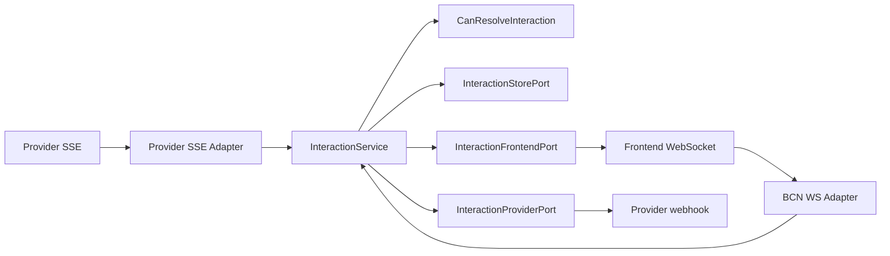
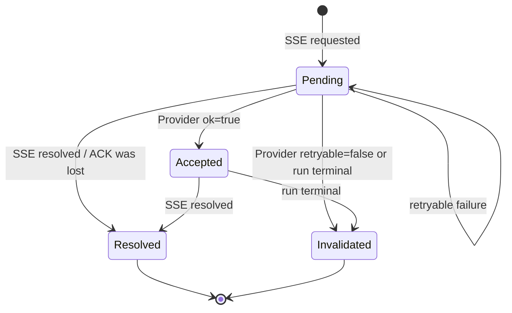
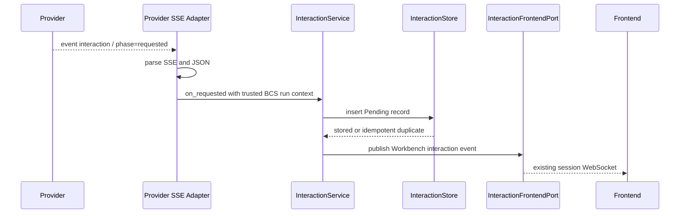
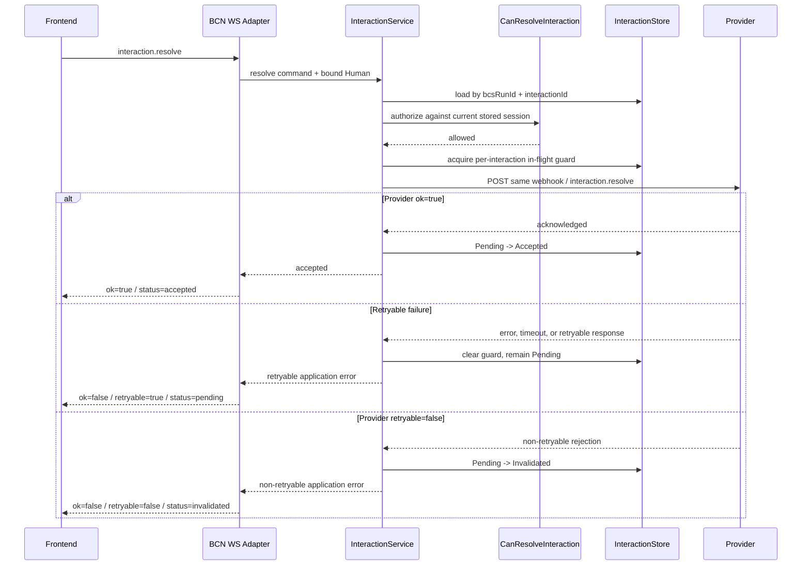

# BCN Provider SSE HITL Interaction Design

- Date: 2026-08-12
- Status: Implemented in BCS feature branch; Provider/Frontend integration pending
- Scope: Provider 2.0 SSE interaction ingestion, BCN-to-Frontend WebSocket delivery, and Frontend-to-Provider interaction resolve orchestration
- Related protocol: `src/bcs/docs/bcs-provider-2.0-sse-protocol.md`

## Problem

Provider 2.0 currently streams agent and chat events to BCS over the response to
one `chat.send` HTTP request. It does not yet have an implemented BCS workflow
for engine-originated human interactions such as command approval, user
questions, or mode changes.

The target workflow is:

1. Provider emits `event: interaction` on the original SSE response.
2. BCN forwards the interaction to Frontend over the existing Workbench
   WebSocket.
3. An authorized Human resolves it through the existing WebSocket using
   `method: interaction.resolve`.
4. BCN sends the resolution to the same Provider webhook in a separate HTTP
   request.
5. Provider later emits `interaction phase=resolved` on the original SSE after
   the engine applies the response.

This design must handle Frontend reconnects, multiple authorized Humans,
multiple concurrent interactions in one run, ambiguous HTTP failures, and a
future move from process-local state to distributed state without coupling the
delivery adapters to workflow policy.

## Goals

1. Support Provider 2.0 `interaction` events for `exec`, `ask_user`, and
   `mode_switch`.
2. Keep the original `chat.send` SSE response open while an interaction waits
   for a Human and while the engine resumes.
3. Reuse the existing Frontend Workbench WebSocket and Provider webhook.
4. Define `InteractionService` as an inbound Application Service API.
5. Define an independently changeable `CanResolveInteraction` authorization
   capability.
6. Use a process-local `InteractionStore` for the first release behind a port.
7. Make resolve delivery user-retryable, tolerate possible duplicate Provider
   delivery, and avoid promising strict exactly-once semantics.
8. Automatically replay actionable interactions when a Frontend reconnects to
   a session.

## Non-goals

- Do not modify BAAS or engine implementations.
- Do not implement Frontend rendering or interaction widgets.
- Do not persist interaction state in `bcs_messages`.
- Do not add an interaction database table in the first release.
- Do not add `stateVersion`, `expectedStateVersion`, `expiresAtMs`, or an
  interaction-specific client countdown.
- Do not add background resolve retries in BCN.
- Do not guarantee active interaction recovery after a BCN process restart.
- Do not restrict one run to one active interaction.

## Chosen Approach

Use an Application Service with explicit outbound ports and a process-local
store:



### Rejected alternatives

#### Store workflow state in the Provider SSE adapter or run context

This makes Provider parsing, Frontend WebSocket commands, authorization, and
workflow transitions depend on one transport implementation. It also makes a
future distributed Store replacement affect both delivery adapters.

#### Use `bcs_messages` as the interaction source of truth

`bcs_messages` is append-oriented chat history. It does not provide the
per-interaction compare-and-set behavior, active-state lookup, or routing
metadata required by this workflow. A future history projection may write
interaction snapshots to messages, but it must not become the workflow source
of truth.

#### Add a durable interaction table immediately

A database table improves restart and cross-instance recovery but adds schema,
migration, and consistency work before the product semantics have been proven.
The first implementation keeps the port boundary and accepts process-local
recovery limits.

## Architecture Classification

`InteractionService` is an Application Service API under
`bcs_service_api::application`. Delivery adapters call this API and do not
directly call the Store, authorization policy, or Provider transport.

Recommended names:

- Application API trait: `InteractionService`
- Application implementation: `InteractionManagement`
- Core model: `Interaction`, `InteractionKey`, and `InteractionStatus`
- Authorization port: `CanResolveInteraction`
- Runtime state port: `InteractionStorePort`
- Provider outbound port: `InteractionProviderPort`

The core model owns pure transition and validation rules. It does not import
HTTP, SSE, WebSocket, JSON frame, or authentication framework types.

The Application implementation coordinates:

- Provider requested/resolved commands;
- real-time session authorization;
- interaction state;
- Provider delivery;
- Frontend delivery; and
- application-level result/error mapping.

`InteractionProviderPort` reuses the registered Provider target, webhook,
authentication, Provider 2.0 headers, and allowlisted bypass headers. The
Frontend cannot provide a URL, Provider bot reference, or arbitrary target.

## Identity and Routing

### Logical key

The first implementation uses this logical key in its in-memory map:

```text
(bcsRunId, interactionId)
```

This is not a database table key in the first release. It may later become a
Redis key or database unique index without changing the Application API.

`bcsRunId` is the BCN/BCS run identifier created for the original
`chat.send`. Provider `runId` remains an opaque engine/provider identifier and
is not a BCN routing authority.

### Session ID

`bcsSessionId` is required in the server-owned `InteractionRecord`, but it is
not part of the logical primary key. It is used for:

- real-time `CanResolveInteraction` checks;
- WebSocket session delivery;
- pending-interaction replay; and
- a session-to-interaction secondary index.

BCN includes `bcsSessionId` in the server-to-Frontend event as routing context.
Frontend resolve does not require it. If an existing envelope supplies a
session ID, BCN only checks it for consistency and never uses it as the
authorization source.

### Interaction record

The record contains at least:

```text
key: (bcs_run_id, interaction_id)
provider_run_id
bcs_session_id
group_id
bot_id
run_deadline_ms
provider target and webhook routing metadata
requested payload
status
accepted idempotency key and resolution fingerprint, when present
resolver actor and timestamps, when present
terminal timestamp and invalidation reason, when present
```

The Store maintains a secondary index from `bcs_session_id` to interaction
keys. Index entries are removed together with their records.

## Authorization

Resolve uses the independent `CanResolveInteraction` capability. It is
evaluated when each resolve request arrives, using current session membership;
it is not cached at `requested` time.

The first-release policy allows an authenticated Human when either condition
is true for the exact current session:

1. the Human is a non-`Absent` participant; or
2. the Human owns at least one Bot that remains a participant in the session.

Owning a Bot elsewhere in the group is insufficient. Read-only or historical
visibility alone is insufficient. Resolve has no `fromActorId` because it is a
session-control action, not a chat message sent as a Human or Bot.

`CanResolveInteraction` loads the trusted `bcs_session_id` from the Store
record. It does not trust a Frontend-submitted session or Bot identity.

The service records the resolving Human as `resolvedByActorId` for structured
audit logs. The first release does not persist this audit record to
`bcs_messages` or a database.

## State Model

The lifecycle states are:

```rust
enum InteractionStatus {
    Pending,
    Accepted,
    Resolved,
    Invalidated,
}
```

`in_flight` is a short-lived per-interaction HTTP-call guard. It is not a
lifecycle state and never locks another interaction in the same run.



Different interaction IDs in one run are independent and may all be `Pending`
at the same time. They may be resolved in any order. SSE `seq` expresses event
arrival order; BCN does not interpret it as a required Human-resolution order.

When a Provider repeats the same `(bcsRunId, interactionId)`:

- an identical requested payload is treated as an idempotent duplicate;
- a different payload is dropped, the first record is preserved, and BCN logs
  a Provider protocol warning; and
- the run is not terminated.

A new Human interaction must use a new `interactionId`; a terminal record is
not reopened.

## Requested Event Flow



The Store write occurs before Frontend publication so an immediate resolve
cannot race with record creation.

The downlink event adds server-owned routing fields to the shared interaction
payload:

```json
{
  "type": "event",
  "event": "interaction",
  "group_id": "group-1",
  "bot_uuid": "bot-1",
  "bcsRunId": "bcs-run-1",
  "bcsSessionId": "group-1:session-1",
  "payload": {
    "runId": "provider-run-1",
    "interactionId": "interaction-1",
    "phase": "requested",
    "kind": "exec"
  }
}
```

The full kind-specific requested and resolved payloads remain defined by the
Provider 2.0 interaction protocol.

## Resolve Flow

Frontend sends `method: interaction.resolve` on the existing Workbench
WebSocket. Required correlation fields are `bcsRunId`, `interactionId`, and
`idempotencyKey`, plus the kind-specific resolution fields.



BCN does not automatically retry Provider delivery. A retryable failure leaves
the card actionable and the Human explicitly submits again.

## Delivery Semantics and Idempotency

Resolve uses Frontend-driven retryable delivery:

- BCN makes one Provider request for one Frontend request.
- Provider acknowledgement suppresses later delivery from BCN for that
  interaction.
- A missing acknowledgement leaves the interaction `Pending` and lets a Human
  retry.
- The retry may duplicate a request that Provider already received.
- Provider/engine may handle a duplicate by applying idempotency, ignoring it,
  or returning an error.

BCN therefore does not promise strict exactly-once. It provides best-effort
duplicate suppression after an acknowledgement. It also does not promise a
crash-safe at-least-once guarantee because the first Store is process-local and
there is no background retry queue.

The per-interaction `in_flight` guard prevents normal concurrent delivery:

- while one Provider request is active, another request for that interaction
  gets a retryable failure;
- requests for other interactions proceed independently;
- after a failure the guard is released and any currently authorized Human may
  retry; and
- after acknowledgement, a retry with the same idempotency key and resolution
  fingerprint returns the recorded success without calling Provider again.

A different resolution after `Accepted` is rejected as non-retryable. The
accepted Human choice cannot be overwritten locally.

## Provider Acknowledgement

BCN reuses the existing response shape:

```rust
pub struct ProviderAckResponse {
    pub ok: bool,
    pub retryable: Option<bool>,
    pub error: Option<String>,
}
```

Mapping rules:

| Provider result | BCN retryable | New status |
| --- | --- | --- |
| HTTP/connection timeout or unreadable response | `true` | `Pending` |
| `ok=false, retryable=true` | `true` | `Pending` |
| `ok=false`, `retryable` omitted | `true` | `Pending` |
| `ok=false, retryable=false` | `false` | `Invalidated` |
| `ok=true` | not applicable | `Accepted` |

These rows describe the normal case. After any Provider result, BCN reconciles
against the current authoritative Store state: a concurrent SSE `Resolved`
wins and is reported as success, while a concurrent run `Invalidated` is
reported as non-retryable. A transport error never rewinds either terminal
state to `Pending`.

The default is retryable unless Provider explicitly returns `false`. This is
backward compatible and prevents an incomplete Provider response from silently
removing a Human interaction.

`retryable` means whether the Human may submit another resolution for the
interaction, not merely whether the exact HTTP byte sequence may be repeated.
Provider should return `false` only when no further Human submission can
succeed.

## Frontend WebSocket Responses

Successful Provider acknowledgement:

```json
{
  "type": "res",
  "id": "ws-request-101",
  "ok": true,
  "payload": {
    "accepted": true,
    "interactionId": "interaction-1",
    "interactionStatus": "accepted",
    "idempotencyKey": "idem-resolve-1"
  }
}
```

Retryable resolve failure:

```json
{
  "type": "res",
  "id": "ws-request-101",
  "ok": false,
  "error": {
    "code": "interaction_resolve_failed",
    "message": "Failed to deliver the resolution to Provider",
    "retryable": true,
    "details": {
      "interactionId": "interaction-1",
      "interactionStatus": "pending"
    }
  }
}
```

Non-retryable resolve failure uses the same interaction-specific code with
`retryable=false` and `interactionStatus=accepted`, `resolved`, or
`invalidated` as applicable. Existing generic `invalid_request`,
`unauthorized`, and `not_found` codes continue to cover malformed frames,
authentication, and missing records. Provider does not implement BCN error
codes.

Frontend behavior is driven by `ok`, `error.retryable`, and
`details.interactionStatus`; it does not need a large hard-coded mapping from
interaction error codes to card behavior.

## Runtime Completion

Provider acknowledgement is not runtime completion. The original SSE remains
open, and Provider sends `interaction phase=resolved` after the engine applies
the response.

```text
Provider ACK                  -> Accepted
original SSE phase=resolved   -> Resolved
```

`Pending -> Resolved` is valid because Provider may have accepted and applied
the resolve while its HTTP acknowledgement was lost. SSE `resolved` remains
the authoritative runtime completion signal.

Provider may continue sending agent/chat events on the same run and SSE
response before or after the resolved event, subject to the Provider 2.0 event
ordering contract.

## Frontend Reconnect Replay

Use automatic replay rather than a new `interaction.list` WebSocket method.

For a session-bound Workbench connection:

1. complete the existing connect and current session authorization;
2. register the WebSocket connection;
3. call `InteractionService.list_pending(bcs_session_id)`; and
4. send each returned interaction using the normal requested-event format.

Only `Pending` records are replayed. `Accepted`, `Resolved`, and `Invalidated`
records are not returned as actionable cards.

Registering the connection before listing prevents missed events. A requested
event that races with the snapshot may be delivered twice. Frontend upserts by
`(bcsRunId, interactionId)` and tolerates that duplicate. A group-level socket
without a concrete session binding does not receive interaction replay.

An already connected user may retain a stale card after another user gets a
Provider acknowledgement. If that stale card is submitted, BCN returns a
non-retryable response with `interactionStatus=accepted`; the client then
disables it. All online clients later receive the Provider SSE `resolved`
event.

## Invalidation and Cleanup

An active interaction has no independent expiry. `Pending` and `Accepted`
records remain active while their run remains valid, even if Human response
takes a long time.

They become `Invalidated` when:

- the run receives `chat final`, `chat error`, or `chat aborted`;
- the Provider SSE terminates and BCN terminates the run;
- the run deadline is reached;
- the session/run is otherwise cancelled; or
- Provider explicitly rejects resolve with `retryable=false`.

Run termination invalidates every `Pending` and `Accepted` interaction for the
run. It does not change already `Resolved` records.

Reuse `async_chat_run_retention_ms`, currently 120 seconds by default, for
terminal interaction tombstones:

- `Resolved` and `Invalidated` records are deleted after the retention window;
- `Pending` and `Accepted` records are never deleted directly by TTL;
- an expired active run is first compensated through `invalidate_run`; and
- Store cleanup then removes the terminal records and their session index
  entries after retention.

This retention is an internal memory cleanup rule, not a protocol
`expiresAtMs`. Late resolve requests get stable terminal responses during the
retention window and generic `not_found` after cleanup.

## Process and Distributed Limitations

The first implementation uses one process-local Store shared by the Provider
SSE and Frontend WebSocket adapters. A BCN restart loses active interactions,
accepted fingerprints, and replay state. The open SSE is also lost, so live run
failover is a separate problem from Store persistence.

The port boundary permits a later Redis or database Store with atomic
per-interaction updates. That replacement can improve cross-instance resolve
and replay without changing the WebSocket or Provider protocols. Full live SSE
failover would additionally require Provider replay or reconnect semantics and
is not promised here.

## Observability

Record structured events and counters for:

- interaction requested, replayed, accepted, resolved, and invalidated;
- resolve attempts and per-interaction in-flight conflicts;
- Provider success, retryable failure, and non-retryable failure;
- requested-to-accepted and accepted-to-resolved latency;
- duplicate requested payloads and conflicting payloads for the same key; and
- cleanup counts and active interaction counts by status.

Logs include `bcs_run_id`, `interaction_id`, `bcs_session_id`, `group_id`,
`bot_id`, and Provider ID. They must not log secret user answers or sensitive
command contents beyond existing redaction rules.

The process-local implementation additionally enforces a 256 KiB requested
payload limit, 32 active interactions per run, 256 active interactions per
session, and an 8 MiB SSE frame/buffer limit. These bounds permit multiple
concurrent prompts while preventing an untrusted Provider from growing memory
without limit.

## Testing

### Protocol contract tests

- SSE/JSON encode and decode for interaction requested/resolved.
- Requested and resolved payloads for `exec`, `ask_user`, and `mode_switch`.
- Provider ACK with `retryable=true`, `false`, and omitted.
- WebSocket success, retryable error, and non-retryable error envelopes.
- Regression coverage proving existing `agent`, `chat`, and `ping` behavior is
  unchanged.

### Core model tests

- `Pending -> Accepted -> Resolved`.
- `Pending -> Resolved` after an acknowledgement is lost.
- Retryable failure remains `Pending`.
- Non-retryable Provider failure becomes `Invalidated`.
- Run termination invalidates every active interaction in that run.
- Multiple interactions in one run transition independently and in any order.
- Identical requested duplicates are idempotent; conflicting payloads preserve
  the original record.

### Application tests

- Resolve evaluates `CanResolveInteraction` at request time.
- A Human who has left the session cannot resolve.
- A Human owning a Bot in the exact session can resolve.
- Client-supplied session, Bot, and Provider routing cannot override the stored
  route.
- In-flight exclusion is per interaction, not per run.
- An accepted idempotent retry does not invoke Provider again.
- Provider retryability maps to Store state and application response.
- Active expiry first invalidates and terminal cleanup later deletes.

### WebSocket and Provider adapter tests

- Session connect automatically replays all and only `Pending` interactions.
- Live/replay duplication is tolerated through the logical key.
- Resolve responses expose retryability and current status.
- Provider resolve reuses the original webhook, authorization, Provider 2.0
  headers, and stored target.
- The resolve POST expects JSON acknowledgement and does not create a second
  SSE response.

### End-to-end test

Run a fake Provider that:

1. keeps the original `chat.send` SSE open;
2. emits multiple interaction requests;
3. receives independent resolve HTTP requests;
4. returns Provider acknowledgements;
5. emits resolved events on the original SSE; and
6. continues agent/chat streaming.

Also cover a Provider timeout followed by explicit Human retry and two
authorized Humans racing to resolve the same interaction.

## Compatibility

- Existing `agent`, `chat`, `ping`, and heartbeat behavior is unchanged.
- `interaction` is a new top-level Provider SSE event.
- `interaction.resolve` is a new Workbench WebSocket and Provider method.
- Provider `retryable` is optional and defaults to retryable when absent.
- Existing Providers that never emit interaction events are unaffected.
- BAAS and Frontend implementation changes are outside this BCS change.
- No database migration or `bcs_messages` projection is introduced.

The Provider SSE protocol document is synchronized with this implementation:
it permits multiple active interactions and uses transient `in_flight` plus
`Pending/Accepted/Resolved/Invalidated`, without a lifecycle `resolving` state.
