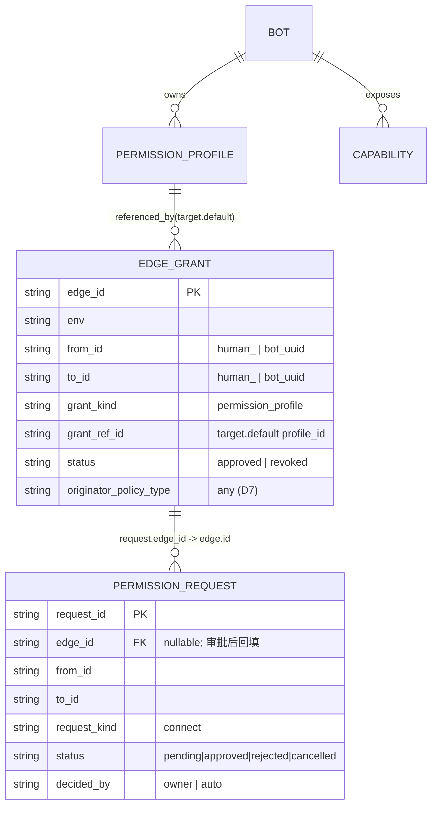
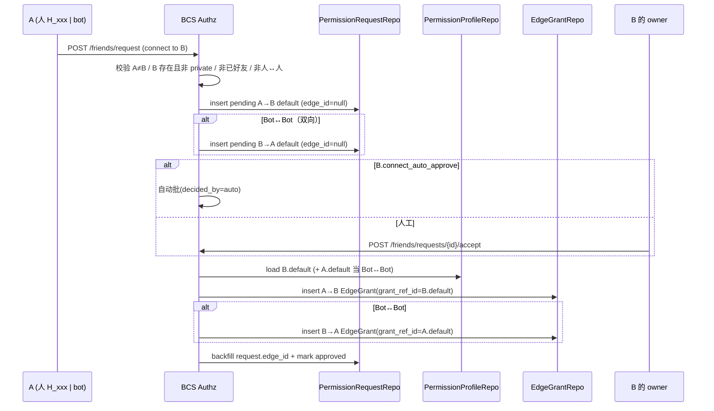

# 好友关系 → 边权限 改造 · 合并文档（Spec + Plan Installments + Review Fixes）

> 状态：合并稿（2026-08-19 规整；5 个原始文档已删除，本文件为该主题唯一来源，归档于 `src/bcs/docs/superpowers/specs/`）
> 工作仓库：Avernet（路径前缀 `src/...`）
> 范围：把两套互不相通的好友关系统一到 08-12 边权限模型，BCS `edge_grants` 作为好友关系唯一事实源（SoR）。
>
> 本文件由以下 5 个文档合并规整而成：正文保留原文，仅去掉各自的 H1 标题与 `>` 前言块，按逻辑顺序（设计 → 实施 installment 1→2→3 → Review 修复）编为 5 个 Part，并加总目录。**5 个原始文件已删除；下列路径与各 Part 顶部「来源」行仅为历史溯源，文件本身不再存在。**
>
> - `docs/superpowers/specs/2026-08-18-friend-edge-permission-reform.md` → **Part I**（权威设计 / Spec）
> - `docs/superpowers/plans/2026-08-18-friend-edge-permission-reform.md` → **Part II**（Installment 1：领域类型 / 端口 / 路由骨架，Tasks 1–4；原 Task 4 后端 Python clients 已 DROPPED）
> - `docs/superpowers/plans/2026-08-18-friend-edge-permission-reform-installment-2.md` → **Part III**（Installment 2：DDL + Store，Tasks 5–11）
> - `docs/superpowers/plans/2026-08-19-friend-edge-permission-reform-installment-3.md` → **Part IV**（Installment 3：服务实现 + seed + 接线，Tasks 12–17）
> - `docs/superpowers/plans/2026-08-19-friend-edge-permission-reform-review-fixes.md` → **Part V**（Review-driven 修复 P0/P1/P2）
>
> 阅读建议：先 Part I 理解模型与决策 D1–D13；实施按 Part II→III→IV 顺序；上线前过 Part V 的修复清单与兼容矩阵。

## 目录
- **Part I — 设计方案（Spec）**
    - 0. 修订摘要（相对源文档的变更）
    - 1. 背景与目标
    - 2. 决策表（D1–D13，D6 修订）
    - 3. 目标模型与表映射
    - 4. Connect 流程与 API 面
    - 5. 统一接口（actor 信息 + 列表/发现 + 准入）
    - 6. 代码锚点（Avernet，已轻量核对）
    - 7. 微内核合规
    - 8. 迁移上线（修订重点：去双写 + 全量 + 手动增量对账 + atomic cutover）
    - 9. 范围与边界
    - 10. 待确认 / 后续
- **Part II — Installment 1（领域类型 / 端口 / 路由骨架，Tasks 1–4）**
    - File Structure（本 installment）
    - Task 1: Rust 领域类型（bcs-domain）
    - Task 2: Rust repo ports + application service traits + Noop
    - Task 3: BCS HTTP wire types + 路由骨架
    - Task 4: Python backend BCS clients — ⚠️ DEFERRED / DROPPED (2026-08-18)
    - 后续 installments（不在本计划，仅占位索引）
    - Self-Review
    - Execution Handoff
- **Part III — Installment 2（DDL + Store，Tasks 5–11）**
    - File Structure（本 installment）
    - Task 5: MySQL DDL 迁移（006_edge_permission.sql）
    - Task 6: SQLite DDL（migrations.rs inline）
    - Task 7: 新 store crate 骨架 + `EdgeGrantRepoPort` 实现
    - Task 8: `PermissionProfileRepoPort` 实现
    - Task 9: `PermissionRequestRepoPort` 实现
    - Task 10: Rule 25 conformance 契约套件
    - Task 11: bootstrap 绑定三 store（供 Installment 3 服务注入）
    - Self-Review（执行后自检）
    - 执行说明
- **Part IV — Installment 3（服务 + seed + 接线，Tasks 12–17）**
    - File Structure（本 installment）
    - Task 12: 暴露 bot 配置（human_addable + friend_approval）到读取路径
    - Task 13: `ConnectService` 真实 impl（含 D3 4-case + ownership）
    - Task 14: `AdmissionService` 真实 impl
    - Task 15: onboarding `ensure_default_profile` + onboard 返回 bot_uuid
    - Task 16: bootstrap 接线（构造 store + 服务，注入 HttpAppState，退役 Noop）= 原 T11
    - Task 17: D11 backend `_sync_bot_to_bcn` 捕获 bot_uuid
    - Self-Review（执行后自检）
    - 执行说明
- **Part V — Review-Driven 修复（P0/P1/P2）**
    - 0. 优先级总表
    - P0 — merge 前必堵
    - P1 — spec 实质性缺口
    - P2 — 规范/契约清理（排后续 installment）
    - 兼容性矩阵（老入口调用）
    - 验证策略
    - PR 切分建议
    - Self-Review
    - 执行移交

---

# Part I — 设计方案（Spec）

> 来源：`docs/superpowers/specs/2026-08-18-friend-edge-permission-reform.md`（2026-08-18，整合稿/待评审）。

**整合来源**（`/Users/liaoshengping/Documents/workplace/ocb/docs/arch/`）：
- `edge-permission-friend-unification-design.md`（设计 spec，D1–D13）
- `edge-permission-friend-migration-plan.md`（迁移执行稿）
- `edge-permission-friend-api-contract.md`（API 契约）
- `edge-permission-friend-unification-tech-intro.md`（技术介绍）
- `edge-permission-actor-info-and-api-unification.md`（actor 信息统一 + Phase 0 + 统一接口）

> 路径映射：源文档锚点 `ocb-public/src/...` → Avernet `src/...`。下文锚点为 Avernet 实际路径，行号已轻量核对（少数仍标「≈」表示继承自源文档、实现时复核）。

---

## 0. 修订摘要（相对源文档的变更）

| 项 | 源文档（design D6 / migration-plan） | 本方案（修订） | 理由 |
|---|---|---|---|
| **上线策略 D6** | 绞杀者 + **双写**（Phase B 新写双写新旧表） | **去双写**：全量 ETL + 手动增量对账 + atomic cutover | 用户要求「过程不需要双写」 |
| **增量迁移** | 无（靠双写兜底变更/删除） | **手动触发**的增量对账（reconciliation） | 用户要求「支持全量迁移和后续增量迁移」+「手动触发」 |
| **ETL 语义** | INSERT-only（`ON CONFLICT DO NOTHING`） | 增量对账为**双向**：INSERT + UPDATE（状态迁移）+ REVOKE（旧侧友谊消失） | 去双写后须由对账承担删除/状态变更，INSERT-only 不够 |
| **切读阶段** | Phase D 切读 + **读侧回退**（miss→读旧） | **去掉回退**：Phase 4 仅 shadow 比对、不切用户读；Phase 5 读+写同翻（atomic） | 读侧回退只在「读先切、写后切」错峰下才有 lag-miss 场景；atomic cutover 下无此场景 |
| **cutover 形态** | 错峰（先切读→后退役） | **atomic cutover**：最终对账 → flag 灰度读+写同翻 → 旧冻结；翻写可 flag 回退，drop 旧才不可逆 | 与去双写/去回退一致，靠 shadow 门禁 + 最终对账 + 灰度去风险 |

其余（D1–D5、D7–D13、五表模型、API 契约、Phase 0、default profile seed、范围 D9）**全部沿用源文档**，下文整合呈现。

---

## 1. 背景与目标

仓库现存**两套互不相通**的好友系统，数据表与调用链均无交集：

- **System A — 人→Bot 授权**（Python 后端）：`ac_bot_friend` 表 + `BotPublicService` + antprocess 审批工作流（`biz_type=botpublicfriends`）+ AceAgent `AuthRelationshipPlugin` 外部授权。gating **人→工作台→Bot 的 chat 准入**。
  - `friend_approval="0"` 自动通过（写 ACCEPTED + AceAgent grant）；`"1"` 走 antprocess 人工审批。
  - 锚点：`src/backend/src/agentclaw/community/core/bot_public/services/bot_public_service.py:723`(create)/`:904`(callback)/`:247`(_rebuild_auth_relationships)/`:1023`(search)/`:1092`(list_my_bot_friends)/`:1163`(get_friend_record)。
- **System B — Bot↔Bot 社交图**（BCS Rust）：`bcs_friendships` + `bcs_friend_requests` + `bcs_actor_relations` 友谊边双写 + `bcs-friend`/`bcs-friend-store` crate。gating **Bot↔Bot A2A 协同**。
  - public Bot 自动通过、protected 人工审、private 拒；3 态状态机。
  - 锚点：`src/bcs/crates/services/bcs-friend/`、`src/bcs/migrations/mysql/001_init_schema.sql`（`bcs_friendships`/`bcs_friend_requests`/`bcs_actor_relations`）。`bcs_actor_relations` 已有保留的 `kinds`/`allow`/`deny` 位图列（V1 恒 0，未用）+ `is_creator`；友谊边已双写镜像其中（`is_creator=0`）。

**目标**：把两套好友关系统一到 08-12 A2A 授权模型（`edge_grants`/`permission_profiles`/`permission_requests`），BCS 边作为好友关系的**唯一事实源（SoR）**；退役 `ac_bot_friend`+`bcs_friend*`+antprocess 好友审批+AceAgent 好友授权；前端好友操作直连 BCS。

---

## 2. 决策表（D1–D13，D6 修订）

| # | 决策 | 要点 |
|---|---|---|
| D1 | 权威 spec = 08-12 | 采用 PermissionProfile/Capability/`edge_grants`/`permission_requests` 模型。仓库内 `edge-permission-schema.md`(role_def) 视为旧稿，仅借鉴其迁移*策略*，不沿用 role_def 表结构。 |
| D2 | 全量统一（BCS 单一权威） | 人→Bot 与 Bot↔Bot 好友都落 BCS `edge_grants`；退役 `ac_bot_friend`+`bcs_friend*`+antprocess 好友审批+AceAgent 好友授权；前端好友操作直连 BCS。 |
| D3 | friend 边是有向 default grant；人→Bot 单向、Bot↔Bot 双向 | 人→Bot connect 只建 **1 条**边（人→Bot，`grant_ref_id=Bot.default`），**不建 bot→人 反向边**；Bot↔Bot connect 建 **2 条**（A→B + B→A，互为好友）。 |
| D4 | 保留自动批 connect | 受限 Bot 可配 bot 级 `connect_auto_approve`（映射自 `friend_approval="0"`/public-auto）→ connect 即自动 approved + 建 per-person 边（可撤销）。完全公开 Bot → runtime `public_default` 免边。 |
| D5 | backend 直查 BCS 边 | 工作台 chat 路由不动（仍走 gateway/engine），backend 现有 friend-check 改写为查 BCS `/admission`。A2A 路径用 AuthzContext 注入。两路同读 `edge_grants`。 |
| **D6（修订）** | **上线策略 = 全量+手动增量对账+atomic cutover（去双写）** | 六阶段（Phase 0–5）：0 补录 → 1 Build → 2 全量 ETL → 3 手动增量对账 → 4 Shadow → 5 Cutover+退役。**无双写、无读侧回退**；增量对账为双向 reconciliation（INSERT+UPDATE+REVOKE）。详见 §8。 |
| D7 | originator_policy 统一 `any` | 所有 friend（default profile）边 `originator_policy_type='any'`。 |
| D8 | （已撤销）原 bot→人 反向边 + `human_default` 系统 profile | D3 修订为人→Bot 单向后，bot→人 反向边不建、`human_default` 系统 profile 不再需要，整体撤销。 |
| D9 | 范围 = friend/default 边 | 只统一好友（connect/default profile）切片。owner/co_editor/team_member/rules-grant/revoke/协作群为独立 spec，不在本期（群留 §6.3 基线 + 扩展点）。 |
| D10 | antprocess 退役 → BCS 收件箱 | owner 审批改走工作台内 BCS 收件箱。**产品 UX 变更**，已确认接受。 |
| D11 | Bot/人 actor id 调和（方案 C） | edge id(bot) = BCS 复合 `{backend_bot_id}:{owner_workno}`、人 = `human_<staff_no>`；onboard 落库 `bcs_bot_uuid` 映射；System A ETL 合成、System B 零 re-key；opaque-uuid + `H_` 推迟到独立后续迁移。 |
| D12 | friend 判定与其它 grant 共存 | friend 边 = `grant_ref_id==target(bot) 的 default profile_id`（per-bot 真实 id）；connect 边钉 default 不改向、default profile_id 有 live 边时不许删换；unfriend 只撤 friend 边（人→Bot 1 / Bot↔Bot 2）；`are_friends(X,Y)`=∃ default 边 X→Y 或 Y→X（对称）≠ `is_authorized(X→Y)`（任一 approved 边、有向、准入用）。 |
| D13 | 群场景统一边表达（群 spec 基线，不在本期） | β 基线：群=scope，群聊用被调 bot 自己的 default（`source=collaboration_group`）；membership=`G→A` 范围边。α 可选：群配 `G.collaboration` profile 覆盖。本期留三源并集③扩展点 + profile 命名空间 `gpp_<gid>_collaboration`。 |

---

## 3. 目标模型与表映射

### 3.1 涉及的 08-12 表

| 表 | 本设计用途 |
|---|---|
| `permission_profiles` | 每 Bot seed 一条 **`default`** profile（`rules_template=[{tool:"*",specifier:"*",effect:"allow"}]` wildcard-allow，capability-independent）；owner 可升 revision 收窄。未来扩 `subject_type=group`（群，不在本期）。 |
| `permission_requests` | 取代 `ac_bot_friend` 与 `bcs_friend_requests`；`request_kind=connect`（revoke 见 §4.1 unfriend）。 |
| `edge_grants` | 取代 `ac_bot_friend` ACCEPTED + `bcs_friendships` + `bcs_actor_relations` 友谊边；`grant_kind=permission_profile`，`grant_ref_id=<target>.default`。 |
| `authz_decision_logs` | 记录每次准入决策（A2A + 工作台两路）。 |
| `capabilities` | Bot 暴露工具目录；onboard 时空起始、异步收集（`source=agent_card`）；**非 default/friend 前置**。MVP 最小化。 |

### 3.2 `bcs_bots` 新增两列（actor 信息统一，解耦 visibility）

| 新列 | 含义 | 值域 | 来源 |
|---|---|---|---|
| `human_addable` | 人能否添加我（人方向） | true/false | 迁移自 `ac_bots.public` |
| `friend_approval` | 添加时是否需审批（人+bot 共用） | auto/manual | 迁移自 `ext.friend_approval`（与 `visibility` 融合，取严） |

> **关键修正**：旧 BCS `visibility` 既管"能否添加"又管"是否审批"（public=auto/protected=manual/private=拒）——两件事混在 1 字段。统一后拆三独立维度：`visibility`（谁能发现/添加，bot 方向）、`human_addable`（人方向）、`friend_approval`（审批）。新组合 `public+manual` 可用（可发现但加好友需审）。

**准入矩阵**（统一后）：

| `visibility` | `human_addable` | `friend_approval` | 人→Bot | Bot→Bot |
|---|---|---|---|---|
| public | true | auto | 免边 runtime public_default | 免边 runtime public_default |
| public | true | manual | connect → owner 审 → 边 | connect → owner 审 → 边 |
| public | false | * | 拒绝 | 免边（bot 方向不受 human_addable 影响） |
| protected | true | auto | connect → 自动 → 边 | connect → 自动 → 边 |
| protected | true | manual | connect → owner 审 → 边 | connect → owner 审 → 边 |
| protected | false | * | 拒绝 | connect 按 friend_approval |
| private | * | * | 拒绝 | 拒绝 |

### 3.3 ER 关系（好友切片）



### 3.4 映射表（existing → 08-12）

| 现有 | → 08-12 | 转换 |
|---|---|---|
| `ac_bot_friend`（人→Bot） | `permission_requests`(connect) + accept 后 **1×** `edge_grants`（人→Bot 单向） | `requester_entity_id`→`from_id=human_<staff_no>`；`target_bot_id`→`to_id`；status PENDING/ACCEPTED/REJECTED/CANCELLED → pending/approved/rejected/cancelled；`ext.approvals[]` → decided_by/decided_at |
| `bcs_friend_requests`（Bot↔Bot） | `permission_requests`(connect) | `from_bot`→`from_id`；`to_bot`→`to_id`；pending/accepted/rejected → pending/approved/rejected |
| `bcs_friendships` pair（left<right 归一） | 2× `edge_grants`（A→B + B→A） | 归一 pair → 2 条有向 default-profile 边 |
| `bcs_actor_relations` 友谊边（`is_creator=0`） | 并入 `edge_grants` | owner 边（`is_creator=1`）**不在本期**，留待 owner 迁移 |
| `friend_approval`(0/1) + Bot 可见性 | bot 级 `connect_auto_approve` 配置；`public`→runtime `public_default` 免边 | D4 |
| `AuthRelationshipPlugin` grant（AceAgent） | 退役；gateway 读 BCS `edge_grants` 经 `/admission` | D5 |
| antprocess `botpublicfriends` 审批 | 退役；BCS-native 审批 / 自动批 | D2/D10 |

### 3.5 Bot/人 actor id 调和（D11）

现状两边 id 不同且**无持久化映射**：后端 bot id=`ac_bots.bot_id`（`{YYYYMMDD}_{8char}`，非唯一）；BCS bot id=`bcs_bots.bot_uuid`=复合 `{backend_bot_id}:{owner_workno}`；人：后端用 `staff_no`，BCS 用 `human_<staff_no>`。`_sync_bot_to_bcn`（`bot_service.py:2988`）调 `onboard_bot` 后**丢弃返回的 `bot_uuid`** → 无字段、无表把两边 id 对应。

**决策（D11，方案 C）**：好友统一**不依赖** opaque-uuid / `H_` 前置。
- edge `from_id`/`to_id`(bot) = 复合 `bot_uuid`；人 = `human_<staff_no>`。
- System A ETL 合成（确定性，无需查表）：`bot_uuid=f"{target_bot_id}:{owner_id}"`、`human_id=f"human_{requester_entity_id}"`。System B 零 re-key。
- 落库映射：`_sync_bot_to_bcn` 捕获 onboard 返回 `bot_uuid` 落 `ac_bots.ext.bcs.bot_uuid`（或新列）；存量 bot 用 f() 合成回填。backend 调 `/admission` 时用此映射（或合成）。
- 后续独立迁移（不在本期）：opaque bot uuid + `H_<staff_no>` 单独 re-key 全部边，过渡期 admission 兼容新旧双 id。
- 已知限制：复合 id 随 owner 变化失效（owner 转移＝re-key），本期假定 owner 稳定。

### 3.6 人→Bot 单向边（D3 修订，撤销 human_default）

人→Bot connect 只建**一条有向边**（人→Bot，`grant_ref_id=Bot.default`），**不建 bot→人 反向边**——bot→人在 A2A tool-call 语义下无意义。friend 边有向语义："X→Y = X 可用 Y"。因此 **`human_default` 系统 profile 不再需要**。Bot↔Bot connect 仍建双向 2 条边。

---

## 4. Connect 流程与 API 面

### 4.1 统一 connect 生命周期（人→Bot 单向 / Bot↔Bot 双向）



- **Request**：校验 `A≠B`(CannotAddSelf)、B 存在且非 `private`(private→拒)、A-B 非已好友（幂等→返回已 accepted）、人↔人拒绝（`InvalidOperation`）。写 pending `permission_requests`（`edge_id=null`）：人→Bot 1 条；Bot↔Bot 2 条。
- **Approve**（owner 审 或 `connect_auto_approve` 自动）：一个 DB 事务内——load `B.default`（Bot↔Bot + `A.default`）；insert `edge_grants`（均 `grant_kind=permission_profile`、`status=approved`、`originator_policy_type=any`）：人→Bot 1 条；Bot↔Bot 2 条。回填 `edge_id`；request(s) `approved`。自动批 → `decided_by="auto"`。
- **Reject / Cancel**：对应 request(s) → `rejected`(owner) / `cancelled`(caller 撤回)；不建边。已 rejected/cancelled 幂等。
- **unfriend（revoke）**：落一条 `request_kind=revoke` 的 PermissionRequest → owner 直批 → 该对点 friend 边 `status=revoked`（人→Bot 1 / Bot↔Bot 2）；其它 writer/rules 边不动。

### 4.2 请求时决策树

| B 配置（`visibility`+`human_addable`+`friend_approval`） | 行为 |
|---|---|
| `public`（完全公开，bot 方向） | 不走 connect — runtime `public_default` 免边。`POST /friends/request` 返回 "bot is public, no edge needed"。 |
| `protected`/`public` + `friend_approval=auto` | 自动批 connect → approved EdgeGrant（人→Bot 1 / Bot↔Bot 2），保留 per-person 记录可撤销 |
| `protected`/`public` + `friend_approval=manual` | 人工：`pending` → owner 审 |
| `private`（或人方向 `human_addable=false` 且发起方为人） | connect 被拒 |

### 4.3 准入：两路同一 SoR

- **工作台路径**（D5，backend 直查）：BCS `GET /bots/{bot_id}/admission?actor=&originator=` → 返回 `allowed` + `grants[]` + `reason_code`。逻辑：
  1. status≠hidden（协作开关）；否则拒（`reason_code=bot_hidden`）。
  2. list `edge_grants` `from_id=actor → to_id=bot`、`status=approved`；match `originator_policy`（friend 边 `any` → 恒激活）。
  3. 有 active grant → `allowed=true`，返回 grants（profile grant 解析出 revision/digest）。
  4. 否则若 `bot.public` → `allowed=true` via `public_default`。
  5. 否则拒（`reason_code=no_edge`/`bot_not_public`）。
  - backend 旧 friend-check 调用点（`session_resources/service.py:471` 上传门、gateway、bot-public 端点）改指向此。**AceAgent 不再 consulted**。
- **A2A 路径**（Bot↔Bot）：同 `edge_grants` 读，但经 `AuthzContext` 注入。两路径同读 `edge_grants` → 统一 SoR。
- **`is_authorized` vs `are_friends`**：admission 判 `is_authorized`（任一 approved 边）；好友列表/拉群 friend 门槛/UI"已是好友"判 `are_friends`（仅 default 边）。

### 4.4 HTTP 面变更

| BCS 端点（保留 `/friends/*` 路径形状，改接 08-12 表） | 取代 |
|---|---|
| `POST /friends/request`（connect；人→Bot 1 / Bot↔Bot 2 request） | BCS 旧 `/friends/request` + Python `/bot-public/friend-request-approval` + antprocess start |
| `POST /friends/requests/{id}/accept` / `reject` / `cancel` | BCS 旧 accept/reject + antprocess `AGREE`/`DISAGREE`/`CANCEL` 回调 |
| `GET /friends/requests`、`GET /bots/{id}/friends`、`GET /friends?actor=` | BCS 旧 list + Python `/my-friend-bots`、`/friend-record` |
| `GET /bots/{id}/admission` | **新增**，工作台准入用（service-to-service） |
| `POST /friends/{actor}/revoke`（`request_kind=revoke`） | Python per-friend 撤销 + BCS `remove_friendship` |
| `PUT /bots/{id}/human-addable` / `PUT /bots/{id}/friend-approval` | **新增**（actor 信息统一）；替代 backend `POST /api/bots/{bot_id}/public` |

> 完整请求/响应 schema、错误码总表见 `edge-permission-friend-api-contract.md` §2（沿用）。

**退役**：Python `BotPublicService` 好友方法 + `BotFriendRepository`；antprocess `botpublicfriends` process；`AuthRelationshipPlugin.create_relationship` 好友调用点。

### 4.5 friend 判定与其它 grant 共存（D12）

08-12 的 `edge_grants` 同一对 (A→B) 可挂多条边（default/writer/maintainer profile 边 + rules 边）。因此好友与"有授权"是**两个不同谓词**：

- `is_authorized(X→Y)`（准入，有向）= ∃ 任一 approved edge X→Y。
- `are_friends(X,Y)`（好友，对称）= ∃ approved default 好友边 **X→Y 或 Y→X**。

**friend 边判别**：`grant_kind=permission_profile` 且 `grant_ref_id == default_profile_id_of(<target>)`，target 恒为 bot。`default_profile_id_of(target)` = 查 `permission_profiles WHERE bot_id=target AND env=? AND is_default=true AND status=active` → 取 `permission_profile_id`；**缓存** `(bot_id,env)→profile_id`（D12 规则 2 保证稳定）→ friend 判定降为内存查表 + `grant_ref_id` 等值比较，无 join。

**两条稳定性规则**：① connect 产出的边 `grant_ref_id` 永远钉 target default，不允"更新为 writer"改向（加权限另起 edge）；② bot 的 default profile 在还有 live friend 边时不许删/换 profile_id（改默认权限走升 revision，`profile_id` 不变）。

**friend 列表查询**（`friends(X)` = 所有 Y 与 X 有 default 好友边，任一方向）：
```sql
-- X 发起的：X→Y（Y 是 bot，ref=Y.default）
SELECT to_id AS friend FROM edge_grants
 WHERE from_id=:x AND env=:env AND status='approved' AND grant_kind='permission_profile'
   AND grant_ref_id = :cached_default_of(to_id)
UNION
-- 别人发起连到 X 的：Y→X（X 是 bot，ref=X.default）
SELECT from_id AS friend FROM edge_grants
 WHERE to_id=:x AND env=:env AND status='approved' AND grant_kind='permission_profile'
   AND grant_ref_id = :cached_default_of(:x);
-- 结果用 BotRegistryCoreService 富化 name/summary/online
```
人 X：好友全是 bot → 只走上半支；bot X：两支并集。

### 4.6 群场景的统一边表达（D13，群 spec 基线 — 不在本期）

协作群属独立 spec（D9），本节仅定群边表达**基线**，确保本期 friend 统一进 `edge_grants` 时不堵死群接入路径。β 基线：群=scope，群聊用被调 bot 自己的 default（`A.default`/`B.default`，`source=collaboration_group`，即 08-12 §6.3 `collaboration_default`）；membership=`G→A` 范围边（`grant_kind=permission_profile`，ref=member.default(bot)/null(human)）。运行时 A→B 准入三源并集：① A→B friend 边（直接）② B.public（public_default）③ 共同群（β 注入 B.default，α 可选 G.collaboration 覆盖）。本期准入 `ensure_target_reachable` 改接 `edge_grants` 时写成三源并集，给③留扩展点；profile 命名空间预留 `gpp_<gid>_collaboration`。

---

## 5. 统一接口（actor 信息 + 列表/发现 + 准入）

### 5.1 Actor 信息更新接口

| 统一开关 | 接口 | 方法/路径 | 现状 |
|---|---|---|---|
| 群聊状态 | `PUT /actors/{aid}/status` | 已有 | 无 |
| 允许 Bot 添加 | `PUT /bots/{id}/visibility` | 已有（语义改：解耦审批） | 改 |
| 允许人添加 | `PUT /bots/{id}/human-addable` | **新建** | 新 |
| 好友需审批 | `PUT /bots/{id}/friend-approval` | **新建** | 新 |
| 公开画像 | `PUT /bcnfuse/v1/workers/{id}/config` | 已有（bcsfuse，不动） | 无 |
| 聚合入口（可选） | `PUT /bots/{id}/config` | 可选新建 | 新 |

> 替代 backend `POST /api/bots/{bot_id}/public`（现一次调写 `public`+`friend_approval`+`_resolve_access_mode`+`_rebuild_auth_relationships`）。退役 `_resolve_access_mode`/`_rebuild_auth_relationships`/`passport_plugin.update_passport`。

### 5.2 对话/群协作 bot 列表接口

| 接口 | 方法/路径 | 过滤逻辑 | 替代 backend |
|---|---|---|---|
| 发现/搜索 bot | `GET /bots/discover` | visibility=public/protected 可见；private 仅 friend；+status≠hidden | `GET /bot-public/search` + `/discover` |
| 协作候选 | `GET /actors/list?cooperatable_only=true` | public OR friend + status≠hidden | — |
| 我的好友 | `GET /friends?actor={id}` | `edge_grants` default 边（任一方向） | `GET /bot-public/my-friend-bots` |
| 我的 bot | `GET /bots/my` | created_by=caller | — |
| bot 详情 | `GET /bots/{id}` | visibility_read 校验 | `GET /bot-public/friend-record` |
| 可拉入群的 bot | `GET /actors/list?cooperatable_only=true` | 同上 | 建群/加成员候选 |

**改造点**：`GET /bots/discover` 的 `is_friend`、`GET /actors/list` 的 `friend_set_for`、`GET /friends`（新）→ 改读 `edge_grants`（D12）；所有列表加 `status≠hidden` 过滤。`ensure_reachable`/`ensure_add_member_reachable`（`management.rs:365/464`）→ 改读 `edge_grants`（`is_authorized` 替 `are_friends`）+ `status≠hidden`+`visibility`。

### 5.3 准入接口

| 接口 | 方法/路径 | 调用方 | 逻辑 |
|---|---|---|---|
| 工作台准入 | `GET /bots/{id}/admission?actor=&originator=`（新） | backend（s2s） | ① status≠hidden ② friend edge ③ public_default ④（预留）共同群 |
| A2A 注入 | 运行时 `AuthzContext`（非 HTTP） | BCS 路由层 | 同上 per-hop |

---

## 6. 代码锚点（Avernet，已轻量核对）

### 6.1 BCS（Rust，`src/bcs/`）

| 改造 | 锚点 |
|---|---|
| Rust 类型 `RelationEdge` → `EdgeGrant` + `PermissionProfile`/`PermissionRequest`/`Capability` | `crates/contracts/bcs-domain/src/actor.rs:57`（RelationEdge，保留 kinds/allow/deny 位图）、`bcs-protocol/src/` |
| 友谊边双写（F.1/F.2，改接 edge_grants 后退役） | `crates/services/bcs-friend/src/core/friend_core.rs`（add_friendship dual-write）、`crates/services/bcs-friend/src/core/friend_request_core.rs`（request 生命周期 + 人↔人拒 + public 自动批） |
| `list_friends` 按 actor kind 分发（改读 edge_grants） | `crates/services/bcs-friend/src/application/friends.rs` |
| 边语义规范（owner/friend/subscribe 区分） | `crates/services/bcs-relation-store/src/memory.rs:96-241` |
| 新 repo `EdgeGrantRepo`/`PermissionProfileRepo`/`PermissionRequestRepo` + 旧 `RelationRepo`/`FriendRepo` 降 fallback | `services/bcs-relation-store/`、`services/bcs-friend-store/`、`bcs_service_api::port::repo` |
| 新表 DDL + 迁移脚本 | `migrations/mysql/001_init_schema.sql:17-36`（bcs_actor_relations）/`:179-207`（bcs_friendships/bcs_friend_requests）、`crates/bootstrap/bcs/src/migrations.rs` |
| BCS connect/admission HTTP | `crates/adapters/http/bcs-http/src/routes/friends.rs`、`router.rs`、新增 `admission` 路由 |
| friend gate（A2A/群/发现，改接 edge_grants） | `crates/services/bcs-group/src/application/management.rs:365`(ensure_reachable)/`:383`(are_friends)/`:412`(try_are_friends)/`:464`(ensure_add_member_reachable)；`crates/services/bcs-proposal/src/application/proposal.rs`（validate_target friend gate，≈:153-176）；A2A `bcs-message-flow/.../a2a_chat/mod.rs`（ensure_target_reachable，≈:1092/1113） |
| 发现/actor 目录 friend 读取 | `bcs-app-bot`（list_candidates，路径待复核）、`actor_directory`（friend_set_for，≈:55）、`bcs-bot-store`（is_friend SQL，≈:980/2694） |
| default profile seed（Phase 1） | `crates/services/bcs-bot/src/application/onboarding.rs:211`（`ensure_owner_edges` 后同事务加 `ensure_default_profile`） |
| bootstrap 组装线 | `crates/bootstrap/bcs/src/server.rs`（friend+relation store wiring） |
| `bcs_bots.visibility`/`status` DDL + 新列 | `migrations/mysql/001_init_schema.sql:47`(visibility)/`:50`(status)；新增 `human_addable`/`friend_approval` |

### 6.2 Backend（Python，`src/backend/`）

| 改造 | 锚点（已核对行号） |
|---|---|
| 人→Bot friend 创建/回调（Phase 3 手动对账源；cutover 后退役） | `src/agentclaw/community/core/bot_public/services/bot_public_service.py:723`(create_friend_request_approval)/`:904`(handle_friend_request_approval_callback)/`:247`(_rebuild_auth_relationships) |
| 列表/搜索/记录（改接 BCS client） | `bot_public_service.py:1023`(search_public_bots_by_keyword)/`:1092`(list_my_bot_friends)/`:1163`(get_friend_record) |
| ac_bot_friend model | `src/agentclaw/community/core/bot_public/repository/models.py`（status 枚举 PENDING/ACCEPTED/REJECTED/CANCELLED） |
| friend 路由 | `src/agentclaw/community/adapters/http/bot_public/router_auth.py:34`(friend-request-approval)/`:130`(my-friend-bots)/`/friend-record` |
| 上传门 friend-check（改调 `/admission`） | `src/agentclaw/community/core/session_resources/service.py:471`(_resolve_upload_context，调用点 `:80`) |
| D11 映射落库（onboard 捕获 bot_uuid） | `src/agentclaw/community/core/bot_management/services/bot_service.py:2988`(_sync_bot_to_bcn) |
| 可见性切换重建（退役） | `bot_public_service.py:247`(_rebuild_auth_relationships) |
| backend 新 client | `BcsAdmissionClient`（调 `/admission`）、`BcsConnectClient`（调 `/friends/*`），DI 注入 SessionResourceService + BotPublicService |

> 核对结论：`edge_grants`/`permission_profiles`/`EdgeGrantRepo`/`ensure_default_profile` 在 Avernet **均不存在** → Phase 1 为全新构建（greenfield）。`human_addable`/`friend_approval` 列尚未加。`bcs-app-bot/src/lib.rs` 路径漂移（list_candidates 实现时复核）。

---

## 7. 微内核合规

- **Rule 14**：`connect_auto_approve`、shadow 开关、cutover flag、`originator_policy=any` 默认全 config-driven，无散落 `if is_local_mode()`。
- **Rule 20/21**：`EdgeGrantRepo`/`PermissionProfileRepo`/`PermissionRequestRepo` 需 local/prod 实现 + Noop/Mock。
- **Rule 25**：三 repo 的 conformance 套件，upper-layer consumer 用 local impl 注入 `world` fixture。
- **Option<T> 合规**（CLAUDE.md/AGENTS.md）：`edge_id`(request,未审批前 None)、`requested_rules`/`requested_ref_id`/`decided_by`/`decided_at`/`decision_reason`/`originator_policy_data` 的 `None` 均为 intentional state，结构体注释须标明。Python 侧对应字段非 `T | None` 装饰，按"required 非 optional"原则保留必填非空。

---

## 8. 迁移上线（修订重点：去双写 + 全量 + 手动增量对账 + atomic cutover）

### 8.1 阶段总表

| 阶段 | 内容 | 写 SoR | 可回滚 |
|---|---|---|---|
| **Phase 0** | 补录缺失 bot 到 BCS（`POST /admin/bots/{bot_uuid}/ensure`，service 凭证非 JWT） | 旧 | ✅ |
| **Phase 1 Build** | 建五表 DDL(MySQL+SQLite) + Rust 类型 + 三 repo(local/prod/Noop/Mock) + `ConnectService`/`AdmissionService` + HTTP(`/friends/*` 改接 + `/admission` + `human-addable`/`friend-approval`) + `bcs_bots` 加两列 + onboarding 同事务 `ensure_default_profile`（wildcard-allow）+ D11 映射落库 + backend 两 client + 契约测试。**纯新增不改旧行为** | 旧 | ✅ revert |
| **Phase 2 全量 ETL** | 一次性幂等全量迁移历史好友 + actor 配置（快照 T_full）。旧表全程只读副本 | 旧 | ✅ 重跑（幂等） |
| **Phase 3 手动增量对账** | **手动触发**的双向对账（reconciliation）：新增/状态迁移/删除同步到新侧。按需跑（全量 ETL 后、shadow 前、cutover 前/后） | 旧 | ✅ 幂等 |
| **Phase 4 Shadow** | 后台比对 new-read(`edge_grants`/`/admission`) vs old-read(`ac_bot_friend`/`bcs_friend*`/AceAgent)，**不切用户读、无回退**；diff→0 为门禁 | 旧 | ✅ |
| **Phase 5 Cutover + 退役** | 5a：最终对账 → flag 灰度读+写**同翻**到 BCS（前端好友直连 + backend admission + A2A）→ 旧冻结 → 翻后对账兜底；5b（分两发布周期）：停对账、drop 旧表/旧 crate/antprocess/AceAgent | **新** | 5a flag 可回退；5b 不可逆 |

> **去双写如何成立**：过渡期旧系统继续作写 SoR，新系统由 ETL 构建（只读）。Phase 3 手动对账按需把旧侧变更同步到新侧；Phase 4 shadow 验证一致；Phase 5 atomic 读+写同翻后旧冻结 → 无「读在新、写在旧」lag 窗口 → **无读侧回退场景**。

### 8.2 Phase 0：补录缺失 bot 到 BCS（前置）

backend 创建 bot 时 `_sync_bot_to_bcn`（`bot_service.py:2988`）是 fire-and-forget、失败只 warn → 部分 bot 可能只在 `ac_bots`、不在 `bcs_bots`。好友 ETL 依赖 bot 已在 BCS 注册，须先补齐。

- **不能用 `POST /admin/bots/onboard` 批量**：onboard 的 owner 身份从请求头 JWT 提取，批量脚本无每个 owner 的 JWT。
- **正确做法**：新建 `POST /admin/bots/{bot_uuid}/ensure`，body 显式传 `staff_no`，用 **service 凭证**（mTLS/共享密钥）认证，一步到位：ensure bcs_bots 行 → `ensure_human_actor` → `save_created_by` → `ensure_owner_edges` → `ensure_default_profile`（Phase 1 后）→ 设 visibility。
- 批量脚本（Python，从 backend DB 读缺失 bot，逐个调 ensure，10 QPS，失败重试 3 次）；同时回填 `ac_bots.ext.bcs.bot_uuid`。
- **Step 0c 验证**：`SELECT count(*) FROM ac_bots a LEFT JOIN bcs_bots b ON b.bot_uuid=CONCAT(a.bot_id,':',a.owner_id) AND b.env=? WHERE b.bot_uuid IS NULL AND a.is_delete=0;` 应为 0。
- **修复 `_sync_bot_to_bcn`（防未来再漏）**：加 retry（3 次指数退避）+ 失败写 `ac_bots.ext.bcs.sync_status="failed"` + 定时 job 扫失败重试；且捕获 onboard 返回 `bot_uuid` 落库（D11）。

### 8.3 Phase 1：Build（无行为变更）

**DDL 新建（MySQL + SQLite 双 flavor）**（沿用 `actor-info` §4.3 完整 DDL）：
- 五表：`edge_grants`（业务唯一键 `(from_id,to_id,env,grant_ref_id)`）、`permission_profiles`（`(bot_id,env,is_default)` 最多一 active）、`permission_requests`（`request_id` PK）、`capabilities`、`authz_decision_logs`。
- `bcs_bots` 加 `human_addable`（default false）、`friend_approval`（default 'auto'）。
- 锚点：`migrations/mysql/001_init_schema.sql`、`crates/bootstrap/bcs/src/migrations.rs`。

**Rust 新建**：类型（`EdgeGrant`/`PermissionProfile`/`PermissionRequest`/`Capability`/`AuthzGrantRef`/`AuthzContext`/`OriginatorPolicyType`）；三 repo trait（local/prod/Noop/Mock，Rule 20/21）；`ConnectService`/`AdmissionService`；HTTP（`/friends/*` rewired + `/admission` + `human-addable`/`friend-approval` + `/admin/bots/{bot_uuid}/ensure`）；onboarding 加 `ensure_default_profile`（`onboarding.rs:211` 后）；契约测试（Rule 25）。

**onboarding default profile seed**：
```
ensure_default_profile(bot_uuid, env):
  ① 幂等：exists_active_default(bot_uuid, env)? 已有则返回（不覆盖、不升 revision，D12 规则 2）
  ② 无则 INSERT permission_profiles:
       permission_profile_id = "pp_{bot_uuid}_default"
       rules_template = '[{"tool":"*","specifier":"*","effect":"allow"}]'  (wildcard-allow)
       revision=1, digest=sha256(rules_template), is_default=true, status='active', created_by='system'
     ON CONFLICT (permission_profile_id) DO NOTHING
```
与 `ensure_human_actor`/`ensure_owner_edges` 同事务（`onboarding.rs:211` 后）。capability-independent：friend 即使 capabilities 全空也能用 bot（bot 端见 `tool:*,* allow` 放行其实际任何 tool，平台守卫仍生效）。

**Python 新建（Phase 1 不含）**：~~`BcsAdmissionClient`/`BcsConnectClient`~~ — 按 D2（前端直连 BCS）+ 去双写修订：`BcsConnectClient` **取消**（无 Phase B 双写、不代理 connect、backend 读端点 Phase 5 退役而非改接）；`BcsAdmissionClient` **推迟到 Phase 4 切读**（Installment 5 建，shadow 期起用），Phase 1 不实现 backend 客户端（installment 1 = BCS 侧 API 定义 only）。

**D11 映射落库**：`_sync_bot_to_bcn`（`bot_service.py:2988`）捕获 `onboard_bot` 返回的 `bot_uuid` 落 `ac_bots.ext.bcs.bot_uuid`；存量 bot 用 `f"{bot_id}:{owner_id}"` 合成回填。

**数据快照**：对 `ac_bot_friend`/`bcs_friendships`/`bcs_friend_requests`/`bcs_actor_relations`/`ac_bots`/`bcs_bots` 做物理/逻辑备份。

**验证门 1→2**：新表存在 + 新端点 smoke + 旧代码行为不变 + Phase 0d 补录为 0。

### 8.4 Phase 2：全量 ETL（一次性，幂等可重放）

> 按 env 分批（singlebox→pre→prod）。脚本顺序 0→5。全 `ON CONFLICT DO NOTHING`/`INSERT IGNORE` + 确定性 MD5 id。全程只读旧表。`ac_bot_friend` 与 `bcs_friend_requests` 必须先按关系维度取 latest-status（`ROW_NUMBER() ... ORDER BY gmt_create DESC, id DESC`），全量迁移只消费最新行，避免历史流水旧状态污染。

**映射与 latest-status 视图**（D11）：
```sql
CREATE VIEW v_ac_bot_map AS
SELECT CONCAT(bot_id,':',owner_id) AS bot_uuid, bot_id, owner_id, public,
       JSON_EXTRACT(ext,'$.friend_approval') AS friend_approval
FROM ac_bots WHERE is_delete=0;

CREATE VIEW v_ac_bot_friend_latest AS
SELECT * FROM (
  SELECT f.*, ROW_NUMBER() OVER (
    PARTITION BY requester_entity_id, target_bot_id, target_entity_id, env
    ORDER BY gmt_create DESC, id DESC
  ) AS rn
  FROM ac_bot_friend f
) ranked WHERE rn=1;

CREATE VIEW v_bcs_friend_requests_latest AS
SELECT * FROM (
  SELECT fr.*, ROW_NUMBER() OVER (
    PARTITION BY from_bot, to_bot, env
    ORDER BY gmt_create DESC, id DESC
  ) AS rn
  FROM bcs_friend_requests fr
) ranked WHERE rn=1;
```

**脚本 0 — default profile 批量 seed**（每 bot 一条）：
```sql
INSERT INTO permission_profiles
  (permission_profile_id, bot_id, env, name, rules_template, revision, digest, is_default, status, created_by, created_at, updated_at)
SELECT CONCAT('pp_',b.bot_uuid,'_default'), b.bot_uuid, b.env, 'default',
  '[{"tool":"*","specifier":"*","effect":"allow"}]', 1,
  SHA2('[{"tool":"*","specifier":"*","effect":"allow"}]',256), true, 'active', 'system', NOW(3), NOW(3)
FROM bcs_bots b
WHERE NOT EXISTS (SELECT 1 FROM permission_profiles p
  WHERE p.bot_id=b.bot_uuid AND p.env=b.env AND p.is_default AND p.status='active')
ON CONFLICT (permission_profile_id) DO NOTHING;
```

**脚本 1 — bot_uuid 映射回填**（backend 侧）：
```python
for bot in ac_bots:  # (bot_id, owner_id, ext)
    if not bot.ext.get("bcs", {}).get("bot_uuid"):
        bot.ext["bcs"]["bot_uuid"] = f"{bot_id}:{owner_id}"
        update_ac_bots_ext(bot_id, owner_id, bot.ext)
```

**脚本 2 — System A `ac_bot_friend` ACCEPTED → 人→Bot 边（1 条）+ approved request**：
```sql
-- 2a. edge_grants（人→Bot 单向，不建反向）
INSERT INTO edge_grants
  (edge_id, env, from_id, to_id, grant_kind, grant_ref_id, rules, status, originator_policy_type, originator_policy_data)
SELECT
  CONCAT('eg_',MD5(CONCAT('human_',f.requester_entity_id,'|',m.bot_uuid,'|',f.env,'|pp_',m.bot_uuid,'_default'))),
  f.env, CONCAT('human_',f.requester_entity_id), m.bot_uuid,
  'permission_profile', CONCAT('pp_',m.bot_uuid,'_default'), NULL, 'approved', 'any', NULL
FROM v_ac_bot_friend_latest f
JOIN v_ac_bot_map m ON m.bot_id=f.target_bot_id AND m.owner_id=f.target_entity_id
WHERE f.status='ACCEPTED'
ON CONFLICT (from_id,to_id,env,grant_ref_id) DO NOTHING;

-- 2b. approved permission_requests（connect）
INSERT INTO permission_requests
  (request_id, edge_id, env, from_id, to_id, request_kind, status, decided_by, decided_at, created_by, created_at, updated_at)
SELECT
  CONCAT('req_',MD5(CONCAT('human_',f.requester_entity_id,'|',m.bot_uuid,'|',f.env,'|connect'))),
  CONCAT('eg_',MD5(CONCAT('human_',f.requester_entity_id,'|',m.bot_uuid,'|',f.env,'|pp_',m.bot_uuid,'_default'))),
  f.env, CONCAT('human_',f.requester_entity_id), m.bot_uuid, 'connect', 'approved',
  COALESCE(JSON_EXTRACT(f.ext,'$.approvals[0].approver'), f.target_entity_id),
  JSON_EXTRACT(f.ext,'$.approvals[0].approval_time'),
  f.requester_entity_id, f.gmt_create, f.gmt_modified
FROM v_ac_bot_friend_latest f JOIN v_ac_bot_map m ON m.bot_id=f.target_bot_id AND m.owner_id=f.target_entity_id
WHERE f.status='ACCEPTED'
ON CONFLICT (request_id) DO NOTHING;
```
> 自动批（`ext.approvals[].type=AUTO`）→ `decided_by='auto'`。

**脚本 3 — System A latest PENDING/REJECTED/CANCELLED → permission_requests（无 edge）**：同源 `migration-plan` 脚本 4，但输入必须是 `v_ac_bot_friend_latest`，`CASE status WHEN 'PENDING' THEN 'pending' ...`，`ON CONFLICT (request_id) DO NOTHING`。

**脚本 4 — System B `bcs_friendships` → Bot↔Bot 双向 2 边 + 2 approved requests**：同源 `actor-info` §2.2 脚本 4（=`migration-plan` 脚本 5），`A→B ref=B.default`、`B→A ref=A.default`，`UNION ALL`，`ON CONFLICT DO NOTHING`。`bcs_actor_relations` 友谊边（is_creator=0）**不单独迁**（双写镜像，仅对账校验 pair 集）。

**脚本 5 — System B latest `bcs_friend_requests` pending/rejected → permission_requests**：同源脚本 6，但输入必须是 `v_bcs_friend_requests_latest`，`WHERE status<>'accepted'`（accepted 已被脚本 4 覆盖）。

**actor 配置 ETL**（与好友同批，`actor-info` §1.5）：ETL1 `human_addable←ac_bots.public`、ETL2 `friend_approval←ext.friend_approval`（取严融合）、ETL3 `visibility` 修正（`public=0` 的 bot 改 private）。

**验证门 2→3**：
```sql
-- 计数对账
SELECT f.env, COUNT(*) AS old_h
FROM v_ac_bot_friend_latest f
WHERE f.status='ACCEPTED'
GROUP BY f.env;
-- 与 edge_grants human_* approved 按 env 对齐；同时检查 orphan、actor_relation mirror drift、request/edge 一致性。
SELECT (SELECT COUNT(*)*2 FROM bcs_friendships WHERE env=?) AS old_b,
       (SELECT COUNT(*) FROM edge_grants WHERE from_id NOT LIKE 'human_%' AND to_id NOT LIKE 'human_%' AND env=?) AS new_b;  -- 等
SELECT (SELECT COUNT(*) FROM bcs_bots WHERE env=?) AS bots,
       (SELECT COUNT(*) FROM permission_profiles WHERE is_default AND status='active' AND env=?) AS profiles;  -- 等
-- 重放：跑两遍，第二遍 affected_rows=0
-- pair 对账（System B）：friendships pair 集 == actor_relations 友谊边 pair 集（不等告警）
-- spot check：N 个老好友，新 are_friends 都 true；GET /bots/{A}/admission?actor=human_88001 → allowed=true
```
orphan bot（JOIN v_ac_bot_map 取不到）→ 跳过 + 告警清单（Phase 0 应已为 0，防御性处理）。

### 8.5 Phase 3：手动增量对账（**修订核心**：双向 reconciliation，非 INSERT-only）

> **为什么需要双向对账**：源文档 ETL 全是 `INSERT … ON CONFLICT DO NOTHING`，靠 Phase B 双写兜底「删除/状态变更」。**去双写后**，全量 ETL（T_full）之后旧系统仍在写（创建新好友、pending→accepted、unfriend）；这些变更必须由对账同步到新侧，否则 cutover 后新侧缺数据或残留陈旧边。手动触发（用户决定），按需跑。

**触发时机**：全量 ETL 后（兜底 ETL 期间的旧侧写入）、每次 shadow 前、cutover 前（最终对账）、cutover 后（兜底翻写窗口内泄漏到旧的写）。delta 提效须在 **pair 级**（任一行 `gmt_modified > :last_run` 的 pair 才处理），但 latest 行的选取必须在该 pair 的**全部行**中按 `gmt_create` 取——不能在过滤后的行子集里取 latest，否则与 backend `get_by_entity_ids` 不一致。下文示意用全扫（幂等、安全）。

**对账动作（按 pair，确定性 request_id = req_md5(from,to,env,connect)）**：

| 旧侧变更（latest 状态） | 对账动作 |
|---|---|
| 新增 ACCEPTED 好友 | INSERT edge + UPSERT request approved + backfill edge_id |
| pending → approved | UPSERT request：`status=approved`+`decided_by/decided_at`+`edge_id`；ensure edge（INSERT ON CONFLICT） |
| pending → rejected/cancelled | UPSERT request：`status=rejected/cancelled`（不建/不撤 edge；若曾有 approved edge 则 REVOKE，见下） |
| 旧侧 pair 最新行(gmt_create) status≠ACCEPTED（删行/被置 CANCELLED·REJECTED 等，即 backend 判定非好友） | **REVOKE** 对应 edge（`status=revoked`）；request 按 ① UPSERT 为对应非 approved 状态 |
| 新增 pending 申请 | INSERT pending request（ON CONFLICT） |

> 重点：`request_id` 是 **pair-stable**（与 status 无关，派生自 from+to+env+connect）。因此「pending→accepted」**不能**靠 INSERT-only（会被 ON CONFLICT 卡在 pending），必须 `INSERT ... ON CONFLICT (request_id) DO UPDATE SET status=..., edge_id=..., decided_by=...`。

**System A 对账（人→Bot）示意**：
> **镜像 backend 权威「是否好友」判定**：`BotFriendRepository.get_by_entity_ids`（`repository/implementations/bot/friend.py:130-147`，取 pair 的 **`gmt_create` 最新行**）+ 上传门 `session_resources/service.py:504-509`（`row 存在 AND row.status==ACCEPTED` 才放行）。`ac_bot_friend` 无 UniqueConstraint、可多行历史，故必须按**最新行**判；**不能用「存在 ACCEPTED 行」**（否则 [旧 ACCEPTED → 新 CANCELLED] 这种 pair 会漏撤）。status 枚举 `BotFriendStatus`={PENDING,ACCEPTED,REJECTED,CANCELLED}（`models.py:30-35`，ACCEPTED 是唯一好友态、无第 5 态），① CASE 全覆盖→无 NULL 风险。
```sql
-- ① UPSERT request 到 latest status（取每对 gmt_create 最新行，镜像 get_by_entity_ids）
INSERT INTO permission_requests (request_id, edge_id, env, from_id, to_id, request_kind, status, decided_by, decided_at, created_by, created_at, updated_at)
SELECT CONCAT('req_',MD5(CONCAT('human_',f.requester_entity_id,'|',m.bot_uuid,'|',f.env,'|connect'))),
       NULL, f.env, CONCAT('human_',f.requester_entity_id), m.bot_uuid, 'connect',
       CASE f.status WHEN 'ACCEPTED' THEN 'approved' WHEN 'PENDING' THEN 'pending'
                     WHEN 'REJECTED' THEN 'rejected' WHEN 'CANCELLED' THEN 'cancelled' END,
       CASE WHEN f.status='PENDING' THEN NULL ELSE COALESCE(JSON_EXTRACT(f.ext,'$.approvals[0].approver'),f.target_entity_id) END,
       JSON_EXTRACT(f.ext,'$.approvals[0].approval_time'),
       f.requester_entity_id, f.gmt_create, f.gmt_modified
FROM (SELECT requester_entity_id, target_bot_id, target_entity_id, env, status, ext, gmt_create, gmt_modified,
             ROW_NUMBER() OVER(PARTITION BY requester_entity_id, target_bot_id, target_entity_id, env ORDER BY gmt_create DESC) AS rn
      FROM ac_bot_friend) f
JOIN v_ac_bot_map m ON m.bot_id=f.target_bot_id AND m.owner_id=f.target_entity_id
WHERE f.rn=1
ON CONFLICT (request_id) DO UPDATE SET status=EXCLUDED.status, decided_by=EXCLUDED.decided_by,
  decided_at=EXCLUDED.decided_at, updated_at=EXCLUDED.updated_at;

-- ② latest=ACCEPTED → ensure edge + backfill edge_id
INSERT INTO edge_grants (edge_id, env, from_id, to_id, grant_kind, grant_ref_id, status, originator_policy_type, originator_policy_data)
SELECT CONCAT('eg_',MD5(CONCAT('human_',f.requester_entity_id,'|',m.bot_uuid,'|',f.env,'|pp_',m.bot_uuid,'_default'))),
       f.env, CONCAT('human_',f.requester_entity_id), m.bot_uuid,
       'permission_profile', CONCAT('pp_',m.bot_uuid,'_default'), 'approved', 'any', NULL
FROM (SELECT requester_entity_id, target_bot_id, target_entity_id, env, status,
             ROW_NUMBER() OVER(PARTITION BY requester_entity_id, target_bot_id, target_entity_id, env ORDER BY gmt_create DESC) AS rn
      FROM ac_bot_friend) f
JOIN v_ac_bot_map m ON m.bot_id=f.target_bot_id AND m.owner_id=f.target_entity_id
WHERE f.rn=1 AND f.status='ACCEPTED'        -- 仅最新行=ACCEPTED 才建/保留 edge
ON CONFLICT (from_id,to_id,env,grant_ref_id) DO NOTHING;
UPDATE permission_requests r
   SET edge_id = CONCAT('eg_',MD5(CONCAT(r.from_id,'|',r.to_id,'|',r.env,'|pp_',r.to_id,'_default')))
 WHERE r.from_id LIKE 'human_%' AND r.status='approved' AND r.edge_id IS NULL;

-- ③ REVOKE：旧侧 pair 最新行(gmt_create)非 ACCEPTED（或无行）→ 撤人→Bot default 边（镜像 get_by_entity_ids）
UPDATE edge_grants e SET e.status='revoked'
 WHERE e.from_id LIKE 'human_%' AND e.status='approved' AND e.grant_kind='permission_profile'
   AND COALESCE((
       SELECT f.status FROM ac_bot_friend f
       JOIN v_ac_bot_map m ON m.bot_id=f.target_bot_id AND m.owner_id=f.target_entity_id
       WHERE CONCAT('human_',f.requester_entity_id)=e.from_id AND m.bot_uuid=e.to_id AND f.env=e.env
       ORDER BY f.gmt_create DESC LIMIT 1
     ), '') <> 'ACCEPTED';
```

**System B 对账（Bot↔Bot）示意**：
```sql
-- ① friendships pair → ensure 2 edges（A→B ref=B.default, B→A ref=A.default）+ 2 approved requests（UPSERT，同上模式）
-- ② bcs_friend_requests 状态迁移 → UPSERT request status（pending/rejected；accepted 已由 friendships 覆盖）
-- ③ REVOKE：pair 不再在 bcs_friendships → 撤该对 2 条 default 边
UPDATE edge_grants e SET e.status='revoked'
 WHERE e.from_id NOT LIKE 'human_%' AND e.to_id NOT LIKE 'human_%' AND e.status='approved' AND e.grant_kind='permission_profile'
   AND NOT EXISTS (SELECT 1 FROM bcs_friendships p
                   WHERE p.env=e.env AND ((p.left_bot=e.from_id AND p.right_bot=e.to_id) OR (p.left_bot=e.to_id AND p.right_bot=e.from_id)));
```

**待确认（实现时）**：
- ~~`ac_bot_friend` 的 unfriend 语义~~ **已确认**（2026-08-18）：backend 权威判定 = `get_by_entity_ids`（`friend.py:130-147`）取 pair 的 `gmt_create` 最新行 + `status==ACCEPTED`（上传门 `session_resources/service.py:504-509` 同此）；枚举 `BotFriendStatus` 4 态、无第 5 态。对账按「最新行 status」镜像即可，③ 已改为 latest-status 判定，**不依赖** unfriend 实际是删行还是置状态。
- 过渡期新侧无写入（cutover 前），故「撤掉旧侧已消失的边」安全；cutover 后旧冻结，对账停止。

### 8.6 Phase 4：Shadow 比对（不切用户读，无回退）

后台同时执行 new-read（`edge_grants`/`/admission`）与 old-read（`ac_bot_friend`/`bcs_friend*`/AceAgent），**不返回 new-read 给用户**——用户仍看旧结果。后台比对 `are_friends`/好友列表/admission verdict，差异记 metrics+日志。每次 shadow 前先触发一次手动对账，使 new=old 快照。

| 读路径 | 旧读 | new-read（shadow 比对） |
|---|---|---|
| `SessionResourceService._resolve_upload_context`（`service.py:471`） | `BotFriendRepository` | `BcsAdmissionClient.check_admission` |
| `search_public_bots_by_keyword`/`list_my_bot_friends`/`get_friend_record` | `ac_bot_friend` | BCS `GET /bots/discover`/`GET /friends` |
| BCS `ensure_target_reachable`/`list_friends`/发现/actor 目录 | `FriendCoreService.are_friends`/`list_friends` | `EdgeGrantRepo.list_active_grants`/`list_friends`/`has_friend_edge` |

**验证门 4→5**：shadow 差异率 = 0 持续 ≥ 一观察周期；ETL 重放 affected=0；orphan 清单审完。

> 无读侧回退：用户读始终在旧（直到 Phase 5 atomic 同翻）→ 无 lag-miss → 不需要 fallback。shadow 仅做后台一致性验证。

### 8.7 Phase 5：Cutover + 退役

**5a — Atomic cutover（读+写同翻，flag 灰度，可回退）**：
1. 最终手动对账（new = old @ T_cutover）。
2. 再确认 shadow diff = 0。
3. feature flag 灰度读+写**同翻**到 BCS（按 env：singlebox→pre→prod；可先按 actor 子集灰度）：前端好友操作直连 BCS（`/friends/*`）、backend admission/A2A 读 `edge_grants`/`/admission`、`PUT /bots/{id}/human-addable`/`friend-approval` 替代 `POST /api/bots/{id}/public`。
4. 旧系统冻结（停止接收写；保留只读用于观察/应急回退）。
5. 翻后对账：兜底翻写窗口内泄漏到旧的写（应≈0），再跑一次手动对账。
6. 观察。若异常 → flag 回退到旧（旧数据完整，可恢复）。

**5b — 退役（drop，不可逆，分两发布周期，5a 稳定后）**：
- 停手动对账（新侧已 self-sourced）。
- drop/删代码：
  - **backend**：`ac_bot_friend` 表 + `BotFriendRepository` + `BotPublicService` 好友方法 + `_resolve_access_mode` + `_rebuild_auth_relationships` + `ac_bots.public`/`ext.friend_approval` 读写 + antprocess `botpublicfriends` + `AuthRelationshipPlugin` 好友调用点。
  - **BCS**：`bcs_friendships`/`bcs_friend_requests` 表 + `bcs-friend`/`bcs-friend-store` crate + `FriendService`/`FriendCoreService`/`FriendRequestCoreService`/`FriendshipService`(V1) + `FriendCore`/`FriendRequestCore`/`Friend` impl + 域类型 + `RelationCoreService` 4 个好友边方法 + `bcs_actor_relations` 友谊边（**owner 边/订阅边保留**，D9 scope 外）。
- BCS `visibility` + `human_addable` + `friend_approval` + `status` 为唯一 SoR。

### 8.8 回滚（每阶段）

| 阶段 | 回滚 | 数据损失 |
|---|---|---|
| 0 | 补录可逆（跳过未补录的 bot） | 无 |
| 1 | revert 代码 + drop 新空表 | 无（新表空/旧未动） |
| 2 | drop/truncate 新表已迁数据；重跑 ETL | 无（旧未动，可重跑） |
| 3 | 对账幂等可重跑；误撤的边由重跑恢复（旧侧仍 ACCEPTED → INSERT 复建） | 无 |
| 4 | shadow 不影响用户；直接停 shadow | 无 |
| 5a | flag 翻回旧（旧完整） | 无 |
| 5b | **不可逆**——旧表已 drop | 需从备份恢复 |

### 8.9 发布节奏

| 发布 | 内容 | 可回滚 | 验证门 |
|---|---|---|---|
| R1 | Phase 0 补录 + Phase 1 Build | ✅ revert | 补录为 0 + 新表空在 + smoke |
| off-cycle | Phase 2 全量 ETL（可重放） | ✅ 幂等重跑 | 计数全等 + spot check + 重放 affected=0 + orphan 审完 |
| R2 | Phase 4 Shadow（含必要的手动对账） | ✅ 停 shadow | shadow 差异=0 持续一周期 |
| R3 | Phase 5a Atomic cutover（flag 灰度） | ✅ flag 回退 | cutover 后对账 0 + 观察 |
| R4+ | Phase 5b 退役 drop | ❌ 不可逆 | 5a 稳定 + 备份可恢复 |

> Phase 3 手动对账为按需工具，贯穿 R2/R3（shadow 前、cutover 前后），不算独立发布。

### 8.10 风险与监控

| 风险 | 监控/应对 |
|---|---|
| 对账漏同步某类变更（删除/状态迁移） | shadow 差异率不趋 0 → 排查对账脚本覆盖 → 补 |
| orphan bot（backend 有 BCS 无） | Phase 0d 计数≠0 → 补录后再跑 |
| 2 边非原子（Bot↔Bot 对账） | edge_grants bot↔bot 计数应双数 → 重跑自愈 |
| ~~`ac_bot_friend` unfriend 语义不明~~ 已确认：权威判定=最新行(`gmt_create`)+`status==ACCEPTED`；§8.5 已镜像 latest-status（非 `NOT EXISTS ACCEPTED`） | 无（已化解，见 §8.5） |
| owner 转移使复合 id 失效 | orphan/edge miss 告警 → 人工处理 + opaque-uuid 后续解决 |
| default profile 缺失 | approve/对账时报缺 profile → repair job 补 seed |
| atomic cutover 翻写窗口泄漏 | 翻后对账兜底 + flag 可回退 |
| 公开 bot 存量行为变更 | 存量公开 bot 友谊已 ETL 转边保访问；新公开 bot 免边不落 per-person 记录（要单条 ban 得改可见性） |
| antprocess 退役 = 产品 UX 变更（D10） | owner 审批 UI 改 BCS 收件箱 → 产品/设计同步 |
| A2A/工作台两路判定一致 | 两路同读 `edge_grants`，shadow 跨路比对 verdict |

---

## 9. 范围与边界

- 本方案只覆盖 **friend/default 边**统一（D9）。owner/co_editor/team_member/rules-grant/revoke(非 friend)/协作群为独立 spec，不在本期。
- **D13 群基线**仅定边表达基线 + 三源并集扩展点，不建群 profile/Group actor。
- **D11 ID 调和**：本期用复合 `bot_uuid`+`human_<staff>`；opaque-uuid + `H_` 推迟独立 re-key（已知限制：owner 转移使复合 id 失效）。
- `bcs_actor_relations` 的 **owner 边/订阅边保留**（D9 scope 外），只迁友谊边。

---

## 10. 待确认 / 后续

1. ~~`ac_bot_friend` unfriend 语义~~ **已确认**（2026-08-18）：权威「是否好友」= `get_by_entity_ids`（`repository/implementations/bot/friend.py:130-147`）取 pair 的 `gmt_create` 最新行 + `status==ACCEPTED`（上传门 `session_resources/service.py:504-509` 同此）；枚举 `BotFriendStatus` 4 态（ACCEPTED 唯一好友态，无第 5 态）。§8.5 System A 对账已改为镜像该判定（latest-status，非 `NOT EXISTS ACCEPTED`）。
2. `bcs-app-bot` list_candidates / `actor_directory` friend_set_for / `bcs-bot-store` is_friend SQL / A2A `a2a_chat/mod.rs` 注入点的精确行号 → 实现 kickoff 时复核（源文档锚点已漂移）。
3. `/admission` 服务间认证方式（service token / mTLS）与现有 gateway 鉴权对齐。
4. 翻写灰度的 actor 子集选取策略（是否按 owner 工号段灰度）。
5. 后续独立 spec：owner 边迁移到 `edge_grants`（消除 `bcs_actor_relations` owner 边这一并存事实源）、opaque-uuid/`H_` re-key、协作群（D13 落地）。

---

# Part II — Installment 1：领域类型 / repo ports / service traits / Noop / HTTP 路由骨架（Tasks 1–4）

> 来源：`docs/superpowers/plans/2026-08-18-friend-edge-permission-reform.md`。原 Task 4（后端 Python BCS clients）已 DEFERRED / DROPPED。

**Goal:** 把两套好友关系统一到 08-12 边权限模型，BCS `edge_grants` 作为好友关系唯一 SoR。

**Architecture:** 绞杀者式迁移（去双写）：Phase 0 补录 → 1 Build → 2 全量 ETL → 3 手动增量对账 → 4 Shadow → 5 Cutover+退役。本计划为 **Installment 1：领域模型 + API 定义**（Phase 1 的接口地基）。后续 installment 覆盖 DDL/store 实现、connect/admission 服务实现、ETL、shadow、cutover、退役。

**Tech Stack:** Rust（bcs-domain / bcs-service-api / bcs-protocol / bcs-http）、Python（backend httpx clients + DI）。

**权威 spec：** `docs/superpowers/specs/2026-08-18-friend-edge-permission-reform.md`
**约定：** Rust 时间戳用 `u64` epoch-millis（对齐 `Friendship.created_at`）；enum 用 `#[serde(rename_all = "lowercase"/"snake_case")]` + `#[default]`；`Option<T>` 仅用于"None 是有意状态"（`edge_id` 未审批前、`decided_by/decided_at`、`originator_policy_data` 等）。Python 端 `T | None` 同理仅用于有意 optional。

---

## File Structure（本 installment）

**Create:**
- `src/bcs/crates/contracts/bcs-domain/src/edge_permission.rs` — 08-12 纯领域类型（EdgeGrant/PermissionProfile/PermissionRequest/Capability/Rule/Authz* /Admission* /FriendListEntry + 枚举）
- `src/bcs/crates/service-api/bcs-service-api/src/port/repo/edge_grant.rs` — `EdgeGrantRepoPort`
- `src/bcs/crates/service-api/bcs-service-api/src/port/repo/permission_profile.rs` — `PermissionProfileRepoPort`
- `src/bcs/crates/service-api/bcs-service-api/src/port/repo/permission_request.rs` — `PermissionRequestRepoPort`
- `src/bcs/crates/service-api/bcs-service-api/src/application/connect.rs` — `ConnectService` + `ConnectResult`
- `src/bcs/crates/service-api/bcs-service-api/src/application/admission.rs` — `AdmissionService`
- `src/bcs/crates/contracts/bcs-protocol/src/http/admission.rs` — admission wire types
- `src/bcs/crates/adapters/http/bcs-http/src/routes/admission.rs` — `GET /bots/{id}/admission` handler
- `src/bcs/crates/test-support/bcs-test-support/src/edge_permission_noop.rs` — Noop impls（Rule 20/21）
- `src/backend/src/agentclaw/community/core/bcs/__init__.py`
- `src/backend/src/agentclaw/community/core/bcs/bcs_admission_client.py` — `BcsAdmissionClient` + Protocol
- `src/backend/src/agentclaw/community/core/bcs/bcs_connect_client.py` — `BcsConnectClient` + Protocol

**Modify:**
- `src/bcs/crates/contracts/bcs-domain/src/lib.rs` — `pub mod edge_permission;`
- `src/bcs/crates/service-api/bcs-service-api/src/port/repo/mod.rs` — 3 新 mod + re-export
- `src/bcs/crates/service-api/bcs-service-api/src/application/mod.rs` — `pub mod connect; pub mod admission;`
- `src/bcs/crates/contracts/bcs-protocol/src/http/mod.rs` — `pub mod admission;`
- `src/bcs/crates/contracts/bcs-protocol/src/http/friends.rs` — wire DTO 改接新模型
- `src/bcs/crates/contracts/bcs-protocol/src/http/bots.rs` — `HumanAddableBody`/`FriendApprovalBody`
- `src/bcs/crates/adapters/http/bcs-http/src/routes/friends.rs` — handler 改调 `ConnectService`
- `src/bcs/crates/adapters/http/bcs-http/src/routes/bots.rs` — PUT human-addable/friend-approval
- `src/bcs/crates/adapters/http/bcs-http/src/router.rs` — 注册新路由
- `src/bcs/crates/test-support/bcs-test-support/src/lib.rs` — re-export noop
- `src/backend/src/agentclaw/community/di/modules/bot_management_module.py` — client providers（仿 `bcn_service`）

---

## Task 1: Rust 领域类型（bcs-domain）

**Files:**
- Create: `src/bcs/crates/contracts/bcs-domain/src/edge_permission.rs`
- Modify: `src/bcs/crates/contracts/bcs-domain/src/lib.rs`
- Test: `src/bcs/crates/contracts/bcs-domain/src/edge_permission.rs`（`#[cfg(test)]` 内联）

- [ ] **Step 1: 写失败测试（serde round-trip + 默认值）**

在 `edge_permission.rs` 顶部先写测试模块（文件此时不存在 → `cargo test` 编译失败）：

```rust
#[cfg(test)]
mod tests {
    use super::*;

    #[test]
    fn edge_grant_roundtrip() {
        let g = EdgeGrant {
            edge_id: "eg_1".into(), env: "prod".into(),
            from_id: "human_88001".into(), to_id: "20260421_x:85020".into(),
            grant_kind: GrantKind::PermissionProfile,
            grant_ref_id: "pp_20260421_x:85020_default".into(),
            rules: None, status: EdgeStatus::Approved,
            originator_policy_type: OriginatorPolicyType::Any,
            originator_policy_data: None,
        };
        let s = serde_json::to_string(&g).unwrap();
        let back: EdgeGrant = serde_json::from_str(&s).unwrap();
        assert_eq!(g, back);
        assert_eq!(back.status, EdgeStatus::Approved);
        // 默认 status=approved, originator=any
        let def: EdgeGrant = serde_json::from_str(
            r#"{"edge_id":"e","env":"prod","from_id":"a","to_id":"b","grant_kind":"permission_profile","grant_ref_id":"r"}"#,
        ).unwrap();
        assert_eq!(def.status, EdgeStatus::Approved);
        assert_eq!(def.originator_policy_type, OriginatorPolicyType::Any);
    }

    #[test]
    fn permission_request_pending_has_no_edge() {
        let r = PermissionRequest {
            request_id: "req_1".into(), edge_id: None, env: "prod".into(),
            from_id: "human_88001".into(), to_id: "b".into(),
            request_kind: RequestKind::Connect, requested_ref_id: None,
            requested_rules: None, message: None, status: RequestStatus::Pending,
            decision_reason: None, created_by: "human_88001".into(), decided_by: None,
            created_at: 0, updated_at: 0, decided_at: None,
        };
        let s = serde_json::to_string(&r).unwrap();
        let back: PermissionRequest = serde_json::from_str(&s).unwrap();
        assert!(back.edge_id.is_none());
        assert_eq!(back.status, RequestStatus::Pending);
    }

    #[test]
    fn enums_serialize_lowercase_snake() {
        assert_eq!(serde_json::to_string(&GrantKind::PermissionProfile).unwrap(), "\"permission_profile\"");
        assert_eq!(serde_json::to_string(&EdgeStatus::Revoked).unwrap(), "\"revoked\"");
        assert_eq!(serde_json::to_string(&AdmissionReason::PublicDefault).unwrap(), "\"public_default\"");
    }
}
```

- [ ] **Step 2: 跑测试确认失败**

Run: `cargo test -p bcs-domain edge_permission 2>&1 | head -20`
Expected: FAIL（`edge_permission` 模块不存在 / 类型未定义）。

- [ ] **Step 3: 写实现（完整领域类型）**

在 `edge_permission.rs` 写实现（测试模块之上）：

```rust
//! Edge-permission (08-12 A2A authz) pure domain types.
//!
//! Replaces the V1 friend graph (`bcs_friend*` + `bcs_actor_relations`
//! friendship edges) with a unified directed-edge authorization model:
//! `edge_grants` is the single source of truth for friend relationships.
//! See `docs/superpowers/specs/2026-08-18-friend-edge-permission-reform.md`.

use serde::{Deserialize, Serialize};

use crate::actor::ActorKind;

/// Kind of authorization carried by an edge.
#[derive(Debug, Clone, Copy, PartialEq, Eq, Serialize, Deserialize)]
#[serde(rename_all = "snake_case")]
pub enum GrantKind {
    /// Edge references a `PermissionProfile` via `grant_ref_id`.
    PermissionProfile,
    /// Edge carries inline `rules`.
    Rules,
}

/// Lifecycle status of an edge grant.
#[derive(Debug, Clone, Copy, PartialEq, Eq, Serialize, Deserialize, Default)]
#[serde(rename_all = "lowercase")]
pub enum EdgeStatus {
    /// Active authorization.
    #[default]
    Approved,
    /// Withdrawn; no longer authorizes.
    Revoked,
}

/// Originator activation policy for an edge.
///
/// Friend (default-profile) edges are uniformly `Any` (D7).
#[derive(Debug, Clone, Copy, PartialEq, Eq, Serialize, Deserialize, Default)]
#[serde(rename_all = "snake_case")]
pub enum OriginatorPolicyType {
    /// Active for any originator (friend edges).
    #[default]
    Any,
    /// Active only when originator == from_id.
    SameAsFrom,
    /// Active only for a specific originator set (`originator_policy_data`).
    Specific,
    /// Active only when originator is the bot owner.
    Owner,
}

/// A directed authorization edge (A→B): "BCS approved A to use B".
///
/// The same (A→B) pair may carry multiple edges (default + writer + rules).
/// A *friend* edge is a `PermissionProfile` edge whose `grant_ref_id` equals
/// `target`'s default profile id (D12).
#[derive(Debug, Clone, PartialEq, Eq, Serialize, Deserialize)]
pub struct EdgeGrant {
    pub edge_id: String,
    pub env: String,
    pub from_id: String,
    pub to_id: String,
    pub grant_kind: GrantKind,
    /// `PermissionProfile` -> target's default (or other) profile id;
    /// `Rules` -> opaque rules ref.
    pub grant_ref_id: String,
    /// Inline rules; `None` unless `GrantKind::Rules`.
    #[serde(default)]
    pub rules: Option<serde_json::Value>,
    #[serde(default)]
    pub status: EdgeStatus,
    pub originator_policy_type: OriginatorPolicyType,
    #[serde(default)]
    pub originator_policy_data: Option<serde_json::Value>,
}

/// Status of a permission profile.
#[derive(Debug, Clone, Copy, PartialEq, Eq, Serialize, Deserialize, Default)]
#[serde(rename_all = "lowercase")]
pub enum ProfileStatus {
    #[default]
    Active,
    Deleted,
}

/// Provenance of a capability row.
#[derive(Debug, Clone, Copy, PartialEq, Eq, Serialize, Deserialize, Default)]
#[serde(rename_all = "snake_case")]
pub enum CapabilitySource {
    #[default]
    System,
    AgentCard,
    Manual,
}

#[derive(Debug, Clone, Copy, PartialEq, Eq, Serialize, Deserialize, Default)]
#[serde(rename_all = "lowercase")]
pub enum CapabilityStatus {
    #[default]
    Active,
    Inactive,
}

/// Effect of a single rule.
#[derive(Debug, Clone, Copy, PartialEq, Eq, Serialize, Deserialize, Default)]
#[serde(rename_all = "lowercase")]
pub enum RuleEffect {
    #[default]
    Allow,
    Deny,
}

/// A single permission rule.
#[derive(Debug, Clone, PartialEq, Eq, Serialize, Deserialize)]
pub struct Rule {
    pub tool: String,
    #[serde(default)]
    pub operation: Option<String>,
    #[serde(default)]
    pub specifier: Option<String>,
    pub effect: RuleEffect,
    #[serde(default)]
    pub description: Option<String>,
}

/// A packaged permission template (role: default/reader/writer/maintainer).
///
/// Every bot seeds exactly one `default` profile (wildcard-allow) at onboard.
#[derive(Debug, Clone, PartialEq, Eq, Serialize, Deserialize)]
pub struct PermissionProfile {
    pub permission_profile_id: String,
    pub bot_id: String,
    pub env: String,
    pub name: String,
    #[serde(default)]
    pub description: Option<String>,
    pub rules_template: serde_json::Value,
    #[serde(default)]
    pub revision: u64,
    pub digest: String,
    #[serde(default)]
    pub is_default: bool,
    pub status: ProfileStatus,
    pub created_by: String,
    #[serde(default)]
    pub updated_by: Option<String>,
    pub created_at: u64,
    pub updated_at: u64,
}

/// Kind of a permission request.
#[derive(Debug, Clone, Copy, PartialEq, Eq, Serialize, Deserialize)]
#[serde(rename_all = "snake_case")]
pub enum RequestKind {
    /// Friend connect (default-profile edge).
    Connect,
    /// Apply a non-default permission profile.
    PermissionProfile,
    /// Apply inline rules.
    Rules,
    /// Revoke an existing edge.
    Revoke,
}

/// Status of a permission request.
#[derive(Debug, Clone, Copy, PartialEq, Eq, Serialize, Deserialize, Default)]
#[serde(rename_all = "lowercase")]
pub enum RequestStatus {
    #[default]
    Pending,
    Approved,
    Rejected,
    Cancelled,
}

/// A connect/apply/revoke request record.
#[derive(Debug, Clone, PartialEq, Eq, Serialize, Deserialize)]
pub struct PermissionRequest {
    pub request_id: String,
    /// Back-filled after approval creates the edge; `None` while pending.
    #[serde(default)]
    pub edge_id: Option<String>,
    pub env: String,
    pub from_id: String,
    pub to_id: String,
    pub request_kind: RequestKind,
    #[serde(default)]
    pub requested_ref_id: Option<String>,
    #[serde(default)]
    pub requested_rules: Option<serde_json::Value>,
    #[serde(default)]
    pub message: Option<String>,
    pub status: RequestStatus,
    #[serde(default)]
    pub decision_reason: Option<String>,
    pub created_by: String,
    #[serde(default)]
    pub decided_by: Option<String>,
    pub created_at: u64,
    pub updated_at: u64,
    #[serde(default)]
    pub decided_at: Option<u64>,
}

/// Provenance of an active grant at runtime.
#[derive(Debug, Clone, Copy, PartialEq, Eq, Serialize, Deserialize)]
#[serde(rename_all = "snake_case")]
pub enum GrantSource {
    EdgeGrant,
    PublicDefault,
    CollaborationDefault,
}

/// A slim runtime reference to a grant (injected into A2A `AuthzContext`).
///
/// Bots only consume the ref; they never see `EdgeGrant` internals.
#[derive(Debug, Clone, PartialEq, Eq, Serialize, Deserialize)]
pub struct AuthzGrantRef {
    pub kind: GrantKind,
    pub ref_id: String,
    #[serde(default)]
    pub revision: Option<u64>,
    #[serde(default)]
    pub digest: Option<String>,
    pub source: GrantSource,
}

/// Runtime authorization context injected into A2A messages.
#[derive(Debug, Clone, PartialEq, Eq, Serialize, Deserialize)]
pub struct AuthzContext {
    pub task_id: String,
    pub run_id: String,
    pub from_id: String,
    pub to_id: String,
    pub env: String,
    pub originator: String,
    pub context: serde_json::Value,
    pub grants: Vec<AuthzGrantRef>,
    #[serde(default)]
    pub signature: Option<Vec<u8>>,
}

/// Reason code for an admission decision.
#[derive(Debug, Clone, Copy, PartialEq, Eq, Serialize, Deserialize, Default)]
#[serde(rename_all = "snake_case")]
pub enum AdmissionReason {
    /// Active edge grant matched.
    #[default]
    Ok,
    /// No edge, but bot is public -> runtime public_default.
    PublicDefault,
    /// No edge and bot not public.
    NoEdge,
    /// Target bot hidden (status=hidden).
    BotHidden,
    /// Target bot not found.
    BotNotFound,
}

/// Result of `GET /bots/{id}/admission`.
#[derive(Debug, Clone, PartialEq, Eq, Serialize, Deserialize)]
pub struct AdmissionResult {
    pub allowed: bool,
    pub grants: Vec<AuthzGrantRef>,
    pub reason_code: AdmissionReason,
    #[serde(default)]
    pub public_default: bool,
}

/// One entry in a friend list (human or bot peer).
#[derive(Debug, Clone, PartialEq, Eq, Serialize, Deserialize)]
pub struct FriendListEntry {
    pub actor_id: String,
    #[serde(default)]
    pub name: Option<String>,
    #[serde(default)]
    pub summary: Option<String>,
    #[serde(default)]
    pub is_online: bool,
    pub kind: ActorKind,
}
```

- [ ] **Step 4: 注册模块**

`src/bcs/crates/contracts/bcs-domain/src/lib.rs`：在 `pub mod friend;` 之后加一行：

```rust
pub mod edge_permission;
```

- [ ] **Step 5: 确认 serde_json 依赖**

Run: `grep -n "serde_json" src/bcs/crates/contracts/bcs-domain/Cargo.toml`
Expected: 出现 `serde_json`。若无，在 `[dependencies]` 加 `serde_json = "1"`（bcs-domain 已大量用 serde，serde_json 几乎必在）。

- [ ] **Step 6: 跑测试确认通过**

Run: `cargo test -p bcs-domain edge_permission 2>&1 | tail -20`
Expected: PASS（3 个 test 全过）。

- [ ] **Step 7: 提交**

```bash
git add src/bcs/crates/contracts/bcs-domain/src/edge_permission.rs \
        src/bcs/crates/contracts/bcs-domain/src/lib.rs
git commit -m "feat(bcs-domain): add edge-permission domain types (EdgeGrant/Profile/Request/Authz)"
```

---

## Task 2: Rust repo ports + application service traits + Noop

**Files:**
- Create: `src/bcs/crates/service-api/bcs-service-api/src/port/repo/edge_grant.rs`
- Create: `src/bcs/crates/service-api/bcs-service-api/src/port/repo/permission_profile.rs`
- Create: `src/bcs/crates/service-api/bcs-service-api/src/port/repo/permission_request.rs`
- Create: `src/bcs/crates/service-api/bcs-service-api/src/application/connect.rs`
- Create: `src/bcs/crates/service-api/bcs-service-api/src/application/admission.rs`
- Create: `src/bcs/crates/test-support/bcs-test-support/src/edge_permission_noop.rs`
- Modify: `src/bcs/crates/service-api/bcs-service-api/src/port/repo/mod.rs`
- Modify: `src/bcs/crates/service-api/bcs-service-api/src/application/mod.rs`
- Modify: `src/bcs/crates/test-support/bcs-test-support/src/lib.rs`

> 错误类型沿用现有 `crate::core::error::ServiceError`（与 `FriendRepoPort` 同源）；`ServiceResult<T> = Result<T, ServiceError>`。若该路径/别名与现有不符，实现时对齐到 `FriendRepoPort` 用的同一类型（grep `FriendRepoPort` 的 use 行可得）。

- [ ] **Step 1: 写 repo port（edge_grant.rs）**

```rust
//! `EdgeGrantRepoPort` — persistence port for `edge_grants`.
use async_trait::async_trait;
use bcs_domain::edge_permission::EdgeGrant;

use crate::core::error::ServiceResult;

#[async_trait]
pub trait EdgeGrantRepoPort: Send + Sync {
    /// Active approved edges `from -> to` in `env` (friend + non-friend).
    async fn list_active_grants(&self, from: &str, to: &str, env: &str) -> Vec<EdgeGrant>;

    /// `are_friends(x, y)` = any approved default-profile edge x→y OR y→x (D12).
    async fn has_friend_edge(&self, x: &str, y: &str, env: &str) -> bool;

    /// Friends of `actor` (any direction, default-profile edge) — actor ids only.
    async fn list_friends(&self, actor: &str, env: &str) -> Vec<String>;

    async fn insert_grant(&self, grant: EdgeGrant) -> ServiceResult<()>;

    async fn revoke_grant(&self, edge_id: &str, env: &str) -> ServiceResult<()>;

    /// Cached source for friend-edge discrimination: `(bot_id, env) -> default profile_id`.
    async fn get_default_profile_id(&self, bot_id: &str, env: &str) -> Option<String>;
}
```

- [ ] **Step 2: 写 repo port（permission_profile.rs）**

```rust
//! `PermissionProfileRepoPort` — persistence port for `permission_profiles`.
use async_trait::async_trait;
use bcs_domain::edge_permission::PermissionProfile;

use crate::core::error::ServiceResult;

#[async_trait]
pub trait PermissionProfileRepoPort: Send + Sync {
    /// Idempotent: seed bot's default profile (wildcard-allow) if absent.
    /// Never overwrites or bumps revision of an existing default (D12 rule 2).
    async fn ensure_default_profile(&self, bot_id: &str, env: &str) -> ServiceResult<()>;

    async fn get_active_default(&self, bot_id: &str, env: &str) -> Option<PermissionProfile>;

    /// Bump `rules_template` / `revision` / `digest` (profile_id unchanged, D12 rule 2).
    async fn upsert_revision(&self, profile: PermissionProfile) -> ServiceResult<()>;
}
```

- [ ] **Step 3: 写 repo port（permission_request.rs）**

```rust
//! `PermissionRequestRepoPort` — persistence port for `permission_requests`.
use async_trait::async_trait;
use bcs_domain::edge_permission::{PermissionRequest, RequestStatus};

use crate::core::error::ServiceResult;

#[async_trait]
pub trait PermissionRequestRepoPort: Send + Sync {
    async fn insert(&self, request: PermissionRequest) -> ServiceResult<()>;

    async fn get(&self, request_id: &str, env: &str) -> Option<PermissionRequest>;

    /// Owner inbox: requests whose `to_id == to_id` (optionally filtered by status).
    async fn list_inbox(
        &self,
        to_id: &str,
        env: &str,
        status: Option<RequestStatus>,
    ) -> Vec<PermissionRequest>;

    async fn decide(
        &self,
        request_id: &str,
        env: &str,
        status: RequestStatus,
        decided_by: &str,
        decision_reason: Option<&str>,
        decided_at: u64,
    ) -> ServiceResult<()>;

    /// Back-fill `edge_id` after approval creates the edge.
    async fn backfill_edge_id(&self, request_id: &str, env: &str, edge_id: &str) -> ServiceResult<()>;
}
```

- [ ] **Step 4: 注册 repo 模块**

`src/bcs/crates/service-api/bcs-service-api/src/port/repo/mod.rs`：在 `pub mod relation;` 后加：

```rust
pub mod edge_grant;
pub mod permission_profile;
pub mod permission_request;
```

在 re-export 段（`pub use friend::{FriendRepoPort, FriendRequestRepoPort};` 附近）加：

```rust
pub use edge_grant::EdgeGrantRepoPort;
pub use permission_profile::PermissionProfileRepoPort;
pub use permission_request::PermissionRequestRepoPort;
```

- [ ] **Step 5: 写 application service trait（connect.rs）**

```rust
//! `ConnectService` — inbound use case for friend connect lifecycle.
//!
//! Route-facing; called by `routes/friends.rs`. Orchestrates `PermissionRequestRepo`,
//! `EdgeGrantRepo`, `PermissionProfileRepo` (wired in a later installment).
use async_trait::async_trait;
use bcs_domain::edge_permission::FriendListEntry;

use crate::core::error::ServiceResult;

/// Outcome of `create_connect`. Mirrors `POST /friends/request` response.
#[derive(Debug, Clone, PartialEq, Eq)]
pub enum ConnectStatus {
    Pending,
    Approved,
    /// Target is fully public — no edge needed (§6.2 runtime public_default).
    PublicNoEdge,
}

#[derive(Debug, Clone, PartialEq, Eq)]
pub struct ConnectResult {
    pub request_ids: Vec<String>,
    pub edge_ids: Vec<String>,
    pub status: ConnectStatus,
    pub auto_accepted: bool,
}

#[async_trait]
pub trait ConnectService: Send + Sync {
    /// Human→Bot: 1 request (+1 edge on approve). Bot↔Bot: 2 requests (+2 edges).
    async fn create_connect(
        &self,
        caller: &str,
        to_bot: &str,
        message: Option<String>,
    ) -> ServiceResult<ConnectResult>;

    /// Owner (or auto) approves; same-tx builds edge(s) + back-fills request.edge_id.
    /// Returns created edge_ids. Idempotent on already-approved.
    async fn approve(&self, request_id: &str, decider: &str) -> ServiceResult<Vec<String>>;

    async fn reject(
        &self,
        request_id: &str,
        decider: &str,
        reason: Option<String>,
    ) -> ServiceResult<()>;

    /// Caller withdraws a pending request.
    async fn cancel(&self, request_id: &str) -> ServiceResult<()>;

    /// Unfriend: revoke friend edge(s) only (human→bot 1 / bot↔bot 2). Other edges untouched.
    async fn revoke_friend(&self, caller: &str, target: &str) -> ServiceResult<usize>;

    /// Friend list (any direction, default-profile edge), enriched.
    async fn list_friends(&self, actor: &str) -> ServiceResult<Vec<FriendListEntry>>;
}
```

- [ ] **Step 6: 写 application service trait（admission.rs）**

```rust
//! `AdmissionService` — inbound use case for workbench/A2A admission.
use async_trait::async_trait;
use bcs_domain::edge_permission::{AdmissionResult, AuthzContext};

use crate::core::error::ServiceResult;

#[async_trait]
pub trait AdmissionService: Send + Sync {
    /// `GET /bots/{id}/admission`: ① status≠hidden ② friend edge ③ public_default ④ deny.
    async fn check_admission(
        &self,
        actor: &str,
        bot: &str,
        originator: &str,
        env: &str,
    ) -> ServiceResult<AdmissionResult>;

    /// Build the slim runtime context injected into A2A messages (path 2 of §4.3).
    async fn build_authz_context(
        &self,
        from: &str,
        to: &str,
        originator: &str,
        task_id: &str,
        run_id: &str,
        env: &str,
    ) -> ServiceResult<AuthzContext>;
}
```

- [ ] **Step 7: 注册 application 模块**

`src/bcs/crates/service-api/bcs-service-api/src/application/mod.rs`：加：

```rust
pub mod admission;
pub mod connect;

pub use admission::AdmissionService;
pub use connect::{ConnectResult, ConnectService, ConnectStatus};
```

> 若 `application/mod.rs` 不存在而 `application/` 是通过 `lib.rs` 注册的（`pub mod application;`），则在 `application.rs` 或 `application/mod.rs` 里加上面三行（按现有 `friends` 注册位置同款）。

- [ ] **Step 8: 写 Noop impl（test-support，Rule 20/21 编译 + 占位）**

`src/bcs/crates/test-support/bcs-test-support/src/edge_permission_noop.rs`：

```rust
//! No-op implementations of the edge-permission repo/service traits — for DI in
//! tests/dev and as compile-check that the trait surface is object-safe.
use async_trait::async_trait;
use bcs_domain::edge_permission::{
    AdmissionResult, AuthzContext, EdgeGrant, FriendListEntry, PermissionProfile,
    PermissionRequest, RequestStatus,
};
use bcs_service_api::application::{AdmissionService, ConnectResult, ConnectService, ConnectStatus};
use bcs_service_api::core::error::ServiceResult;
use bcs_service_api::port::repo::{
    EdgeGrantRepoPort, PermissionProfileRepoPort, PermissionRequestRepoPort,
};

pub struct NoopEdgeGrantRepo;
#[async_trait]
impl EdgeGrantRepoPort for NoopEdgeGrantRepo {
    async fn list_active_grants(&self, _: &str, _: &str, _: &str) -> Vec<EdgeGrant> { vec![] }
    async fn has_friend_edge(&self, _: &str, _: &str, _: &str) -> bool { false }
    async fn list_friends(&self, _: &str, _: &str) -> Vec<String> { vec![] }
    async fn insert_grant(&self, _: EdgeGrant) -> ServiceResult<()> { Ok(()) }
    async fn revoke_grant(&self, _: &str, _: &str) -> ServiceResult<()> { Ok(()) }
    async fn get_default_profile_id(&self, _: &str, _: &str) -> Option<String> { None }
}

pub struct NoopPermissionProfileRepo;
#[async_trait]
impl PermissionProfileRepoPort for NoopPermissionProfileRepo {
    async fn ensure_default_profile(&self, _: &str, _: &str) -> ServiceResult<()> { Ok(()) }
    async fn get_active_default(&self, _: &str, _: &str) -> Option<PermissionProfile> { None }
    async fn upsert_revision(&self, _: PermissionProfile) -> ServiceResult<()> { Ok(()) }
}

pub struct NoopPermissionRequestRepo;
#[async_trait]
impl PermissionRequestRepoPort for NoopPermissionRequestRepo {
    async fn insert(&self, _: PermissionRequest) -> ServiceResult<()> { Ok(()) }
    async fn get(&self, _: &str, _: &str) -> Option<PermissionRequest> { None }
    async fn list_inbox(&self, _: &str, _: &str, _: Option<RequestStatus>) -> Vec<PermissionRequest> { vec![] }
    async fn decide(&self, _: &str, _: &str, _: RequestStatus, _: &str, _: Option<&str>, _: u64) -> ServiceResult<()> { Ok(()) }
    async fn backfill_edge_id(&self, _: &str, _: &str, _: &str) -> ServiceResult<()> { Ok(()) }
}

pub struct NoopConnectService;
#[async_trait]
impl ConnectService for NoopConnectService {
    async fn create_connect(&self, _: &str, _: &str, _: Option<String>) -> ServiceResult<ConnectResult> {
        Ok(ConnectResult { request_ids: vec![], edge_ids: vec![], status: ConnectStatus::Pending, auto_accepted: false })
    }
    async fn approve(&self, _: &str, _: &str) -> ServiceResult<Vec<String>> { Ok(vec![]) }
    async fn reject(&self, _: &str, _: &str, _: Option<String>) -> ServiceResult<()> { Ok(()) }
    async fn cancel(&self, _: &str) -> ServiceResult<()> { Ok(()) }
    async fn revoke_friend(&self, _: &str, _: &str) -> ServiceResult<usize> { Ok(0) }
    async fn list_friends(&self, _: &str) -> ServiceResult<Vec<FriendListEntry>> { Ok(vec![]) }
}

pub struct NoopAdmissionService;
#[async_trait]
impl AdmissionService for NoopAdmissionService {
    async fn check_admission(&self, _: &str, _: &str, _: &str, _: &str) -> ServiceResult<AdmissionResult> {
        Ok(AdmissionResult { allowed: false, grants: vec![], reason_code: bcs_domain::edge_permission::AdmissionReason::NoEdge, public_default: false })
    }
    async fn build_authz_context(&self, _: &str, _: &str, _: &str, _: &str, _: &str, _: &str) -> ServiceResult<AuthzContext> {
        // AuthzContext::context 需要 serde_json::Value；实现服务时再填真实值。
        todo!("wire in admission service impl installment")
    }
}
```

`src/bcs/crates/test-support/bcs-test-support/src/lib.rs`：加 `pub mod edge_permission_noop;` 并 `pub use edge_permission_noop::*;`。确认 `Cargo.toml` 已依赖 `bcs-service-api`、`bcs-domain`、`async-trait`（test-support 通常已有）。

> `NoopAdmissionService::build_authz_context` 用 `todo!` 是因为它需要构造 `AuthzContext` 的 `serde_json::Value`/`grants`，属于服务实现细节；本 installment 只定义接口 + 编译占位，真实 admission 服务实现 installment 再补。如要避免 `todo!`，可返回一个空 context（见 Step 9 测试）。

- [ ] **Step 9: 写编译/对象安全测试**

`src/bcs/crates/test-support/bcs-test-support/src/edge_permission_noop.rs` 末尾加：

```rust
#[cfg(test)]
mod tests {
    use super::*;
    use bcs_domain::edge_permission::{AdmissionReason, GrantSource, GrantKind};
    use serde_json::json;

    #[test]
    fn traits_are_object_safe_and_noop_compiles() {
        // 证明 trait 可作为 `Arc<dyn ...>` 持有（object-safe）+ Noop 可注入。
        let _repo: Box<dyn EdgeGrantRepoPort> = Box::new(NoopEdgeGrantRepo);
        let _prof: Box<dyn PermissionProfileRepoPort> = Box::new(NoopPermissionProfileRepo);
        let _req: Box<dyn PermissionRequestRepoPort> = Box::new(NoopPermissionRequestRepo);
        let _connect: Box<dyn ConnectService> = Box::new(NoopConnectService);
        let _admission: Box<dyn AdmissionService> = Box::new(NoopAdmissionService);
    }

    #[tokio::test]
    async fn noop_admission_check_returns_no_edge() {
        let svc = NoopAdmissionService;
        let r = svc.check_admission("human_1", "bot_1", "human_1", "prod").await.unwrap();
        assert!(!r.allowed);
        assert_eq!(r.reason_code, AdmissionReason::NoEdge);
    }
}
```

> 若选择把 `build_authz_context` 的 `todo!` 改为真实空返回，实现为：
> ```rust
> async fn build_authz_context(&self, from: &str, to: &str, originator: &str, task_id: &str, run_id: &str, env: &str) -> ServiceResult<AuthzContext> {
>     Ok(AuthzContext { task_id: task_id.into(), run_id: run_id.into(), from_id: from.into(), to_id: to.into(), env: env.into(), originator: originator.into(), context: json!({}), grants: vec![], signature: None })
> }
> ```
> （推荐用此版替代 `todo!`，避免测试 panic。）

- [ ] **Step 10: 编译 + 测试**

Run: `cargo test -p bcs-test-support edge_permission_noop 2>&1 | tail -20`
Expected: PASS（object-safe + noop check 通过）。再 `cargo check -p bcs-service-api 2>&1 | tail` 确认 port/application 编译。

- [ ] **Step 11: 提交**

```bash
git add src/bcs/crates/service-api/bcs-service-api/src/port/repo/{edge_grant,permission_profile,permission_request}.rs \
        src/bcs/crates/service-api/bcs-service-api/src/port/repo/mod.rs \
        src/bcs/crates/service-api/bcs-service-api/src/application/{connect,admission}.rs \
        src/bcs/crates/service-api/bcs-service-api/src/application/mod.rs \
        src/bcs/crates/test-support/bcs-test-support/src/edge_permission_noop.rs \
        src/bcs/crates/test-support/bcs-test-support/src/lib.rs
git commit -m "feat(bcs-service-api): add edge-permission repo ports + Connect/Admission service traits + Noop"
```

---

## Task 3: BCS HTTP wire types + 路由骨架

> 路由 handler 调 `ConnectService`/`AdmissionService` trait（注入 AppState）。真实服务实现（DI 真实 repo）在下一 installment；本 installment 用 Noop 占位使路由编译 + 契约测试可跑。

**Files:**
- Create: `src/bcs/crates/contracts/bcs-protocol/src/http/admission.rs`
- Create: `src/bcs/crates/adapters/http/bcs-http/src/routes/admission.rs`
- Modify: `src/bcs/crates/contracts/bcs-protocol/src/http/friends.rs`
- Modify: `src/bcs/crates/contracts/bcs-protocol/src/http/bots.rs`
- Modify: `src/bcs/crates/contracts/bcs-protocol/src/http/mod.rs`
- Modify: `src/bcs/crates/adapters/http/bcs-http/src/routes/friends.rs`
- Modify: `src/bcs/crates/adapters/http/bcs-http/src/routes/bots.rs`
- Modify: `src/bcs/crates/adapters/http/bcs-http/src/router.rs`
- Modify: AppState 所在文件（`src/bcs/crates/adapters/http/bcs-http/src/state.rs` 或 `caller.rs`——按现有 friends 路由取 AppState 的位置）加 `connect: Arc<dyn ConnectService>` + `admission: Arc<dyn AdmissionService>`

- [ ] **Step 1: 写 admission wire types（bcs-protocol/src/http/admission.rs）**

```rust
//! Wire types for `GET /bots/{id}/admission`.
use serde::{Deserialize, Serialize};

use bcs_domain::edge_permission::{AdmissionReason, AdmissionResult, AuthzGrantRef};

/// Query params for `GET /bots/{bot_id}/admission`.
#[derive(Debug, Clone, Deserialize)]
pub struct AdmissionQuery {
    pub actor: String,
    #[serde(default)]
    pub originator: Option<String>,
    #[serde(default)]
    pub env: Option<String>,
}

/// `AdmissionResult` 直序列化为响应 body（字段同名 snake_case，源自 domain）。
pub type AdmissionResponse = AdmissionResult;

/// Reason code 字符串（HTTP 对外），供前端/backend 判读。
pub fn reason_str(r: AdmissionReason) -> &'static str {
    match r {
        AdmissionReason::Ok => "ok",
        AdmissionReason::PublicDefault => "public_default",
        AdmissionReason::NoEdge => "no_edge",
        AdmissionReason::BotHidden => "bot_hidden",
        AdmissionReason::BotNotFound => "bot_not_public", // 复用契约串；NotNotFound 映射待定见 §10
    }
}

#[cfg(test)]
mod tests {
    use super::*;
    #[test]
    fn admission_response_serializes() {
        let r = AdmissionResult {
            allowed: true, grants: vec![], reason_code: AdmissionReason::Ok, public_default: false,
        };
        let s = serde_json::to_string(&r).unwrap();
        assert!(s.contains("\"allowed\":true"));
        assert!(s.contains("\"reason_code\":\"ok\""));
    }
}
```

> `BotNotFound -> "bot_not_public"`：契约稿 `reason_code` 串集为 `{ok, public_default, no_edge, bot_not_public}`。如需独立 `bot_not_found` 串，在 domain `AdmissionReason` 已有 `BotNotFound` 变体——实现时把 `reason_str(BotNotFound)` 改为 `"bot_not_found"` 并同步契约；本 plan 沿用契约串集，标注待 §10 定。

- [ ] **Step 2: 注册 admission wire 模块**

`src/bcs/crates/contracts/bcs-protocol/src/http/mod.rs`：加 `pub mod admission;`。

- [ ] **Step 3: 改写 friends wire DTOs（bcs-protocol/src/http/friends.rs）**

把现有 friends wire DTO 替换为新模型（保留文件内其余不影响的部分；若文件仅含 DTO，整体替换）：

```rust
//! Wire types for `/friends/*` (edge-permission model).
use serde::{Deserialize, Serialize};

/// `POST /friends/request` body.
#[derive(Debug, Clone, Deserialize)]
pub struct CreateFriendRequestBody {
    /// Caller bot_uuid when no Bearer; omitted for human caller (Bearer identifies).
    #[serde(default)]
    pub from_bot: Option<String>,
    pub to_bot: String,
    #[serde(default)]
    pub message: Option<String>,
}

/// `POST /friends/request` response.
#[derive(Debug, Clone, Serialize)]
pub struct CreateFriendRequestResponse {
    pub request_ids: Vec<String>,
    pub status: String,            // "pending" | "approved" | "public_no_edge"
    pub edge_ids: Vec<String>,
    pub auto_accepted: bool,
}

/// `POST /friends/requests/{id}/accept` response.
#[derive(Debug, Clone, Serialize)]
pub struct AcceptFriendRequestResponse {
    pub edge_ids: Vec<String>,
}

/// `POST /friends/requests/{id}/reject` body/response.
#[derive(Debug, Clone, Deserialize)]
pub struct DecisionBody {
    #[serde(default)]
    pub reason: Option<String>,
}

#[derive(Debug, Clone, Serialize)]
pub struct StatusResponse {
    pub status: String,    // "rejected" | "cancelled"
}

/// `GET /friends/requests` query.
#[derive(Debug, Clone, Deserialize)]
pub struct ListRequestsQuery {
    #[serde(default = "default_direction")]
    pub direction: String, // "received" | "sent" | "all"
    #[serde(default)]
    pub status: Option<String>,
    #[serde(default = "default_page")]
    pub page: u32,
    #[serde(default = "default_page_size")]
    pub page_size: u32,
}
fn default_direction() -> String { "received".into() }
fn default_page() -> u32 { 1 }
fn default_page_size() -> u32 { 20 }

/// `POST /friends/{actor}/revoke` response.
#[derive(Debug, Clone, Serialize)]
pub struct RevokeFriendResponse {
    pub revoked_edges: Vec<String>,
}

/// `GET /friends?actor=` / `GET /bots/{id}/friends` list entry.
#[derive(Debug, Clone, Serialize)]
pub struct FriendListResponse {
    pub items: Vec<bcs_domain::edge_permission::FriendListEntry>,
    pub total: u32,
}
```

> 保留文件里已有的 `FriendRequest`/`Friendship` wire 类型若仍被旧路由引用——本 installment 路由改接新模型后，旧 wire 类型留待 Phase 5 退役一并删；不要在本步删旧类型以免破坏暂未改写的路径。

- [ ] **Step 4: 加 human-addable / friend-approval wire（bcs-protocol/src/http/bots.rs）**

在文件末尾追加：

```rust
//! Bot actor-info config wire (§5.1).
use serde::Deserialize;

/// `PUT /bots/{id}/human-addable` body.
#[derive(Debug, Clone, Deserialize)]
pub struct HumanAddableBody {
    pub human_addable: bool,
}

/// `PUT /bots/{id}/friend-approval` body.
#[derive(Debug, Clone, Deserialize)]
pub struct FriendApprovalBody {
    pub friend_approval: String, // "auto" | "manual"
}
```

- [ ] **Step 5: 扩展 AppState 注入 ConnectService/AdmissionService**

在 AppState 定义文件（`src/bcs/crates/adapters/http/bcs-http/src/caller.rs` 或 `state.rs`——按现有 friends 路由 `state.friend_service()` 取服务的位置定位）加两字段：

```rust
pub connect: std::sync::Arc<dyn bcs_service_api::application::ConnectService>,
pub admission: std::sync::Arc<dyn bcs_service_api::application::AdmissionService>,
```

并在构造 AppState 处（bootstrap/server.rs 或 http state 构造）用 `NoopConnectService`/`NoopAdmissionService` 占位注入（真实服务下 installment 替换）。构造点示例：

```rust
use bcs_test_support::edge_permission_noop::{NoopAdmissionService, NoopConnectService};
state = state
    .with_connect(std::sync::Arc::new(NoopConnectService))
    .with_admission(std::sync::Arc::new(NoopAdmissionService));
```

> 确认 `bcs-http` 的 `Cargo.toml` 已 dev-depend 依赖 `bcs-test-support`（生产用真实服务时不引入 Noop——改为 `bcs-http` 仅依赖 trait，构造在 bootstrap 完成；若 bootstrap 不依赖 test-support，则把 Noop 占位放进 `#[cfg(any(test, feature = "noop"))]` 或在 bootstrap 用真实服务构造。**推荐**：AppState 构造在 bootstrap，真实服务下 installment 提供；本 installment 暂用 Noop + `bcs-http` dev-dep test-support，或把 Noop 放进 `bcs-service-api` 自带的 `noop` feature。实现时择一，保证 `cargo build -p bcs-http` 通过。）

- [ ] **Step 6: 写 admission 路由 handler（routes/admission.rs）**

```rust
//! `GET /bots/{bot_id}/admission` — workbench admission (service-to-service).
use axum::extract::{Path, Query, State};
use axum::Json;

use bcs_protocol::http::admission::AdmissionQuery;

use crate::caller::AppState; // 按实际 AppState 路径调整

pub async fn get_admission(
    State(state): State<AppState>,
    Path(bot_id): Path<String>,
    Query(q): Query<AdmissionQuery>,
) -> Json<bcs_domain::edge_permission::AdmissionResult> {
    let env = q.env.unwrap_or_else(current_env); // current_env 按现有 helper
    let originator = q.originator.unwrap_or_else(|| q.actor.clone());
    let result = state
        .admission
        .check_admission(&q.actor, &bot_id, &originator, &env)
        .await
        .unwrap_or(bcs_domain::edge_permission::AdmissionResult {
            allowed: false, grants: vec![],
            reason_code: bcs_domain::edge_permission::AdmissionReason::NoEdge,
            public_default: false,
        });
    Json(result)
}
```

- [ ] **Step 7: 改写 friends 路由 handler（routes/friends.rs）**

把现有 handler 改调 `state.connect`。骨架（保留 Strategy A/B caller 解析；解析逻辑沿用现有 `_resolve_caller`）：

```rust
//! `/friends/*` routes — edge-permission model.
use axum::extract::{Path, Query, State};
use axum::Json;

use bcs_protocol::http::friends::*;

use crate::caller::AppState; // 按实际路径

pub async fn create_friend_request(
    State(state): State<AppState>,
    // caller 解析沿用现有 Strategy A（Bearer → from_bot param → 401）
    caller: Caller,                            // 现有 extractor，按文件原签名
    Json(body): Json<CreateFriendRequestBody>,
) -> Result<Json<CreateFriendRequestResponse>, AppError> {
    let from = body.from_bot.as_deref().unwrap_or(caller.actor_id());
    let res = state.connect.create_connect(from, &body.to_bot, body.message.clone()).await?;
    let status = match res.status {
        bcs_service_api::application::ConnectStatus::Pending => "pending",
        bcs_service_api::application::ConnectStatus::Approved => "approved",
        bcs_service_api::application::ConnectStatus::PublicNoEdge => "public_no_edge",
    };
    Ok(Json(CreateFriendRequestResponse {
        request_ids: res.request_ids, status: status.into(),
        edge_ids: res.edge_ids, auto_accepted: res.auto_accepted,
    }))
}

pub async fn accept_friend_request(
    State(state): State<AppState>, caller: Caller, Path(id): Path<String>,
) -> Result<Json<AcceptFriendRequestResponse>, AppError> {
    let edge_ids = state.connect.approve(&id, &caller.actor_id()).await?;
    Ok(Json(AcceptFriendRequestResponse { edge_ids }))
}

pub async fn reject_friend_request(
    State(state): State<AppState>, caller: Caller, Path(id): Path<String>,
    Json(body): Json<DecisionBody>,
) -> Result<Json<StatusResponse>, AppError> {
    state.connect.reject(&id, &caller.actor_id(), body.reason).await?;
    Ok(Json(StatusResponse { status: "rejected".into() }))
}

pub async fn cancel_friend_request(
    State(state): State<AppState>, caller: Caller, Path(id): Path<String>,
) -> Result<Json<StatusResponse>, AppError> {
    state.connect.cancel(&id).await?;
    Ok(Json(StatusResponse { status: "cancelled".into() }))
}

pub async fn list_friend_requests(
    State(state): State<AppState>, caller: Caller, Query(q): Query<ListRequestsQuery>,
) -> Result<Json<serde_json::Value>, AppError> {
    // 委托 ConnectService 收件箱查询；返回 { items, total, page, page_size }
    // 具体 list 方法在下 installment ConnectService impl 补；本骨架先透传 Noop 空集。
    Ok(Json(serde_json::json!({ "items": [], "total": 0, "page": q.page, "page_size": q.page_size })))
}

pub async fn revoke_friend(
    State(state): State<AppState>, caller: Caller, Path(actor): Path<String>,
    Json(body): Json<DecisionBody>,
) -> Result<Json<RevokeFriendResponse>, AppError> {
    let n = state.connect.revoke_friend(&caller.actor_id(), &actor).await?;
    Ok(Json(RevokeFriendResponse { revoked_edges: (0..n).map(|_| String::new()).collect() }))
}

pub async fn list_friends(
    State(state): State<AppState>, caller: Caller, Path(bot_id): Path<String>,
) -> Result<Json<FriendListResponse>, AppError> {
    let items = state.connect.list_friends(&bot_id).await?;
    Ok(Json(FriendListResponse { total: items.len() as u32, items }))
}
```

> `Caller`/`AppError`/`current_env` 名称按 `routes/friends.rs` 现有 import 对齐（grep 现有 handler 取准确名）。`list_friend_requests` 的真实分页在下 installment `ConnectService` impl 补 `list_requests` 方法后回填——本骨架返回空集以保编译 + 契约 shape。

- [ ] **Step 8: 加 human-addable / friend-approval handler（routes/bots.rs）**

```rust
pub async fn set_human_addable(
    State(state): State<AppState>, caller: Caller, Path(id): Path<String>,
    Json(body): Json<bcs_protocol::http::bots::HumanAddableBody>,
) -> Result<Json<serde_json::Value>, AppError> {
    // 委托 BotManagementService 改 bcs_bots.human_addable（下 installment 接 repo）。
    Ok(Json(serde_json::json!({ "bot_id": id, "human_addable": body.human_addable })))
}

pub async fn set_friend_approval(
    State(state): State<AppState>, caller: Caller, Path(id): Path<String>,
    Json(body): Json<bcs_protocol::http::bots::FriendApprovalBody>,
) -> Result<Json<serde_json::Value>, AppError> {
    Ok(Json(serde_json::json!({ "bot_id": id, "friend_approval": body.friend_approval })))
}
```

- [ ] **Step 9: 注册路由（router.rs）**

在 `router.rs` 现有 `.route("/friends/request", post(routes::friends::create_friend_request))` 一段，按新 handler 调整路径 + 新增 admission / human-addable / friend-approval：

```rust
.route("/friends/request", post(routes::friends::create_friend_request))
.route("/friends/requests", get(routes::friends::list_friend_requests))
.route("/friends/requests/{id}/accept", post(routes::friends::accept_friend_request))
.route("/friends/requests/{id}/reject", post(routes::friends::reject_friend_request))
.route("/friends/requests/{id}/cancel", post(routes::friends::cancel_friend_request))
.route("/friends/{actor}/revoke", post(routes::friends::revoke_friend))
.route("/bots/{id}/friends", get(routes::friends::list_friends))
.route("/bots/{id}/admission", get(routes::admission::get_admission))
.route("/bots/{id}/human-addable", put(routes::bots::set_human_addable))
.route("/bots/{id}/friend-approval", put(routes::bots::set_friend_approval))
```

> 路径模板 `{id}` vs `:id` 按 router.rs 现有风格统一（文件内既有写法）。

- [ ] **Step 10: 契约/编译测试**

Run: `cargo test -p bcs-protocol admission 2>&1 | tail`
Expected: admission wire 序列化测试 PASS。
Run: `cargo build -p bcs-http 2>&1 | tail -20`
Expected: 编译通过（路由 + AppState + Noop 注入）。

- [ ] **Step 11: 提交**

```bash
git add src/bcs/crates/contracts/bcs-protocol/src/http/{admission.rs,friends.rs,bots.rs,mod.rs} \
        src/bcs/crates/adapters/http/bcs-http/src/routes/{admission.rs,friends.rs,bots.rs} \
        src/bcs/crates/adapters/http/bcs-http/src/router.rs \
        src/bcs/crates/adapters/http/bcs-http/src/caller.rs   # 或 state.rs，按实际
git commit -m "feat(bcs-http): edge-permission /friends/* + /admission + actor-config routes (Noop-wired)"
```

---

## Task 4: Python backend BCS clients — ⚠️ DEFERRED / DROPPED (2026-08-18)

> **DEFERRED/DROPPED (2026-08-18, per revision):** backend clients are **NOT** part of Installment 1. `BcsConnectClient` **dropped** — D2 (frontend 直连 BCS) + 去双写 remove its role (no Phase B bridge, no connect proxy, backend read endpoints retire in Phase 5 rather than re-wire). `BcsAdmissionClient` **deferred to Installment 5 (Phase 4 cut-read)** — it is a backend *consumer* of `/admission`, built when the backend switches its friend-check (`session_resources` 上传门 / chat 准入 / gateway 人→Bot) to BCS. Task 4 commit `4ee11ba2` was reverted; Installment 1 = Tasks 1–3 (BCS-side only). The task text below is retained for reference only.

> 仿 `BcnService`（`core/bot_management/services/bcn_service.py`，`http_client` + `config` 构造，DI provider 在 `di/modules/bot_management_module.py:275`）。本 installment 只定义 client 类 + DI provider + 单测；把 client 注入 `SessionResourceService` / `BotPublicService` 并改接调用点是后续 installment。

**Files:**
- Create: `src/backend/src/agentclaw/community/core/bcs/__init__.py`
- Create: `src/backend/src/agentclaw/community/core/bcs/bcs_admission_client.py`
- Create: `src/backend/src/agentclaw/community/core/bcs/bcs_connect_client.py`
- Modify: `src/backend/src/agentclaw/community/di/modules/bot_management_module.py`
- Test: `src/backend/tests/community/core/bcs/test_bcs_clients.py`

- [ ] **Step 1: 写失败测试（fake httpx transport）**

```python
# src/backend/tests/community/core/bcs/test_bcs_clients.py
from dataclasses import dataclass
import httpx
from agentclaw.community.core.bcs.bcs_admission_client import BcsAdmissionClient, AdmissionResult
from agentclaw.community.core.bcs.bcs_connect_client import BcsConnectClient


def _client(handler, base="http://bcs.local"):
    transport = httpx.MockTransport(handler)
    http = httpx.Client(transport=transport)
    return BcsAdmissionClient(http_client=http, base_url=base), BcsConnectClient(http_client=http, base_url=base)


def test_admission_allowed_via_edge():
    def h(req: httpx.Request) -> httpx.Response:
        assert req.url.path == "/bots/b1/admission"
        assert req.url.params["actor"] == "human_88001"
        return httpx.Response(200, json={"data": {
            "allowed": True, "grants": [{"kind": "permission_profile", "ref_id": "pp_b1_default", "source": "edge_grant"}],
            "reason_code": "ok", "public_default": False}})
    adm, _ = _client(h)
    r = adm.check_admission(bot_id="b1", actor="human_88001")
    assert isinstance(r, AdmissionResult)
    assert r.allowed is True
    assert r.reason_code == "ok"
    assert r.grants[0]["source"] == "edge_grant"


def test_connect_request_posts_and_parses():
    def h(req: httpx.Request) -> httpx.Response:
        assert req.url.path == "/friends/request"
        body = req.read()
        assert b'"to_bot":"b1"' in body
        return httpx.Response(200, json={"data": {
            "request_ids": ["req_1"], "status": "pending", "edge_ids": [], "auto_accepted": False}})
    _, conn = _client(h)
    r = conn.request_connect(from_actor="human_88001", to_bot="b1", message="hi")
    assert r["status"] == "pending"
    assert r["request_ids"] == ["req_1"]
```

Run: `pytest src/backend/tests/community/core/bcs/test_bcs_clients.py -v`
Expected: FAIL（模块不存在）。

- [ ] **Step 2: 写 admission client（core/bcs/bcs_admission_client.py）**

```python
"""BCS admission client: wraps `GET /bots/{id}/admission`."""
from dataclasses import dataclass
from typing import Any, Protocol

import httpx


@dataclass(frozen=True)
class AdmissionResult:
    allowed: bool
    grants: list[dict[str, Any]]
    reason_code: str
    public_default: bool


class BcsAdmissionClientProtocol(Protocol):
    def check_admission(
        self, *, bot_id: str, actor: str, originator: str | None = None
    ) -> AdmissionResult: ...


@dataclass
class BcsAdmissionClient:
    """HTTP client; `http_client`/`base_url` injected (mirrors BcnService wiring)."""

    http_client: httpx.Client
    base_url: str

    def check_admission(
        self, *, bot_id: str, actor: str, originator: str | None = None
    ) -> AdmissionResult:
        params: dict[str, str] = {"actor": actor}
        if originator is not None:
            params["originator"] = originator
        resp = self.http_client.get(f"{self.base_url}/bots/{bot_id}/admission", params=params)
        resp.raise_for_status()
        data = resp.json()["data"]
        return AdmissionResult(
            allowed=data["allowed"],
            grants=list(data.get("grants", [])),
            reason_code=data["reason_code"],
            public_default=bool(data.get("public_default", False)),
        )
```

- [ ] **Step 3: 写 connect client（core/bcs/bcs_connect_client.py）**

```python
"""BCS connect client: wraps `/friends/*` for the friend connect lifecycle."""
from dataclasses import dataclass
from typing import Any, Protocol

import httpx


class BcsConnectClientProtocol(Protocol):
    def request_connect(
        self, *, from_actor: str, to_bot: str, message: str | None = None
    ) -> dict[str, Any]: ...
    def approve(self, request_id: str) -> dict[str, Any]: ...
    def reject(self, request_id: str, reason: str | None = None) -> None: ...
    def cancel(self, request_id: str) -> None: ...
    def revoke_friend(self, *, target: str) -> None: ...
    def list_friends(self, actor: str) -> list[dict[str, Any]]: ...
    def get_friend_record(self, *, actor: str, bot_id: str) -> dict[str, Any] | None: ...


@dataclass
class BcsConnectClient:
    http_client: httpx.Client
    base_url: str

    def _post(self, path: str, body: dict[str, Any] | None = None) -> dict[str, Any]:
        resp = self.http_client.post(f"{self.base_url}{path}", json=body or {})
        resp.raise_for_status()
        return resp.json().get("data", {})

    def request_connect(
        self, *, from_actor: str, to_bot: str, message: str | None = None
    ) -> dict[str, Any]:
        body: dict[str, Any] = {"to_bot": to_bot, "from_bot": from_actor}
        if message is not None:
            body["message"] = message
        return self._post("/friends/request", body)

    def approve(self, request_id: str) -> dict[str, Any]:
        return self._post(f"/friends/requests/{request_id}/accept")

    def reject(self, request_id: str, reason: str | None = None) -> None:
        self._post(f"/friends/requests/{request_id}/reject", {"reason": reason} if reason else None)

    def cancel(self, request_id: str) -> None:
        self._post(f"/friends/requests/{request_id}/cancel")

    def revoke_friend(self, *, target: str) -> None:
        self._post(f"/friends/{target}/revoke")

    def list_friends(self, actor: str) -> list[dict[str, Any]]:
        resp = self.http_client.get(f"{self.base_url}/friends", params={"actor": actor})
        resp.raise_for_status()
        return list(resp.json().get("data", {}).get("items", []))

    def get_friend_record(self, *, actor: str, bot_id: str) -> dict[str, Any] | None:
        for item in self.list_friends(actor):
            if item.get("actor_id") == bot_id:
                return item
        return None
```

- [ ] **Step 4: 建 package `__init__.py`**

```python
# src/backend/src/agentclaw/community/core/bcs/__init__.py
"""BCS HTTP access clients (admission + connect)."""
```

- [ ] **Step 5: DI provider（仿 bcn_service）**

`src/backend/src/agentclaw/community/di/modules/bot_management_module.py`：在 `bcn_service` provider 附近加：

```python
from agentclaw.community.core.bcs.bcs_admission_client import BcsAdmissionClient
from agentclaw.community.core.bcs.bcs_connect_client import BcsConnectClient

# ... 在 providers 区
@provider
def bcs_admission_client(
    http_client: httpx.Client, bcn_config: BcnConfig
) -> BcsAdmissionClient:
    """`BcsAdmissionClient` with the bcn-qualified HttpClient + BCS base url."""
    return BcsAdmissionClient(http_client=http_client, base_url=bcn_config.bcs_base_url)

@provider
def bcs_connect_client(
    http_client: httpx.Client, bcn_config: BcnConfig
) -> BcsConnectClient:
    return BcsConnectClient(http_client=http_client, base_url=bcn_config.bcs_base_url)
```

> `BcnConfig.bcs_base_url` 的字段名按实际 config 类对齐（grep `bcn_config` 用到的 url 字段）。`@provider`/`httpx.Client`/`BcnConfig` 的 import 与现有 `bcn_service` provider 用法完全一致（`bot_management_module.py:275-281`）。

- [ ] **Step 6: 跑测试确认通过**

Run: `pytest src/backend/tests/community/core/bcs/test_bcs_clients.py -v`
Expected: PASS（admission + connect 两 case）。

- [ ] **Step 7: 提交**

```bash
git add src/backend/src/agentclaw/community/core/bcs/ \
        src/backend/src/agentclaw/community/di/modules/bot_management_module.py \
        src/backend/tests/community/core/bcs/test_bcs_clients.py
git commit -m "feat(backend): add BCS admission + connect clients (Protocol + httpx impl + DI)"
```

---

## 后续 installments（不在本计划，仅占位索引）

- **Installment 2 — DDL + store 实现**：五表 DDL（MySQL+SQLite）+ `bcs_bots` 两列 + `EdgeGrantRepo`/`PermissionProfileRepo`/`PermissionRequestRepo` 的 local/prod/store 实现 + conformance 契约测试（Rule 25）。
- **Installment 3 — 服务实现 + seed**：`ConnectService`/`AdmissionService` 真实 impl（注入三 repo）+ onboarding `ensure_default_profile`（`onboarding.rs:211` 后）+ bootstrap AppState 换真实服务 + D11 `_sync_bot_to_bcn` 捕获 `bot_uuid`。
- **Installment 4 — Phase 0 + 全量 ETL**：`/admin/bots/{bot_uuid}/ensure` 端点 + 补录脚本 + 全量 ETL 脚本 0–5 + 对账。
- **Installment 5 — 增量对账（latest-status）+ shadow + backend `BcsAdmissionClient`**：§8.5 双向对账脚本 + shadow 比对器 + 建 backend `BcsAdmissionClient`（`/admission` 消费者；shadow 期起用比对新旧读，Phase 5a cutover 正式切读）。`BcsConnectClient` 不建（D2 前端直连 + 去双写）。
- **Installment 6 — Cutover + 退役**：flag 灰度读+写同翻 + drop 旧表/旧 crate/antprocess/AceAgent。

---

## Self-Review

**1. Spec coverage（本 installment）**：
- §3.1 五表领域类型 → Task 1（EdgeGrant/PermissionProfile/PermissionRequest/Capability/Rule）✓
- §3.2 `bcs_bots` 两列 → Installment 2（DDL）；本 installment 覆盖其 wire（Task 3 human-addable/friend-approval body）✓
- §4.4 HTTP 端点表（9 端点 + admission + human-addable/friend-approval）→ Task 3 ✓
- §4.5 friend 判定（`has_friend_edge`/`list_friends`/`get_default_profile_id`）→ Task 2 `EdgeGrantRepoPort` ✓
- API 契约 §2.2 Rust trait → Task 2 ✓
- API 契约 §3 backend client → Task 4 ✓
- D12 两条稳定性规则、default profile seed → 契约语义落在 `PermissionProfileRepoPort::ensure_default_profile`/`upsert_revision` 注释（Task 2）；实现校验在 Installment 3。
- §8.5 latest-status 对账 → Installment 5（本 installment 的 `get_default_profile_id`/`has_friend_edge` 为其底层谓词）。

**2. Placeholder scan**：`NoopAdmissionService::build_authz_context` 用 `todo!` 已在 Task 2 Step 8/9 给出推荐替代（空 context 版）；`list_friend_requests`/`set_human_addable`/`set_friend_approval` 的真实业务委托在后续 installment——本 installment 已明示返回 shape（非空 TODO），符合"定义出 API"目标。无 "TBD/适当处理/类似 Task N" 占位。

**3. Type consistency**：
- `ConnectStatus` {Pending, Approved, PublicNoEdge} 在 Task 2 定义，Task 3 `create_friend_request` 用同三态 → `"pending"/"approved"/"public_no_edge"` ✓
- `EdgeGrantRepoPort::has_friend_edge`/`list_friends`/`get_default_profile_id` 名与 §4.5/spec 一致 ✓
- Python `AdmissionResult` 字段（allowed/grants/reason_code/public_default）与 Rust `AdmissionResult` + wire 一致 ✓
- `request_connect`/`approve`/`reject`/`cancel`/`revoke_friend`/`list_friends` 在 Python client 与 Rust `ConnectService` trait 方法名对齐 ✓
- `AdmissionReason::BotNotFound -> reason_str "bot_not_public"` 标注待 §10 定（一致性问题已显式标注，非隐藏）。

无类型/签名漂移。

---

## Execution Handoff

Plan complete and saved to `docs/superpowers/plans/2026-08-18-friend-edge-permission-reform.md`. Two execution options:

**1. Subagent-Driven (recommended)** - 每个 Task 派 fresh subagent，task 间 review，迭代快。
**2. Inline Execution** - 本会话内按 executing-plans 批量执行，checkpoint review。

哪种？或先把 Installment 1 的 4 个 task 跑完再继续 Installment 2。

---

# Part III — Installment 2：DDL + Store 实现（Tasks 5–11）

> 来源：`docs/superpowers/plans/2026-08-18-friend-edge-permission-reform-installment-2.md`（依赖 Installment 1）。

**Goal:** 落地 Phase 1 Build 的持久层：五表 DDL（MySQL+SQLite）+ `bcs_bots` 两列 + 三个 repo 的 prod(MySQL)/local(SQLite) store 实现 + Rule 25 conformance 契约套件 + bootstrap 绑定。

**Architecture:** 新建 store crate `bcs-edge-permission-store`（仿 `bcs-relation-store`：`DbPlugin`/`DbStatement`/`DbSqlFlavor` 双 flavor）。MySQL DDL = `migrations/mysql/006_edge_permission.sql`；SQLite DDL = `migrations.rs` 的 `SQLITE_VERSIONED_MIGRATIONS` 新增条目（inline SQL）。conformance 套件放 `bcs-test-support/src/contract/repo/`，由 store crate 的 `tests/conformance_*.rs` 用 SQLite local impl 驱动。

**Tech Stack:** Rust（bcs-db-api DbPlugin/DbStatement/DbValue/DbSqlFlavor、async-trait、tokio、tracing）；MySQL DDL + SQLite DDL。

**约定**：不跑 `cargo fmt`（BCS CLAUDE.md）；`Option<T>` 仅用于有意 None；时间戳 `u64` epoch-millis；D12 friend 边判别 = `grant_ref_id == default_profile_id_of(target)`；确定性 id `pp_{bot_uuid}_default`。所有 INSERT 幂等（`ON CONFLICT DO NOTHING` / MySQL `INSERT IGNORE` 或唯一键）。

---

## File Structure（本 installment）

**Create:**
- `src/bcs/migrations/mysql/006_edge_permission.sql` — 五表 DDL + `bcs_bots` 两列 ALTER（MySQL）
- `src/bcs/crates/services/bcs-edge-permission-store/Cargo.toml`
- `src/bcs/crates/services/bcs-edge-permission-store/src/lib.rs` — 三 store 实现（DbEdgeGrantStore/DbPermissionProfileStore/DbPermissionRequestStore）
- `src/bcs/crates/services/bcs-edge-permission-store/tests/conformance_edge_grant.rs`
- `src/bcs/crates/services/bcs-edge-permission-store/tests/conformance_permission_profile.rs`
- `src/bcs/crates/services/bcs-edge-permission-store/tests/conformance_permission_request.rs`
- `src/bcs/crates/test-support/bcs-test-support/src/contract/repo/edge_grant.rs` — `run_edge_grant_repo_contract<T: EdgeGrantRepoPort>`
- `src/bcs/crates/test-support/bcs-test-support/src/contract/repo/permission_profile.rs` — `run_permission_profile_repo_contract<T: PermissionProfileRepoPort>`
- `src/bcs/crates/test-support/bcs-test-support/src/contract/repo/permission_request.rs` — `run_permission_request_repo_contract<T: PermissionRequestRepoPort>`

**Modify:**
- `src/bcs/Cargo.toml` — workspace `members` 加 `"crates/services/bcs-edge-permission-store"`；`[workspace.dependencies]` 加 `bcs-edge-permission-store = { path = "crates/services/bcs-edge-permission-store" }`
- `src/bcs/crates/bootstrap/bcs/src/migrations.rs` — `SQLITE_VERSIONED_MIGRATIONS` 加 edge-permission 条目；MySQL 侧按现有 005 注册机制注册 006（grep `005`/`include_str!`/`migrations/mysql` 确认机制后同款接入）
- `src/bcs/crates/test-support/bcs-test-support/src/contract/repo/mod.rs` — `pub mod edge_grant; pub mod permission_profile; pub mod permission_request;`
- `src/bcs/crates/bootstrap/bcs/src/server.rs`（store 构造点）— 构造三 store + 绑定 `Arc<dyn EdgeGrantRepoPort>` 等供 Installment 3 服务注入

> **模板**：`crates/services/bcs-relation-store/src/lib.rs` 是 store 实现的权威模板——`use bcs_db_api::{DbError, DbExecuteResult, DbPlugin, DbRow, DbSqlFlavor, DbStatement, DbValue}`；`pub struct DbXxxStore { db: Arc<dyn DbPlugin>, flavor: XxxSqlFlavor }`；`new(db, flavor)` / `sqlite(db)`；`execute`/`execute_result`/`query` helper（见该文件 :49-186）。新 crate 复制这套 plumbing。

---

## Task 5: MySQL DDL 迁移（006_edge_permission.sql）

**Files:**
- Create: `src/bbs/.../migrations/mysql/006_edge_permission.sql` → 实际 `src/bbs/...` 为笔误，正确 `src/bcs/migrations/mysql/006_edge_permission.sql`
- Modify: `src/bcs/crates/bootstrap/bcs/src/migrations.rs`（注册 006，按现有机制）

- [ ] **Step 1: 写 006_edge_permission.sql**

```sql
-- 006_edge_permission.sql — 08-12 A2A edge-permission tables (friend unification).
-- Spec: docs/superpowers/specs/2026-08-18-friend-edge-permission-reform.md §3.1.

CREATE TABLE IF NOT EXISTS `edge_grants` (
  `id`                    BIGINT       NOT NULL AUTO_INCREMENT,
  `env`                   VARCHAR(16)  NOT NULL,
  `from_id`               VARCHAR(256) NOT NULL,
  `to_id`                 VARCHAR(256) NOT NULL,
  `grant_kind`            VARCHAR(16)  NOT NULL,           -- permission_profile | rules
  `grant_ref_id`          BIGINT       NOT NULL,
  `rules`                 JSON         DEFAULT NULL,
  `status`                VARCHAR(16)  NOT NULL DEFAULT 'approved',
  `originator_policy_type` VARCHAR(16)  NOT NULL DEFAULT 'any',
  `originator_policy_data` JSON         DEFAULT NULL,
  `gmt_create`            timestamp    NOT NULL DEFAULT CURRENT_TIMESTAMP,
  `gmt_modified`          timestamp    NOT NULL DEFAULT CURRENT_TIMESTAMP ON UPDATE CURRENT_TIMESTAMP,
  PRIMARY KEY (`id`),
  UNIQUE KEY `ux_edge_from_to_env_ref` (`from_id`, `to_id`, `env`, `grant_ref_id`),
  KEY `idx_edge_from_env_status` (`from_id`, `env`, `status`),
  KEY `idx_edge_to_env_status`   (`to_id`, `env`, `status`)
) ENGINE=InnoDB DEFAULT CHARSET=utf8mb4;

CREATE TABLE IF NOT EXISTS `permission_profiles` (
  `id`                    BIGINT       NOT NULL AUTO_INCREMENT,
  `bot_id`                VARCHAR(256) NOT NULL,
  `env`                   VARCHAR(16)  NOT NULL,
  `name`                  VARCHAR(64)  NOT NULL DEFAULT 'default',
  `description`           VARCHAR(512) DEFAULT NULL,
  `rules_template`        JSON         NOT NULL,
  `revision`              BIGINT       NOT NULL DEFAULT 1,
  `digest`                VARCHAR(128) NOT NULL,
  `is_default`            TINYINT(1)   NOT NULL DEFAULT 0,
  `status`                VARCHAR(16)  NOT NULL DEFAULT 'active',
  `created_by`            VARCHAR(64)  NOT NULL,
  `updated_by`            VARCHAR(64)  DEFAULT NULL,
  `gmt_create`            timestamp    NOT NULL DEFAULT CURRENT_TIMESTAMP,
  `gmt_modified`          timestamp    NOT NULL DEFAULT CURRENT_TIMESTAMP ON UPDATE CURRENT_TIMESTAMP,
  PRIMARY KEY (`id`),
  UNIQUE KEY `ux_profile_bot_env_default` (`bot_id`, `env`, `is_default`, `status`),
  KEY `idx_profile_bot_env` (`bot_id`, `env`, `status`)
) ENGINE=InnoDB DEFAULT CHARSET=utf8mb4;

CREATE TABLE IF NOT EXISTS `permission_requests` (
  `id`                BIGINT       NOT NULL AUTO_INCREMENT,
  `edge_id`           BIGINT       DEFAULT NULL,
  `env`               VARCHAR(16)  NOT NULL,
  `from_id`           VARCHAR(256) NOT NULL,
  `to_id`             VARCHAR(256) NOT NULL,
  `request_kind`      VARCHAR(16)  NOT NULL,                  -- connect | permission_profile | rules | revoke
  `requested_ref_id`  BIGINT       DEFAULT NULL,
  `requested_rules`   JSON         DEFAULT NULL,
  `message`           TEXT         DEFAULT NULL,
  `status`            VARCHAR(16)  NOT NULL DEFAULT 'pending',
  `decision_reason`   TEXT         DEFAULT NULL,
  `created_by`        VARCHAR(64)  NOT NULL,
  `decided_by`        VARCHAR(64)  DEFAULT NULL,
  `gmt_create`        timestamp    NOT NULL DEFAULT CURRENT_TIMESTAMP,
  `gmt_modified`      timestamp    NOT NULL DEFAULT CURRENT_TIMESTAMP ON UPDATE CURRENT_TIMESTAMP,
  `decided_at`        timestamp    DEFAULT NULL,
  PRIMARY KEY (`id`),
  KEY `idx_req_to_env_status` (`to_id`, `env`, `status`),
  KEY `idx_req_from_env_status` (`from_id`, `env`, `status`),
  KEY `idx_req_edge` (`edge_id`)
) ENGINE=InnoDB DEFAULT CHARSET=utf8mb4;

CREATE TABLE IF NOT EXISTS `capabilities` (
  `id`                BIGINT       NOT NULL AUTO_INCREMENT,
  `bot_id`            VARCHAR(256) NOT NULL,
  `env`               VARCHAR(16)  NOT NULL,
  `tool`              VARCHAR(64)  NOT NULL,
  `operation`         VARCHAR(64)  DEFAULT NULL,
  `specifier_schema`  JSON         DEFAULT NULL,
  `source`            VARCHAR(16)  NOT NULL,                   -- system | agent_card | manual
  `status`            VARCHAR(16)  NOT NULL DEFAULT 'active',
  `raw_metadata`      JSON         DEFAULT NULL,
  `created_at`        BIGINT       NOT NULL,
  `updated_at`        BIGINT       NOT NULL,
  PRIMARY KEY (`id`),
  KEY `idx_cap_bot_env` (`bot_id`, `env`, `status`)
) ENGINE=InnoDB DEFAULT CHARSET=utf8mb4;

CREATE TABLE IF NOT EXISTS `authz_decision_logs` (
  `id`            BIGINT       NOT NULL AUTO_INCREMENT,
  `env`           VARCHAR(16)  NOT NULL,
  `task_id`       VARCHAR(128) DEFAULT NULL,
  `run_id`        VARCHAR(128) DEFAULT NULL,
  `from_id`       VARCHAR(256) NOT NULL,
  `to_id`         VARCHAR(256) NOT NULL,
  `originator`    VARCHAR(256) DEFAULT NULL,
  `context_type`  VARCHAR(16)  NOT NULL,
  `decision`      VARCHAR(16)  NOT NULL,
  `reason_code`   VARCHAR(64)  NOT NULL,
  `grant_refs`    JSON         NOT NULL,
  `context_json`  JSON         DEFAULT NULL,
  `created_at`    BIGINT       NOT NULL,
  PRIMARY KEY (`id`),
  KEY `idx_adl_env_from_to` (`env`, `from_id`, `to_id`)
) ENGINE=InnoDB DEFAULT CHARSET=utf8mb4;

-- bcs_bots: 人方向加好友开关 + 是否需审批（解耦 visibility，spec §3.2）
ALTER TABLE `bcs_bots`
  ADD COLUMN `human_addable`  TINYINT(1)  NOT NULL DEFAULT 0,
  ADD COLUMN `friend_approval` VARCHAR(8) NOT NULL DEFAULT 'auto';
```

- [ ] **Step 2: 注册 006 到 MySQL 迁移 runner**

`crates/bootstrap/bcs/src/migrations.rs`：先 grep `005_add_session_collection_timestamp`/`include_str!`/`migrations/mysql` 确认 MySQL .sql 如何被加载（include_str 列表 / 目录读取）。按 005 的同款机制接入 006（追加到同一列表/序列）。若机制是 `include_str!` 列表，加 `include_str!("../../../migrations/mysql/006_edge_permission.sql")`。

- [ ] **Step 3: 编译 + 冒烟**

Run: `cargo check -p bcs 2>&1 | tail -8`
Expected: 编译通过（若二进制仍被预先存在的 `bcs-fusion` desync 阻断，改跑 `cargo check -p bcs-edge-permission-store`（Task 7 后）+ 人工核对 006 注册语法）。

- [ ] **Step 4: 提交**

```bash
git add src/bbs/../bcs/migrations/mysql/006_edge_permission.sql \
        src/bcs/crates/bootstrap/bcs/src/migrations.rs
git commit -m "feat(bcs): add 006 edge-permission DDL migration (5 tables + bcs_bots cols)"
```
（路径用正确的 `src/bcs/...`。）

---

## Task 6: SQLite DDL（migrations.rs inline）

**Files:** Modify `src/bcs/crates/bootstrap/bcs/src/migrations.rs`

- [ ] **Step 1: 在 `SQLITE_VERSIONED_MIGRATIONS` 追加一条**

仿现有条目（`SqliteMigration { version, name, sql }`），version = 下一版本号（接 005 之后，如 `6` 或现有版本递增规则），name = `"edge_permission"`，sql 为 Task 5 五表 + `bcs_bots` 两列的 **SQLite flavor** DDL（`INTEGER` 替 `BIGINT`/`TINYINT`、`TEXT` 替 `VARCHAR(n)`、JSON 存 `TEXT`、`is_default BOOLEAN`、唯一键 `UNIQUE(from_id,to_id,env,grant_ref_id)`、`bcs_bots` 用 `ALTER TABLE bcs_bots ADD COLUMN human_addable BOOLEAN NOT NULL DEFAULT 0; ALTER TABLE bcs_bots ADD COLUMN friend_approval TEXT NOT NULL DEFAULT 'auto';`——SQLite ALTER 一次一列）。

```rust
SqliteMigration {
    version: 6,                       // 接现有最大版本 +1，按文件实际递增规则
    name: "edge_permission",
    sql: r#"
CREATE TABLE IF NOT EXISTS edge_grants (
  id INTEGER PRIMARY KEY AUTOINCREMENT,
  env TEXT NOT NULL,
  from_id TEXT NOT NULL,
  to_id TEXT NOT NULL,
  grant_kind TEXT NOT NULL,
  grant_ref_id INTEGER NOT NULL,
  rules TEXT,
  status TEXT NOT NULL DEFAULT 'approved',
  originator_policy_type TEXT NOT NULL DEFAULT 'any',
  originator_policy_data TEXT,
  created_at INTEGER NOT NULL,
  updated_at INTEGER NOT NULL,
  UNIQUE (from_id, to_id, env, grant_ref_id)
);
CREATE INDEX IF NOT EXISTS idx_edge_from_env_status ON edge_grants(from_id, env, status);
CREATE INDEX IF NOT EXISTS idx_edge_to_env_status   ON edge_grants(to_id, env, status);

CREATE TABLE IF NOT EXISTS permission_profiles (
  id INTEGER PRIMARY KEY AUTOINCREMENT,
  bot_id TEXT NOT NULL,
  env TEXT NOT NULL,
  name TEXT NOT NULL DEFAULT 'default',
  description TEXT,
  rules_template TEXT NOT NULL,
  revision INTEGER NOT NULL DEFAULT 1,
  digest TEXT NOT NULL,
  is_default INTEGER NOT NULL DEFAULT 0,
  status TEXT NOT NULL DEFAULT 'active',
  created_by TEXT NOT NULL,
  updated_by TEXT,
  created_at INTEGER NOT NULL,
  updated_at INTEGER NOT NULL
);
CREATE UNIQUE INDEX IF NOT EXISTS ux_profile_bot_env_default
  ON permission_profiles(bot_id, env, is_default) WHERE status = 'active';
CREATE INDEX IF NOT EXISTS idx_profile_bot_env ON permission_profiles(bot_id, env, status);

CREATE TABLE IF NOT EXISTS permission_requests (
  id INTEGER PRIMARY KEY AUTOINCREMENT,
  edge_id INTEGER,
  env TEXT NOT NULL,
  from_id TEXT NOT NULL,
  to_id TEXT NOT NULL,
  request_kind TEXT NOT NULL,
  requested_ref_id INTEGER,
  requested_rules TEXT,
  message TEXT,
  status TEXT NOT NULL DEFAULT 'pending',
  decision_reason TEXT,
  created_by TEXT NOT NULL,
  decided_by TEXT,
  created_at INTEGER NOT NULL,
  updated_at INTEGER NOT NULL,
  decided_at INTEGER
);
CREATE INDEX IF NOT EXISTS idx_req_to_env_status   ON permission_requests(to_id, env, status);
CREATE INDEX IF NOT EXISTS idx_req_from_env_status ON permission_requests(from_id, env, status);
CREATE INDEX IF NOT EXISTS idx_req_edge            ON permission_requests(edge_id);

CREATE TABLE IF NOT EXISTS capabilities (
  id INTEGER PRIMARY KEY AUTOINCREMENT,
  bot_id TEXT NOT NULL,
  env TEXT NOT NULL,
  tool TEXT NOT NULL,
  operation TEXT,
  specifier_schema TEXT,
  source TEXT NOT NULL,
  status TEXT NOT NULL DEFAULT 'active',
  raw_metadata TEXT,
  created_at INTEGER NOT NULL,
  updated_at INTEGER NOT NULL
);
CREATE INDEX IF NOT EXISTS idx_cap_bot_env ON capabilities(bot_id, env, status);

CREATE TABLE IF NOT EXISTS authz_decision_logs (
  id INTEGER PRIMARY KEY AUTOINCREMENT,
  env TEXT NOT NULL,
  task_id TEXT,
  run_id TEXT,
  from_id TEXT NOT NULL,
  to_id TEXT NOT NULL,
  originator TEXT,
  context_type TEXT NOT NULL,
  decision TEXT NOT NULL,
  reason_code TEXT NOT NULL,
  grant_refs TEXT NOT NULL,
  context_json TEXT,
  created_at INTEGER NOT NULL
);
CREATE INDEX IF NOT EXISTS idx_adl_env_from_to ON authz_decision_logs(env, from_id, to_id);

ALTER TABLE bcs_bots ADD COLUMN human_addable INTEGER NOT NULL DEFAULT 0;
ALTER TABLE bcs_bots ADD COLUMN friend_approval TEXT NOT NULL DEFAULT 'auto';
"#,
},
```

> SQLite 的 `ALTER TABLE ... ADD COLUMN` 对已存在列会报错；现有运行库已 Apply 旧版本，新增列只在Fresh DB 生效。若 `bcs_schema_migrations` 机制对 ALTER 幂等（`IF NOT EXISTS` 不支持 ADD COLUMN），用 `PRAGMA table_info(bcs_bots)` 预检或 migration runner 的 try/ignore——按现有 002/003 ADD COLUMN 迁移（如 `002_add_owner_bot_id.sql`）的幂等处理方式同款。

- [ ] **Step 2: 编译**

Run: `cargo check -p bcs 2>&1 | tail -6`（或 `cargo check -p bcs-edge-permission-store` 若二进制仍阻断）。

- [ ] **Step 3: 提交**

```bash
git add src/bcs/crates/bootstrap/bcs/src/migrations.rs
git commit -m "feat(bcs): add SQLite edge-permission migration entry"
```

---

## Task 7: 新 store crate 骨架 + `EdgeGrantRepoPort` 实现

**Files:**
- Create: `src/bcs/crates/services/bcs-edge-permission-store/Cargo.toml`
- Create: `src/bcs/crates/services/bcs-edge-permission-store/src/lib.rs`
- Modify: `src/bcs/Cargo.toml`（members + workspace dep）
- Modify: `src/bcs/crates/test-support/bcs-test-support/src/contract/repo/mod.rs`（注册 edge_grant 模块，见 Task 10）

- [ ] **Step 1: Cargo.toml（仿 bcs-relation-store）**

```toml
[package]
name = "bcs-edge-permission-store"
description = "Edge-permission persistence stores (edge_grants / permission_profiles / permission_requests) for BCS"
edition = { workspace = true }
license = { workspace = true }
repository = { workspace = true }
rust-version = { workspace = true }
version = { workspace = true }

[dependencies]
async-trait = { workspace = true }
bcs-db-api = { workspace = true }
bcs-domain = { workspace = true }
bcs-service-api = { workspace = true }
serde_json = { workspace = true }
tokio = { workspace = true }
tracing = { workspace = true }

[dev-dependencies]
bcs-db-local = { workspace = true }
bcs-test-support = { workspace = true }
tokio = { workspace = true, features = ["macros", "rt"] }

[lints]
workspace = true
```

- [ ] **Step 2: 注册 workspace member + dep**

`src/bcs/Cargo.toml`：`members` 数组加 `"crates/services/bcs-edge-permission-store"`（按现有顺序，放在 `bcs-relation-store` 附近）；`[workspace.dependencies]` 加 `bcs-edge-permission-store = { path = "crates/services/bcs-edge-permission-store" }`。

- [ ] **Step 3: lib.rs — `DbEdgeGrantStore` + `EdgeGrantRepoPort` impl**

复制 `bcs-relation-store/src/lib.rs:1-186` 的 plumbing（`use bcs_db_api::{DbError, DbExecuteResult, DbPlugin, DbRow, DbSqlFlavor, DbStatement, DbValue}`、`execute`/`execute_result`/`query` helpers、`new`/`sqlite` 构造）。实现：

```rust
//! Edge-permission persistence stores: `edge_grants` / `permission_profiles`
//! / `permission_requests`. Implements `EdgeGrantRepoPort`,
//! `PermissionProfileRepoPort`, `PermissionRequestRepoPort` (MySQL + SQLite
//! via bcs-db-api). Template: `bcs-relation-store`.
use std::sync::Arc;
use async_trait::async_trait;
use bcs_db_api::{DbError, DbExecuteResult, DbPlugin, DbRow, DbSqlFlavor, DbStatement, DbValue};
use bcs_domain::edge_permission::{EdgeGrant, EdgeStatus, GrantKind, OriginatorPolicyType, PermissionProfile, PermissionRequest, ProfileStatus, RequestStatus, RequestKind};
use bcs_service_api::core::error::{ServiceError, ServiceResult};
use bcs_service_api::port::repo::{EdgeGrantRepoPort, PermissionProfileRepoPort, PermissionRequestRepoPort};

pub struct DbEdgeGrantStore { db: Arc<dyn DbPlugin>, flavor: DbSqlFlavor }
impl DbEdgeGrantStore {
    pub fn new(db: Arc<dyn DbPlugin>, flavor: DbSqlFlavor) -> Self { Self { db, flavor } }
    pub fn sqlite(db: Arc<dyn DbPlugin>) -> Self { Self::new(db, DbSqlFlavor::Sqlite) }
}
// （execute / execute_result / query helpers 复制自 bcs-relation-store:49-186）

fn row_to_edge_grant(row: &DbRow) -> EdgeGrant { /* map 11 columns → EdgeGrant (grant_kind/status/originator_policy_type → enum) */ }
fn status_to_str(s: EdgeStatus) -> &'static str { match s { EdgeStatus::Approved => "approved", EdgeStatus::Revoked => "revoked" } }
fn grant_kind_to_str(k: GrantKind) -> &'static str { match k { GrantKind::PermissionProfile => "permission_profile", GrantKind::Rules => "rules" } }

#[async_trait]
impl EdgeGrantRepoPort for DbEdgeGrantStore {
    async fn list_active_grants(&self, from: &str, to: &str, env: &str) -> Vec<EdgeGrant> {
        // SELECT * FROM edge_grants WHERE from_id=? AND to_id=? AND env=? AND status='approved'
        // → row_to_edge_grant each
    }
    async fn has_friend_edge(&self, x: &str, y: &str, env: &str) -> bool {
        // D12: ∃ approved default-profile edge x→y OR y→x.
        // let dx = self.get_default_profile_id(x, env).await;  // X is bot → X.default
        // let dy = self.get_default_profile_id(y, env).await;
        // (dx.is_some() && ∃ edge x→y ref=dx) || (dy.is_some() && ∃ edge y→x ref=dy)
        // SQL each: SELECT 1 FROM edge_grants WHERE from_id=? AND to_id=? AND env=? AND status='approved' AND grant_ref_id=? LIMIT 1
    }
    async fn list_friends(&self, actor: &str, env: &str) -> Vec<String> {
        // spec §4.6 two-branch UNION (cached default profile ids):
        // ① SELECT to_id FROM edge_grants WHERE from_id=actor AND env=? AND status='approved'
        //    AND grant_kind='permission_profile' AND grant_ref_id = default_profile_id_of(to_id)
        // ② SELECT from_id FROM edge_grants WHERE to_id=actor AND env=? AND status='approved'
        //    AND grant_kind='permission_profile' AND grant_ref_id = default_profile_id_of(actor)
        // default_profile_id_of(target) 由 self.get_default_profile_id 解析；actor 若非 bot（人）则②分支 grant_ref_id 无解→只走①。
        // 实现可：先取 actor 的 default id（若 actor 是 bot），再两条 SELECT，应用层比对 grant_ref_id（避免 join，对齐 spec 的内存查表）。
    }
    async fn insert_grant(&self, grant: EdgeGrant) -> ServiceResult<()> {
        // INSERT INTO edge_grants(edge_id,env,from_id,to_id,grant_kind,grant_ref_id,rules,status,originator_policy_type,originator_policy_data,created_at,updated_at)
        //   VALUES (?,?,?,?,?,?,?,?,?,?,?,?)
        // MySQL: INSERT IGNORE；SQLite: ON CONFLICT(from_id,to_id,env,grant_ref_id) DO NOTHING
    }
    async fn revoke_grant(&self, edge_id: &str, env: &str) -> ServiceResult<()> {
        // UPDATE edge_grants SET status='revoked', updated_at=? WHERE edge_id=? AND env=?
    }
    async fn get_default_profile_id(&self, bot_id: &str, env: &str) -> Option<String> {
        // SELECT permission_profile_id FROM permission_profiles
        //   WHERE bot_id=? AND env=? AND is_default=1 AND status='active' LIMIT 1
    }
}
```

> `Option<String>`/`Vec<EdgeGrant>` 等返回类型匹配 Task 2 trait 签名（`has_friend_edge->bool`、`list_friends->Vec<String>`、`get_default_profile_id->Option<String>` 不返回 ServiceResult）。`ServiceError` 映射 DB error。

- [ ] **Step 4: 编译**

Run: `cargo check -p bcs-edge-permission-store 2>&1 | tail -8` → 通过（plumbing 完整后）。

- [ ] **Step 5: 提交**

```bash
git add src/bcs/crates/services/bcs-edge-permission-store/ src/bcs/Cargo.toml
git commit -m "feat(bcs-edge-permission-store): crate + EdgeGrantRepoPort impl (MySQL+SQLite)"
```

---

## Task 8: `PermissionProfileRepoPort` 实现

**Files:** Modify `src/bcs/crates/services/bcs-edge-permission-store/src/lib.rs`

- [ ] **Step 1: `DbPermissionProfileStore` + impl**

```rust
pub struct DbPermissionProfileStore { db: Arc<dyn DbPlugin>, flavor: DbSqlFlavor }
impl DbPermissionProfileStore {
    pub fn new(db: Arc<dyn DbPlugin>, flavor: DbSqlFlavor) -> Self { Self { db, flavor } }
    pub fn sqlite(db: Arc<dyn DbPlugin>) -> Self { Self::new(db, DbSqlFlavor::Sqlite) }
}
fn row_to_profile(row: &DbRow) -> PermissionProfile { /* map 14 cols → PermissionProfile (status→ProfileStatus) */ }
const WILDCARD_ALLOW: &str = r#"[{"tool":"*","specifier":"*","effect":"allow"}]"#;

#[async_trait]
impl PermissionProfileRepoPort for DbPermissionProfileStore {
    async fn ensure_default_profile(&self, bot_id: &str, env: &str) -> ServiceResult<()> {
        // 幂等：profile_id = concat("pp_", bot_id, "_default")
        //   rules_template = WILDCARD_ALLOW, revision=1, digest=sha256(WILDCARD_ALLOW),
        //   is_default=1, status='active', created_by='system', created_at=now, updated_at=now
        // INSERT ... ON CONFLICT(permission_profile_id) DO NOTHING (SQLite) / INSERT IGNORE (MySQL)
        // D12 规则2：已存在则不覆盖、不升 revision（先 SELECT is_default active 存在则直接返回）
    }
    async fn get_active_default(&self, bot_id: &str, env: &str) -> Option<PermissionProfile> {
        // SELECT * FROM permission_profiles WHERE bot_id=? AND env=? AND is_default=1 AND status='active' LIMIT 1 → row_to_profile
    }
    async fn upsert_revision(&self, profile: PermissionProfile) -> ServiceResult<()> {
        // UPDATE permission_profiles SET rules_template=?, revision=?, digest=?, updated_by=?, updated_at=?
        //   WHERE permission_profile_id=?  (profile_id 不变，D12 规则2)
    }
}
```
> `digest` = `sha256(rules_template)`；digest 计算用 `sha2`（确认 `bcs-domain` 已用，workspace dep 可加 `sha2 = { workspace = true }` 到 store Cargo.toml 若无）。`now` = `bcs_db_api` 的时间 helper 或 `SystemTime` epoch-millis（注意 `Date::now()` 在 workflow 不可用——用注入的 clock 或 `std::time::SystemTime::now().duration_since(UNIX_EPOCH).as_millis() as u64`）。

- [ ] **Step 2: 编译 + 提交**

```bash
cargo check -p bcs-edge-permission-store 2>&1 | tail -5
git add src/bcs/crates/services/bcs-edge-permission-store/src/lib.rs
git commit -m "feat(bcs-edge-permission-store): PermissionProfileRepoPort impl (default seed idempotent)"
```

---

## Task 9: `PermissionRequestRepoPort` 实现

**Files:** Modify `src/bcs/crates/services/bcs-edge-permission-store/src/lib.rs`

- [ ] **Step 1: `DbPermissionRequestStore` + impl**

```rust
pub struct DbPermissionRequestStore { db: Arc<dyn DbPlugin>, flavor: DbSqlFlavor }
impl DbPermissionRequestStore {
    pub fn new(db: Arc<dyn DbPlugin>, flavor: DbSqlFlavor) -> Self { Self { db, flavor } }
    pub fn sqlite(db: Arc<dyn DbPlugin>) -> Self { Self::new(db, DbSqlFlavor::Sqlite) }
}
fn row_to_request(row: &DbRow) -> PermissionRequest { /* map 16 cols → PermissionRequest (request_kind/status→enum) */ }

#[async_trait]
impl PermissionRequestRepoPort for DbPermissionRequestStore {
    async fn insert(&self, request: PermissionRequest) -> ServiceResult<()> {
        // INSERT INTO permission_requests(request_id,edge_id,env,from_id,to_id,request_kind,requested_ref_id,requested_rules,message,status,decision_reason,created_by,decided_by,created_at,updated_at,decided_at)
        //   VALUES (?,?,?,?,?,?,?,?,?,?,?,?,?,?,?,?)  ON CONFLICT(request_id) DO NOTHING
    }
    async fn get(&self, request_id: &str, env: &str) -> Option<PermissionRequest> {
        // SELECT * FROM permission_requests WHERE request_id=? AND env=? LIMIT 1
    }
    async fn list_inbox(&self, to_id: &str, env: &str, status: Option<RequestStatus>) -> Vec<PermissionRequest> {
        // SELECT * FROM permission_requests WHERE to_id=? AND env=? [AND status=?] ORDER BY updated_at DESC
    }
    async fn decide(&self, request_id: &str, env: &str, status: RequestStatus, decided_by: &str, decision_reason: Option<&str>, decided_at: u64) -> ServiceResult<()> {
        // UPDATE permission_requests SET status=?, decided_by=?, decision_reason=?, decided_at=?, updated_at=?
        //   WHERE request_id=? AND env=?
    }
    async fn backfill_edge_id(&self, request_id: &str, env: &str, edge_id: &str) -> ServiceResult<()> {
        // UPDATE permission_requests SET edge_id=?, updated_at=? WHERE request_id=? AND env=?
    }
}
```

- [ ] **Step 2: 编译 + 提交**

```bash
cargo check -p bcs-edge-permission-store 2>&1 | tail -5
git add src/bcs/crates/services/bcs-edge-permission-store/src/lib.rs
git commit -m "feat(bcs-edge-permission-store): PermissionRequestRepoPort impl"
```

---

## Task 10: Rule 25 conformance 契约套件

**Files:**
- Create: `src/bcs/crates/test-support/bcs-test-support/src/contract/repo/edge_grant.rs`
- Create: `src/bcs/crates/test-support/bcs-test-support/src/contract/repo/permission_profile.rs`
- Create: `src/bcs/crates/test-support/bcs-test-support/src/contract/repo/permission_request.rs`
- Modify: `src/bcs/crates/test-support/bcs-test-support/src/contract/repo/mod.rs`（`pub mod edge_grant; pub mod permission_profile; pub mod permission_request;`）
- Create: `src/bcs/crates/services/bcs-edge-permission-store/tests/conformance_edge_grant.rs`
- Create: `src/bcs/crates/services/bcs-edge-permission-store/tests/conformance_permission_profile.rs`
- Create: `src/bcs/crates/services/bcs-edge-permission-store/tests/conformance_permission_request.rs`

- [ ] **Step 1: conformance 套件 — `contract/repo/edge_grant.rs`**

仿 `auth_oauth_mock.rs:120` 的 `run_oauth_provider_offline_contract<P: OAuthProvider>` 模式：泛型 over `T: EdgeGrantRepoPort`，断言全契约行为（任何 impl 跑同一套）。

```rust
//! Rule 25 conformance suite for `EdgeGrantRepoPort`.
use bcs_domain::edge_permission::{EdgeGrant, EdgeStatus, GrantKind, OriginatorPolicyType};
use bcs_service_api::port::repo::EdgeGrantRepoPort;

pub async fn run_edge_grant_repo_contract<T: EdgeGrantRepoPort + ?Sized>(repo: &T, env: &str) {
    // 先 seed 一个 target bot 的 default profile（由调用方注入或本套件用 PermissionProfileRepoPort seed；
    // 为解耦，本套件假定 default profile 已存在——conformance driver 负责先 seed）。
    let bot = "bot_target:001";
    // has_friend_edge 初始 false
    assert!(!repo.has_friend_edge("human_1", bot, env).await, "no edge → not friends");
    // insert_grant（人→Bot default 边；grant_ref_id 由 driver 给出 = target.default id）
    let edge = EdgeGrant {
        edge_id: "eg_test_1".into(), env: env.into(),
        from_id: "human_1".into(), to_id: bot.into(),
        grant_kind: GrantKind::PermissionProfile,
        grant_ref_id: "<target_default_id>".into(),   // driver 注入真实 default profile id
        rules: None, status: EdgeStatus::Approved,
        originator_policy_type: OriginatorPolicyType::Any, originator_policy_data: None,
    };
    repo.insert_grant(edge.clone()).await.unwrap();
    // list_active_grants 命中
    let actives = repo.list_active_grants("human_1", bot, env).await;
    assert_eq!(actives.len(), 1);
    assert_eq!(actives[0].edge_id, "eg_test_1");
    // has_friend_edge true（任一方向 default 边）
    assert!(repo.has_friend_edge("human_1", bot, env).await);
    assert!(repo.has_friend_edge(bot, "human_1", env).await, "symmetric: reverse direction also counts");
    // revoke
    repo.revoke_grant("eg_test_1", env).await.unwrap();
    assert!(repo.list_active_grants("human_1", bot, env).await.is_empty(), "revoked → not active");
    // get_default_profile_id（driver 已 seed）能解析
    assert!(repo.get_default_profile_id(bot, env).await.is_some());
}
```

> `"<target_default_id>"` 由 conformance driver（store crate 的 test）先 `ensure_default_profile(bot)` 再 `get_active_default(bot)` 取真实 id 传入。或本套件签名加 `default_profile_id: &str` 参数（更简单）——执行时择一，写明。

- [ ] **Step 2: `permission_profile.rs` 套件**

```rust
pub async fn run_permission_profile_repo_contract<T: PermissionProfileRepoPort + ?Sized>(repo: &T, env: &str) {
    let bot = "bot_pp:001";
    // ensure_default_profile 幂等：调两次，只产生一条
    repo.ensure_default_profile(bot, env).await.unwrap();
    repo.ensure_default_profile(bot, env).await.unwrap();  // idempotent, no error
    let p = repo.get_active_default(bot, env).await.expect("default exists");
    assert!(p.is_default);
    assert_eq!(p.name, "default");
    assert_eq!(p.revision, 1);
    // rules_template wildcard-allow
    assert!(p.rules_template.to_string().contains(r#""tool":"*""#));
    assert_eq!(repo.get_default_profile_id(bot, env).await.as_deref(), Some(p.permission_profile_id.as_str()));
    // upsert_revision：profile_id 不变，revision 升
    let mut p2 = p.clone();
    p2.revision = 2;
    p2.rules_template = serde_json::json!([{"tool":"chat","specifier":"*","effect":"allow"}]);
    p2.digest = "new-digest".into();
    repo.upsert_revision(p2.clone()).await.unwrap();
    let p3 = repo.get_active_default(bot, env).await.unwrap();
    assert_eq!(p3.permission_profile_id, p.permission_profile_id, "profile_id unchanged (D12 rule 2)");
    assert_eq!(p3.revision, 2);
}
```

- [ ] **Step 3: `permission_request.rs` 套件**

```rust
pub async fn run_permission_request_repo_contract<T: PermissionRequestRepoPort + ?Sized>(repo: &T, env: &str) {
    use bcs_domain::edge_permission::{PermissionRequest, RequestKind, RequestStatus};
    let r = PermissionRequest {
        request_id: "req_test_1".into(), edge_id: None, env: env.into(),
        from_id: "human_1".into(), to_id: "bot_r:001".into(),
        request_kind: RequestKind::Connect, requested_ref_id: None, requested_rules: None,
        message: Some("hi".into()), status: RequestStatus::Pending,
        decision_reason: None, created_by: "human_1".into(), decided_by: None,
        created_at: 1, updated_at: 1, decided_at: None,
    };
    repo.insert(r.clone()).await.unwrap();
    // get
    let got = repo.get("req_test_1", env).await.expect("found");
    assert_eq!(got.status, RequestStatus::Pending);
    assert!(got.edge_id.is_none(), "pending → no edge");
    // list_inbox（to_id）
    let inbox = repo.list_inbox("bot_r:001", env, None).await;
    assert_eq!(inbox.len(), 1);
    let pending_only = repo.list_inbox("bot_r:001", env, Some(RequestStatus::Pending)).await;
    assert_eq!(pending_only.len(), 1);
    // decide → approved
    repo.decide("req_test_1", env, RequestStatus::Approved, "85020", Some("ok"), 99).await.unwrap();
    let got2 = repo.get("req_test_1", env).await.unwrap();
    assert_eq!(got2.status, RequestStatus::Approved);
    assert_eq!(got2.decided_by.as_deref(), Some("85020"));
    assert_eq!(got2.decided_at, Some(99));
    // backfill_edge_id
    repo.backfill_edge_id("req_test_1", env, "eg_test_x").await.unwrap();
    let got3 = repo.get("req_test_1", env).await.unwrap();
    assert_eq!(got3.edge_id.as_deref(), Some("eg_test_x"));
}
```

- [ ] **Step 4: store crate 的 driver tests（用 SQLite local impl 驱动）**

`tests/conformance_edge_grant.rs`：
```rust
use bcs_db_local::...;  // 取 local SQLite DbPlugin 构造（仿 bcs-relation-store tests 的 local 构造）
use bcs_edge_permission_store::DbEdgeGrantStore;
use bcs_edge_permission_store::DbPermissionProfileStore;  // 先 seed default profile
use bcs_service_api::port::repo::{EdgeGrantRepoPort, PermissionProfileRepoPort};
use bcs_test_support::contract::repo::edge_grant::run_edge_grant_repo_contract;
use bcs_test_support::contract::repo::permission_profile::run_permission_profile_repo_contract;

#[tokio::test]
async fn edge_grant_conformance_sqlite() {
    let db = <local sqlite DbPlugin setup, apply migrations>;  // 仿 bcs-relation-store tests
    let prof_store = DbPermissionProfileStore::sqlite(db.clone());
    let env = "test";
    // seed target default profile，取其 id 供 edge grant 用——若套件签名含 default_profile_id 参数则传入
    run_permission_profile_repo_contract(&prof_store, env).await;  // 顺便测 profile
    let grant_store = DbEdgeGrantStore::sqlite(db.clone());
    let default_id = grant_store.get_default_profile_id("bot_pp:001", env).await.expect("seeded");
    // 注：套件要么接受 default_id 参数，要么内部 seed——执行时按 Step1 注释择一并保持一致
    run_edge_grant_repo_contract(&grant_store, env).await;
}
```
（`permission_profile.rs` / `permission_request.rs` driver 同款。）

- [ ] **Step 5: 跑 conformance**

Run: `cargo test -p bcs-edge-permission-store 2>&1 | tail -15` → 三套 conformance 全绿。

- [ ] **Step 6: 提交**

```bash
git add src/bcs/crates/test-support/bcs-test-support/src/contract/repo/ \
        src/bcs/crates/services/bcs-edge-permission-store/tests/
git commit -m "test(bcs-edge-permission-store): Rule 25 conformance suites for 3 repos (SQLite-driven)"
```

---

## Task 11: bootstrap 绑定三 store（供 Installment 3 服务注入）

**Files:** Modify `src/bcs/crates/bootstrap/bcs/src/server.rs`（store 构造 + DI 绑定点）

- [ ] **Step 1: 构造三 store + 绑定为 `Arc<dyn ...RepoPort>`**

仿 `bcs-relation-store` 在 `server.rs` 的构造（grep `DbRelationStore::new` 定位 flavor/db 注入方式）。在 friend/relation store 构造附近，加：

```rust
use bcs_edge_permission_store::{DbEdgeGrantStore, DbPermissionProfileStore, DbPermissionRequestStore};
use bcs_service_api::port::repo::{EdgeGrantRepoPort, PermissionProfileRepoPort, PermissionRequestRepoPort};

let edge_grant_store: Arc<dyn EdgeGrantRepoPort> =
    Arc::new(DbEdgeGrantStore::new(db.clone(), flavor));
let permission_profile_store: Arc<dyn PermissionProfileRepoPort> =
    Arc::new(DbPermissionProfileStore::new(db.clone(), flavor));
let permission_request_store: Arc<dyn PermissionRequestRepoPort> =
    Arc::new(DbPermissionRequestStore::new(db.clone(), flavor));
```
> 绑定到 services-container / DI registry 供 Installment 3 的 `ConnectService`/`AdmissionService` impl 注入（本 installment 只绑定 repo ports；服务 impl 是 Installment 3）。`db`/`flavor` 用与 relation-store 同源的 `DbPlugin` + `DbSqlFlavor`。

- [ ] **Step 2: 编译**

Run: `cargo check -p bcs 2>&1 | tail -8`（若 bcs-fusion 预存断阻断二进制，跑 `cargo check -p bcs-edge-permission-store` + 人工核 server.rs 注入语法；并在 bcs-fusion 修复后补跑 `cargo build -p bcs`）。

- [ ] **Step 3: 提交**

```bash
git add src/bcs/crates/bootstrap/bcs/src/server.rs
git commit -m "feat(bcs): wire edge-permission stores (3 repo ports) in bootstrap for Installment 3"
```

---

## Self-Review（执行后自检）

1. **Spec 覆盖**：§3.1 五表 → T5/T6 ✓；`bcs_bots` 两列 → T5/T6 ✓；三 repo 的 prod/local store → T7/T8/T9 ✓；Rule 25 conformance → T10 ✓；Phase 1 Build 持久层 DI → T11 ✓。
2. **占位符**：`"<target_default_id>"` / `default_profile_id` 参数在 T10 已注明执行时择一确定；`<local sqlite DbPlugin setup>` 引用 bcs-relation-store tests 模板（非空 TODO，是模板引用）；其余 SQL/impl 完整。
3. **类型一致**：trait 签名（Task 2）`has_friend_edge->bool`/`list_friends->Vec<String>`/`get_default_profile_id->Option<String>`（非 ServiceResult）与 T7 impl 一致；`ensure_default_profile`/`upsert_revision` ServiceResult 一致；`decide` 6 参 + `backfill_edge_id` 一致。
4. **D12 一致**：`has_friend_edge` 任一方向 default 边；`list_friends` §4.6 两支；`ensure_default_profile` 幂等不覆盖；`upsert_revision` profile_id 不变。

---

## 执行说明

- 配额恢复（2026-08-19）后，用 superpowers:subagent-driven-development 逐 task 执行：每 task 派 implementer→spec review→code-quality review→（fix loop）→mark complete。
- T5/T6（DDL）顺序无强依赖；T7/T8/T9 都依赖 T5/T6 表存在 + Task 2 trait；T10 依赖 T7-T9；T11 依赖 T7-T9。
- 二进制构建（`cargo build -p bcs`）若仍被预存 `bcs-fusion` desync 阻断，各 task 的验证用 `cargo check -p bcs-edge-permission-store` + `cargo test -p bcs-edge-permission-store`（独立 crate，不受 bcs-fusion 影响），并在 bcs-fusion 修复后补跑全量。

---

# Part IV — Installment 3：服务实现 + onboarding seed + bootstrap 接线（Tasks 12–17）

> 来源：`docs/superpowers/plans/2026-08-19-friend-edge-permission-reform-installment-3.md`（依赖 Installment 1+2）。

**Goal:** 把 `ConnectService`/`AdmissionService` 从 Noop 换成真实 impl（注入 Installment 2 的三 repo + bot 配置读），onboarding 时 seed default profile，bootstrap 接线真实服务注入 `HttpAppState`（退役 Noop），backend `_sync_bot_to_bcn` 捕获 `bot_uuid`（D11）。

**Architecture:** 新建 service crate `bcs-edge-permission`（services/，仿 `bcs-friend` 放 ConnectService/AdmissionService impl）。`ConnectService` impl 注入 `EdgeGrantRepoPort`+`PermissionProfileRepoPort`+`PermissionRequestRepoPort`+bot 配置读；`AdmissionService` impl 注入 `EdgeGrantRepoPort`+bot 配置读。bot 配置（visibility/human_addable/friend_approval/status）从 `bcs_bots` 读——需先把两新列暴露到 bot 读路径（T12）。onboarding `ensure_default_profile` 复用 `PermissionProfileRepoPort`（T8）。bootstrap 构造三 store + 两 service + 注入 `HttpAppState`（替换 Noop，退回 `bcs-test-support` 为 dev-dep）。

**Tech Stack:** Rust（bcs-service-api application traits、bcs-edge-permission-store、bot 仓库读、bootstrap 组合根）；Python（backend `_sync_bot_to_bcn`）。

**约定**：不跑 `cargo fmt`；`Option<T>` 仅用于有意 None；u64 epoch-millis；D12 friend 边 = `grant_ref_id==target.default profile_id`；D3 4-case（人→Bot 1 边、Bot↔Bot 2 边、人↔人/bot→人 拒）；id-by-prefix（`human_`→Human，复合 `:`→Bot）。

---

## File Structure（本 installment）

**Create:**
- `src/bcs/crates/services/bcs-edge-permission/Cargo.toml`
- `src/bcs/crates/services/bcs-edge-permission/src/lib.rs` — `ConnectService`/`AdmissionService` 真实 impl（`DbConnectService`/`DbAdmissionService` 或类似）+ actor-kind 判别 helper + bot 配置读取封装
- `src/bcs/crates/services/bcs-edge-permission/tests/` — 服务层用例（连通三 repo 的内存/SQLite 装配）

**Modify:**
- `src/bcs/Cargo.toml` — workspace `members` 加 `crates/services/bcs-edge-permission`；`[workspace.dependencies]` 加 `bcs-edge-permission = { path = "crates/services/bcs-edge-permission" }`
- bot 读取路径（T12 调研后定）：暴露 `human_addable`+`friend_approval`——可能改 `bcs-domain` Bot 结构 + `bcs-bot-store` 读取，或新增一个 `BotActorConfig` 读端口
- `src/bcs/crates/services/bcs-bot/src/application/onboarding.rs` — `ensure_owner_edges` 后同事务 `ensure_default_profile`（T15）；onboard handler 显式返回 `bot_uuid`（api-contract §2.3）
- `src/bcs/crates/bootstrap/bcs/src/server.rs`（store + 服务构造点）— 构造三 store + 两 service + 注入 `HttpAppState`（替换 Noop）（T16）；`bcs-http`+`bcs` 的 `bcs-test-support` 退回 dev-dep
- `src/backend/src/agentclaw/community/core/bot_management/services/bot_service.py` — `_sync_bot_to_bcn`（:2988）捕获 `onboard_bot` 返回 `bot_uuid` 落 `ac_bots.ext.bcs.bot_uuid`（T17）
- `src/backend/src/agentclaw/community/core/bot_management/services/bcn_service.py` — `onboard_bot` 显式返回 `bot_uuid`（若现状已返回则仅确认）

> **服务 crate 放置**：新建 `bcs-edge-permission`（services/）最干净（ConnectService/AdmissionService impl 独立 crate，不混入将被 Phase 5 退役的 `bcs-friend`）。若要复用 `bcs-friend` 也可——二选一，执行时定，本 plan 默认新 crate。

---

## Task 12: 暴露 bot 配置（human_addable + friend_approval）到读取路径

**Why:** ConnectService/AdmissionService 的决策逻辑（§4.2/§4.3）需读 target bot 的 `visibility`/`human_addable`/`friend_approval`/`status`。`visibility`/`status`/`created_by` 现有 bot 读已有；`human_addable`/`friend_approval` 是 T6 新加列，需暴露。

**Files:** 调研后定（候选：`bcs-domain` Bot 结构 + `bcs-bot-store` 读取；或新增 `BotActorConfig` 读端口）。

- [ ] **Step 1: 调研现有 bot 读**
  - `grep -rn "struct Bot\b\|pub struct Bot " src/bcs/crates/contracts/bcs-domain/` —— 找 bot 领域结构（字段是否含 visibility/status/created_by）。
  - `grep -rn "human_addable\|friend_approval" src/bcs/crates/` —— 确认 Rust 侧尚未读这两列。
  - `grep -rn "trait BotRepoPort\|fn get_bot\|fn find_bot\|SELECT.*bcs_bots" src/bcs/crates/service-api/ src/bcs/crates/services/bcs-bot-store/` —— 找 bot 读取入口 + bcs_bots SELECT。
  - 确定最小改动面：要么扩 Bot 结构 + SELECT（加 human_addable/friend_approval 列映射），要么新增一个 `BotActorConfigRepoPort::get(bot_id, env) -> Option<BotActorConfig{visibility,human_addable,friend_approval,status}>` 专用读（避免动大 Bot 结构）。**推荐后者**（专用窄读，不扰动大 Bot 结构）。

- [ ] **Step 2: 实现 bot 配置读**

  若选专用读（推荐）：
  - `bcs-domain/src/edge_permission.rs` 加：
    ```rust
    /// Bot-level config consumed by connect/admission decisions (spec §3.2).
    #[derive(Debug, Clone, PartialEq, Eq, Serialize, Deserialize)]
    pub struct BotActorConfig {
        pub bot_id: String,
        pub env: String,
        pub visibility: String,          // public | protected | private
        pub human_addable: bool,
        pub friend_approval: String,     // auto | manual
        pub status: String,              // online | hidden
    }
    ```
  - `bcs-service-api/src/port/repo/` 加 `bot_actor_config.rs`：
    ```rust
    #[async_trait]
    pub trait BotActorConfigRepoPort: Send + Sync {
        async fn get(&self, bot_id: &str, env: &str) -> Option<BotActorConfig>;
    }
    ```
    注册到 `port/repo/mod.rs`。
  - `bcs-edge-permission-store`（或 `bcs-bot-store`）加 `DbBotActorConfigStore` impl（SELECT human_addable, friend_approval, visibility, status FROM bcs_bots WHERE bot_uuid=? AND env=?），仿 T7 读写模式。

  若选扩 Bot 结构：把两列加到 Bot 结构 + bcs-bot-store 的 SELECT/映射（改动面更大，可能扰动现有 bot 消费者）。

- [ ] **Step 3: 测试 + 提交**
  - `cargo check -p bcs-edge-permission-store`（或 `bcs-bot-store`）绿 + 一个内联测试（seed bcs_bots 行 → 读回 BotActorConfig 字段）。
  - commit `feat(bcs-...): expose bot actor config (human_addable/friend_approval) for connect/admission decisions`。

> T13/T14 依赖此 bot 配置读。若调研发现已有现成 bot 读能复用（含两列），T12 可缩为"确认 + 加访问封装"。

---

## Task 13: `ConnectService` 真实 impl（含 D3 4-case + ownership）

**Files:**
- Create: `src/bcs/crates/services/bcs-edge-permission/Cargo.toml`
- Create: `src/bbs/.../services/bcs-edge-permission/src/lib.rs` → 实际 `src/bcs/crates/services/bcs-edge-permission/src/lib.rs`
- Modify: `src/bcs/Cargo.toml`（member + workspace dep）

- [ ] **Step 1: Cargo.toml**
  ```toml
  [package]
  name = "bcs-edge-permission"
  description = "ConnectService/AdmissionService implementations for the edge-permission model"
  edition = { workspace = true }
  license = { workspace = true }
  repository = { workspace = true }
  rust-version = { workspace = true }
  version = { workspace = true }

  [dependencies]
  async-trait = { workspace = true }
  bcs-domain = { workspace = true }
  bcs-edge-permission-store = { workspace = true }
  bcs-service-api = { workspace = true }
  serde_json = { workspace = true }
  tokio = { workspace = true }
  tracing = { workspace = true }

  [dev-dependencies]
  bcs-db-local = { workspace = true }
  bcs-edge-permission-store = { workspace = true }
  bcs-test-support = { workspace = true }
  tokio = { workspace = true, features = ["macros", "rt"] }

  [lints]
  workspace = true
  ```

- [ ] **Step 2: lib.rs — `ConnectService` impl**

  Struct 持有三 repo + bot 配置读（`Arc<dyn ...RepoPort>` + `Arc<dyn BotActorConfigRepoPort>`）。
  ```rust
  pub struct DbConnectService {
      edge_grants: Arc<dyn EdgeGrantRepoPort>,
      profiles: Arc<dyn PermissionProfileRepoPort>,
      requests: Arc<dyn PermissionRequestRepoPort>,
      bot_config: Arc<dyn BotActorConfigRepoPort>,
      // 可选：bot registry 富化 list_friends 的 name/summary/online（§4.6 末尾）
  }
  ```
  构造 `new(...)` 注入。实现 6 个 `ConnectService` trait 方法（按 Task 2 签名）：

  **`create_connect(caller, to_bot, message) -> ServiceResult<ConnectResult>`** — 核心决策（§4.1 + §4.2 + D3 + D12）：
  1. `A≠B`：caller==to_bot → `CannotAddSelf`（400）。
  2. actor kind 判别：`actor_kind_of(caller)` / `actor_kind_of(to_bot)`（id 前缀，§3.4）。人→人 / bot→人 → `InvalidOperation`（403）。合法：人→Bot、Bot↔Bot。
  3. 读 target 配置 `bot_config.get(to_bot, env)`：None → `BotNotFound`（404）。`status=hidden` 或 `visibility=private` → 拒（`private`/`human_addable=false && caller是人` → `PrivateBotCannotCollaborate`/拒）。
  4. **§4.2 决策树**：
     - `visibility=public` 且（bot 方向，或人方向且 human_addable=true）且 friend_approval=auto + 无需审批 → 视为"完全公开免边"返回 `ConnectStatus::PublicNoEdge`（**不建边**)。注：spec §4.2 public 完全公开 → `public_default` 免边。
     - 否则 `connect_auto_approve`（friend_approval=auto）→ 自动批 → 建 edge（人→Bot 1 / Bot↔Bot 2）+ approved request（`decided_by="auto"`），返回 `ConnectStatus::Approved` + edge_ids。
     - 否则（manual）→ insert pending `permission_requests`（人→Bot 1 条；Bot↔Bot 2 条 caller→to_bot + to_bot→caller，`edge_id=None`），返回 `ConnectStatus::Pending` + request_ids。
  5. **D3 建边**（approve 或 auto-approve 路径）：一个 DB 事务内：`profiles.ensure_default_profile(target, env)`（确保 default profile 存在）；`edge_grants.insert_grant(edge)` 建 `permission_profile` 边（`grant_ref_id=target.default`，`status=approved`，`originator_policy_type=any`）—— 人→Bot 1 条 `caller→to_bot`；Bot↔Bot 2 条 `caller→to_bot`（ref=to_bot.default）+`to_bot→caller`（ref=caller.default，需先 `ensure_default_profile(caller)`）；`requests.backfill_edge_id` 回填；`requests.decide(.., approved, ..)`。
  6. **ownership（T3 TODO 落地）**：若 caller 是 `from_bot`/`from_actor` fallback（非 Bearer 解析的稳定身份），`create_connect` 校验 caller 有权以 from_bot 身份发起——人 caller 需拥有该 bot（`created_by==caller_staff`，经 bot_config/bot registry 查 created_by）；bot caller 需是其自身。无权 → `Forbidden`。实现位置：create_connect 开头加 `verify_caller_owns_from_actor(caller)`（读 bot_config 的 created_by —— 若 BotActorConfig 不含 created_by，扩它或经 bot registry）。**注**：此条闭合 T3 routes/friends.rs 的 `TODO(installment-3)`。
  7. 幂等：已是好友（`edge_grants.has_friend_edge`）→ 返回已 accepted（不重复建）；同向已 pending → 返回已 pending（不返 409）。

  **`approve(request_id, decider) -> ServiceResult<Vec<String>>`**：load request（`requests.get`）；pending→approved：事务内 ensure target default profile + 建 edge(s)（Bot↔Bot 再 load 对端 request 一起 approve，§4.1 AC-20 auto-accept reverse？—— spec §4.1 一个 connect 两条 request 随单次 accept 一起 approved；Bot↔Bot approve 时建 2 边 + 2 request approved）+ backfill edge_id + `requests.decide(approved, decided_by=decider)`。返回 edge_ids。已 approved 幂等返回已有 edge_ids。

  **`reject(request_id, decider, reason) -> ServiceResult<()>`**：`requests.decide(rejected, ..)`；不建边。同 connect 的相关 request 一起 rejected。

  **`cancel(request_id) -> ServiceResult<()>`**：仅 pending 可撤；`requests.decide(cancelled, decided_by=caller?)`。

  **`revoke_friend(caller, target) -> ServiceResult<usize>`**：unfriend——只撤 friend 边（D12：人→Bot 1 条 / Bot↔Bot 2 条 `status=revoked`）。定位该对 friend 边（`edge_grants.list_active_grants` 过滤 grant_ref_id==target.default / 反向）+ `revoke_grant`。返回撤销数。

  **`list_friends(actor) -> ServiceResult<Vec<FriendListEntry>>`**：`edge_grants.list_friends(actor, env)` 得 actor ids → 经 bot registry 富化 `{actor_id, name, summary, online, kind}`（§4.6 末尾）。若富化服务未注入，返回最小 `FriendListEntry{actor_id, name:None, summary:None, is_online:false, kind: actor_kind_of(id)}`（Installment 3 可先不富化，留 TODO）。

  **`list_requests(actor, direction, status, page, page_size) -> ServiceResult<RequestsPage>`**：按 direction 映射到 `requests.list_inbox(actor, env, status)`（received=to_id=actor）或发件（sent=from_id=actor——需 `PermissionRequestRepoPort` 加 list_sent，或扩 list_inbox 支持 direction；若 repo 不支持 sent，本期 received 足够 + sent 留 TODO）。分页：repo 返回全量则应用层 slice（page/page_size）。

  helper：`actor_kind_of(id) -> Option<ActorKind>`（`human_` 前缀 → Human，含 `:` → Bot，else None）。

- [ ] **Step 3: 测试**
  - 内存/SQLite 装配：`DbEdgeGrantStore::sqlite` + `DbPermissionProfileStore::sqlite` + `DbPermissionRequestStore::sqlite` + `DbBotActorConfigStore::sqlite`（bcs-db-local，建表）→ `DbConnectService::new(...)`。
  - 用例：人→Bot pending（manual）；人→Bot auto-approve（建 1 边 + approved request）；Bot↔Bot 双向（建 2 边 + 2 request）；人↔人 拒（InvalidOperation）；bot→人 拒；public bot 免边（PublicNoEdge）；private bot 拒；幂等（已好友→已 accepted）；approve/reject/cancel/revoke_friend；ownership（无权 from_bot → Forbidden）。
  - `cargo test -p bcs-edge-permission 2>&1 | tail`。

- [ ] **Step 4: 提交**
  ```bash
  git add src/bcs/crates/services/bcs-edge-permission/ src/bcs/Cargo.toml
  git commit -m "feat(bcs-edge-permission): ConnectService impl (D3 4-case connect + ownership + lifecycle)"
  ```

---

## Task 14: `AdmissionService` 真实 impl

**Files:** Modify `src/bcs/crates/services/bcs-edge-permission/src/lib.rs`（加 `DbAdmissionService`）。

- [ ] **Step 1: `DbAdmissionService` + impl**

  ```rust
  pub struct DbAdmissionService {
      edge_grants: Arc<dyn EdgeGrantRepoPort>,
      bot_config: Arc<dyn BotActorConfigRepoPort>,
  }
  ```
  impl `AdmissionService`（Task 2 签名）：

  **`check_admission(actor, bot, originator, env) -> ServiceResult<AdmissionResult>`**（§4.3 + §4.5）:
  1. `cfg = bot_config.get(bot, env)`：None → `AdmissionResult{allowed:false, reason_code:BotNotFound, public_default:false}`（或返回 `BotNotFound` 错误——按契约 reason_code；选 reason_code）。
  2. `cfg.status == "hidden"` → `{allowed:false, reason_code:BotHidden}`。
  3. `edge_grants.has_friend_edge(actor, bot, env)`（D12 任一方向 default 边）→ true：`{allowed:true, grants:[{kind:permission_profile, ref_id=bot.default, source:edge_grant}], reason_code:Ok, public_default:false}`。default profile id 经 `edge_grants.get_default_profile_id(bot, env)`（或 profiles.get_active_default）。
  4. 否则 `cfg.visibility=="public"` → `{allowed:true, grants:[{source:public_default, ref_id=bot.default, revision?, digest?}], reason_code:PublicDefault, public_default:true}`。
  5. 否则 `{allowed:false, reason_code:NoEdge, public_default:false}`。
  - `originator_policy` 匹配（friend 边 `any` → 恒激活）。
  - 写 `authz_decision_logs`（可选，本期可留 TODO 或最小 INSERT）。

  **`build_authz_context(from, to, originator, task_id, run_id, env) -> ServiceResult<AuthzContext>`**（§4.3 A2A 注入）:
  - `list_active_grants(from, to, env)` → 构造 `AuthzGrantRef`（每个 active permission_profile 边 → `{kind, ref_id=grant_ref_id, revision, digest, source:EdgeGrant}`）。
  - 公开 bot 补一条 `{source:PublicDefault, ref_id=to.default}`（同 check_admission 判断）。
  - 组装 `AuthzContext{task_id, run_id, from_id, to_id, env, originator, context:json!({}), grants, signature:None}`。

- [ ] **Step 2: 测试**
  - friend 边命中 → allowed/Ok；public_default；no_edge；bot_hidden；bot_not_found。build_authz_context 注入 grants。
  - `cargo test -p bcs-edge-permission 2>&1 | tail`。

- [ ] **Step 3: 提交**
  ```bash
  git add src/bcs/crates/services/bcs-edge-permission/src/lib.rs
  git commit -m "feat(bcs-edge-permission): AdmissionService impl (admission + A2A authz context)"
  ```

---

## Task 15: onboarding `ensure_default_profile` + onboard 返回 bot_uuid

**Files:** Modify `src/bcs/crates/services/bcs-bot/src/application/onboarding.rs`；可能 Modify onboard handler（返回值）。

- [ ] **Step 1: 调研 onboarding 事务结构**
  - 读 `onboarding.rs` `ensure_owner_edges`（:211）+ 其事务边界（`ensure_human_actor`/`ensure_owner_edges` 是否在同一 DB 事务；事务如何持有 db handle）。
  - 确认 `PermissionProfileRepoPort` 注入到 onboarding service（若未注入，加 `Arc<dyn PermissionProfileRepoPort>` 字段 + 构造注入）。

- [ ] **Step 2: 加 `ensure_default_profile`**
  - 在 `ensure_owner_edges` 之后、**同一 DB 事务**内（若事务持有 db handle 且 ensure_default_profile 能参与该事务；否则用 repo 的 idempotent INSERT——幂等保证安全，spec §5.1.1 偏好同事务，实现时择一）调 `profiles.ensure_default_profile(bot_uuid, env)`。
  - 幂等（T8 已保证）：onboard 重入不覆盖 owner 已收窄的 rules。
  - 注释标 D12 规则 2。

- [ ] **Step 3: onboard handler 显式返回 `bot_uuid`**
  - api-contract §2.3：`POST /admin/bots/onboard` 响应确定返回 `{bot_uuid, name, onboarded}`。确认 onboard handler 返回体含 `bot_uuid`（bot_uuid 已是复合 id，现显式回传）。若现状已返回则仅确认 + 测试。

- [ ] **Step 4: 测试 + 提交**
  - onboard 一个新 bot → `get_active_default` 返回 wildcard-allow default profile（revision 1，digest=sha256(wildcard)）；重入 onboard → default profile 不被覆盖（revision 仍 1）。
  - `cargo test -p bcs-bot 2>&1 | tail`（或相关 onboarding 测试）+ `cargo check -p bcs`。
  - commit `feat(bcs-bot): seed default permission profile on onboard + return bot_uuid`。

---

## Task 16: bootstrap 接线（构造 store + 服务，注入 HttpAppState，退役 Noop）= 原 T11

**Files:** Modify `src/bcs/crates/bootstrap/bcs/src/server.rs`（store + AppState 构造点）；Modify `bcs-http`+`bcs` `Cargo.toml`（`bcs-test-support` 退回 dev-dep）。

- [ ] **Step 1: 构造三 store + 两 service**
  - 仿 `DbRelationStore::new(db, flavor)` 构造点（grep `DbRelationStore::new` in server.rs 定位 db/flavor 来源）。
  - 加：
    ```rust
    use bcs_edge_permission_store::{DbEdgeGrantStore, DbPermissionProfileStore, DbPermissionRequestStore};
    use bcs_edge_permission::{DbConnectService, DbAdmissionService};
    use bcs_service_api::port::repo::{EdgeGrantRepoPort, PermissionProfileRepoPort, PermissionRequestRepoPort, BotActorConfigRepoPort};

    let edge_grant_store: Arc<dyn EdgeGrantRepoPort> = Arc::new(DbEdgeGrantStore::new(db.clone(), flavor));
    let profile_store: Arc<dyn PermissionProfileRepoPort> = Arc::new(DbPermissionProfileStore::new(db.clone(), flavor));
    let request_store: Arc<dyn PermissionRequestRepoPort> = Arc::new(DbPermissionRequestStore::new(db.clone(), flavor));
    let bot_config_store: Arc<dyn BotActorConfigRepoPort> = Arc::new(DbBotActorConfigStore::new(db.clone(), flavor));

    let connect_service: Arc<dyn ConnectService> = Arc::new(DbConnectService::new(
        edge_grant_store.clone(), profile_store.clone(), request_store.clone(), bot_config_store.clone()));
    let admission_service: Arc<dyn AdmissionService> = Arc::new(DbAdmissionService::new(
        edge_grant_store.clone(), bot_config_store.clone()));
    ```
  - 注入到 `HttpAppState`：替换 T3 的 Noop `with_connect(Noop)`/`with_admission(Noop)` → `with_connect(connect_service)`/`with_admission(admission_service)`。删 `TODO(installment-3)` 注释。
  - 顺带：onboarding service 注入 `PermissionProfileRepoPort`（T15 需要）。

- [ ] **Step 2: 退役 Noop 过渡依赖**
  - `bcs-http/Cargo.toml` + `bcs/Cargo.toml`：`bcs-test-support` 从 `[dependencies]` 移回 `[dev-dependencies]`（真实服务上线后 Noop 不再作 runtime DI）。注意 bootstrap 测试若用了 Noop 构造 AppState，改用真实服务或保留 test-only 构造。

- [ ] **Step 3: 验证**
  - `cargo build -p bcs`（二进制）绿（真服务注入，无 Noop）。
  - `cargo test -p bcs`（onboarding seed + 集成）绿。
  - `cargo test -p bcs-http`（路由接真服务）绿。

- [ ] **Step 4: 提交**
  ```bash
  git add src/bcs/crates/bootstrap/bcs/src/server.rs src/bcs/crates/adapters/http/bcs-http/Cargo.toml src/bbs/.../bootstrap/bcs/Cargo.toml
  git commit -m "feat(bcs): wire real ConnectService/AdmissionService in bootstrap (retire Noop)"
  ```

---

## Task 17: D11 backend `_sync_bot_to_bcn` 捕获 bot_uuid

**Files:** Modify `src/backend/src/agentclaw/community/core/bot_management/services/bot_service.py`（`_sync_bot_to_bcn` :2988）；可能 Modify `bcn_service.py`（`onboard_bot` 返回值）。

- [ ] **Step 1: 确认 `onboard_bot` 返回 bot_uuid**
  - `bcn_service.py::onboard_bot` 现状返回 `{bot_uuid, onboarded, name}`（读 :190-202 确认）。若已返回 `bot_uuid`，T17 主要是 backend 侧捕获落库。

- [ ] **Step 2: `_sync_bot_to_bcn` 捕获 + 落库**
  - `bot_service.py:2988` `_sync_bot_to_bcn` 现状调 `onboard_bot` 后**丢弃返回**（spec §3.4）。改为：
    ```python
    resp = self._bcn_service.onboard_bot(...)            # 现丢弃
    bot_uuid = resp.get("bot_uuid")
    if bot_uuid:
        bot["ext"]["bcs"]["bot_uuid"] = bot_uuid         # 落 ac_bots.ext.bcs.bot_uuid
        update_ac_bots_ext(bot_id, owner_id, bot["ext"])
    ```
  - 存量 bot 回填：脚本 `bot_uuid = f"{bot_id}:{owner_id}"`（确定性合成，§3.4）。

- [ ] **Step 3: 测试 + 提交**
  - `pytest src/backend/tests/community/core/bot_management/services/test_bot_service*.py`（或新 test：mock onboard_bot 返回 bot_uuid → 断言 ac_bots.ext.bcs.bot_uuid 落库）。
  - commit `feat(backend): capture onboard bot_uuid into ac_bots.ext.bcs.bot_uuid (D11)`。

> backend 调 `/admission` 时用此映射（或现合成 `f"{bot_id}:{owner}"`）得 BCS id——该消费改接在 Installment 5（Phase 4 切读）。

---

## Self-Review（执行后自检）

1. **Spec 覆盖**：§4.1 connect 生命周期 → T13 ✓；§4.2 决策树 → T13 ✓；§4.3 准入两路 → T14 ✓；§4.5 D12 friend 判定 → T13/T14 复用 T7 ✓；§5.1.1 default seed → T15 ✓；§3.2 bcs_bots 两列 → T12 ✓；D3 4-case → T13 ✓；D11 映射 → T17 ✓；T16 接线退役 Noop ✓。
2. **占位符**：T12 bot 配置读有两条路线（专用读 vs 扩 Bot 结构）——执行时定一条，非空 TODO；T13 list_friends 富化 + list_requests sent 方向 + authz_decision_logs 标可选 TODO（本期可后置）。
3. **类型一致**：`ConnectService`/`AdmissionService` 签名（Task 2）+ `ConnectResult`/`ConnectStatus`/`RequestsPage`/`RequestDirection` + `AdmissionResult`/`AuthzContext`/`AuthzGrantRef`（Task 1）一致；repo 端口（T7-T9 + T12）一致。
4. **D3/D12 一致**：4-case + 任一方向 friend 边 + default profile seed 幂等。

---

## 执行说明

- 配额已恢复（2026-08-19），用 subagent-driven 逐 task：implementer → spec review → code-quality review → fix loop。
- 依赖序：T12（bot 配置）→ T13/T14（服务，依赖 T12 + store）→ T15（onboarding seed，依赖 store + onboarding）→ T16（接线，依赖 T13/T14）→ T17（backend，独立）。T17 可与 Rust 侧并行。
- 验证：`cargo build -p bcs`（二进制，T16 后真服务注入）+ `cargo test -p bcs-edge-permission`（服务用例）+ `cargo test -p bcs-bot`（onboarding seed）+ `pytest`（T17）。
- T16 后 `bcs-test-support` 退回 dev-dep；T3 的 `TODO(installment-3)` 注释随 ownership（T13）+ Noop 退役（T16）删除。

---

# Part V — Review-Driven 修复方案（P0/P1/P2）

> 来源：`docs/superpowers/plans/2026-08-19-friend-edge-permission-reform-review-fixes.md`（2026-08-19，review 范围 `5805ac799..HEAD` installment 1–4）。

## 0. 优先级总表

| ID | 问题 | spec/规范依据 | 优先级 | 复杂度 |
|---|---|---|---|---|
| A1 | `actor_kind_of` 要求 `:`，误拒 BCS 原生纯-uuid bot | D11 / 实际数据 | **P0** | 低 |
| B1 | `/friends/*` 扁平 DTO 丢 `{success,data}` envelope，`bcs-cli` 5 命令运行期崩溃 | §4.4 / §8.3 Phase 1 | **P0** | 低 |
| M1 | 两个 MySQL 迁移同占版本号 `006` | 迁移规范 | **P0** | 低 |
| A2 | edge_grants bot actor id 无归一，connect 存什么取决于 caller 传什么 | D11 / §4.5 | P1 | 中 |
| A3 | s2s `/admission` 的 `actor` 是裸 `String`，backend 传工号时无法区别人/bot | §4.3 / §5.3 | P1 | 中 |
| B3 | friend 门禁未改接 `edge_grants`（discover / management / proposal / a2a 仍读 `are_friends`） | §5.2 / §4.6 | P1 | 高 |
| B4a | default profile seed 非同事务 | §8.3 | P1 | 中-高 |
| B4b | `is_authorized` / `are_friends` 谓词未拆 | §4.3 / §4.5 | P1 | 低 |
| B4c | `POST /friends/{actor}/revoke` 响应硬编码 `vec![]`，丢弃 service 真实结果 | §4.4 | P1 | 低 |
| B4d | `list_requests` sent/all 返回空 | §4.4 | P1 | 低-中 |
| B4e | `cancel` 非幂等 | §4.1 | P1 | 低 |
| B4f | `PUT /bots/{id}/human-addable` / `/friend-approval` 仍 echo、不写库、无 ownership 门禁 | §5.1 | P1 | 中 |
| B4g | `AdmissionReason` 缺共同群③扩展点 + 未 `#[non_exhaustive]`；`BotNotFound` 超出 spec §4.3 枚举 | §4.3 / §4.6 | P1 | 低 |
| B4h | `permission_profiles` MySQL/SQLite 唯一约束不一致 | §3.1 | P2 | 低 |
| S1 | domain 类型（`AdmissionResult` / `RequestStatus`）直漏 HTTP 响应/入参 | `src/bcs/CLAUDE.md` 分层 | P2 | 中 |
| S2 | `ConnectService`/`AdmissionService` 压平 application/core，无 `*CoreService` | `src/bcs/CLAUDE.md` 分层 | P2 | 高 |
| X1 | dev 构造器 Noop vs prod real 行为分叉 | spec 未提及 | P2 | 低-中 |

执行顺序：P0 三个小改先单独成 PR（立刻解锁 CLI + 原生 bot）→ P1 低复杂度批量（B4b/c/e/g + A1 收尾）→ P1 高复杂度（A2/A3/B3/B4f/B4a）独立 installment → P2 排期。

---

## P0 — merge 前必堵

### Fix A1：`actor_kind_of` 兜底改 Bot（解锁 BCS 原生 bot）

**问题**：`crates/services/bcs-edge-permission/src/lib.rs:88-93` 要求 Bot id 含 `:`。BCS 原生 onboard 的 bot 拿到纯 uuid（无 `:`）→ 返回 `None` → `create_connect` 落到 `unsupported connect direction` 错误臂 → **原生 bot 发不出 connect**。Bot↔Bot（D3 主路径）在原生 bot 上断裂。

**spec/规范依据**：D11（§3.5）复合 id 只对 backend 导入 bot 成立；BCS 原生 bot 无复合形式。系统中 actor 仅人/bot 两类，人恒带 `human_` 前缀。

**修法**：把 `None` 兜底改为 `Bot`。

```rust
fn actor_kind_of(id: &str) -> ActorKind {
    if id.starts_with("human_") { ActorKind::Human }
    else { ActorKind::Bot }   // 纯 uuid、复合 id 一律 Bot；`: 仅为 backend 复合形式的合法形态之一
}
```

返回类型由 `Option<ActorKind>` 收为 `ActorKind`；调用点 `lib.rs:130-132/271-272/360/415` 的 `match (caller_kind, target_kind)` 同步去掉 `Option` 层。`Human↔Human`/`Bot→Human` 仍在 decision tree 里按 kind 组合拒绝（语义不变）。

**验证**：
- 新增单测 `actor_kind_of_bcs_native_bot`：纯 uuid → `Bot`；`human_88001` → `Human`；`bot_x:85020` → `Bot`。
- 现有 `human_to_human_rejected` 等用例保持通过（拒绝逻辑在 `create_connect` 的 direction 校验，不在判别器）。
- 端到端：两个 BCS 原生 bot 互发 `POST /friends/request` 不再返回 `unsupported connect direction`。

**风险**：极低。判别器只放宽，不收紧；原先被拒的纯-uuid bot 现在按 Bot 走正常方向校验。

---

### Fix B1：`/friends/*` 响应回包 `{success,data}` envelope（CLI 兼容）

**问题**：`crates/adapters/http/bcs-http/src/routes/friends.rs` 各 handler 直接返回扁平 edge-permission DTO（`FriendListResponse`/`CreateFriendRequestResponse`/`AcceptFriendRequestResponse`/`StatusResponse`/`RevokeFriendResponse` + `list_friend_requests` 的 `{items,total,page,page_size}`）。`bcs-cli` 的 `send_friend_request`/`list_friend_requests`/`accept_friend_request`/`reject_friend_request`/`list_friends`（`crates/tools/bcs-cli/src/client.rs:1981/2046/2065/2084/2092`）全部按 `FriendApiResponse{success,data}` 反序列化 → **serde 缺字段运行期崩溃**。`PUT /bots/{id}/visibility` 却保留 envelope → 防护区形状不一致。

**spec/规范依据**：§4.4 "保留 `/friends/*` 路径形状"；§8.3 Phase 1 = "纯新增不改旧行为"；§8.7 Phase 5 才退役老图。形状变更属 Phase 5，本期越阶段。

**修法**：Phase 5 前，把 `/friends/*` 的扁平响应包回老 envelope。新增 envelope helper（protocol 层）：

```rust
// crates/contracts/bcs-protocol/src/http/friends.rs
pub fn envelope<T: Serialize>(payload: &T) -> FriendApiResponse {
    FriendApiResponse { success: true, error: None, message: None,
                        data: Some(serde_json::to_value(payload).unwrap()) }
}
```

每个 `/friends/*` handler 返回前调 `envelope(&flat)`。`list_friend_requests` 亦包。`ListRequestsQuery` 加回 `bot_uuid: Option<String>`（忽略，仅兼容 CLI 仍发的参数）。`friends.rs:12-16` 模块注释更新：envelope 保留至 Phase 5，届时 `OCB_FRIEND_WIRE_FLAT` flag 翻转为扁平。

**CLI 不动**：`FriendApiResponse.data: Option<Value>` 即可吞下任意扁平结构，5 命令恢复可用。

**验证**：
- 契约测试：每个 `/friends/*` 响应体顶层含 `success:true` 且 `data` 非空。
- 手测：`bcs-cli friend-request`/`friends` 不再 `Invalid ... response`。
- `PUT /bots/{id}/visibility` 与 `/friends/*` 形状重新一致。

**风险**：低。纯 adapter 层包装；service/DTO 不动。需确保 Phase 5 flag 翻转点文档化，避免遗忘。

---

### Fix M1：MySQL 迁移版本号 `006` 撞号

**问题**：`migrations/mysql/006_edge_permission.sql` 与 `006_session_files.sql` 同占 `006`。migration-runner 撞号风险。

**修法**：
1. 确认 `006_session_files.sql` 在生产是否已应用（查 migration 记录表）。
2. 若 edge 文件尚未在生产应用 → rename `006_edge_permission.sql` 为下一个可用版本号（确认最高版本后取值，如 `010_edge_permission.sql`），同步 `crates/bootstrap/bcs/src/migrations.rs` 中的声明/顺序。
3. 若 edge 文件已 externally applied（spec §8.3 externally-applied 路径）→ 不 rename，改为在 runner 里登记为 externally-applied，并加注释说明撞号的两个文件分属不同子系统。

**验证**：`migrations.rs` 的迁移测试（`fd82a51c1` 提到的 v9 测试）通过；fresh schema 初始化无版本冲突。

**风险**：低，但必须先查生产应用状态，不可盲 rename。

---

## P1 — spec 实质性缺口

### Fix A2：bot actor id 归一（edge 插/查对齐）

**问题**：`build_connect_edges`（`lib.rs:654`）用 `caller.to_string()`/`to_bot.to_string()` 原样插边；`default_profile_id_of(bot_id)` 按传入字符串查 profile。无 "caller uuid → 规范 actor id" 解析。后果：backend bot（复合 id）与 BCS 原生 bot（纯 uuid）边 key 形态不一致；connect 用一种形态存、admission 用另一种查 → `has_friend_edge`/`list_active_grants` 查不到 → 准入恒拒。

**spec/规范依据**：D11（§3.5）要求 `bcs_bot_uuid` 映射；§4.5 friend 边判别依赖 `grant_ref_id == default_profile_id_of(<target>)`，target 恒为 bot 且 id 必须稳定。

**修法**：
1. 定义**规范 bot actor id**：BCS 原生 bot = onboard 登记的 `bot_uuid`（纯 uuid）；backend 导入 bot = D11 复合 `{backend_bot_id}:{owner_workno}`（经 `bcs_bot_uuid` 映射）。
2. 在 caller→service 边界（`routes/friends.rs::resolve_caller`、`routes/admission.rs::get_admission`、`routes/caller.rs::caller_actor_id_from_headers` 之后）加一步 `normalize_bot_actor_id(bot_uuid, env)`：查 `BotActorConfigRepoPort`（或 D11 映射表），返回该 bot 的规范 actor id。原生 bot 命中纯 uuid（恒等）；backend bot 命中复合 id。human id 不动。
3. `ConnectService::create_connect`、`check_admission`、`has_friend_edge` 内部一律用规范 id。`onboarding`/`ensure_bot` 登记边时也用规范 id（power-of-source：onboard 登记什么，后续就查什么）。
4. 若 `bcs_bot_uuid` 映射表尚未建 → 本 fix 含建表 + 回填（D11 `f()` 合成）。

**验证**：
- 契约测试：BCS 原生 bot A connect backend bot B → edge `from=纯uuid`, `to=复合id`；后续 `GET /bots/B/admission?actor=A` 命中该边 → `allowed=true`。
- 现有 `revoke_friend_human_to_bot_one_edge`/`bot_to_bot_two_edges` 用例保持通过。

**风险**：中-高。涉及 onboarding 登记路径、映射表回填、所有 edge 读写点统一。依赖 D11 映射落地。建议作为独立 installment，且需先确认 `bcs_bot_uuid` 当前是否存在。

---

### Fix A3：s2s `/admission` actor 形态（裸工号兼容）

**问题**：`AdmissionQuery.actor: String`（`bcs-protocol/src/http/admission.rs:9`），`routes/admission.rs:20` 原样透传。backend 直传 `staff_no`（无 `human_` 前缀）→ `has_friend_edge(bare_workno, bot)` 查不到边 → protected bot 对真实人类好友返回 `NoEdge` 拒绝；仅 public bot 因 `public_default` 放行（歪打正着）。

**spec/规范依据**：§4.3 / §5.3 准入两路同一 SoR；D11 人 actor id = `human_<staff_no>`。

**修法（二选一，推荐 a）**：
- **(a)** BCS 在 admission 入口把裸工号归一为 `human_<staff_no>`：`AdmissionQuery` 增 `actor_kind: Option<ActorKind>`（仅此一个 s2s 入口，因 backend 给裸值无前缀可判）；handler 据 `actor_kind=human` 把 `actor` 包成 `human_<actor>`，再进 `check_admission`。或更简单：约定 backend 永远传 `human_<staff_no>`，文档化。
- **(b)** `BcsAdmissionClient`（Phase 4 未建）在 client 侧包 `human_` 前缀，wire 不变。

推荐 (a)：kind 携带者始终是 id；只在"外部系统给裸值"这一个进风口包一层。不为此开并行接口。

**验证**：`GET /bots/{protected_bot}/admission?actor=<workno>&actor_kind=human` 对已是好友的人类返回 `allowed=true`。

**风险**：低-中。需与 backend 约定参数；Phase 4 `BcsAdmissionClient` 落地时对齐。

---

### Fix B3：friend 门禁改接 `edge_grants`（§5.2，最大块）

**问题**：以下调用点仍读老 `FriendCoreService::are_friends` / `bcs_friendships`：
- `crates/services/bcs-group/src/application/management.rs:383`（`ensure_reachable`）、`:482`（`ensure_add_member_reachable`）
- `crates/services/bcs-proposal/src/application/proposal.rs:166`（`validate_target`）—— 另缺 `status≠hidden` 守卫
- A2A `bcs-message-flow/.../a2a_chat/mod.rs:1100/1121`（`ensure_target_reachable`）—— 另缺 `status≠hidden` 守卫
- `crates/adapters/http/bcs-http/src/routes/discover.rs:150`（`is_friend` 来自老字段）
- `crates/services/bcs-bot-store/src/lib.rs:983`（仍读 `bcs_friendships`）
- `bcs-app-bot/src/lib.rs:225`

**spec/规范依据**：§5.2 改造点："…改读 `edge_grants`（`is_authorized` 替 `are_friends`）+ `status≠hidden`+`visibility`"；§4.6 三源并集给共同群③留扩展点。

**修法（与 B4b 联动）**：
1. `EdgeGrantRepoPort` 加 `is_authorized(from, to, env) -> bool`（=`!list_active_grants(from,to,env).is_empty()`，`bcs-edge-permission-store` 实现）。
2. 新增 `EdgeAuthzFriendAdapter`（impl `FriendCoreService`）：`are_friends → has_friend_edge`；暴露 `is_authorized` 供门禁用。
3. group/proposal/a2a 的 DI 组装（`bootstrap/server.rs`）注入 `EdgeGrantRepoPort`；`ensure_reachable`/`ensure_add_member_reachable`/`validate_target`/`ensure_target_reachable` 把 `are_friends` 改为 `is_authorized`（准入门禁语义）+ 补 `status≠hidden` 守卫（proposal/a2a）。
4. `discover.rs` 的 `is_friend`、`actors/list` 的 `friend_set_for` 改读 `edge_grants`。

**验证**：原 `are_friends` 门禁的契约测试改为 `is_authorized`；新增 hidden 守卫用例（hidden bot 即便有 friend 边也拒）。

**风险**：高。跨 4 crate + DI 改动。建议独立 installment，前置 A2（id 归一）。

---

### Fix B4a：default profile seed 同事务（§8.3）

**问题**：`crates/services/bcs-bot/src/application/onboarding.rs:227-231` 是跨 store 的三个独立 `await?`（`save_created_by` → `ensure_human_actor` → `ensure_owner_edges` → `ensure_default_profile`），无共享事务。`ensure_default_profile` 失败时人和 owner 边已提交。

**修法**：在 `bcs-edge-permission-store` 暴露同事务入口 `ensure_onboarding_bundle(human_id, bot_uuid, env)`，把 `ensure_human_actor`+`ensure_owner_edges`+`ensure_default_profile` 合并到一次 store 事务；onboarding 仅调一次。`bcs-bot-store`/`bcs-relation-store` 事务边界对齐。
**降级方案**（若跨 store 事务短期难落地）：失败时告警 + 文档化"需手动对账"，并登记为 Phase 2 ETL 对账项。

**验证**：注入 `ensure_default_profile` 失败 → 人/owner 边未落库（或告警 + 对账项登记）。

**风险**：中-高（跨 store 事务语义）。

---

### Fix B4b：`is_authorized` / `are_friends` 谓词拆分（§4.5）

**问题**：`EdgeGrantRepoPort` 只有 `has_friend_edge`（≡ are_friends）；`check_admission`（`lib.rs:937`）调它。等价于 today（只有 default 边），但 writer/rules 边出现后语义错。

**修法**：随 B3：加 `is_authorized`，`check_admission` 改用它，`has_friend_edge` 仅留给好友列表。

**风险**：低（与 B3 同 PR）。

---

### Fix B4c：revoke 响应形状

**问题**：`routes/friends.rs:142` 硬编码 `revoked_edges: vec![]`，丢弃 `DbConnectService::revoke_friend` 返回的 `usize`。`ConnectService::revoke_friend` 签名返 `usize`，DTO `RevokeFriendResponse.revoked_edges: Vec<String>` 要 edge_ids。

**修法**：`ConnectService::revoke_friend` 签名改返 `Vec<String>`（store `revoke_grant` 前先 `list_active_grants` 取 edge_id）；handler 透传，删硬编码。

**风险**：低。

---

### Fix B4d：`list_requests` sent/all 方向（§4.4）

**问题**：`lib.rs:525` TODO，sent/all 返回空。

**修法**：`PermissionRequestRepoPort` 加 `list_sent(from_id, env, status)`；`ConnectService::list_requests` 的 Sent/All 分支接真实查询；All = inbox ∪ sent。

**风险**：低-中。

---

### Fix B4e：cancel 幂等（§4.1）

**问题**：`lib.rs:383-436` 重复 cancel 抛 `InvalidOperation`；spec 要求已 rejected/cancelled 幂等。

**修法**：cancel 命中已 cancelled/rejected 状态 → `Ok(())` no-op；仅对 pending 真撤。测试 `cancel_only_pending`（`lib.rs:1593`）调整为"重复 cancel 不报错"。

**风险**：低。

---

### Fix B4f：`human-addable` / `friend-approval` 真实落地（§5.1）

**问题**：`routes/bots.rs:687-718` echo body、不写 `bcs_bots`、无 ownership 门禁；`BotActorConfigRepoPort` 只读（`get` only）。

**修法**：
1. `BotActorConfigRepoPort` 加 `set_human_addable(bot,env,val)` / `set_friend_approval(...)`；`bcs-bot-store` 实现（UPDATE `bcs_bots`）。
2. 新增 application `BotActorConfigService`（或复用 `BotManagement` app service）暴露两个 use case，内含 ownership 门禁（caller=created_by，参照 `set_visibility` 路径）。
3. handler 接 service，删 echo 与 `TODO(installment-3)`。

**顺带解决** Standards S4。

**风险**：中。

---

### Fix B4g：`AdmissionReason` 扩展点 + 枚举收敛（§4.3/§4.6）

**问题**：无共同群③分支；`AdmissionReason` 未 `#[non_exhaustive]`；`BotNotFound` 不在 spec §4.3 枚举。

**修法**：
- `AdmissionReason` 加 `#[non_exhaustive]`；为共同群③预留注释扩展点（本期不实现分支）。
- `BotNotFound`：保留（非破坏，便于 404 语义）但登记为超出 spec；或合并进 `BotHidden`/`NoEdge`，二选一由 spec 作者定。

**风险**：低。

---

## P2 — 规范/契约清理（排后续 installment）

### Fix B4h：`permission_profiles` 唯一约束对齐（§3.1）

MySQL `ux_profile_bot_env_default (bot_id,env,is_default,status)` 允许两条 `is_default=1` 但 `status` 不同 → 比 spec §3.1 "最多一 active" 松。SQLite 用部分索引 `WHERE status='active'` 是对的。**修法**：MySQL 改部分索引（或 generated column）与 SQLite 对齐。

### Fix S1：domain 类型不漏入 HTTP（`src/bcs/CLAUDE.md` 分层）

`AdmissionResponse = AdmissionResult` 只是别名（`admission.rs:23`），domain 聚合仍直漏；`routes/friends.rs:206` 解析 `bcs_domain::edge_permission::RequestStatus`。**修法**：`bcs-protocol/http/admission.rs` 定义独立 `AdmissionResponse` DTO + 映射；`RequestStatus` query 解析下沉 protocol/application 层。

### Fix S2：拆 `*CoreService`（`src/bcs/CLAUDE.md` 分层）

`ConnectService`/`AdmissionService` 直接实现 application trait 于 repo port 之上，无 `ConnectCoreService`/`AdmissionCoreService`，application/core 压平。**修法**：拆 core 契约，application 做 orchestration + 错误翻译，store 改 impl core trait。架构性，单独排期。

### Fix X1：dev/test Noop vs prod 行为分叉

`Default`/dev 构造器注 Noop（`state.rs:532-533`、`http_adapter.rs:693`），prod `new_with_infrastructure` 接 real。**修法**：dev 也接 in-memory real store（`bcs-edge-permission-store::memory()`），或文档化"dev/test 命中 Noop"。统一行为，避免 dev 绿、prod 红。

---

## 兼容性矩阵（老入口调用）

| 老调用方 | 当前状态 | 修复后 | 对应 Fix |
|---|---|---|---|
| `bcs-cli friend` 5 命令 | ❌ 运行期 serde 崩溃 | ✅ envelope 回包 | B1 |
| `bcs-cli visibility` | ✅ 但与 `/friends/*` 不一致 | ✅ 一致 | B1 |
| 进程内老 `FriendService`/`FriendCoreService` | ⚠️ 仍编译，老 `/friends/*` 已替换 → 双图并存 | ✅ 门禁改接 edge_grants，老图 Phase 5 退役 | B3 |
| backend s2s `/admission`（`BcsAdmissionClient` Phase 4 未建） | ❌ 裸工号 → 人类好友被拒 | ✅ actor 归一 `human_` | A3 |
| BCS 原生 bot 调 `/friends/request` | ❌ `unsupported connect direction` | ✅ 兜底 Bot | A1 |
| backend bot（复合 id）进 connect/admission | ⚠️ 边 id 形态不一致，查不到 | ✅ 规范 id 归一 | A2 |
| Phase 阶段计划 | ❌ `/friends/*` 形状变更跑在 Phase 5 前 | ✅ envelope 保留至 Phase 5 flag 翻转 | B1 |

---

## 验证策略

- **契约测试**（Rule 25）：`bcs-test-support/src/contract/repo/{edge_grant,permission_profile,permission_request}.rs` 已有；B3/B4b 需补 `is_authorized` 用例 + hidden 守卫用例。
- **CLI 烟测**：B1 落地后跑 `bcs-cli friend-request`/`friends`/`friend-requests` 不再崩溃。
- **actor id 用例**：A1/A2 补"BCS 原生 bot + backend bot 混合"端到端。
- **迁移**：M1 落地后 fresh schema 初始化 + v9 迁移测试通过。
- **Pre-push**：按 `AGENTS.md`，`OCB_PRE_PUSH_RUN_CI=1` 跑全 module gates，target `origin/dev`。

## PR 切分建议

1. **PR-1（P0 小改）**：A1 + B1 + M1 + B4c + B4e + B4g。一两个 commit，低风险，立刻解锁 CLI + 原生 bot。
2. **PR-2（P1 id/门禁）**：A2 + A3 + B3 + B4b + B4d。独立 installment，需 DI 改动 + 契约测试。前置 `bcs_bot_uuid` 映射确认。
3. **PR-3（P1 配置写入）**：B4f + B4a。actor-config 写库 + ownership 门禁 + seed 同事务。
4. **PR-4（P2 清理）**：S1 + S2 + B4h + X1。架构性，单独排期。

## Self-Review

- 本方案不覆盖 installment-3 已在做的内容；若 installment-3 已覆盖某项（如 B4f actor-config wiring），以 installment-3 为准，本文件相应条目标注 "已由 installment-3 承担"。
- A1/A2/A3 是 review 新发现，installment-3 需核对是否已纳入；若未纳入，PR-1/PR-2 优先。
- 所有修法保持 `src/bcs/CLAUDE.md`"不跑 cargo fmt / 最小改动"约束。
- 不引入 Python `T | None`（除非 None 是契约状态）。

## 执行移交

- 优先开 PR-1（P0 三连 + 低风险 P1）。建议先落 A1+B1，跑 CLI 烟测确认回归消除，再合 M1/B4c/B4e/B4g。
- PR-2 前先确认 `bcs_bot_uuid` 映射表状态（建表/回填是否已存在），决定 A2 范围。
