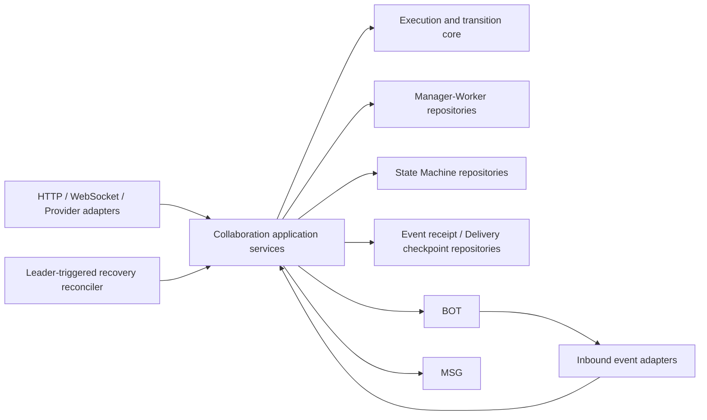
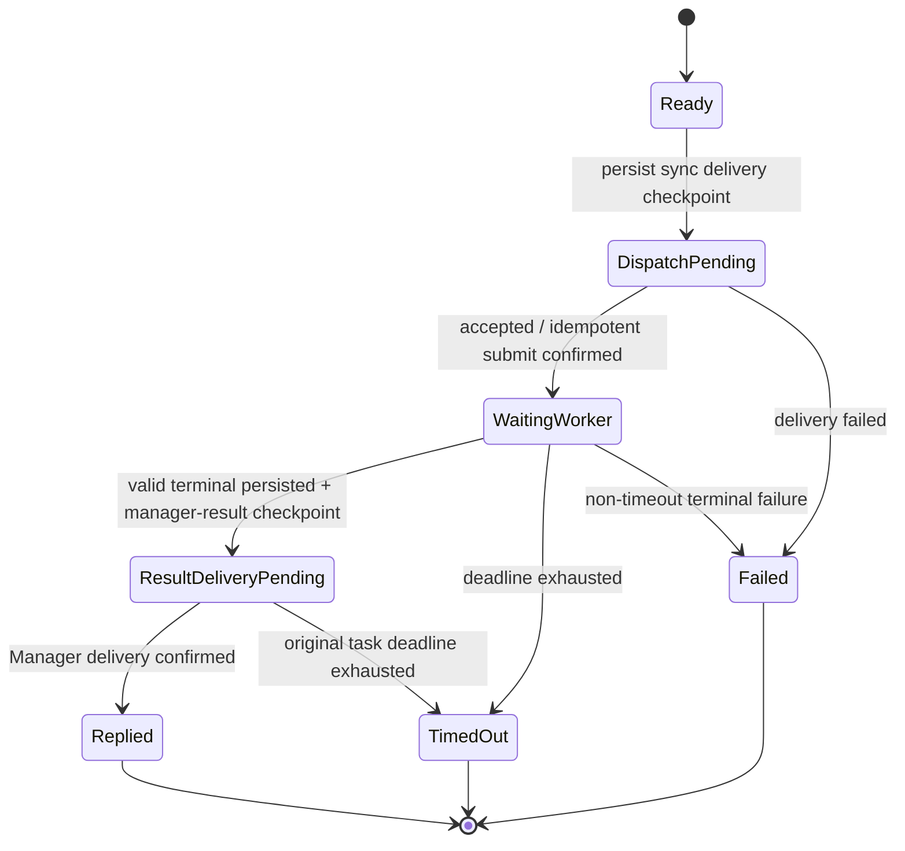

# BCS 群协作状态持久化、FO Recover 与自定义协作重跑设计

- 日期：2026-08-19
- 状态：已批准（实施中）
- 2026-09-14 修订：State Machine 按现有实现采用局部事务、单节点 CAS 和分步推进；§6.3 取代原跨启动/progression 全链路事务要求，以控制锁范围和写放大。
- 范围：BCS `manager_worker` 主从协作、自定义 State Machine 协作、运行恢复与重跑
- 术语约定：本文中的 FO 指 failover / fault recovery
- 相关文档：
  - `docs/arch/arch.rules.md`
  - `docs/arch/ci.enforce.md`
  - `docs/arch/protocol-contract-tests.md`
  - `src/bcs/docs/superpowers/specs/2026-06-30-bcs-platform-coordination-mode-design.md`
  - `src/bcs/docs/superpowers/specs/2026-08-18-bcs-event-subscription-webhook-design.md`
  - `src/bcs/docs/superpowers/specs/2026-08-21-bcs-custom-opening-message-design.md`
  - `src/bcs/docs/plans/2026-08-12-bcn-provider-sse-hitl-design.md`

> 实施门禁：rerun HTTP/副屏、lineage 表结构和 callback lease 可以按独立代码切片开发。
> 手动 rerun 路由启用前，至少必须保证 direct child 原子物化，并且相同 source 的幂等 replay
> 会主动恢复该 child 的 Run start、opening 持久化和仍为 Pending 的 initial frontier；仅发现
> direct child 后直接返回不算 recovery。本期手动 rerun 采用该 request-retry recovery 路径。
> 这不代表完整 State Machine FO 已可发布：无人重试时的后台接管，以及 dispatching/judging/
> progressing/finalizing 的主动恢复，仍必须等待 §8.6、§12.4–§12.5 的 checkpoint 和 reconciler
> 完成后才能启用或宣称。

## 1. 摘要

BCS 当前已经持久化 Group、Session 和消息历史，但两种群协作运行时的恢复能力不一致：

- 主从协作的 task ledger、task 与 provider run 的关联、响应聚合状态仍在进程内存中，BCS 重启后无法可靠判断哪些 Worker 仍在执行，也无法可靠关联迟到的 Worker 回包。
- 自定义 State Machine 已经持久化 run、node run、definition snapshot、participant binding 和 delivery correlation，但只实现了运行节点的超时扫描，没有覆盖 dispatch、judge、下游推进、run finalize 和结果发布的完整恢复。

本文选择以下方案：

1. 统一 FO 和用户 rerun 所依赖的持久化、幂等和 CAS 原语，但不把 Manager-Worker Task 和 State Machine Node 强行合并成同一业务表，也不为 Manager-Worker 新增自动 retry。
2. 为 Manager-Worker 增加持久化 task、attempt 和 delivery correlation。
3. 两种协作共享稳定 event receipt、少量 delivery checkpoint、CAS/必要的 recovery lease、幂等 operation key 和 recovery reconciler；这些能力服务于 FO，不建设通用 inbox/outbox，也不把现有同步正常执行路径改造成异步队列。
4. State Machine 补齐 dispatch、judge、progression 和 finalization 恢复点；Running 内部阶段按需持久化，progression 直接从 Completed 节点结果和不可变 snapshot 重算。
5. FO recover 继续使用同一个 run；State Machine 已有自动 retry 继续在同一个 run 内增加 attempt；用户从头重跑必须创建新的 run，并通过 `rerun_of` 和 `root_run_id` 保存血缘。
6. BCS 只承诺持久化编排状态的可恢复性。对于已经发往外部 Bot/Provider、但结果不明确的请求，本期只在既有协议明确支持相同幂等键时重交，否则等待原 deadline 后按现有状态结束，不承诺无缝接管外部运行。
7. 新建 State Machine Run 沿用 Pending Run/Node 创建、snapshot 保存、Run start、opening 和 initial frontier 的分步顺序；不要求全链路同事务。snapshot 和 opening 历史保存成功前不派发节点；部分提交由失败处理或恢复收敛。
8. Manager-Worker 保持当前同步语义：`task.dispatch` 只有 Worker 投递成功才返回 `dispatched`，Bot 不在线或明确拒绝时直接失败；Worker terminal 结果也先同步投递给 Manager，成功后 Task 才进入 `Replied`。Manager result 普通投递失败继续保持 pending，由 FO 复用同一 checkpoint 恢复；这只是结果交付恢复，不重跑 Worker 或增加 Task attempt。
9. State Machine ServiceInvocation 首次启动保留现有 Session 与 Run 分步调用；rerun 保留已实现的 Session activation、Run/Node/source snapshot 和 lineage 防重事务，不把 opening、audit、checkpoint 和 dispatch 扩入该事务。
10. State Machine 保持现有 0-based attempt 和 `max_attempts` 语义；Manager-Worker 本期固定 `attempt=1`，不新增自动 retry。
11. 本次发布不支持 pre-FO 旧实例与 FO 新实例同时主动执行协作任务；启用主动 reconciler 前必须 drain 并下线旧实例。后续已经遵守本契约的版本可以继续使用常规滚动发布。
12. 本期手动 rerun 只允许以 Failed Run 为 source，并只支持从头执行、沿用 source Run 的 input 和不可变 snapshot；Completed、Aborted 或未结束的 Run 均不可重跑，也不支持从失败节点/指定节点重跑、替换 input、选择 latest snapshot 或复用历史 artifact。

目标语义不是网络意义上的严格 exactly-once，而是：

- 状态转换 effectively-once；
- 外部副作用 at-least-once；
- 通过稳定 operation key、接收侧幂等和 CAS/fencing 避免可观察的重复结果。

## 2. 背景与问题

群协作横跨 BCS 数据库、BCS 进程内状态、Bot WebSocket、HTTP Provider、SSE、Frontend 和 callback。一次执行至少会经历：

1. 创建群或 Session；
2. 创建逻辑任务或 State Machine Node；
3. 向 Bot/Provider 发送请求；
4. 接收 accepted、stream、tool call 和 terminal event；
5. 推进下游任务；
6. 完成 Run、Session 并发布最终结果或 callback。

如果上述步骤只由一个同步调用栈串联，那么进程在任意两个步骤之间退出，都可能留下数据库状态和外部实际执行不一致的窗口。当前主从协作主要依赖进程内存，因此重启后缺少恢复依据；当前 State Machine 虽然已有持久化基础，但仍缺少一个能够从持久化事实重新驱动执行的 reconciler。

用户重跑与 FO 有大量共同基础：二者都需要不可变快照、attempt、幂等交付、事件去重、输出血缘和确定性状态推进。但二者不能使用相同的业务语义，否则会破坏审计、历史展示和重复调用安全性。

## 3. 当前实现盘点

### 3.1 已持久化的公共状态

当前数据库已经保存：

- `bcs_groups`：群配置、状态、策略、版本、参与者和 service spec；
- `bcs_group_sessions`：Session 状态、类型、参与者快照、输入、输出、错误、callback 状态和 `activation_count`；
- `bcs_messages`：Session 消息历史、顺序和关联 run ID。

这些表可以恢复“群和会话存在过、有哪些参与者、已经产生哪些消息”，但不能单独恢复“当前还有哪些协作 work item 在运行”。

### 3.2 Manager-Worker 主从协作

当前 `bcs-message-flow::TaskStore` 使用进程内 `HashMap` 保存：

- task ID；
- group/session scope；
- manager/worker；
- `Dispatched/Replied/Failed/TimedOut` 状态；
- provider run alias；
- response 聚合缓冲和 tool-call 分段标记。

当前 TTL 固定为五分钟，超时状态在读取 ledger 时推导，没有持久化 deadline，也没有 task timeout scanner。

由此产生以下问题：

| 故障点 | 当前结果 |
| --- | --- |
| task 注册后、发送前重启 | task 消失，无法补发或标记失败 |
| Provider 已接受、alias 记录前重启 | 新实例无法把回包关联到原 task |
| terminal event 到达后、标记 replied 前重启 | 重复 terminal 可能被再次处理 |
| Manager 查询 pending task 前重启 | 内存账本为空，可能提前完成 Session |
| response 聚合过程中重启 | 未落消息的流式片段及聚合窗口丢失 |

当前 Manager-Worker `chat.send` 参数中的 `idempotency_key` 为 `null`。因此在“请求是否已被 Provider 接收”不明确时，BCS 不能安全地盲目重发同一次 attempt。

### 3.3 自定义 State Machine 协作

当前实现已经保存：

- `bcs_state_machine_runs`；
- `bcs_state_machine_node_runs`；
- `bcs_state_machine_delivery_correlations`；
- `bcs_state_machine_definition_snapshots`；
- `bcs_group_runtime_bindings`；
- collaboration events。

Node Run 已包含 status、attempt、deadline、max attempts、assignee、delivery request ID、provider run ID、artifact 和 error。节点派发时会先通过 CAS 标记 Running，再保存 correlation，之后才调用 BotDeliveryPort。

当前每秒运行的 State Machine timeout scanner 会先检查 leader，仅处理已经超过 deadline 的 Running Node。它不能恢复以下状态：

- Ready 或 RetryScheduled，但尚未实际派发；
- 已经写为 Running，但派发请求尚未发送；
- Node 已完成，但下游 transition 尚未推进；
- artifact 已保存，但 Judge 尚未完成；
- 所有 Node 已完成，但 Run 尚未 finalize；
- Run 已 terminal，但最终消息、IM 通知或 callback 尚未成功。

当前 Judge 没有独立的持久化生命周期状态。UI 使用 artifact 是否存在派生 `Judging` 子状态，但恢复逻辑不能据此安全 claim Judge 工作。

当前 Chat Session 的最终结果在 Run 标记 Completed 之前发布。发布成功后、Run 状态更新前发生故障，会导致恢复时重复发布结果。

### 3.4 当前重跑能力

当前 Service Session 支持 `reactivate`：将已完成的 ServiceInvocation Session 改回 Running，清理 output/error/callback 并增加 `activation_count`。该实现仍存在 SELECT、校验、UPDATE、重新查询未包在同一事务内的问题。

State Machine HTTP 路由目前支持 start、query、graph、node、human response 和 cancel，没有显式 rerun API，也没有 run lineage。

## 4. 目标

### 4.1 功能目标

1. BCS 重启或 leader 切换后，可以从数据库恢复主从协作和自定义协作的逻辑状态。
2. Manager-Worker 的 pending 判断、terminal 去重和 provider run correlation 不再依赖单实例内存。
3. State Machine 可以恢复 dispatch、provider wait、human wait、judge、transition progression、已有 retry 和 finalization。
4. 支持多实例并发扫描；外部 delivery 由 checkpoint lease 防重，Node 内部恢复阶段由短 recovery lease/CAS 防重。
5. 外部副作用在现有正常路径中同步首次执行，并通过少量 durable delivery checkpoint 支持 FO 补偿；外部 terminal event 通过稳定 receipt key 和业务 CAS 去重。
6. 支持用户对自定义协作执行从头重跑，创建新 Run 并沿用 source input/snapshot。
7. FO、State Machine 已有自动 retry、用户 rerun 在 API、审计和 UI 中具有清晰且稳定的不同语义。
8. 保持已有 State Machine run、node、definition snapshot 和 correlation 数据可迁移、可查询。
9. 保持现有正常执行 API 的同步可观察行为：Manager-Worker `task.dispatch` 不返回 queued/accepted 中间语义，State Machine start 仍在当前请求中尝试初始 dispatch。

### 4.2 可靠性目标

- 已提交的逻辑状态转换 RPO 为 0；数据库事务成功后，重启不能丢失该转换。
- 流式 token 不要求逐 token RPO 为 0；仅保证最后一个持久化 segment boundary 或 terminal artifact。
- RTO 由 leader 选举时间、checkpoint/recovery lease 到期时间和扫描间隔共同决定，并可配置和监控。
- 同一逻辑 terminal event 最多产生一个有效状态转换。
- 同一最终结果对用户至多可观察一次，前提是目标消息、callback 或 Provider 支持 operation key 幂等。

## 5. 非目标

1. 本设计不承诺跨任意第三方 Provider 的严格 exactly-once 执行。
2. 第一阶段不承诺恢复已经断开的原始 SSE TCP 连接。
3. 第一阶段不持久化每一个 streaming token。
4. 不把聊天消息表作为协作运行状态的 source of truth。
5. 不把 Manager-Worker Task 强行建模成 State Machine Node。
6. 不在 delivery adapter 中实现重试、恢复或业务状态推进策略。
7. 不改变 Group、Session、Bot 配置和用户资产的既有实体归属。
8. 本设计不新增 Manager-Worker 的用户重跑入口。
9. 本期不把 `task.dispatch`、State Machine start 或 Manager result delivery 改造成由后台 worker 首次执行的异步队列；后台接管只处理已经持久化且因进程退出、lease 过期或结果歧义而未完成的 checkpoint。
10. 本期不支持 pre-FO 版本与 FO 版本混合运行时的 active collaboration 接管；部署必须提供 drain/停机边界。
11. 本期不为 Manager-Worker 增加自动 retry；失败和超时继续使用现有公开语义，FO 不创建新的 Task attempt。
12. 本期不支持 `from_failed`、`from_node`、artifact reuse、替换 input 或 latest snapshot。
13. 本期不新增 Provider status query、event replay、stream resume 或 cancel capability，也不承诺透明接管 Provider 内部运行。
14. 本期不建设供所有 BCS 业务复用的通用 inbox/outbox，不迁移现有 Webhook delivery、callback dispatcher 或 IM 首次投递机制。
15. 本期不新增公开 Session Run List/运行历史查询 API；rerun 发起方通过 API response、Webhook 订阅方通过
    `state_machine.run.created` lineage 发现新 Run，通用列表的授权、分页和保留策略另行设计。
16. Callback 只增加 FO 所需的 Session 行内 activation-aware claim/lease，不新增公开瞬态 callback status，不保存 channel 级 delivery outbox，
    不改变 callback payload、协议或首次异步发送机制。

### 5.1 本期刻意简化的边界

这些限制是本期范围选择，不是为后续能力预埋的半成品分支：

- 正常执行保持同步：Manager-Worker 不增加 queued 状态或自动 retry，State Machine 首次 dispatch 也不转后台；
- rerun 只从 graph roots 全量新跑，复制 source input/snapshot，不支持局部续跑、替换 input 或 artifact reuse；
- FO 只恢复 BCS 已持久化的编排事实，不扩展 Provider query/replay/resume/cancel 协议；
- 持久化只增加 event receipt、五类协作 checkpoint 和 callback Session lease，不建设通用 inbox/outbox；
- 对外发现只依赖 rerun response 和既有 `run.created` lineage，不同时增加 Session Run List API；
- 首次引入 FO 通过 drain/停机切换，不实现仅服务一次升级窗口的 pre-FO/FO 双版本主动接管协议。

## 6. 核心术语与不变量

### 6.1 Execution、Work Item 与 Attempt

- **Execution**：一次逻辑协作执行。State Machine 对应一个 run；Manager-Worker 对应一个 group/session activation 范围内的协作执行。
- **Work Item**：Execution 内可独立推进和恢复的工作。State Machine 对应 Node；Manager-Worker 对应一个 Worker Task。
- **Attempt**：Work Item 的一次外部执行尝试。State Machine 沿用现有 retry policy；Manager-Worker 本期固定为一次 attempt。
- **Delivery Request ID**：一次 attempt 的稳定交付标识，也是外部幂等键。
- **Provider Run ID**：Provider 返回的外部运行标识，只作为 correlation，不作为 BCS 的业务主键。
- **Recovery**：根据已持久化状态继续同一个 Execution。
- **Rerun**：从历史 Execution 创建一个新的 Execution。

Attempt 的标识语义统一，但为了兼容已有持久化数据和 delivery correlation，物理编号保持模式现状：

- State Machine Node attempt 从 0 开始；当 `max_attempts=N` 时，合法编号为 `0..N-1`；
- Manager-Worker Task 本期固定 `attempt=1`，不持久化或执行新的自动 retry policy；
- operation key 和 delivery request ID 使用各自持久化的实际 attempt，不在 adapter 中做 `+1/-1` 转换。

### 6.2 必须满足的不变量

1. FO 不创建新的业务 run，也不改变原始 definition/input/binding snapshot。
2. State Machine 已有自动 retry 不创建新 run，只增加当前 Node attempt；Manager-Worker FO 不增加 attempt。
3. 用户 rerun 必须创建新 run，原 run 保持不可变 terminal 历史；本期新 Run 从完整 source snapshot 的 graph roots 开始执行。
4. 一个 attempt 对应唯一且稳定的 delivery request ID。
5. Provider Run ID 必须通过持久化 correlation 解析，不能只放在进程内 map。
6. 外部事件只有与当前 attempt、assignee、delivery request 和 correlation 匹配时才能改变状态；由 claim 直接产生的同步写入还必须匹配该 claim 的 fencing token。
7. 旧 attempt 的迟到事件必须记录为 ignored/stale，不能完成新 attempt。
8. Work Item 状态转换必须使用 CAS 或等价的版本条件更新。
9. 可恢复外部副作用在首次发送前保存稳定 operation key 和恢复所需载荷；State Machine 按 §6.3 允许业务状态与 checkpoint 分步提交。Manager-Worker 的 Task/receipt/manager-result checkpoint 局部事务继续按 §8.5、§9.1 处理。
10. Reconciler 的所有决策只能依赖持久化状态和不可变快照，不能依赖进程内缓存是否存在。
11. Delivery checkpoint claim token、Node recovery claim token 和 attempt identity 是不同作用域；不得用一次短 recovery claim 的 token 否定同一 attempt 后续合法到达的 Provider event 或 checkpoint result。

### 6.3 State Machine 事务与分步恢复边界

本节按现有实现收敛 State Machine 的事务要求，适用于普通 DAG 和固定 Loop；实现可以在同一 Store 内合并
少量写入，但不以覆盖整次启动、全部分支或全部下游节点的大事务作为符合本 spec 的条件。

- 保留 `create_run` / `create_run_if_session_idle` 的 Run/Node 局部事务，以及
  `create_rerun_if_session_idle` 的 Session activation、Run/Node/source snapshot、lineage 和防重事务。
- 首次启动的 Session 创建、Pending Run/Node 创建、snapshot 保存、Run start、opening 和 initial dispatch
  可以分别提交；snapshot 内容须一次完整保存。snapshot 或 opening 历史保存失败时不派发节点，返回错误并
  沿用现有启动失败处理。进程退出可能留下部分启动状态，恢复只能使用已保存载荷；缺少不可变事实且无法恢复
  时按启动失败收敛，不能猜测原 Definition、bindings 或 opening。
- 单节点 completion CAS 一次固化 outcome、artifact 和 completed_at；选路从该结果及 snapshot 推导。
  skip、下游 readiness/dispatch 和 Run finalization 可以依次提交，不回滚已完成节点，不重跑其 Bot/Judge。
  Completed 只表示该节点结果已确定，允许其下游尚未推进。
- 不要求为 progression 单独写 `runtime_phase`、逐 edge checkpoint 或逐 skip 恢复游标。Reconciler 对 active
  Run 有界扫描，批量读取节点和 snapshot，重算未完成动作；即使中间节点已 Skipped，也要继续检查其后代。
- State Machine 状态与 delivery checkpoint 可以分步保存；尚未发送的 operation 只有在原始载荷可从持久化事实
  确定时才可幂等补建 checkpoint。首次发送前必须保存所需载荷，不能把缺 checkpoint 一概解释成“从未发送”。
  已发送但结果不明的场景继续遵守原幂等键/deadline 边界。
- 保留既有状态 CAS、attempt/correlation 检查、唯一键和已实现的 eventful transition 局部事务。DB 写入失败必须
  向调用方返回错误，不能静默视为成功；下游补做前重新确认 Run active 和依赖满足。恢复并发仅在需要保护外部
  调用或可变判断时使用短 claim，纯粹重放不可变结果的 progression 依赖目标节点 CAS，不强制新增父节点 lease。
- 当前只有 timeout scanner 和部分 request-retry recovery。放宽事务不代表后台 FO 已完成；完整恢复仍需通过
  分步提交故障注入和多实例测试才能启用或宣称。

## 7. 总体架构



### 7.1 架构分层

按照 BCS 架构约束：

- 纯状态机、attempt、fencing 和 transition 规则属于 `bcs_service_api::core` contract 及其 `services/*` 实现；持久化 DTO 可以继续复用 `bcs-domain` contract types，但本文不把 `domain` 当成额外架构层。
- 现有 `CollaborationRuntimeService` 继续承载正常执行；`CollaborationRecoveryService` 和 rerun use case 属于
  Application Service API，并复用正常路径的状态推进和 delivery port。
- Repository Port 放在 `bcs_service_api::port::repo`。
- MySQL/SQLite 和内存实现放在 store service crate；内存实现用于测试和单机开发，但必须通过与数据库实现相同的 conformance suite。
- HTTP、WebSocket、SSE adapter 只负责协议解析、身份上下文和 Application Error 映射，不拥有恢复策略。
- 具体 Store、LeaderElection 和 BotDelivery 只在 composition root 装配。正常执行和 FO 都调用同一 Application Service/delivery port；reconciler 只在 checkpoint lease 到期或内部恢复阶段到期时触发同一 use case，不新增一套首次异步执行 worker。

### 7.2 逻辑统一、物理分表

本设计不在第一阶段新增一个同时覆盖所有模式的 `bcs_collaboration_executions` 父表，原因是：

- State Machine 已经有成熟的 run/node schema；
- Manager-Worker 的业务约束以 task ledger 和 manager completion 为中心；
- 强行共表会引入大范围迁移和大量空字段，但不会直接提高恢复能力。

统一发生在以下层面：

- Execution/Work Item/Attempt 的语义；
- lease、fencing 和 CAS；
- event receipt、delivery checkpoint；
- recovery candidate 和 reconciler 接口；
- operation key、事件幂等和可观测性；
- rerun lineage 和 snapshot 规则。

物理上保留 State Machine 表，并新增 Manager-Worker task 表。后续只有在跨模式统一查询成为明确需求时，才增加只读 execution index 或物化视图。

## 8. 持久化模型

### 8.1 Manager-Worker Task

新增 `bcs_manager_worker_tasks`，建议字段如下：

| 字段 | 说明 |
| --- | --- |
| `env` | 环境隔离键 |
| `task_id` | BCS 逻辑 task ID，唯一 |
| `group_id` | 所属 Group |
| `session_id` | Chat/Service Session；无独立 Session 的 legacy scope 可为空 |
| `session_activation_count` | Service Session 重激活代次；无独立 Session 时使用 1 |
| `driver_bot_id` | Manager/Driver |
| `target_bot_id` | Worker |
| `target_bot_name` | 创建时显示名快照 |
| `response_mode` | 结果聚合模式 |
| `request_payload_json` | 实际派发输入快照 |
| `request_payload_hash` | 输入完整性和诊断 |
| `status` | Task 公开生命周期状态 |
| `runtime_phase` | 内部恢复阶段 |
| `attempt` | 本期固定为 1；保留字段用于稳定 correlation，不触发自动 retry |
| `delivery_request_id` | 唯一 attempt 的稳定交付 ID |
| `provider_run_id` | 当前 Provider run alias |
| `response_content` | 对 Manager 可见的已持久化结果 |
| `response_full_content` | response mode 需要的完整聚合快照 |
| `response_strip_prefix` | tool-call 分段恢复边界 |
| `response_seen_tool_call` | 是否进入 tool-call 后响应窗口 |
| `manager_result_delivery_request_id` | 将 Worker terminal 结果回送 Manager 的稳定交付 ID |
| `manager_result_delivered_at_ms` | Manager 已确认接收结果的时间；未确认时为空 |
| `timeout_deadline_ms` | 当前 attempt deadline |
| `recovery_after_ms` | 结果不明确时允许 FO 再次判断的时间；不是自动 retry 时间 |
| `version` | CAS 版本 |
| `created_at_ms` / `updated_at_ms` / `completed_at_ms` | 审计时间 |
| `error_message` | 当前或最终错误 |

建议索引：

- unique `(env, task_id)`；
- index `(env, group_id, session_id, session_activation_count, status)`；
- index `(env, status, recovery_after_ms)`；
- index `(env, status, timeout_deadline_ms)`；
- index `(env, provider_run_id)`。

Manager completion 必须按 `(group_id, session_id, session_activation_count)` 查询 durable pending tasks。不能以本地 TaskStore 是否为空为依据。

这里的 pending 不仅包括仍在等待 Worker 的 Task，也包括 `runtime_phase=result_delivery_pending` 的 Task。当前实现只有在 Task Result 成功送达 Manager 后才把 ledger 标记为 `Replied`；持久化切换必须保留这一 completion barrier。

Manager-Worker 建议的内部 phase 为 `ready`、`dispatch_pending`、`waiting_worker`、`result_delivery_pending` 和 `terminal`。`status=Replied` 只能与 `runtime_phase=terminal` 同时提交。本期不存在 `retry_wait`。

### 8.2 Manager-Worker Delivery Correlation

新增 `bcs_manager_worker_delivery_correlations`：

```text
task_id
attempt
target_bot_id
delivery_request_id
provider_run_id nullable
created_at_ms
updated_at_ms
record_status
```

唯一约束：

- `(env, delivery_request_id)` 唯一；
- 非空 `(env, provider_run_id)` 唯一；
- `(env, task_id, attempt)` 唯一。

旧 attempt 的 correlation 不删除，用于识别和审计迟到事件。

### 8.3 State Machine 增量字段

保留现有 run、node、correlation 和 snapshot 表，新增或明确以下字段：

#### Run

```text
root_run_id
rerun_of nullable
session_activation_count nullable  # 新 ServiceInvocation Run 必填；Chat/legacy 可为空
version
```

Chat finalization 由 `chat_result` checkpoint 表示；Service finalization 由 Run terminal 与 Session activation
状态差异表示，不为这两个切片增加重复的 Run `finalization_phase` 列。

#### Node Run

```text
runtime_phase nullable
next_action_at_ms nullable
recovery_lease_owner nullable
recovery_lease_token
recovery_lease_until_ms nullable
version
```

现有公开 `StateMachineNodeStatus` 继续是 Pending、Ready、RetryScheduled 和 terminal 状态的 source of truth。
`runtime_phase` 只补充公开状态无法表达的 Running 内部阶段，建议值：

- `dispatch_pending`
- `waiting_provider`
- `waiting_human`
- `judging`

Pending 表示仍等待上游或未选择分支，Ready 表示已经进入可执行 frontier，RetryScheduled 继续使用现有 retry
字段，Completed/Failed/Skipped 直接表示本节点 terminal。Running 内部阶段仅在恢复需要时持久化；不增加
`Completed + progressing` 组合。Completed 的 outcome/artifact/completed_at 和 snapshot 已足以重算下游推进，
不要求在 completion 前保存一个独立 progressing phase。

### 8.4 Rerun Natural Idempotency

本期 rerun 不接受可变 input、起始节点或 snapshot policy，因此直接使用 `source_run_id` 作为天然幂等标识，不新增
`bcs_state_machine_rerun_requests`，也不要求前端生成 request UUID。`bcs_state_machine_runs.rerun_of` 保存直接父
Run，并对 `(env, rerun_of)` 建唯一约束；NULL 允许多个首次执行 Run，非 NULL 保证每个 Run 最多创建一个直接子
Run。

首次请求原子创建直接子 Run；相同 source Run 的重复请求命中已存在的直接子 Run，不再次增加 Session activation。
若该 child 仍为 Pending，或已经 Running 但仍有 Pending initial node，幂等 replay 必须继续完成 Run start、以稳定
`client_msg_id` 持久化 opening，并只 dispatch 尚未启动的 initial node，然后返回该 child；不能把半物化 child
原样返回并永久占用 lineage。已经 terminal 的 child 只返回现状，不重新执行。
若子 Run 再次 Failed 后需要继续重跑，下一次操作必须以该子 Run ID 作为 source，从而形成无分叉 lineage。副屏
不会把较早 source Run 自动切换或改写为最新后代；用户必须打开当前 Failed 子 Run 后发起下一次重跑。HTTP path
中的 `run_id` 必须始终等于新 Run 的 `rerun_of`，不能由后端静默改写为其他后代。

### 8.5 Durable Event Receipt

本期不建设异步 inbox consumer。外部 terminal/accepted event 仍在当前 adapter 调用栈中同步进入 Application
Service；Application Service 使用一个小型 `bcs_collaboration_event_receipts` 表记录稳定去重事实，并在同一
Repo use case 中提交 receipt、artifact/correlation 和业务状态 CAS：

```text
env
aggregate_kind        # manager_worker_task | state_machine_node
aggregate_id
attempt
dedupe_key
event_type
payload_hash
disposition           # applied | ignored_stale
ignore_reason nullable
received_at_ms
last_seen_at_ms
duplicate_count       # 首次 receipt 为 0
```

优先使用已有协议的 `event_id`；没有稳定 event ID 的 legacy terminal event 使用：

```text
delivery_request_id + attempt + terminal_kind
```

`disposition` 只记录首次接收的业务处理结果：`applied | ignored_stale`。唯一约束为
`(env, aggregate_kind, aggregate_id, dedupe_key)`。首次接收插入 receipt，将 `received_at_ms/last_seen_at_ms` 设为
同一时间且 `duplicate_count=0`；相同 key 和 hash 再次到达时，原子增加
`duplicate_count`、更新 `last_seen_at_ms`，向调用方返回 duplicate outcome，但不把首次 `disposition` 改写为
`duplicate`。相同 key 但 hash 不同视为协议冲突并写安全审计，也不得覆盖原 receipt。Receipt 不保存待消费
payload、不维护 processing/retry/dead-letter 状态，也没有独立 lease worker。后续处理内容保存在 Node
artifact/response 字段；Judge 按需使用 Running phase，progression 使用已 Completed 的 outcome 和 snapshot。

### 8.6 Durable Delivery Checkpoint

新增窄用途 `bcs_collaboration_delivery_checkpoints`。它只记录本期明确需要跨进程恢复的协作副作用及失败收尾事实，不作为
Webhook、callback 或其他业务的通用 outbox：

```text
env
checkpoint_id
aggregate_kind
aggregate_id
operation_kind         # bot_dispatch | manager_result | run_opening | chat_result |
                       # im_terminal | startup_failure（恢复终态事实，不可投递）
operation_key
delivery_request_id nullable
aggregate_attempt nullable
aggregate_version nullable
payload_json
progress_json nullable # im_terminal 的 cleanup marker 与逐收件人进度；其他 operation 不使用
status                 # pending | delivering | delivered | failed | superseded
recover_after_ms nullable
lease_owner nullable
lease_token
lease_until_ms nullable
last_error nullable
created_at_ms
delivered_at_ms nullable
```

`(env, operation_key)` 必须唯一。推荐 operation key：

```text
mwtask:{task_id}:{attempt}:dispatch
mwtask:{task_id}:{attempt}:manager-result
smnode:{run_id}:{node_id}:{attempt}:dispatch
smrun:{run_id}:opening
smrun:{run_id}:chat-result
smrun:{run_id}:im-terminal
smrun:{run_id}:startup-failure
```

State Machine Bot 派发的首个切片复用该表，以 `(env, operation_key)` 为主键，额外索引
`(env, aggregate_id, operation_kind, status)`。实际列只引入本切片需要的 `node_id`、
`aggregate_attempt`、`deadline_ms`、lease 和 error；delivery request ID 与不可变请求保存在 payload 内，
不提前添加尚未使用的 checkpoint ID、aggregate version 或 recover-after 列。Opening 继续只使用历史屏障。
Bot payload 保存已渲染 request、Run/Node/attempt/Group/Session/Bot 身份、原始 started_at/deadline，
以及 WebSocket 或 Provider 的引用（provider ID、Bot ref、protocol version）。不保存 URL、凭据或转发
headers；发送时从可信 registry 解析同一目标引用的当前连接信息，引用变化则按原派发失败策略拒绝。

HumanInput notification 继续复用已有 `bcs_human_input_requests` 持久化状态；Session completion 由 Run/Session
状态差异驱动恢复；callback 使用下述 Session 内最小 claim/lease 状态；Webhook 继续使用现有 Event delivery
store。它们不写入本表。

Callback 不增加 collaboration checkpoint/outbox，但必须扩展 `bcs_group_sessions` 上现有 callback claim 状态，避免正常
dispatcher、FO scanner 和短时双 leader 同时发送同一 activation：

```text
callback_status              # pending | succeeded | partial_failed | failed |
                             # not_applicable
callback_lease_owner nullable
callback_lease_token nullable # FO 版本新建/重激活的 activation 初始化为 0；legacy 保持 NULL
callback_lease_until_ms nullable
```

Callback recovery 使用覆盖 `env/session_kind/status/callback_status/callback_lease_token` 的专用索引，随后判断
lease deadline 并按 `session_id` 游标分页；索引必须先排除 token 为 `NULL` 的 pre-FO 历史行，避免周期扫描退化为
全量历史 pending Session 扫描。每页 callback 恢复使用固定上限的并发发送，不能逐条串行等待下游 HTTP timeout；
下一页游标取派发前本页最大的 `session_id`，不依赖并发完成顺序。

Session completion 后，无 callback config 或 channel 为空时必须把状态确定性写为 `not_applicable`，不能永久保留
`pending`；有 callback 时保持 `pending`。正常首次 dispatcher 和 FO 恢复都必须调用同一个 activation-aware
callback claim use case：用预期 `(session_id, activation_count, callback_status=pending)` 和空闲/过期 lease 做
CAS，并取得 owner/token/lease。`callback_status` 在发送期间仍为 `pending`，只有 claim 成功者可以发送。发送后的
terminal 状态更新必须同时校验 `activation_count` 和 callback lease token，旧 activation 或过期 owner 不能覆盖
当前状态。lease 过期后可由 FO 接管；若接收方不支持幂等，崩溃发生在“远端已接收、terminal CAS 未完成”窗口时
仍可能重复，callback 对外继续是 at-least-once。`callback_lease_token IS NULL` 的 pre-FO 历史 Session 不进入主动
callback 恢复，避免发布后补发历史回调。

这是 FO/rerun 所需的 Session 内最小恢复状态，只约束 callback 的 claim 和确认；不保存 channel 级 payload 或
重试队列，不改变 callback payload、channel protocol 和现有首次异步发送方式，也不建设通用 callback outbox。
Callback config 继续按现有 dispatcher 在实际 claim/发送时从 Group 读取；同一次 claim 使用读取到的配置，但不把
配置快照写入 Session。因崩溃导致 lease 接管时可能读到更新后的 Group config，这是本期保留现有 dispatcher、
不引入 callback outbox/snapshot 的明确取舍；若要求严格复用首次 target/config，需另立 callback delivery contract。

`run_opening` checkpoint 的 `payload_json` 必须保存已经使用该 Run ID 渲染完成的 opening 内容、
`component`（如有）、确定性的 `client_msg_id={run_id}:000-panel` 和目标 Session。不能只保存 Group ID 后在
FO 时重新读取当前 `opening_message`。这份不可变 rendered payload 可以在 Run 创建后独立保存，不要求跨 Group、
Message 和 Collaboration Store 建立一个数据库事务；缺少原始载荷时不能重渲染并声称恢复了原 opening。
保存后，当前请求使用确定性 client message ID 幂等写入消息历史。

`run_opening` checkpoint 的完成 barrier 是确定性 opening 消息已经存在于 Session 历史。实时前端 publish 在
该 barrier 之后由当前请求同步尝试，但 publish 超时或失败不把 checkpoint 改回 pending，也不阻塞 initial
frontier；前端通过消息历史恢复。本文不为实时 publish 增加 durable retry。

`run_opening` 只写本地幂等消息历史，不覆盖不确定的外部投递：复用 MessageRepo 的固定 message_id
主键唯一性（`message_id=client_msg_id={run_id}:000-panel`）和 checkpoint pending → delivered CAS，不额外取得外部 delivery lease。写入返回的历史必须与已保存的
Session、Run、client ID、content/component 一致，冲突不能当作 barrier 成功。正常启动先保存 rendered payload，
再启动 Run 和写历史；Pending/Running Run 从同一有界扫描恢复，只有显式 checkpoint 的 initial frontier 才可恢复。
未保存原 opening 的历史或并发创建窗口保持明确诊断，不读取当前 Group 重渲染；缺事实启动的最终失败收敛还需
独立的超时/存活判据，不能因某次扫描读到未完成创建就误杀正常启动。

State Machine 业务状态转换和 checkpoint INSERT 按 §6.3 分步提交；Manager-Worker 保留其声明的局部事务。
checkpoint 保存后可以由当前请求 claim，再通过既有 delivery port 同步发送，并在返回 API/WS response 前写入
delivered、确定性 terminal failed，或结果不明确的 `recover_after_ms`。其中 Manager result 的普通投递错误不是
terminal failed：checkpoint 必须保持 pending 并设置下次恢复时间；原 Task deadline 耗尽时 Task 进入 TimedOut，
该 checkpoint 随之 superseded。

同步语义固定为：

- Manager-Worker `task.dispatch` 只有目标 Bot/Provider accepted 后才返回现有 `dispatched`；Bot 不在线、目标解析失败或 Provider 明确拒绝时，checkpoint 和 Task 一起进入确定性失败状态，并返回当前相同错误，不进行后台首次投递，也不返回 `queued`；
- Manager result delivery 保持当前同步调用；成功后 Task 进入 `Replied`，普通投递错误继续保持
  `ResultDeliveryPending`，由现有调用或 FO 使用同一个稳定 checkpoint 重试，不增加 Task attempt；原 Task deadline
  耗尽后才进入 `TimedOut`。同步调用未完成、返回错误、ACK 丢失或结果不明确时，均由 FO 在 checkpoint 到期后
  接管同一次结果交付；
- State Machine start/rerun 在完成各自必要的 Run/snapshot 保存后，仍由当前请求按“opening 消息幂等持久化、实时发布、initial frontier dispatch”的顺序同步执行；opening 历史持久化失败时不派发节点并沿用现有启动失败语义，实时前端发布失败仍是非致命且由消息历史恢复；HTTP 仍保持现有 accepted response 时点，不把首次 dispatch 延后到后台 worker；
- callback、IM 和 Webhook 继续使用各自现有首次同步/异步路径；callback/Webhook 不写本表，callback 只增加
  Session 内 activation-aware claim/lease，`im_terminal` checkpoint 只补 IM 的 FO 恢复事实，不改变首次发送机制。

Reconciler 只 claim lease 已到期且仍为 pending/delivering 的 checkpoint，并调用与正常路径相同的 Application
Service/delivery port。交付结果通过 checkpoint token 和 aggregate attempt/version 校验后 CAS 推进；不新增独立
recovery delivery worker 或 internal inbox consumer。

Checkpoint `lease_token` 只保护该 operation 的 claim/确认。State Machine Judge 使用 Node 自己的短
`recovery_lease_token`；Completed 结果的 progression 重放依赖目标节点 CAS，不强制单独 claim 父节点。
Manager-Worker 不再额外保存 Task lease。Provider event 的有效性仍由 delivery request、
attempt、assignee、correlation 和业务 CAS 判断。

执行现有 State Machine Run/Session cancel 时，先持久化取消状态，再幂等地把尚未开始投递的 dispatch/result
checkpoint 标记为 `superseded`，允许分步提交。Reconciler 在真正发送前再次校验 Run/Session；本期不新增 Provider cancel capability、cancel checkpoint、
Manager-Worker Task cancel API 或新的 Task `Cancelled` 状态。

### 8.7 Snapshot

FO 必须使用原 Execution 的不可变快照。State Machine 继续使用 definition snapshot 和 resolved participant bindings；Manager-Worker 在 task 创建时保存实际 payload、manager/worker identity、response mode 和 timeout。本期不新增 Manager-Worker retry policy。

State Machine 保留“创建 Pending Run/Node、保存 snapshot、随后启动”的现有调用路径。首次 Run/Node 创建
沿用现有局部事务，snapshot 使用独立 repository command；不要求 initial frontier、audit、opening 和 dispatch
checkpoint 同事务预创建。仅实际派发/激活的节点进入 Running，其余节点保持 Pending/Ready。

snapshot 保存成功后，当前请求继续启动 Run、幂等持久化 opening，再同步派发/激活 initial frontier。
实时前端发布失败不阻止节点，但 snapshot 或 opening 历史尚未成功持久化时不得派发。Reconciler 遵守相同
应用层顺序；已保存的原始载荷足够时补做未完成步骤，载荷缺失不可恢复时按启动失败收敛，不读取当前配置补造。

Memory 和 DB 实现分别验证局部事务及步骤间失败边界。首次升级前仍需 drain 或确定性终止 pre-FO active Run；
不能仅因为其状态是 Pending/Running，就假设具有完整主动恢复所需事实。

### 8.8 FO Intermediate State Source of Truth

FO 依赖中间状态持久化，但不依赖某个进程的内存对象。状态统一保存在 BCS 数据库：

| 状态 | 持久化位置 |
| --- | --- |
| Manager-Worker Task、attempt、deadline、response aggregation boundary | `bcs_manager_worker_tasks` |
| Manager-Worker delivery request 与 Provider run alias | `bcs_manager_worker_delivery_correlations` |
| State Machine Run terminal/finalization/lineage | `bcs_state_machine_runs` |
| Node public status、runtime phase、attempt、artifact、outcome 和 completion time | `bcs_state_machine_node_runs`；progression 从结果与 snapshot 重算 |
| definition、participant binding 和 policy snapshot | `bcs_state_machine_definition_snapshots` 及现有 runtime binding snapshot |
| 外部 terminal event 去重事实 | `bcs_collaboration_event_receipts` |
| 本期声明的可恢复协作副作用 | `bcs_collaboration_delivery_checkpoints` |
| Service callback status、activation-aware claim/lease | `bcs_group_sessions` |
| 详细恢复过程 | collaboration events/audit records |

Group、Session 和 Message 表继续保存各自拥有的公共业务事实，但不能替代上述协作中间状态。进程内 TaskStore、stream buffer 和 alias cache 可以作为 fast path/cache，重启后必须能从数据库事实重建；Provider 仍拥有外部 run 的实际执行状态，BCS 只保存稳定 delivery key、Provider run correlation 和最近确认进度。

FO 从最后一个 durable phase 继续，因此不保证恢复尚未 checkpoint 的逐 token streaming 内容。若 checkpoint
只表明“请求可能已发送”，系统只能在既有协议确认支持相同 idempotency key 时用同一 delivery request 重交；
否则等待原 deadline 后按该操作现有语义收敛，不能创建新 attempt，也不能把内存缺失解释成任务未执行：
dispatch 可以 Failed/TimedOut，Manager result delivery 只能保持 pending 至原 Task deadline 后 TimedOut。

## 9. 状态模型

### 9.1 Manager-Worker Task



为保持现有 ledger 输出兼容，公开状态继续映射为 Dispatched、Replied、Failed、TimedOut；数据库内部只区分
Ready、DispatchPending、WaitingWorker、ResultDeliveryPending 和 terminal，以便选择恢复动作。本期没有
RetryWait 或 attempt increment。

Worker terminal event receipt、terminal artifact 和 `manager-result` checkpoint 必须在同一事务中提交。当前请求
随后同步尝试把结果送给 Manager；`ResultDeliveryPending` 期间公开 ledger 仍视为 pending。FO 对 dispatch 或
manager-result 的恢复都不增加 Task attempt。Manager result 的普通投递失败不把 Task 改为 `Failed`，而是保留
同一 checkpoint 继续重试；只有原 Task deadline 耗尽后才进入 `TimedOut`。这保持当前 Manager completion 依赖
pending ledger 清空的语义。

### 9.2 State Machine Node

State Machine 继续以公开 Node status 表示 graph/terminal 状态，只对 Running 增加内部 runtime phase：

```mermaid
stateDiagram-v2
    [*] --> Pending
    Pending --> Ready: selected and all upstreams satisfied
    Ready --> DispatchPending: CAS Running; then persist checkpoint
    Pending --> DispatchPending: selected and upstreams satisfied; direct CAS
    DispatchPending --> WaitingProvider: delivery accepted
    WaitingProvider --> Judging: terminal artifact persisted
    Judging --> Completed: CAS persists outcome and artifact
    WaitingProvider --> Completed: no Judge; CAS persists complete outcome
    WaitingProvider --> Failed: CAS failure and saved action
    Judging --> Failed: explicit Judge failure and saved action
    WaitingHuman --> Failed: timeout and saved action
    Failed --> RetryScheduled: saved retry decision
    Failed --> [*]: saved fail_run decision; Run failed
    RetryScheduled --> Ready: existing retry due
    Ready --> WaitingHuman: human_input activated
    WaitingHuman --> Judging: human response persisted
    WaitingHuman --> Completed: no Judge; CAS persists response and outcome
```



Completed 后在当前调用栈继续执行 progression，公开状态不回到 Running。HumanInput 继续使用已有持久化
`bcs_human_input_requests` 状态和同步通知路径，不再复制一份 collaboration delivery checkpoint。

单纯 FO 恢复 `Judging` 必须复用已持久化 artifact，在同一 attempt 上继续 Judge，不能借 FO 触发新的 retry。
State Machine 既有 timeout/retry policy 保持原语义，本 spec 不新增 Judge retry 分支。

Bot Node CAS Running 时进入 `dispatch_pending`，保存不可变 checkpoint 后才可 claim；checkpoint 的
`pending → delivering` 必须先于外部 IO 持久化。发送开始后不因 lease 过期恢复成 pending。ACK 将 checkpoint
标记 delivered，并在一个 checkpoint/Node 局部事务内把仍处于 dispatch_pending 的 Node 改为 waiting_provider。
Bot 结果可能早于 ACK 到达，因此 dispatch_pending 与 waiting_provider 均允许原结果 CAS；已开始 Judge 或完成
的 Node 拒绝迟到 ACK 改写。恢复根据 checkpoint 而非单独根据 Node phase 决定能否首次发送。

Judge 输入提交在同一 Node CAS 保存 `runtime_phase=judging`、artifact 和 Human responded_by；同一 attempt
的输入只接受首次写入或完全相同的 replay。普通请求和恢复使用同一 owner/token/until 短租约，claim 时递增
token，提交时校验 Run active、Node Running、attempt、phase、owner、token 和未到期的 lease。Judge 结果、
Node completion/failure、既有 Judge audit 和可选 node.completed Event 在单节点局部事务中提交；失败时仍保存
原 retry/fail_run 决策。成功提交清理 lease；本地准备/写入报错时条件释放，进程退出才等待到期接管。
已提交的 Judge 不重复调用；远端已返回但本地事务尚未提交时允许同 attempt 重新判定，不承诺远端 exactly-once。
只有 artifact 而无显式 judging phase 的历史 Running 不自动接管；租约过期不增加 attempt，也不重跑 Bot。

已明确失败的 attempt 与尚在 Judging 的 attempt 分开恢复。Failed CAS 在同一 Node 行保存 error、completed_at
和 `failure_action=retry|fail_run`。Bot terminal error/aborted、空可见输出、Judge 和 timeout 失败按既有 max attempts
选择 action；派发拒绝/调用失败保持现有直接 FailRun 策略。恢复沿用已保存的决定：retry 以原 attempt 的 CAS 创建
下一 attempt；fail_run 使用原 error 终结 Run。Run 仍须 Running，旧 attempt 不得影响新 attempt，取消后不派发。
RetryScheduled 提交时清除旧 action，不要求 Node 失败、RetryScheduled、Run/Session 收尾同事务提交。保存的
FailRun 不允许由 retry CAS 改写；无 action 的历史 Failed 明确报错，不能解析错误文本或读取当前配置猜测策略。

completion CAS 提交本节点 outcome、artifact 和 completed_at 后，按现有顺序同步 skip 未选择分支、检查
upstream barrier、派发满足条件的下游。各节点更新分别提交，不要求全图或整个 Loop 的 skip/frontier 同事务。
可直接沿用 Pending -> Running 的派发 CAS，不为满足本 spec 强制多写一次 Ready 状态。

进程退出或某一步写入失败后，已 Completed 节点保持不变；reconciler 从它的结果和原 snapshot 重算，补做仍未
完成的 skip/dispatch。恢复 skip 遍历不能遇到已 Skipped 节点就截断其后代。重复重算可以发生，但目标节点 CAS
和稳定 delivery request ID 防止重复有效启动。部分 progression 不能被误判为整个 Run 已完成。

### 9.3 Run Finalization

本期保持现有 finalization 的对外时序，不把首次结果发布改成统一后台投影，只在每一步前后增加 durable phase/checkpoint，使 FO 能够判断最后完成到哪里。

Chat Session 保持“先同步发布 chat result，再把 Run 标记 terminal”的现有行为：

1. 所有 Node 完成/跳过后，先独立保存 `smrun:{run_id}:chat-result` checkpoint，冻结 Run/Group/Session、发起 Bot、最终文本、消息时间及原截止时间。checkpoint 本身表示 finalizing，不重复增加 Run phase 列；
2. 当前请求和 scanner 共用 Pending claim、owner/token 短租约，先持久化 Pending → Delivering，再同步调用既有 result publisher；
3. publisher 明确返回成功后，fenced CAS 将 checkpoint 标为 Delivered，再独立将仍 Running 的 Run CAS 为 Completed。Run 写失败时只重做收尾，不重新调用 publisher；明确调用失败先保存 Failed/error，再沿用原 Run Failed 策略；
4. 原始消息历史使用固定 `message_id=client_msg_id=state-machine-result:{run_id}`，并校验保存的目标、sender、文本、时间、visibility/audience。消息历史存在只证明本地写入，不证明后续路由已完成。

现有 message-flow 的非排队路由会生成新的 Bot delivery run ID，因此 **稳定 client message ID 不等于整个
publisher 的重投幂等**。本切片不改变首次路由行为，也不新增通用消息 outbox：Pending 可在原截止时间内首次
发送；Delivering 即使 lease 过期也不重发。发送成功但 ACK 未落库、超时或进程退出都属于结果未知，Run 暂保
Running，原截止时间到达后保存 publication Failed 并将 Run 置 Failed，错误明确说明结果可能已经送达。
这不承诺最终消息必达或恰好一次远端副作用；若要透明重投，须先给全部 message-flow 分支补齐可验证的幂等
acceptance 合同。调用明确失败也可能发生在部分发布之后，继续沿用现有失败语义。

原截止时间为最终 Node 完成时间加 90 秒；每次 claim 最长 30 秒，publisher 调用受同一 lease 时间界限约束，
恢复不能延长原期限。取消/终态 Run 阻止新的 claim/send/ACK，已发出的 IO 不能撤回。存储写失败返回错误，
不冒充 publisher 拒绝、不丢失发送标记。保存后发送前失败可接管；保存前失败可以从原 snapshot 和全部 terminal
Node 重建载荷，因该版本在保存成功前绝不发送。仍遵守 §18 的 pre-FO drain 和禁止混合实例主动恢复规则，
不据此补发旧版本可能已发布但未记录 checkpoint 的历史 Run。终态遗留 checkpoint 的有界清理单独验收。

ServiceInvocation Session 保持“Run terminal 后完成 Session，再触发 callback/IM”的现有行为：

1. CAS 将 Run 标记 Completed/Failed/Aborted；
2. Completed/Failed 先独立保存 `smrun:{run_id}:im-terminal`：从原 snapshot/Run 及已有 HumanInput requests
   冻结 Session activation、收件人、原通知文本与 Run 完成时间加 90 秒的截止时间，准备阶段不发送；Aborted
   保持原来不发终态 IM 的行为。保存失败返回错误，Session 留在 Running 供恢复补做；
3. 当前请求通过 activation-aware Session use case，以 `(session_id, session_activation_count)` CAS 完成 Session；
4. Session completion 后沿用现有 callback dispatcher 和同步 IM 发送。Callback 的 durable 恢复事实是该
   activation 已 Completed、`callback_status=pending` 且 callback lease 空闲或已过期；IM 单独 claim checkpoint；
5. Reconciler 扫描“terminal Run + 同 activation Session 仍 Running”并补做第 2、3 步，同时用独立有界 Run
   游标扫描 pending IM checkpoint，覆盖已经 Completed 的 Session；callback 保持其既有恢复路径。不要求
   Session、callback、IM 三类 Store 共享一个新事务。

IM checkpoint 的 `payload_json` 不可变，`progress_json` 保存 cleanup 完成标记及每个收件人的
`pending | sending | delivered | failed`。父记录只有全部收件人终结且 cleanup 已完成才进入 Delivered/Failed；
无收件人时只完成原 cleanup 后记 Delivered。一个收件人成功不能掩盖其他收件人的未完成状态。沿用原请求关闭、
reset 观察和队列推进逻辑；WaitingHuman 通知自身的跨进程语义仍单独验收。

每次 claim 最长 30 秒，发送标记和 ACK 都校验 owner/token/lease、原 Run 及同一 Completed Service activation。
绑定不可用等只读预检失败可以保留 Pending，每隔至少 1 秒重试，不能延长原 90 秒期限。调用 Channel 前先持久化
Sending；成功后保存 provider message ref，其他收件人继续独立处理。Channel delivery 没有统一幂等保证，故
调用错误、超时、发送后 ACK 写失败或进程退出都可能已送达；恢复遇到 Sending 将该收件人明确 Failed，绝不重发。
固定 `state-machine-terminal-{run_id}` 只复用现有发送身份，不被当作远端恰好一次保证。确定未发送且已到期的
收件人也终结为 Failed；新 activation/失效 Run 将旧 Pending checkpoint 标为 Superseded。存储错误传播给调用方，
不改写为发送失败。原文已保存后不读取当前 Definition 重新渲染。仍要求 pre-FO drain，不能补造历史 Completed
Session 的未记录通知，也不承诺远端通知必达。

旧 Run 的迟到 finalization 不能完成或通知新的 activation。Callback/IM 暂时失败不能把已经 terminal 的 Run
改回 Failed。Chat Session 不执行 Session completion，也不创建 Service callback。Callback dispatcher 必须使用
完成 CAS 后、属于该 Run `session_activation_count` 的 Session snapshot；内部 claim、审计和状态确认使用该
activation，但本期不向既有 channel payload 新增字段。无 callback config 或 channel 为空时状态必须进入
`not_applicable`；rerun 只在 callback 为 `not_applicable` 或 delivery terminal 状态时允许增加 activation。

## 10. Recovery Reconciler

### 10.1 触发方式

Reconciler 在以下时机运行：

- BCS 启动完成后；
- 当前实例获得 leader 后；
- 周期扫描 tick；
- 外部 event receipt 与业务状态提交后进行低延迟定向 reconcile；
- operator 明确触发诊断时，只能唤醒 reconciler，不能绕过状态机直接改状态。

LeaderElection 用于减少全局扫描竞争，但不能代替行级 claim。即使出现短时双 leader，lease、fencing 和 CAS 也必须阻止重复推进。

### 10.2 Claim 协议

外部 delivery 只 claim checkpoint row：

```sql
UPDATE bcs_collaboration_delivery_checkpoints
SET lease_owner = ?,
    lease_token = lease_token + 1,
    lease_until_ms = ?
WHERE checkpoint_id = ?
  AND (lease_until_ms IS NULL OR lease_until_ms < ?)
  AND status IN ('pending', 'delivering');
```

确认结果必须携带 checkpoint `lease_token`，并再次校验 aggregate attempt/version。过期 owner 不能确认
checkpoint 或推进业务状态。

State Machine `Judging` 使用 Node 上的独立短 recovery lease；Completed 节点的 progression 重算使用下游
CAS，不强制为每个父节点追加 claim/release 写入。Manager-Worker Task 不保存第三套 lease。
Claim 只覆盖确有并发保护需要的短动作或 delivery 调用，不覆盖远端 Bot 运行周期。

Callback 不使用上面的 checkpoint SQL，但遵循同样的 fencing 原则：正常 dispatcher 和 FO 都必须通过 Session
Repository 的 activation-aware callback claim，从 lease 空闲或已过期的 `pending` 取得 owner/token；terminal
状态更新校验相同 activation 和 token。没有 callback 配置时由同一 use case 收敛为 `not_applicable`。

短状态推进完成后使用 owner/token 条件清理 lease。不得依赖 lease 自然过期作为正常释放机制；自然过期仅用于
进程退出后的 FO 接管。

### 10.3 确定性恢复规则

| 持久化状态 | Reconciler 动作 |
| --- | --- |
| Run Pending 或启动未完成 | 校验原 snapshot/opening 恢复载荷；事实完整时补做启动，缺失且无法恢复时按启动失败收敛，不使用当前配置补造 |
| Node Pending | 根据原 snapshot、上游 terminal 状态和已选择 outcome 重新计算；满足条件进入 Ready 或直接调用现有 dispatch CAS，不可达分支进入 Skipped |
| Ready | 当前请求或 reconciler 使用同一 activation/dispatch use case；BotTask 原子转为 Running/DispatchPending，HumanInput 复用已有 request store 激活 |
| DispatchPending，发送结果未知 | 既有协议确认支持相同 idempotency key 时用原 delivery request 重交；否则等待原 deadline 后确定性失败/超时 |
| WaitingProvider | 等待既有 event 或 deadline；State Machine 到期后沿用已有 retry policy，Manager-Worker 到期后 TimedOut，不由 FO 新增 attempt |
| Manager-Worker ResultDeliveryPending | 当前事件处理先同步投递；普通投递错误保持 pending，并由现有调用或 FO 继续使用同一 manager-result checkpoint；确认送达后进入 Replied，原 Task deadline 耗尽后进入 TimedOut，不增加 attempt |
| WaitingHuman/Ready HumanInput | 使用已有 HumanInput request 状态恢复通知，不重新创建逻辑 interaction |
| Judging | claim Judge，使用已持久化 artifact 恢复判断，不重跑 Bot |
| Node Completed，下游未推进完 | 从已保存 outcome 重算 transition，继续未完成 skip 并用目标 CAS 派发；不新增独立 progressing phase，不重跑本节点 |
| RetryScheduled | 按 State Machine 现有规则在到期后增加 Node attempt 并进入 Ready；Manager-Worker 没有该状态 |
| Node terminal，Run active | 检查下游、跳过分支和 Run 完成条件 |
| 所有 Node terminal，Run active | 按 Session kind 恢复现有 finalization 顺序 |
| Chat Run finalizing + chat-result checkpoint | Pending 在原 deadline 内首次发送；Delivered 补交 Run Completed；Failed 补交 Run Failed；Delivering 不重发，到期按结果未知失败 |
| Service Run terminal + Session 同 activation 仍 Running | Completed/Failed 先保存原终态 IM intent，再 activation-aware CAS 完成 Session；Aborted 不发 IM |
| Service Session completed + im-terminal checkpoint pending | 短 lease 与 activation fencing 下按逐收件人进度恢复；仅预检前的 Pending 可发送，Sending/unknown 不重发，旧 activation 记 Superseded |
| Service Session completed + callback_status pending，lease 空闲 | activation-aware claim lease 后调用现有 callback dispatcher；无配置时写 not_applicable，不创建 collaboration callback outbox |
| Service Session completed + callback_status pending，lease 过期 | 用同一 activation 重新 claim；旧 token 不能确认，新 owner 按 at-least-once 语义恢复发送 |
| State Machine Run/Session cancelled/aborted + checkpoint pending | 将未发送 operation 标记 superseded；已 accepted 的外部 run 仅忽略迟到事件，本期不新增 Provider cancel capability |

### 10.4 Dispatch 歧义窗口

最危险的情况是 HTTP 请求或 WebSocket 写入已到达 Provider，但 BCS 在收到 ACK 前退出。

本期不新增 Provider 查询、replay 或 cancel 协议。恢复规则固定为：

1. 如果当前 delivery port/协议已经明确保证相同 idempotency key 幂等，使用原 delivery request ID 重交；
2. 如果已持久化 `provider_run_id`，继续等待该 correlation 的既有 event；
3. 其他情况不盲目重发，等待原 deadline；
4. State Machine 到期后只按已有 retry policy 决定是否创建新 Node attempt；Manager-Worker 直接 TimedOut/Failed；
5. 迟到事件按 receipt + current attempt/correlation 判断为 stale，不推进当前状态。

当前 `BotDeliveryPort` 没有统一的幂等重投保证。State Machine 的 pending checkpoint 表示发送标记尚未
提交，可在原 deadline 内 claim 后首次发送保存的请求；delivering 表示发送已开始或结果未知，恢复只等待原
correlation 的结果与原 deadline，不补发。即使进程恰在发送标记提交后、真正 IO 前退出，也遵循这一保守边界。
Delivered 不触发重新派发；明确拒绝或调用失败先保存原错误，再沿用既有直接 FailRun 策略，不能借恢复改成 retry。

到期处理必须在一个 checkpoint/Node 局部事务中同时校验 Pending/Delivering、原 deadline、Run active、Node
Running、attempt 和无 artifact，保存 Failed 与 retry/fail_run 决策并 supersede checkpoint；ACK 和结果若先提交，
过时扫描不得覆盖它们。SQL 按 checkpoint 后 Node 的顺序锁定，避免 ACK 与到期事务反向持锁。正常终态/取消和
活动 Run 扫描会 supersede 失效 attempt 的未完成 checkpoint；终态 Run 使用独立有界清理游标收敛遗留工作。
Node timeout 为 None 时，checkpoint 固化原 Provider timeout 作为歧义截止时间；已经确认派发的 Node 仍保持
禁用 timeout，不因该 fallback 被超时。缺失 checkpoint 不能视为未发送或重建当前请求；没有原 deadline 的
缺失载荷场景按下节的准备宽限期收敛，不把缺记录视为“从未发送”。

#### 10.4.1 原始事实缺失与创建者准备窗口

新版本创建者在保存 snapshot/opening/dispatch 后才进入对应发送路径，但分步写之间会暂时缺少载荷。
缺记录、当前进程内没有 Future、连续扫描次数均不能证明创建者死亡。本期采用固定、不可续期的准备宽限期，
到期表示允许撤销尚未完成准备的请求，而不是判断其进程是否存活；不增加心跳、创建者注册表或常态写入。

- 缺 snapshot/opening：从 Run 保存的 `created_at` 起保留 90 秒。期间只报告诊断；到期后 repository 在同一
  条件更新中重查 Run 仍 Pending/Running、创建时间一致且该原始事实仍不存在，才标为 Failed。创建者补齐事实
  或其他调用先提交 terminal 状态时，过时收敛无效。前台已明确遇到准备写失败时可立即使用同一条件更新。
- Failed 与 `smrun:{run_id}:startup-failure` 的类型化事实在一个小事务中提交；保存 Run/Session/activation、
  缺失类型、原创建时间、失败时间及原错误。写记录失败必须回滚 Run 变更。该记录使用既有 checkpoint 表，
  `operation_kind=startup_failure,status=failed`，没有发送/claim/retry worker；不新增 schema 或 migration。
- Session 仍独立完成：缺 snapshot 时只允许严格匹配上述持久化失败事实的 Failed Run 完成原 Service activation
  并触发现有 callback。不能仅凭错误文本或当前 Session 推断原 activation；不能读取当前 Definition 补造流程名、
  结果或终态 IM。已有 snapshot 的缺 opening 失败沿用原终态 Session/IM 路径。Session 写失败由现有恢复页补做。
- Running Bot 缺 dispatch checkpoint 且尚无 artifact：有原 `timeout_deadline_ms` 时等到原 deadline，并保存原
  max_attempts 对应的 Retry/FailRun；没有节点 deadline 时使用保存的 `started_at + 90 秒`，到期 FailRun，不
  因当前 Provider 配置推导 deadline、不新增 attempt。历史行连 started_at 也缺少时，使用 Run 原 created_at
  作为这条不可恢复准备记录的最后宽限依据。条件更新重查 Run active、Node Running、attempt、无 artifact、
  checkpoint 仍不存在且未保存 Provider run ID；已保存载荷、已完成结果和取消均胜过过时扫描。已有 Provider run ID
  即为受理的正向证据，即使缺 checkpoint 也继续等原事件或原节点 timeout；已确认派发且关闭 timeout 的 Node 不受影响。
- 晚恢复的创建者不能重新启动 Failed Run，不能为已经 Failed/更换 attempt 的 Node 保存新的 dispatch checkpoint，
  也不能取得发送屏障。到期前已发出的远端操作无法撤回；缺载荷的旧 attempt 永不被重发。正常路径仍使用原来
  的状态/CAS 屏障，不添加全图事务或恢复专用外部协议。

只把缺失事实纳入这一规则，现存但损坏/不支持的 snapshot 或 checkpoint 仍明确报错。恢复 v2 已保存计划仍遵守
执行开关；完全缺 snapshot 时只提交受约束的失败，不执行工作流。历史写入方必须先 drain，禁止不遵守发送屏障
的旧版本与主动恢复混合运行。该项不能替代真实多实例/强杀和完整 FO 验收。

该规则只能恢复 BCS 已持久化的编排事实，不宣称透明接管 Provider 内部运行。

#### 10.4.2 终态工作清理与人工通知恢复

终态清理使用既有 Run 索引，分别按 Completed/Failed/Aborted 读取排他的 Run ID 游标并合并有界页面。
每页最多 32 个 Run；每个 Run 至多退休 32 条未完成 dispatch/Chat checkpoint，并清除至多 32 个 Node
的内部 phase/lease。每次写入重新校验 Run 仍为终态；中途写失败保留已经完成的部分，后续游标轮转续做。
不删除 payload、结果、事件、lease token 或已确认送达记录，不更改 Run/Node 业务状态，不发外部消息。
Opening、startup-failure 和 terminal-IM 事实不属于此清理范围。页面会遍历保留的终态 Run，包括已清理的历史；
这是有界扫描，不是历史归档或数据库空间回收，也不保证一轮清完单个大 Run。

人工通知继续使用原 HumanInputRequest 表/文件和同一个逻辑 request ID，新增字符串状态
`notification_pending`，无 schema/migration 变更：

- enqueue/排队提升占用 reply scope 后保存 `notification_pending`，表示尚未跨过外部发送屏障。
- 只读 Provider 预检后，核对原 Run、Session activation、Running 人工节点、尚无 artifact 和完全相同的原 deadline。
  request 的 `notification_pending → notifying` CAS 是唯一发送权；`delivery_attempts` 在这一刻加一，ACK 不再加一。
- `notifying` 表示发送中或结果未知，包括旧版本遗留且 attempts=0 的记录；重启/竞争实例永不据此重发。
  保留原 deadline 和 Workbench 回复路径。原发送者在状态仍有效、未过期时可以确认 Active；取消/过期不能被迟到 ACK 复活。
- 已确认的 Active 不重发；明确返回的发送失败保存 DeliveryFailed，沿用 Workbench 处理。预检和持久化失败向上传递，
  不把未发送当作已送达。文件 Store 先原子替换文件再发布内存状态，只支持单进程所有者；跨实例竞争使用 SQL Store。
- 通用 active-Run scanner 先恢复已有请求并清理已失效节点/原 deadline 的槽位，再补准备缺失请求。
  已有请求完全复用原文本/目标/期限；缺请求时只从原 snapshot 和 Node Run 构造相同 ready event，且 enqueue 必须先于 IO。
  已有请求覆盖的 execution node 不重新构造通知。每次队列推进最多处理 32 项；后续扫描继续处理剩余项。
- Run/Node/Session 检查是只读预检，不是跨 Store 事务。状态可以在最后一次预检后与外部 IO 竞争；已开始的发送无法撤回。
  请求级取消 CAS 和 ACK 前的再次预检避免重复调用与迟到确认复活，不能据此宣称外部 exactly-once。

新状态不支持与旧 Channel 写入方混跑。首次启用主动恢复仍按 §18.1 drain/停止旧实例；不能把内部 Store 合同和
受控跨进程恢复解释为真实 Provider/完整产品多实例强杀验收。

### 10.5 恢复审计

每次 lease takeover 或 startup recovery 至少记录：

- execution/work item；
- 原 owner、当前 owner；
- lease token；
- 持久化状态和选择的恢复动作；
- 结果：resumed、redelivered_same_key、timed_out、failed 或 no-op。

详细过程写 collaboration audit event 和结构化日志；本期不在每个 Run 上维护可由审计聚合得到的
`recovery_count/last_recovered_at_ms` 字段。

## 11. Provider/Bot 协议要求

### 11.1 Delivery Request ID

Manager-Worker Worker dispatch 使用：

```text
mwtask-{task_id}-{attempt}
```

Worker terminal 结果回送 Manager 使用另一个稳定 ID：

```text
mwtask-result-{task_id}-{attempt}
```

State Machine 延续：

```text
smnode-{run_id}-{node_id}-{attempt}
```

这里的 State Machine `attempt` 延续现有 0-based 值，不能为了展示改写 delivery request ID。Manager-Worker 使用其 1-based 值。UI 如需展示“第几次尝试”，在 view 层单独计算 display number。

`chat.send.params.idempotency_key` 必须设置为对应 delivery request ID，包括 Worker dispatch 和 Manager result delivery。`BotDeliveryCommand.run_id`、协议 run ID 和 idempotency key 的关系必须在 Bot/Provider contract 中明确，不能由 adapter 私自推断。

### 11.2 本期协议边界

本期只使用现有协议已经支持的 `idempotency_key/run_id/event_id` 字段，不新增 Provider capability 枚举，也不
要求 Plugin 实现 status query、event replay、stream resume 或 cancel。Manager-Worker 只需在既有
`chat.send.params.idempotency_key` 中填入稳定 delivery request ID。

断开的 SSE 不透明恢复；HumanInput 继续复用已有 durable request 与 interaction idempotency key。Provider 能力
升级和更短 RTO 需要独立 spec、协议版本和 conformance tests。

## 12. FO、Retry 与 Rerun 的统一与边界

### 12.1 语义对照

| 操作 | Run ID | Work Item attempt | 快照 | 已成功节点 | 触发者 |
| --- | --- | --- | --- | --- | --- |
| FO reattach/recover | 不变 | 通常不变 | 原快照 | 保留 | 系统 |
| State Machine 已有自动 retry | 不变 | Node 增加 | 原快照 | 保留 | 既有策略/系统 |
| 用户从头重跑 | 新 run | 所有 Node 从 0 开始 | 复制 source snapshot/input | 不复用 | 用户/API |

### 12.2 为什么用户重跑必须创建新 Run

原 Run 不能从 Failed/Completed 直接重置为 Running，原因包括：

- 原始执行结果和错误必须可审计；
- callback、消息和统计已经可能消费原 terminal 状态；
- 同一个 run ID 表示两次不同执行会破坏幂等键；
- UI 无法区分恢复、重试和人为重跑；
- 新执行需要独立 opening、callback、消息和统计关联。

这里的“新 Run”是创建新的 `state_machine_run_id`，沿用当前格式生成新的 `sm-<uuid>`；不会修改或复活
source Run。本期固定复制 source Run 的 input、definition/version、resolved participant bindings 和 policy
snapshot，不解析 latest definition，也不接受新 input。

Session 关系保持如下：

- Chat Session：保持同一个 `session_id`，在其中创建新的 State Machine Run ID；
- ServiceInvocation Session：保持同一个 `session_id`，原子增加 `activation_count`，新 Run 记录该 activation；
- 任何模式都不覆盖旧 Run 的消息、artifact、callback 或统计记录。

新 Run 保存：

```text
root_run_id
rerun_of
created_by
```

首次执行保存 `root_run_id=run_id`、`rerun_of=NULL`。重跑保存 `rerun_of=source_run_id`，并令
`root_run_id=source.root_run_id`；若 legacy source 尚无 root，则在应用语义上把该 `NULL` 视为
`source.run_id`，新子 Run 直接保存这个有效 root。连续 rerun 因而仍能保留直接父节点和稳定根，且不需要对
历史 Run 做全表回填。

### 12.3 Rerun Opening Message

手动 rerun 是一个新的业务 Run，因此必须创建一条新的逻辑 opening message，不能复用 source Run 的
`client_msg_id` 或已渲染内容：

- 新 Run 使用 `client_msg_id={new_run_id}:000-panel`，源 Run 历史保持不变；
- Group 未配置 `opening_message` 时，继续生成默认的 `bcsPanel.StateMachineRunView` AixUI panel，
  `params.runId` 和默认 `tab.id` 使用新 Run ID；
- Group 配置字符串模板时，产生新的 assistant 文本 opening；它不保证是 AixUI；
- Group 配置结构化 `type=card|panel` 时，产生新的 AixUI card/panel，并使用新 Run 的模板上下文；
- 自定义 `tab.id` 如果是固定值，前端可以按既有 AixUI 语义聚焦或替换同一 Tab；需要独立 Tab 的配置应在
  `tab.id` 中包含 `{{bcs.run_id}}`。

Opening message 是 Group 展示配置，不属于 source execution snapshot。Application Service 生成新 Run ID 后，
读取当时可见的 Group `opening_message` 并完成渲染，再独立保存 rendered payload/消息；不要求写入 rerun 创建事务。这里不
对 Group version 做 CAS；并发 PATCH 与 rerun 的边界沿用现有“Run 启动时读取一次配置”语义。source Run 开始后
发生的 Group opening 更新可以作用于 rerun，但不能反向修改 source Run。

FO recover 不是新 Run，不创建第二条逻辑 opening。若原 opening 已确认持久化，FO 不追加历史消息；若进程在
消息持久化过程中退出，FO 可以执行原 `smrun:{run_id}:opening` checkpoint，但必须复用该 checkpoint/消息记录中
保存的最终内容、`client_msg_id` 和 operation key。若消息已经持久化但实时 publish 未发生或失败，以历史恢复为
准，不因此阻塞 Run；实现可以按既有副屏聚焦语义再次发布相同内容，但不能追加消息或重新渲染。对新版本创建的
Run，FO 不得调用当前 Group 配置重新渲染；没有本期 rendered opening/checkpoint 的 pre-FO Run 不进入主动 FO。

### 12.4 Rerun Materialization

本期只做完整从头执行：

1. source Run 必须是 Failed；Completed、Aborted 或未结束的 Run 一律拒绝；
2. 复制 source Run 的 input 和完整 immutable snapshot；
3. 根据 snapshot 为所有 definition node 创建新的 Node Run，不复制 source outcome、artifact 或 skip fact；
4. 所有新 Node attempt 从 0 开始，graph roots 形成 initial frontier，其余 Node 使用现有 Pending；
5. Session activation、Run、Node、snapshot 和 lineage 在同一事务提交，唯一 `rerun_of` 提供 rerun 幂等事实；
6. 事务后由 rerun 请求同步完成 Run start、opening 和 initial frontier；opening 使用稳定 `client_msg_id`，Node
   start 使用现有 CAS 和稳定 delivery request ID；
7. 若进程在第 5 步提交后、第 6 步完成前退出，相同 source 的幂等 replay 必须恢复 Pending child，或继续 Running
   child 中尚为 Pending 的 initial node。该 request-retry recovery 是本期手动 rerun 的发布门槛，但不替代完整
   State Machine FO reconciler。

`from_failed`、`from_node`、latest snapshot、新 input 和 artifact reuse 都是后续独立需求，本期不预留执行分支、
hash 字段或 public enum。

### 12.5 Service Session Activation

对于 ServiceInvocation Session 的 rerun，保留现有 `create_rerun_if_session_idle` 局部事务：

1. 校验 Session 已 terminal，且 callback 已是 `succeeded`、`partial_failed`、`failed` 或
   `not_applicable`；FO 版本 activation 的 `pending`（无论是否持有 lease）拒绝重激活。对于
   `callback_lease_token IS NULL` 的 pre-FO legacy pending，只有当前 Group 明确无 callback config 或 channel 为空
   时，才允许在同一锁定 Session 的 use case 中先规范化为 `not_applicable`；存在 callback 配置时继续 409，且不
   自动补发历史 callback；
2. 事务内增加 `activation_count`，把 callback 状态重置为 `pending`，清空 callback lease owner/deadline、将该
   activation 的 lease token 初始化为 `0`，并创建新 State Machine Run；
3. Run 保存对应的 `session_activation_count`；
4. 对 `(env, session_id, activation_count)` 建唯一约束，避免并发双重跑。

上述 rerun Session 状态变更、Run、Node、source definition snapshot 和 lineage 沿用已有局部事务；唯一
`rerun_of` 保证相同 source 只有一个直接子 Run。Opening、audit、初始 checkpoint 和 dispatch 在其后分别完成，
不扩入创建事务。DB 和 memory 保持相同的 rerun 防重及 activation 语义，既有事务失败时不留下半个 direct child。
Legacy pending 的无 callback 判断也使用该请求读取到的 Group 配置，不为这一迁移分支新增 Group 行锁或版本 CAS；
并发 Group PATCH 的边界沿用现有“调用时读取一次配置”语义。

首次启动及非 rerun 的 ServiceInvocation 入口，包括 `/services` invocation、`SessionLaunchService` 和自动
启动入口，允许继续先调用现有 Session create/reactivate，再调用 `start_state_machine_run`。它们共享
§6.3 的 snapshot/dispatch barrier 和错误传播规则，不强制重构成跨 Session/Run 的统一大事务。Session 已创建
或 activation 已增加而 Run 尚未创建是允许的中间状态；启动失败应按对应 activation 收敛 Session，不能返回
虚假的启动成功。进程退出后的恢复不得再次增加 activation，缺失不可变载荷时按启动失败结束。

Chat Session 不完成 Session 本身；重跑在同一 Chat Session 中创建新 Run，并继续保持“同一 Session 最多一个 active State Machine Run”的约束。

Chat Session rerun 也使用现有 `create_rerun_if_session_idle`，关闭 service reactivation；在局部事务中检查
active Run 和 `rerun_of`，插入 Run/Node/source snapshot 副本。Opening 与 initial dispatch 在事务后执行，
不修改 Session status 或 activation count。

## 13. Application API 与 HTTP API

### 13.1 Application Service

新增或扩展 Application API：

```rust
trait CollaborationRecoveryService {
    async fn reconcile_due_work(&self, limit: usize) -> Result<usize, RecoveryError>;
    async fn reconcile_execution(&self, execution: ExecutionRef) -> Result<RecoveryOutcome, RecoveryError>;
}

struct RerunStateMachineOutcome {
    view: StateMachineRunView,
    created: bool,
}

trait StateMachineRerunService {
    async fn rerun(&self, command: RerunStateMachineCommand)
        -> Result<RerunStateMachineOutcome, CollaborationRuntimeError>;
}
```

`created=true` 表示该调用原子创建了新 Run，`created=false` 表示命中 source Run 已有的直接子 Run。HTTP adapter 据此映射
201/200，并返回 `idempotent_replay=!created`；不能在 adapter 中再次查询或猜测是否为 replay。具体方法命名可以
在实施时与现有 `CollaborationRuntimeService` 合并，但 delivery adapter 只能依赖 Application Service，不得直接
操作 Repo Port。

### 13.2 Rerun HTTP API

在现有内部 State Machine 路由增加：

```text
POST /state-machine-runs/{run_id}/reruns
```

请求没有 body；`source_run_id` 已由 path 唯一确定。

响应沿用 `StateMachineRunView` 结构，并在该新接口的响应 DTO 上增加 replay 标志：

```json
{
  "run": {
    "run_id": "sm-new-run",
    "root_run_id": "sm-root",
    "rerun_of": "sm-source"
  },
  "nodes": [],
  "judge_outputs": [],
  "idempotent_replay": false
}
```

规则：

- source Run 必须是 Failed；Completed、Aborted 或未结束的 Run 返回 409；
- 服务端固定从 graph roots 开始，沿用 source input 和完整 source snapshot；请求不接受 mode、node、input 或
  snapshot policy；
- 每个 source Run 最多创建一个直接子 Run；重复请求返回同一个新 Run，不得再次 activation；
- 首次成功返回 201、完整 Run view 和 `idempotent_replay=false`；幂等 replay 返回 200、同一个 Run view 和
  `idempotent_replay=true`；
- 请求携带本期未支持的字段时由严格 DTO 返回 400 `invalid_request`，不能静默忽略。

建议错误：

| 场景 | HTTP |
| --- | --- |
| source run 不存在或不可见 | 404 |
| source run 不是 Failed（包括 Completed、Aborted 或未结束） | 409 |
| Session 已有 active run | 409 |
| callback 为 pending，不允许 reactivate | 409 |
| 请求含 mode/input/snapshot 等未支持字段 | 400 |
| DB 内部依赖不可用 | 500/503 |

如果该能力需要通过 Gateway 对外开放，必须另行添加版本化 OpenAPI contract、身份策略和 contract tests；不能仅把内部 `bcs-http` 路由直接暴露为公共 API。

### 13.3 查询返回

Run view 增加可选字段：

```json
{
  "root_run_id": "...",
  "rerun_of": "...",
  "session_activation_count": 2
}
```

Node view 可增加 Running 内部阶段对应的稳定 sub-status，例如 Dispatching、WaitingProvider、Judging、WaitingHuman。
Completed 节点的下游补做不改变该节点状态，也不增加 Progressing sub-status。恢复次数和最后恢复时间从 audit/metrics 查询，不写入
Run view。

### 13.4 FO 不提供普通用户操作接口

FO 是自动系统行为。普通用户不应通过“recover”按钮直接改变状态。UI 可以展示：

- 正在恢复；
- 等待原 delivery deadline；
- State Machine 既有 Node retry 状态。

运维接口如果需要，只能提供 scan/wakeup/diagnose，不得直接把节点从 Running 改成 Completed 或 Ready。

## 14. 并发、幂等与一致性

### 14.1 CAS

以下动作必须是条件更新：

- claim/release lease；
- Ready → DispatchPending；
- accepted → WaitingProvider；
- terminal event → Judging 或 completion CAS；
- Node complete/fail/retry；
- Run finalize；
- Session complete/reactivate；
- correlation alias 注册。

受影响行数为 0 时视为并发 no-op 或 conflict，不得据此声称本次转换成功并执行对应副作用。独立 recovery
可以重新读取已 Completed 结果并检查下游，但实际 dispatch 仍须取得目标节点 CAS。

### 14.2 Fencing

每次成功 claim 都增加对应 checkpoint 或 Node recovery lease token。由该 claim 同步计算并提交的状态转换必须
携带 token；旧 owner 在 lease 过期后完成的 Judge 或 delivery 如果 token 不匹配，只能写审计
日志，不能提交状态。

Checkpoint token 只保护 `pending/delivering/delivered` 转换；Node recovery token 保护被 claim 的 Judge 工作；
不可变 completion 结果的 progression 重算不强制增加父节点 claim。Delivery
result 的业务有效性还要校验稳定 operation key、aggregate attempt/version 和 correlation。

Provider event 不要求回传 recovery token。它必须校验 delivery request ID、attempt、assignee 和当前
correlation；匹配时由 event receipt + 业务 CAS 推进。

### 14.3 最终消息幂等与 callback 重复边界

State Machine 最终群消息使用由 `run_id` 派生的确定性 message ID 或 client message ID。消息 Store 必须对该 operation key 做唯一约束或幂等 INSERT。

Callback 在 BCS 内部以 `(session_id, activation_count)` 作为稳定 operation identity，并用 Session lease 降低正常
并发重复；本期不向现有 AntDing/BaaS channel payload 新增 idempotency 字段。接收方若不能基于现有协议能力
幂等，callback 仍是 at-least-once，API 文档必须明确崩溃歧义窗口内可能重复。是否扩展 callback 接收协议继续作为
独立评审项，不能在 FO 实现中静默改变 payload。

### 14.4 缓存边界

以下内容可以继续留在内存作为优化：

- 高频 streaming token buffer；
- Bot capability/cache；
- UI 连接和临时订阅；
- 已持久化数据的只读短 TTL cache。

以下内容不得只有内存副本：

- task/node 当前状态和 attempt；
- provider run correlation；
- terminal event 去重；
- Manager pending ledger；
- Judge/finalization 当前阶段，以及用于重算 transition 的 outcome 和 snapshot；
- 尚未交付的外部副作用。

## 15. 故障场景与期望行为

| 故障场景 | 期望行为 |
| --- | --- |
| Manager-Worker Task 创建后、delivery checkpoint 前退出 | 保留其局部事务，保证两者都存在或都不存在 |
| State Machine Node/业务状态已提交、checkpoint 尚未保存 | 持久化原始载荷足够时幂等补建；无法恢复时失败收敛，不猜测载荷或投递状态 |
| Pending Run 已创建、snapshot 尚未保存 | 不派发节点；缺少原始不可变 snapshot 且无法恢复时按启动失败收敛，不读取当前 Definition 补造 |
| Run 已创建、opening 消息写入前退出 | 已有不可变 rendered payload 时幂等补写；载荷缺失不可恢复时按启动失败收敛，不读取当前 Group 配置重渲染 |
| opening 消息已持久化、实时发布前退出 | FO/历史恢复复用同一消息；不追加第二条历史记录 |
| opening 实时发布中退出或失败 | opening 历史已经满足启动 barrier；前端从历史恢复，或按既有副屏聚焦语义再次发布相同内容，不阻塞节点且不追加消息 |
| sync-primary checkpoint 已提交、同步发送前退出 | 当前 claim 到期后由 FO 实例 claim checkpoint 并发送 |
| Provider 已接受、BCS 未收到 ACK | 既有协议明确支持幂等时用同一 key 重交；否则等待原 deadline，不新增 query/replay 或 Manager-Worker attempt |
| accepted 后、provider alias 保存前退出 | 等待按 delivery request 返回的既有事件；到期后按模式现有 timeout 语义结束 |
| streaming 中退出 | 保留最后持久化边界并等待后续 terminal/timeout；本期不新增 replay/resume |
| Worker terminal 已持久化、Manager result 未送达 | Task 保持 ResultDeliveryPending，稳定 checkpoint 恢复；送达前 Manager completion 仍被阻止 |
| Manager result 普通投递失败 | 保持 ResultDeliveryPending 并复用同一 checkpoint，不把 Task 标为 Failed；原 deadline 耗尽后 TimedOut |
| terminal receipt/artifact 已写、Node 未完成 | Reconciler 从持久化 artifact/Running phase 继续 Judge 或 completion CAS，不重新消费通用 inbox |
| artifact 已写、Judge 中退出 | 新实例 claim Judging，继续 Judge，不重跑 Bot |
| Node complete 后、skip 或下游派发前退出 | 从 Completed outcome 和 snapshot 重算，幂等补做剩余 skip/frontier，不回滚或重跑本节点 |
| Chat publication Delivered 后、Run terminal 前退出 | 只补交 Run Completed，不重调 publisher |
| Service Run terminal 后、Session/最终通知前退出 | activation-aware Session completion 与 terminal IM checkpoint 分别恢复 |
| Service Session completion 后、callback 调度前退出 | `callback_status=pending` 保留恢复事实，正常路径或 FO 先 claim callback lease，再调用现有 dispatcher |
| callback 发送中退出或短时双 leader | 只有当前 activation 的 callback lease owner 可以确认；lease 过期后 FO 接管，接收方不幂等时仍可能 at-least-once 重复 |
| Session 无 callback config 或 channel 为空 | callback_status 收敛为 not_applicable，不永久卡在 pending，也不阻止后续 rerun |
| 最终 Chat 消息已发、checkpoint ACK 前退出 | 保留 Delivering，不重调可能重复路由的 publisher；原 deadline 后明确 Failed，结果可能已送达 |
| State Machine cancel 与待发送 dispatch 并发 | 未发送 checkpoint 被 supersede；已 accepted run 本期不新增 Provider cancel capability，只忽略其迟到事件 |
| leader 切换时两个 scanner 同时工作 | 需要 claim 的工作只有一个 owner；progression 可重复重算，但目标节点 CAS 只允许一次有效启动 |
| 旧 attempt terminal 迟到 | event receipt 保存为 ignored_stale，不影响当前 attempt |
| DB 暂时不可用 | 不执行无持久化依据的外部副作用，恢复后继续扫描 |

## 16. 可观测性

### 16.1 Metrics

至少增加：

- active executions/work items by kind/status/phase；
- oldest due work age；
- lease claim success/conflict/expired takeover；
- recovery outcome count；
- event receipt duplicate/stale/collision count；
- delivery checkpoint pending age/failed/superseded count；
- callback pending age、claim conflict、expired takeover 和 terminal outcome count；
- dispatch ambiguity count；
- run finalization lag；
- Manager pending ledger age；
- rerun count and idempotent replay count。

### 16.2 Structured Logs

日志必须包含适用的：

```text
execution_kind
run_id/task_id
group_id
session_id
node_id
attempt
delivery_request_id
provider_run_id
lease_owner
lease_token
operation_key
recovery_action
request_id
```

不得记录完整 prompt、用户敏感输入、token、cookie、Provider 鉴权头或私有 endpoint。

### 16.3 运维查询

需要提供只读诊断能力：

- 按 group/session/run/task 查询当前持久化状态；
- 查看未完成 delivery checkpoint 和最近 event receipt；
- 查看当前 activation 的 callback status、lease owner/token 和到期时间；
- 查看 lease owner 和到期时间；
- 查看最近 recovery decision；
- 查看 source run 与 rerun lineage；
- 查看结果不明确且正在等待 deadline 的 delivery。

## 17. 安全与权限

1. 用户 rerun 必须复用当前 start/cancel State Machine 的身份与 Session/Group 可见性规则，并额外校验调用者可访问 source run。
2. Rerun 请求不接受 body；group、session、participant bindings、input 和 definition snapshot 都由服务端从 path 指定的 source run 加载，且新 Run 的 `rerun_of` 必须等于该 path Run ID。
3. FO reconciler 使用系统身份，只能操作持久化候选 work item，不能接受任意用户指定的目标 Bot 或 webhook URL。
4. Delivery checkpoint payload 中只保存解析后的受信 delivery target reference，不保存来自用户输入的任意 URL。
5. Rerun 和 recover 事件写入 collaboration audit event，记录 actor 或 system trigger。

## 18. 兼容性与迁移

### 18.1 发布边界：不支持 pre-FO/FO 混跑

现有 Manager-Worker active task 只有内存状态，pre-FO State Machine 实例也不会写完整 runtime phase、lease 和 delivery checkpoint。旧实例不具备 FO 并不意味着它不会继续正常推进任务；如果它仍在处理 Bot event，而新实例已经启用 reconciler，两者可能同时操作同一数据库 Run/Node。因此本次升级不实现 pre-FO/FO 双版本主动执行兼容，也不允许在混合实例期间启用主动 FO。

部署顺序固定为：

1. 先应用 additive schema migration；新增列使用兼容 default/nullable，并启用 `(env, rerun_of)` 唯一约束；
2. 停止新流量进入 pre-FO 实例，等待其 Manager-Worker active task 和 State Machine active Run drain；无法 drain 的执行在维护窗口内确定性终止并对用户可见；
3. 下线全部 pre-FO 实例，确认不存在只存于旧进程内存的 active task；
4. 不回填历史 Run lineage；校验数据库中不存在仍 active 的 pre-FO Task/Run；
5. 启动 FO 版本并启用数据库 source of truth 和主动 reconciler。

不需要为 pre-FO 旧实例实现双写或 lease 兼容层。这个限制只针对首次引入 FO 的版本边界；后续版本只要继续遵守相同数据库 phase、CAS、lease 和 checkpoint contract，就可以按常规多实例滚动发布。

### 18.2 最小历史数据迁移

首次升级不接管 pre-FO active execution，因此不对历史 Node 推断 `runtime_phase`，也不为历史 Run 合成 opening、
dispatch 或 finalization checkpoint。切换前仍为 Pending/Running/RetryScheduled 的 Run 必须先 drain，或在维护窗口
内按现有运维规则确定性终止；切换校验发现此类记录时不得启用主动 FO。

历史数据不对 `bcs_state_machine_runs` 执行全表 lineage 回填，只做以下兼容处理：

- 现有 Run 的 `root_run_id=NULL` 保持不变，应用语义按 `COALESCE(root_run_id, run_id)` 解释；新增
  `rerun_of` 列的 NULL default 已自然表示“不是 rerun”，不需要 UPDATE；
- legacy Run 第一次被 rerun 时，新子 Run 使用 source 的有效 root，即
  `source.root_run_id.unwrap_or(source.run_id)`；后续子 Run 均保存非空 root；
- 后续若增加数据库 lineage 查询，查询根 Run 时必须同时覆盖 `run_id=root` 和 `root_run_id=root`，不能假设
  legacy 根 Run 已物理回填；
- 历史 ServiceInvocation Run 只有在能从审计和 Session 历史无歧义确定 activation 时才回填
  `session_activation_count`，否则保留 legacy NULL；
- 新增 runtime phase、lease、finalization 和 checkpoint 字段保持 NULL/default；只有 FO 版本新创建或推进的执行
  才写入这些状态；
- callback lease 字段对历史 Session 保持 NULL，主动 FO callback scanner 只处理 FO 版本新建或重激活时把
  `callback_lease_token` 初始化为 `0` 的 activation；不补发 pre-FO 历史 `callback_status=pending`。用户请求 rerun
  时，legacy pending 只有在当前 Group 明确未配置 callback/channel 时才按 §12.5 原子规范化为
  `not_applicable`；有配置时继续拒绝并留给显式运维处理；
- 新 Manager-Worker task 表在切换时必须为空，不能从旧进程内存猜测 task 状态。

所有新 ServiceInvocation Run 必须保存非空 activation count，唯一约束只约束这些新值。

### 18.3 API 兼容

- 现有 start/query/cancel/respond API 保持兼容。
- 新 lineage、activation 和 sub-status 字段应为可选字段；旧客户端可忽略。
- 新 rerun API 是增量能力。
- 如果公开 Node status 不增加枚举，只通过 sub-status 暴露内部阶段，可降低现有前端兼容风险。
- ServiceInvocation 的 `callback_status` 不增加瞬态状态；无 callback config/channel 的完成态会从历史上的永久
  `pending` 收敛为新增值 `not_applicable`。将该字段当开放字符串的客户端不受影响；使用封闭枚举的 Service API
  客户端必须随 contract/fixture 一起升级。

现有同步行为必须保持：

- `task.dispatch` 不新增 `queued` 状态，目标 Bot 不在线或明确拒绝时继续直接返回当前错误；
- State Machine start/rerun 仍在请求调用栈中尝试 opening 和 initial dispatch；
- Manager result 仍先同步送达 Manager，再把公开 ledger 标记为 `Replied`；
- FO checkpoint 只影响进程退出、lease 过期以及交付未成功/结果不明确的恢复路径，不改变首次调用时点。

### 18.4 副屏与第三方系统兼容

FO 与 rerun 对外部观察者的 ID 语义不同：

| 行为 | `state_machine_run_id` | `definition_id` | `session_id` | 外部观察 |
| --- | --- | --- | --- | --- |
| FO recover | 不变 | 不变 | 不变 | 同一次执行继续，不产生新的业务 Run |
| State Machine 既有自动 retry | 不变 | 不变 | 不变 | Node attempt 增加，Run 不变 |
| 手动 rerun | 新建 `sm-<uuid>` | 复制 source Run 的 definition snapshot | Chat/Service 都保持原 session ID | 一次新的业务执行，通过 lineage 关联 source Run |

兼容要求：

- 现有 start/query/graph/node/respond/cancel 路径、请求字段和公开 status 枚举保持不变；rerun 是新增接口；
- query/view 只增加 optional lineage、activation 和 sub-status 字段。能够忽略未知 JSON 字段的副屏/三方客户端不需要升级；使用严格 schema 且拒绝未知字段的客户端必须先升级 contract；
- FO 不创建新的逻辑 opening，也不创建新的 Run ID。未完成或结果不明确的 opening checkpoint 可以幂等补写原消息，但必须沿用原 Run 已保存的 rendered content、`client_msg_id={run_id}:000-panel` 和 operation key；已经存在的历史消息不追加，实时发布缺失时由历史恢复或按既有副屏聚焦语义发布相同内容；
- 手动 rerun 会为新 Run 生成新的 opening message、created/started 事件，以及成功时的 completed 事件。发起方从
  rerun API response 取得新 Run ID；Webhook 订阅方从 `state_machine.run.created` 的
  `rerun_of/root_run_id` 关联新旧 Run。本期特意不新增公开 Session Run List API、分页和授权 contract；既未保存
  rerun response、也未订阅该事件且只轮询 source Run ID 的第三方无法反向发现新 Run，需要在接入时选择上述一种
  发现路径。若后续需要通用运行历史查询，应作为独立版本化 API 设计；
- rerun opening 使用创建时 Group 最新 `opening_message`：未配置时仍打开默认 State Machine AixUI panel，字符串模板产生文本 opening，结构化配置产生 AixUI card/panel。Source execution snapshot 不包含 opening，因此不会复用 source Run 的已渲染 opening；
- ServiceInvocation rerun 保持同一 `session_id`，但 `activation_count` 增加。BCS callback claim、Webhook 和统计按
  `(session_id, activation_count)` 区分 activation；既有 AntDing/BaaS callback channel payload 本期不增加字段，
  因此仅依赖该 payload 的接收方不会获得新的 activation 标识，仍按既有协议观察到同一 Session 的再次完成。
  每次 rerun activation 完成后都会再次执行 callback；callback config 继续按实际发送时 Group 当前配置解析；
- callback 接收方不支持幂等时仍是 at-least-once。FO 通过 Session 内 callback claim/lease 降低正常并发重复，
  但不能承诺第三方网络副作用严格 exactly-once。

### 18.5 Event Subscription 与 Webhook 兼容

本期不为 FO 增加公开 Webhook event type。lease takeover、reconciler scan、`dispatch_pending`、
`waiting_provider`、checkpoint retry、stale/ignored event 和 delivery ambiguity 都是内部执行事实，只进入
collaboration audit、日志和指标，不进入 Public Event Catalog。FO 继续原逻辑 Task/Run 时：

- 不重新产生 `task.assigned`、`state_machine.run.created` 或 `state_machine.run.started`；
- 已提交的 public Event 由稳定 `(producer, producer_key, event_type)` 保证逻辑唯一；
- Webhook delivery retry 使用首次 fanout 的 canonical payload 和同一个 `event_id`，接收方继续按
  `event_id` 去重。

手动 rerun 复用现有 State Machine public event chain，不增加
`state_machine.run.rerun_created`：新 Run 正常产生 `state_machine.run.created`、
`state_machine.run.started`、适用的 node events，并在成功时产生 `state_machine.run.completed`。为让接收方关联
source Run，`state_machine.run.created.data` 增加以下 optional 字段：

```json
{
  "root_run_id": "sm-root",
  "rerun_of": "sm-source",
  "session_activation_count": 2
}
```

其中 `run_mode` 继续表示 `configured | one_shot`，不能增加或改写为 `rerun`；rerun 是 lineage/trigger
语义，不是执行模式。字段在 schema 中保持 optional 以兼容历史 Event，但新 rerun producer 必须填充
`root_run_id` 和 `rerun_of`，ServiceInvocation rerun 还必须填充 `session_activation_count`。首次执行的新
Run 应填充 `root_run_id=run_id`，`rerun_of` 省略；所有新
ServiceInvocation Run（首次执行和 rerun）都必须填充 `session_activation_count`。

ServiceInvocation 的每次 activation 都可能在同一 `session_id` 上产生新的完成事实，因此
`session.completed.data` 增加 optional `activation_count`。新版本 ServiceInvocation producer 必须填充该字段，
由 State Machine 完成的 Session Event 还应在现有 `scope` 中填充对应 `run_id`。producer key 使用稳定的
`session.completed:{session_id}:v{activation_count}`，Webhook 传输按 `event_id` 去重，业务统计和 BCS 内部 callback
claim 按 `(session_id, activation_count)` 去重。

Opening message 仍使用 `message_type=state_machine_panel` 进入前端实时事件和 Session 消息历史。现有
`message.created` Webhook Contract 的 `message_type` 仅表示 `chat`，因此 rerun opening 本期不产生
`message.created`，也不扩展其 data schema。需要让第三方订阅 opening 时必须另立 Event Contract 评审，不能
通过复用 `message.created` 静默改变旧事件含义。

当前 Public Event Catalog 只定义成功的 `state_machine.run.completed`，没有公开
`state_machine.run.failed`、`state_machine.run.aborted` 或 `state_machine.node.failed`。本期不因 FO/rerun
自动加入这些类型；因此只依赖 Webhook 的外部系统不能仅凭事件流展示或判断完整失败生命周期。如产品要求完整失败生命周期通知，必须单独增加 Producer、schema、fixture、OpenAPI 和 contract
tests，并明确新类型是否进入已有 `state_machine.*` wildcard Subscription。

上述 optional 字段按照既有 Event Contract 在同一 major schema 内演进：Catalog、JSON Schema、fixture、
OpenAPI 和 contract tests 必须在同一变更中更新，接收方必须忽略未知字段。使用严格反序列化并拒绝未知字段的
第三方需要先升级；不得先让 Producer 发出当前 schema 不接受的新字段。

## 19. 实施阶段

### Phase 0：契约和状态模型

- 冻结 Execution/Work Item/Attempt、FO/State Machine retry/rerun 术语；
- 冻结 State Machine 既有 0-based attempt 语义；Manager-Worker attempt 本期固定为 `1`；
- 定义 Manager-Worker Repo Port 和 conformance shape；
- 保留基于 `rerun_of` 唯一约束的天然幂等 contract 和现有 rerun Repo 局部事务；
- 定义 rerun Application outcome 的 `created` 标志，由 HTTP adapter 直接映射 201/200；
- 定义现有 delivery idempotency key 与结果不明确时的 deadline 行为，不新增 Provider status/replay/cancel capability；
- 定义 callback Session lease、`not_applicable` 和 pre-FO NULL token 不扫描语义，不扩展 callback channel payload；
- 冻结 rerun opening 与 Webhook 的兼容契约：FO 不增加公开事件，`run.created` lineage 和
  `session.completed.activation_count` 使用 optional 字段；
- 增加数据库 migration，但不切换生产读路径；
- 增加 architecture/contract checks。

### Phase 1：Manager-Worker 持久化

- 实现 DB Task Repo 和 correlation Repo；
- 在 FO 版本内部将 pending ledger、terminal CAS 和 timeout 改为持久化查询；首次升级通过 drain/停机边界切换，不实现与 pre-FO 实例双写混跑；
- 将 Manager-Worker delivery request 写入 `idempotency_key`；
- 保持 `task.dispatch` 同步投递和当前错误语义，在调用前后写入 sync-primary checkpoint；
- 将 Worker terminal、Manager result checkpoint 和 ResultDeliveryPending/Replied barrier 接入持久化状态机，同时保持结果同步回送 Manager。

### Phase 2：FO 恢复闭环

- 实现 event receipt 和本期五类 delivery checkpoint；
- 为 delivery checkpoint 和 State Machine Running Node 实现 recovery lease/fencing claim；
- 实现 leader-triggered reconciler；
- 接入 Manager-Worker recover；
- State Machine 按恢复需要为 Running Node 增加 dispatch/waiting/judge phase，为 Run 增加 finalization phase；progression 从 Completed 结果重算；
- 保留 State Machine 分步启动和现有 Run/Node、rerun 局部事务，补齐 snapshot/opening barrier 及部分启动失败的收敛；
- 补齐 dispatch、judge、progression、finalization 恢复；
- 为现有结果消息和 IM 增加窄化的 durable checkpoint；Session completion 使用 activation-aware CAS；callback
  只在 Session 行增加短 lease，并在无配置时写 `not_applicable`，正常路径与 FO 调用同一 claim 后再
  使用现有 dispatcher，不改变首次异步发送方式，也不引入 callback outbox；
- 取消时 supersede 尚未投递的本地 checkpoint；本期不新增 Provider cancel。

### Phase 3：自定义协作重跑

- 为 Run 增加 `root_run_id` 和 `rerun_of` lineage；
- 沿用 Session activation、Run/Node/source snapshot 和 lineage 的 rerun 局部事务，在事务后分别保存 opening/checkpoint 并按 initial frontier 顺序同步执行；
- 所有 Node 全新创建，attempt 从 `0` 开始，不复制 source artifact、outcome 或中间状态；
- 扩展 `state_machine.run.created` 与 `session.completed` Event schema、fixture 和 contract tests，但不增加 FO/recovery public event type；
- 增加 rerun HTTP API、UI 操作入口和 source/new Run lineage 展示；本期不新增公开 Session Run List API。

## 20. 测试与验收

### 20.1 Repository Conformance

Manager-Worker task、event receipt 和 delivery checkpoint 的 memory、SQLite、MySQL 实现必须运行同一套测试：

- create/get/list；
- CAS transition；
- correlation uniqueness；
- lease takeover/fencing；
- duplicate event receipt；
- duplicate receipt 只增加 `duplicate_count/last_seen_at_ms`，不改写首次 disposition；
- event receipt dedupe-key payload hash collision；
- unique checkpoint operation key；
- checkpoint supersede；
- terminal immutability。

Manager-Worker application/WS contract 额外固定现有同步语义：

- 在线 Worker accepted 后才返回 `status=dispatched`；
- Bot 不在线、目标解析失败或 Provider 明确拒绝时返回当前相同错误，不返回 `queued`，也不由后台执行首次投递；
- 同步调用期间进程退出留下的 checkpoint 在 lease 到期后可由 FO 恢复；
- Worker terminal 结果同步送达 Manager 后才返回/记录 `Replied`；
- Manager result 普通投递失败时保持 `ResultDeliveryPending` 并复用同一 checkpoint，原 deadline 耗尽后才
  `TimedOut`，不得改为 `Failed` 或增加 Task attempt。

State Machine 现有 Repo conformance 覆盖必要的 Running phase/Judge lease、lineage、Run/Node 创建及 rerun
局部事务，并验证 snapshot/start、completion/skip/dispatch 分步失败后的可恢复性。Session Repo conformance 增加 callback activation claim、expired takeover、旧 token 拒绝、
无配置 `not_applicable`、legacy NULL token 不扫描，以及 legacy pending 在无配置时的原子规范化/有配置时拒绝。
DB 与 memory 实现必须对相同 rerun idempotency key、Session activation CAS、callback claim 和 initial frontier
返回一致结果。

### 20.2 故障注入

对 Manager-Worker 和 State Machine 分别在以下位置强制退出并重启 BCS：

1. Run/Node 或 Task 局部创建事务提交后、API 返回前；
2. Pending Run/Node 创建后、snapshot 保存前，以及 snapshot 保存后、opening 消息幂等写入前；
3. opening 消息写入并完成 checkpoint 后、实时发布前，以及实时发布过程中；
4. sync-primary dispatch checkpoint 落库并由当前请求 claim 后；
5. 外部请求发送后、ACK 前；
6. provider alias 收到后、correlation 写入前；
7. terminal event receipt/artifact 写入后、业务状态推进前；
8. Manager-Worker terminal artifact 落库后、Manager result 送达前；
9. artifact 写入后、Judge 完成前；
10. Node completion CAS 后、skip 中途（含已 Skipped 节点的未处理后代）、下游派发前；
11. Run terminal 后、最终结果 checkpoint 完成前；
12. Session completion CAS 后、callback claim 或 IM checkpoint 执行前；
13. callback lease claim 后、发送前，以及已发送、terminal callback CAS 前；
14. 普通启动的 Service Session activation CAS 后、新 Run 创建前：允许中间状态，验证失败收敛不重复 activation；rerun 则验证既有局部事务不留下半个 direct child。

每个用例验证：

- 最终只有一个有效 terminal 状态；
- 不提前完成 Manager Session；
- Worker 结果未送达 Manager 时 Task 不进入 Replied；
- 不让旧 correlation 或 State Machine 旧 attempt 完成当前执行；
- FO 不产生第二条逻辑 opening，也不使用故障后更新的 Group opening 重新渲染原 Run；
- 不重复产生用户可见最终消息；
- callback/IM 不早于对应 Session activation 的 completion；lease 空闲或过期的 pending callback 能被 FO
  reconciler 恢复，旧 activation/token 不能确认；
- 所有恢复动作有审计记录。

### 20.3 多实例测试

- 两个实例同时扫描同一批 candidate；
- leader 切换；
- lease 到期后旧 owner 晚提交；
- 短时双 leader；
- external event 与 scanner 同时推进同一节点；
- 两个针对同一 source Run 的 rerun 请求并发到达；
- 正常 callback dispatcher 与两个 FO scanner 同时处理同一 activation，只有一个 callback claim 成功；lease
  takeover 后旧 callback owner 不能写 terminal 状态；
- delivery checkpoint 或 Node 被再次 claim 时，旧 recovery owner 不能提交；较早创建但仍合法的 ACK/Provider event 不因 recovery token 作用域混淆而丢失；
- State Machine cancel 与 reconciler 同时 claim dispatch checkpoint，最终未发送的 operation 被 supersede，已发送的结果只能按当前 correlation/attempt 处理；
- 有效同步 claim 存在时 recovery worker 不得抢占；模拟进程退出并令 lease 过期后只能有一个 recovery owner 接管。

### 20.4 Rerun 测试

- source run 非 Failed 时拒绝，覆盖 Pending、Running、Completed 和 Aborted；
- 新 Run 复制 source input 和完整 definition snapshot；
- 所有 Node 全新创建且 attempt 从 `0` 开始；
- 不复制 source artifact、outcome 或中间状态；
- 并发 rerun 只能为 source Run 创建一个直接子 Run；
- 模拟 direct child 已原子物化但仍为 Pending，幂等 replay 会启动同一 child、持久化 opening 并 dispatch initial
  node，不创建第二个 child；
- 首次 rerun application outcome 为 `created=true`，幂等 replay 为 `created=false`，HTTP 分别返回 201/200 且
  replay 响应包含 `idempotent_replay=true`；
- Service Session activation 唯一性；
- callback pending 时拒绝 Service Session rerun；无 callback config 或 channel 为空时写
  `not_applicable` 并允许后续 rerun；
- rerun 未配置 opening 时产生带新 Run ID 的默认 AixUI panel；
- rerun 字符串 opening 产生新的 assistant 文本，结构化 opening 产生新的 AixUI card/panel；
- source Run 后修改 Group opening 时，rerun 使用创建时最新配置，而 FO 仍使用 source Run 已保存内容；
- opening 消息使用 `{new_run_id}:000-panel`，并发/恢复不会追加重复历史；
- opening 消息持久化失败时不派发 initial frontier，实时发布失败时仍可从历史恢复；
- 新旧 Run 历史和 callback 不互相覆盖。

### 20.5 CI 与文档

- 更新 Service API 文档；
- 新增或变更的 Repository/Event contract 添加独立 conformance tests；
- 更新 Event Catalog、JSON Schema、fixture 和 OpenAPI，验证 rerun lineage、Service activation 字段以及 FO 不产生额外 public Event；
- 运行 BCS workspace 相关单测；
- 运行 architecture boundary tests；
- 运行 BCS user-story E2E；
- 增加重启和双实例恢复场景到 Singlebox E2E；
- 不降低既有 BCS 覆盖率、endpoint 和 CLI leaf-command gate。

## 21. 验收标准

满足以下条件才视为 FO 能力完成：

1. Manager-Worker task、固定 attempt、correlation、pending ledger、Manager result delivery barrier 和 terminal 状态全部以数据库为 source of truth。
2. BCS 在任一已定义 crash point 重启后，能够在配置的 RTO 内继续或确定性结束执行。
3. State Machine 公开状态保持现有 contract；Running 子阶段和 finalization phase 可恢复，不再永久卡住，也不会把仍有未满足依赖的 Pending Node 当作 Ready 派发。
4. 两个 BCS 实例不能同时有效推进同一个 Work Item attempt。
5. 旧 correlation 或 State Machine 旧 attempt 的迟到事件不会污染当前执行。
6. 最终消息和 IM notification 有 durable checkpoint；Session completion 使用 activation-aware CAS；callback
   使用 Session 行内的 activation-aware claim/lease，由正常路径或 FO claim 后调用现有 dispatcher；无配置时进入
   `not_applicable`，旧 activation/token 不能确认。首次发送保持现有异步方式，callback/IM 不会早于对应 Session
   completion；callback 不支持下游幂等时仍明确为 at-least-once。
7. 外部交付结果不明确时只按现有幂等键安全重投，或等待 deadline 后确定性结束；Manager-Worker 不创建新 attempt，也不自动 retry。
8. 只有 Failed Run 可以由用户 rerun；重跑创建新 Run 并保留 source Run 和完整 lineage，并发幂等请求只产生一次 Session activation 和一个新 Run。
9. 每个手动 rerun 生成一条使用新 Run ID 的 opening，并使用创建时 Group 最新配置；FO 只幂等恢复原 Run 已保存的 opening，不创建新消息或按当前 Group 配置重渲染。
10. FO 不增加公开 Webhook event type；rerun 复用现有 run event chain，并通过 optional lineage/activation 字段让副屏和第三方关联新旧 Run。
11. Rerun 只支持从头执行：复制 source input 和 source definition snapshot，所有 Node 全新创建且不复用 artifact、outcome 或中间状态。
12. Repository、协议、故障注入、多实例和 Singlebox E2E 全部通过。
13. Manager-Worker `task.dispatch` 继续保持同步：Bot 不在线或明确拒绝时直接失败，不返回 queued，也不由后台执行首次投递。

## 22. 决策日志

| ID | 决策 | 理由 |
| --- | --- | --- |
| D1 | FO、State Machine 既有 retry、rerun 保持三种独立语义；本期不新增 Manager-Worker retry | 避免把恢复能力扩张为执行机制改造 |
| D2 | 第一阶段不新增统一 execution 父表 | 保留现有 State Machine 投资，降低迁移和空字段成本 |
| D3 | Manager-Worker 增加独立 durable task/correlation | Task 是其真实业务边界，不能继续依赖内存 ledger |
| D4 | 使用 event receipt、五类窄化 delivery checkpoint、CAS 和 recovery lease/fencing | 覆盖本期 crash window，同时不建设通用消息平台 |
| D5 | 保持现有 finalization 对外顺序，在每一步前后增加 durable phase 和稳定 operation key | 支持 FO，同时避免本期改变副屏和消息观察顺序 |
| D6 | 用户重跑总是新建 Run | 保留历史、审计、幂等和可比较性 |
| D7 | FO、既有 State Machine retry 和 rerun 都使用各自创建时保存的 execution snapshot；rerun 固定复制 source snapshot | 防止恢复或重跑静默改变执行定义 |
| D8 | Rerun v1 只允许 Failed source，且只支持从头执行，不替换 input，不复用 artifact | 收缩状态组合、API、DAG materialization 和兼容校验复杂度 |
| D9 | 本期不新增 Provider status/replay/resume/cancel capability | 现有协议不足时用幂等重投或 deadline 收敛，避免扩大协议改造面 |
| D10 | streaming token 允许有限 RPO，terminal artifact 必须持久化 | 控制写放大，同时保证业务结果可恢复 |
| D11 | leader 只负责调度扫描，正确性依赖行级 claim | 可承受双 leader、租约切换和并发事件 |
| D12 | 不提供普通用户手工 recover 状态修改接口 | 防止绕过状态机和产生无法审计的状态 |
| D13 | 公开 State Machine status 继续作为业务真相；`runtime_phase` 仅描述 Running 子阶段 | 避免新增公开状态和迁移兼容成本 |
| D14 | Worker terminal 后先进入 Manager result delivery barrier；普通结果投递失败保持 pending，原 deadline 后 TimedOut | 保持当前“Manager 收到结果后 Task 才 Replied”的 completion 和 pending ledger 语义，不把交付错误改成业务 Failed |
| D15（已由 D24 替代） | 原要求 Session activation、Run/Node/snapshot、rerun lineage、rendered opening 和初始 checkpoint 原子提交 | 原目标为消除全部创建窗口；现改为局部事务和分步恢复 |
| D16 | callback 保持现有 pending/terminal 状态，只在 Session 行增加 activation-aware 短 lease，并为无配置增加 not_applicable；正常路径和 FO 使用同一 claim，仍不写 collaboration checkpoint | 消除 scanner/dispatcher 并发和永久 pending，不新增公开瞬态状态，同时保持现有 callback payload、channel protocol、首次异步发送及非通用 outbox 边界 |
| D17（已由 D24 替代） | 原要求所有 State Machine ServiceInvocation 创建/重激活入口汇入同一原子 use case | 现保留分步入口，共享 snapshot/dispatch barrier 和失败处理 |
| D18 | 首次 FO 升级不支持 pre-FO/FO 实例混跑 | 旧实例没有完整持久化 phase/lease；通过 drain 和停机边界替代一次性兼容复杂度 |
| D19 | Rerun 读取创建时 Group 最新 opening，FO 复用原 Run 已渲染 opening | Rerun 是新 Run；FO 不是新执行，不能因 Group 更新改变历史内容 |
| D20 | FO 不增加公开 Webhook event type，rerun 复用现有 run event chain | 避免把 lease/checkpoint 等内部机制暴露给既有 wildcard 订阅，同时保持现有消费者能观察新 Run |
| D21 | Manager-Worker `task.dispatch` 保持同步，不引入 queued/accepted 语义 | Bot 不在线或拒绝时继续按当前 contract 直接失败 |
| D22（已由 D24 替代） | 原要求首次执行和重激活进入同一个原子 use case | 现按既有首次启动与 rerun 的不同事务边界执行 |
| D23 | Rerun v1 不新增公开 Session Run List API | 发起方已有 response、订阅方已有 run.created lineage；避免把授权、分页、保留策略扩大到本期 |
| D24 | 2026-09-14：State Machine 使用 §6.3 局部事务与分步恢复，取代 D15/D17/D22 的全链路事务要求；保留现有 rerun 防重事务 | 按现有实现控制锁范围和写放大，允许中间状态并明确失败/恢复边界 |

## 23. 待评审问题

以下问题不阻断核心架构，但应在实施计划前定稿：

1. Manager-Worker 无独立 Session 的 legacy group scope，是否继续允许，还是在持久化切换时统一创建 Chat Session。
2. callback 接收协议是否可以强制支持 idempotency key；若不能，产品文档需要明确 at-least-once。
3. 首次 FO 升级的维护窗口、active task/run drain 判定和无法 drain 时的确定性终止策略。
4. streaming checkpoint 是按固定字节/时间周期，还是只在 tool/thinking/interaction/terminal segment boundary 落库。
5. event receipt 和 delivery checkpoint 的在线保留时间、归档表和清理水位策略。
