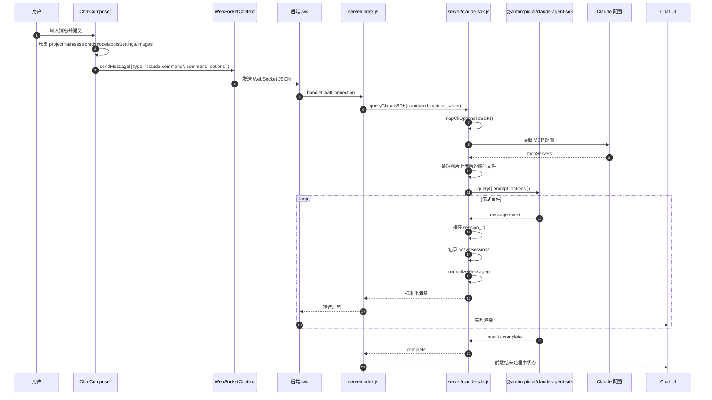
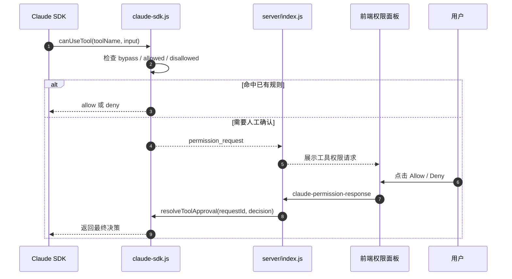
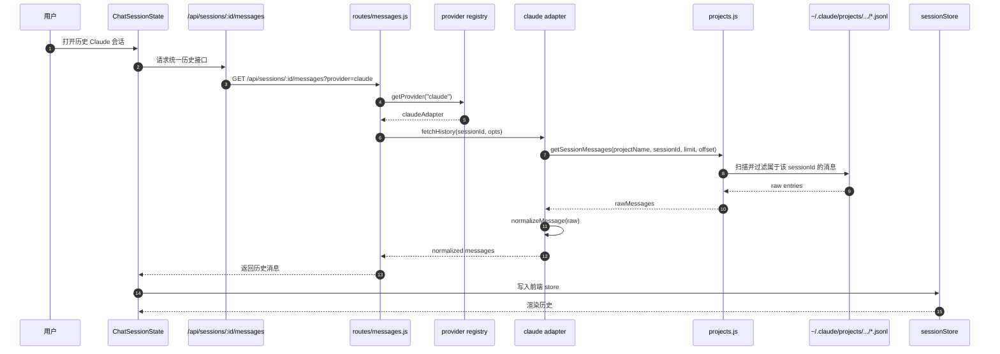
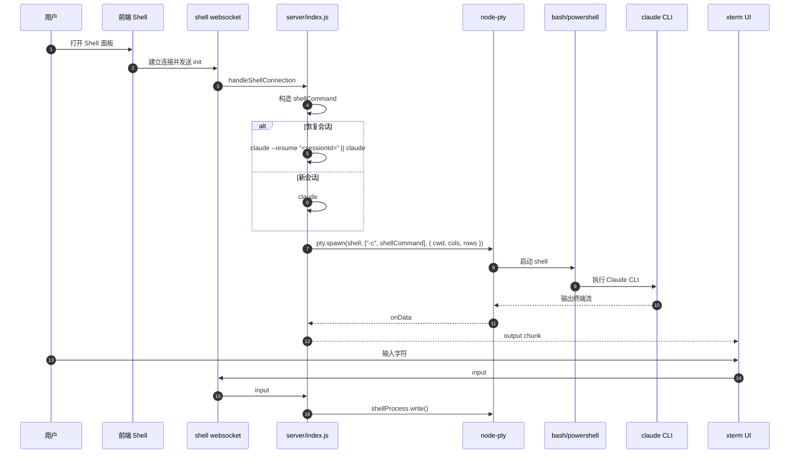
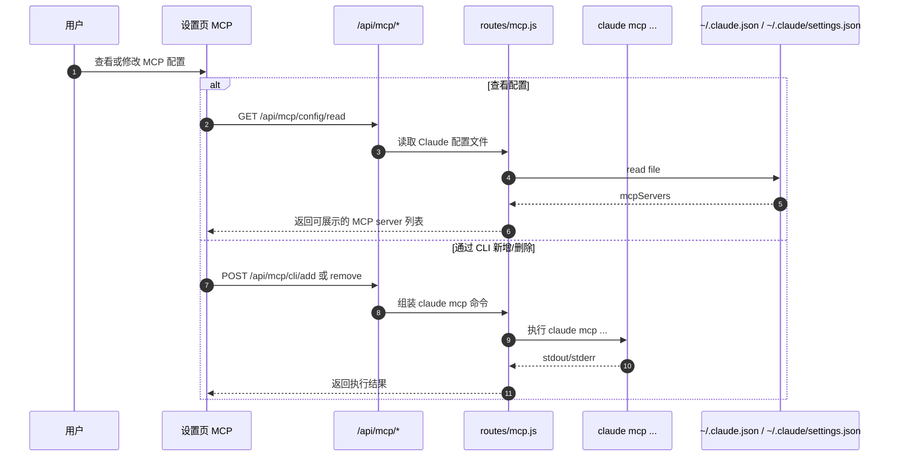

# Claude Code 对接方案说明

## 1. 文档目标

本文档用于说明当前项目是如何对接 `Claude Code` 的，重点回答下面几个问题：

- 前端聊天消息是如何进入后端的
- 后端是如何把请求转给 `Claude Code` 的
- 会话、权限、MCP、认证分别落在哪里
- Chat 面板与 Shell 面板接入 Claude 的区别是什么
- 如果后续要扩展、排障或重构，应该从哪些位置入手

这份文档基于当前仓库代码整理，面向后续维护和二次开发。

---

## 2. 总体架构

当前项目并不是自己直接调用 Anthropic 的普通 HTTP 对话接口，而是把本机或运行环境中的 `Claude Code` 作为底层执行层，然后在外面包了一层：

- Web UI
- WebSocket 实时通信
- 会话发现与历史读取
- 工具权限交互
- MCP 配置管理
- Shell / PTY 透传

可以把它理解成：

> `CloudCLI UI = Claude Code 的可视化控制层 + 会话管理层 + 统一消息适配层`

其中，Claude 相关能力分成两条主链路：

1. `Chat 面板`
   - 通过 `@anthropic-ai/claude-agent-sdk` 调用
   - 适合结构化消息、权限弹窗、工具调用展示、token 状态展示

2. `Shell 面板`
   - 通过 PTY 启动真实 `claude` 命令
   - 更接近原生终端使用体验

---

## 3. 关键组件总览

### 3.1 前端

- `src/components/chat/hooks/useChatComposerState.ts`
  - 聊天输入提交入口
  - 决定发送 `claude-command`
- `src/contexts/WebSocketContext.tsx`
  - 统一聊天 WebSocket 连接
- `src/components/chat/hooks/useChatSessionState.ts`
  - 聊天消息加载、会话状态恢复、实时消息合并
- `src/components/shell/hooks/useShellConnection.ts`
  - Shell 面板连接逻辑

### 3.2 后端

- `server/index.js`
  - WebSocket 总入口
  - 区分 chat websocket 和 shell websocket
- `server/claude-sdk.js`
  - Claude Chat 主集成层
  - 直接对接 `@anthropic-ai/claude-agent-sdk`
- `server/providers/claude/adapter.js`
  - Claude 消息标准化适配器
- `server/providers/claude/status.js`
  - Claude 安装状态、认证状态检查
- `server/projects.js`
  - 从 `~/.claude/projects` 读取 Claude 会话历史
- `server/routes/mcp.js`
  - Claude MCP 配置读取与 `claude mcp` 命令桥接
- `server/routes/messages.js`
  - 统一历史消息读取接口
- `server/providers/registry.js`
  - Provider 注册中心，Claude/Cursor/Codex/Gemini 共用

### 3.3 外部依赖与运行时资源

- `@anthropic-ai/claude-agent-sdk`
  - Chat 面板的主要 Claude 接入方式
- `claude` CLI
  - Shell 面板及 MCP CLI 管理依赖
- `~/.claude/projects/.../*.jsonl`
  - Claude 会话历史
- `~/.claude/.credentials.json`
  - Claude 登录态
- `~/.claude/settings.json`
  - Claude 环境变量、部分配置
- `~/.claude.json`
  - 当前 SDK 运行时 MCP 配置读取来源之一

---

## 4. Chat 面板对接 Claude Code 的完整方案

### 4.1 核心结论

Chat 面板对接 Claude 的主方式是：

1. 前端把聊天请求通过 WebSocket 发给后端
2. 后端调用 `server/claude-sdk.js`
3. `server/claude-sdk.js` 使用 `@anthropic-ai/claude-agent-sdk` 执行查询
4. SDK 返回的实时事件被标准化后再推回前端
5. 会话历史后续从 `~/.claude/projects` 中重新读取

这条链路没有直接自己拼 Anthropic HTTP 请求，而是走官方 Claude Agent SDK。

### 4.2 详细时序图



### 4.3 前端入口

前端发送 Claude 请求的入口在：

- `src/components/chat/hooks/useChatComposerState.ts`

主要逻辑：

- 读取当前选中的 provider
- 如果 provider 是 `claude`
- 则发送：

```ts
sendMessage({
  type: 'claude-command',
  command: messageContent,
  options: {
    projectPath,
    cwd,
    sessionId,
    resume,
    toolsSettings,
    permissionMode,
    model,
    sessionSummary,
    images,
  },
})
```

这说明前端不会直接调用 Claude API，而是把 Claude 执行参数整体交给后端。

### 4.4 WebSocket 层

聊天面板复用统一 WebSocket：

- `src/contexts/WebSocketContext.tsx`

职责：

- 建立 `/ws` 连接
- 自动带上认证 token
- 收到后端 JSON 后更新 `latestMessage`
- 提供 `sendMessage()` 供聊天面板发送请求

这意味着前端和后端之间的实时通信协议是项目自定义的 JSON 消息协议，而不是 SDK 原生协议。

### 4.5 后端聊天入口

后端入口在：

- `server/index.js`

`handleChatConnection()` 里会根据 `data.type` 分发：

- `claude-command` -> `queryClaudeSDK(...)`
- `codex-command` -> `queryCodex(...)`
- `cursor-command` -> `spawnCursor(...)`
- `gemini-command` -> `spawnGemini(...)`

这里说明 Claude 只是统一 provider 框架中的一个实现。

### 4.6 Claude SDK 执行层

核心文件：

- `server/claude-sdk.js`

这里做了几件关键事情：

#### A. 参数映射

`mapCliOptionsToSDK()` 会把前端参数映射成 SDK 可接受的格式：

- `cwd`
- `permissionMode`
- `allowedTools`
- `disallowedTools`
- `model`
- `resume`
- `systemPrompt = preset: claude_code`
- `settingSources = ['project', 'user', 'local']`

这一步非常关键，因为它决定了：

- Claude 在哪个项目目录下运行
- 是否恢复历史会话
- 是否启用 plan 模式
- Claude 是否加载 `CLAUDE.md`
- Claude 允许使用哪些工具

#### B. MCP 注入

`loadMcpConfig(cwd)` 会读取本地 Claude 配置，再把 MCP server 注入到 SDK options 中。

当前实现优先读取：

- `~/.claude.json`

并做下面两层合并：

- 全局 `mcpServers`
- 项目级 `claudeProjects[cwd].mcpServers`

#### C. 图片处理

当消息里有图片时，后端会先把 base64 图片落成临时文件，然后把这些图片路径拼进 prompt。

这意味着当前图片输入不是直接以多模态原生结构传入，而是通过“文件路径提示”的方式交给 Claude 使用。

#### D. 会话追踪

`activeSessions` 用于跟踪当前活跃中的 Claude SDK 查询实例，支持：

- 中断会话
- 重连后恢复 writer
- 查询当前 session 是否还在运行

#### E. 流式处理

`for await (const message of queryInstance)` 持续读取 SDK 事件流。

如果首次拿到 `message.session_id`：

- 记录真实 sessionId
- 把临时 session 替换成真实 session
- 向前端发送 `session_created`

随后每条消息都经过适配器标准化，再推送给前端。

---

## 5. 工具权限与交互式工具方案

### 5.1 目标

Claude Code 运行过程中会触发工具调用。当前项目希望做到：

- 支持默认允许/拒绝
- 支持前端弹窗确认
- 支持记住规则
- 支持交互型工具无限等待

### 5.2 当前实现方式

在 `server/claude-sdk.js` 中，通过 `sdkOptions.canUseTool` 实现工具权限拦截。

执行逻辑大致如下：

1. Claude SDK 请求调用某个 tool
2. 后端检查：
   - `permissionMode`
   - `allowedTools`
   - `disallowedTools`
3. 如果不能直接判定，就生成 `permission_request`
4. 通过 WebSocket 把权限请求发给前端
5. 前端用户点击 Allow / Deny
6. 再发回 `claude-permission-response`
7. 后端 `resolveToolApproval(requestId, decision)`
8. Claude SDK 恢复执行

### 5.3 专项时序图



### 5.4 特殊工具

当前被认为是需要“无限等待”的交互式工具包括：

- `AskUserQuestion`
- `ExitPlanMode`

这说明项目已经考虑到 Claude 运行中可能主动向用户提问，而不是单纯同步执行。

---

## 6. 历史会话与消息回放方案

### 6.1 核心结论

当前项目不会只依赖内存中的实时消息，而是会在切换会话、刷新页面、恢复历史时，直接从 Claude 的本地会话文件中重新加载。

Claude 历史会话来源：

- `~/.claude/projects/<projectName>/*.jsonl`

### 6.2 历史读取时序图



### 6.3 关键处理细节

在 `server/projects.js` 中，历史读取会做这些事情：

- 扫描项目目录下所有 `.jsonl`
- 排除 `agent-*.jsonl` 主文件
- 逐行解析 JSON
- 只保留 `entry.sessionId === 当前 sessionId` 的消息
- 如果存在 subagent / task agent 结果，会额外读取 `agent-*.jsonl`
- 把子代理工具历史挂载回主消息
- 最后按时间排序并分页返回

这意味着：

- 会话历史的“权威来源”是 Claude 自己写下来的 JSONL
- CloudCLI UI 更像一个读取和展示层
- 即使前端刷新，只要底层 Claude 会话文件还在，历史就能恢复

---

## 7. Claude 消息标准化方案

### 7.1 为什么需要适配器

Claude SDK 的事件格式，和前端期望的统一消息格式不完全一致。

项目为了支持多个 provider，定义了统一消息模型：

- `text`
- `thinking`
- `tool_use`
- `tool_result`
- `stream_delta`
- `stream_end`
- `error`
- `complete`
- `permission_request`
- `session_created`

### 7.2 Claude 适配器职责

文件：

- `server/providers/claude/adapter.js`

适配器负责把以下内容转换为统一消息：

- Claude SDK 的实时流式事件
- Claude JSONL 历史消息
- 工具调用与工具结果
- thinking 内容
- 子代理工具结果

这样前端就不用关心 Claude 原始格式，只处理项目自己的标准结构。

### 7.3 这层设计的价值

主要价值有三点：

1. 统一前端渲染协议
2. 让 Claude/Codex/Cursor/Gemini 共用一套聊天 UI
3. 方便后续替换底层 provider 接入方式

---

## 8. Shell 面板对接 Claude 的方案

### 8.1 核心结论

Shell 面板不是走 `claude-agent-sdk`，而是通过 `node-pty` 启动一个真实的 `claude` 命令行进程。

所以它更接近：

- 本地终端中的 Claude Code
- 完整 CLI 交互
- 逐字符流输出

### 8.2 时序图



### 8.3 Chat 与 Shell 的本质区别

| 维度 | Chat 面板 | Shell 面板 |
|---|---|---|
| Claude 接入方式 | `@anthropic-ai/claude-agent-sdk` | 真实 `claude` CLI 进程 |
| 输出形式 | 标准化消息对象 | 纯终端字符流 |
| 权限拦截 | 后端可控，支持前端审批 | 由 CLI 原生交互主导 |
| 会话恢复 | SDK session + 历史 JSONL | `claude --resume` |
| 前端展示 | 结构化聊天 UI | 终端 UI |
| 更适合 | 可视化聊天、工具展示、权限弹窗 | 终端原生操作 |

---

## 9. Claude 认证状态方案

### 9.1 目标

前端需要知道：

- Claude 是否已安装
- Claude 是否已登录
- 如果没登录，缺的是什么

### 9.2 当前实现

文件：

- `server/providers/claude/status.js`
- `server/routes/cli-auth.js`

状态检查分两步：

#### A. 安装检查

通过下面方式检查：

- 如果设置了 `CLAUDE_CLI_PATH`，就用该路径
- 否则默认找 `claude`
- 执行 `claude --version`

#### B. 登录检查

按优先级检查：

1. `process.env.ANTHROPIC_API_KEY`
2. `~/.claude/settings.json` 中的 `env`
3. `~/.claude/.credentials.json` 中的 OAuth 信息

前端则通过：

- `/api/cli/claude/status`

拿到状态结果。

### 9.3 方案价值

这保证了 UI 显示的是“本地 Claude 实际可用状态”，而不是项目自己维护的一份独立登录态。

---

## 10. MCP 对接方案

### 10.1 当前设计目标

项目希望做到：

- UI 中可查看 MCP 配置
- UI 中可新增/删除 MCP server
- Claude 运行时能吃到这些 MCP 配置

### 10.2 当前是两套入口并存

#### A. 运行时读取入口

`server/claude-sdk.js`

用途：

- Claude SDK 发起查询前，读取 MCP 配置并传给 SDK

当前读取位置：

- `~/.claude.json`

#### B. 管理端配置入口

`server/routes/mcp.js`

用途：

- `claude mcp list`
- `claude mcp add`
- `claude mcp add-json`
- 直接读取配置文件

当前兼容读取：

- `~/.claude.json`
- `~/.claude/settings.json`

### 10.3 时序图



### 10.4 当前值得注意的点

当前 MCP 设计是可用的，但存在一个值得后续统一的地方：

- SDK 运行时读取偏向 `~/.claude.json`
- 管理接口同时兼容 `~/.claude.json` 和 `~/.claude/settings.json`

如果未来 Claude 官方配置格式继续演进，建议把这块统一到一个集中配置解析模块里，避免不同入口读取规则不一致。

---

## 11. Provider 抽象设计

虽然你的问题是 Claude Code，但当前项目实际上已经做成了统一 provider 架构。

文件：

- `server/providers/registry.js`
- `server/routes/messages.js`

这套设计的特点是：

- 每个 provider 都有：
  - adapter
  - status checker
- 前端统一发 websocket command
- 后端按 provider 分发
- 历史消息统一从 `/api/sessions/:id/messages` 获取

Claude 只是其中一个 provider 实现。

这意味着当前 Claude 集成并不是硬编码在整个系统里的，而是放在“可扩展 provider 框架”里运行。

---

## 12. 当前方案的优势

### 12.1 高复用 Claude 现有生态

项目直接复用：

- Claude CLI
- Claude Agent SDK
- Claude 会话文件
- Claude 登录状态
- Claude MCP 配置

好处是：

- 不需要自己重新实现一套 Claude 代理层
- 与用户现有 Claude 环境一致
- 本地已有会话可以直接被 UI 发现

### 12.2 前端展示能力强

因为中间加了一层标准化协议，所以能做出：

- thinking 面板
- tool use 展示
- permission request 面板
- token budget 状态
- 子代理工具链路展示

这比单纯终端透传更适合 Web UI。

### 12.3 支持多 provider 共存

Claude 不会和 Codex/Cursor/Gemini 的接入逻辑耦死。

---

## 13. 当前方案的局限与风险

### 13.1 MCP 配置源有分叉

如前面所说：

- 一部分逻辑读 `~/.claude.json`
- 一部分逻辑兼容 `~/.claude/settings.json`

这容易导致：

- UI 看到的 MCP 配置
- 实际 SDK 运行使用的 MCP 配置

在某些情况下不完全一致。

### 13.2 图片输入方案较“工程化”

当前图片不是直接以 Claude 多模态原生结构传给 SDK，而是：

- 保存到临时文件
- 在 prompt 里附上路径

这虽然实用，但后续如果 SDK 原生支持更稳定的图像输入结构，建议升级到原生模式。

### 13.3 Chat 与 Shell 是两套接入路径

优点是灵活，缺点是维护成本更高：

- Chat 走 SDK
- Shell 走 CLI

如果后续 Claude 行为升级，两边可能出现细微差异，需要分别兼容。

### 13.4 历史文件读取成本

`server/projects.js` 当前是扫描 JSONL 文件并逐行解析。

当项目会话量变大时，可能出现：

- 首次加载延迟变高
- 大量分页时 I/O 成本上升

后续如果历史规模继续增大，可以考虑引入缓存索引层。

---

## 14. 后续优化建议

### 14.1 建议一：统一 Claude 配置解析入口

新增一个集中模块，例如：

- `server/providers/claude/config.js`

职责统一为：

- 读取 `~/.claude.json`
- 读取 `~/.claude/settings.json`
- 决定优先级
- 输出统一结构：
  - mcpServers
  - env
  - project overrides

这样可以让：

- 状态检查
- MCP 管理
- SDK 注入

都走同一个入口。

### 14.2 建议二：抽离 Claude Runtime 层

把 `server/claude-sdk.js` 继续拆分为：

- `runtime`
- `permissions`
- `attachments`
- `notifications`
- `session-tracking`

当前文件已经承担了较多职责，后续改动会越来越重。

### 14.3 建议三：统一 Chat 与 Shell 的 session 语义

虽然两者现在都能 resume，但仍属于两条实现路径。

后续可以整理一份统一 session 模型，明确：

- 哪些 sessionId 来自 SDK
- 哪些来自 CLI
- 哪些来自前端临时 session
- 刷新/重连/中断时如何映射

### 14.4 建议四：为历史消息增加索引或缓存

适用于大规模会话场景。

目标：

- 减少全文件扫描
- 加快历史分页
- 降低 agent 文件关联成本

---

## 15. 排障指南

如果 Claude 接入出了问题，建议按下面顺序排查。

### 15.1 前端发送是否正常

看：

- `useChatComposerState.ts`
- 浏览器 websocket 是否成功连上 `/ws`
- 是否实际发出了 `claude-command`

### 15.2 后端是否收到命令

看：

- `server/index.js` 中 chat websocket 日志
- 是否进入 `queryClaudeSDK(...)`

### 15.3 Claude 是否安装

看：

- `/api/cli/claude/status`
- `server/providers/claude/status.js`

### 15.4 Claude 是否已认证

检查：

- `ANTHROPIC_API_KEY`
- `~/.claude/settings.json`
- `~/.claude/.credentials.json`

### 15.5 MCP 是否注入成功

检查：

- `server/claude-sdk.js` 的 `loadMcpConfig()`
- `/api/mcp/config/read`
- `claude mcp list`

### 15.6 历史消息是否存在

检查：

- `~/.claude/projects/<projectName>/`
- 对应 sessionId 是否出现在 `.jsonl` 中

### 15.7 权限请求是否卡住

检查：

- 后端是否发出了 `permission_request`
- 前端是否发回 `claude-permission-response`
- `requestId` 是否一致

---

## 16. 推荐维护视角

后续维护时，建议把 Claude 集成拆成 5 个观察层次去理解：

1. `入口层`
   - 前端发什么
   - WebSocket 收到什么

2. `执行层`
   - SDK / CLI 到底怎么调用 Claude

3. `协议层`
   - Claude 原始消息如何转成统一消息

4. `状态层`
   - session / permission / reconnect 如何维护

5. `持久化层`
   - 历史会话从哪里读
   - 配置从哪里读

这样看代码会清晰很多。

---

## 17. 最终结论

当前项目对接 `Claude Code` 的方案可以概括为：

- `Chat 面板` 通过 `@anthropic-ai/claude-agent-sdk` 驱动 Claude
- `Shell 面板` 通过 PTY 启动真实 `claude` 命令
- `历史会话` 直接从 `~/.claude/projects` 读取
- `认证状态` 直接检查 Claude 本地安装和登录态
- `MCP` 通过 Claude 配置文件与 `claude mcp` 命令共同管理
- `前端展示` 基于统一消息协议，不直接暴露 Claude 原始格式

这是一个“深度复用 Claude 本地生态”的方案，而不是重新发明一套 Claude 后端。

从维护角度看，这套设计是合理且成熟的；从演进角度看，后续最值得优化的是：

- 配置源统一
- Claude runtime 拆分
- 历史消息读取优化
- Chat/Shell session 语义进一步统一

---

## 18. 关键文件索引

- [package.json](/Users/zhangjianan/Downloads/claudecodeui-main/package.json)
- [src/components/chat/hooks/useChatComposerState.ts](/Users/zhangjianan/Downloads/claudecodeui-main/src/components/chat/hooks/useChatComposerState.ts)
- [src/contexts/WebSocketContext.tsx](/Users/zhangjianan/Downloads/claudecodeui-main/src/contexts/WebSocketContext.tsx)
- [src/components/shell/hooks/useShellConnection.ts](/Users/zhangjianan/Downloads/claudecodeui-main/src/components/shell/hooks/useShellConnection.ts)
- [server/index.js](/Users/zhangjianan/Downloads/claudecodeui-main/server/index.js)
- [server/claude-sdk.js](/Users/zhangjianan/Downloads/claudecodeui-main/server/claude-sdk.js)
- [server/providers/claude/adapter.js](/Users/zhangjianan/Downloads/claudecodeui-main/server/providers/claude/adapter.js)
- [server/providers/claude/status.js](/Users/zhangjianan/Downloads/claudecodeui-main/server/providers/claude/status.js)
- [server/projects.js](/Users/zhangjianan/Downloads/claudecodeui-main/server/projects.js)
- [server/routes/messages.js](/Users/zhangjianan/Downloads/claudecodeui-main/server/routes/messages.js)
- [server/routes/mcp.js](/Users/zhangjianan/Downloads/claudecodeui-main/server/routes/mcp.js)
- [server/routes/cli-auth.js](/Users/zhangjianan/Downloads/claudecodeui-main/server/routes/cli-auth.js)
- [server/providers/registry.js](/Users/zhangjianan/Downloads/claudecodeui-main/server/providers/registry.js)

