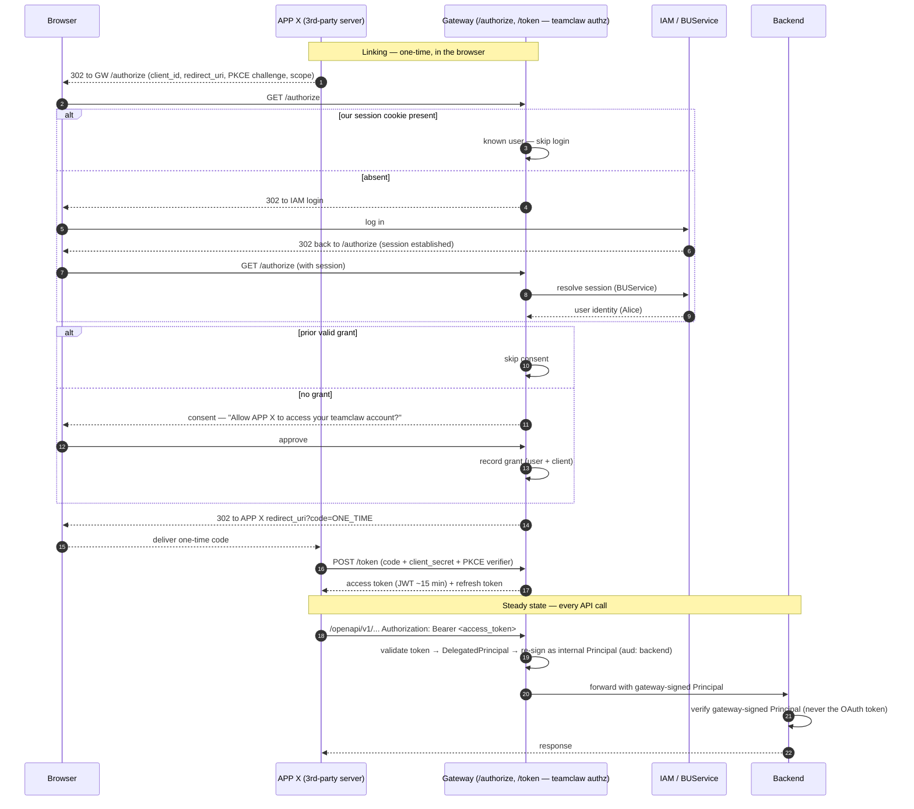

# Delegated Access ("Login with Avernet") — System Flow

**Status:** Draft / for team review
**Date:** 2026-07-25
**Component:** `src/gateway` (teamclaw authorization server; public host `https://teamclawgw-pre.alipay.com`)
**Scope:** The end-to-end system flow for a third-party server acting on behalf of one of our end users — corp and community — plus the token/consent model and the decided-vs-open agenda.
**Related:** [`README.md`](./README.md) (the approach), `src/gateway/docs/2026-07-21-auth-design.md` (§7.1 signed Principal, §8 claims, §15 delegated mint).

> 中文版见 [`SYSTEM-FLOW.zh-CN.md`](./SYSTEM-FLOW.zh-CN.md)。

---

## 1. The decision in one paragraph

We keep the **one-token, consent-based** target: a third-party server presents **exactly one** credential per API call (a bearer access token), never a first-party session cookie. The end user is authenticated **once**, interactively, and grants **explicit, revocable consent**. We build this as **"Login with Avernet"**: *we* are the OAuth 2.0 authorization server (Authorization Code + PKCE); we mint our **own** teamclaw-audience token behind our **own** consent screen; the upstream login provider is used **only** to authenticate the human. Same clean architecture in corp and community — the only difference is which provider handles the human-login step.

## 2. Core principle — authentication ≠ authorization

These are orthogonal axes, and conflating them is what produces the anti-pattern in §3.

- **Login (authentication)** = *proving who the human is.* Done by an upstream provider (corp: IAM/BUService; community: Google/OIDC). Its job ends at "this browser belongs to person P."
- **Consent (authorization)** = *granting an app access to a resource.* The resource is **teamclaw's agent service**, so the consent always names **teamclaw**, and **we** render it.

The login provider does **not** determine what the consent is about. Log in via Google, IAM, or a password — the resource the app gets access to is still teamclaw, so the consent still names teamclaw. **We are the authorization server; we are not an OAuth consumer of someone else's authorization.**

> Framing for the team: *"We build our own OAuth authorization server; we don't rely on an external OAuth provider. We only reuse existing login for the authenticate-the-human step."* Say **"no OAuth federation,"** not "no OAuth" — the client-facing leg is textbook OAuth (auth-code + PKCE), and we want it to be: standard client libraries, and PKCE + one-time code keep the token out of browser history and stop an intercepted code from being usable. That protection is about the untrusted third-party client, so it applies to **corp too**.

## 3. Why not the anti-pattern (the crux the team flagged)

The **token-passthrough / confused-deputy** anti-pattern. The fault line is **architecture, not which IdP** you use:

- **Anti-pattern (reject):** the *third-party app* is the IdP's OAuth client. The user consents to *the app* on (say) Google; the app receives a **Google-audience** token and **forwards it to teamclaw**. Teamclaw was never named, never consented to, and receives a foreign-audience token. This is *identical in shape to forwarding today's `IAM_TOKEN`* — the very thing this effort exists to remove. You can build this with BUService just as easily as with Google.
- **Clean (adopt):** *we* are the IdP's client (for the human-login step only) and *we* mint a **teamclaw-audience** token behind *our own* consent. Nothing foreign-audience is forwarded; the user explicitly authorizes teamclaw.

**Discriminator — who is the login provider's OAuth client?** If it's **us** (and we mint our own token) → clean. If it's the **third-party app** (and it forwards the provider's token) → anti-pattern. The extra redirect in the clean design is **not** overhead — it is what carries the teamclaw-specific consent and produces a teamclaw-audience token.

## 4. What the consent screen says

Exactly two things are named:

1. **APP X** = the third-party application (the OAuth **client**, `client_id`), shown by its **registered display name**. Requires **client registration** as a prerequisite (developer registers → `client_id` + `client_secret` + display name + allowed `redirect_uri`s). APP X is the partner's app, **not** teamclaw.
2. **The teamclaw account** = the user's resource-owning principal on our platform (what the tc API serves; in code today `owner_user_id` / `caller_user_id`, and the token's `sub`).

So the consent reads: **"Allow [APP X] to access your teamclaw account and act on your behalf?"** — never "your Google account" / "your IAM account." A consent that said "your Google account" would *be* the anti-pattern.

> Analogy: this is exactly "Sign in with Google" on Notion. You log into Notion *with* Google, but a third-party integration's consent says "access your **Notion** workspace," never "your Google account." **teamclaw = Notion, Google/IAM = the login doorway, APP X = the integration.**

## 5. Corp flow

Human-login provider = **IAM / BUService**. Often no login redirect, because the session already exists.



## 6. Community flow (nested OAuth)

Human-login provider = **Google / OIDC**. Same structure as corp, but the login step is itself an OAuth flow — so there are **two nested OAuth flows**, and we play opposite roles in each:

| | Outer flow | Inner flow |
|---|---|---|
| Parties | APP X ↔ **us** | **us** ↔ Google |
| Our role | **authorization server** | **client / relying party** |
| Purpose | authorization (access teamclaw) | authentication (who is the human) |
| Token produced | our **tc-audience** access + refresh → **to APP X** | Google id/token → **consumed by us, never forwarded** |

```mermaid
sequenceDiagram
    autonumber
    participant B as Browser
    participant X as APP X (3rd-party server)
    participant GW as Gateway (teamclaw authz server + Google OAuth client)
    participant G as Google / OIDC
    participant BE as Backend

    Note over X,GW: OUTER flow start — APP X ↔ us (authorization)
    X-->>B: 302 to GW /authorize (client_id, redirect_uri, PKCE, scope)
    B->>GW: GET /authorize
    alt our session cookie present
        GW->>GW: known user — skip to consent
    else absent — INNER flow start (us ↔ Google, authentication)
        GW-->>B: 302 to Google (we are Google's OAuth client; minimal identity scopes)
        B->>G: authenticate (+ first-time Google consent "teamclaw wants basic profile")
        G-->>B: 302 back to us with code
        B->>GW: deliver Google code
        GW->>G: exchange code for Google identity
        G-->>GW: Google id/token (stays with us; never forwarded)
        GW->>GW: account-link google-sub → our user #N (create if new); set our session cookie
    end
    alt prior valid grant
        GW->>GW: skip consent
    else no grant
        GW-->>B: consent — "Allow APP X to access your teamclaw account?"
        B->>GW: approve
        GW->>GW: record grant (user + client)
    end
    GW-->>B: 302 to APP X redirect_uri?code=ONE_TIME
    B-->>X: deliver one-time code
    X->>GW: POST /token (code + client_secret + PKCE verifier)
    GW-->>X: access token (JWT ~15 min) + refresh token
    Note over X,BE: Steady state — identical to corp (§5)
```

The **two redirects** the team mentioned = (1) APP X → our `/authorize`, and (2) our `/authorize` → Google. The inner Google OAuth does **not** reintroduce the anti-pattern precisely because **we** are Google's client (not APP X), and the Google token never reaches APP X.

### Two consents in community (and why it's fine)

- **Inner (Google's UI):** "teamclaw wants your Google profile" — *authentication* consent; shown **once** and remembered by Google; usually invisible for returning users.
- **Outer (our UI):** "APP X wants your teamclaw account" — *authorization* consent.

Different purposes → not redundant. This is the ubiquitous "Sign in with Google + third-party app authorization" stack. **Corp collapses the inner one** (IAM SSO isn't a user-facing "share with teamclaw" consent, and the session often already exists), so corp usually shows only the outer consent. The double-consent is a **community-only, mostly-first-time** artifact.

## 7. Session & identity model (community; the pattern is general)

- The **session cookie** is a browser↔us credential, scoped to **our** domain. The **third-party app never sees it** (it only ever gets the auth code / tokens).
- The cookie resolves to **our session → our user**, via a **session manager** (server-side session store keyed by an opaque id, or stateless verification of a signed cookie). We do **not** re-consult Google per request.
- The **Google → our-user** mapping is a **one-time account-linking** step at login, then persisted. Google is the doorway, consulted once.
- A **"teamclaw account"** is the user's resource-owning principal on our platform. Federated login doesn't erase it — it **maps into** it (`google-sub` or `IAM staffId` → our user, who owns bots/agents/data).

## 8. Token & consent model

Client-facing **access token** — signed JWT, ~15 min, validated **only at the gateway edge**. Claims (per auth-design §8):

```
iss: teamclaw-authz
aud: teamclaw-openapi        # client-facing audience
sub: <our user id/staffId>   # the consented human — attribution/consent ONLY
tnt: <tenant id>             # the CLIENT's tenant (app's developer_org)
azp: <client_id>             # the acting third-party app
org: <developer_org_id>      # resource-ownership anchor
scope: <granted scope>
exp / iat / jti
```

- **Refresh token** — long-lived, server-to-server, mints new access tokens without user interaction. (Rotation + reuse detection is a later slice.)
- **Two distinct credentials — never conflate** (auth-design §8.1): the client-facing **access token** vs. the internal **forwarded Principal** (§7.1, seconds-lived, `aud: <specific backend>`, gateway-signed, verified by the backend). The backend **never** sees the OAuth token; every strategy (`first_party_user` / `app_key` / `oauth_bearer`) collapses to "verify one gateway-signed Principal." The gateway **re-signs** the `DelegatedPrincipal` into that internal Principal before forwarding.
- `oauth_bearer` registers as one **strategy alternative** in `route_security.yaml`.
- `/authorize`, `/token`, `/revoke`, and the consent UI are **gateway-local** — they must be **excluded from the config-driven forwarding catch-all** (like `/health` / `/docs`), or they'd be denied as an unknown domain (PR #420 alignment).

### Decided: scope & revocation (MVP)

- **Scope → a single all-encompassing scope for now.** No taxonomy; consenting to an app grants the whole surface. Keep a `scope` claim so a real taxonomy can drop in later without redesign.
- **Revocation → pure JWT.** Revoke immediately kills the grant, the consent record, and the refresh path (no new access tokens). An already-issued access token remains valid until it expires → stated access-path revocation latency **≤ ~15 min** (accepted). No introspection / hot-path revocation check.

## 9. Caller-token (downstream) mint — a non-blocking dependency, not an OAuth open question

When a bot runtime calls BaaS/MCP **as the user**, it mints a downstream Caller token — historically fed the user's live IAM token. This is **not** an OAuth-specific problem and is **not** a blocker for this design:

- Under the agreed gateway design the backend **already never sees the raw IAM token** — the gateway signs a Principal and forwards *that* (auth-design §7.1); components verify the gateway-signed Principal with `auth.mode=none`. That holds for the **first-party path too**, so the downstream mint is shared plumbing, not something OAuth surfaces.
- auth-design §15 already specifies the delegated mint via a **pre-authorized delegation credential** (the consent record), **not** a live IAM token.
- It's **service-bot-only for now**, and adapting the exchange authority to accept something other than an IAM token is **future, cross-team** work.
- The real exchange authority is an **enterprise adapter not in this repo** (community/local bindings return `unavailable` / `None`), so its exact behavior can't be verified from source — but it's the *same dependency the first-party path already carries*.

Track this as a downstream dependency owned by the auth workstream + the existing `CallerIdentityService` seam — not as an OAuth open question.

## 10. Corp vs community = one flavored seam, not two designs

Both flavors use the **same clean architecture** (we are the authz server; we mint our own tc-audience token behind our own consent). The **only** difference is the human-login provider:

- **Identity resolution** = the bare/sofa-flavored SPI seam (**corp/sofa** = BUService; **community/bare** = Google/OIDC). Cf. auth-design §15's `SubjectTokenResolver`.
- **Token issuance + consent** = shared core, flavor-independent.

## 11. Why we are not forced back to the two-token passthrough

- **Option A (build our own authz server / login-with-avernet)** has **no external dependency** — it needs only (i) our own `/authorize` + consent + `/token`, (ii) the human-login we already run, (iii) minting our own JWTs. **Always achievable by us alone**, and **the design we build** in both flavors — for the reasons below.
- **Option B (lean on the IdP as teamclaw's authz server) is not on the table** — but for *different reasons per flavor*, and neither reason is "unverified capability":
  - **Corp (BUService):** a **category mismatch**. BUService is an **authentication** service — it verifies the human and resolves identity — **not a third-party OAuth authorization server**: it does not register third-party OAuth clients, run a third-party consent flow, or issue **teamclaw-audience** tokens. So we build our **own** authz server *on top of* BUService, using it only for the authenticate-the-human step. B isn't a missing feature we're waiting on.
  - **Community (Google):** a **design choice**. Google *can* act as an OAuth authorization server, so this isn't a capability limit — we **choose** to use Google as an **OIDC sign-in (authentication) only** and build our own authz server, keeping community's architecture identical to corp and avoiding Google-specific resource/scope registration.
- **Option C (forward a generic provider token to tc)** = the anti-pattern; rejected.
- Reverting to `IAM_TOKEN` passthrough is therefore **not a technical necessity** (A is always buildable, and is the design). It would be a **conscious prioritization decision** to accept a known anti-pattern (with compensating controls) — a business call, not an engineering dead-end.

## 12. Decided vs. Open (review agenda)

**Decided**

- One-token, consent-based target; we are the OAuth **authorization server** (auth-code + PKCE), not an OAuth consumer.
- Anti-pattern avoided by owning consent + minting a **tc-audience** token; login provider is authentication only.
- Consent names **APP X** (registered client) + **the teamclaw account**.
- Corp IdP = BUService; community IdP = Google/OIDC (inner nested OAuth).
- Same clean design for both; IdP is the only flavored difference.
- Single all-encompassing scope for now; **pure JWT** revocation (≤ ~15 min access latency).
- Caller-token/downstream mint **de-scoped** (service-bot-only; future cross-team).
- **Build A (our own OAuth authorization server) is decided for both flavors.** **Corp:** BUService is an *authentication* service, not a third-party OAuth authorization server, so we build our own authz server on top of it (BUService only authenticates the human) — a category fit, not a pending capability. **Community:** a *design choice* to use Google as OIDC sign-in only and build our own authz server (uniform with corp; no Google-specific resource/scope registration). Option B (lean on the IdP) is off the table — corp by category, community by choice.

**Open — needs the team**

1. **Proceed vs. defer:** since Option B is off the table, the only alternative to building A is a *documented* acceptance of the passthrough anti-pattern — not a lighter clean option to wait for. A is always buildable, so this is a prioritization call.
2. **Consent lifetime & re-consent triggers** (expiry; what re-prompts). With a single scope there is no "new scope requested" trigger yet.

---

### Note on status

The SDD spec started for this was **reverted off the config-driven-forwarding branch (PR #420)**; the delegated-access work is parked pending the team decision in §12. Nothing here changes PR #420.
