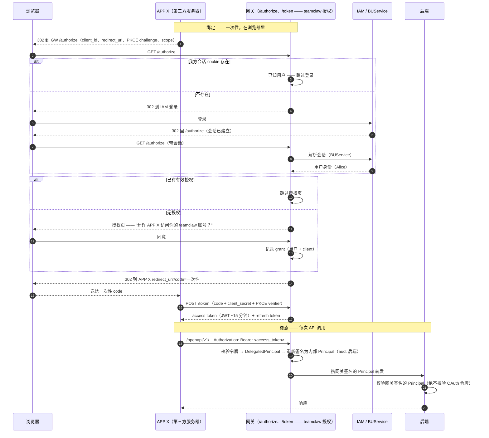
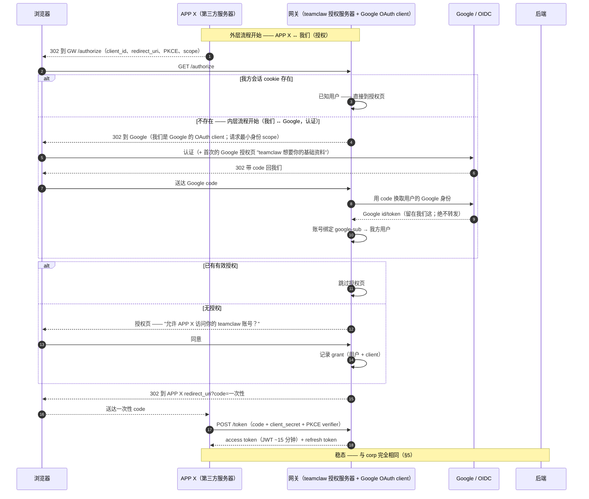

# 委托访问（"用 Avernet 登录"）—— 系统流程

**状态：** 草案 / 待团队评审
**日期：** 2026-07-25
**组件：** `src/gateway`（teamclaw 授权服务器；对外域名 `https://teamclawgw-pre.alipay.com`）
**范围：** 第三方服务器代表我方终端用户的端到端系统流程 —— corp 与 community —— 外加令牌/授权模型与"已定 vs 待议"议程。
**关联：** [`README.zh-CN.md`](./README.zh-CN.md)（方案），`src/gateway/docs/2026-07-21-auth-design.md`（§7.1 签名 Principal、§8 claims、§15 委托签发）。

> English version: [`SYSTEM-FLOW.md`](./SYSTEM-FLOW.md)。

---

## 1. 一段话结论

我们保持**单令牌、基于授权（consent）**的目标：第三方服务器每次 API 调用出示**恰好一个**凭证（bearer access token），绝不带第一方会话 cookie。终端用户只**交互式认证一次**，并给出**显式、可撤销的授权**。我们把它建成 **"用 Avernet 登录"**：**我们**是 OAuth 2.0 授权服务器（授权码 + PKCE）；在**我们自己的**授权页背后签发**我们自己的** teamclaw-audience 令牌；上游登录提供方**仅**用于认证真人。corp 与 community 用同一套干净架构 —— 唯一差异是由谁承担真人登录这一步。

## 2. 核心原则 —— 认证 ≠ 授权

两者是正交的轴，把它们混为一谈正是 §3 反模式的成因。

- **登录（认证 Authentication）** = *证明这个真人是谁。* 由上游提供方完成（corp：IAM/BUService；community：Google/OIDC）。其职责止于"这个浏览器属于人 P"。
- **授权（Authorization / consent）** = *授予某 App 访问某资源。* 资源是 **teamclaw 的 agent 服务**，因此授权始终指向 **teamclaw**，且由**我们**渲染。

登录提供方**不**决定授权是关于什么的。用 Google、IAM 或密码登录 —— App 拿到访问权的资源仍是 teamclaw，因此授权仍指名 teamclaw。**我们是授权服务器；我们不是别人授权的 OAuth 消费者。**

> 给团队的表述：*"我们自建 OAuth 授权服务器；不依赖外部 OAuth 提供方。仅在'认证真人'这一步复用既有登录。"* 说**"不做 OAuth 联邦（federation）"**，而非"不用 OAuth" —— 面向 client 的这条腿就是标准 OAuth（授权码 + PKCE），而且我们希望如此：标准客户端库，加上 PKCE + 一次性 code，把令牌挡在浏览器历史之外，并让被截获的 code 无法使用。该防护针对不可信的第三方 client，因此**对 corp 同样适用**。

## 3. 为什么不走反模式（团队点出的关键）

**令牌透传 / 混淆代理（token-passthrough / confused-deputy）**反模式。断层在于**架构，而非用哪个 IdP**：

- **反模式（拒绝）：** *第三方 App* 是 IdP 的 OAuth client。用户在（比如）Google 上授权给*该 App*；App 拿到**Google-audience** 令牌并**转发给 teamclaw**。teamclaw 从未被指名、从未被授权，却收到一个异 audience 令牌。这与今天转发 `IAM_TOKEN` *形态完全相同* —— 正是本工作要消除的东西。用 BUService 一样能搭出这个反模式，不比 Google 难。
- **干净（采纳）：** *我们*是 IdP 的 client（仅为真人登录这一步），并在*我们自己的*授权背后签发 **teamclaw-audience** 令牌。不转发任何异 audience 令牌；用户显式授权 teamclaw。

**判别式 —— 谁是登录提供方的 OAuth client？** 若是**我们**（且我们签发自己的令牌）→ 干净。若是**第三方 App**（且它转发提供方的令牌）→ 反模式。干净设计里那多出来的一次跳转**不是**开销 —— 它正是承载 teamclaw 专属授权、并产出 teamclaw-audience 令牌的一步。

## 4. 授权页说什么

只指名两样东西：

1. **APP X** = 第三方应用（OAuth **client**，`client_id`），以其**注册的展示名**显示。前置要求是**client 注册**（开发者注册 → `client_id` + `client_secret` + 展示名 + 允许的 `redirect_uri`）。APP X 是合作方的 App，**不是** teamclaw。
2. **teamclaw 账号** = 用户在我方平台上的资源归属主体（tc API 服务的对象；今天代码里是 `owner_user_id` / `caller_user_id`，以及令牌的 `sub`）。

因此授权页写的是：**"允许 [APP X] 访问你的 teamclaw 账号并代表你行事？"** —— 绝不是"你的 Google 账号" / "你的 IAM 账号"。若写成"你的 Google 账号"，那就**是**反模式。

> 类比：这正是 Notion 上的"用 Google 登录"。你*用* Google 登录 Notion，但第三方集成的授权页写的是"访问你的 **Notion** 工作区"，绝不是"你的 Google 账号"。**teamclaw = Notion，Google/IAM = 登录门，APP X = 集成。**

## 5. Corp 流程

真人登录提供方 = **IAM / BUService**。常常没有登录跳转，因为会话已存在。



## 6. Community 流程（嵌套 OAuth）

真人登录提供方 = **Google / OIDC**。结构同 corp，但登录这一步本身是一次 OAuth 流程 —— 于是有**两个嵌套的 OAuth 流程**，我们在各自里扮演相反角色：

| | 外层流程 | 内层流程 |
|---|---|---|
| 双方 | APP X ↔ **我们** | **我们** ↔ Google |
| 我们的角色 | **授权服务器** | **client / 依赖方** |
| 目的 | 授权（访问 teamclaw） | 认证（这个真人是谁） |
| 产出令牌 | 我方 **tc-audience** access + refresh → **给 APP X** | Google id/token → **由我们消费，绝不转发** |



团队提到的**两次跳转** = (1) APP X → 我方 `/authorize`，(2) 我方 `/authorize` → Google。内层的 Google OAuth **不会**重新引入反模式，恰恰因为 Google 的 client 是**我们**（不是 APP X），且 Google 令牌绝不到达 APP X。

### Community 里的两次授权（以及为何没问题）

- **内层（Google 的 UI）：** "teamclaw 想要你的 Google 资料" —— *认证*授权；**只**出现一次并被 Google 记住；对回访用户通常不可见。
- **外层（我方 UI）：** "APP X 想要你的 teamclaw 账号" —— *授权* consent。

目的不同 → 不冗余。这正是普遍的"用 Google 登录 + 第三方应用授权"栈。**corp 把内层折叠掉**（IAM SSO 不是面向用户的"分享给 teamclaw"授权页，且会话常已存在），故 corp 通常只显示外层授权。双授权是 **community 独有、且多为首次**的现象。

## 7. 会话与身份模型（以 community 为例；模式通用）

- **会话 cookie** 是浏览器↔我们的凭证，作用域限于**我方**域名。**第三方 App 永远看不到它**（它只拿到 auth code / 令牌）。
- cookie 解析为**我方会话 → 我方用户**，经由**会话管理器**（服务端会话存储、按不透明 id 索引；或对签名 cookie 做无状态校验）。我们**不**每次请求都再问 Google。
- **Google → 我方用户**的映射是登录时的**一次性账号绑定**，随后持久化。Google 是门，只问一次。
- **"teamclaw 账号"** 是用户在我方平台上的资源归属主体。联邦登录不会抹掉它 —— 而是**映射进**它（`google-sub` 或 `IAM staffId` → 我方用户，其拥有 bots/agents/data）。

## 8. 令牌与授权模型

面向 client 的 **access token** —— 签名 JWT，~15 分钟，**仅在网关边界**校验。claims（依 auth-design §8）：

```
iss: teamclaw-authz
aud: teamclaw-openapi        # 面向 client 的 audience
sub: <我方用户 id/工号>       # 被授权的真人 —— 仅用于归属/授权
tnt: <租户 id>               # CLIENT 的租户（App 的 developer_org）
azp: <client_id>             # 发起调用的第三方 App
org: <developer_org_id>      # 资源归属锚点
scope: <已授予 scope>
exp / iat / jti
```

- **refresh token** —— 长期、服务端直连、无需用户参与地签发新 access token。（轮换 + 重放检测是后续切片。）
- **两个截然不同的凭证 —— 切勿混淆**（auth-design §8.1）：面向 client 的 **access token** vs. 内部**转发的 Principal**（§7.1，秒级、`aud: <具体后端>`、网关签名、后端校验）。后端**永不**看到 OAuth 令牌；每种策略（`first_party_user` / `app_key` / `oauth_bearer`）都收敛为"校验一个网关签名的 Principal"。网关在转发前把 `DelegatedPrincipal` **重新签名**为该内部 Principal。
- `oauth_bearer` 在 `route_security.yaml` 里作为一个**策略候选**注册。
- `/authorize`、`/token`、`/revoke` 与授权界面是**网关本地**端点 —— 必须**排除在配置驱动转发的 catch-all 之外**（同 `/health` / `/docs`），否则会被当作未知域拒绝（PR #420 对齐）。

### 已定：scope 与撤销（MVP）

- **scope → 暂用单一全覆盖 scope。** 无词表；授权一个 App 即授予整个面。保留 `scope` claim，以便日后真正的词表无需重构即可接入。
- **撤销 → 纯 JWT。** 撤销立即杀死 grant、授权记录与 refresh 路径（不再签发新 access token）。已签发的 access token 存活到过期 → 明示的访问路径撤销时延 **≤ ~15 分钟**（可接受）。无内省 / 热路径撤销检查。

## 9. 下游 Caller 令牌签发 —— 非阻塞依赖，不是 OAuth 待议问题

当 bot runtime **以用户身份**调用 BaaS/MCP 时，会签发一个下游 Caller 令牌 —— 历史上喂给它用户的活跃 IAM 令牌。这**不是** OAuth 特有的问题，也**不是**本设计的阻塞项：

- 在既定的网关设计下，后端**本就看不到原始 IAM 令牌** —— 网关签一个 Principal 并转发*它*（auth-design §7.1）；各组件以 `auth.mode=none` 校验网关签名的 Principal。这对**第一方路径同样成立**，因此下游签发是共享管道，不是 OAuth 冒出来的问题。
- auth-design §15 已规定委托签发走**预授权委托凭证**（授权记录），**而非**活跃 IAM 令牌。
- 当前**仅限 service-bot**；让交换权威接受非 IAM 令牌之外的东西是**未来、跨团队**的工作。
- 真正的交换权威是**不在本仓库的企业适配器**（community/local 绑定返回 `unavailable` / `None`），故其确切行为无法从源码验证 —— 但这是*第一方路径本就背负的同一依赖*。

把它作为归属于 auth workstream + 既有 `CallerIdentityService` 接缝的下游依赖来跟踪 —— 而非 OAuth 待议问题。

## 10. corp vs community = 一个带 flavor 的接缝，不是两套设计

两种 flavor 用**同一套干净架构**（我们是授权服务器；在我们自己的授权背后签发自己的 tc-audience 令牌）。**唯一**差异是真人登录提供方：

- **身份解析** = bare/sofa flavor 的 SPI 接缝（**corp/sofa** = BUService；**community/bare** = Google/OIDC）。参见 auth-design §15 的 `SubjectTokenResolver`。
- **令牌签发 + 授权** = 共享核心，与 flavor 无关。

## 11. 为什么我们没有被迫退回两令牌透传

- **方案 A（自建授权服务器 / login-with-avernet）** **无外部依赖** —— 只需 (i) 我们自己的 `/authorize` + 授权 + `/token`，(ii) 我们本就在跑的真人登录，(iii) 签发我们自己的 JWT。**永远可由我们独立达成。** 它是底线 —— **是保底基线，且在下方问题被回答前，就是当前的工作设计**。
- **方案 B（借 antbuservice / Google 当授权服务器）** —— *为了少建而做的优化*，仅当该提供方能签发 **tc-audience、tc-consented** 令牌（即充当 teamclaw 的*授权*服务器，不止 SSO 透传）才可行。**未确认** —— 这是待议的工作量问题（§12），且该提供方的能力**无法从本仓库得知**（§9）。回答它时要注意的区分：*"能签 SSO/登录令牌吗？"* = 能（正是我们已在用、且保留的登录步骤），*"能当 teamclaw 的授权服务器吗？"* = 这才是真正待答的问题。在它被回答前，**方案 A 是工作设计**。
- **方案 C（把通用提供方令牌转发给 tc）** = 反模式；拒绝。
- 因此退回 `IAM_TOKEN` 透传**不是技术必然**（A 永远可建）。那将是一个**有意识的优先级决定** —— 接受一个已知反模式（配合补偿控制），是业务判断，而非工程死路。

## 12. 已定 vs. 待议（评审议程）

**已定**

- 单令牌、基于授权的目标；我们是 OAuth **授权服务器**（授权码 + PKCE），不是 OAuth 消费者。
- 通过自持授权 + 签发 **tc-audience** 令牌规避反模式；登录提供方仅做认证。
- 授权页指名 **APP X**（注册 client）+ **teamclaw 账号**。
- corp IdP = BUService；community IdP = Google/OIDC（内层嵌套 OAuth）。
- 两者同一套干净设计；IdP 是唯一带 flavor 的差异。
- 暂用单一全覆盖 scope；**纯 JWT** 撤销（访问时延 ≤ ~15 分钟）。
- Caller 令牌 / 下游签发**移出范围**（仅 service-bot；未来跨团队）。
- **方案 A 是当前工作设计 / 保底基线**（两种 flavor；我们始终能自建）。是否存在更轻的路径是下方的工作量问题 —— 而非可行性阻塞。

**待议 —— 需团队**

1. **A vs B（工作量）：** antbuservice（corp）/ Google（community）能否充当签发 **tc-audience、tc-consented** 令牌的授权服务器？*能* → 更轻的路径（B）；*不能* → 建 A。**无论如何 A 是保底基线**，故这决定的是工作量，而非可行性。该提供方的能力**无法从本仓库得知**（§9），故需团队 / IdP 负责方确认，而非读源码。
2. **推进 vs 推迟：** 若团队判断当下不值得优先做这个干净修复，替代是*有据可查地*接受透传反模式 —— 而非"我们别无选择"。（方案 A 始终可建，故这是优先级判断。）
3. **授权有效期与重新授权触发**（过期；何时重新弹窗）。单一 scope 下暂无"申请新 scope"触发。

---

### 状态说明

为此起草的 SDD spec 已**从配置驱动转发分支（PR #420）回退**；委托访问工作暂停，等待 §12 的团队决定。本文不改动 PR #420。
